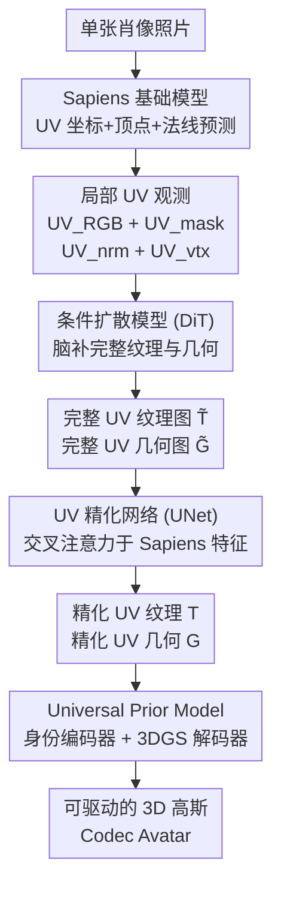

# FiCA: Feed-forward Instant Gaussian Codec Avatars from a Single Portrait Image

**会议**: ECCV 2026  
**arXiv**: [2606.24232](https://arxiv.org/abs/2606.24232)  
**项目页**: https://kim-youwang.github.io/FiCA  
**代码**: 无  
**领域**: 3D视觉  
**关键词**: 3D高斯头像, Codec Avatar, 扩散模型, 前馈生成, 单张肖像

## 一句话总结
FiCA 通过串联 Sapiens 人体基础模型、条件扩散模型和可学习的 UV 精化网络，以纯前馈方式从单张自然肖像照片在 5 秒内生成可实时驱动的、高保真 3D 高斯 Codec Avatar。

## 研究背景与动机

高保真人脸虚拟化身是 VR/AR 沉浸式远程临场体验的核心技术，但其生成流程至今仍十分繁琐、难以普及。当前的主流管线要么依赖多视角精密标定棚（多相机阵列+高密度采集），质量虽高但设备成本极高；要么改用手机单目视频采集，再用离线人脸追踪（需数小时）和逐身份测试时微调（如 UPM 管线）来补偿缺失的 3D 信息——尽管 Cao 等人提出的 Universal Prior Model (UPM) 将单目视频输出的化身质量提升到了实用级别，但离线追踪和微调的门槛仍然让普通用户难以触及。另一边，纯单图方法如 PanoHead 虽只需一张照片，却只能生成不可动画的静态结果，且每张照片仍需约 80 秒的 GAN 反演优化，质量上还存在多视角不一致和飞絮伪影。

这些方案共同暴露了核心矛盾：**可驱动化身的生成需要完整推断被遮挡区域（口腔内部、下颌-颈部间隙、头发等），但单张图像提供的视觉信息极其有限、且包含大量噪声**。已有方法依靠多视图观测或多帧追踪来补全信息，本质上是用「采集/追踪的时间成本」交换「缺失信息的推理」。那么问题就变成了——能否把「补全缺失信息」本身做成一个前馈的、端到端的生成问题，让模型从海量高质量化身资产中学会从部分观测「想象」出完整的纹理和几何，从而完全绕过逐身份的优化和追踪？

本文的核心想法是：将单图化身生成拆解为三个串联的前馈阶段，各自发挥不可替代的作用。**核心 idea：先用人体基础模型 Sapiens 从单张照片提取局部 UV 观测（RGB、法线、顶点坐标、可见性掩码），然后用条件扩散模型以这些局部观测和 CLIP 语义嵌入为条件「脑补」出完整的 UV 纹理和几何，再经一个可学习的 UV 精化网络修正像素级错位，最后把精化后的网格送入 Universal Prior Model 解码为可实时驱动的 3D 高斯 Codec Avatar——全过程 5 秒、无需任何离线追踪或逐身份优化。**

## 方法详解

### 整体框架

FiCA 是一个纯前馈的模块化流水线。输入是一张自然肖像照片，输出是一组可被任意表情参数实时驱动的 3D 高斯原语。整条管线按功能分为四个依次串联的阶段：视觉观测提取 → 生成式补全 → 精化对齐 → 高斯解码。其中前三个阶段是本文的核心贡献，第四阶段复用已有的 UPM 架构。

### 关键设计

**1. 条件扩散模型生成完整 UV 纹理与几何**

这是 FiCA 最核心的设计。给定单张肖像，仅凭像素信息无法推断被遮挡区域（口腔内部、下颌-颈部间隙、侧后脑）的纹理和几何——现有方法靠多帧追踪或逐身份优化来补全，FiCA 则把这个问题转化为一个条件生成问题。它先利用 Sapiens 模型（微调版本）从单张图像预测每像素的 UV 坐标、顶点坐标和表面法线，再通过这些预测将像素 RGB、法线、顶点坐标反投到 UV 空间，得到四张局部 UV 图：`UV_partial = [UV_RGB, UV_mask, UV_nrm, UV_vtx]`。同时提取输入图像的 CLIP 语义嵌入。然后，一个基于 DiT 架构的潜空间扩散模型以局部 UV 图 + CLIP 嵌入为条件，通过条件流匹配（Conditional Flow Matching）目标联合生成完整的 UV 纹理图 T̃ 和 UV 几何图 G̃（均为 512×512×3），并复用 SDXL VAE 做 8× 压缩。这里的关键在于：扩散模型在大规模高质量头部 3D 资产（含多视角棚采和手机采集共约 1.4 万身份）上训练，其任务不是「修复局部的 inpainting」——因为 Sapiens 的预测本身在自遮挡区域就不可靠——而是从带噪的部分观测中「想象」出完整且合理的纹理和几何。为确保两域训练效率，模型采用域切换标记（domain switcher）让同一个 DiT 同时处理纹理域和几何域的生成。

**2. 前馈 UV 精化网络修复像素级错位**

扩散模型生成的网格已大致合理，但肉眼可察觉渲染图与输入照片之间存在像素级错位（肤色偏差、纹理模糊、服饰细节丢失）。为了保真度和身份保持，传统方案需要做逐身份的测试时优化（如 UPM 管线的微调），但 FiCA 用一个可学习的前馈网络替代了这一流程。该网络采用 UNet 架构并引入交叉注意力层：以扩散生成的初始 UV 纹理图 T̃ 和几何图 G̃ 为输入，分别在交叉注意力中以 Sapiens ViT 编码器提取的**输入照片**特征和**渲染网格图**特征为条件，输出精化后的 T 和 G。其训练目标混合了图像空间的 L1 光度损失、2D 关键点损失、分割掩码损失，以及 UV 空间的拉普拉斯正则化损失，防止精化网络只对可见部分过拟合而丢失扩散模型「脑补」出的合理内容。推理时，输入照片的掩码由现成的人体抠图模型获得，表情参数可由轻量回归器（如 EMOCA）估计，无需任何额外手工介入。

**3. Universal Prior Model 解码 3D 高斯化身**

FiCA 复用并改进了 UPM 架构中的 3D 高斯化身解码管线。核心思想是：精化后的 UV 纹理图 T 和几何图 G 作为身份编码信号，通过一个 CNN 超网络生成身份相关的偏置图 Ψ_id，这些偏置图调制 3DGS 解码器各层的特征变换。解码器接收偏置图 + 驱动信号（表情编码 e、视角方向 v、视线方向 g），输出一组 3D 高斯原语的属性：`{δx, δc, q, s, o}`，分别表示相对网格表面的位置偏移、颜色偏移、旋转、尺度和不透明度。之所以用 3D 高斯而不是纯网格，是因为 3DGS 在表达精细细节（皮肤纹理、发丝、眼镜）时效率极高，且支持实时重渲染。与原始 UPM 相比，FiCA 将训练语料从 255/345 个身份扩展到 1,927 个身份，并将光度损失从线性色空间切换到 RGB 空间以兼容扩散模型生成的 RGB 纹理图。

### 损失函数 / 训练策略

扩散模型训练采用条件流匹配目标：$\mathcal{L}_{\text{diffusion}} = \|\mathbf{v}_t^{\text{T}} - \mathcal{F}_\theta(\mathbf{x}_t^{\text{T}}, \mathbf{f}_{\text{CLIP}}, \mathbf{UV}_{\text{partial}}, \mathbf{d}^{\text{T}}, t)\|_2^2 + \|\mathbf{v}_t^{\text{G}} - \mathcal{F}_\theta(\mathbf{x}_t^{\text{G}}, \mathbf{f}_{\text{CLIP}}, \mathbf{UV}_{\text{partial}}, \mathbf{d}^{\text{G}}, t)\|_2^2$，其中 superscripts T/G 标记纹理域和几何域。UV 精化网络训练使用 $\mathcal{L}_{\text{refine}} = \lambda_{\text{pho}}\mathcal{L}_{\text{pho}} + \lambda_{\text{mask}}\mathcal{L}_{\text{mask}} + \lambda_{\text{kpts}}\mathcal{L}_{\text{kpts}} + \lambda_{\text{reg}}\mathcal{L}_{\text{reg}}$，系数经验设为 λ_pho=2.0，λ_mask=0.5，λ_kpts=0.01，λ_reg=1.0。扩散模型在 64 张 A100 上训练约 2 天（5 万步，batch size 128），精化网络在 32 张 A100 上训练约 2 天。

## 实验关键数据

### 主实验

动画化身质量对比（16 个 held-out 身份，约 1,500 帧驱动视频，与 5 个最新单图/单目动画方法比较）：

| 指标 | GPAvatar | VOODOO 3D | Portrait4D-v1 | Portrait4D-v2 | GAGAvatar | FiCA/网格 | FiCA/3DGS |
|------|----------|-----------|---------------|---------------|-----------|----------|-----------|
| PSNR ↑ | 19.565 | 19.321 | 15.006 | 15.704 | 22.157 | 24.281 | **24.508** |
| SSIM ↑ | 0.7648 | 0.6983 | 0.3743 | 0.3871 | 0.7513 | 0.9625 | **0.9637** |
| LPIPS ↓ | 0.1915 | 0.2756 | 0.4138 | 0.3765 | 0.1320 | 0.1381 | **0.1365** |
| ID-CSIM ↑ | 0.3166 | 0.4339 | 0.2135 | 0.2545 | 0.3522 | 0.5233 | **0.5867** |

FiCA 在所有指标上超越或持平竞品，尤其在 SSIM 和 ID-CSIM（身份保持余弦相似度）上大幅领先，说明生成的化身在身份保真度和像素级对齐上优势显著。

### 消融实验

扩散模型条件配置 + 精化网络的分步消融（100 个 iPhone 采集 held-out ID）：

| 配置 | UV_RGB | UV_nrm+vtx | f_CLIP | 精化网络 | PSNR ↑ | SSIM ↑ | LPIPS ↓ |
|------|--------|-------------|--------|----------|--------|--------|---------|
| 仅 RGB UV | ✓ | - | - | - | 19.504 | 0.8140 | 0.1806 |
| +几何线索 | ✓ | ✓ | - | - | 19.644 | 0.8164 | 0.1667 |
| +CLIP 语义 | ✓ | ✓ | ✓ | - | 19.738 | 0.8431 | 0.1648 |
| +精化网络 | ✓ | ✓ | ✓ | ✓ | **22.282** | **0.8804** | **0.1569** |

### 关键发现

- 精化网络带来最大跳升（PSNR +2.54），说明「生成→精化」两级设计对单图任务非常关键：扩散模型负责全局合理的脑补，精化网络负责局部像素级对齐。
- UV 几何线索（法线+顶点坐标）带来的提升小于精化网络，但视觉上对几何合理性至关重要（无几何线索时身份偏移严重）。
- CLIP 语义嵌入帮助保留了场景级细节（如连帽衫的兜帽纹理），但不影响几何。
- FiCA 对极端表情、侧脸角度和不同肤色均展示了良好的泛化性，得益于大规模训练语料（棚采+手机采集）和 Sapiens 人体基础模型的强先验。

## 亮点与洞察

- **生成+精化两级串联**是巧妙的设计选择：扩散模型负责全局结构和被遮挡区域的合理「想象」（这是生成模型擅长的），精化网络负责像素级对齐（这是判别式/回归模型擅长的），各自做各自最擅长的事，而非试图用单个模型同时做好两者。
- **用 UV 空间作为中介表示**使得不同渲染域（多视角棚采 vs 手机单目）的数据可以统一到同一表示空间，大幅扩展了训练语料的规模。
- **域切换标记（domain switcher）** 让单个 DiT 模型同时处理纹理和几何两个域的生成而不增加参数量，是一个工程上极实用的技巧。
- 从最终结果看，FiCA 的 3DGS 版本在身份保持（ID-CSIM 0.5867）上的巨大优势意味着跨身份表情驱动时依然能保持源身份的特征，这对远程临场应用至关重要。

## 局限与展望

- 对输入中的极端伪影（极暗光照、运动模糊、大角度侧脸）目前没有显式的鲁棒性设计，极限条件下扩散模型可能产生不合理的纹理。
- 眼镜等附件目前没有独立的双层纹理表示，作者指出从单张照片联合生成附件（如眼镜框）的纹理和几何是重要的未来方向。
- 训练成本极高：扩散模型和精化网络分别需要 64 张和 32 张 A100 训练约 2 天，UPM 更是需要 128 张 A100 训练约 3 周——对学术团队的可复现性构成挑战。
- 当前系统将网格作为中介表示，绕过了端到端从像素到 3DGS 的直接预测，未来是否可以跳过网格中介直接生成 3DGS 参数值得探索。

## 相关工作与启发

- **vs UPM [Cao et al., SIGGRAPH 2022]**：UPM 需要单目视频+离线追踪+微调，FiCA 完全前馈化，但代价是多了一个扩散模型做生成式补全。两条路线代表了精度 vs 速度的不同权衡。
- **vs PanoHead [An et al., CVPR 2023]**：PanoHead 只能用 3D-aware GAN 生成静态头像且不驱动，FiCA 支持实时表情驱动——核心差异在于 FiCA 用了网格+UPM 做显式驱动参数化，而非隐式的 tri-plane。
- **vs GAGAvatar [Chu & Harada, NeurIPS 2024]**：GAGAvatar 也做单图 3DGS 但通过神经网络渲染器模拟驱动而非真实 3DGIS 驱动，极端表情泛化性受限。FiCA 直接用 UPM 进行显式的 3D 高斯参数化，驱动更灵活。
- **vs FaceLift [Lyu et al., 2024]**：同时期工作，先生成多视角图像再预测 3DGS，但驱动方式是按帧估计而非参数化驱动，存在时序抖动。

## 评分
- 新颖性: ⭐⭐⭐⭐ [端到端前馈生成+精化两级设计是新范式，但每级组件（扩散/精化/UPNC）本身是已有技术的重新组合]
- 实验充分度: ⭐⭐⭐⭐⭐ [定量+定性+消融+跨数据集泛化 + in-the-wild 测试，非常完整]
- 写作质量: ⭐⭐⭐⭐⭐ [动机清楚、方法结构清晰、图/表/公式配合得当]
- 价值: ⭐⭐⭐⭐⭐ [大幅降低高品质化身生成的进入门槛，对 VR/AR 远程临场的实用价值显著]

<!-- RELATED:START -->

## 相关论文

- [\[ECCV 2026\] ViewSplat: View-Adaptive 3D Gaussian Splatting for Feed-Forward Synthesis](viewsplat_view-adaptive_3d_gaussian_splatting_for_feed-forward_synthesis.md)
- [\[CVPR 2025\] LUCAS: Layered Universal Codec Avatars](../../CVPR2025/3d_vision/lucas_layered_universal_codec_avatars.md)
- [\[CVPR 2026\] Pano3DComposer: Feed-Forward Compositional 3D Scene Generation from Single Panoramic Image](../../CVPR2026/3d_vision/pano3dcomposer_feed-forward_compositional_3d_scene_generation_from_single_panora.md)
- [\[ECCV 2026\] VolSplat: Rethinking Feed-Forward 3D Gaussian Splatting with Voxel-Aligned Prediction](volsplat_rethinking_feed-forward_3d_gaussian_splatting_with_voxel-aligned_predic.md)
- [\[CVPR 2025\] PERSE: Personalized 3D Generative Avatars from A Single Portrait](../../CVPR2025/3d_vision/perse_personalized_3d_generative_avatars_from_a_single_portrait.md)

<!-- RELATED:END -->
