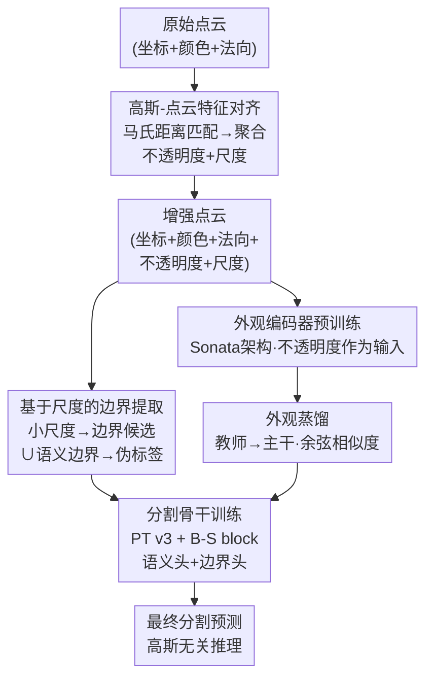

# G2P: Gaussian-to-Point Attribute Alignment for Boundary-Aware 3D Segmentation

**会议**: ECCV 2026  
**arXiv**: [2601.03510](https://arxiv.org/abs/2601.03510)  
**代码**: 待确认（项目页：[https://hojunking.github.io/webpages/G2P/](https://hojunking.github.io/webpages/G2P/)）  
**领域**: 3D 视觉  
**关键词**: 3D点云分割, 3D高斯泼溅, 几何偏差, 边界感知, 知识蒸馏

## 一句话总结
本文提出 G2P，通过马氏距离建立高斯-点云之间的精确对应关系，将 3D Gaussian Splatting 中的不透明度和尺度属性迁移到点云上，在保留原始点几何结构的同时引入外观线索，从而有效缓解几何形状相似但外观不同的物体的分割混淆问题。

## 研究背景与动机

点云语义分割是三维场景理解的核心任务之一。尽管 MinkUNet、OctFormer、Point Transformer v3 等架构在分割精度上不断突破，点云固有的稀疏性和不规则采样迫使模型过度依赖粗略的几何线索，形成所谓的几何偏差（geometric bias）。具体来说，在室内场景中，门、窗、冰箱等物体往往与墙面共面或紧邻墙面，点云对这些区域只能提供几乎相同的几何信息，缺乏颜色、纹理、材质等外观证据来区分。例如，冰箱的反射表面和白色墙面在几何上几乎不可区分，纯几何模型常将它们误分类为同一平面。

现有工作尝试从两个方向缓解这一问题。边界感知方法（如 JSENet、CBL、BFANet）通过显式学习边缘特征来细化分割边界，但它们仍然局限于几何推理，无法引入外观信息来区分几何相似但外观不同的物体。2D-3D 融合方法（如 VMVF、ODIN）则试图借助 RGB 图像注入丰富的视觉特征，但点云的离散分布和 2D 投影之间的结构错位导致细线结构难以与平面区分，遮挡区域还会产生投影信息丢失和点-像素对齐误差。这些根本性的结构不对齐使得 2D-3D 融合难以在原生 3D 空间中真正统一几何与外观信息。

3D Gaussian Splatting（GS）为解决这一问题提供了新的视角。GS 将场景表示为各向异性高斯原语的集合，每个高斯携带连续体积极几何与外观属性，且与点云共享同一 3D 坐标系。然而，GS 在优化过程中通过自适应密度控制（剪枝、克隆、分裂）改变了高斯的位置分布，导致高斯原语偏离原始点云的几何结构，直接使用高斯坐标点进行分割反而会引入几何畸变和边界模糊。本文的核心 insight 是：**保持原始点云的精确几何作为输入，仅将 GS 导出的不透明度和尺度属性作为辅助线索，通过精心设计的高斯-点云对应关系注入到点表征中，实现在不破坏几何精度的前提下引入外观信息和边界线索。**

## 方法详解

### 整体框架

G2P 整体分为两个阶段。第一阶段是准备阶段（preparation stage），包括三个子步骤：（1）高斯-点云特征对齐：对每个点，基于马氏距离在半径范围内搜索最近的 k 个高斯原语，以各向异性协方差加权的逆距离聚合其不透明度和尺度属性，得到增强后的点表征；（2）基于高斯尺度的边界伪标签提取：利用聚合后的尺度分布（小尺度集中在物体边界、大尺度覆盖平坦区域）提取尺度边界候选，再与语义边界取并集生成边界伪标签；（3）外观编码器预训练：用增强后的点（坐标+颜色+不透明度）从头训练一个基于 Sonata 架构的外观编码器。第二阶段是训练阶段：以 PT v3 为主干网络，同时预测语义分割和边界图（边界头由伪标签监督），同时外观编码器作为教师网络通过余弦相似度蒸馏损失将外观特征知识传递给学生主干，整体以语义损失、边界损失、蒸馏损失三项联合优化。

### 关键设计

**1. 协方差感知的高斯-点云特征对齐**

高斯原语经过自适应密度优化后偏离了初始位置，直接使用高斯坐标会引入几何畸变和边界模糊；反之，如果能将高斯携带的外观属性迁移到原始点上、同时保留点的几何精度，就能兼得二者的优势。G2P 的核心机制是：对每个点 $p_i$，先在欧氏半径 $r^g$ 内筛选候选高斯，然后基于马氏距离（Mahalanobis distance）从候选集中选出最近的 k 个邻居。马氏距离的关键在于利用了高斯协方差矩阵 $\Sigma$ 的各向异性信息——它将高斯的旋转和尺度编码进距离度量，使得沿着高斯长轴方向的"远"和沿着短轴方向的"远"有不同的物理含义，比各向同性的欧氏距离更符合实际三维空间的邻近关系。对选出的 k 个邻居，用逆马氏距离归一化作为权重，加权聚合邻居的尺度 $S_j^g$ 和不透明度 $\alpha_j^g$：

$$S_i^p = \sum_{j=1}^{k} w_{ij} \cdot S_j^g, \quad \alpha_i^p = \sum_{j=1}^{k} w_{ij} \cdot \alpha_j^g$$

聚合完成后，每个点从 9 维（坐标+颜色+法向）扩展为 13 维（坐标+颜色+法向+尺度+不透明度）。消融实验表明，马氏距离优于欧氏距离，且 $k=20$ 是最优邻域规模。

**2. 基于高斯尺度的边界伪标签提取**

在室内场景中，物体边界往往表现为几何不连续，但对于共面物体（如嵌入式冰箱与墙面、窗户与墙壁），几何不连续性本身很弱。作者发现高斯尺度属性提供了一个天然的几何信号：各向异性高斯在优化过程中，小尺度的高斯会密集分布在物体边界和细结构附近以保持渲染精度，而大尺度高斯主导平坦区域。基于这一观察，G2P 对增强后的点云先排除背景类（墙、地板），然后计算每个点的尺度向量的 L2 模长 $\|S_i'\|_2$，丢弃模长最大的 $\eta$ 比例的点（相当于保留小尺度区域），得到基于尺度的边界候选集 $\mathcal{B}_{\text{scale}}$。但仅靠尺度可能被纹理或光度变化引入噪声，因此额外从语义标签导出语义边界 $\mathcal{B}_{\text{sem}}$（局部半径 $r^s$ 内存在异类标签的点），二者取并集作为最终的边界伪标签。这种方法无需人工标注边界，且尺度的无监督特性使其天然适用于未标注场景。

**3. 不透明度引导的外观蒸馏学习**

在训练阶段，G2P 不再依赖高斯原语，而是以纯点云为输入进行推理——这是一个"高斯无关"的设计。为了实现这一点，G2P 先走一条前置路线：在准备阶段用增强后的点表征 $( \mu^p, c, \alpha' )$（法向被不透明度替换）从头训练一个基于 Sonata 架构的外观编码器。不透明度在这里充当了"视图一致的外观置信度信号"：墙面、地板等背景区域在多视角下始终可见，因此不透明度均匀较高；前景物体的不透明度则因几何复杂度和自遮挡呈现多样分布。训练阶段中，外观编码器冻结作为教师网络，PT v3 主干提取的特征经过一个 MLP 映射层 $\phi$ 后，与教师特征计算余弦相似度损失：

$$\mathcal{L}_{\text{distill}} = \frac{1}{N} \sum_{i=1}^N \left(1 - \frac{\phi(f_i^p) \cdot f_i^a}{\|\phi(f_i^p)\|_2 \|f_i^a\|_2}\right)$$

该蒸馏损失与语义分割损失（交叉熵 + Lovász-softmax）、边界监督损失（BCE + Dice）共同优化。消融实验表明，蒸馏方式优于直接将增强后的特征作为主干输入或微调外观编码器，这是因为蒸馏允许主干"学会"外观区分模式，而非简单地依赖额外输入通道。

### 损失函数 / 训练策略

整体损失为三项加权和：$\mathcal{L}_{\text{total}} = \mathcal{L}_{\text{sem}} + \lambda_b \mathcal{L}_{\text{bou}} + \lambda_d \mathcal{L}_{\text{distill}}$，其中 $\lambda_d=0.4$、$\lambda_b=0.9$。主干的训练在单张 RTX 3090 上执行 800 个 epoch，batch size 为 4，优化器为 AdamW（初始学习率 0.003）。外观编码器在 A6000 上每个数据集单独预训练 400 epoch。高斯对齐参数：搜索半径 $r^g=0.06$m，邻居数 $k=20$，尺度修剪比 $\eta=0.7$，语义边界半径 $r^s=0.04$m。

## 实验关键数据

### 主实验

| 数据集 | 指标 | PT v3 (基线) | BFANet | UniPre3D | G2P (本文) | 提升 |
|--------|------|-------------|--------|----------|-----------|------|
| ScanNet v2 (mIoU) | 20类 | 77.5 | 78.0 | 77.6 | **78.4** | +0.9 vs PT v3 |
| ScanNet200 (mIoU) | 200类 | 35.2 | — | 36.0 | **36.6** | +1.4 vs PT v3 |
| ScanNet200 (OA) | 200类 | 83.6 | — | 83.7 | **83.8** | +0.2 |
| ScanNet++ (mIoU) | 100类 | 47.9 | — | — | **48.7** | +0.8 |
| Matterport3D (mIoU) | 21类 | 55.5 | — | — | **55.9** | +0.4 |

| 方法 | 几何可区分类 (Avg) | 几何挑战类 (Avg) | 冰箱 IoU | 浴帘 IoU |
|------|-------------------|------------------|----------|----------|
| PT v3 | 84.5 | 66.8 | 64.9 | 68.9 |
| BFANet | 84.7 | 67.3 | 69.3 | 70.8 |
| **G2P** | **85.8** | **69.2** | **70.9** | **76.1** |

### 消融实验

| 配置 | mIoU | 说明 |
|------|------|------|
| PT v3 基线 | 77.0 | 纯几何基线 |
| + 边界监督 (Boundary only) | 77.8 | 仅加 GS 尺度边界伪标签 |
| + 外观蒸馏 (Distillation only) | 77.8 | 仅加 GS 不透明度蒸馏 |
| G2P (Full) | **78.4** | 两者联合最优 |

| 对齐度量 | mIoU | 说明 |
|---------|------|------|
| 欧氏距离 | 77.0 | 忽略各向异性 |
| 马氏距离 (k=10) | 77.4 | 邻居数不足 |
| **马氏距离 (k=20)** | **78.4** | 最优折中 |
| 马氏距离 (k=30) | 77.9 | 邻居过多导致过平滑 |

### 关键发现

- 在两个几何挑战类上提升最大：冰箱 IoU 比 PT v3 高 +6.0，浴帘 +7.2，说明 GS 外观线索确实能帮助区分几何相似但外观不同的物体
- 边界监督和外观蒸馏各自都能独立带来 +0.8 mIoU 的提升，且二者互补性良好；蒸馏权重 $\lambda_d$ 增大时外观挑战类提升但几何类略有下降，$0.4$ 是一个好的平衡点
- 推理时 G2P 仅增加 0.2M 参数量（+0.4%），推理延迟 +21%、显存 +74%，训练阶段开销更大（延迟 +67%、显存 +30%），但由于推理时无需 GS 参与，在实际应用中是可以接受的
- G2P 在 ScanNet200 的 Tail 类别上取得最佳表现（20.2 mIoU），且在实例分割中也带来增益（mAP25 +1.7）

## 亮点与洞察

- **用 GS 属性而非 GS 几何**：前人将高斯原语直接用于分割时，往往受限于高斯优化后的几何漂移。G2P 聪明地将 GS 的"不透明度和尺度"当作辅助属性而非替代输入，守住了原始点云的几何精度底线。
- **马氏距离代替欧氏距离**：一个简单但有效的 trick——高斯是各向异性的椭圆体，用欧氏距离找邻居会忽略其形状信息。马氏距离将协方差矩阵融入距离度量，使匹配结果更贴合真实场景的邻近关系（论文消融验证了 +1.4 mIoU 的差距）。
- **尺度作为无监督边界信号**：GS 优化过程中，小尺度高斯自然聚集在物体边界附近以保真渲染，这一现象被本文直接复用于边界提取，无需任何人工标注，且与语义边界互补。
- **不透明度蒸馏替代 2D-3D 融合**：不同于 ODIN 等需要 2D 投影的复杂管线，G2P 在原生 3D 空间内完成外观线索的注入和蒸馏，彻底规避了投影不对齐问题。

## 局限与展望

- 当前依赖离线准备阶段（GS 重建 + 外观编码器预训练），限制了对室外场景的扩展——室外场景的动态光照、大尺度变化和稀疏视角使得 GS 重建不稳定，需要局部归一化的尺度统计或更鲁棒的 GS 方法。
- 训练阶段的额外开销较大（显存 7.3G vs PT v3 的 5.6G），对于需要快速迭代的大规模场景不太友好。不过推理时 GS 可完全剥离，适合离线建图场景。
- 论文验证的室内数据集均来自 SceneSplat-7K 提供的 GS 重建，对室外场景和城市场景（如 SemanticKITTI、nuScenes）的适应性有待验证。
- 可能的改进方向包括：结合轻量级 GS 方法（如 DNGaussian、Speedy-Splat）降低准备阶段成本；探索将本文方案扩展到多模态设置或开放词汇语义分割。

## 相关工作与启发

- **vs BFANet / JSENet**：它们同样关注边界感知分割，但仅依赖几何不连续性做边界检测。G2P 用 GS 尺度信号补充了外观层级的信息，在共面物体等场景中优势明显。
- **vs ODIN / VMVF**：这些 2D-3D 融合方法需要 2D 特征投影，受投影不对齐和遮挡损失困扰。G2P 完全在 3D 空间内操作，无需投影，结构更简洁。
- **vs UniPre3D**：UniPre3D 也利用 GS 做预训练，但用渲染损失作为自监督信号，而非直接迁移属性。G2P 通过显式的高斯-点云对齐在 3D 监督下学习，语义更直接。
- **vs 直接使用 GS 坐标点分割**：论文消融显示直接用高斯坐标点（$\mu^g, c', n', \alpha$）只有 73.1 mIoU（远低于 PT v3 基线），说明高斯原语的位置偏移确实会严重破坏分割质量，间接证明了 G2P"保留点几何、嫁接 GS 属性"路线的必要性。

## 评分

- 新颖性: ⭐⭐⭐⭐ 将 GS 属性迁移到点云分割的思路新颖，马氏距离对齐和尺度边界提取的设计朴实但有效
- 实验充分度: ⭐⭐⭐⭐⭐ 在 ScanNet v2/200/++、Matterport3D 四个数据集上验证，包含详细消融（边界来源、对齐度量、损失权重、类组分析）
- 写作质量: ⭐⭐⭐⭐ 方法逻辑清晰，图表和类组分析让人直观理解改进来源，部分消融细节在补充材料中
- 价值: ⭐⭐⭐⭐ 直接可复用的特征增强方案，不改变主流分割推理管线（推理时无 GS 依赖），实用性强

<!-- RELATED:START -->

## 相关论文

- [\[CVPR 2026\] Geometry-Aware Cross-Modal Graph Alignment for Referring Segmentation in 3D Gaussian Splatting](../../CVPR2026/3d_vision/geometry-aware_cross-modal_graph_alignment_for_referring_segmentation_in_3d_gaus.md)
- [\[ECCV 2026\] TORA: Topological Representation Alignment for 3D Shape Assembly](tora_topological_representation_alignment_for_3d_shape_assembly.md)
- [\[CVPR 2026\] Tavatar: Topology-Aware Gaussian Attribute Derivation for Animatable Human Avatars](../../CVPR2026/3d_vision/tavatar_topology-aware_gaussian_attribute_derivation_for_animatable_human_avatar.md)
- [\[ECCV 2026\] BrepLLM: Enabling Large Language Models to Understand Boundary Representations](brepllm_enabling_large_language_models_to_understand_boundary_representations.md)
- [\[CVPR 2025\] 3D Dental Model Segmentation with Geometrical Boundary Preserving](../../CVPR2025/3d_vision/3d_dental_model_segmentation_with_geometrical_boundary_preserving.md)

<!-- RELATED:END -->
