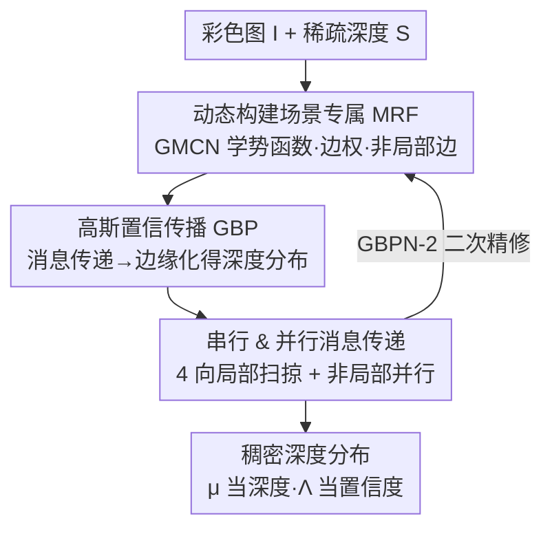

# Gaussian Belief Propagation Network for Depth Completion

**会议**: ECCV 2026  
**arXiv**: [2601.21291](https://arxiv.org/abs/2601.21291)  
**代码**: [https://github.com/kakaxi314/GBPN](https://github.com/kakaxi314/GBPN)  
**领域**: 3D视觉  
**关键词**: 深度补全, 置信传播, 马尔可夫随机场, 概率图模型, 稀疏深度

## 一句话总结
GBPN 把深度补全重新表述为「在一张由网络动态构建的马尔可夫随机场上做高斯置信传播」——网络不直接回归深度，而是学出 MRF 的势函数、边权和非局部边结构，再用可微的高斯 BP 迭代推理出稠密深度分布（均值当深度、精度当置信度），在 NYUv2 / KITTI 上达到 SOTA，尤其在极稀疏输入下鲁棒性远超纯回归网络。

## 研究背景与动机
深度补全要从一张彩色图加上稀疏、不规则的深度点（LiDAR、SfM 甚至用户点几个点）恢复出稠密深度图，稀疏点提供绝对尺度约束，彩色图提供结构与语义线索。传统方法靠手工流水线或固定的图模型（如带简单平滑势的 MRF），先验太死板，抓不住复杂几何和细节。近几年主流转向深度网络直接回归深度，精度大幅提升，但有一个反复被诟病的老问题：标准卷积架构天生不擅长处理稀疏且不规则的输入。稀疏点在特征图上是一堆散落的有效像素，卷积核在训练时见到的是「500 个点」的分布，一旦测试时点数变多或变少，输入分布漂移，网络性能就急剧下滑——文中实测 GuideNet、CFormer 这类方法在点数超过约 5000（训练用 500）时 REL 反而不降反升。

近来一条折中路线开始流行：把学习到的特征和传统的结构化推理缝在一起，比如 CSPN 系列用网络预测一个各向异性扩散过程的参数去精修回归结果，BP-Net 学一个类双边滤波的传播。但这些方法的传播范围仍然有限（局部/近邻扩散），信息从稀疏点扩散到远处未测量像素时衰减严重，极稀疏场景下依然会糊。核心矛盾在于：稀疏点的信息需要**全图范围**地可靠传播，而现有做法要么用专门的稀疏层去硬处理散点、要么把传播局限在小邻域，两头都不讨好。

本文的切入角度是把「稀疏点如何被处理」这件事从网络里彻底剥离出来，交给一个全局一致的概率框架。**核心 idea：不让网络回归深度，而让网络动态构建一张场景专属的 MRF（学势函数 + 学非局部边结构），再用高斯置信传播在这张图上做可微推理——稀疏点自然地作为 MRF 的数据项进入全局优化，深度沿整幅图传播，输出还自带置信度。**

## 方法详解

### 整体框架
GBPN 是一个「深度网络 + 概率图模型」的混合框架。输入是彩色图 $I$ 和投影到像平面的稀疏深度图 $S$（有效像素不规则分布、数量位置都可能大幅变化），输出是稠密深度的**高斯分布**——每个像素给出均值 $\mu_i$（当作预测深度）和精度 $\Lambda_i$（当作置信度）。

整条 pipeline 分两大件：一个**图模型构建网络（GMCN）**吃彩色图（可选地再吃上一轮的深度分布），预测出这张 MRF 的全部「零件」——一元势/成对势的参数（边权 $w$、期望深度差 $r$）、阻尼率 $\beta$、以及构建非局部边用的偏移量 $o$；然后一个**高斯置信传播（GBP）模块**在这张学出来的图上迭代做消息传递与置信更新，把稀疏点的约束沿整幅图传播开，收敛后读出每个像素的边缘分布。整个框架端到端训练，用一个基于概率的损失同时监督深度和精度。

论文还提供两档配置：**GBPN-1** 只用彩色图构建 MRF（单 U-Net）；**GBPN-2** 再加一个多模态融合 U-Net，把 GBPN-1 输出的深度分布 $(\mu_1,\Lambda_1)$ 和彩色图一起吃进去、用 cross-attention 融合，做二次精修。最终提交的 GBPN 指 GBPN-2。

### 关键设计

**1. 动态构建场景专属 MRF：把稀疏点变成图上的数据项**

传统 MRF 做深度补全时，边权 $w$ 靠颜色差之类的手工特征算、期望深度差 $r$ 直接设成 0（强制平滑），先验太粗，抓不住复杂几何。GBPN 用 GMCN 端到端地把这些参数**全部学出来并随迭代动态更新**：哪里测量可靠就在哪里加强数据约束，平滑约束则随图像内容自适应变化。这样做的关键收益是稀疏输入被**天然吸收**——MRF 的联合分布定义为

$$p(X\mid I,S)\propto\prod_{i\in\mathcal{V}_v}\phi_i\prod_{(i,j)\in\mathcal{E}}\psi_{ij}$$

其中一元势 $\phi_i=\exp(-\tfrac{w_i(x_i-s_i)^2}{2})$ 只对有测量的像素 $i\in\mathcal{V}_v$ 生效，用一个可学的置信权 $w_i$ 把估计深度往测量值 $s_i$ 拉；成对势 $\psi_{ij}=\exp(-\tfrac{w_{ij}(x_i-x_j-r_{ij})^2}{2})$ 鼓励相邻像素深度差接近期望差 $r_{ij}$。稀疏点就这样以数据项的身份进入全局优化，完全不需要为处理散点单独设计网络层——这正是它对稀疏度、噪声都鲁棒的根源：无论给 10 个点还是 20000 个点，都只是有效数据项的多少，不改变推理机制。

**2. 动态非局部边：让 MRF 抓住长程依赖**

只有 8 邻域这种固定局部边，信息在图上是「一格一格挪」，远处像素要收到稀疏点的约束得传很多步。GMCN 在固定局部边之外，**为每个像素额外预测若干条非局部边**：借鉴可变形卷积，网络回归出浮点偏移量 $o$，用双线性插值在这些非整数位置采样高斯参数当作非局部邻居的消息来源——双线性插值保证梯度能回传，非局部边因此可端到端学习。这样每个变量的状态同时被局部邻居和「图像内容上相关但空间未必相邻」的远处像素约束，MRF 的建模能力从固定网格扩展到自适应的长程结构，能一步把稀疏点的信息拉到语义相关的远处区域。

**3. 高斯置信传播：让图推理变成可解析的均值-精度代数更新**

高分辨率图上算精确后验不可行。BP 的思路是迭代地更新置信、传递消息：像素 $i$ 的置信正比于它的一元势乘上所有邻居传入的消息 $b_i\propto\phi_i\prod_{j}m_{j\to i}$，而消息 $m_{j\to i}$ 是对发送节点 $x_j$ 做边缘化（积掉 $x_j$）。一般 BP 里这个积分很难，但本文的 MRF 是**高斯图模型**——这是让整套方法可微、可解析的关键：假设所有置信和消息都是高斯，那么 Eq.(5) 里复杂的积分与连乘就退化成对高斯参数（信息向量 $\eta$、精度 $\Lambda$，二者关系 $\eta=\mu\Lambda$）的代数更新。置信更新只是把邻居消息按精度加权累加：

$$\eta_i=w_is_i+\sum_{(i,j)\in\mathcal{E}}\hat\eta_{j\to i},\qquad \Lambda_i=w_i+\sum_{(i,j)\in\mathcal{E}}\hat\Lambda_{j\to i}$$

消息传递则化为均值加期望差、精度取调和式的简单运算（$\mu_{j\to i}=\mu_{j\setminus i}+r_{ij}$，$\Lambda_{j\to i}^{-1}=\Lambda_{j\setminus i}^{-1}+w_{ij}^{-1}$，其中 $j\setminus i$ 指 $j$ 收到的除来自 $i$ 之外的所有消息）。整套更新纯代数、可导，于是「BP 层」就能塞进网络端到端训练。因为是有环图（loopy BP），文中加了**阻尼技巧**（把上一轮与本轮消息按 $\beta_i$ 加权平均）稳住收敛，$\beta$ 也由网络预测。收敛后每个像素读出 $\mu_i=\eta_i/\Lambda_i$ 当深度、$\Lambda_i$ 当置信度。作者还注意到 GBP 的均值准但精度不一定准，于是让网络额外回归一个残差项加到 GBP 的 $\Lambda$ 上、再过 sigmoid 得到修正后的精度。

**4. 串行 & 并行混合消息传递：既全图传得远、又跑得快**

消息传播方案直接决定信息能传多远、跑多快。串行传播能让局部证据影响到远处节点、把信息传遍全图（对深度补全至关重要，保证每个变量都收到足够消息形成有效置信），但慢；并行传播只在短程传、却能吃满 GPU 并行、快。GBPN 把两者拼起来，同时把有环图**拆成无环子图**来稳定收敛：它把 MRF 的边分成四个局部方向集——从左到右（LR）、从上到下（TB）、从右到左（RL）、从下到上（BT）——外加一个非局部边集 $\mathcal{E}_{NL}$。**局部边走串行**：每个方向做一次扫掠，比如 LR 扫掠时第 $n$ 列的更新必须等第 $n-1$ 列算完（因此一次扫掠就能把信息从图像一侧推到另一侧）；**非局部边走并行**：$\mathcal{E}_{NL}$ 上所有像素的消息同时更新。每轮先依次做 LR/TB/RL/BT 四个串行扫掠，再做 $T_n$ 步非局部并行传播，共 $T$ 轮。这个拆分让「一次串行扫掠 = 信息横跨全图」，文中可视化显示：在只给单个深度点的极端情形下，一轮串行传播就能把信息铺满整幅图收敛出有意义的深度。

### 损失函数 / 训练策略
深度损失用 L1+L2 组合，并按全图最大 L1 损失归一化以稳定收敛：$L_i^X=\frac{\|\mu_i-x_i^g\|_2^2+\alpha\|\mu_i-x_i^g\|_1}{\max(\|\mu-x^g\|_1)}$。由于输出是高斯分布，最终采用**基于概率的损失**把精度也一并监督：

$$L=\frac{1}{|\mathcal{V}_g|}\sum_{i\in\mathcal{V}_g}\Lambda_i L_i^X-\log(\Lambda_i)$$

这里 $\mathcal{V}_g$ 是有 GT 深度的像素集合。妙处在于——精度 $\Lambda$ 没有 GT，但这个损失让「误差大的地方模型会自动学着调低 $\Lambda$（提高不确定度）以减小惩罚」，从而无需精度真值就能直接监督置信度。训练用 4×RTX 4090、AdamW（weight decay 0.05、L2 梯度裁剪 0.1）、OneCycle 学习率约 30 万步，最终权重取 EMA。

## 实验关键数据

### 主实验
KITTI（室外，测试服务器评测）与 NYUv2（室内）主结果，以及 VOID 零样本泛化。GBPN 指 GBPN-2。

| 数据集 | 指标 | GBPN | 之前 SOTA | 说明 |
|--------|------|------|-----------|------|
| KITTI | iRMSE (1/km) ↓ | **1.79** | 1.82 (BP-Net/TPVD 等) | 提交时全榜第一 |
| KITTI | RMSE (mm) ↓ | 681.61 | 678.12 (DMD3C) | 全榜第二；但 DMD3C 借了基础模型的额外监督，GBPN 仅用标准训练集从头训 |
| KITTI | RMSE vs BP-Net | 681.61 | 684.90 (BP-Net) | 在所有指标上都超同类的 BP-Net |
| NYUv2 | RMSE (mm) ↓ | **0.085** | 0.085 (DMD3C) | 并列最优 |
| NYUv2 | δ1.02 (%) ↑ | **89.3** | 88.3 (OGNI-DC) | δ1.25 已饱和（≥99.6%），故用更严的 δ1.02/δ1.05 区分 |

VOID 泛化（NYUv2 上训、直接零样本测；跨稀疏度+稀疏模式+场景域）：

| 设定 | 指标 | GBPN | BP-Net | NLSPN |
|------|------|------|--------|-------|
| VOID 1500 | RMSE (m) ↓ | **0.649** | 0.672 | 0.687 |
| VOID 500 | RMSE (m) ↓ | **0.692** | 0.721 | 0.758 |
| VOID 150 | RMSE (m) ↓ | **0.830** | 0.847 | 0.932 |

GBPN 在所有稀疏度下 RMSE/MAE 全面领先，验证了「把稀疏点当 MRF 观测项、不用专门稀疏层」带来的更强泛化。

### 消融实验
在 NYUv2 上从最简优化基线 $V_1$ 逐步加组件到 $V_9$（GBPN-1），半训练周期。

| 配置 | 增量 | RMSE (mm) ↓ | δ1.02 (%) ↑ |
|------|------|------|------|
| $V_1$ | 卷积 U-Net + 仿射拟合基线（仅 L2 损失，无成对项） | 342.70 | 21.58 |
| $V_2$ | 换成本文概率损失 | 340.84 | 25.23 |
| $V_3$ | 求解固定 MRF（固定局部边，卷积特征） | 108.29 | 83.71 |
| $V_5$ | 全局-局部单元（卷积+注意力）作骨干 | 107.01 | 84.01 |
| $V_6$ | + 动态参数 | 103.92 | 84.69 |
| $V_7$ | + 动态非局部边 | 101.42 | 85.19 |
| $V_8$ | 局部边 4→8 | 100.95 | 85.20 |
| $V_9$ | GBP 迭代 3→5（选为 GBPN-1） | 100.69 | 85.27 |

### 关键发现
- **问题形式化本身贡献最大**：$V_2$→$V_3$ 引入「求解 MRF」这一步，RMSE 从 340.84 骤降到 108.29mm——把回归换成 MRF 上的结构化推理是最大的跃迁，印证了核心 idea 的价值。
- **串行传播是全图传信息的关键**：附录里对比「引入串行传播」时 RMSE 从 340.84 降到 108.29mm；非局部并行边（$V_6$→$V_7$）再降 103.92→101.42mm，说明长程边有稳定增益但幅度小于串行框架本身。
- **极稀疏下优势碾压**：仅给 1 个点时 GBPN 一轮串行传播即可铺满全图；模拟 8 线 LiDAR 时（KITTI 验证集）RMSE 2750.4mm，比 BP-Net 的 4541.9mm 绝对提升 1791.5mm。反观 GuideNet/CFormer 在点数远超训练稀疏度（>5000）时 REL 不降反升，因其用卷积直接吃稀疏图、测试分布漂移。
- **置信度真实可用**：滤掉置信度最低的 1% 像素后，NYUv2 RMSE 从 85.51mm 降到 26.89mm，说明预测的精度 $\Lambda$ 确实和实际误差相关（边界、天空等模糊区精度低）。
- **迭代数不敏感、可灵活权衡**：迭代 5→13 时 RMSE 仅 85.95→85.24mm、runtime 近线性增长、显存恒为 0.18GB。
- **效率瓶颈在自定义 GBP 实现**：GMCN 算 62.58 GFLOPs 却只要 11.43ms，GBP 仅 0.26 GFLOPs 反而要 23.35ms——计算量低 200 倍却慢 2 倍，因 GBP 是手写 kernel 未充分优化，作者指出有很大加速空间。参数量 34.78M，比 BP-Net（19.87M）多但因 MRF 由小网络动态构建、整体仍算轻。

## 亮点与洞察
- **把「稀疏难处理」这个老大难从网络里剥离**：不再纠结怎么设计稀疏卷积/掩码，而是把稀疏点降格为 MRF 的数据项，交给全局优化——这个视角转换是全文最「啊哈」的地方，也解释了它对稀疏度/噪声/跨域为什么天生鲁棒。
- **高斯假设是让 BP 可微可训的枢纽**：正因为势函数都是二次型、图是高斯图，BP 的积分-连乘才退化成 $\eta/\Lambda$ 的代数更新，从而能当可微层塞进网络。这套「用特定分布假设把不可解推理变成闭式代数」的思路可迁移到别的结构化预测任务。
- **串行×并行的图分解**：把有环图按四个方向拆成无环子图既稳收敛、又让「一次扫掠横跨全图」，同时非局部边走并行吃满硬件——这是「传得远」和「跑得快」的一次务实兼顾，可复用到任何需要在网格图上传播的任务。
- **免真值监督不确定度**：概率损失里的 $\Lambda_i L_i^X-\log\Lambda_i$ 让模型自动在难区调低精度，无需置信度 GT。对下游 risk-aware 规划很有用。

## 局限与展望
- 作者承认：邻居数、传播步数等多个超参靠经验设定，尚未系统探索精度-效率最优点，也没做成自适应确定。
- 只在有限、精选数据上训练；虽对稀疏度鲁棒，但用更大更多样数据或蒸馏基础模型监督（如 DMD3C 那样借外部监督拿到更低 RMSE）是明显可拓展方向。
- 自查：GBP 是手写实现，虽已 GPU 并行但缺乏 PyTorch 级优化，导致「算得少却慢」，实测 runtime 114.82ms（KITTI）在实时部署上仍偏重，工程加速是落地前必须解决的一环。
- 自查：非局部边的可视化和收益（$V_6$→$V_7$ 仅降 2.5mm）相对串行框架本身较小，长程边的实际贡献是否被 4 向串行扫掠部分覆盖，值得进一步剖析。

## 相关工作与启发
- **vs BP-Net**: 同属「模型+学习」混合、都想把稀疏点信息传播开；BP-Net 学一个类双边滤波的近邻传播、范围有限，GBPN 直接在全图 MRF 上做 GBP、传播范围是整幅图，且在 KITTI 所有指标上超过 BP-Net，参数更少。
- **vs CSPN/NLSPN/DySPN 系列**: 它们用网络预测各向异性扩散参数去精修回归深度，本质仍是局部扩散精修；GBPN 不精修回归结果，而是从头把任务当 MRF 推理，稀疏点作数据项而非初始化，极稀疏下优势明显。
- **vs OGNI-DC**: 同样把补全当学习到的优化问题（网络预测局部深度差、共轭梯度迭代最小化能量）；GBPN 用 GBP 而非共轭梯度、且额外学非局部边结构与置信度，泛化（VOID）和极稀疏鲁棒性更强。
- **vs 传统 MRF 深度补全（Diebel & Thrun 等）**: 传统方法边权/期望差手工设、$r$ 常取 0，先验死板；GBPN 让网络端到端动态构建 MRF 的参数和结构，兼得学习的表达力与结构化推理的鲁棒性。

## 评分
- 新颖性: ⭐⭐⭐⭐⭐ 把深度补全彻底重构为「网络构 MRF + 可微高斯 BP」，视角新且自洽，不是模块堆叠。
- 实验充分度: ⭐⭐⭐⭐⭐ KITTI/NYUv2/VOID 三库 + 稀疏度/噪声/LiDAR 线数/效率多维消融，V1-V9 递进清晰。
- 写作质量: ⭐⭐⭐⭐ 逻辑顺、动机清楚，GBP 推导完整；但公式密集、部分组件（残差修精度、3D 位置编码）藏在附录，主文略紧。
- 价值: ⭐⭐⭐⭐ 对稀疏/跨域鲁棒且带置信度，机器人/自动驾驶实用；唯 GBP 手写实现的速度是落地前的短板。

<!-- RELATED:START -->

## 相关论文

- [\[CVPR 2026\] Zero-Shot Depth Completion with Vision-Language Model](../../CVPR2026/3d_vision/zero-shot_depth_completion_with_vision-language_model.md)
- [\[ECCV 2024\] Hyperion: A Fast, Versatile Symbolic Gaussian Belief Propagation Framework for Continuous-Time SLAM](../../ECCV2024/3d_vision/hyperion_-_a_fast_versatile_symbolic_gaussian_belief_propagation_framework_for_c.md)
- [\[ICLR 2026\] ORCaS: Unsupervised Depth Completion via Occluded Region Completion as Supervision](../../ICLR2026/3d_vision/orcas_unsupervised_depth_completion_via_occluded_region_completion_as_supervisio.md)
- [\[ECCV 2026\] Hierarchical 3D Scene Graph Construction and Belief-based Planning for Semantic Navigation](hierarchical_3d_scene_graph_construction_and_belief-based_planning_for_semantic_.md)
- [\[ICLR 2026\] Large Depth Completion Model from Sparse Observations](../../ICLR2026/3d_vision/large_depth_completion_model_from_sparse_observations.md)

<!-- RELATED:END -->
