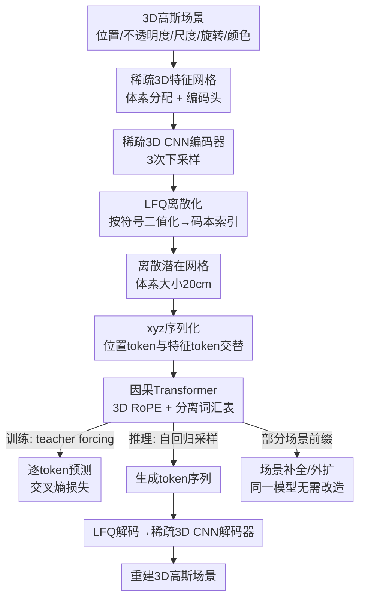

# GaussianGPT: Towards Autoregressive 3D Gaussian Scene Generation

**会议**: ECCV 2026  
**arXiv**: [2603.26661](https://arxiv.org/abs/2603.26661)  
**代码**: 无  
**领域**: 3D视觉  
**关键词**: 3D高斯溅射, 自回归生成, 场景生成, 向量量化, Transformer  

## 一句话总结
GaussianGPT 将 3D 高斯场景压缩为离散 token 序列，用带 3D 旋转位置编码的因果 Transformer 做逐 token 自回归预测，首次在 3D 高斯场景生成上实现纯自回归范式，在形状合成和场景生成上达到或超越扩散模型 SOTA，并天然支持场景补全和外扩。

## 研究背景与动机
当前 3D 生成建模的主流范式是扩散模型和流匹配（flow matching），它们将生成建模为全局去噪或连续时间变换的过程，在形状和场景合成上取得了很强的视觉保真度。然而，这类方法存在一个根本性矛盾：**真实场景的构建方式是增量的**——设计师逐步布局、扩展、编辑——而扩散模型一次性精炼整个场景，使得增量编辑、局部补全和可控生成变得不自然。相比之下，自回归 Transformer 在语言和视觉领域已经证明了结构化序列建模和可控生成的强大能力，但在结构化 3D 场景合成中仍然极少被探索。

核心障碍在于 3D 数据缺乏自然的一维序列顺序。3D 高斯原语是非结构化的点集，包含位置、不透明度、尺度、旋转、颜色等连续属性，既没有规范化的排列方式，也难以直接输入离散 token 序列模型。室内场景同时要求全局结构一致性（房间布局）和局部组合灵活性（物体摆放），进一步增加了建模难度。

本文的切入角度是：**用向量量化将 3D 高斯场景压缩为离散潜在网格，再用 xyz 遍历将其序列化为一维 token 流，最后用带 3D 空间位置偏置的因果 Transformer 做自回归生成**。核心 idea：将 3D 场景生成转化为"根据已生成的空间上下文，逐步预测下一个被占据的体素位置及其高斯特征"的序列预测问题，使扩散范式之外的自回归路线成为可能。

## 方法详解

### 整体框架
GaussianGPT 的目标是：给定一个 3D 高斯场景（或空场景），自回归地逐 token 生成完整的场景表示。整个 pipeline 分为两大阶段：（1）**场景压缩**——用稀疏 3D 卷积自编码器将连续高斯场景映射为离散潜在网格 token；（2）**自回归建模**——将潜在网格序列化为 token 流，用因果 Transformer 建模联合分布。两个阶段独立训练：先训练自编码器获得高质量离散表示，再在其潜在空间上训练 GPT。

### 关键设计

**1. 稀疏 3D 潜在编码与 LFQ 离散化：打通高斯场景到 token 序列的桥梁**

将连续的、非结构化的 3D 高斯场景送入自回归 Transformer 的前提是将其转化为离散 token 序列。本文采用三级压缩流水线：首先，将高斯原语按位置分配到世界坐标系的体素网格中，绝对位置替换为体素中心偏移量，同一体素内多高斯随机降采样，每个高斯属性用独立编码头（线性层 + 残差 MLP）编码后拼接为统一特征向量，形成稀疏输入特征网格。接着，用稀疏 3D 卷积编码器经过三次下采样（体素大小从 2.5cm 压缩到 20cm），将场景压缩为紧凑的潜在表示，保留空间局部性和平移等变性。最后，用 Lookup-Free Quantization（LFQ）将编码器输出 z 按符号直接离散化为 0/1，即码本索引由 sign(z) 决定，无需显式码本查找。

选择 LFQ 而非传统 VQ 的关键原因：传统 VQ 需要最近邻搜索，训练耗时增加约三分之一，且码本利用率常出现崩溃（codebook collapse）；LFQ 通过熵最大化损失鼓励码本均匀使用，实验显示 4096 码本利用率达 99.2%。自编码器训练损失由三部分组成：

$$\mathcal{L} = \underbrace{\lambda_{RGB}\mathcal{L}_{RGB} + \lambda_{perc}\mathcal{L}_{perc}}_{\text{重渲染}} + \underbrace{\lambda_{occ}\mathcal{L}_{occ}}_{\text{占用}} + \underbrace{\lambda_{LFQ}\,\text{softplus}(\mathcal{L}_{LFQ}+5)}_{\text{码本熵}}$$

其中重渲染损失在采样视图上计算 RGB L1 和 VGG-19 感知损失，占用损失用 BCE 监督解码器上采样层的占用预测，码本熵损失通过 softplus 偏移保证正值。

**2. 位置-特征分离词汇表与交替序列：解耦几何结构与外观建模**

将潜在网格序列化为 token 流时，本文采用固定的 xyz 遍历顺序（z 最小优先，即逐列扫描），每个体素对应一对 token：位置 token（体素在当前 chunk 内的相对索引）和特征 token（该体素的量化潜在特征），两者交替排列。关键设计是**位置和特征使用两个独立的词汇表和输出头**：Transformer 主干共享，但在位置步用位置头预测下一个被占据的体素索引，在特征步用特征头预测前一个位置的量化特征。

这样做的动机很明确：几何结构（哪里被占据）和外观（被占据的地方长什么样）是两个性质完全不同的预测任务，共享词汇表会让两者在有限码本索引上竞争，建模混淆。分离词汇表消除了这种竞争，允许各自独立扩展码本大小。更重要的是，这一设计天然支持灵活控制：位置头的索引范围与 chunk 大小绑定，而特征头的码本大小不受 chunk 尺寸影响，两者可以独立调节。训练时，交叉熵损失在交替的步数上只对对应的词汇表计算，无效词汇表条目被 mask 掉。

**3. 3D 旋转位置编码与 token-type 第四维：让注意力感知真实空间距离而非序列距离**

标准 Transformer 的 1D 位置编码（无论是可学习绝对位置还是 RoPE）嵌入的是序列顺序信息。但在 xyz 序列化中，序列上相邻的 token 可能在 3D 空间中相距很远（例如，一列扫描完后跳到下一列），而 3D 空间中相邻的体素在序列中可能间隔整个列的长度。直接套用 1D RoPE 会让模型学到错误的"序列邻近 = 空间邻近"先验。

本文的方案是将 RoPE 从 1D 扩展到 3D：在注意力计算中，旋转编码的不是序列位置 i，而是 token 对应的实际体素坐标 (x, y, z)。这样，注意力分数变为相对 3D 空间偏移的函数，而非序列偏移的函数——模型可以越过序列中的长距离，直接关注空间中邻近的已生成体素。更进一步，由于序列中交替出现位置 token 和特征 token，且它们共享同一 3D 坐标，本文额外引入**第四个 token-type 维度**：位置 token 的 type=0，特征 token 的 type=1，用额外的旋转频率编码，帮助 Transformer 在同一注意力公式下进一步区分解耦几何和外观信号。

**4. 自回归场景补全与外扩：同一模型、同一机制、无需架构改造**

自回归范式的天然优势在于：生成 = 根据前缀预测后续 token。这意味着给定一个部分场景，只需将其序列化为前缀 token，模型就能自回归地"续写"出剩余场景——补全（completion）和无条件生成在机制上完全统一，不需要像扩散模型那样引入 RePaint 等专门的修补流程。同样的原理可以扩展到大规模场景外扩（outpainting）：以固定大小的 chunk 为单位训练模型（chunk 大小受上下文窗口制约），推理时用滑动窗口策略——每次生成一个新列，窗口前移，将已生成区域作为上下文——反复应用即可突破训练时的 chunk 尺寸限制，合成 12m x 12m 的大场景（训练 chunk 仅 4m x 4m）。

推理时还有两个实用技巧：（1）**已占用位置 mask**：由于位置 token 直接对应 chunk 内体素索引，生成时可以 mask 已被占用的位置，确保采样始终遵循有序约束；（2）**回溯重采样**：在大场景生成时，如果预测出一个没有任何几何体的空列，则退回上一个 token 重新采样（默认最多重试 5 次），有效抑制生成退化、保持场景连续性。

### 损失函数 / 训练策略

训练分两个独立阶段。**自编码器阶段**：Adam 优化器，学习率 10^{-4}，cosine 衰减至初始值 10%，4 张 RTX A6000，场景有效 batch size 8（约 4 天），PhotoShape 物体 batch size 24（约 2 天）。训练时随机采样满足最低占用阈值（0.2）的 chunk，相机采样优先选择能看到 chunk 区域较多的视角。**GPT 阶段**：基于 nanochat（GPT-2 骨干），结合 AdamW 和 Muon 优化器，per-module 学习率（输出头 0.004，嵌入 0.2，残差权重 0.005 等），cosine 衰减至 10%，4 张 GH200，有效 batch size 64，场景训练约 1 天，物体约 4.5 小时。损失为标准的自回归交叉熵。推理时使用 temperature=0.9 和 Nucleus Sampling（p=0.9）。

## 实验关键数据

### 主实验

**形状合成（PhotoShape Chairs）**：在无条件椅子生成任务上，GaussianGPT 取得 FID 5.68、KID 0.00184、COV 67.40%，全面超越此前最佳方法 L3DG（FID 8.49、KID 0.00315、COV 63.80%）和扩散方法 DiffRF（FID 15.95），MMD 与 L3DG 持平（4.278 vs 4.241），表明自回归模型在视觉质量和几何多样性上均达到或超越扩散方法。

| 方法 | FID ↓ | KID ↓ | COV ↑ | MMD ↓ |
|------|-------|-------|-------|-------|
| π-GAN | 52.71 | 0.01364 | 39.92 | 7.387 |
| EG3D | 16.54 | 0.00841 | 47.55 | 5.619 |
| DiffRF | 15.95 | 0.00794 | 58.93 | 4.416 |
| L3DG | 8.49 | 0.00315 | 63.80 | 4.241 |
| **GaussianGPT** | **5.68** | **0.00184** | **67.40** | 4.278 |

**场景合成（3D-FRONT chunk）**：在无条件生成上，GaussianGPT 在外观（FID 94.85 vs 100.98）和布局（FID 84.14 vs 93.84）上显著优于 L3DG，但几何多样性和分布匹配（COV 0.548 vs 0.692，MMD 0.118 vs 0.096）略逊——这反映了自回归方法的"干净但保守"倾向：生成的几何更整洁、异常原语更少，但样本多样性不如扩散模型。然而，当任务从无条件生成转向补全时，自回归的优势开始显现：在 25% 前缀补全下，GaussianGPT 在所有维度（外观、几何、布局、CLIP 相似度）上全面优于 L3DG + RePaint，且随着上下文增多（50%），差距进一步拉大。

| 任务 | 方法 | 外观 FID ↓ | 几何 COV ↑ | 布局 FID ↓ | CLIP-Sim ↑ |
|------|------|-----------|-----------|-----------|------------|
| 无条件生成 | L3DG | 100.98 | 0.692 | 93.84 | — |
| 无条件生成 | **Ours** | **94.85** | 0.548 | **84.14** | — |
| 25% 补全 | L3DG | 109.35 | 0.925 | 112.57 | 0.834 |
| 25% 补全 | **Ours** | **100.06** | 0.879 | **95.60** | **0.841** |
| 50% 补全 | L3DG | 106.54 | 0.940 | 111.71 | 0.843 |
| 50% 补全 | **Ours** | **98.13** | **0.940** | **90.77** | **0.851** |

### 消融实验

**序列化策略**（Table 3）：对比 xyz、Z-order、Hilbert 曲线及转置变体，xyz 遍历训练 CE 最低（2.151），Z-order 转置验证 CE 接近（2.423 vs 2.421），但 Hilbert 等具有更强空间局部性保证的排序并未带来增益——说明 3D RoPE 已经提供充足的空间信息，降低了序列局部性的重要性。

| 序列化策略 | 训练 CE ↓ | 验证 CE ↓ |
|-----------|----------|----------|
| Z-order | 2.203 | 2.432 |
| 转置 Z-order | 2.204 | 2.423 |
| Hilbert | 2.347 | 2.439 |
| 转置 Hilbert | 2.334 | 2.434 |
| **xyz（本文）** | **2.151** | **2.421** |

**核心组件消融**（Table 4）：共享词汇表使验证 CE 从 2.421 升至 2.449；可学习绝对位置编码更差（验证 CE 2.461）；1D RoPE 同样不如 3D RoPE（验证 CE 2.446）。三项设计均对最终性能有独立贡献。

| 配置 | 训练 CE ↓ | 验证 CE ↓ |
|------|----------|----------|
| **完整模型** | **2.151** | **2.421** |
| w/ 共享词汇表 | 2.157 | 2.449 |
| w/ 可学习 PE | 2.210 | 2.461 |
| w/ 1D RoPE | 2.227 | 2.446 |

### 关键发现
- **分离词汇表是性价比最高的设计**：共享词汇表看似简化，实则让几何和外观在有限码本上竞争，验证 CE 上升 0.028，且推理时无法独立控制 chunk 尺寸和码本大小。
- **3D RoPE 让简单 xyz 排序足够**：即使 xyz 遍历的 3D 局部性很差（序列上相邻 token 在空间中可能很远），3D RoPE 使得模型直接基于空间坐标关注，无需更复杂的空间填充曲线。
- **自回归的推理效率在补全场景下有优势**：无条件生成时自回归采样比扩散慢（78s vs 24s/chunk），但在 50% 前缀补全下时间降至 39s（扩散无变化，仍为 24s）——因为需生成的 token 数减少。
- **大型场景生成质量沿 x 方向退化更严重**：xyz 序列化导致沿 x 扩展需要更大的序列跳跃，累积误差更显著；沿 y 扩展相对局部，质量下降较缓。

## 亮点与洞察
- **用"交替序列 + 分离词汇表"解耦几何与外观**：这是一个非常干净的设计决策——位置 token 和特征 token 在序列中交替出现，但用不同的头、不同的词汇表做预测，本质上是将"哪里有什么"这个联合问题分解为两个条件独立的子问题。这个思路可以迁移到任何需要同时建模"存在性"和"属性"的空间生成任务上（如点云、体素、图结构）。
- **3D RoPE + token-type 第四维**：将 RoPE 从 1D 序列维度扩展到 3D 空间坐标，再额外加一个 type 维度来区分 token 类型，既保留了 RoPE 的相对位置编码优势（长度外推），又让模型不再受制于序列化带来的空间扭曲。这个设计可以迁移到任何需要将高维结构序列化的场景（如视频 token 化后的时空位置编码、图序列化后的节点位置编码）。
- **"自回归即补全"的统一性是最被低估的贡献**：扩散模型做补全需要 RePaint 等外挂修补策略，而自回归模型天然用同一机制处理无条件生成和补全——这是范式的结构优势，不是 trick。实验也证实了这一点：上下文越多，自回归的优势越明显。
- **LFQ 替代 VQ 的实用价值**：传统 VQ 的 codebook collapse 和最近邻搜索开销在 3D 场景这种稀疏高维数据上尤为严重，LFQ 的二值化方案简单高效且码本利用率极高（99.2%），对需要向量量化的 3D 任务有直接的工程参考价值。

## 局限与展望
- **自回归采样的无条件生成速度慢**：无条件生成每个 chunk 需 78s（L3DG 只需 24s），因为必须逐 token 串行采样。作者指出了若干加速方向（Flash Decoding、推测解码、多 token 预测头、稀疏注意力），但这些尚未实现。
- **大规模场景外扩质量退化**：随着采样步数增加，误差累积导致远距离区域质量下降（KID 归一化值从 1.0 升至 1.3-1.6），回溯重采样只能延缓而无法根除退化。
- **几何多样性与扩散方法存在 trade-off**：无条件生成场景时 COV 低于 L3DG（0.548 vs 0.692），说明自回归模型生成的结构变化范围较窄，倾向于预测"最可能的"而非"足够多样的"布局。这是自回归建模（最大化似然）的固有限制，可能需要引入温度调节之外的多模态建模策略。
- **真实世界数据上自编码器保真度不足**：ScanNet++ 实验暴露了瓶颈——高频细节重建不理想，且真实扫描中固有的缺失/未观测区域无法被当前 pipeline 忠实地建模。作者指出自回归模型天然适合处理不确定区域（可 mask），未来可探索不确定性感知的建模。
- **xyz 遍历顺序导致各向异性的退化模式**：沿 x 方向扩展退化远严重于沿 y 方向，说明固定的序列化顺序引入了方向偏差。未来可研究自适应或多路径序列化策略。

## 相关工作与启发
- **vs L3DG**: L3DG 是本文自编码器的基底（稀疏 3D CNN 架构），但 L3DG 直接用扩散模型在潜在空间做生成，而本文换成了自回归 Transformer + LFQ。两者的核心差异在于生成范式：扩散是全局迭代精炼，自回归是局部序贯决策。实验表明两者各有优势区间——扩散在无条件多样性上更强，自回归在补全和可控性上更强。
- **vs MeshGPT / MeshAnything**: 这些工作做自回归 mesh 生成，与本文同属"自回归 3D"的大方向，但操作对象是 mesh 面片序列，天然有规整的拓扑结构。GaussianGPT 操作的是更通用但也更无序的 3D 高斯原语，挑战更大——必须先通过压缩和量化"人造"出序列结构。
- **vs DiffRF**: 扩散模型做 3D 生成的典型代表，在体素辐射场上做去噪。GaussianGPT 在形状合成上全面超越 DiffRF（FID 5.68 vs 15.95），说明在 3D 生成上，自回归范式即使起步较晚，也有能力追赶并超越。
- **vs G3PT / VAR-3D**: 同样是自回归 3D 生成，但操作的是结构化几何 token（如点云、mesh 面片），GaussianGPT 首个将自回归延伸到非结构化的 3D 高斯原语场景级生成。

## 评分
- 新颖性: ⭐⭐⭐⭐ 首次在 3D 高斯场景生成上验证纯自回归范式的可行性，且在设计上花了不少心思（分离词汇表、3D RoPE、LFQ），不是简单套用 GPT；但自回归 3D 生成并非完全新概念，MeshGPT 等工作已有探索
- 实验充分度: ⭐⭐⭐⭐⭐ 覆盖形状合成 + 场景生成 + 补全 + 大型外扩四个任务，对比多个基线，消融序列化策略和核心组件，附录补充推理效率、真实数据、自编码器消融，非常扎实
- 写作质量: ⭐⭐⭐⭐ 结构清晰，动机充分，方法描述详细，附录信息量大；但部分缩写的首次定义不够醒目，表格排版因 LaTeX 转纯文本有些凌乱
- 价值: ⭐⭐⭐⭐ 为 3D 场景生成开辟了一条与扩散互补的技术路线，补全和可控生成的本征优势可能在实际应用中更具吸引力；工程方案（LFQ、分离词汇表、3D RoPE）对其他 3D tokenization 工作有参考意义

<!-- RELATED:START -->

## 相关论文

- [\[CVPR 2026\] Repurposing 3D Generative Model for Autoregressive Layout Generation](../../CVPR2026/3d_vision/repurposing_3d_generative_model_for_autoregressive_layout_generation.md)
- [\[ICLR 2026\] AssetFormer: Modular 3D Assets Generation with Autoregressive Transformer](../../ICLR2026/3d_vision/assetformer_modular_3d_assets_generation_with_autoregressive_transformer.md)
- [\[CVPR 2026\] ARMFlow: AutoRegressive MeanFlow for Online 3D Human Reaction Generation](../../CVPR2026/3d_vision/armflow_autoregressive_meanflow_for_online_3d_human_reaction_generation.md)
- [\[ICLR 2026\] QuadGPT: Native Quadrilateral Mesh Generation with Autoregressive Models](../../ICLR2026/3d_vision/quadgpt_native_quadrilateral_mesh_generation_with_autoregressive_models.md)
- [\[CVPR 2026\] AutoRegressive Generation with B-rep Holistic Token Sequence Representation](../../CVPR2026/3d_vision/autoregressive_generation_with_b-rep_holistic_token_sequence_representation.md)

<!-- RELATED:END -->
