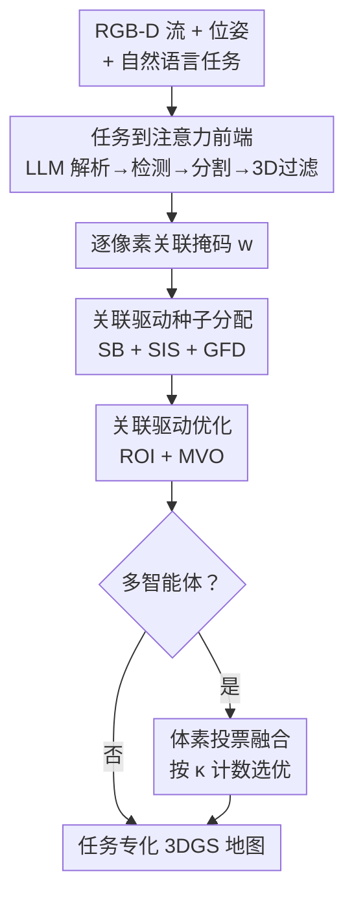

# GaussLite: Online Task-Conditioned 3D Gaussian Splatting for Real-Time Robotic Mapping

**会议**: ECCV 2026  
**arXiv**: [2606.30809](https://arxiv.org/abs/2606.30809)  
**代码**: [https://github.com/annikathomas/gausslite](https://github.com/annikathomas/gausslite) (有)  
**领域**: 3D视觉  
**关键词**: 3D Gaussian Splatting, 任务驱动重建, 在线建图, 多智能体融合, 开放词汇

## 一句话总结
GaussLite 提出一种任务驱动的在线 3DGS 建图系统，通过自然语言指令引导高斯密度分配，在相同 Gaussian 预算下将渲染质量集中到任务相关区域，单智能体 ROI PSNR 提升 +2.72 dB，并支持多机器人按体素投票融合各自专化地图。

## 研究背景与动机

3D Gaussian Splatting (3DGS) 近年来被迅速集成到机器人 SLAM 系统中，因其能生成高保真的稠密地图，并支持实时渲染。然而，现有在线 GS-SLAM 系统（如 Gaussian-SLAM、SplaTAM、MonoGS）无一例外地把计算资源均匀分配给视野中所有可见区域——无论是天花板、墙壁还是无关的家具，都分配相同数量的高斯原语参与优化。在嵌入式平台上面临实时约束（每帧预算数十毫秒）时，这种均匀分配意味着本应用于精细重建任务目标物体（如桌上的杯子、要躲避的垃圾桶）的容量被大量浪费在无关几何上。更极端的场景是机器人集群：队内通信链路本身带宽有限，交换整幅重建地图几乎不可行。

已有工作从三个方向缓解 3DGS 的计算开销：后验压缩与剪枝（如 LightGaussian、PUP 3D-GS）、多层级细节表示（如 Hierarchical-3DGS、Octree-GS）、以及 SLAM 场景下的自适应密集化策略。但所有这些方法的分配准则都是几何驱动的——全局显著性、相机距离、局部冗余度或光度误差，从未考虑当前任务到底是什么。一个被指令去浇花的机器人仍然会把大量高斯分配到天花板和墙壁上。生物视觉天然是不均匀的：视网膜中央凹编码高精度区域，周边只提供粗糙框架，而观察者当前的任务决定了眼睛注视的方向。这篇论文的核心思想正是把这一原理引入在线 3DGS：让表示的容量跟随任务，而不是跟随几何。

**核心 idea：将自然语言任务描述转化为逐像素关联掩码，以此引导高斯原语的种子分布、初始缩放和梯度更新，使在线建图系统在固定预算下自觉地把渲染质量集中到任务相关的几何区域。**

## 方法详解

### 整体框架

GaussLite 接收一个带位姿的 RGB-D 视频流和一段自由形式的自然语言任务描述（如"准备捡起桌上的物体"），增量式地构建一个任务关联的 3DGS 地图。整个系统分为三个串联阶段：前端将语言任务转化为逐像素关联掩码；建图循环利用该掩码指导高斯种子分配和优化；多智能体阶段将多个任务专化地图通过体素投票融合。下面是整体框架图：

### 关键设计

**1. 任务到注意力前端：用自然语言生成逐像素关联信号**

第一个要解决的核心问题是：机器人的自由语言任务指令如何转化为建图循环能消费的逐像素信号？GaussLite 设计了一个三条流水线组成的前端。首先，用一个轻量 LLM（Phi-3-mini，3.8B）对任务做一次结构化解析，提取出目标对象名词短语（如 "object"）、空间参考物（如 "desk"）以及二元空间谓词（near / on）——整个解析只跑一次，耗时不到 4 秒。然后，在运动触发的关键帧上，用 Grounding DINO 对解析出的查询集做开放词汇检测，框由 FastSAM 进一步细化成像素级分割掩码。最后也是最巧妙的一步：3D 空间过滤。因为空间谓词（如 "on the desk"）在 2D 层面无法验证，系统从当前高斯地图渲染的深度中反投影每个检测实例的质心到世界坐标，再计算它与锚点对象的 3D 空间关系是否满足谓词约束。这能有效过滤掉误检——比如画面里有一个花瓶和一个杯子，但任务说的是"桌子上的杯子"，那么离桌子质心远的花瓶就被干掉了。最终输出的二进制逐像素关联掩码 w 是后续所有建图操作的基础信号。

**2. 关联驱动种子分配：ROI 预算分配 + 分层初始缩放 + 梯度聚焦密集化**

有了关联掩码 w，接下来要把有限的高斯种子预算"花在刀刃上"。这里包含三层设计，层层递进。ROI 种子预算分配（SB）是最基础的一层：设定一个 ROI 分配比 ρ（默认约 0.7），新一帧要播撒的 N 个高斯种子中，前 N_ROI 个从掩码标记为前景的像素中均匀采样，其余 N_bg 个从背景像素中采样。这确保 ROI 区域获得更多高斯，同时背景保留稀疏骨骼以维持几何锚定。分层初始缩放（SIS）解决了第二个工程细节：高斯种子初始尺寸如果设得一样大，ROI 小物体和背景区域的分辨率无法区分。GaussLite 给每个种子分配初始缩放因子时，让 ROI 种子乘 0.5、背景种子乘 0.7，使前景高斯天然更紧凑、能描述更精细的几何细节。在固定每帧迭代预算下，优化器无法有效收缩过大的初始高斯，所以一开始就设小至关重要。梯度聚焦密集化（GFD）进一步优化种子在 ROI 内部的放置位置：计算当前帧的 Sobel 边缘响应图，在各个分层单元格内按梯度幅值采样——高斯被优先放置在物体轮廓和纹理表面，那里光度残差最大，增加密度带来的渲染质量提升也最显著。

**3. 关联驱动优化：ROI 仅激活 + 多视角窗口采样**

种子播下后，面临的约束是每帧迭代预算极其有限（实时约束下通常只有几十次迭代），必须确保 GPU 迭代不浪费在无关背景上。GaussLite 的做法是将优化分为两段：首先做一个短的全图 warmup（约前 1/3 迭代），然后进入主动优化阶段，此阶段**只对关联高斯（a_i=1）做渲染和梯度回传**，背景高斯被完全冻结。由于光栅化器只处理 ROI 子集，每步迭代的渲染成本大约减半；同时每个活跃高斯携带一个计数器 κ_i，记录它参与了多少次活跃阶段迭代，这个计数器在后面多智能体融合时会作为质量代理。在训练视图采样上，GaussLite 使用多视角优化（MVO）：每次迭代从最近关键帧窗口中均匀采样一个视图，避免当前视角过拟合，迫使 ROI 高斯在多个观察角度下保持一致性。损失函数是标准的颜色 + 深度 L1 加上 SSIM 项，但活跃阶段只在 ROI 像素区域内计算。

**4. 多智能体融合：按活跃优化计数体素投票**

当多台机器人以不同的任务指令在同一环境中建图时，GaussLite 允许在不重新优化的前提下融合各自的地图。每个高斯携带的 κ_i 计数器自然成为质量代理：ROI 高斯在活跃阶段积累了高 κ_i，背景高斯几乎为零。融合算法以体素网格离散化世界空间，在每个体素内比较两幅地图中高斯的聚合 κ_i 值，保留值更高的来源。因为只有 ROI 子集携带有效计数，机器人之间实际交换的数据量只占完整地图的约 7%。投票后还可选做一轮短联合优化来平滑边界。这一机制为多机器人协同感知提供了一个极轻量的方案——每个智能体只专化于自己的任务区域，交换时也只需交出那 7% 的高置信度部分。

### 损失函数 / 训练策略

主动优化阶段的损失函数为：

$$ \mathcal{L} = \mathcal{L}_{\text{color}} + \lambda_d \mathcal{L}_{\text{depth}} + \lambda_s (1 - \text{SSIM}(\hat{I}, I)) $$

其中颜色和 SSIM 项在 warmup 阶段全图计算，在活跃阶段只局限在 ROI 像素区域（与渲染足迹的交集）。优化器使用 Adam，采用标准 3DGS clone / split / prune 策略，克隆或分裂的子高斯继承父高斯的活跃标志 a_i。每帧的关键帧窗口大小约 5-10 帧，保证多视角约束的一致性。

## 实验关键数据

### 主实验

**Replica 数据集 ROI 渲染质量（8 场景均值）：**

| 方法 | ROI PSNR ↑ | ROI SSIM ↑ | ROI LPIPS ↓ |
|------|------------|------------|-------------|
| Gaussian-SLAM | 26.62 | 0.823 | 0.303 |
| SplaTAM | 28.56 | 0.821 | **0.230** |
| MonoGS | 26.10 | 0.815 | 0.287 |
| **GaussLite** | **29.81** | **0.835** | **0.230** |

**Campus 数据集 ROI 渲染质量（5 场景均值）：**

| 方法 | 模式 | ROI PSNR ↑ | ROI SSIM ↑ | ROI LPIPS ↓ |
|------|------|------------|------------|-------------|
| Gaussian-SLAM | 单智能体 | 18.06 | 0.515 | 0.591 |
| SplaTAM | 单智能体 | 19.35 | 0.606 | 0.481 |
| MonoGS | 单智能体 | 19.06 | 0.550 | 0.571 |
| **GaussLite** | 单智能体 | **21.05** | 0.580 | 0.471 |
| Gaussian-SLAM | 多智能体 | 17.41 | 0.484 | 0.658 |
| SplaTAM | 多智能体 | 18.19 | 0.575 | 0.530 |
| MonoGS | 多智能体 | 18.27 | 0.498 | 0.635 |
| **GaussLite** | 多智能体 | **21.38** | **0.706** | **0.448** |

### 消融实验

| 配置 | Replica Office0 PSNR ↑ | Campus Highbay PSNR ↑ | 说明 |
|------|----------------------|----------------------|------|
| 无任何模块 | 34.57 | 21.50 | 均匀分配基线 |
| +SB | 35.95 | 21.61 | ROI 种子预算分配，Replica提升最大 |
| +MVO | 35.96 | 22.55 | 多视角窗口采样 |
| +ROI | 36.87 | 22.15 | ROI 仅激活优化 |
| +SIS | 38.05 | 25.14 | 分层初始缩放，Campus 提升最显著 |
| +GFD | **38.23** | **25.25** | 梯度聚焦密集化，微小但一致改善 |

### 关键发现

- 最大孤立增益来自 ROI 种子预算分配（SB，+1.38 dB 在 Replica）和分层初始缩放（SIS，+1.18/+2.99 dB），SIS 在真实数据（Campus）上的大幅跳跃说明"小初始高斯"在传感器噪声下更关键。
- 多智能体融合中，体素投票（Voxel Voting）单独使用即可超越朴素拼接，加上联合优化精炼后，PSNR 提升达 +1.74 dB（Replica）到 +4.16 dB（Campus），智能体间仅交换地图约 7% 的数据。
- 全图 PSNR 随模块激活略有下降（约 1-2 dB），因为计算预算被从背景重新分配到 ROI——这是任务驱动建图刻意做出的权衡。

## 亮点与洞察

- 将生物中央凹视觉原理引入在线 3DGS：任务决定注意力在哪里，注意力决定表示精度在哪里，而非均匀分配——这个类比很自然但此前无人系统化实现。
- 活跃优化计数器 κ_i 的设计非常巧妙：它既是用作多智能体融合的质量代理，又不增加梯度计算开销（非可微变量），一举两得。
- 任务前端中 3D 空间过滤是关键工程细节：它利用渲染深度将 2D 检测提升到 3D 验证谓词关系，有效抑制了开放词汇检测在复杂场景中的误报。
- 分层初始缩放（SIS）的分级乘子设计（ROI 0.5 / 背景 0.7）在简单场景看似微小，但在噪声较大的真实传感器数据上贡献近 3 dB 增益——说明工程细节在小预算约束下的放大效应。

## 局限与展望

- 空间谓词的可靠性完全依赖渲染深度质量：当深度噪声严重时，3D 空间过滤会误判；LLM 解析器面对异常表述可能幻觉目标对象。
- 系统当前不支持任务中途变更：如果任务从"捡桌子上的物体"切换为"找到门附近的椅子"，之前欠重建的区域无法回溯性地补建，需要重新观测或离线精炼。
- 评估的任务描述变体有限，未系统性测试自然语言变化对系统鲁棒性的影响。
- 谓词集仅实现了 near 和 on 两种质心级空间关系，更丰富的谓词（inside、behind）需要完整物体几何，是值得拓展的方向。

## 相关工作与启发

- **vs Gaussian-SLAM**: 后者是 GaussLite 的建图器基座，但 Gaussian-SLAM 均匀分配高斯容量；GaussLite 在其上增加了任务关联信号引导的种子分配和优化，在相同预算下 ROI 质量显著提升。
- **vs SplaTAM / MonoGS**: 同为 RGB-D 3DGS-SLAM 系统，均匀分配算力；GaussLite 在几乎全部场景/task 对的 ROI PSNR 上胜出，证明了任务条件化分配策略的普适性。
- **vs GaussianLens**: 后者在预建的低分辨率 3DGS 模型上对用户选定 2D ROI 做按需密集化，但属于离线后处理；GaussLite 在建图过程中在线地进行任务驱动分配。
- **vs Clio / Bayesian Fields**: 这些工作把语言嵌入直接附加到场景表示中（如在每个高斯上附 CLIP 向量），而 GaussLite 是用语言生成的注意力信号去驱动高斯容量的空间分配——两者互补，可以结合。

## 评分
- 新颖性: ⭐⭐⭐⭐ [将生物视觉的任务驱动注意力机制系统化迁移到在线 3DGS 建图，想法简单而有效]
- 实验充分度: ⭐⭐⭐⭐⭐ [Replica + 真实 Campus 双数据集、消融到每个组件、多智能体融合评测、定量定性全覆盖]
- 写作质量: ⭐⭐⭐⭐⭐ [motivation 从生物视觉切入流畅，方法拆解清晰，图表质量高]
- 价值: ⭐⭐⭐⭐⭐ [在实时约束下给 3DGS-SLAM 提供了一个极实用的升级方向，多智能体融合的轻量方案尤其有实用前景]

<!-- RELATED:START -->

## 相关论文

- [\[ECCV 2026\] GaussLite：在线任务条件化的 3D 高斯泼溅实时机器人建图](gausslite_online_task-conditioned_3d_gaussian_splatting_for_real-time_robotic_mapping.md)
- [\[CVPR 2026\] OnlinePG: Online Open-Vocabulary Panoptic Mapping with 3D Gaussian Splatting](../../CVPR2026/3d_vision/onlinepg_online_open-vocabulary_panoptic_mapping_with_3d_gaussian_splatting.md)
- [\[ICLR 2026\] Mobile-GS: Real-time Gaussian Splatting for Mobile Devices](../../ICLR2026/3d_vision/mobile-gs_real-time_gaussian_splatting_for_mobile_devices.md)
- [\[ECCV 2026\] RAGA: Real Time Ray Traced Gaussian Shadow Casting for 3DGS Avatar-Scene Interaction](raga_real_time_ray_traced_gaussian_shadow_casting_for_3dgs_avatar-scene_interact.md)
- [\[ICCV 2025\] Online Language Splatting](../../ICCV2025/3d_vision/online_language_splatting.md)

<!-- RELATED:END -->
