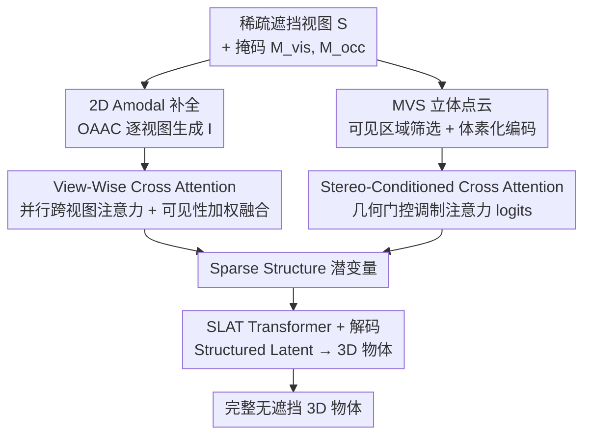

# GENA3D: Generative Amodal 3D Modeling by Bridging 2D Priors and 3D Coherence

**会议**: ECCV 2026  
**arXiv**: [2511.21945](https://arxiv.org/abs/2511.21945)  
**项目**: [https://colezwhy.github.io/gena3d/](https://colezwhy.github.io/gena3d/)  
**代码**: 无  
**领域**: 3D 视觉  
**关键词**: 非模态3D生成, 2D先验与3D一致性, 多视图融合, 立体几何条件, 稀疏视图重建

## 一句话总结
GENA3D 提出一种生成式非模态 3D 建模框架，通过 View-Wise Cross Attention 并行融合多视图 2D 补全特征、Stereo-Conditioned Cross Attention 将 MVS 点云作为几何门控注入注意力 logits，在稀疏遮挡输入下同时实现生成多样性与几何一致性，在 GSO 数据集上 FID 达 30.73（4视图），相比 Amodal3R 提升 4.4，且可见区域 SSIM 达到 0.838。

## 研究背景与动机
3D 物体生成近年来在扩散模型和自回归模型的驱动下取得了显著进展，现有方法可以从文本、单图甚至稀疏视图合成多样且逼真的 3D 形状。然而，几乎所有方法都隐含假设输入是高质量、无遮挡且姿态规范的——当面对真实场景中稀疏、部分遮挡、无姿态标定的观测时，这些模型往往难以有效利用有限的可见证据来合理推断缺失区域，导致几何不一致、结构不合法甚至灾难性生成失败。

现有两条路线各自解决了问题的一半：纯 3D 方法（如 TRELLIS、Amodal3R）直接在 3D 空间操作，保证了几何一致性，但受限于 3D 训练数据的规模和多样性，生成表现力不足；2D 非模态补全方法（如 OAAC、pix2gestalt）利用强大的图像生成先验逐视图恢复遮挡区域，能够产生视觉上逼真的补全，但各视图独立推理导致跨视图不一致，这些不一致在提升到 3D 时积累为几何伪影。核心矛盾在于：**如何在非模态 3D 建模中同时获得生成合理性（来自 2D 先验）和几何一致性（来自 3D 约束）？**

本文的切入角度是将非模态 3D 生成建模为一个条件生成过程：用 2D 生成先验来填补遮挡内容的"想象力"，用 3D 几何推理来约束多视图间的"结构纪律"。核心 idea 是让 MVS 重建的部分点云不充当被动条件特征，而是通过几何门控函数直接调制跨注意力 logits，从而在生成过程中建立想象力与结构的紧耦合。

## 方法详解

### 整体框架
GENA3D 的输入是 K 个稀疏视图下目标物体的可见性掩码 $M_{vis}$、遮挡掩码 $M_{occ}$ 以及逐视图 2D 非模态补全结果 $I$。整体流程分为两个阶段：第一阶段是 Sparse Structure Transformer，将不一致的多视图 2D 补全通过 View-Wise Cross Attention 融合为统一潜变量，再用 Stereo-Conditioned Cross Attention 以 MVS 部分点云为几何条件进行精炼，生成 Sparse Structure；第二阶段复用 Amodal3R 预训练的 SLAT Transformer，将 Sparse Structure 解码为完整、无遮挡的 3D 物体。

### 关键设计

**1. View-Wise Cross Attention：消除视图支配与几何漂移**

现有多视图条件策略——无论是逐采样步顺序交叉注意力还是朴素特征拼接——在稀疏无姿态的非模态场景下存在两个致命问题：(1) 后处理的视图会覆盖先前的结构假设（视图支配），(2) 各视图独立补全的不一致累积为不稳定的 3D 结构（几何漂移）。

View-Wise Cross Attention 的核心机制是**并行化解耦**：对每个 2D 补全视图 $i^n$ 用 DINOv2 提取特征 $c^n$，然后在同一生成步对所有视图**同时**执行交叉注意力，得到视图级潜变量 $z_n' = \mathcal{CA}(z, c^n)$。融合阶段不采用简单平均，而是引入**可见性加权平均**：

$$z' = \frac{1}{K}\sum_{n=1}^{K} w_n z_n', \quad w_n = \frac{\tau_n}{\sum_{j=1}^{K} \tau_j}, \quad \tau_n = \frac{m_v^n}{m_o^n + m_v^n}$$

其中 $\tau_n$ 是视图 $n$ 的可见比——可见区域占该视图总目标区域的比例。物理直觉很直接：一个视图中物体可见部分越多，该视图的补全越可靠，在融合时权重越大。融合后加 LayerNorm 保证数值稳定。通过将逐视图推理结构化解耦、再用几何可见性先验显式重平衡贡献，该模块将不一致的 2D 补全转化为一个连贯的共享潜空间表示，大幅提升了稀疏观测下的跨视图稳定性。

**2. Stereo-Conditioned Cross Attention：几何信号从"被动条件"升级为"主动门控"**

此前的生成模型即使纳入深度图或点云，也只是将它们当作额外的被动条件 token 拼接到注意力计算中，对结构的约束力很弱——尤其是当几何信息本身是部分、带噪声且无姿态时。Stereo-Conditioned Cross Attention 的关键创新在于：**将几何先验直接注入注意力 logits**，而非拼接为条件 token。

具体流程：对 K 个视图用 MVS 模型（$\pi^3$）重建场景点云，再用可见性掩码筛选出目标物体的部分点云 $\mathbf{P}_O = \bigcup_{n=1}^{K} \{p \in p^n \mid m_v^n(p) = 1\}$。将 $\mathbf{P}_O$ 以网格尺寸 $\phi = 1/64$ 体素化为 $\mathbf{V}_O$，经 Sparse Structure VAE 编码和 patchify + Linear 变换得到几何特征 token $c_{geo}$。核心操作是一个 Geometry-Guided Gating MLP：

$$g = \sigma(\text{MLP}_{gating}(c_{geo})), \quad \alpha = \text{softmax}\left(\frac{QK^\top}{\sqrt{D}} + \log(g + \varepsilon)\right)$$

门控 MLP 结构为 Linear → ReLU → Linear → Sigmoid，将几何特征压缩为逐 token 的注意力调制标量 $g$，取对数后加性注入注意力 logits。这意味着：几何上可信的区域获得更高的注意力权重（$g$ 接近 1，$\log(g) \approx 0$，不影响原始注意力），几何上不可信的区域被压制（$g$ 接近 0，$\log(g) \ll 0$，注意力被大幅衰减）。这种 logit 级门控建立了"想象力"与"结构"的紧耦合——生成模型仍然可以"想象"未见区域，但只能在几何先验许可的范围内发挥。

**3. Data Engine：3D 一致的遮挡模拟与训练代理**

非模态 3D 生成的关键瓶颈之一是缺乏成对的"遮挡-完整"3D 训练数据。GENA3D 设计了一套数据引擎来解决这个问题：从 3D-FUTURE 和 ABO 数据集出发，用 Manifold 将物体 mesh 转换为水密 mesh，然后在每个 mesh 上随机选一个种子面，迭代向相邻面扩展直到达到随机采样的覆盖率（20%-60%），生成**空间连续且自然**的 3D 一致遮挡掩码。再渲染多视图并合成对应的 2D 补全图像（将遮挡区域当作 inpainting mask，施加可控的掩码畸变增加多样性），同时过滤掉极端拍摄角度和遮挡不足的视角。

训练时，每 batch 从 {1, 2, 3, 4} 中随机采样视图数，MVS 点云在线生成并中心化/归一化。得益于合成遮挡掩码的可见性引导，现代 MVS 模型即使在遮挡场景下仍能恢复合理的部分几何，为训练提供可靠的几何监督。推理时支持场景级输入：先生成整场景 MVS 点云，再按各物体掩码提取部分点云，减少多物体场景下的重复计算开销。

### 一个完整示例：从稀疏遮挡视图到完整 3D 椅子

假设输入是 2 张不同角度拍摄的餐桌场景照片，其中一把椅子被桌面遮挡了约 40% 的区域。首先用 SAM + Florence 2 自动获取椅子的可见性掩码和文本描述，OAAC 在这 2 个视图上分别进行 2D 非模态补全——视图 1 把被桌面遮住的椅腿"画"了出来，视图 2 把被盘子挡住的椅背"补"了出来，但两个视图补全的椅腿形状和椅背纹理并不一致（这正是独立补全的典型问题）。

进入 GENA3D：DINOv2 提取两视图特征，View-Wise Cross Attention 并行处理两个视图——视图 1 可见比 0.6（椅腿可见少，补全可信度低，融合权重小），视图 2 可见比 0.85（椅背大部分可见，补全可信度高，融合权重大），两者加权平均得到一个折中的融合潜变量。同时，$\pi^3$ 从 2 张原图重建场景点云，按椅子掩码提取出被桌面镂空的"残缺"椅子点云（约 60% 的完整几何），体素化编码后由 Geometry-Guided Gating MLP 生成注意力门控——有点云覆盖的椅座区域 $g \approx 0.95$（充分激活注意力），无点云的被遮挡椅腿区域 $g \approx 0.3$（允许生成但加以约束）。SLAT Transformer 在此基础上生成 Structured Latent 并解码，最终输出一把几何完整、纹理一致的椅子——可见部分忠实于原始观测，被遮挡部分在几何约束下合理生成。

### 损失函数 / 训练策略

训练目标为标准条件流匹配（Conditional Flow Matching, CFM）损失：

$$\mathcal{L}_{\text{CFM}}(\theta) = \mathbb{E}_{t, z_0, \epsilon} \|v_\theta(z, t) - (\epsilon - z_0)\|_2^2$$

其中 $z = (1-t)z_0 + t\epsilon$ 为插值状态，$v_\theta$ 预测从噪声到数据的速度场。仅第一阶段 Sparse Structure Transformer 可训练（SLAT Transformer 冻结）。优化器为 AdamW，学习率 5e-5，全局 batch size 32，8 张 RTX 6000 GPU 训练 12 个 epoch（约 16 小时）。采用 Classifier-Free Guidance，训练时 condition drop rate 0.1。Sparse Structure VAE 的体素网格尺寸为 $64^3$，点云坐标归一化到 $[-0.5, 0.5]$。

## 实验关键数据

### 主实验

在 GSO 数据集 1030 个物体上，用 3D 一致模拟遮挡进行评测，对比 1/2/4 视图下的非模态 3D 生成质量。所有对比方法均配备相同的 2D 非模态补全前端（OAAC）。

| 方法 | 视图数 | FID $\downarrow$ | KID(%) $\downarrow$ | CLIP(%) $\uparrow$ | MMD(‰) $\downarrow$ | COV(%) $\uparrow$ | PCS(%) $\uparrow$ |
|------|--------|------------------|---------------------|--------------------|---------------------|--------------------|--------------------|
| TRELLIS | 1 | 49.68 | 3.21 | 76.79 | 6.08 | 33.37 | 21.1 |
| Amodal3R | 1 | 39.05 | 0.44 | 80.06 | 5.52 | 38.64 | 46.3 |
| SAM3D | 1 | 34.68 | 0.46 | 82.16 | 5.50 | 39.03 | 46.5 |
| **GENA3D** | 1 | **33.91** | 0.46 | **82.23** | 5.68 | **39.19** | **61.9** |
| TRELLIS | 2 | 46.23 | 3.28 | 77.01 | 6.27 | 34.12 | 25.0 |
| Amodal3R | 2 | 35.52 | 0.44 | 81.84 | 5.52 | 38.92 | 47.1 |
| **GENA3D** | 2 | **32.12** | 0.45 | **82.33** | **5.50** | **39.08** | **66.3** |
| TRELLIS | 4 | 45.41 | 2.79 | 78.17 | 5.94 | 34.42 | 23.2 |
| Amodal3R | 4 | 35.15 | 0.43 | 82.04 | 5.51 | 38.83 | 46.2 |
| **GENA3D** | 4 | **30.73** | **0.43** | **82.53** | **5.48** | **39.48** | **67.0** |

PCS（Perceptual Coherence Score）是本文提出的 VLM 评估指标：将生成物体在 8 个均匀方位角渲染，交给 Qwen3-VL 32B 从空间和外观一致性两个维度打出 0-100 分。GENA3D 在 PCS 上对 Amodal3R 的领先幅度（+15.6 到 +20.8）远超其他指标的差距，说明本文方法在人类感知层面的一致性优势比数值指标更显著。人类偏好评估（30 物体 x 10 评测者，side-by-side）也验证了这一趋势：GENA3D 在 1/2/4 视图下的胜率分别为 65.4%/74.1%/78.2%，且随着视图数增加优势扩大。

可见区域保真度（SSIM/PSNR/LPIPS，在可见性掩码区域内计算）进一步证明 GENA3D 在保持观测细节方面优于所有基线——4 视图下 SSIM 0.838、PSNR 16.98、LPIPS 0.208，相比 Amodal3R 分别提升 0.006/0.34/0.028。

### 消融实验

在 2 视图 GSO 设定下逐一移除各模块（表为精简版，仅列关键指标）。

| 配置 | FID $\downarrow$ | MMD(‰) $\downarrow$ | COV(%) $\uparrow$ | 关键发现 |
|------|------------------|---------------------|--------------------|----------|
| GENA3D Full | 32.12 | 5.50 | 39.08 | 完整模型 |
| - Gating MLP | 32.87 (+0.55) | 5.58 (+0.08) | 37.68 (-1.40) | 去掉几何门控，COV 掉 1.4% |
| - View-Wise CA | 38.64 (+6.42) | 5.76 (+0.26) | 38.34 (-0.74) | 去掉并行跨视图融合，FID 暴涨 6.42 |
| - Stereo-Cond. CA | 42.92 (+10.80) | 5.91 (+0.41) | 35.26 (-3.82) | 去掉整个几何条件模块，几何质量崩塌 |
| - All proposed | 46.23 (+14.11) | 5.94 (+0.44) | 34.42 (-4.66) | 仅剩 2D 补全，退化为 TRELLIS 水平 |

视图数消融（1→2→4→10→20）表明方法具有良好的可扩展性：从 1 视图到 4 视图 FID 下降 3.18（33.91→30.73），从 4 到 10 视图仍有 1.17 的 FID 收益，10 到 20 视图趋于饱和（FID 仅降 0.13），说明方法能有效利用额外的视图信息而不过拟合。

2D 补全方法的鲁棒性测试（pix2gestalt / Flux inpainting / OAAC）表明，GENA3D 对不同 2D 补全前端具有一致的适配能力：OAAC 下 FID 32.12，Flux inpainting 下 FID 33.07，pix2gestalt 下 FID 38.61——更强的 2D 补全带来更好的最终结果，但即使使用较弱的前端，3D 一致性约束仍能兜底防止崩溃。MVS 误差容忍实验显示，对点云注入 5%/10% 的高斯噪声后 FID 仅退化 0.14/1.98，证明 Stereo-Conditioned Cross Attention 的门控机制对几何噪声具有一定的自校正能力。

融合策略消融对比了均匀平均、最大值融合、token 级可学习注意力和可见性加权融合四种方案，可见性加权融合在所有指标上均为最优（FID 32.12 vs. 均匀平均 32.22 vs. 最大值 34.66 vs. 可学习注意力 34.58），验证了"可见越多、权重越大"这一几何先验的有效性。

### 关键发现
- **Stereo-Conditioned Cross Attention 是最大单一贡献模块**：去掉后 FID 暴增 10.80，COV 下降 3.82%，说明仅靠 2D 融合无法弥补 3D 结构的缺失。几何门控是保证生成结构合法性的核心机制。
- **View-Wise Cross Attention 解决的是"多视图怎么用"的问题**：去掉后 FID 增加 6.42，即使 MVS 条件仍在，但视图间的不一致无法被有效融合，导致稀疏结构本身质量下降。
- **模型对遮挡程度具有较强鲁棒性**：在 20%/50%/70% 遮挡度下，1 视图 FID 分别为 32.28/34.16/37.22，2 视图 FID 分别为 31.98/33.42/37.16——即使遮挡 70% 时 FID 也仅退化约 5 个点。
- **姿态不变性得到验证**：在 100 个 GSO 物体 x 10 个视角的测试中，97.6% 的生成结果处于统一的规范轴对齐空间（逐物体生成结果间做 pairwise 旋转对齐测量），验证了 VWCA 利用规范姿态先验进行多视图融合的设计合理性。

## 亮点与洞察
- **"几何门控注入 logits"是一个可迁移的设计模式**：将条件信号从"拼接 token"升级为"注意力调制标量"，在对数空间做加法而不是在 token 空间做拼接，这种 logit-level conditioning 适用于任何需要将结构先验注入生成模型的任务（如医学图像重建中注入解剖约束、视频生成中注入光流场）。
- **可见性加权融合是一个简洁而高效的先验**：用每个视图的可见比作为融合权重不需要任何可学习参数，却显著优于可学习注意力融合（FID 32.12 vs. 34.58）。这说明在跨视图融合中，几何可见性本身携带了足够强的信号，不需要模型再去"学习"该信哪个视图。
- **2D-3D 解耦后紧耦合的设计哲学**：先让 2D 生成先验独立发挥"想象力"（逐视图补全），再让 3D 几何约束发挥"纠错力"（跨视图融合+立体条件），最后让生成模型在两者的交集空间内工作。这种"先发散后收敛"的两阶段策略比端到端联合训练更稳定，且允许分别升级 2D 补全和 MVS 模块而不影响整体框架。
- **PCS 指标弥补了传统指标的盲区**：FID/CLIP 等图像级指标和 MMD/COV 等几何指标各自衡量一个维度，但都无法捕捉"生成结果看起来像不像一个完整、自洽的 3D 物体"这个整体感知质量。用 VLM 打分的 PCS 在 GENA3D 上相比 Amodal3R 的优势远大于传统指标，暗示传统指标可能低估了 3D 一致性的感知价值。

## 局限与展望
- **依赖 2D 补全和 MVS 两个上游模块的质量**：作者承认当遮挡极端严重（>85%）或 2D 补全灾难性失败时，GENA3D 无法恢复。错误传播分析也表明 MVS 噪声比 2D 补全噪声的破坏力更大（10% 扰动下 FID 分别退化 1.98 vs. 0.38），因为几何条件是结构生成的"锚点"，锚点失效比外观噪声更致命。
- **推理效率存在一定开销**：单物体生成约 15 秒，比 TRELLIS 和 Amodal3R 稍慢，实际部署场景下需要考虑这个延迟。
- **未见区域的"合理性"不等于"准确性"**：GENA3D 生成的被遮挡部分可能在视觉和几何上合理，但不一定与真实遮挡物一致——这是一个内在的歧义问题（同一遮挡条件下存在多种合理的完成方式），论文目前没有对生成多样性进行评估。
- **训练数据规模有限**：仅使用 3D-FUTURE (9472) + ABO (4485) 共约 14k 物体，相比 TRELLIS 等方法的数十万级数据量差距明显。更大规模、更多样化的训练数据有望进一步提升生成质量和泛化能力。一个自然的改进方向是将 2D 补全与 3D 生成进行联合训练或端到端微调，以减少级联误差。

## 相关工作与启发
- **vs Amodal3R**: Amodal3R 直接在遮挡物体的 3D 数据上训练原生的生成模型，缺乏显式的 2D 先验注入和几何条件机制。本文的核心差异是将 2D 补全和 MVS 几何作为显式条件引入生成过程，且设计了专门的注意力机制来处理这些条件。当给 Amodal3R 加上相同的 OAAC 前端后，其性能不升反降（FID +1.51, COV -1.12），说明仅靠更好的输入不够，还需要专门设计的融合机制——这正是 VWCA 和 SCCA 的价值所在。
- **vs TRELLIS**: TRELLIS 是通用的 3D 资产生成模型，在干净输入下表现优异，但它把遮挡场景当作普通的稀疏视图重建问题来处理，缺乏对遮挡区域的专门建模。GENA3D 的"先补全再融合"策略相比 TRELLIS 的端到端生成在遮挡场景下有本质优势（4 视图 FID 30.73 vs. 45.41）。
- **vs 多视图补全方法（Instant3Dit / NeRFiller）**: 这些方法尝试在 2D 补全时保持跨视图一致性，但假设已标定相机且视图覆盖密集。GENA3D 在无姿态稀疏视图设定下工作，且将一致性约束放在了 3D 潜空间而非 2D 图像空间，避免了在像素空间做跨视图对齐的困难。
- **启发：Logit-level 条件注入**：本文将几何条件以对数加性方式注入注意力 logits 的做法，可以被推广到任何"结构先验指导生成"的场景——例如在视频生成中用光流/深度作为时序一致性门控，在分子生成中用物理约束作为合法性门控。

## 评分
- 新颖性: 四星——将 2D 非模态补全与 3D 生成结合并非全新概念，但"几何门控注入注意力 logits"和"可见性加权并行跨视图融合"的设计是此前未见的具体机制，两者配合形成的"想象力+结构纪律"框架有清晰的贡献边界。
- 实验充分度: 五星——主实验覆盖 6 个指标 x 3 种视图数 x 5+ 个基线，消融覆盖模块移除、视图数扩展、2D 前端替换、MVS 误差注入、融合策略对比、遮挡度分析、人类偏好评估，加上 in-the-wild 和 in-the-scene 的定性结果，实验设计全面且有说服力。
- 写作质量: 四星——问题陈述清晰（"想象力 vs. 结构纪律"的矛盾提炼得好），方法部分公式与图示配合得当，但部分实验表格（Table 1）因对比方法多、指标多而信息密度过高，可读性有提升空间。
- 价值: 四星——非模态 3D 生成是机器人抓取、AR/VR 内容创建、具身 AI 感知等应用的关键使能技术。本文提供了一个模块化、可分别升级的框架（2D 补全、MVS、生成核心各自独立），实践价值高于单点改进。主要扣分点在于未见区域的"合理性 vs. 准确性"歧义未得到评估，可能限制在精度敏感场景下的应用。

<!-- RELATED:START -->

## 相关论文

- [\[ICLR 2026\] HoloPart: Generative 3D Part Amodal Segmentation](../../ICLR2026/3d_vision/holopart_generative_3d_part_amodal_segmentation.md)
- [\[ICCV 2025\] Amodal3R: Amodal 3D Reconstruction from Occluded 2D Images](../../ICCV2025/3d_vision/amodal3r_amodal_3d_reconstruction_from_occluded_2d_images.md)
- [\[CVPR 2026\] Generative Diffusion Priors for 3D Mapping of the Dark Universe](../../CVPR2026/3d_vision/generative_diffusion_priors_for_3d_mapping_of_the_dark_universe.md)
- [\[ICML 2026\] SplAttN: Bridging 2D and 3D with Gaussian Soft Splatting and Attention for Point Cloud Completion](../../ICML2026/3d_vision/splattn_bridging_2d_and_3d_with_gaussian_soft_splatting_and_attention_for_point_.md)
- [\[CVPR 2026\] CUPID: Generative 3D Reconstruction via Joint Object and Pose Modeling](../../CVPR2026/3d_vision/cupid_generative_3d_reconstruction_via_joint_object_and_pose_modeling.md)

<!-- RELATED:END -->
