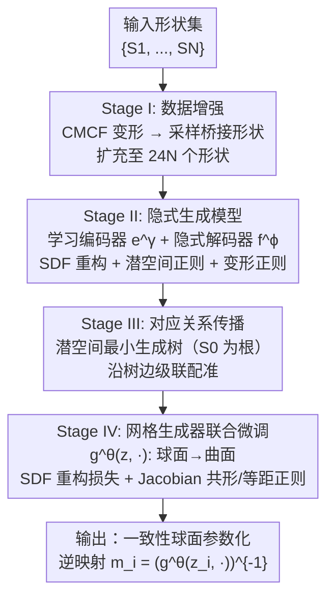

# GenSP: Consistent Spherical Parameterization via Learning Shape Generative Models

**会议**: ECCV 2026  
**arXiv**: [2607.00492](https://arxiv.org/abs/2607.00492)  
**代码**: 无  
**领域**: 3D视觉  
**关键词**: 球面参数化, 网格生成模型, 曲面一致性, 神经变形, 几何处理

## 一句话总结
GenSP 提出用数据驱动的方法学习一个神经生成模型，将单位球面连续变形到任意 genus-0 形状，从而通过逆映射获得跨形状**一致**且低几何畸变的球面参数化，在 ShapeNet 上比现有方法提升 14× 以上等距畸变、3.6× 以上一致性。

## 研究背景与动机

球面参数化是几何处理领域最基础的问题之一：给定一个 genus-0 的封闭三角网格曲面，要计算一个从曲面到单位球面的双射映射。这个映射做出来后，纹理迁移、形状匹配、几何分析等下游任务就都有了统一的"坐标系"——所有形状都能在球面上对齐。现有的方案大致分两类：逐形状独立优化的方法（如 SMAT、AHSP、ARAP）可以为每个形状给出低畸变的参数化，但它们不管形状之间的对应关系，两个几何相似但姿态不同的椅子，独立跑两遍优化会得到完全不同的球面映射，纹理贴上去在对齐部位完全错位；基于几何流的方法（如 CMCF）能通过把形状逐步变形到球面来获得一定的一致性，但流过程本身对细薄结构和高度区域产生极大的局部畸变，等距因子可以差到上千倍。

这两类方法的根本矛盾在于：**一致性需要全局协调，而畸变控制是局部保形的，两者在独立优化框架下天然对立**。如果能把所有形状放在同一个框架里优化——让参数化不是为每个形状独立求解，而是学习一个从"形状空间"到"球面参数化"的统一映射——就有希望同时保证低畸变和高一致性。但要做到这一点面临三个难题：一是用什么表示这个映射——网格生成模型在参数化中会遇到共形因子剧烈变化导致的三角面质量极差；二是球面本身通常不在输入形状的子空间中，生成模型很难从球面平滑变形到任意形状；三是球面和复杂形状之间的对应关系如何初始化，直接从球面变形到大畸变形状极易陷入局部最优。

本文的切入点是：与其为每个形状独立算参数化，不如反过来学一个从球面到每个形状的神经生成模型，然后把参数化定义为该生成模型的逆映射。**核心 idea：训练一个连续神经变形模型 $g^\theta(z, p)$，它以形状潜码 $z$ 和球面采样点 $p$ 为输入、输出目标形状上的对应曲面点，通过数据增强引入"桥接形状"使球面自然地处于训练空间之中，再借助潜空间的最小生成树路径将球面与复杂形状的对应关系分解为一系列渐进式配准，最终用逆映射得到跨形状一致的球面参数化。**

## 方法详解

### 整体框架

GenSP 的四阶段管线把"从一个球面到所有形状的对应关系计算"这个困难问题，逐层分解为可操作的任务。第一阶段用现成的几何流方法（CMCF）把每个输入形状变形到球面，并在变形轨迹上采样中间形状来**扩充训练集**，保证球面 $S_0$ 确实处于生成模型可拟合的形状空间中。第二阶段在这个扩充数据集上学一个隐式形状生成器 $f^\phi$ 和点云编码器 $e^\gamma$：$f^\phi$ 是一个带 SDF 解码的神经网络，对每个形状输出一个有符号距离场；编码器则把形状映射到 256 维潜空间，并通过正则化让相似形状的潜码彼此靠近。第三阶段在潜空间里以球面 $S_0$ 为根构建最小生成树，沿树上的每条边用 $f^\phi$ 生成中间插值形状，再通过非刚性配准把对应关系从 $S_0$ 逐级传播到每个目标形状——这样就把一次大变形分解为多次小变形的链接。第四阶段用这些初始对应关系初始化一个显式的网格生成器 $g^\theta$（输入潜码 + 球面点坐标、输出曲面点位置），并引入 Jacobian 层面的等距/共形正则损失做联合微调，最终获得既低畸变又一致的高质量球面参数化。

### 关键设计

**1. 数据增强：用桥接形状填平球面与输入形状之间的鸿沟**

球面参数化的逆映射学习之所以难，根本原因在于球面 $S_0$ 通常不属于输入形状所在的数据子空间——一个猫的椅子的形状空间里并没有一个完美的球面流形。如果硬将球面放到这个子空间之外，生成模型要么无法收敛，要么产生不合实际的插值。GenSP 的解决思路非常直接：对每个输入形状 $S_i$ 运行 CMCF 几何流将它逐步变形到球面，从变形轨迹中采样中间形状加入到训练集。具体操作上，CMCF 有一个关键超参数——步长 $m$，不同形状的最优步长不同。GenSP 定义了一个评分函数 $s(m, S_i)$ 来评估每个 $m$ 的参数化质量（融合 Hausdorff 距离和累计变形量），只有当评分低于阈值 $2\delta$ 时才采纳该轨迹的中间形状，最终将数据集扩充到 $24N$ 个形状。这一步看似朴素，但它是整个管线的基础：只有桥接形状存在，后续的隐式生成器才能学到从球面到任意形状的平滑路径，否则模型会直接崩掉（消融实验中无数据增强的变体在所有指标大幅下降）。

**2. 隐式生成模型 + 缩减变形正则：让潜空间插值几何合理**

第二阶段需要同时学一个编码器 $e^\gamma$ 和一个隐式形状解码器 $f^\phi$。编码器用 PointNet++ 将形状映射为 256 维潜码，并施加 $\ell_1$ 稀疏正则迫使相似形状潜码靠近；解码器是一个 10 层 MLP（带残差连接），输出 SDF 值。如果只做 SDF 重构，$f^\phi$ 在插值两个相近形状的潜码时生成的中间形状往往是几何上不合理的——这是隐式模型做潜空间线性插值的老问题。GenSP 的改进来自 GenCorres 的正则思想但做了两个关键改进：一是引入缩减变形模型（把 2000 个网格顶点用最远点采样压缩到 200 个变形节点），大幅降低正则计算量；二是不再直接最小化变形能 $d^\top L d$，而是最小化**相对变形比** $d^\top L d / \|d\|^2$，因为当潜空间分布不规则时，绝对位移的大小不能反映真正的变形质量。这个相对比率的积分让正则项对形状尺度不敏感，无论潜码稀疏还是密集都能强制中间形状的变形保持合理。

**3. 最小生成树路径：把大变形拆成可配准的小步**

获得初始对应关系最朴素的做法是用 $f^\phi$ 在潜空间做球形和 $S_i$ 之间的直线插值，然后逐级配准。但实验发现在 $S_0$ 与 $S_i$ 差异过大时，直线插值的中间形状质量极差（某些截面扭曲到不合理），导致配准失败。GenSP 的洞察是：**与其造出不可靠的人造中间形状，不如借用真实存在的训练形状作为配准跳板**。具体做法是在扩充数据集的潜空间中，以 $S_0$（球面）为根、以潜码欧氏距离为边权，构建一个最小生成树。从根到每个目标形状的路径经过一系列本身就存在于训练集中的真实形状（或其附近）。沿树边传播对应关系时，用 $f^\phi$ 在两个真实形状的潜码之间插值 $n=5$ 个中间形状，然后做非刚性配准把网格连接性一步一步传递过去。最后通过"缝合"操作（用相邻网格段中重叠的形状做重网格化桥接）将所有路径段拼成 $S_0$ 到目标形状的完整对应关系。

**4. 网格生成器的 Jacobian 正则：在连续域同时约束等距和共形**

第四阶段的核心是网格生成器 $g^\theta(z, p)$ 的微调。$g^\theta$ 是连续函数（以 $\mathbb{R}^3$ 位置和潜码为输入、输出 $\mathbb{R}^3$ 曲面点），它的 Jacobian $J_p^\theta(z, p) = \partial g^\theta / \partial p \in \mathbb{R}^{3 \times 2}$ 描述了球面切平面上的微小变化如何映射到曲面上的变化。如果映射是等距的，$J_p^\top J_p = I_2$；如果是共形的，$J_p^\top J_p$ 是标量矩阵。GenSP 将这两个约束同时编码为一个正则损失：$r(A) = \beta\|A - I\|^2 + \|A - \frac{\langle A,I\rangle}{2} I\|^2$，其中第一项推导向等距、第二项推导向共形（$\beta=0.01$ 表示等距权重更低，因为目标主要是低畸变的共形映射）。这个 Jacobian 用 PyTorch autograd 自动计算，直接在连续域做正则化，从根本上避免了网格离散化带来的三角面质量退化。与只做初始化阶段 $\ell_2$ 损失相比，Jacobian 正则让参数化的平滑度和保形性在跨形状上都有显著提升。

### 损失函数 / 训练策略

整个训练分为两大阶段（Stage II 和 Stage IV），各有其损失函数：

**Stage II（隐式模型）**：$\min_{\gamma,\phi} l_{\text{data}}(\phi,\gamma) + \lambda l_{\text{reg,I}}(\gamma) + \mu l_{\text{reg,II}}(\phi)$，其中数据项是 SDF 重构的 $\ell_2$ 损失，$l_{\text{reg,I}}$ 是编码器的 $\ell_1$ 稀疏正则，$l_{\text{reg,II}}$ 是隐式模型的变形正则（式 5-8）。$(\lambda=0.1, \mu=0.01)$。

**Stage IV（网格生成器联合微调）**：$\min_{\theta} l_{\text{data}}(\gamma,\theta) + \bar{\mu} l_{\text{def}}(\theta)$，数据项为预测曲面点到真实网格的平方距离，$l_{\text{def}}$ 即 Jacobian 正则损失（式 12）。$(\bar{\mu}=0.1, \beta=0.01)$。

训练细节：隐式模型用 8×GH200 GPU 训练 8 小时（batch size 96），先 500 轮无正则再 100 轮有正则；网格生成器用单张 H100 训练 14 小时（batch size 8），先 2000 轮无正则再 500 轮联合微调。所有阶段用 Adam 优化器 + 余弦退火学习率，初始学习率 $10^{-3}$（联合微调阶段 $10^{-4}$）。

## 实验关键数据

### 主实验

GenSP 在 ShapeNet 的 1000 个 genus-0 形状（900 训练 / 100 测试）上与 5 个当前最优方法对比，涵盖三种畸变指标和一种一致性指标。

| 方法 | mean($\sigma_t$) $\downarrow$ | max($\sigma_t$) $\downarrow$ | max($\sigma_t^{\text{con}}$) $\downarrow$ | mean($c(m_i,m_j)$) $\downarrow$ | 推理时间 |
|------|------|------|------|------|------|
| CMCF | 24.22 | $1.13\times10^3$ | 1.029 | 1.626 | ~5 min |
| ARAP | 177.19 | $1.22\times10^6$ | 1.029 | 1.608 | ~6 min |
| AHSP | 1.578 | 2.349 | 1.232 | 6.006 | ~32 sec |
| SMAT | 1.503 | 3.392 | 1.049 | 5.122 | ~2 min |
| VC25 | 12.52 | 216.70 | 6.892 | 6.573 | ~5 min |
| **GenSP** | **1.681** | **7.719** | **1.212** | **1.425** | **<1 sec** |

GenSP 的一致性指标相比最优优化方法 SMAT 提升 3.6×，相比最优流方法 CMCF 也提升约 14%。等距畸变均值与 best optimization-based 持平（1.68 vs SMAT 的 1.50），但最大畸变远小于 CMCF 的 $10^3$ 量级。推理时间仅 <1 秒（基线方法 2 分钟~6 分钟不等），因为推理只需一次网格生成器前向计算。

### 消融实验

| 配置 | mean($\sigma_t$) | max($\sigma_t$) | mean($c$) | 说明 |
|------|---------|---------|---------|------|
| Full GenSP | 1.681 | 7.719 | 1.425 | 完整方法 |
| No-DA | 2.326 | 614.14 | 3.164 | 无数据增强，畸变剧增（max 升 80×） |
| No-GP | 1.866 | 23.228 | 1.613 | 不用树路径而用直线插值，最大畸变升 3× |
| No-GR | 2.296 | 271.26 | 1.740 | 无几何正则，最大畸变升 35× |

三个消融的影响从大到小排序：**数据增强 > 几何正则 > 树路径**。无数据增强时最大畸变暴涨 80 倍，说明桥接形状是管线当前最关键的组件；几何正则（特别是 Jacobian 损失）对抑制局部畸变至关重要；树的路径规划在不加时一致性指标仍接近 CMCF（因为潜空间本身的组织来源于 CMCF 中间形状），但最大畸变显著劣化。

### 关键发现

- **数据增强是性能支柱**：去掉桥接形状后模型直接无法处理球面到复杂形状的大变形，max 畸变从 7.7 升至 614，这说明「让球面处于训练形状子空间之内」是数据驱动球面参数化的前提条件。
- **相对变形正则优于绝对变形能**：对比 GenCorres 的绝对变形损失，GenSP 的正规化版本对潜空间分布不规则性更鲁棒，这在消融中（No-GR vs Full）的 35 倍 max 畸变差异中得到验证。
- **双面保形性能佳**：GenSP 在 ShapeNet 和 D-FAUST 人体数据集上都验证了优越性。D-FAUST 上一致性指标 mean($c$) 达到 1.68，比 CMCF（3.47）和 ARAP（3.43）高出约 2×。
- **推理速度快三个数量级**：一旦训练完成，推理只需一次前向传播得到逆映射，而优化方法每次推理都要从头跑非线性优化——这是数据驱动范式的自然优势。

## 亮点与洞察

- **逆向思维**：不直接求解"形状到球面"的正向参数化映射，而是学习"球面到形状"的逆映射生成模型，从而把单形状优化问题转化为跨形状生成模型学习问题——这一视角转换天然地鼓励了跨形状一致性。
- **连续表示避开网格离散陷阱**：相比 GenCorres 等网格生成模型，GenSP 的 $g^\theta$ 以连续函数形式定义，Jacobian 正则可直接在连续域计算，避免了因共形因子巨变导致的三角面质量退化——这是该方法能在异构形状集上泛化的关键。
- **最小生成树路径 vs 直线插值**：用潜空间树路径替代线性插值来传播对应关系，利用了真实训练数据作为配准锚点，避免了人造中间形状在大变形场景下的不可靠性。这个思路可以迁移到任何需要在大形变形状对间建立密集对应的场景。
- **相对变形正则的通用性**：把变形正则从绝对形式 $d^\top L d$ 改为相对比率 $d^\top L d / \|d\|^2$ 的积分，解决了潜空间分布不均匀时的尺度敏感问题，是一个很好的实践启示——类似技巧也可用于其他隐式生成模型的几何正则化设计。

## 局限与展望

- **局限一：仅限于 genus-0 形状**。方法核心依赖"球面作为模板"这一假设，无法直接处理带洞的 genus-1+ 形状。作者提出将 CMCF 替换为 Willmore flow 等高亏格模板可能是扩展方向。
- **局限二：细薄结构的参数化仍然困难**。作者在附录中明确承认，所有现有方法（包括 GenSP）在处理极细薄形状时都会失效——这本质上是一类曲面参数化的开放难题。
- **局限三：形式单射性缺乏理论保证**。GenSP 在实践中 91% 的形状完全单射、自交面仅 0.099%，但没有像优化类方法那样的形式单射性理论保证，这在需要严格单射的应用场景中需要额外验证。
- **潜在改进**：当前数据增强依赖 CMCF 这一固定流方法作为桥接形状来源，如果 CMCF 本身在某类形状上表现差，会级联影响整个管线。探索多种流方法的动态选择或可学习的数据增强策略，有望进一步提升鲁棒性。

## 相关工作与启发

- **vs CMCF（几何流方法）**：CMCF 等流方法为每个形状独立运行 PDE 变形到球面，一致性来自形状流终点自然相近，但畸变极大；GenSP 将流路径上的中间形状作为训练数据，用生成模型学出比 PDE 更平滑、更一致的变形路径。
- **vs SMAT / AHSP（逐形状优化方法）**：这些方法通过网格简化+反转策略获得低畸变参数化，但每个形状独立优化，一致性差；GenSP 的一致性指标比最优的 SMAT 高 3.6×，且在畸变上达到可比水平。
- **vs GenCorres**：GenCorres 学习网格生成模型来做形状匹配，但需要高质量初始对应且网格表示对异构形状的共形因子变化敏感；GenSP 用连续神经变形 + 缩减变形模型解决这两个问题，并引入了数据增强和树路径两大关键工程创新。
- **vs 形状配准方法（Diff3F / Diffumatch / ULRSSM）**：GenSP 推理速度快 100× 以上，且能处理对称形状（ULRSSM 在轴对称形状上因旋转模糊失败），说明将参数化与配准统一在生成模型框架下的优势。

## 评分

- 新颖性: ⭐⭐⭐⭐ 把数据驱动生成模型引入球面参数化这个经典几何处理问题，逆向映射视角和大变分解耦思路有创新，但各组件多借鉴已有方法（GenCorres 的变形正则、CMCF 的流数据）
- 实验充分度: ⭐⭐⭐⭐⭐ 在 ShapeNet 和 D-FAUST 两个数据集上与 5 个主流方法全面对比，3 个消融实验精准验证了每个设计点的贡献，额外提供了单射性分析和配准应用
- 写作质量: ⭐⭐⭐⭐ 四阶段管线描述清晰，方法动机和技术挑战交代充分，公式和图示配合良好；但在消融解释和 D-FAUST 结果分析上偏简洁
- 价值: ⭐⭐⭐⭐ 首次展示了数据驱动方法在球面参数化这一经典问题上的巨大潜力（3.6× 一致性提升 + 三个数量级推理加速），对 CC BY 4.0 开源的几何处理工具链有实用价值

<!-- RELATED:START -->

## 相关论文

- [\[ICLR 2026\] Parameterization-Based Dataset Distillation of 3D Point Clouds through Learnable Shape Morphing](../../ICLR2026/3d_vision/parameterization-based_dataset_distillation_of_3d_point_clouds_through_learnable.md)
- [\[ECCV 2026\] Ink3D: Sculpting 3D Assets with Extremely Complex Textures via Video Generative Models](ink3d_sculpting_3d_assets_with_extremely_complex_textures_via_video_generative_m.md)
- [\[ICLR 2026\] Unsupervised Representation Learning for 3D Mesh Parameterization with Semantic and Visibility Objectives](../../ICLR2026/3d_vision/unsupervised_representation_learning_for_3d_mesh_parameterization_with_semantic_.md)
- [\[CVPR 2026\] GenMatter: Perceiving Physical Objects with Generative Matter Models](../../CVPR2026/3d_vision/genmatter_perceiving_physical_objects_with_generative_matter_models.md)
- [\[CVPR 2026\] Learning to Solve PDEs on Neural Shape Representations](../../CVPR2026/3d_vision/learning_to_solve_pdes_on_neural_shape_representations.md)

<!-- RELATED:END -->
