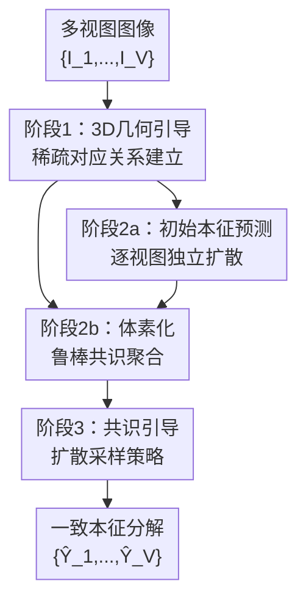

# Geo-ID: Test-Time Geometric Consensus for Cross-View Consistent Intrinsics

**会议**: ECCV 2026  
**arXiv**: [2603.13859](https://arxiv.org/abs/2603.13859)  
**代码**: 无（项目页含待发布说明 [https://alaradirik.github.io/geoid/](https://alaradirik.github.io/geoid/)）  
**领域**: 3D视觉 / 本征图像分解  
**关键词**: 本征图像分解, 多视图一致性, 扩散模型, 测试时几何引导, 3D对应关系

## 一句话总结

Geo-ID 提出一个无需训练的测试时框架，通过稀疏3D几何对应关系将独立运行的预训练单视图本征扩散模型的预测耦合起来，形成置信度加权的体素级鲁棒共识再反向注入后续扩散采样过程，以仅操作潜在变量的梯度更新方式引导各视图预测趋于一致，在不降低单视图分解质量的前提下实现 albedo / roughness / metallicity 的跨视角一致性提升，并可直接用于下游的可编辑神经场景表示。

## 研究背景与动机

**领域现状**：本征图像分解（Intrinsic Image Decomposition）旨在从单张图像中恢复与光照无关的表面属性——albedo（反照率）、roughness（粗糙度）和 metallicity（金属度）。近年扩散模型（RGB↔X、Marigold IID Appearance、PRISM 等）在单视图预测上取得了高质量结果，能很好地泛化到各类场景。然而，当这些模型独立应用于同一场景的不同视角时，相同表面在不同视角下往往被分配不同的 albedo 或 roughness 值，造成跨视图不一致。

**核心矛盾**：单视图本征分解本身是严重病态的——几何、光照和材质三者深度纠缠，仅凭一张图存在无数种等价的分解方案。不同视角下光照方向和遮挡关系不同，会诱导模型做出不同的"分解决策"。这种不一致性严重阻碍了下游应用（如可编辑神经场景表示、3D 重建），因为系统需要一组在 3D 空间自洽的材质预测。

**现有方法的局限**：视频类方法（Diffusion Renderer、Ouroboros）通过时序连贯性做正则化，但需要密集有序序列，无法处理稀疏无序的图像集。逆渲染管线（NeRFactor、GS-IR、Intrinsic Image Fusion）逐场景优化几何与材质，依赖密集捕获和精确几何，且单场景优化超过 1 小时。多视图前馈网络（IDT、IDArb）需要在多视图训练数据上设计专用架构，在场景级非受控数据上泛化有限。

**核心 idea**：Geo-ID 的关键洞察是——即使几何估计有噪声或不完整，**稀疏的3D几何对应关系已足以消除跨视图间的本征歧义**。它不在训练时做任何改动，而是在推理阶段将预训练的单视图扩散模型通过几何引导的共识约束耦合起来，在完全不修改模型参数的前提下实现一致的预测。

## 方法详解

### 整体框架

Geo-ID 完全在测试时运作，适用于任何现有扩散本征预测模型。整个管线分为三个阶段，用户只需输入同一场景的稀疏未标定多视图图像集合（4~32 张）：

1. **几何引导对应关系估计**：用前馈几何 Transformer VGGT 为每张图像预测世界坐标系点云、深度图、相机位姿与内参，以及逐像素置信度。保留高置信度 3D 点，记录其来源视图和像素位置。
2. **体素化共识计算**：先用基础扩散模型独立生成每张视图的初始本征预测。将高置信度 3D 点云划分为轴对齐体素，在每个体素内收集来自不同视图的本征预测值，用置信度加权中位数计算鲁棒共识，同时估计离散度作为不确定性指标，离群点自动排除。
3. **共识引导扩散**：对每张视图**重新运行**扩散采样过程，在最后 80% 的去噪步中，对当前潜在变量施加一个基于共识目标的梯度更新（Huber loss），迫使预测向共识靠近但不过度偏离基础模型的生成先验。

### 关键设计

**1. 3D几何引导的稀疏对应关系建立：用前馈几何模型代替传统匹配**

Geo-ID 需要解决的核心前置问题是"不同视图间的相同表面在哪里"。传统多视图立体匹配（如 COLMAP）需要密集图像且耗时长，对稀疏无序输入不兼容。Geo-ID 采用 VGGT——一个前馈几何 Transformer——直接从单张图像回归世界坐标系点云和相机参数，无需成对匹配或迭代优化。

具体而言，VGGT 为每张图像 $I_i$ 输出：点云 $P_i \in \mathbb{R}^{H\times W\times 3}$、深度图 $D_i$、相机外参 $E_i$、内参 $K_i$，以及逐像素置信度 $\sigma^P_i$ 和 $\sigma^D_i$。所有 3D 量均以首帧相机坐标系为参照。Geo-ID 保留 $\sigma^P_i \geq \tau_c$（默认 0.35）的高置信度点，丢弃不可靠对应。这意味着即使场景存在玻璃、镜面等困难区域，只有几何可靠的像素才会参与后续共识约束，为整个管线奠定"宁缺毋滥"的基础。当可用图像超过设定的视图数 $V$ 时，随机子采样至指定数目。整个几何估计是单次前馈，开销仅约 6 秒（16 视图）。

**2. 体素化鲁棒共识聚合：加权中位数 + 离群滤除 + 不确定性建模**

从 $V$ 个可能不一致甚至错误的初始预测中提取可靠共识是核心挑战。Geo-ID 的关键创新是在**3D空间做体素化聚合**，而非在2D图像空间做特征匹配，这在根本上避免了 2D 跟踪在稀疏无序场景下的漂移累积。

将所有视图的高置信度点云合并后划分为轴对齐体素，边长自适应：$\delta = \alpha \cdot \tilde{d}$（$\tilde{d}$ 为中位数最近邻距离），默认 $\alpha=2.5$，平均每体素约 6.2 个观测。丢弃少于 $n_{\text{min}}=2$ 个视角的体素。在每个体素 $v$ 中，收集来自不同视图 $j$ 的本征预测值 $\hat{Y}^{(0)}_j(u^j_v)$，用**加权中位数**计算共识：

$$s_v = \operatorname{weighted-median}_{j\in\mathcal{V}(v)} \hat{Y}^{(0)}_j(u^j_v)$$

权重 $w^j_v = \sigma^P_i(u^j_v) \cdot \log(1+|\mathcal{V}(v)|)$ 结合了两方面信息：VGGT 的几何置信度（可靠的 3D 点权重大）和观测视角数（视角越多信息越充分）。同时计算稳健离散度 $\hat{\sigma}_v = 1.4826 \cdot \operatorname{median}_j |\hat{Y}^{(0)}_j(u^j_v) - s_v|$，它有双重作用：(a) 偏离共识超过 $\hat{\sigma}_v$ 倍数的观测被排除指导；(b) 逆方差 $\hat{\sigma}_v^{-1}$ 作为共识置信度权重——体素内预测一致性强（离散度小）则给予更大权重。最后通过已知相机参数将体素中心投影回各视图并用深度一致性检验可见性（容限 $\epsilon=0.05$），得到每个视图的稀疏共识目标集 $\{(u^i_v, s_v, w^i_v)\}$。

消融实验表明，加权中位数优于均值（均值对离群敏感，会牺牲分解质量），3D 体素聚合优于 VGGT 的 2D tracking head（2D 跟踪在稀疏无序输入下漂移严重）。

**3. 共识引导的扩散采样策略：分级注入稀疏约束**

有了稀疏共识目标后，Geo-ID 的策略是在扩散采样的**中后期阶段**以梯度更新方式注入约束。具体地，对每张视图独立重新运行扩散过程，在选定的去噪时间步 $t \in \mathcal{S}$（最后 80% 步骤）中，从当前潜在变量 $x_{t,i}$ 通过 Tweedie 公式估计出干净的本征图 $\hat{Y}_{t,i}$，计算共识损失：

$$\mathcal{L}_{t,i} = \sum_{v: m^i_v=1} w^i_v \cdot \rho\big(\hat{Y}_{t,i}(u^i_v) - s_v\big)$$

其中 $\rho$ 为 Huber 损失（阈值 $\delta_H=1.0$），$w^i_v$ 为置信度权重。然后用**单步梯度更新**修改潜在变量：$x_{t,i} \leftarrow x_{t,i} - \eta_t \nabla_{x_{t,i}}\mathcal{L}_{t,i}$，之后继续标准扩散调度步。所有模型参数冻结，仅操作潜在变量。

有两处关键设计选择：(a) **只在最后 80% 步施加指导**——早期去噪步决定全局结构和材质布局，过早约束会干扰生成先验导致分解质量下降（消融显示全程指导使 PSNR 从 16.4 降至 15.8）；中期至晚期的约束在结构成型基础上做"对齐校正"。(b) **梯度只作用于潜在变量**——这使得 Geo-ID 可以完全作为推理阶段 wrapper 运行，无需任何训练或微调。

### 一个完整示例

输入 16 张室内场景图像。VGGT 为每张图输出 $512\times512$ 点云，滤除低置信度点后保留约 5000~8000 个 3D 点。体素化后约 800~1200 个体素通过最少 2 视角的门槛。以某墙面体素为例：它在 8 个视图中可见，初始 albedo 预测值为 [0.72, 0.75, 0.68, 0.73, 0.81, 0.70, 0.74, 0.76]，加权中位数取到 0.73，离散度 $\hat{\sigma}=0.028$。由于离散度小，该体素获得高置信度权重。这些共识值投影回各视图后，在第二阶段扩散采样的第 10~50 步（DDIM 50 步总的最后 80%）中以梯度方式约束每张视图预测，最终墙面色值在 16 张图中都稳定在 0.73 左右，而未经引导的基线预测在 [0.68, 0.80] 间波动。

### 损失函数

Geo-ID 本身是训练无关方法，无传统训练损失。但共识引导过程使用一个在线梯度损失——Huber 共识损失（公式 3）。关键超参：学习率 $\eta=10$（RGB↔X，50 DDIM 步）或 $\eta=50$（Marigold Appearance，10 LCM 步——步数少需更强单步修正），使用 Adam 优化器，每步仅一次梯度更新；Huber 阈值 $\delta_H=1.0$；所有模型参数冻结。此外 20% 体素保留为 hold-out 集用于一致性评估。

## 实验关键数据

### 主实验

**跨视图一致性对比**。MAD（Median Absolute Deviation）为持出体素上的多视图预测中位数绝对偏差，越低表示跨视图一致越好。Geo-ID 在全部数据集和视图数上一致改善：

| 方法 | 视图数 | Mip-NeRF Ind. | | | Mip-NeRF Out. | | | T&T | | |
|------|:---:|:---:|:---:|:---:|:---:|:---:|:---:|:---:|:---:|:---:|
| | | Alb.↓ | Rou.↓ | Met.↓ | Alb.↓ | Rou.↓ | Met.↓ | Alb.↓ | Rou.↓ | Met.↓ |
| RGB↔X (base) | 32 | 0.114 | 0.100 | 0.206 | 0.070 | 0.144 | 0.192 | 0.109 | 0.105 | 0.219 |
| + Geo-ID | 4 | 0.110 | 0.074 | 0.138 | 0.067 | 0.121 | 0.115 | 0.106 | 0.096 | 0.195 |
| + Geo-ID | 8 | 0.107 | 0.072 | 0.128 | 0.061 | 0.118 | 0.101 | 0.102 | 0.089 | 0.180 |
| + Geo-ID | 16 | 0.103 | 0.071 | 0.115 | 0.058 | 0.104 | 0.097 | 0.100 | 0.082 | 0.174 |
| + Geo-ID | 32 | **0.098** | **0.065** | **0.114** | **0.054** | **0.079** | **0.085** | **0.097** | **0.076** | **0.166** |
| Marigold (base) | 32 | 0.091 | 0.096 | 0.111 | 0.073 | 0.080 | 0.070 | 0.098 | 0.100 | 0.118 |
| + Geo-ID | 4 | 0.086 | 0.088 | 0.101 | 0.067 | 0.072 | 0.062 | 0.089 | 0.090 | 0.104 |
| + Geo-ID | 8 | 0.081 | 0.086 | 0.103 | 0.064 | 0.069 | 0.059 | 0.085 | 0.085 | 0.099 |
| + Geo-ID | 16 | 0.078 | 0.079 | 0.099 | 0.063 | 0.064 | 0.049 | 0.083 | 0.082 | 0.097 |
| + Geo-ID | 32 | **0.076** | **0.082** | **0.100** | **0.061** | **0.062** | **0.044** | **0.082** | **0.080** | **0.095** |

**单视图分解质量保持**。Geo-ID 在提升一致性同时，不降低单视图预测精度。以 InteriorVerse 合成数据（有 GT）为例：

| 方法 | 视图数 | InteriorVerse Albedo | | | Rou. | Met. | HyperSim Alb. | | |
| | | PSNR↑ | SSIM↑ | LPIPS↓ | RMSE↓ | RMSE↓ | PSNR↑ | SSIM↑ | LPIPS↓ |
| RGB↔X (base) | 1 | 16.4 | 0.78 | 0.19 | 0.44 | 0.38 | 17.4 | 0.81 | 0.18 |
| + Geo-ID | 32 | 16.4 | 0.78 | 0.19 | 0.42 | 0.35 | 17.3 | 0.81 | 0.18 |
| Marigold (base) | 1 | 19.5 | 0.85 | 0.19 | 0.20 | 0.25 | 18.5 | 0.78 | 0.20 |
| + Geo-ID | 32 | 19.5 | 0.86 | 0.19 | 0.19 | 0.23 | 18.5 | 0.78 | 0.20 |

大部分指标与基线相差在 $\pm 0.1$ dB（PSNR）、$\pm 0.01$（SSIM）以内，甚至有轻微提升（如 Marigold 的 roughness RMSE 从 0.25 降至 0.23），说明多视图共识信号可以修正某些单视图错误。

### 消融实验

16 视图、RGB↔X 基础模型、MipNeRF-360 indoor 一致性 + InteriorVerse 分解质量：

| 配置 | Alb. MAD↓ | Rou. MAD↓ | Met. MAD↓ | PSNR↑ | 说明 |
|------|:---:|:---:|:---:|:---:|------|
| **完整模型（Geo-ID）** | **0.103** | **0.071** | **0.115** | **16.4** | 加权中位数 + 离群排除 + 最后80%步指导 |
| 均值代替中位数 | 0.098 | 0.066 | 0.099 | 16.1 | 一致性略好但分解质量下降，均值对离群敏感 |
| 无离群排除 | 0.100 | 0.067 | 0.112 | 16.2 | 同上趋势，一致性略优但质量受损 |
| 100% 步指导 | 0.096 | 0.067 | 0.106 | 15.8 | 一致性最好但分解质量最差（PSNR −0.6dB） |
| 最后 20% 步指导 | 0.111 | 0.093 | 0.188 | 16.4 | 指导太弱，金属度几乎无改善 |
| 2D tracking 替代 | 0.109 | 0.074 | 0.135 | 16.2 | 2D跟踪漂移严重，约束力不足 |
| 无指导基线 | 0.114 | 0.100 | 0.206 | 16.4 | 独立预测无约束 |

### 关键发现

- **视图越多一致性越好**：从 4→8→16→32 视图，MAD 近似线性下降且未见饱和，说明稀疏约束在研究的视图范围内始终有效。在 InteriorVerse 上使用 GT 几何仍有相似增益，排除了仅与 VGGT 几何偏差对齐的疑虑。
- **几何质量直接决定收益幅度**：Tanks&Temples 逐场景分析显示，VGGT 几何 F-score 与一致性改善幅度呈强相关（Pearson $r=0.94$）。高几何质量场景（Barn, F=0.82）获得 >12% 的 MAD 降低，而几何较差场景（Courthouse, F=0.48）仅改善 5%。但 Geo-ID 在任何场景下均未出现退化——离群排除和置信度权重提供了充分保护。
- **指导时机最关键**：全程指导（100% 步）一致性最好但分解质量显著下降（PSNR 从 16.4 降至 15.8），因为早期结构去噪步被外部约束干扰。仅最后 20% 步则指导太弱，金属度几乎无改善。最后 80% 步是关键平衡点。
- **3D 体素聚合优于 2D tracking**：用 VGGT 的 2D tracking head 替代 3D 体素方案一致性更差（albedo MAD 0.109 vs 0.103，metallicity 0.135 vs 0.115），因为 2D 跟踪在稀疏无序场景中漂移累积，且依赖可见性排序假设，在无序输入下经常违反。

## 亮点与洞察

- **"稀疏对应替代稠密匹配"的设计哲学**：Geo-ID 表明仅对 3D 空间中 <1000 个体素做约束就足以消除跨视图本征歧义，打破了必须用稠密对应或完整几何的传统假设，使方法适用于稀疏无序的真实世界图像集。
- **加权中位数 + 逆方差置信度的双层鲁棒机制**：同时考虑了几何置信度（VGGT 的 $\sigma^P$）和预测不确定性（体素内离散度 $\hat{\sigma}_v$）——几何差或预测不一致的地方自动降权。这种双层滤波使方法在几何质量变化 ±50% 的场景下仍能不退化。
- **双阶段扩散（先自由探索后受控收敛）**：先让基础模型自由生成一次获得初始共识目标，再以共识约束重新采样——保留了基础生成先验的多样性，避免联合采样模式坍缩，且为用 hold-out 体素做无偏评估提供了自然手段。
- **完全冻住模型参数、仅操作潜在变量的 wrapper 设计**：Geo-ID 可即插即用于任意扩散本征预测器。测试时对于 Marigold Appearance（3 模态联合预测）总耗时仅约 3 分钟（16 视图），远快于逆渲染 >1 小时。

## 局限与展望

- **继承上游故障模式**：当 VGGT 在无纹理或重复纹理区域产生严重错误对应时，共识目标不可靠，可能降低预测质量。论文未提出针对性的几何质量检测或降权机制。
- **无法纠正系统偏差**：如果基础本征预测器系统性地将阴影误判为 albedo（如 Marigold Appearance 在暗金属表面），几何共识会强化而非纠正此错误——因为阴影在几何一致的视角间也是"一致的"。
- **体素分辨率限制**：小于体素 $\delta$ 的精细几何细节（栏杆、装饰线）会被合并至相邻表面导致局部模糊。减小 $\alpha$ 部分缓解但会降低共识稳定性。
- **当前仅适配扩散模型**：方法利用了扩散模型逐步去噪的机制注入指导，对非扩散（如 ViT 直接回归）的本征预测器不直接适用。但核心的几何引导共识 idea 原则上可迁移。
- **下游质量受基础模型天花板限制**：当前扩散本征预测器仍偏向室内朗伯体场景，这约定了任何测试时方法（包括 Geo-ID）的绝对精度上限。

## 相关工作与启发

- **vs 视频类方法（Diffusion Renderer / Ouroboros）**：视频方法依赖密集有序序列，在无序输入下性能急剧下降（Diffusion Renderer 在无序 32 视图上 albedo MAD 从 0.068 升至 0.104，升约 2×）。Geo-ID 是置换不变的，无序输入不比有序差，在无序设置下有显著优势。但视频方法在有序密集场景的时序平滑性更好。
- **vs 多视图前馈网络（IDT / IDArb）**：IDArb 需要大规模多视图合成数据训练专用扩散架构，且 cross-view attention 仅对孤立物体有效。Geo-ID 无需训练，直接复用单视图模型，在场景级数据上泛化更强。
- **vs 逆渲染管线（NeRFactor / Intrinsic Image Fusion）**：逆渲染方法最终保真度更高，但需精确几何和密集捕获，单场景 >1 小时优化。Geo-ID 从 16 张稀疏图像 3 分钟完成，快数个数量级，是快速原型和低资源场景的更现实选择。
- **vs 扩散指导技术（Classifier Guidance / ControlNet）**：Classifier Guidance 需额外训练分类器，ControlNet 需微调模型副本。Geo-ID 仅在推理时对潜在变量做单步梯度更新，无需任何训练数据或参数复制，开销最低。

## 评分

- 新颖性: ⭐⭐⭐⭐ 将"测试时几何引导共识"引入本征分解的思路简洁优雅，加权中位数 + 逆方差的共识设计比朴素平均精细得多，整体创新度中上。
- 实验充分度: ⭐⭐⭐⭐⭐ 覆盖 4 个数据集（真实+合成、室内+室外）、3 种基础模型、4 种视图数、6 个消融变体，附录还有逐场景分析、几何质量相关性量化、超参完整敏感性曲线，工程量和透明度俱佳。
- 写作质量: ⭐⭐⭐⭐⭐ 动机清晰有力，方法三阶段结构分明，从动机到实验到局限一气呵成。附录深入（逐场景分解、失败模式分类、超参完整网格），是顶会方法论论文的示范级写作。
- 价值: ⭐⭐⭐⭐ 解决了单视图模型做多视图一致的实际部署痛点，完全无需训练或微调即可使用，在稀疏手机拍摄等场景中有直接应用价值。但下游编辑效果受限于基础模型的绝对精度，离生产级有距离。

<!-- RELATED:START -->

## 相关论文

- [\[ECCV 2024\] CloudFixer: Test-Time Adaptation for 3D Point Clouds via Diffusion-Guided Geometric Transformation](../../ECCV2024/3d_vision/cloudfixer_test-time_adaptation_for_3d_point_clouds_via_diffusion-guided_geometr.md)
- [\[CVPR 2026\] ZipMap: Linear-Time Stateful 3D Reconstruction via Test-Time Training](../../CVPR2026/3d_vision/zipmap_linear-time_stateful_3d_reconstruction_via_test-time_training.md)
- [\[ICLR 2026\] TTT3R: 3D Reconstruction as Test-Time Training](../../ICLR2026/3d_vision/ttt3r_3d_reconstruction_as_test-time_training.md)
- [\[CVPR 2026\] Learning 3D Reconstruction with Priors in Test Time](../../CVPR2026/3d_vision/tco_learning_3d_reconstruction_with_priors_in_test_time.md)
- [\[NeurIPS 2025\] Reconstruct, Inpaint, Test-Time Finetune: Dynamic Novel-View Synthesis from Monocular Videos](../../NeurIPS2025/3d_vision/reconstruct_inpaint_test-time_finetune_dynamic_novel-view_synthesis_from_monocul.md)

<!-- RELATED:END -->
