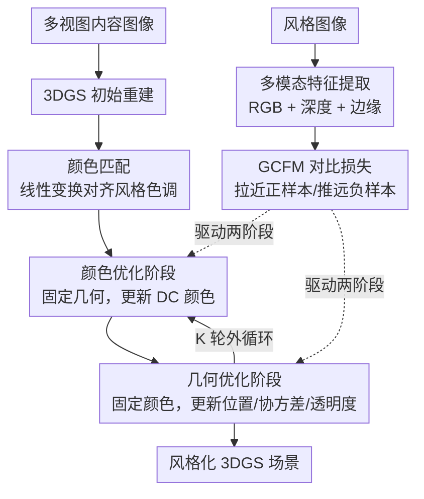

# Geometry-Aware Style Transfer in 3D Gaussian Splatting

**会议**: ECCV 2026  
**arXiv**: [2606.24144](https://arxiv.org/abs/2606.24144)  
**代码**: [https://github.com/oweixx/gast](https://github.com/oweixx/gast)  
**领域**: 3D 视觉  
**关键词**: 3D 高斯泼溅, 风格迁移, 解耦优化, 对比学习, 几何感知

## 一句话总结
本文提出一种几何感知的 3DGS 风格迁移框架，通过解耦优化交替更新颜色和几何参数，并引入多模态（RGB + 深度 + 边缘）对比特征匹配损失 GCFM 来引导风格结构和几何纹理的迁移，在风格保真度和多视图一致性上显著优于现有 3DGS 风格迁移方法。

## 研究背景与动机
2D 图像风格迁移已相当成熟，从 Gatys 的 Gram 矩阵到扩散模型均有成功方案，但无法保证跨视角一致性。随着 NeRF 和 3DGS 的兴起，3D 风格迁移成为可能——其中 3DGS 凭借显式几何原语和实时渲染能力，成为该方向的主流 backbone。

然而，现有 3DGS 风格迁移方法普遍采取保守策略：**只迁移颜色/外观属性，对几何参数施加强约束保持不变**。原因在于 3DGS 的渲染结果对几何参数的变化极为敏感——颜色修改仅影响表面外观，而直接修改几何参数（位置、协方差、透明度）会改变场景底层结构，即使微小的几何误计算也会严重破坏视觉质量。这就好比在家具表面贴木纹墙纸：纸能贴合外形，但永远无法改变结构来体现真实木材的凹凸纹理和结构不规则性。

由此形成一个核心矛盾：**几何是风格的重要载体（如梵高笔触的厚度、立体主义的块面结构），但直接优化 3DGS 几何参数极易导致场景崩塌**。现有方法要么只优化颜色（StyleGaussian、SGSST），要么仅在前处理阶段做有限几何调整（GStyle 的 Gaussian 分裂），要么用深度保持损失约束几何使其不变（StylizedGS、ABCGS）——本质都是回避几何风格化，而不是把几何当作风格的表达媒介。

核心 idea：将颜色和几何视为风格化的两个平等维度，通过**解耦交替优化**消除两者的更新干扰，并用**多模态对比特征匹配**（同时考虑 RGB、深度、边缘）来引导几何结构向目标风格对齐。

## 方法详解

### 整体框架
本文的目标是将一张 2D 风格图像 $\mathbf{I}^{\mathcal{S}}$ 的艺术风格迁移到由一组多视图内容图像 $\mathbb{I}^{\mathcal{C}}$ 重建的 3DGS 场景上，同时保持空间和几何一致性。整体流程分三步：

第一步，用标准 3DGS pipeline 从内容图像重建初始 Gaussian 表示 $\mathbb{G}^{\text{init}}$。第二步，用 ARF 的颜色匹配（color matching）对 Gaussian 颜色做线性变换，使初始颜色分布贴近目标风格，得到 $\mathbb{G}^{\text{c}}$。第三步是核心——通过解耦优化在外层循环中交替进行颜色优化阶段和几何优化阶段，两个阶段均由提出的 GCFM 损失驱动。

### 关键设计

**1. 解耦优化：交替更新颜色与几何，消除联合优化的相互干扰**

现有方法要么只优化颜色而冻结几何，要么联合优化两者但面临严重的优化冲突。联合优化（joint-step）时，颜色和几何的梯度同时传播，容易导致颜色过度风格化——优化过程为了嵌入低层风格纹理模式而错误地修改几何，进而破坏场景结构（如 Fig. 3 中花朵结构随迭代逐渐崩塌）。

本文提出的解耦优化将整个优化过程划分为 $K$ 个外循环，每轮依次求解两个子问题：

$$\boldsymbol{\Theta}^{k+1} = \arg\min_{\boldsymbol{\Theta}} \mathcal{L}(\boldsymbol{\Theta}, \boldsymbol{\Phi}^k) \quad \text{(颜色阶段)}$$

$$\boldsymbol{\Phi}^{k+1} = \arg\min_{\boldsymbol{\Phi}} \mathcal{L}(\boldsymbol{\Theta}^{k+1}, \boldsymbol{\Phi}) \quad \text{(几何阶段)}$$

其中 $\boldsymbol{\Theta}$ 为颜色参数（仅优化球谐系数的零阶 DC 分量，即基础 RGB，高阶系数保持不动），$\boldsymbol{\Phi} = \{\boldsymbol{\mu}_n, \boldsymbol{\Sigma}_n, \alpha_n\}$ 为几何参数（位置、协方差、透明度）。实践中每个子问题用固定步数的梯度下降近似求解：颜色阶段 $N_c = 10$ 步，几何阶段 $N_g = 90$ 步，外循环 $K = 30$ 轮，总共 3000 次迭代。

为什么有效：交替优化的本质是建立了一个"相互引导循环"——先更新颜色让外观贴近目标风格，为后续几何更新提供稳定的视觉参考；再更新几何时有了可靠的颜色基础，能更准确地判断哪些结构变化是风格所需要的而非噪声。消融实验也证实，联合优化的 SIFID（1.4220）明显差于解耦优化（1.1736），且出现了颜色过度风格化导致的场景崩塌。

**2. GCFM：多模态对比特征匹配，用 RGB + 深度 + 边缘联合引导几何风格对齐**

传统 3D 风格迁移中的特征匹配（如 ARF）通常只在 RGB 域做最近邻匹配，缺乏对几何结构的感知。本文提出的 GCFM 从三个维度捕捉风格特征：

- **颜色特征 $\mathbf{F}_{\text{color}}$**：从 VGG 提取的标准 RGB 特征，捕捉纹理和色彩风格。
- **深度特征 $\mathbf{F}_{\text{depth}}$**：渲染图的深度直接来自 3DGS 渲染管线；风格图的深度由 DepthAnythingV2 估计。深度提供粗粒度的空间结构信息。
- **边缘特征 $\mathbf{F}_{\text{edge}}$**：在深度图上用 Canny 算子提取，而非在彩色图上提取（因风格图纹理复杂、彩色边缘噪声大）。边缘捕捉结构边界，引导轮廓级别的形状对齐。

三模态特征按通道拼接为联合特征图 $\mathbf{F}^s = [\mathbf{F}_{\text{color}}^s, \mathbf{F}_{\text{depth}}^s, \mathbf{F}_{\text{edge}}^s]$（$s \in \{\mathcal{R}, \mathcal{S}\}$ 表示渲染图和风格图）。

与以往只用正样本（最近邻）匹配不同，GCFM 引入了对比学习机制：对于渲染特征图中每个空间位置 $\mathbf{x}$，在风格特征图中找到最相似的正样本 $\mathbf{y}^+(\mathbf{x})$ 和最不相似的负样本 $\mathbf{y}^-(\mathbf{x})$：

$$\mathbf{y}^+(\mathbf{x}) = \arg\min_{\mathbf{y}} D_{\cos}(\mathbf{F}^{\mathcal{R}}(\mathbf{x}), \mathbf{F}^{\mathcal{S}}(\mathbf{y}))$$

$$\mathbf{y}^-(\mathbf{x}) = \arg\max_{\mathbf{y}} D_{\cos}(\mathbf{F}^{\mathcal{R}}(\mathbf{x}), \mathbf{F}^{\mathcal{S}}(\mathbf{y}))$$

其中 $D_{\cos}(\cdot, \cdot) = 1 - \cos(\cdot, \cdot)$ 为余弦距离。GCFM 损失将渲染特征（锚点）拉向正样本、推离负样本：

$$\mathcal{L}_{\text{GC}} = \frac{1}{|\Omega_{\mathbf{F}}|} \sum_{\mathbf{x} \in \Omega_{\mathbf{F}}} \Big(2 + D_{\cos}(\mathbf{F}^{\mathcal{R}}(\mathbf{x}), \mathbf{F}^{\mathcal{S}}(\mathbf{y}^+(\mathbf{x}))) - D_{\cos}(\mathbf{F}^{\mathcal{R}}(\mathbf{x}), \mathbf{F}^{\mathcal{S}}(\mathbf{y}^-(\mathbf{x})))\Big)$$

消融表明，去掉对比目标（仅正样本匹配）会导致深度图中结构特征模糊；使用单模态（仅 RGB）会过度简化几何轮廓。完整的 GCFM（三模态 + 对比）能产生最锐利的几何轮廓和最忠实的风格结构复现。

### 损失函数 / 训练策略

总损失函数为四项加权和，颜色阶段和几何阶段使用不同的项：

$$\mathcal{L} = \lambda_{\text{GC}} \mathcal{L}_{\text{GC}} + \lambda_{\text{cont}} \mathcal{L}_{\text{cont}} + \lambda_{\text{TV}} \mathcal{L}_{\text{TV}} + \delta_{\text{reg}} \mathcal{L}_{\text{reg}}$$

- **GCFM 损失 $\mathcal{L}_{\text{GC}}$**（$\lambda_{\text{GC}} = 2.0$）：上文所述的多模态对比特征匹配损失，是风格迁移的核心驱动项。
- **内容保持损失 $\mathcal{L}_{\text{cont}}$**（$\lambda_{\text{cont}} = 1 \times 10^{-3}$）：VGG-16 感知损失，约束渲染图与内容图的特征距离，保证场景结构不被破坏。
- **TV 正则 $\mathcal{L}_{\text{TV}}$**（$\lambda_{\text{TV}} = 0.02$）：对渲染图施加水平和垂直方向的局部平滑约束，抑制高频噪声和边界伪影。
- **几何正则 $\mathcal{L}_{\text{reg}}$**（仅在几何阶段启用，$\delta_{\text{reg}} = 1$）：约束优化后的透明度 $\boldsymbol{\alpha}$、尺度 $\mathbf{s}$、旋转 $\mathbf{r}$ 不偏离颜色匹配后的初始值太远，并额外约束渲染深度图 $\mathbf{D}^{\mathcal{R}}$ 与参考深度图 $\mathbf{D}^{\text{c}}$ 一致，防止 Gaussian 膨胀、坍缩或全局模糊。

优化器为 Adam，学习率 $\eta = 1 \times 10^{-4}$（T&T 数据集降为 $2.5 \times 10^{-5}$），在单张 RTX A6000（48GB）上完成，单场景风格化平均约 14 分钟。

## 实验关键数据

### 主实验

8 个场景（LLFF 4 个 + T&T 2 个 + MipNeRF-360 2 个）和 9 种风格图像，共 72 组场景-风格组合。SIFID 衡量风格保真度（越低越好），短程/长程一致性用光流 warp + 遮罩 RMSE/LPIPS 衡量。

| 方法 | SIFID ↓ | 短程 LPIPS ↓ | 短程 RMSE ↓ | 长程 LPIPS ↓ | 长程 RMSE ↓ |
|------|---------|-------------|------------|-------------|------------|
| StyleGaussian | 3.3405 | 0.050 | 0.053 | 0.141 | 0.114 |
| G-Style | 1.2955 | 0.045 | 0.035 | 0.118 | 0.085 |
| StylizedGS | 2.2439 | 0.028 | 0.021 | 0.072 | 0.062 |
| SGSST | 1.3936 | 0.048 | 0.048 | 0.129 | 0.109 |
| CLIPGaussian | 3.3685 | 0.048 | 0.046 | 0.128 | 0.108 |
| **Ours** | **1.1736** | **0.042** | **0.034** | **0.114** | **0.084** |

本文方法在 SIFID 上取得最优（1.1736），大幅领先次优的 G-Style（1.2955）。多视图一致性方面，排除因过度平滑/去饱和导致指标虚高的 StylizedGS 后，本文在短程和长程 LPIPS/RMSE 上均排第一。同时在 37 人用户研究中，风格相似度、视觉吸引力和内容可辨识度三项均获最高分。

平均风格化时间 14 分 14 秒，显著快于 StyleGaussian（410 分钟）和 SGSST（59 分钟），在速度和质量间取得了最佳折中。

### 消融实验

**优化策略消融**（Table 3）：对比了仅优化几何、仅优化颜色、联合优化（joint-step）和解耦优化四种策略对 SIFID 和一致性的影响。

| 配置 | SIFID ↓ | 短程 LPIPS ↓ | 短程 RMSE ↓ | 长程 LPIPS ↓ | 长程 RMSE ↓ |
|------|---------|-------------|------------|-------------|------------|
| 仅几何 | 2.5496 | 0.045 | 0.040 | 0.113 | 0.096 |
| 仅颜色 | 1.5392 | 0.042 | 0.037 | 0.115 | 0.086 |
| 联合优化 | 1.4220 | 0.042 | 0.036 | 0.122 | 0.087 |
| **解耦优化 (Ours)** | **1.1736** | **0.042** | **0.034** | **0.114** | **0.084** |

仅几何 SIFID 最差（2.5496），因缺乏颜色适配无法有效匹配风格分布；仅颜色 SIFID 改善但仍有限（1.5392），因无法捕捉几何风格线索；联合优化 SIFID 中等（1.4220）但因颜色过度风格化导致长程一致性最差；解耦优化在所有指标上最优，证明分离颜色和几何更新能稳定优化、实现外观与几何的和谐融合。

**GCFM 消融**：去掉对比目标导致深度图中结构特征模糊；使用单模态（仅 RGB）导致几何轮廓过度简化；完整 GCFM 产生最锐利的几何轮廓和最忠实的结构复现。GCFM 权重 $\lambda_{\text{GC}}$ 在 1.0-10.0 范围内 SIFID 稳定（1.1683-1.1878），鲁棒性好。

**几何/颜色更新比例消融**：$N_g = 90, N_c = 10$ 取得最优 SIFID（1.1736）；$N_g = 100$（纯几何）刚性过强缺乏颜色适配，$N_g = 30$ 几何风格化不足。

### 关键发现
- 解耦优化的贡献最大：相比联合优化，SIFID 从 1.4220 降到 1.1736，同时解决了联合优化中的颜色过度风格化和场景崩塌问题。
- 几何优化不是可有可无的：仅颜色优化的 SIFID 为 1.5392，加入几何优化后提升至 1.1736，说明几何确实是风格表达的重要维度。
- GCFM 的多模态设计至关重要：深度 + 边缘的补充信息让特征匹配能感知结构，单 RGB 无法捕捉几何风格。
- 几何更新需要占主导地位（$N_g : N_c = 90 : 10$），反映出几何风格化比颜色风格化更需要精细的迭代。

## 亮点与洞察
- **解耦即稳定**：颜色和几何优化天然存在梯度冲突，交替更新是最简单的解决方案却十分有效——这种"分而治之"的思路对任何涉及多组参数联合优化的 3D 任务都有借鉴意义，不一定需要复杂的梯度调制或对抗训练。
- **多模态特征拼接做对比匹配**：RGB + 深度 + 边缘的通道拼接简单直接，但深度来自渲染管线、边缘在深度图上提取的设计很讲究——避免了风格图纹理复杂导致彩色边缘噪声大的坑，体现了对"什么信息从什么源提取"的细致思考。
- **对比学习中显式引入负样本**：以往特征匹配只用最近邻正样本，GCFM 显式推远最远邻负样本，迫使模型学习更具判别力的风格表示。这个思路可以迁移到其他需要跨域特征对齐的任务（如 3D 编辑、text-to-3D 中的 reference-based 控制）。
- **几何正则锚定初始状态**：在几何优化阶段约束参数不偏离颜色匹配后的状态太远，本质上是一种"信任初始化"的策略——让模型在有引导的前提下探索几何变形，而非无约束地自由发挥导致崩塌。

## 局限与展望
- 作者未明确讨论的局限：方法依赖 DepthAnythingV2 估计风格图像的深度图，对于高度抽象/非写实风格（如纯色块、极简线条），深度估计可能不准确甚至无意义，此时 GCFM 的深度和边缘支路可能引入噪声而非有用信号。
- 风格化时间虽快于多数方法，但仍需约 14 分钟/场景，离实时交互还有距离。每场景的 Gaussian 数量（0.54M-4.20M）对 GPU 显存需求较高（高达 39 GB）。
- 几何风格化的"度"由目标纹理尺度（scale）和 $N_g / N_c$ 比例控制，缺少更直观的用户可控参数（如"几何变形强度"滑块），对艺术家用户不够友好。
- 改进思路：（1）用可学习的深度/边缘权重替代固定拼接，让模型自适应决定不同风格下各模态的重要性；（2）探索 feed-forward 的几何风格化网络，摆脱逐场景优化的限制；（3）结合扩散模型的先验知识，在更抽象的语义层面引导几何变形，而不局限于像素级特征匹配。

## 相关工作与启发
- **vs ARF / SNeRF / CoARF（NeRF 风格迁移）**: 这些方法在 NeRF 上做特征匹配风格迁移，但 NeRF 的隐式表示导致渲染慢、几何操作困难。本文在 3DGS 的显式原语上操作，天然支持实时渲染和直接几何修改。
- **vs StyleGaussian / SGSST**: 它们只更新颜色属性、冻结几何，把风格迁移简化为"给 3D 模型换皮肤"。本文证明几何也可以是风格载体，且解耦优化让这一过程变得稳定可行。
- **vs GStyle**: GStyle 通过 Gaussian 分裂引入有限几何变化，但本质是预处理而非优化目标的一部分。本文将几何优化作为核心优化阶段，并由 GCFM 显式引导。
- **vs StylizedGS / ABCGS**: 两者用深度保持损失约束几何，本质是"防止几何变化"而非"利用几何表达风格"。本文反其道而行之，用深度和边缘特征主动引导几何向目标风格对齐。
- **vs CLIPGaussian**: CLIPGaussian 支持颜色和几何联合优化，但强调外观适配，几何风格化相对不足。本文用解耦优化和 GCFM 在几何风格化上做得更深入和稳定。

## 评分
- 新颖性: ⭐⭐⭐⭐ 首次在 3DGS 上将几何视为风格化的"一等公民"而非被保护对象，解耦优化 + GCFM 的组合简洁有效。不过解耦交替优化和对比特征匹配各自都不是全新概念，创新主要在于组合方式和针对 3DGS 几何敏感性问题的适配。
- 实验充分度: ⭐⭐⭐⭐⭐ 72 组场景-风格组合、5 个 baselines、SIFID + 多视图一致性 + 用户研究 + 推理时间 + GCFM 消融 + 优化策略消融 + 更新比例消融 + 超参敏感性，覆盖全面且深入。
- 写作质量: ⭐⭐⭐⭐ 结构清晰，Fig. 3 联合 vs 解耦的可视化对比非常直观地说明了核心动机。supplementary 丰富（算法伪代码 + 逐场景效率 + 用户研究细节 + 额外定性对比）。部分公式符号偏多但可读性尚可。
- 价值: ⭐⭐⭐⭐ 打开 3DGS 几何风格化这个被社区回避的方向，为后续工作（如可控几何风格化、text-to-3D 几何引导）提供了扎实的 baseline 和技术路线。代码已开源，实用性强。

<!-- RELATED:START -->

## 相关论文

- [\[AAAI 2026\] GT2-GS: Geometry-aware Texture Transfer for Gaussian Splatting](../../AAAI2026/3d_vision/gt2-gs_geometry-aware_texture_transfer_for_gaussian_splatting.md)
- [\[ICCV 2025\] Tune-Your-Style: Intensity-Tunable 3D Style Transfer with Gaussian Splatting](../../ICCV2025/3d_vision/tune-your-style_intensity-tunable_3d_style_transfer_with_gaussian_splatting.md)
- [\[NeurIPS 2025\] CLIPGaussian: Universal and Multimodal Style Transfer Based on Gaussian Splatting](../../NeurIPS2025/3d_vision/clipgaussian_universal_and_multimodal_style_transfer_based_on_gaussian_splatting.md)
- [\[ECCV 2026\] DefenseSplat: Enhancing the Robustness of 3D Gaussian Splatting via Frequency-Aware Filtering](defensesplat_enhancing_the_robustness_of_3d_gaussian_splatting_via_frequency-awa.md)
- [\[ECCV 2026\] Capacity-Controlled Multi-View Stylization of 3D Gaussian Splatting](capacity-controlled_multi-view_stylization_of_3d_gaussian_splatting.md)

<!-- RELATED:END -->
