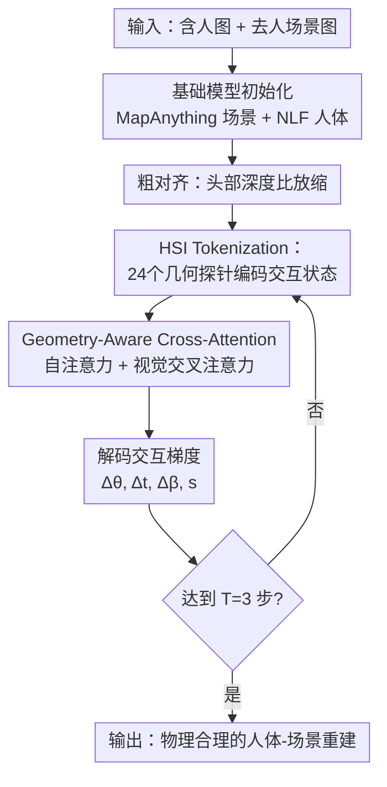

# GRAFT: Geometric Refinement and Fitting Transformer for Human Scene Reconstruction

**会议**: ECCV 2026  
**arXiv**: [2604.19624](https://arxiv.org/abs/2604.19624)  
**项目页**: https://pradyumnaym.github.io/graft (有代码/视频)    
**领域**: 3D视觉  
**关键词**: 人体-场景交互重建, 几何探针, 迭代细化, Transformer, 物理合理性

## 一句话总结
GRAFT 是一个学习到的"人体-场景交互先验"，它将基于优化的物理合理性拟合过程"摊销"进一个前馈 Transformer 中——通过几何探针将人体-场景的相对关系编码为 24 个紧凑 token，在循环迭代中预测"交互梯度"纠正漂浮和穿透，最终以 0.2s 的前馈速度达到优化方法级别的交互质量，且可作为即插即用先验提升任何前馈方法。

## 研究背景与动机
从单张 RGB 图像重建物理合理的 3D 人体-场景交互（HSI）面临一个根本性的速度-质量矛盾。优化类方法（如 PhySIC、PROX）通过显式能量函数建模接触和穿透约束，交互质量高，但每帧需要约 20s 的测试时优化，且依赖解析梯度，易陷局部极小值，无法学习可泛化的交互先验。前馈类方法（如 Human3R、UniSH）基于基础位姿和深度模型联合回归人体和场景，推理快（0.2-0.4s），但**在解码人体姿态时从不查询场景几何**——模型完全依赖从训练数据中记住的统计关联来猜测人与场景的关系，导致输出的人体网格频繁漂浮于地面之上或穿透家具墙壁。

核心矛盾在于：优化方法"知道"如何利用场景几何约束人体的物理合理性，但太慢；前馈方法快，但"不知道"场景几何与人体姿态之间应有的约束关系。那么，能否把几何约束推理从前馈模型中剥离出来，学习一个专门的"交互先验"模块——它知道人体应该如何相对场景摆放，能在一次前馈推理中直接把一个不合理的初始状态修正到物理合理？本文据此提出 GRAFT，核心 idea 是：**将几何驱动的优化拟合过程 amortize 成一个前馈 Transformer，让它直接回归从"不合理交互状态"到"物理合理配置"的修正轨迹（Interaction Gradient），而非在测试时逐帧跑优化器。**

## 方法详解

### 整体框架
GRAFT 从一个单张 RGB 图像出发，联合重建场景几何和人体网格。输入是含人图像和去人后的场景图像，输出是经过迭代细化的人体 SMPL-X 参数。整体流程分两步：先用两个独立的基础模型分别估计场景点云（MapAnything）和人体网格初值（NLF），然后做一个粗对齐（按头部深度比放缩），得到初始交互状态。这时的状态通常仍存在明显的漂浮和穿透。接着，GRAFT 核心模块——一个轻量迭代 Transformer——接手：它从当前人体网格上采样几何探针，捕获每个人体部位与周围场景表面的距离、方向和法线关系，编码成 24 个 HSI token，经过自注意力和几何感知交叉注意力融合图像特征后，解码出参数修正量加到当前参数上，得到新的人体网格；然后重新采样探针，再次修正。循环 T=3 次后输出最终结果。

### 关键设计

**1. HSI Tokenization 与几何探针：用 24 个身体锚定 token 紧凑编码交互状态**

人体-场景交互的本质是局部几何关系——脚底离地面有多远、后背离沙发有几厘米、手掌按在桌面时法线方向对不对。以往方法要么用密集的身体中心表示（如 BPS 的约 4K 参数、POSA 的约 10K 参数），容易过拟合训练场景且推理慢；前馈方法干脆完全不用场景几何编码。GRAFT 的设计是：在人体上固定 24 个锚点——21 个身体关节、2 个手部 token（左右各一，聚合五指远端关节）、1 个全身 token（聚合 27 个均匀采样的身体表面顶点），每个锚点向场景点云发射一个几何探针（Geometric Probe）——找最近场景点，计算相对偏移向量 $\mathbf{v}_s$、该点的表面法线 $\mathbf{n}^*$、以及锚点在身体相对坐标系下的位置。三者经可学习傅里叶特征编码后，与当前关节的 SMPL-X 参数上下文拼接，经 MLP 投影为统一维度的 token 嵌入：

$$\mathbf{z}_k^t = \phi_k([\mathbf{g}_k^t; \mathbf{p}_k^t]), \quad \mathbf{Z}^t = \{\mathbf{z}_k^t\}_{k=1}^{24}$$

总共仅约 500 个几何参数——比 BPS/POSA 小一个数量级，抑制了过拟合，且使自注意力的二次复杂度可控。这个设计的关键洞察是：**接触和穿透的信息天然存在于"身体点到最近场景表面的距离和方向"中**，不需要完整 SDF 或密集距离场，最近邻查询就够了——只要在每一轮迭代重新查询，身体移动后距离和法线会随之变化，天然构成纠正方向的物理梯度。

**2. 几何感知交叉注意力：将视觉特征稀疏绑定到几何探针上**

纯几何探针虽然捕获了接触/穿透信息，但单目点云是局部且不完整的（遮挡面没有点），仅靠几何可能无法区分"脚确实踩在地上"和"脚被前景桌子遮挡导致最近点是地面"这两种情况。因此 GRAFT 引入图像特征来消歧：对每个人体锚点，将其 3D 位置投影到去人场景图和原图上，用双线性采样抽取多尺度 MapAnything 特征（4 层，每层投影到 128 维后拼接），作为该 token 的视觉上下文。注意力机制遵循一个稀疏约束：**每个 HSI token 只交叉注意到自己锚点采样的视觉特征**，而不是全局注意力到所有图像 token——这强制了 token 与图像的局部对应，避免 attention 分散到无关区域。

$$\widetilde{\mathbf{Z}}^t = \text{Self-Attn}(\mathbf{Z}^t), \quad \widehat{\mathbf{Z}}^t = \text{Cross-Attn}(\widetilde{\mathbf{Z}}^t, \mathbf{V}^t)$$

5 层 Transformer 交替做两件事：自注意力让 token 之间交流全局的交互上下文（比如脚踩地需要躯干重心前移、手扶墙需要肩膀旋转配合——即肢体间的支撑-接触耦合），稀疏交叉注意力让每个 token 从自己的图像邻域获取视觉线索。这种"几何探针 + 局部视觉"的双源融合，比直接让 transformer 自由注意所有图像 token 更高效且更鲁棒——在训练数据量有限时，低维几何先验比高维视觉特征更不容易过拟合。

**3. 循环迭代细化：每一步重新探针，闭合几何反馈回路**

这是 GRAFT 区别于所有前馈方法的核心机制。前馈方法输出即终结——如果第一次猜错了接触关系，没有第二次机会。GRAFT 则是一个循环：当前步解码出 $\Delta\mathbf{\Theta}^t, s^t$，更新参数得到 $\mathbf{\Theta}^{t+1}$，然后**重新计算所有几何探针**——因为人体网格移动了，每个锚点到场景最近点的距离和法线都变了，这个变化本身就是"纠正方向是否正确"的天然反馈信号。用新探针重新编码 token，再用**共享权重**的 Transformer 推理下一步修正量。经过 T=3 步迭代，人体网格逐步从初始的漂浮/穿透状态收敛到物理合理的配置。

$$\mathbf{\Theta}^{t+1} = \mathbf{\Theta}^t + \Psi(\widehat{\mathbf{Z}}^t)$$

这个设计使得 GRAFT 的几何探针不必一次性编码所有信息（一次探针只捕获当前状态的局部几何），而是通过"探针→修正→重探→再修正"的闭环，逐步逼近正确交互——本质上是把优化过程中的梯度下降轨迹学进了 Transformer 的权重里。论文用消融实验证实：去掉循环训练（只做单步监督），F1 从 0.565 跌到 0.358——这是所有消融中掉点最多的，说明多步闭环是 GRAFT 有效性的第一支柱。

**4. 快速可微放缩更新：闭式近似实现高效多步训练**

从单目 RGB 恢复的人体-场景对齐中，尺度模糊是最主要的误差来源——2D 对齐通常准确，残留误差主要表现为全局度量尺度不一致。GRAFT 显式预测一个全局均匀放缩因子 $s$ 施加到网格顶点上，而不是让形状参数 $\boldsymbol{\beta}$ 和位移 $\boldsymbol{t}$ 去间接修正尺度。这样做的好处是解耦——尺度纠正是线性的，$\boldsymbol{\beta}$ 的 10 个系数和 $\boldsymbol{t}$ 的 3 个分量不需要承担额外尺度修正负担。但直接在训练中对放缩后的顶点重拟合 SMPL-X 的形状系数开销巨大（每步都要最小二乘拟合）。作者观察到：SMPL-X 的形状 blendshape 对顶点作用是线性的，因此均匀放缩可以被解析地吸收进形状系数：

$$\boldsymbol{\beta}_s = s \cdot (\boldsymbol{\beta} + \mathbf{c}) - \mathbf{c}, \quad \mathbf{c} = (\mathbf{S}\mathbf{S}^\top)^{-1} \mathbf{S} \mathbf{T}$$

其中 $\mathbf{c}$ 是均值模板在 $\boldsymbol{\beta}$ 空间的最小二乘投影，离线预计算一次即可。这使得多步 rollout 监督的计算开销从"每步一次最小二乘拟合"降为"每步一次向量加减"，使 T=3 步的端到端训练在单张 H100 上实际可行。

### 一个完整示例

以一个"人靠墙站立"的场景为例走一遍 GRAFT 推理流程。输入是一张 RGB 照片，先用 OmniEraser 把人抹掉得到 $\mathcal{I}_s$，MapAnything 从 $\mathcal{I}_s + \mathcal{I}_h$ 联合推理得到场景点云 $\mathcal{P}_s$ 和特征图 $\mathcal{F}_s, \mathcal{F}_h$；NLF 从 $\mathcal{I}_h$ 估计人体 SMPL-X 参数初值。NLF 预测的人体全局尺度可能与场景不一致（如场景距离 3m，人体尺度当 2.5m 放），通过头部深度比粗对齐：头关节投影到 $\mathcal{P}_h$ 取场景 z 值，与头关节 z 做商得放缩因子 $s^0$，对齐后得到初始状态 $\mathbf{\Theta}^0$。

**第 1 步 (t=0)**：对 $\mathbf{\Theta}^0$ 采样 24 个探针——脚底探针发现到地面的距离是 0.15m（悬浮！），后背探针发现到墙的距离是 -0.05m（穿透！），法线指向与墙面法线相反。这些几何信号与 SMPL-X 参数编码成 token，经 5 层 Transformer 后解码出 $\Delta\mathbf{\Theta}^0$：脚跟下沉 12cm、躯干前推 8cm。更新后得到 $\mathbf{\Theta}^1$。

**第 2 步 (t=1)**：重采样探针——脚底距离缩到 3cm，后背穿透消除但还有 2cm 间隙。Transformer（同一套权重）解码出更精细的修正：脚跟再沉 2cm、手肘旋转 3 度让前臂贴墙、全局放缩微调 0.98 倍。更新后得到 $\mathbf{\Theta}^2$。

**第 3 步 (t=2)**：再重采样——脚底距离 < 1cm（接触建立）、后背距离 < 1cm（贴墙）、法线方向一致。Transformer 输出接近零的残差（接近收敛），最终 $\mathbf{\Theta}^3$ 实现物理合理的靠墙站立。

整个过程 0.2s，三次迭代中探针的距离信号从 15cm→3cm→<1cm 逐次收敛，体现了几何反馈回路的作用。

### 损失函数 / 训练策略
训练使用 GT SMPL-X 标注，对完整轨迹的每一步都施加监督（per-step supervision），总损失为：

$$\mathcal{L} = \sum_{t=1}^{T} \left( \lambda_p \|\boldsymbol{\theta}^t - \boldsymbol{\theta}^*\|_2^2 + \lambda_v \|\mathcal{V}^t - \mathcal{V}^*\|_2^2 + \lambda_n \|\widetilde{\mathcal{V}}^t - \widetilde{\mathcal{V}}^*\|_2^2 \right)$$

三项分别监督：6D 旋转（$\lambda_p$，不同关节组权重不同：全局朝向 5.0、身体姿态 2.0、手部 0.5）、相机相对顶点（$\lambda_v=7.0$，耦合监督位移 t 和尺度 s）、去均值顶点（$\lambda_n=5.0$，隔离形状监督）。**关键亮点：不使用显式的接触/穿透损失。** 作者论证几何探针已经在每步编码了距离和法线，接触和非穿透约束从 GT 姿态回归中隐式涌现出来——且对单目局部点云来说，显式接触损失反而因遮挡面的虚假最近邻对应而不稳定。消融实验也证实增加 V2S 或 contact+penetration loss 效果好坏不定（不同数据集结果矛盾）。

训练策略：使用 InHabitants 伪标签数据集（7.5k 图像、9.7k 人体实例），Adam 优化器 215k 步，峰值学习率 1e-4，线性预热后余弦衰减。训练查询按一定比例混合 NLF 初始状态、GT 状态和高斯扰动 GT 状态（平移噪声 0.1m，形状噪声 0.03，姿态噪声 7 度），使模型既能纠正大误差，又在接近最优时稳定输出接近零的残差。课程式 rollout：从单步监督逐步增加到完整 T=3 步（10k 步后全开）。视觉锚点 dropout 概率 0.35，防止对图像外观的过拟合。

## 实验关键数据

### 主实验
GRAFT 在 RICH-100 和 PROX-test 两个数据集上与优化方法（PROX、PhySIC、HolisticMesh）和前馈方法（UniSH、Human3R）对比，同时评估 GRAFT 的几何纯模式（无视觉特征）作为即插即用先验叠加到 Human3R 上的效果。

| 数据集 | 方法 | 前馈? | PA-MPJPE↓ | V2S↓(mm) | D2S↓(deg) | Prec.↑ | Recall↑ | F1↑ |
|--------|------|--------|-----------|-----------|------------|--------|---------|-----|
| RICH-100 | PROX | 否 | 120.24 | 538.67 | 79.38 | 0.069 | 0.253 | 0.108 |
| RICH-100 | PhySIC | 否 | 46.50 | 237.69 | 41.65 | 0.538 | 0.695 | 0.606 |
| RICH-100 | UniSH | 是 | 69.30 | 326.80 | 36.23 | 0.329 | 0.356 | 0.342 |
| RICH-100 | Human3R | 是 | 48.84 | 274.05 | 44.68 | 0.282 | 0.531 | 0.368 |
| RICH-100 | Human3R + Ours(几何纯) | 是 | 48.84 | 240.83 | 40.68 | 0.378 | 0.655 | 0.479 |
| RICH-100 | **Ours** | 是 | **46.32** | **224.66** | **34.60** | 0.473 | 0.743 | 0.578 |
| PROX-test | PROX | 否 | 76.98 | 224.49 | 59.60 | 0.458 | 0.144 | 0.219 |
| PROX-test | HolisticMesh | 否 | 81.30 | 170.64 | 54.48 | 0.427 | 0.348 | 0.383 |
| PROX-test | PhySIC | 否 | 44.17 | 148.05 | 47.11 | 0.550 | 0.424 | 0.479 |
| PROX-test | UniSH | 是 | 59.02 | 256.38 | 60.34 | 0.362 | 0.175 | 0.236 |
| PROX-test | Human3R | 是 | 59.25 | 200.35 | 59.36 | 0.228 | 0.324 | 0.268 |
| PROX-test | Human3R + Ours(几何纯) | 是 | 59.25 | 187.04 | 54.24 | 0.350 | 0.434 | 0.387 |
| PROX-test | **Ours** | 是 | **49.73** | **184.36** | **50.92** | **0.556** | **0.638** | **0.594** |

GRAFT 在两个数据集上全面超越所有前馈基线：在 PROX-test 上 F1 相对 Human3R 提升 121.6%，召回率提升 96.9%。几何纯模式（无视觉特征）叠加到 Human3R 上也能显著提升交互质量——RICH-100 上 F1 从 0.368 升到 0.479（+44%），PROX-test 上 F1 从 0.268 升到 0.387（+44%），证明了 GRAFT 作为即插即用交互先验的迁移能力。与最强优化方法 PhySIC 相比，GRAFT 在 PROX-test 的 F1 上已超越（0.594 vs 0.479），在 RICH-100 上接近（0.578 vs 0.606），但推理速度快约 100 倍（0.2s vs 20s）。用户调研中 64.8% 的参与者在三方盲评中选择 GRAFT（n=53，912 条回复），远超 33% 的随机水平。

### 消融实验

| 配置 | PA-MPJPE↓ | V2S↓ | F1↑ | 说明 |
|------|-----------|------|-----|------|
| Ours (完整) | 49.30 | 222.54 | 0.565 | RICH-100 完整模型 |
| Ours (仅初始化) | 43.51 | 240.30 | 0.411 | 仅粗对齐，不经 GRAFT 细化 |
| w/o rollout | 51.30 | 274.83 | **0.358** | 去掉多步循环监督，F1 暴跌 0.207 |
| w/o geometric feat. | 48.76 | 273.33 | **0.389** | 去掉几何探针特征，V2S 暴涨 50mm |
| w/o scale pred. | 50.29 | 239.45 | 0.508 | 去掉显式放缩预测，F1 掉 0.057 |
| w/o GT-training | 65.56 | 231.76 | 0.544 | 不含 GT 训练查询，PA-MPJPE 暴涨 16 |
| w/o visual feat. | 49.60 | 223.00 | 0.569 | 纯几何模式，性能几乎不降 |
| + V2S loss | 50.69 | 222.32 | 0.597 | 加 V2S 损失，PROX 上反而掉 |
| + contact & penetr. loss | 50.04 | 221.65 | 0.563 | 加接触穿透损失，效果好坏不定 |

消融揭示的核心发现：**(1)** Rollout（多步循环监督）和几何探针特征是最关键的两个设计——去掉任何一个都会导致交互指标严重退化，分别掉 0.207 和 0.176 F1。这意味着单步回归和多步闭环之间存在本质差距，几何探针提供的空间信息不可替代。**(2)** 显式放缩预测也有显著增益（F1 掉 0.057），证实尺度和平移/形状的解耦对学习有实际帮助。**(3)** GT 训练查询对稳定性至关重要——去掉后 PA-MPJPE 从 49.30 暴涨到 65.56，说明在接近最优时模型需要看到"输入已经是好的，应当输出零"的示例，否则会过度修正已良好的初始化。**(4)** 视觉特征在 RICH 上效果有限（纯几何 F1=0.569 vs 完整 0.565 几乎持平），但在 PROX 上提供明显增益（主要是召回率提升），说明在训练数据有限时低维几何先验比高维视觉特征更不易过拟合；但当存在多解时，图像证据能消歧。**(5)** 显式 HSI 损失（V2S loss / contact loss）效果不稳定——在 RICH 上 V2S loss 提升 F1 到 0.597，但在 PROX 上反而降到 0.563，支持了作者"几何探针已隐式编码接触信息"的设计主张。

### 关键发现
- **Rollout 监督是第一贡献**：去掉多步循环监督后 F1 暴跌 0.207，是所有消融中掉点最多的。单步前馈无法学习"初始→中间→收敛"的渐进修正轨迹。
- **几何探针的重要性超过视觉特征**：去掉几何探针特征后 V2S 从 222 暴涨到 274mm，而去掉视觉特征后的纯几何模型 F1=0.569，几乎等于完整模型 0.565。这说明交互推理的主体是几何而非视觉。
- **迭代次数 T=3 最划算**：第 1 步 F1 跳升最大（修复大部分粗粒度误差），后续步带来的边际收益递减但时间线性增长，T=3 是质量-速度的最佳平衡点（论文 Fig. 6）。
- **对初始化噪声鲁棒**：在 1m 标准差的高斯深度扰动下，GRAFT 只掉 0.02 F1（0.56→0.54），即使在极端 5m 噪声下 F1 仍达 0.34，超过 UniSH 和 Human3R 在无噪声时的 F1。

## 亮点与洞察
- **"几何探针 + 循环重探"闭合反馈回路**：这是论文最精巧的设计。不是一次性编码所有几何信息再一步回归到位，而是让每步修正后重新采样探针——身体移动了，距离和法线变了，这个变化本身就是天然的"纠正方向对不对"的反馈信号。相当于把优化器中梯度下降的轨迹蒸馏进了 Transformer 权重，多次前馈等效于多步优化。
- **24 个 token 的极端紧凑表示**：在 BPS（4K 参数）和 POSA（10K 参数）的背景下，GRAFT 用仅约 500 个几何参数达到了更好的交互质量。紧凑性不是单纯为了效率——它强迫模型学习交互流形上的低维结构，天然抑制对训练场景几何的过拟合，这是其在 in-the-wild 多人物场景中泛化好的关键原因。
- **即插即用模式改变游戏规则**：GRAFT 几何纯模式不需要任何图像特征，不需要重新训练下游方法，直接叠加到 Human3R 的预测上即可提升 F1 44%——这意味着它有可能成为 HSI 领域的"HMR 后处理标配"，任何输出 SMPL-X 的方法都可以用 GRAFT 做一次廉价的后处理来修复交互错误。
- **闭式放缩更新的小巧思**：利用 SMPL-X 形状 blendshape 对顶点的线性性，把均匀放缩放缩解析吸收进形状系数，避免了每步最小二乘拟合——这个 trick 本身原理简单，但在实际工程中使得多步 rollout 训练从"不可行"变成"单卡 H100 可训"，价值很大。
- **不显式加接触损失反而更好**：论文通过实验明确展示了显式 HSI losses 的收益不稳定，说明当输入信号已经包含足够的几何信息时，回归到 GT 姿态本身就足以隐式学习接触和穿透约束——这对设计类似几何 refinement 任务提供了方法论启示。

## 局限与展望
- **依赖上游基础模型质量**：GRAFT 的初始化依赖 MapAnything 的场景重建和 NLF 的人体估计，如果上游输出本身质量差（如严重缺失的场景点云、完全错误的人体姿态），GRAFT 的几何探针可能收不到有效信号。论文也坦承这一点，但这并非 GRAFT 特有——所有基于初始化的 refinement 方法都有此依赖。
- **刚性场景假设**：几何探针使用最近邻查询，隐式假设场景是刚性的——如果场景有可变形物体（沙发垫被压变形、床单褶皱等），最近点的关系可能产生误导信号。这是几何探针方法的本质局限。
- **严重遮挡下的多人交互处理困难**：论文承认 GRAFT 在严重遮挡的多人交互场景中表现下降。当前 token 按单人独立处理（共享权重并行），缺乏显式的人际交互建模（如两人握手、拥抱时的接触约束）。
- **伪标签质量瓶颈**：InHabitants 是伪标签数据集，GRAFT 的理论上限受其限制。论文明确表示这是"有希望的方向"——用更高质量的真实标注数据训练可能进一步缩小与优化方法的差距。当前 PA-MPJPE 从初始化 43.51 升到 49.30（接近 Human3R 的 48.84），但如果 GT 标注的关节角度更准确，这个 gap 应该会缩小甚至消失。
- **训练扰动策略可改进**：当前使用高斯扰动生成训练查询，只能产生"附近漂移"类的错误状态。更丰富的扰动策略（如对抗性的穿透生成、物理模拟驱动的漂移）可能让 GRAFT 学习到更强的纠错能力，特别是在复杂多点接触场景下。

## 相关工作与启发
- **vs 优化类 HSI 方法（PROX / PhySIC）**: 这些方法在测试时显式优化接触和穿透能量函数，对每个实例独立求解，优点是交互质量高且理论上保证物理约束，缺点是不可学习、慢、对初始敏感。GRAFT 的洞察是把"优化器做了什么"学进一个前馈网络，用多次前馈替代迭代优化——本质是"把测试时优化变成训练时学习"的范式转换。
- **vs 前馈 HSI 方法（Human3R / UniSH）**: 这些方法将人体和场景联合回归到同一个度量空间，但没有显式的人体-场景交互推理模块。GRAFT 揭示了为什么它们做不好交互：不是模型容量不够，而是设计上没有"查询场景几何"这个步骤。GRAFT 的几何探针直接填补了这个缺口，且可以作为插件提升它们。
- **vs 迭代细化方法（ReFit / WiLoR / LVD）**: 这些工作都在人体姿态估计中使用了迭代细化，但它们细化的对象是 2D 重投影对齐或图像特征，没有人做过"人体-场景关系"的迭代细化。GRAFT 的独特之处在于细化的信号源是 3D 场景几何而非 2D 图像——探针每次重新采样的是距离、法线等几何量，构成真正的闭环物理反馈。此外，纯几何模式使得 GRAFT 可以独立于视觉特征运行，这在之前的迭代方法中不存在。
- **vs 交互先验方法（POSA / PLACE / BPS）**: 这些方法编码场景为密集身体中心表示，然后做 generate-then-optimize 两阶段：先预测接触分布，再测试时优化拟合。GRAFT 把场景感知和姿态修正统一在一个前馈通路中，消除了测试时优化的需求，且用紧凑表示避免了密集表示的过拟合问题。

## 评分
- 新颖性: ⭐⭐⭐⭐☆ 把"几何驱动优化→前馈摊销"的范式用到 HSI 领域是新贡献；几何探针+循环重探构成闭合反馈的机制设计巧妙；但迭代细化的思路本身在人体姿态领域已有 ReFit/WiLoR 等先例，GRAFT 的核心增量在于把细化信号换成场景几何
- 实验充分度: ⭐⭐⭐⭐⭐ 双数据集、多基线（优化+前馈+几何纯叠加）、消融全面（6 个设计选择 + 2 种额外损失）、用户调研 n=53、噪声鲁棒性分析、可视化丰富，实验设计相当扎实
- 写作质量: ⭐⭐⭐⭐⭐ 结构清晰（Method 按 3.1/3.2 分步讲，Experiment 消融逻辑递进），图表质量高（Fig 2 框架图、Table 2 主结果、Table 3 消融含热力图），补充材料详尽（9 个 Appendix 含推导、算法伪代码、超参）
- 价值: ⭐⭐⭐⭐☆ 即插即用的几何纯模式是最大实用价值——任何 HSI 方法都可零成本接入获得提升；0.2s 的速度使实时应用成为可能；但伪标签训练和刚性假设限制了当前的上限，需要有更好的训练数据才能完全释放潜力

<!-- RELATED:START -->

## 相关论文

- [\[CVPR 2026\] FUSER: Feed-Forward Multiview 3D Registration Transformer and SE(3)$^N$ Diffusion Refinement](../../CVPR2026/3d_vision/fuser_feed-forward_multiview_3d_registration_transformer_and_se3n_diffusion_refi.md)
- [\[CVPR 2026\] SMVRT: Implicit Human 3D Modeling Using Sparse Multi-View Volumetric Reconstruction with Transformer Fusion](../../CVPR2026/3d_vision/smvrt_implicit_human_3d_modeling.md)
- [\[CVPR 2026\] ART: Articulated Reconstruction Transformer](../../CVPR2026/3d_vision/art_articulated_reconstruction_transformer.md)
- [\[CVPR 2026\] VIAFormer: Voxel-Image Alignment Transformer for High-Fidelity Voxel Refinement](../../CVPR2026/3d_vision/viaformer_voxel-image_alignment_transformer_for_high-fidelity_voxel_refinement.md)
- [\[CVPR 2026\] Complet4R: Geometric Complete 4D Reconstruction](../../CVPR2026/3d_vision/complet4r_geometric_complete_4d_reconstruction.md)

<!-- RELATED:END -->
