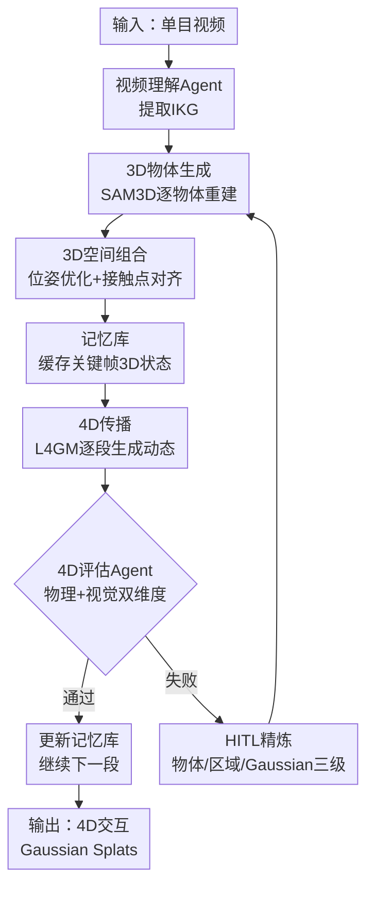

# HAT-4D: Lifting Monocular Video for 4D Multi-Object Interactions via Human-Agent Collaboration

**会议**: ECCV 2026  
**arXiv**: [2606.28215](https://arxiv.org/abs/2606.28215)  
**代码**: 有 (见项目主页)  
**领域**: 3D视觉  
**关键词**: 4D重建, 人机协同, 多智能体, 单目视频, 物体交互

## 一句话总结
HAT-4D 提出首个面向单目视频 4D 多物体交互重建的 agentic 框架：以交互知识图谱（IKG）为因果引擎驱动 3D 生成、空间组合和记忆增强 4D 传播，并通过多层级人在回路（HITL）协同解决深度歧义和遮挡难题，在 MVOIK-4D 基准上全面超越现有单目 4D 基线，且少量人工反馈即可显著提升交互重建质量。

## 研究背景与动机
从海量野外单目视频中提取动态 4D 物体交互是扩展具身智能和 VLA 训练数据的高效路径。然而现有方案走向两个极端：多相机采集系统（如 DIVA、4DSlomo）能捕获高质量无遮挡动态，但硬件昂贵且局限于受控工作室环境，无法规模化；基于扩散先验的生成方法（如 L4GM、GVFDiffusion、STAG4D）试图绕过硬件的束，却主要针对孤立、风格化资产（如游戏角色），面对真实世界中复杂的多物体交互时出现严重域差距，表现为非物理形变、悬浮交互和时序抖动。

核心矛盾在于：多视角采集的不可规模化成本 vs. 生成模型在真实交互场景下的不可靠质量。HAT-4D 在两者之间开辟第三条路——以 VLM 智能体为自动推理引擎，以稀疏人类知识为纠错信号，用可负担的成本实现物理上可信的 4D 交互重建。核心 idea：将物理交互理解显式化为结构化的交互知识图谱（IKG），让其充当因果引擎指导生成过程，并在关键歧义节点引入人在回路反馈打破误差累积。

## 方法详解

### 整体框架
HAT-4D 的输入是一段野外单目视频，输出是场景中多个交互物体的 4D Gaussian Splat 表示（含几何、动态和物理交互）。系统分四个阶段串行，带评估-回滚反馈回路和人在回路旁路。

首先，视频理解 Agent 调用 Qwen3-VL 将视频序列解析为结构化交互知识图谱（IKG），编码物体实体、交互事件段和时空关系。然后，3D 物体生成 Agent 在第一帧和各关键帧调用 SAM3D 重建各物体为 3D Gaussian Splats，3D 组合 Agent 通过轻量位姿优化将其对齐到统一场景坐标系并缓存到记忆库。接着，记忆增强的 4D 传播 Agent 以 L4GM 为算子，以渲染的多视图和记忆库关键帧为条件，逐段生成后续时刻的 3D 状态。每段生成后，评估 Agent 从动态物理合理性和静态视觉质量两个维度诊断，合格的更新记忆库继续传播，不合格的触发选择性回滚——动态错误局部重生成 4D 段，静态伪影回退到 3D 生成阶段。贯穿全流程，人类可在任意中间节点通过 Gaussian 级、区域级、物体级三层精炼算子干预纠错，纠正后的结果作为伪真值用于 L4GM 离线微调。

### 关键设计

**1. IKG：交互知识图谱作为因果引擎**

针对单目视频中物体交互的深度歧义和遮挡关系难以从像素级信号直接推断的问题，HAT-4D 将物理交互理解前置为显式的结构化表示。IKG 定义为动态时序条件有向图 $\mathcal{G}=(\mathcal{O},\mathcal{E},\mathcal{R})$，其中 $\mathcal{O}=\{o_1,...,o_n\}$ 为交互物体实体（封装语义元数据和物理属性如颜色、纹理、可形变性和可供性），$\mathcal{E}=\{e_1,...,e_m\}$ 为按状态变化切分的交互事件段（每段含起止时间戳、交互阶段标签和视觉质量最优的关键帧 $\ddot{T}_i$），$\mathcal{R}=\{\mathbf{R}_1,...,\mathbf{R}_m\}$ 为每段内的时空关系集合。

每个关系 $r_i$ 定义为四元组 $\langle(o_a,o_b),\mathcal{I},\mathcal{O}_{depth},\mathcal{S}\rangle$：(1) 交互物体对；(2) 交互语义 $\mathcal{I}$（细粒度原子动词谓词如 "knife cuts apple"，含置信度 $c$ 和距离提示 $d$）；(3) 深度排序 $\mathcal{O}_{depth}\in\{\prec_{depth},\succ_{depth},\emptyset\}$ 建立遮挡关系；(4) 相对位置 $\mathcal{S}$ 提供水平/垂直/深度三轴上的类别对齐约束。IKG 的核心价值在于将 VLM 从像素空间"奈何不了"的底层几何推理转化为符号空间"擅长"的高层物理关系推理——它不预测 6DoF 位姿数值，而是输出深度排序时间线和类别空间关系，由下游生成 Agent 将这些符号约束实例化为 3D/4D 几何。

**2. 记忆增强的 4D 传播与多维度评估回滚**

单目 4D 生成的致命问题是误差累积：早期帧的微小几何偏差在逐帧传播中被放大，最终导致物体漂移、穿透或消失。HAT-4D 用两个机制对抗：记忆锚定和评估回滚。

记忆机制维护一个容量为 8 的记忆库，存储 IKG 标记的关键帧处经 3D 组合验证的 Gaussian 状态。4D 传播算子 L4GM 以当前帧渲染的 4 个正交平面视图为空间初始化，同时以前一精炼帧和记忆库关键帧为时序条件，确保长期物体身份一致性。评估 Agent 从两个维度诊断：(1) 动态评估——物理合理性（如穿透违规）和长期记忆稳定性；(2) 静态评估——视觉保真度、纹理质量和跨视角一致性。评估失败时，动态物理错误触发 4D 传播阶段局部重生成，静态视觉伪影触发完整回滚到 3D 物体生成阶段做几何精炼。这种选择性回滚避免了全流程重跑的浪费。

**3. 多层级人在回路协同精炼机制**

尽管 VLM 在开放世界物理知识理解上展现强泛化能力，单目 4D 生成本质上是高度不适定问题——多解歧义场景下人类知识不可替代。HAT-4D 设计了三级精炼算子：(1) Gaussian 级——用户直接修改选中 Gaussian Splats 的位置、朝向、颜色和透明度；(2) 区域级——用户框选质量差的区域，系统用 SV4D 对该区域注入噪声后局部潜空间去噪，再以去噪结果监督优化对应 3D Gaussians 的颜色、透明度和几何参数；(3) 物体级——对特定物体重新调用 SAM3D 重建，再通过 Pixel-Align 位姿优化器（最小化渲染掩码与真值掩码的 Dice loss + 旋转/缩放/平移正则项）将其对齐到交互场景中。

特别的，人类纠错不仅影响当前样本——校正结果作为高质量伪真值加入训练集，用于 L4GM 的离线微调，形成"人在回路精炼 -> 伪真值积累 -> 基础模型能力提升"的数据飞轮。实验表明，仅 5 次人类干预即可将交互形变和关系得分分别从 3.90 和 2.88 提升至 5.93 和 5.03（满分 10），且物体级精炼贡献最大。

### 一个完整示例：刀切香蕉

以一段"刀切香蕉"的单目视频为例，走通 HAT-4D 全流程。输入视频约 4 秒，包含伸手取刀、下刀切割和香蕉分离三个阶段。

(1) 视频理解 Agent 将视频降采样为每 8 帧取 1 帧，送入 Qwen3-VL，输出 IKG：物体实体 $\mathcal{O}=\{\text{knife}, \text{banana}, \text{hand}\}$；事件段 $\mathcal{E}$ 划分为 $e_0$（接触：刀靠近香蕉）、$e_1$（切割：刀切入香蕉致其拓扑分裂）、$e_2$（分离：刀离开，香蕉分为两段）；关系 $\mathcal{R}$ 中 $e_1$ 段包含 "knife cuts banana, confidence=0.92"、深度排序 "hand $\prec_{depth}$ knife $\prec_{depth}$ banana"、位置约束 "knife above banana, overlap"。每个事件段标记关键帧 $\ddot{T}_i$——取视觉质量最优且遮挡最小的帧。

(2) 3D 生成阶段，在第一帧和 $e_1$ 关键帧处，Object Detection Agent 为 knife 和 banana 生成 SAM 点提示并迭代精炼分割掩码，SAM3D 重建为独立 3D Gaussian Splats。组合 Agent 根据 IKG 的空间关系初始化两物体位姿，通过轻量优化器精调 6DoF 并计算刀-蕉接触点，结果写入记忆库。

(3) 4D 传播阶段，从第一帧组合结果渲染 4 个正交视图，L4GM 以记忆库中第一帧和 $e_1$ 关键帧为条件，生成 $e_0\to e_1$ 的过渡动态。评估 Agent 渲染多视图视频检查：动态维度——刀是否在切割过程中穿透香蕉、香蕉形变是否自然；静态维度——渲染纹理是否清晰、跨视角颜色是否一致。假设评估发现 $e_1$ 段香蕉分裂后的几何出现锯齿伪影（静态问题），则触发回滚到 3D 生成阶段。

(4) HITL 介入：人类在 UI 中框选香蕉分裂区域，触发区域级精炼——SV4D 对选中区域的渲染视图注噪后局部去噪，去噪图像监督优化对应 Gaussian 的颜色和几何。精炼后的香蕉分裂面变得平滑。该结果不仅通过评估，还作为伪真值加入 L4GM 微调数据集。总人工干预 1 次（区域级），耗时约 30 秒。

### 损失函数 / 训练策略

HAT-4D 本身是免训练的 agentic 框架，但其底层可学习算子和优化模块涉及若干损失函数：(1) 位姿优化器使用 Dice loss 对齐渲染掩码与目标掩码，加旋转幅度 $\|\omega\|^2$、尺度对数 $\|\log s\|^2$ 和平移增量 $\|\Delta t\|^2$ 的正则项，可选锁定深度轴平移以保持深度一致性；(2) SV4D 区域精炼后的 Gaussian 优化使用 $\ell_1$ + SSIM 加权组合损失（仅作用于 ROI 区域，全局施加弱约束系数 $\alpha$），并对 Gaussian 尺度、颜色幅度和透明度施加正则以防止退化；(3) L4GM 离线微调使用标准重建损失，学习率 $1\times10^{-5}$，每场景切分为 8 帧片段，从 4 个正交输入视图渲染并保留 4 个捕获视图做验证。

## 实验关键数据

### 主实验

| 方法 | CLIP↑ | LPIPS↓ | FVD↓ | Deform↑ | Relation↑ | Intra↓ | Long↑ |
|------|-------|--------|------|---------|-----------|--------|-------|
| L4GM | 0.8259 | 0.1968 | 962.86 | 2.53 | 1.90 | 0.0013 | 0.0598 |
| GVFDiffusion | 0.8059 | 0.1961 | 1006.01 | 2.59 | 1.85 | 0.0017 | 0.0494 |
| SV4D | 0.7914 | 0.1933 | 1362.22 | 2.47 | 2.05 | 0.0017 | 0.0412 |
| STAG4D | 0.8167 | 0.1674 | 1013.84 | 2.09 | 1.57 | 0.0011 | 0.0650 |
| FB4D | 0.8307 | 0.1576 | 889.77 | 2.33 | 1.89 | 0.0011 | 0.0468 |
| HAT-4D (wo IKG) | 0.8370 | 0.1435 | 822.56 | 3.28 | 2.46 | 0.0006 | 0.0708 |
| HAT-4D (wo memory) | 0.8319 | 0.1467 | 834.12 | 3.42 | 2.56 | 0.0006 | 0.0621 |
| **HAT-4D (Ours)** | **0.8275** | **0.1433** | **830.41** | **3.45** | **2.57** | **0.0005** | **0.0901** |

HAT-4D 在 LPIPS 和所有交互/记忆指标上取得最优，FVD 仅次于消融版，CLIP 略有下降（作者解释为 IKG 长上下文削弱了 VLM 判别力）。交互质量上 Deform 和 Relation 分别比最强基线 FB4D 提升 48% 和 36%，长期记忆 Long 指标比次优的 STAG4D 提升 39%。值得注意的是，CLIP 略低于去掉 IKG 的变体，但交互和记忆指标全面碾压——语义对齐的微小让步换来物理合理性和时序一致性的显著增益。

### 消融实验：人类干预预算与精炼算子

| HIF次数 | CLIP↑ | LPIPS↓ | FVD↓ | Deform↑ | Relation↑ | Intra↓ | Long↑ |
|---------|-------|--------|------|---------|-----------|--------|-------|
| 0 | 0.8341 | 0.1603 | 889.96 | 3.90 | 2.88 | 0.0005 | 0.0012 |
| 3 | 0.8489 | 0.1528 | 819.58 | 5.47 | 4.79 | 0.0005 | 0.0026 |
| 5 | 0.8521 | 0.1532 | 799.67 | 5.93 | 5.03 | 0.0005 | 0.0027 |
| 7 | 0.8518 | 0.1534 | 798.49 | 5.90 | 4.94 | 0.0006 | 0.0023 |

| 精炼配置 | CLIP↑ | LPIPS↓ | FVD↓ | Deform↑ | Relation↑ | Intra↓ | Long↑ |
|----------|-------|--------|------|---------|-----------|--------|-------|
| 纯Agent | 0.8330 | 0.2126 | 860.55 | 4.10 | 3.03 | 0.0006 | 0.0013 |
| +物体级 | 0.8641 | 0.2060 | 685.70 | 6.18 | 5.15 | 0.0006 | 0.0014 |
| +物体+区域 | 0.8657 | 0.2051 | 681.73 | 5.80 | 5.15 | 0.0006 | 0.0016 |
| +物体+Gaussian | 0.8659 | 0.2044 | 686.98 | 5.88 | 5.25 | 0.0006 | 0.0014 |

消融揭示三个关键规律：(1) 人类干预收益边际递减——从 0 到 3 次干预提升巨大（Deform +40%、Relation +66%），3 到 5 次仍有增益，5 到 7 次近乎饱和，说明稀疏关键帧纠错足以打破误差累积链；(2) 物体级精炼是主力——它纠正几何、位姿、遮挡和交互错误，FVD 从 860 直降到 686，Relation 从 3.03 跃升至 5.15；(3) 区域级和 Gaussian 级是补充——区域级在 FVD 和 Long 上最优（局部去噪利于时序平滑），Gaussian 级在 CLIP/LPIPS/Relation 上最优（精确控制减少外观不一致）。

### 关键发现
- IKG 是交互指标的核心贡献者：去掉 IKG 后 Deform 从 3.45 降至 3.28、Relation 从 2.57 降至 2.46，但 CLIP 反而上升——IKG 长上下文虽削弱 VLM 对语义相似度的判别，却是物理合理性推理的根基。
- 记忆模块主要贡献在长期一致性：去掉记忆库后 Long 从 0.0901 跌至 0.0621，而短期 Intra 几乎不变（0.0005 vs 0.0006），说明记忆机制精准解决了长期遮挡后的物体重现问题。
- 在三个挑战子集上 HAT-4D 均有效：深度歧义场景 LPIPS 相对最强基线提升 16.9%、拓扑变化场景 Intra 提升 60%、重度遮挡场景 Deform 提升 10.3%。
- 微小人类反馈即显著改善交互重建——HIF=3 时的 Deform 和 Relation 已经远超 HIF=0，证实"人机协同"范式的可行性。
- HAT-4D 产出的数据可用于下游微调：在 63 个高质量标注场景上微调 L4GM，随机采样多视图监督比抖动视图监督带来更稳定的 PSNR 收敛，验证了 MVOIK-4D 作为 4D 数据引擎的价值。

## 亮点与洞察
- IKG 的设计体现了"符号接地"思想：不让 VLM 直接输出数值位姿（那是它不擅长的），而是输出类别深度排序和空间关系约束（那是它擅长的），再由几何优化器将这些符号约束"落地"为 6DoF 位姿——这个"高层推理 + 底层优化"的分工范式可迁移到任何需要 VLM 辅助 3D 理解的场景。
- 评估-回滚机制是 agentic 系统的经典模式，但 HAT-4D 的选择性回滚（区分动态 vs 静态错误、局部重生成 vs 全流程回退）避免了简单粗暴的"失败就重来"——这种错误分类+差异化恢复策略在 robot learning 中的错误恢复研究中有直接对应，值得关注。
- 三级 HITL 精炼算子的粒度设计具有实用性：物体级解决大问题（几何/位姿/遮挡），区域级做局部去噪（时序平滑），Gaussian 级做像素级精修（外观一致）——这个由粗到精的层次在标注工具设计中是可复用的 UX 模式。
- 实验验证了"少量人类反馈大幅提升交互重建"这一核心假设，5 次干预即可达到接近饱和的性能——这意味着 HAT-4D 的实际部署成本可控，并非"理论上有 HITL 但实际需要大量人工"的花架子。

## 局限与展望
- 作者承认复杂柔性形变（如挤压折叠薄塑料盒）和快速非刚体运动（如弹簧玩具急速伸缩）仍是挑战，运动模糊破坏了 SAM3D 的几何重建质量——这其实是底层 3D 重建算子的瓶颈，非 agentic 框架能解决。
- 系统性能强依赖于底层 VLM 的推理能力和推理效率，文中未讨论不同 VLM（如 GPT-4V vs Qwen3-VL）对 IKG 质量和最终重建的影响——这是一个明显的消融缺口。
- MVOIK-4D 的 112 个场景虽覆盖 77 个任务和 39 种交互类别，但相比真实世界的交互多样性仍显有限；此外，ToolOIK-4D 侧重工具交互、MemoryOIK-4D 侧重遮挡记忆，缺失"多物体协同交互"（如两人协作）的场景覆盖。
- HITL 实验的"志愿者只能使用指定精炼工具"限制了生态效度——现实中用户会混合使用三级工具，当前实验无法揭示工具组合的协同效应。
- HAT-4D 产出的伪真值用于微调 L4GM 虽有 PSNR 提升，但未报告微调后模型在交互质量指标上的变化——这对验证"数据引擎 -> 模型能力提升"闭环至关重要。

## 相关工作与启发
- **vs L4GM / GVFDiffusion / SV4D**：这些端到端 4D 生成方法依赖大规模合成数据集训练，面对真实交互场景域差距导致生成质量不稳定。HAT-4D 不与之竞争"谁生成的 4D 更好"，而是提出"用 agent + HITL 让现有 4D 算子更好"的元框架——这是方法定位的本质差异，也是可泛化的思路：任何不够鲁棒的生成模型都可以套一个评估-精炼-回滚的 agent 壳来提升可靠性。
- **vs SAM (Segment Anything)**：SAM 提出了"模型预测 + 人工校正 -> 迭代扩展数据集"的数据引擎范式，HAT-4D 将其从 2D 分割推广至 4D 交互重建——人在回路的层次从稀疏点击升级为三级 Gaussian 编辑。这种范式迁移可在 3D/4D 标注工具设计中直接借鉴。
- **vs 传统多相机 4D 采集（DIVA / 4DSlomo）**：HAT-4D 不是要替代而是在"不可采集"的场景填补空白——单目视频无处不在而多相机 rig 只能在工作室，这一"用智能换硬件"的思路是 scaling 具身智能数据的核心方向。

## 评分
- 新颖性: ⭐⭐⭐⭐⭐ 首个将 agentic 框架 + HITL 引入单目 4D 交互重建，IKG 作为因果引擎的设计思路在 4D 领域尚无同类工作
- 实验充分度: ⭐⭐⭐⭐ 主实验覆盖 5 个基线、7 项指标，消融涵盖模块移除、人类干预预算、精炼算子、挑战子集和下游微调，缺 VLM 替换消融
- 写作质量: ⭐⭐⭐⭐ 方法部分图文对应清晰，IKG 形式化定义和评估协议描述详尽；评估指标的动机说明可更直观
- 价值: ⭐⭐⭐⭐⭐ 为单目 4D 交互重建建立了一个可扩展的"agent + HITL"范式，MVOIK-4D 和多维评估协议填补了该方向的基准空白，对具身智能数据 scaling 有直接推动作用

<!-- RELATED:START -->

## 相关论文

- [\[ECCV 2026\] One Video, One World: Turning Monocular Video into Physical 4D Scenes](one_video_one_world_turning_monocular_video_into_physical_4d_scenes.md)
- [\[ECCV 2026\] Progressive Pose-Guided 4D Animal Reconstruction from Monocular Video](progressive_pose-guided_4d_animal_reconstruction_from_monocular_video.md)
- [\[ICCV 2025\] Vivid4D: Improving 4D Reconstruction from Monocular Video by Video Inpainting](../../ICCV2025/3d_vision/vivid4d_improving_4d_reconstruction_from_monocular_video_by_video_inpainting.md)
- [\[CVPR 2026\] Recovering Physically Plausible Human-Object Interactions from Monocular Videos](../../CVPR2026/3d_vision/recovering_physically_plausible_human-object_interactions_from_monocular_videos.md)
- [\[CVPR 2026\] ArtHOI: Taming Foundation Models for Monocular 4D Reconstruction of Hand-Articulated-Object Interactions](../../CVPR2026/3d_vision/arthoi_taming_foundation_models_for_monocular_4d_reconstruction_of_hand-articula.md)

<!-- RELATED:END -->
