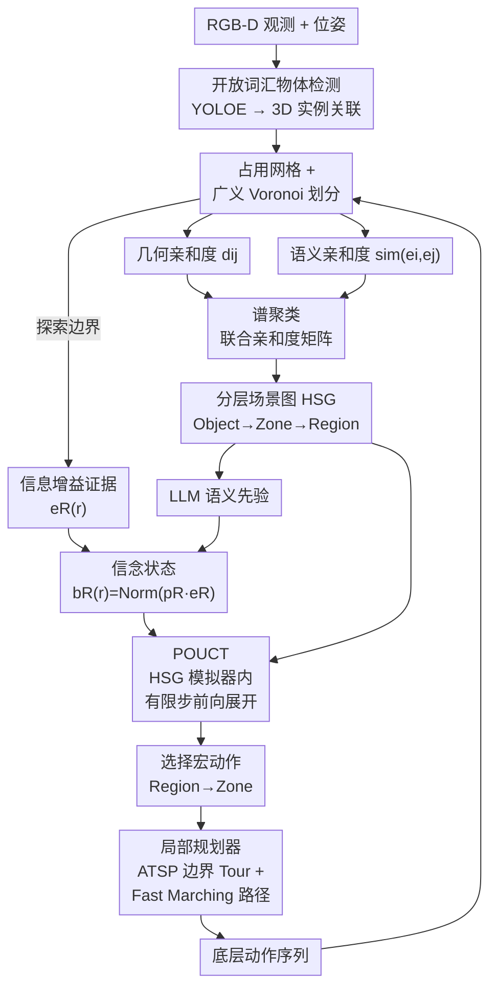

# Hierarchical 3D Scene Graph Construction and Belief-based Planning for Semantic Navigation

**会议**: ECCV 2026  
**arXiv**: [2606.31071](https://arxiv.org/abs/2606.31071)  
**代码**: 待确认  
**领域**: 3D 视觉 / 具身智能  
**关键词**: 语义导航, 分层场景图, 信念规划, POUCT, 零样本导航

## 一句话总结

本文提出一种零样本语义导航框架，通过在线增量构建物体-区域-区分层 3D 场景图（HSG）作为结构化全局记忆，并在其上融合 LLM 语义先验与探索证据维持分层信念状态，用 POUCT 在 HSG 模拟器内做有限步前向展开以显式评估宏动作的长程期望回报，长程导航 SR/SPL 分别提升 9.4%/5.0%。

## 研究背景与动机

零样本语义导航要求智能体在从未见过的环境中，仅凭单目 RGB-D 观测驱动，在有限的步数预算内导航到语义目标（物体类别或文本描述的特定实例）。近年来开放词汇视觉感知和大语言模型的进步使零样本导航成为可能，前沿方法（如 ESC、VLFM、ApexNav）通过 CLIP 嵌入对齐和 LLM 常识推理来引导探索方向，已取得可观进展。然而，这些方法普遍缺乏对环境的全局结构化语义表示——决策往往退化为基于局部观测的贪心前沿探索，相当于每步只看视线内有什么、而不问"整个场景中哪里最可能有目标"。这在短距离导航中或许够用，但一旦需要跨房间、跨楼层长程移动，频繁的回头路和无效探索就会急剧累积，导致路径效率暴跌。

问题的核心矛盾在于：长程导航需要一种既能保留多粒度语义信息（从物体到区域到整层楼）、又能支持远期决策的全局状态表征，还要能在探索过程中**在线地**、**增量地**构建它——而不是等全局点云齐了再做离线重建。目前的分层 3D 场景图工作（如 HOVSG、ConceptGraphs）大都假设完整点云或离线 RGB-D 序列在握，无法直接用于在线探索场景。同时，即使有了场景图，如何把 LLM 常识先验和实时观测反馈有机融合到决策中、让智能体不仅能"猜"目标在哪还能"验证"自己的猜想并主动纠偏，也尚无有效方案。

本文的切入角度是：如果把场景图建得足够精细且分层（物体 → 区域 → 区三级），就可以把长期决策拆成"宏观选哪个区域"和"微观探哪个物体"两层，在每一层都用仿真展开来评估远期回报，从而把贪心决策升级为有远见的规划。**核心 idea：在线用广义 Voronoi 划分加谱聚类把局部观测自底向上归纳为物体-区域-区分层场景图，并以此构建轻量模拟器，在上面用 POUCT 展开有限步前向仿真、显式计算宏动作的累积期望回报，从而做出全局一致的导航决策。**

## 方法详解

### 整体框架

本文方法分为感知与决策两大模块。感知模块接收带位姿的 RGB-D 观测，通过开放词汇检测模型（YOLOE）提取 3D 物体实例，在占用网格图上做广义 Voronoi 划分得到物体间空间邻接关系，再以几何+语义联合亲和度矩阵执行谱聚类，自底向上归纳出物体（Object）→ 区域（Zone）→ 区（Region）三级分层场景图（HSG）。决策模块以 HSG 为状态空间，融合 LLM 给出的语义目标先验和边界点的信息增益证据，构建各层级节点的信念状态；然后在 HSG 离散模拟器上用 POUCT 做有限步前向展开，估算每个候选宏动作（访问哪个 Region/Zone）的长期期望回报，选出最优宏动作；最后局部规划器将该宏动作转化为一组有序边界点访问（ATSP 求解最短 tour），通过 Fast Marching 方法生成底层执行动作。

### 关键设计

**1. 在线分层场景图构建：GVD + 谱聚类的自底向上归纳**

如何把零散的物体实例组织成有层次的空间语义结构？本文的核心策略是先测距离、再聚类、逐层抽象。在物体层，利用占用网格图做广义 Voronoi 划分（GVD）：把每个物体的 3D 点云投影到网格上作为种子，将每个网格单元分配给路径距离最近的物体，从而把探索过的地图划分为互不重叠的"物体领地"；两个物体的领地如果有公共边界就在它们之间加一条空间邻接边。这步得到的是一个物体级的邻接图。在此基础上，为了归纳出更高层的"区域"和"区"，需要对物体做聚类——但纯几何聚类容易把相邻但功能迥异的物体（如马桶和洗手台）捆在一起，纯语义聚类又会把距离远的同类物体（如不同房间的两张床）归为一组。本文方案是在物体邻接图的每条边上定义一个**联合亲和度权重** $w_{ij} = \exp(-d_{ij}^2/\sigma^2_d) \cdot \exp(\text{sim}(e_i, e_j)/\tau)$，同时惩罚几何距离和鼓励语义相似。对这个加权邻接图做谱聚类，同一簇的物体合并成一个 Zone 节点；再对 Zone 层做同样的聚类得到 Region 层。关键细节是：聚类只在已有邻接边（即空间相邻的物体对上）计算权重，不会把相隔很远但语义相似的物体强行聚到一起——这保证了 Region/Zone 在空间上是连通的。每次以固定步数 N 为周期增量更新，只重算受新增/合并物体影响的局部邻域。

**2. 分层信念状态估计：LLM 语义先验与探索证据的融合**

有了 HSG 之后，智能体应该相信目标"最可能在哪里"？本文把这个问题建模为同时考虑先验知识和观测反馈的双层信念融合。在 Region 层，通过 LLM 查询各区域的语义合理性分数 $p_t^R(r)$——LLM 会根据场景图的语义描述（如"这是卧室，可能有枕头"）判断目标类别各区域出现的概率。同时，从占用网格图上提取边界点（frontier），计算每个边界点的信息增益 IG(f)——即探索这个边界能新增多少自由空间。对每个 Region r，定义探索证据 $e_t^R(r) = \sum_{\text{IG}>\tau} \text{IG}(f) / \sum \text{IG}(f) + \epsilon$ ，本质上是"这个区域里高信息增益边界占总边界的比例"，反映该区域还有多少价值值得探。阈值 $\tau$ 和目标尺寸相关（小目标用小阈值）。最终的 Region 层信念 $b_t^R(r) = \text{Norm}(p_t^R(r) \cdot e_t^R(r))$，取归一化乘积。Zone 层的信念类似，但只在被选中的 Region 内做。这种乘积形式的巧妙之处在于：如果 LLM 先验和观测证据一致（都指向某 Region），则信念被增强；如果某 Region 的 LLM 先验虽高但实际探索后证据很低（说明 LLM 猜错了），信念会被自动拉低——LLM 的偏见通过观测反馈得到了自动纠偏，无需显式的贝叶斯更新。

**3. 基于 HSG 模拟器的 POUCT 长程评价规划**

有了信念状态，如何选出最优的宏动作（访问哪个 Region/Zone）？简单选信念最高的节点仍然是贪心的——因为访问一个区域后可能发现新区域，而当前信念没有刻画这种"探索的远期收益"。本文的做法是用 HSG 本身构建一个轻量离散模拟器 SIM，在上面做有限步前向展开。SIM 的状态 s 包含当前的 HSG 拓扑、智能体所在节点、以及从当前信念 $b_t$ 采样出的"目标假设位置"；宏动作 a 对应"访问某个 Region/Zone"；执行动作会迁移到目标节点，并产生二元观测 $o \in \{\text{found}, \text{not\_found}\}$，即时奖励 $u = R(o) - \lambda \cdot c_{\text{move}}$，其中 $c_{\text{move}}$ 是 HSG 上的最短路径长度（惩罚绕路），$R(\text{found})$ 是大值成功奖励。然后在此模拟器上用 POUCT（Partially Observable Monte Carlo Tree Search）做树搜索：每轮仿真从信念中采样一个初始状态实例，模拟展开 H 步，用 UCB 平衡探索-利用，backup 累积回报，最终得到每个候选宏动作的长期期望回报估计 $Q(b_t^R, a)$。决策是分层的：先在 Region 层用 POUCT 选 Region，如果选到"未知区域"就派全局探索（遍历高 IG 边界）；否则再在被选 Region 内的 Zone 层做第二轮 POUCT，选具体的 Zone。H 的大小是关键超参数（消融中考察 0-5）：H 越大越能捕获远期收益，但 HSG 模拟器和真实环境的偏差也会随步数累积，因此最优 H 与层级深度有关——两层级（L=2）的 HSG 更加细致、模拟器偏差累积更快，倾向更短的 H 窗口。

## 实验关键数据

### 主实验

| 任务 | 数据集 | 指标 | 本文 | 之前 SOTA | 提升 |
|------|--------|------|------|-----------|------|
| ObjectNav | MP3D | SR | 45.9 | 42.1 (FBN-Nav) | +3.8 |
| ObjectNav | MP3D | SPL | 19.6 | 18.1 (FBN-Nav) | +1.5 |
| ObjectNav | HM3Dv1 | SR | 61.6 | 59.6 (ApexNav) | +2.0 |
| ObjectNav | HM3Dv1 | SPL | 33.9 | 33.0 (ApexNav) | +0.9 |
| ObjectNav | HM3Dv2 | SR | **80.1** | 76.2 (ApexNav) | +3.9 |
| ObjectNav | HM3Dv2 | SPL | **39.5** | 38.0 (ApexNav) | +1.5 |
| ObjectNav | HSSD | SR | **69.9** | 65.2 (BeliefMapNav) | +4.7 |
| ObjectNav | HSSD | SPL | **36.4** | 32.1 (BeliefMapNav) | +4.3 |
| TextInstanceNav | InstanceNav | SR | **38.1** | 20.2 (UniGoal) | +17.9 |
| TextInstanceNav | InstanceNav | SPL | **16.0** | 11.4 (UniGoal) | +4.6 |

在四个 ObjectNav 数据集上，本文全面超越所有零样本方法。最具挑战的 HSSD 上提升最大（SR +4.7, SPL +4.3），说明 HSG + 信念规划在更复杂的数据集上优势更明显。TextInstanceNav 上的绝对领先（SR 接近翻倍）尤其突出，作者分析原因是文本实例包含丰富的属性与空间关系信息，可以充分被 HSG 的多粒度语义建模所利用。

长程子集（初始最短路径 > 10m）上的表现进一步验证了核心贡献：相比完整测试集，长程场景下本文相比 ApexNav 的 SR 提升从 2-4% 扩大到平均 9.4%，SPL 提升从 0.9-4.3% 扩大到平均 5.0%。这说明性能增益主要来自长程规划能力的改善。

### 消融实验

| 配置 | HM3Dv2 SR | HM3Dv2 SPL | 说明 |
|------|-----------|-----------|------|
| 完整模型 | 80.1 | 39.5 | 基线 |
| w/o Evidence（只用 LLM 先验） | 76.0 | 37.4 | 先验偏见到无法纠偏时性能显著下降 |
| w/o Rollouts（H=0，贪心决策） | 76.7 | 35.9 | SPL 降幅最大，说明贪心选择路径效率损失严重 |
| w/o Zone-level（两层级退化到单层） | 79.5 | 38.2 | 精细空间信息丢失后筛选能力下降 |
| w/ Qwen3-VL-4B（小 VLM） | 77.2 | 37.9 | 语义描述质量下降导致信念区分度减弱 |

### 关键发现

- **探索证据（Evidence）是关键**：去掉后 SR 下降最多（-4.1），说明仅靠 LLM 先验对实际场景的偏见远超预期，观测反馈是必不或缺的纠偏手段。
- **POUCT 前向展开的价值在 SPL 上最明显**：去掉 rollout 后 SPL 降低 3.6 个点（从 39.5 到 35.9），显示显式计算长期回报对路径效率的贡献比成功率更大。
- **最优规划窗口 H 依赖层级深度**：两层级（Object-Zone-Region）HSG 由于更精细、模拟器偏差累积更快，偏好更短的 H（约 2-3 步）；单层结构（Object-Region）的 H 窗口更长。H 过大时两种结构都会因模型偏差累积而退化。
- **TextInstanceNav 的增益远超 ObjectNav**：因为文本实例描述的多属性（类别+颜色+空间关系）恰好发挥 HSG 语义先验和分层信念的双重优势，而普通 ObjectNav 只有类别标签，场景图的信息利用不那么充分。

## 亮点与洞察

- **用 HSG 本身作为模拟器**来拓展 POUCT，是一种极轻量的「world model」——不需要学习任何环境动力学，直接用图拓扑上的最短路径距离做状态迁移代价，推理时几乎零额外开销，方案优雅且务实。
- **信念的乘法融合机制**是本文很精巧的设计：LLM 先验和探索证据做乘积而非加和，天然赋予了"矛盾时自动纠偏"的行为——如果 LLM 认为某 Region 概率高但实际探索证据低，乘积会自然衰减，无需额外设计纠错逻辑。
- 自底向上的聚类归纳策略（GVD 邻接 → 谱聚类）把"相邻且语义相关的物体"作为构建高层节点的基础，同时保证了 Region/Zone 的空间连通性，避免了纯语义聚类可能产生的空间碎片化问题。
- **分层决策的结构**（先在 Region 层选宏观目标、再在 Zone 层精细化）天然适用于长程导航——就像人先决定"去厨房"再想"去哪个台面"，而非逐物体贪心探索。

## 局限与展望

- 当前实验完全在仿真中进行，假定输入 RGB-D 带完美位姿；真实机器人部署中，SLAM 的位姿漂移会影响物体实例融合和占用图精度，进而传递到场景图的拓扑。作者明确将此列为未来工作。
- VLM/LLM 推理的延迟远高于实时要求（RTX 4090 上仍无法实时运行），目前 HSG 的增量更新周期 N 需设为较大值来容错，这反过来限制了在线场景图的细化频率。将语义生成替换为更轻量的模型（如蒸馏版 VLM），或引入异步推理管线，是走向实时的必然方向。
- POUCT 规划窗口 H 需要在部署前根据层级深度调参，缺乏自适应策略。未来可以探索根据 HSG 推断的不确定程度动态调整 H 的方案。
- 仅在室内场景验证，对室外开放空间的结构化导航没有讨论。

## 相关工作与启发

- **vs ApexNav / UniGoal / SG-Nav**: 这些方法也引入了场景图或 LLM 先验，但基本停留在"用场景图做结构化 prompt，让 LLM 对边界的每个候选打分"层面，本质仍是**单步贪心选择**。本文把场景图从"LLM 的上下文"升级为"可仿真的状态空间"，补上了长程评价这一关键缺口。
- **vs POUCT / MCTS 在机器人规划中的应用**: 标准的 POMDP 规划通常需要可微或可学习的模型来做 rollout。本文把 rollout 架在离散图拓扑上——状态迁移代价 = 图最短路径、观测 = 环境碰撞采样——简化到甚至不需要 GPU 就能跑仿真，大幅降低了 POUCT 的部署门槛。
- **vs 离线场景图构建**: 之前的工作（HOVSG、ConceptGraphs）主要解决"给定完整扫描数据重建完整场景图"，本文则证明了在部分可观测、逐步积累的设定下同样可以构建有用的分层场景图，打开了场景图在在线探索任务中的应用空间。

## 评分

- 新颖性: ⭐⭐⭐⭐ 把 HSG+POUCT 的组合引入零样本导航是扎实的创新，信念融合机制设计巧妙，但单组件（谱聚类、POUCT）各自都不是首创。
- 实验充分度: ⭐⭐⭐⭐⭐ 四个 ObjectNav 数据集 + TextInstanceNav，完备的消融验证每个组件的贡献，长程子集分析直接支撑核心 claim，水平和垂直消融（level × horizon）也很细致。
- 写作质量: ⭐⭐⭐⭐ 方法描述清晰、图例对应完整，但相关工作的深度可再加强，没有解释为什么乘积融合比 Bayesian update 更合适（虽然后者在这类 not_found 频繁的场景下的确困难）。
- 价值: ⭐⭐⭐⭐⭐ 长程导航是零样本语义导航的瓶颈痛点，本文给出了一个系统性方案，且实验证明提升显著。场景图-模拟器的范式对其他长程机器人任务（如物体检索、搜索救援）有强迁移潜力。

<!-- RELATED:START -->

## 相关论文

- [\[ECCV 2026\] DeWorldSG: Depth-Aware 3D Semantic Scene Graph Generation via World-Model Priors](deworldsg_depth-aware_3d_semantic_scene_graph_generation_via_world-model_priors.md)
- [\[CVPR 2026\] MSGNav: Unleashing the Power of Multi-modal 3D Scene Graph for Zero-Shot Embodied Navigation](../../CVPR2026/3d_vision/msgnav_unleashing_the_power_of_multi-modal_3d_scene_graph_for_zero-shot_embodied.md)
- [\[ECCV 2026\] Gaussian Belief Propagation Network for Depth Completion](gaussian_belief_propagation_network_for_depth_completion.md)
- [\[ICLR 2026\] Learning Hierarchical and Geometry-Aware Graph Representations for Text-to-CAD](../../ICLR2026/3d_vision/learning_hierarchical_and_geometry-aware_graph_representations_for_text-to-cad.md)
- [\[NeurIPS 2025\] Object-Centric Representation Learning for Enhanced 3D Semantic Scene Graph Prediction](../../NeurIPS2025/3d_vision/object-centric_representation_learning_for_enhanced_3d_semantic_scene_graph_pred.md)

<!-- RELATED:END -->
