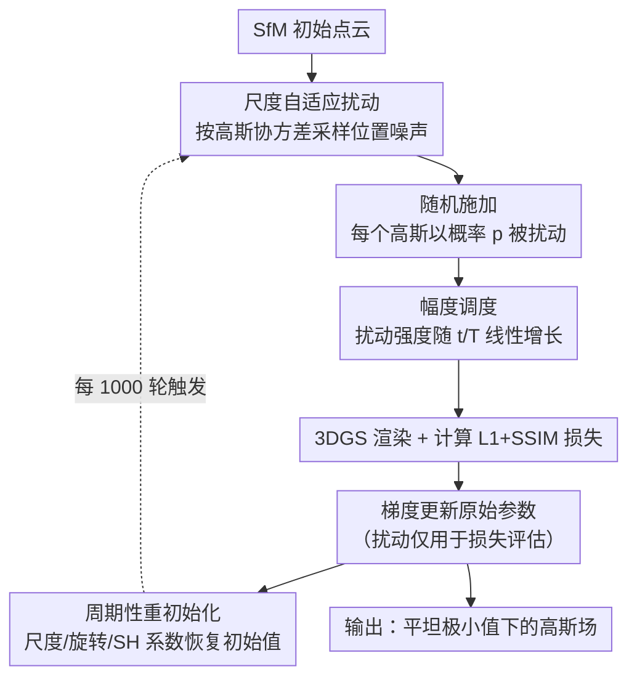

# Improving Sparse-View 3DGS Generalization via Flat Minima Optimization

**会议**: ECCV 2026  
**arXiv**: [2607.00885](https://arxiv.org/abs/2607.00885)  
**代码**: 无  
**领域**: 3D视觉  
**关键词**: 3D高斯泼溅, 稀疏视图新视角合成, 平坦极小值优化, 尺度自适应扰动, 参数重初始化

## 一句话总结
本文从平坦极小值（Flat Minima）优化的视角解决稀疏视图 3DGS 的过拟合问题：通过尺度自适应的位置扰动（SAP）+ 随机施加 + 幅度调度 + 周期性非位置参数重初始化，在不改变网络架构的前提下使 3DGS 收敛到更平坦的损失景观区域，在 LLFF 和 Mip-NeRF360 上稀疏视图设定下取得 SOTA 或接近 SOTA 的渲染质量。

## 研究背景与动机
3D Gaussian Splatting（3DGS）已成为新视角合成的主流方法，兼顾训练速度与实时渲染质量。然而当输入视图极度稀疏（如仅 3 张）时，3DGS 会严重过拟合到训练视角：优化后的高斯参数对微小位置偏移极其敏感，一旦视角偏离训练位姿，渲染质量急剧下降。

这一现象与神经网络训练中“尖锐极小值（sharp minima）导致泛化差”的经典观察高度一致。在深度学习领域，平坦极小值优化（如 SAM、RWP）通过注入参数扰动迫使模型收敛到损失景观的平坦区域，已被证明能显著提升泛化性。本文的核心洞察是：**将 3DGS 的训练过程重新理解为监督学习系统**——相机位姿是输入，渲染图像是输出，高斯参数是可学习权重——那么稀疏视图下的过拟合本质上就是收敛到了对位置扰动高度敏感的尖锐极小值，恰好是平坦极小值优化要解决的问题。

但直接将平坦极小值优化照搬到 3DGS 会忽略其独特的几何结构：高斯球是各向异性的三维基元，不同高斯的大小、形状差异巨大，统一的各向同性扰动要么对小高斯过强（破坏细节），要么对大高斯过弱（正则化不足）。因此本文提出了一套专为 3DGS 几何特性定制的平坦极小值优化框架，核心 idea：**按高斯自身的空间尺度与形状生成各向异性扰动，辅以随机施加与幅度调度，并周期性重置非位置参数以稳定训练，使 3DGS 在稀疏视图下收敛到平坦且保持细节的极小值。**

## 方法详解

### 整体框架
整个方法在标准 3DGS 训练流程上叠加扰动与重初始化两个机制，不引入额外网络模块或外部先验。输入为 SfM 初始化的高斯点云与稀疏训练视图，每轮迭代中：先对各高斯按尺度自适应的协方差采样位置噪声，以概率 p 随机施加（而非每轮都扰动全体），扰动幅度随训练进度从 0 线性增长到目标值；然后在扰动后的参数上做前向渲染并计算标准 L1+SSIM 损失，用该损失的梯度更新**原始未扰动参数**；每隔固定迭代数，还将尺度、旋转、高阶 SH 系数临时恢复到 SfM 初始值并冻结一小段时间，Opacity 按标准 3DGS 机制重置，位置不受影响。

### 关键设计

**1. 尺度自适应扰动（SAP）：让噪声尊重每个高斯的形状**

稀疏视图下 3DGS 过拟合的本质是高斯位置对微小偏移极端敏感——这正是尖锐极小值的症状。直觉上，要给位置注入扰动来迫使优化找到对位置变化不敏感的平坦区域，但问题在于：3DGS 中的高斯大小差异极大，覆盖大片墙面的高斯和刻画物体边缘的小高斯对同样幅度的噪声反应截然不同。

SAP 的解法是让扰动幅度与该高斯的空间协方差成正比。具体地，对第 i 个高斯，从其 3D 协方差矩阵 $\mathbf{\Sigma}_i = \mathbf{R}_i \mathbf{S}_i \mathbf{S}_i^\top \mathbf{R}_i^\top$ 中采样位移噪声 $\delta_i \sim \mathcal{N}(0, \gamma^2 \mathbf{\Sigma}_i)$，其中 $\mathbf{S}_i = \text{diag}(s_i)$ 为该高斯三轴尺度。这样噪声在高斯延展最长的轴上最大、最短的轴上最小，大高斯承受强扰动以提升鲁棒性，小高斯承受弱扰动以保留细节。扰动后的位置为 $\mathbf{x}_i' = \mathbf{x}_i + \delta_i$，其他参数（尺度、旋转、颜色、不透明度）保持不变。

与 3DGS-MCMC 在参数更新中加噪声（噪声累积进轨迹）不同，本文只在损失评估时扰动，参数本身保持干净，相当于在原始参数周围局部平滑损失景观。这比直接对所有参数加各向同性噪声更精准——消融实验中，各向同性变体（按最大轴/平均轴/固定值缩放）的 PSNR 均低于各向异性版本（20.88 vs 20.54~20.73），验证了“尊重几何形状”的必要性。

**2. 随机施加：以概率 p 而非全量扰动，避免过度平滑**

RWP 类方法的常见做法是每轮渲染扰动和未扰动两个模型后混合损失，但这在 3DGS 中意味着渲染量翻倍。更关键的是，作者观察到如果每轮都对所有高斯施加扰动，模型倾向于过度平滑高频细节——因为扰动信号始终主导梯度方向，精细几何结构被“洗掉”。

本文用更轻量且更有效的方式实现类似效果：每轮对每个高斯独立地以概率 p（默认 0.3）决定是否施加 SAP 扰动，其余高斯保持原位置不变。形式上 $\mathbf{x}_i' = \mathbf{x}_i + \delta_i$ 以概率 p，否则 $\mathbf{x}_i' = \mathbf{x}_i$。这样做的好处有三：(1) 无需双次渲染，训练开销几乎不变；(2) 扰动的稀疏性使模型不会过度依赖扰动信号，能保留精细结构；(3) 本质上等价于在扰动与非扰动损失之间做了隐式插值，只是通过随机采样而非显式加权实现。消融实验证实：将随机施加换成显式混合损失（渲染两次后加权），LPIPS 从 0.184 恶化到 0.212，说明随机采样方式确实更有利于保留感知质量。

**3. 扰动幅度调度：从零线性增长，防止早期训练失稳**

训练初期，高斯刚从 SfM 点云初始化，尚未捕获场景的粗结构。此时若施加全强度扰动，相当于在尚未收敛的参数上叠加强噪声，极易导致优化发散或收敛到差解。作者的应对是将 SAP 中的扰动幅度乘以线性调度因子 $\alpha(t) = t / T$，使扰动强度从 0 随训练迭代线性增长到目标值。形式上 $\mathbf{x}_i' = \mathbf{x}_i + \alpha(t) \cdot \delta_i$（以概率 p）。

消融结果表明，去掉调度（即从头到尾全强度扰动）导致 PSNR 从 20.88 降至 20.69，且训练曲线出现明显不稳定。这印证了“先建粗结构、再施加强正则”的直觉——调度让模型在早期先学会场景的大致几何布局，待高斯位置基本稳定后再逐步引入扰动以压平损失景观。

**4. 周期性高斯重初始化：冻结非位置自由度以辅助正则化**

位置扰动是本文推动平坦极小值的主力，但仅靠位置维度的正则化仍不足——尺度、旋转、高阶 SH 系数的过拟合同样会损害泛化。作者设计了一种轻量的补充机制：每隔 1000 轮迭代，将尺度、旋转和高阶 SH 系数临时恢复到 SfM 初始化时的状态，并冻结 W=100 轮不变；不透明度每轮按标准 3DGS 的 reset 机制重置；位置和总高斯数不受影响。

这个操作的直觉是：周期性“清零”非位置参数，迫使优化在每个周期内重新学习这些自由度，从而降低它们对训练视图的过拟合程度。从 PSNR 训练/测试曲线看（Fig.5），不加重初始化时训练 PSNR 持续上升而测试 PSNR 趋于平台，是典型的过拟合信号；加重初始化后，每次重置会引起指标短暂下跌但迅速恢复，最终测试 PSNR 持续增长并超越不加的基线。消融中去掉重初始化使 PSNR 下降 0.3（20.88→20.58），虽幅度不及去掉 SAP 大，但作为零成本的补充正则化手段价值显著。

### 损失函数 / 训练策略

损失函数完全沿用标准 3DGS：$\mathcal{L} = (1 - \lambda)\mathcal{L}_1 + \lambda\mathcal{L}_{\text{SSIM}}$，其中 $\lambda = 0.2$。关键区别在于损失始终在**扰动后的参数** $\hat{\theta}_t$ 上计算，而梯度更新作用于**原始未扰动参数** $\theta_t$：$\theta_{t+1} \leftarrow \theta_t - \eta \cdot \nabla\mathcal{L}(\hat{\theta}_t)$。这等价于在 $\theta_t$ 周围采样邻域点来平滑损失景观，而非让噪声累积进参数轨迹。

关键超参：扰动概率 $p_{\max}=0.3$，扰动系数 $\gamma=2$，重初始化间隔 1000 轮、冻结窗口 W=100 轮。扰动后的位置会被 clamp 以确保位移不超过该高斯自身尺度。训练在 NVIDIA RTX TITAN / A6000 上进行，其余超参与 DropGaussian 保持一致。

## 实验关键数据

### 主实验

**LLFF 数据集（3/6/9 视图）**：

| 方法 | 3-view PSNR | 3-view SSIM | 3-view LPIPS | 6-view PSNR | 6-view SSIM | 6-view LPIPS | 9-view PSNR | 9-view SSIM | 9-view LPIPS |
|------|------------|------------|-------------|------------|------------|-------------|------------|------------|-------------|
| 3DGS | 19.22 | 0.649 | 0.229 | 23.80 | 0.814 | 0.125 | 25.44 | 0.860 | 0.096 |
| DNGaussian | 19.12 | 0.591 | 0.294 | 22.18 | 0.755 | 0.198 | 23.17 | 0.788 | 0.180 |
| FSGS | 20.43 | 0.682 | 0.248 | 24.09 | 0.823 | 0.145 | 25.31 | 0.860 | 0.122 |
| CoR-GS | 20.45 | 0.712 | 0.196 | 24.49 | 0.837 | 0.115 | 26.06 | 0.874 | 0.089 |
| DropGaussian | 20.76 | 0.713 | 0.200 | 24.74 | 0.837 | 0.117 | 26.21 | 0.874 | 0.088 |
| **Ours** | **20.88** | **0.731** | **0.184** | **24.76** | **0.840** | **0.114** | **26.23** | **0.875** | **0.088** |

**Mip-NeRF360 数据集（12/24 视图）**：

| 方法 | 12-view PSNR | 12-view SSIM | 12-view LPIPS | 24-view PSNR | 24-view SSIM | 24-view LPIPS |
|------|-------------|-------------|--------------|-------------|-------------|--------------|
| 3DGS | 18.52 | 0.523 | 0.415 | 22.80 | 0.708 | 0.276 |
| FSGS | 18.80 | 0.531 | 0.418 | 23.70 | 0.745 | 0.230 |
| CoR-GS | 19.52 | 0.558 | 0.418 | 23.39 | 0.727 | 0.271 |
| DropGaussian | 19.74 | 0.577 | 0.364 | 24.13 | 0.762 | 0.225 |
| **Ours** | 19.50 | **0.584** | **0.348** | **24.19** | **0.771** | **0.219** |

在 LLFF 三视图设定下本文方法在所有三个指标上均最优；在 Mip-NeRF360 12 视图下 SSIM 和 LPIPS 最优、PSNR 略低于 DropGaussian（19.50 vs 19.74），24 视图下三项指标全面最优。

### 消融实验

**LLFF 3-view 设定下的消融（默认配置用 † 标出）**：

| 消融维度 | 配置 | PSNR | SSIM | LPIPS |
|---------|------|------|------|-------|
| **噪声分布** | 各向异性† | 20.88 | 0.731 | 0.184 |
| | 各向同性（最大轴） | 20.73 | 0.725 | 0.188 |
| | 各向同性（平均轴） | 20.67 | 0.724 | 0.185 |
| | 各向同性（固定值） | 20.54 | 0.714 | 0.188 |
| **扰动参数** | 位置† | 20.88 | 0.731 | 0.184 |
| | 旋转 | 20.23 | 0.710 | 0.195 |
| | 尺度 | 20.22 | 0.707 | 0.195 |
| | 不透明度 | 20.21 | 0.709 | 0.194 |
| | 位置+尺度 | 20.33 | 0.719 | 0.199 |
| **训练策略** | 完整方法† | 20.88 | 0.731 | 0.184 |
| | 随机施加→混合损失 | 20.84 | 0.714 | 0.212 |
| | w/o 幅度调度 | 20.69 | 0.721 | 0.191 |
| | w/o 重初始化 | 20.58 | 0.713 | 0.197 |

**即插即用兼容性（跨范式验证）**：

| 数据集 | 基线方法 | 基线 PSNR/SSIM/LPIPS | +Ours PSNR/SSIM/LPIPS |
|--------|---------|---------------------|----------------------|
| LLFF 3-view | FSGS | 20.43/0.682/0.248 | 21.03/0.725/0.196 |
| LLFF 3-view | DropGaussian | 20.76/0.713/0.200 | 21.05/0.734/0.192 |
| Mip-NeRF360 12-view | Difix3D+ | 19.25/0.554/0.375 | 19.63/0.575/0.386 |
| Mip-NeRF360 12-view | AnySplat+3DGS 3k | 16.97/0.338/0.432 | 17.36/0.384/0.427 |

### 关键发现

- **位置扰动是最有效的扰动维度**：对位置扰动能带来约 0.6 PSNR 提升（相对于扰动其他参数），而同时对位置和尺度扰动反而比仅扰动位置差（20.33 vs 20.88），说明在位置空间引入平坦性最为关键，多维扰动可能引入冲突的正则化信号。
- **各向异性噪声设计是所有消融中贡献最大的单点**：从固定各向同性（20.54）到各向异性（20.88）的提升达 0.34 PSNR，说明“尊重高斯形状”不是微调而是核心设计。
- **扰动鲁棒性分析直接验证了平坦极小值假说**：训练完成后对高斯位置施加不同幅度的 SAP 扰动，本文方法的测试 PSNR 下降幅度远小于 3DGS 和 DropGaussian，且在训练视图上的退化也更小，说明本文方法确实收敛到了更平坦的极小值。
- **即插即用性强**：方法可无缝集成到基于优化的（FSGS、DropGaussian）、扩散增强的（Difix3D+）和 feed-forward 初始化后微调的（AnySplat）三类稀疏视图管线中，均带来一致提升，说明平坦极小值正则化与现有方法是互补关系。
- **视图增多后收益递减**：在 Mip-NeRF360 36 视图下，本文方法（25.01 PSNR）略低于 3DGS（25.15），说明当监督足够充分时，平坦极小值正则化的边际收益降低，3DGS 本身已能收敛到较优解。

## 亮点与洞察

- **将经典泛化理论（平坦极小值）跨界应用到 3D 表示学习，且针对几何特性做了非平凡适配**。直接用各向同性扰动会掉点（见表），证明这不是“套壳”——各向异性协方差采样才是关键，其本质是在高斯的局部坐标系下做 whitened perturbation。
- **“只扰动损失评估、不扰动参数更新”的设计非常干净**。相比 SAM 需要两次前向+反向（min-max），本文只需一次前向，训练开销几乎不变。这个 trick 值得推广到其他需要对参数做隐式正则化的场景——只要你能定义“参数扰动空间”，就可以用单次前向的扰动-损失-回传来实现平滑。
- **随机施加替代显式损失混合是一个巧妙的工程等价**。RWP 类方法显式混合 $\mathcal{L}(\theta) + \mathcal{L}(\theta+\epsilon)$，本文用伯努利采样 $p$ 在每轮实现隐式混合，数学上期望相同但避免双次渲染。类似思路可迁移到其他需要扰动正则化的生成模型训练。
- **周期性重初始化作为“免费正则”值得关注**。它不引入额外损失项、不改变优化器、不增加显存，仅在特定轮次做一次参数回退+短暂冻结，却能稳定提升 0.3 PSNR。这种“周期性重置部分参数”的策略可能适用于其他过参数化场景（如 NeRF 的 MLP 权重、甚至 LLM 微调中的部分层）。
- **扰动鲁棒性分析（Fig.4）作为平坦极小值的直接证据**很有说服力。不是只看最终指标，而是通过训练后施加不同强度扰动观察性能退化曲线——这是一种普适的极小值平坦度检验方法，可作为评估任何以泛化为目标的优化方法的标配实验。

## 局限与展望

- **仅扰动位置，其他参数维度的平坦性未充分探索**。消融显示同时对位置+尺度扰动会掉点，但这可能是因为两个扰动源的正则化信号相互干扰，而非尺度平坦性本身无用。设计解耦的扰动策略（如交替扰动、独立调度）可能解锁更大收益。
- **超参数（p、gamma、重初始化间隔、冻结窗口）依赖手动设定**，不同场景可能需要调参。作者未提供自动化调参方案或敏感性分析（如 p 在 0.1~0.5、gamma 在 1~4 下的性能变化曲线），实际部署时可能需要额外调参成本。
- **36 视图下反而不如 3DGS**，说明方法在监督充分的场景下可能成为“多余的正则化”——模型本就能收敛到足够平坦的解，额外扰动反而引入噪声。一个自然的改进是设计自适应开关：当训练/测试 PSNR 差距小于某阈值时自动降低或关闭扰动。
- **重初始化的最优周期和窗口长度未做深入分析**，目前 1000/100 轮是经验值。不同数据集、不同稀疏程度下最优值可能不同，可尝试根据训练曲线动态调整（如过拟合检测触发重初始化）。
- **仅在标准 benchmarks 上验证**，缺少对极端稀疏（1-2 视图）、动态场景、或不同 3DGS 变体（如 2DGS、Scaffold-GS）的测试。即插即用实验覆盖了三类范式但未测更多 backbone。
- **未与 SAM 类方法做直接对比**。虽然 SAM 因双次反向传播开销较大在 3DGS 中不实用，但作为平坦极小值优化的标杆方法，缺少对比使读者无法判断本文的随机扰动方案与对抗扰动方案在 3DGS 中的相对优劣（即使本文更高效）。

## 相关工作与启发

- **vs SAM / Sharpness-Aware Minimization**: SAM 通过 min-max 对抗扰动寻找平坦极小值，每次更新需两次梯度计算；本文用随机扰动+单次前向实现类似效果，训练成本更低。SAM 的对抗方向可能更精准但本文在 3DGS 几何约束下用协方差采样的效果已足够好，体现了“领域知识指导扰动设计”的优势。
- **vs DropGaussian / DropoutGS**: 这类方法通过随机丢弃高斯来做结构性正则化，本质是让模型不依赖少数基元；本文则是在参数空间做扰动正则化，本质是让模型对参数偏移不敏感。两者互补——即插即用实验中在 DropGaussian 上加本文方法仍有提升（20.76→21.05 PSNR），证实了两种正则化机制的独立性。
- **vs 深度先验方法（DNGaussian、FSGS）**: 这些方法引入单目深度估计等外部先验来约束几何，效果好但依赖额外网络；本文不引入任何外部先验，纯靠优化策略改进，在 3-view LLFF 上超过 FSGS（20.88 vs 20.43），且可作为插件叠加在 FSGS 上进一步涨到 21.03。
- **vs 3DGS-MCMC**: MCMC 风格的方法在参数更新中注入噪声（Langevin dynamics），噪声累积进轨迹；本文只在损失评估时扰动，参数轨迹保持干净。两种噪声注入的位置不同导致不同的优化动力学——前者探索后验分布，后者平滑损失景观。
- **启发**：本文的核心范式——“将某个领域的经典泛化理论适配到新表示形式的几何特性”——具有高度可迁移性。例如，对于 triplane / tensor decomposition 等显式 3D 表示，其参数同样有几何意义（空间网格），可以设计类似的尺度自适应扰动；对于 4DGS（动态场景），时间维度的扰动同样可参考本文的协方差缩放思路。

## 评分
- 新颖性: ⭐⭐⭐⭐ 将平坦极小值优化引入 3DGS 本身不算全新概念，但针对高斯各向异性几何设计 SAP + 随机施加 + 重初始化的组合方案有实质性创新，不是简单套用
- 实验充分度: ⭐⭐⭐⭐⭐ 主实验覆盖两个标准 benchmark 多视图设定，消融覆盖噪声分布/扰动参数/训练策略三个维度，另有即插即用兼容性验证、扰动鲁棒性分析、训练曲线分析、SfM 质量鲁棒性测试、增视图实验，附录还有额外 benchmark
- 写作质量: ⭐⭐⭐⭐ 方法论清晰，动机链完整，flat minima 视角的论证有说服力；Fig.4 扰动鲁棒性曲线是亮点；但缺少与 SAM 类方法的直接对比讨论
- 价值: ⭐⭐⭐⭐ 零架构改动、零外部先验、即插即用的轻量设计使其具有很高的实用价值；平坦极小值视角为 3DGS 优化提供了新的理解框架，可能启发后续在 3D 表示学习中更系统的泛化理论研究

<!-- RELATED:START -->

## 相关论文

- [\[CVPR 2026\] GenSplat: Bridging the Generalization Gap in 3DGS Language Comprehension](../../CVPR2026/3d_vision/gensplat_bridging_the_generalization_gap_in_3dgs_language_comprehension.md)
- [\[CVPR 2026\] Faster-GS: Analyzing and Improving Gaussian Splatting Optimization](../../CVPR2026/3d_vision/faster-gs_analyzing_and_improving_gaussian_splatting_optimization.md)
- [\[ICLR 2026\] A Step to Decouple Optimization in 3DGS](../../ICLR2026/3d_vision/a_step_to_decouple_optimization_in_3dgs.md)
- [\[CVPR 2026\] Intrinsic Geometry-Appearance Consistency Optimization for Sparse-View Gaussian Splatting](../../CVPR2026/3d_vision/intrinsic_geometry-appearance_consistency_optimization_for_sparse-view_gaussian_.md)
- [\[CVPR 2026\] SparseOIT: Improving Order-Independent Transparency 3DGS via Active Set Method](../../CVPR2026/3d_vision/sparseoit_improving_order-independent_transparency_3dgs_via_active_set_method.md)

<!-- RELATED:END -->
