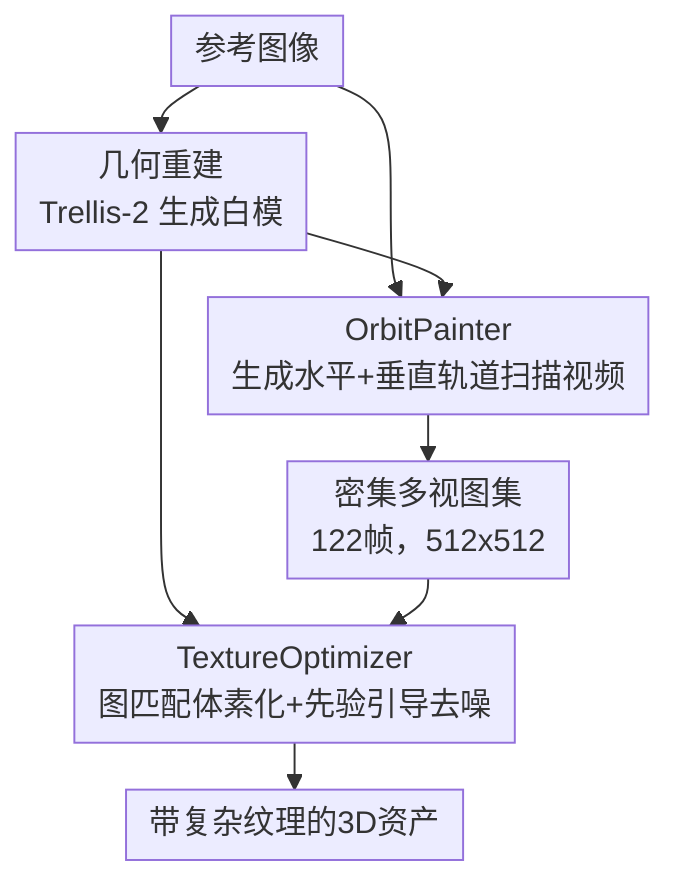

# Ink3D: Sculpting 3D Assets with Extremely Complex Textures via Video Generative Models

**会议**: ECCV 2026  
**arXiv**: [2607.01222](https://arxiv.org/abs/2607.01222)  
**代码**: [https://github.com/YueHan99/Ink3D.TextureGen](https://github.com/YueHan99/Ink3D.TextureGen)  
**领域**: 3D视觉 / 扩散模型  
**关键词**: 3D纹理生成, 视频生成模型, 几何感知注意力, 神经纹理烘焙, 多视图一致性

## 一句话总结
Ink3D将3D纹理生成解耦为"几何优先、纹理其次"的两阶段管线：先用现成3D模型生成白模几何，再通过条件视频生成模型OrbitPainter合成密集轨道扫描视频，最后用TextureOptimizer神经烘焙模块将多视图纹理融合到几何体上，从而借助大规模预训练视频先验实现现有3D生成方法难以企及的极复杂纹理合成。

## 研究背景与动机
近年来3D资产生成取得了显著进展，主流方法采用隐扩散范式——将3D资产编码到紧凑隐空间后用扩散模型建模分布，已能生成结构细节日益精细的几何形状。然而，这些方法在合成极复杂纹理时普遍表现不佳，典型失败场景包括文字密集表面（Logo、标志、印刷文字）、复杂衣物图案（格纹、刺绣、层叠纹样）和高频装饰细节。

根本原因在于高质量3D纹理训练数据的稀缺与昂贵。3D纹理数据获取需要专业建模师手工绘制或高成本扫描设备，现有最大3D数据集也仅为数十万量级。相比之下，互联网上的图像和视频数据以数十亿计，比3D数据高出几个数量级。基于这些海量数据预训练的图像/视频生成模型展现出卓越的视觉建模能力和泛化性，尤其擅长细粒度外观和纹理丰富的内容。

这构成了本文的核心矛盾：3D生成模型受限于数据规模，纹理能力存在天花板；而2D视频生成模型坐拥海量数据，视觉建模能力极强，却缺乏3D几何意识。Ink3D的核心idea是**将3D纹理生成转化为轨道视频生成问题**，通过"几何重建-视频生成-纹理烘焙"三阶段管线，把大规模视频生成模型的强大视觉先验引入3D纹理合成，在不增加3D训练数据的前提下大幅提升纹理复杂度。

## 方法详解

### 整体框架
Ink3D遵循"几何优先、纹理其次"的解耦范式。给定一张参考图像，系统分三步产出带纹理的3D资产：(1) 用现成的3D重建模型（Trellis-2）从参考图像估计白模几何体；(2) 将白模和参考图像输入条件视频生成模型OrbitPainter，合成水平和垂直两条360度轨道扫描视频，获得122帧密集多视图观测；(3) 通过TextureOptimizer神经烘焙模块，将密集视图融合到白模几何上，产出最终带纹理3D资产。整个管线将纹理合成的核心挑战从"有限3D数据上学习纹理"转化为"引导预训练视频模型生成几何一致的轨道视图"，从根本上绕开了3D纹理数据稀缺的瓶颈。

### 关键设计

**1. OrbitPainter：将多视图纹理生成建模为条件轨道视频生成**

传统几何纹理方法普遍采用稀疏多视图策略——围绕物体生成4到6张离散视图，再反投影到3D表面。这种做法有两个根本缺陷：有限视点数量无法完整覆盖物体表面，必然存在遮挡区域的纹理缺失；独立生成的各视图之间缺乏跨视图一致性，同一表面区域在不同视图中可能呈现不同颜色或图案，投影后产生明显接缝。

OrbitPainter从根本上改变了这一范式，将纹理生成重新建模为轨道视频生成问题。具体而言，给定参考图像和白模几何体，OrbitPainter同时合成两条360度轨道扫描视频：一条相机水平旋转，一条相机垂直旋转，每条视频默认包含61帧512x512的RGB图像，共计122个密集视点。两个方向互补的扫描轨迹确保了对物体表面的全面覆盖，视频帧间的天然时空连续性则强制相邻帧保持外观连贯，自然地转化为3D空间中的跨视图一致性。

训练时，OrbitPainter以WAN 2.2视频扩散模型为骨干，接收两类条件先验：(1) 2D外观先验——参考图像经VAE编码后的隐特征 $\boldsymbol{F}_I$；(2) 3D几何先验——白模沿轨道扫描渲染的表面法向视频和3D位置视频经VAE编码后的隐特征 $\boldsymbol{F}^{Normal}$ 和 $\boldsymbol{F}^{Pos}$。目标RGB视频隐特征 $\boldsymbol{F}^{RGB}$ 由水平和垂直两条轨道的RGB隐特征沿时间维拼接得到：$\boldsymbol{F}^{RGB} = \text{Concat}_T(\boldsymbol{F}^{RGB}_H, \boldsymbol{F}^{RGB}_V)$。几何先验通过通道维拼接注入噪声隐特征：$\mathbf{x}'_t = \text{Concat}_C(\mathbf{x}_t, \boldsymbol{F}^{Pos}, \boldsymbol{F}^{Normal})$，外观先验则通过时间维追加：$\boldsymbol{S} = \text{Concat}_T(\boldsymbol{F}_I, \mathbf{x}'_t)$。序列 $\boldsymbol{S}$ 输入 $N$ 个Transformer块，每块包含并行的全注意力模块和Geometry-Aware Sparse Attention模块。OrbitPainter仅需轻量微调（LoRA rank=32，45K迭代，60K训练样本）即可适配任意物体类别，得益于WAN 2.2在海量视频数据上的大规模预训练带来的强视觉泛化能力。

**2. Geometry-Aware Sparse Attention (GASA)：用3D位置先验约束跨帧注意力范围**

标准视频扩散模型的注意力机制执行全时空注意力——每个query token关注视频中所有时空位置的token。这在普通视频生成中是必要的，因为缺乏结构先验来约束注意力空间。但在Ink3D的场景下，视频帧来自3D资产的轨道扫描，每个时空token都对应到3D网格表面的一个具体位置，这一几何对应关系提供了未被利用的结构化先验。

GASA的核心思想是：给定一个query时空token $\mathcal{T}$，通过其关联的3D位置图反投影到底层3D几何体上，确定其在3D空间中的体素坐标 $(i,j,k)$；然后以该坐标为中心、扩张半径 $r=3$ 定义局部邻域；对于其他视频帧中的token，只选择其关联3D位置落在该邻域内的token作为注意力计算的key，忽略所有其他token。这样一来，注意力被显式地限制在"对应同一或邻近表面区域"的跨帧token之间。

GASA与标准全注意力模块在每个Transformer块中**并行运行**——全注意力处理完整序列 $\boldsymbol{S}$ 以保持全局上下文建模，GASA仅作用于视频相关token $\mathbf{x}'_t$ 以注入几何感知的局部对应关系。这种设计使模型既保留了视频生成的全局一致性，又获得了精确的几何引导。消融实验表明，移除GASA导致FID从103.7退化至109.9，验证了几何先验在网络注意力层面显式注入对跨视图一致性的关键作用。

**3. TextureOptimizer：图匹配体素化+先验引导去噪的神经纹理烘焙**

OrbitPainter生成的122帧密集视图提供了丰富的纹理观测，但直接将它们反投影到白模上做简单烘焙（如逐像素平均）会产生严重的颜色渗漏和纹理模糊。根本原因在于生成的轨道视频帧之间并非严格几何一致——同一表面区域在不同帧中可能略有偏移，导致重投影时应对齐的像素出现错位。

TextureOptimizer通过两步解决这一问题。第一步是**纹理体素化（Textured Voxelization）**：将密集视图分配问题建模为马尔可夫随机场（MRF）上的图匹配优化。给定 $M$ 个被占据的表面体素和 $K=122$ 张视图，目标是为每个体素 $\boldsymbol{v}_m$ 选择一个最优视图索引 $k_m$，使得总体纹理接缝最小且满足几何可见性约束：

$$\min_{\{k_m\}_{m=1}^{M}} \sum_{m=1}^{M} D_m(k_m) + \lambda \sum_{(m,n)\in\mathcal{E}} w_{m,n} \mathbf{1}[k_m \neq k_n]$$

其中数据项 $D_m(k_m)$ 基于体素表面法向与相机视线夹角评估可见性和投影可靠性；平滑项使用颜色梯度自适应权重 $w_{m,n}$，在纹理边缘处容忍视角切换、在平滑区域惩罚接缝；通过alpha-expansion算法求解，未观测体素用广度优先颜色扩散填充。与平均所有视图（导致模糊）不同，这一公式为每个体素全局最优地选择一个"最佳视角"，自然避免了几何不一致带来的颜色累积错误。

第二步是**先验引导去噪（Prior-Guided Denoising）**：将纹理体素用Trellis-2的3D VAE编码为隐特征，加入轻度高斯噪声扰动，然后输入Trellis-2执行少量去噪步（仅对应原去噪轨迹的后段）。原Trellis-2从纯噪声几何出发做完整去噪来生成纹理，但独立运行时难以再现极复杂纹理；而TextureOptimizer从已含大量纹理信息的轻度噪声初始化出发，Trellis-2仅需"修正"视频生成残留的几何不一致伪影，其固有的3D结构感知能力自然地保持了几何边界的锐利度。整个TextureOptimizer无需任何训练，直接复用预训练Trellis-2的去噪能力。

### 一个完整示例

以论文附录中的帐篷（tent）网格纹理测试为例走一遍完整推理流程。输入是一张由Nano Banana生成的帐篷参考图像，其上印有规则的网格纹理图案。

1. **几何重建**：Trellis-2从参考图像估计白模几何体，输出无纹理的帐篷网格。
2. **几何视频渲染**：沿水平轨道（相机绕帐篷水平旋转360度，61帧）和垂直轨道（相机绕帐篷垂直旋转360度，61帧）分别渲染表面法向视频和3D位置视频，分辨率均为512x512。
3. **隐特征提取**：WAN 2.2 VAE编码器将所有视频（法向、位置、待生成的RGB占位）和参考图像编码为隐特征，空间下采样16倍、时间下采样4倍。
4. **OrbitPainter去噪**：从高斯噪声 $\mathbf{x}_0 \sim \mathcal{N}(\mathbf{0}, \mathbf{I})$ 出发，在Flow Matching框架下迭代去噪——每步将当前隐特征 $\mathbf{x}_t$ 与几何先验（法向+位置隐特征）通道拼接、外观先验（参考图像隐特征）时间追加，输入Transformer块，经全注意力和GASA并行处理后预测速度场 $\mathbf{v}_t$，逐步逼近目标 $\boldsymbol{F}^{RGB}$。
5. **视频解码**：去噪后的RGB隐特征经VAE解码器恢复为122帧RGB图像（水平61帧+垂直61帧）。
6. **纹理烘焙**：TextureOptimizer先通过MRF图匹配为每个表面体素从122帧中选取最优视角的像素颜色，再对纹理体素加轻度噪声后由Trellis-2执行少量去噪步refine，最终输出带清晰网格纹理的帐篷3D资产。

整条管线在单张H100上耗时约13分钟（OrbitPainter视频生成约12分钟，TextureOptimizer烘焙约1分钟）。若使用DMD2加速，视频生成可缩短至约2分钟。

### 损失函数 / 训练策略

OrbitPainter采用Flow Matching训练目标。设 $t \in [0,1]$ 从logit-normal分布采样，目标RGB隐特征为 $\boldsymbol{F}^{RGB}$，初始噪声为 $\mathbf{x}_0 \sim \mathcal{N}(\mathbf{0}, \mathbf{I})$，中间样本为线性插值 $\mathbf{x}_t = (1-t)\mathbf{x}_0 + t\boldsymbol{F}^{RGB}$。模型预测速度场 $\mathbf{v}_t$，损失为预测速度与真实速度 $\mathbf{u}_t = d\mathbf{x}_t/dt$ 的均方误差：

$$\mathcal{L} = \mathbb{E}_{t, \mathbf{x}_0, \boldsymbol{F}^{RGB}} \left\|\mathbf{v}_t - \mathbf{u}_t\right\|^2$$

模型从WAN-2.2-14B初始化，GASA层权重用对应全注意力层权重初始化。采用LoRA式微调（rank=32），优化器为AdamW（lr=1e-4），在8张NVIDIA A100 GPU上训练45K次迭代，batch size为1。训练数据为Objaverse和Sketchfab数据集中60K个带反照率纹理的3D资产子集。TextureOptimizer无需训练，直接复用预训练Trellis-2的去噪能力。

## 实验关键数据

### 主实验

实验在Texverse数据集中筛选85个高质量样本上评估。每个样本保留白模几何、丢弃原始纹理，用商用图像生成模型Nano Banana生成具有复杂纹理的参考图像，最终得到85组"白模+参考图像"测试对。评估指标：FID（生成图像与参考图像的Fréchet距离）、CLIP-FID（CLIP特征空间的FID）、LPIPS（感知相似度）、CLIP-I（CLIP余弦相似度）。

| 方法 | FID↓ | CLIP-FID↓ | LPIPS↓ | CLIP-I↑ |
|------|------|-----------|--------|---------|
| Paint3D | 146.0 | 570.6 | 0.3417 | 0.7980 |
| TEXGEN | 123.7 | 291.8 | 0.2280 | 0.8409 |
| SeqTex | 148.3 | 387.9 | 0.2601 | 0.8052 |
| Trellis-2 | 120.4 | 223.9 | 0.2714 | 0.8694 |
| **Ink3D (Ours)** | **103.7** | **195.6** | **0.2029** | **0.8979** |

Ink3D在全部四项指标上显著优于所有对比方法。相比最强基线Trellis-2，FID降低16.7（相对提升13.9%），CLIP-FID降低28.3（相对提升12.6%），CLIP-I从0.8694提升至0.8979。Trellis-2是同时支持联合几何-纹理生成和条件纹理合成的SOTA 3D生成模型，在其基础上Ink3D的大幅提升验证了引入视频生成先验的有效性。

### 消融实验

| 配置 | FID↓ | CLIP-FID↓ | LPIPS↓ | CLIP-I↑ | 说明 |
|------|------|-----------|--------|---------|------|
| Full model | 103.7 | 195.6 | 0.2030 | 0.8980 | 完整Ink3D |
| w/o Surface Normal | 113.9 | 218.3 | 0.2128 | 0.8841 | 移除表面法向视频先验 |
| w/o 3D-Position | 149.2 | 361.5 | 0.2367 | 0.8282 | 移除3D位置视频先验 |
| w/o GASA | 109.9 | 203.7 | 0.2077 | 0.8893 | 移除几何感知稀疏注意力 |

三项消融的掉点幅度揭示了各先验信号的相对重要性：3D位置先验贡献最大（FID从103.7骤升至149.2，退化44%），说明显式的3D空间坐标对维持跨帧几何一致性至关重要；表面法向先验次之（FID升至113.9）；GASA在网络注意力层面的几何引导增益略小于输入级先验（FID升至109.9），但方向一致。

### 关键发现
- **3D位置先验是不可替代的强信号**：移除3D位置视频导致FID退化44%，远超其他消融项，表明单纯依赖表面法向不足以让视频模型理解3D空间对应关系，逐像素的3D坐标映射是关键。
- **视频分辨率与帧数直接决定纹理质量**：512分辨率显著优于384（FID 103.7 vs 124.2）；帧数从61降至25时FID退化至124.8，帧数过少导致相机运动过快、引入运动模糊，进而传导为纹理模糊。
- **TextureOptimizer显著优于传统烘焙**：相比平均烘焙（FID 121.0）和可微渲染（FID 123.3），TextureOptimizer的FID为103.7，验证了图匹配体素化+先验引导去噪策略在应对几何不一致多视图时的鲁棒性。

## 亮点与洞察
- **"几何优先、纹理其次"的解耦策略精准务实**：不是试图让一个模型同时学好几何和纹理，而是把两个子问题分别交给最适合的工具——几何给3D原生模型，纹理给视频生成模型。这种"认怂"式的解耦比强行端到端更务实，也更容易利用各自领域的最强预训练模型。
- **GASA是几何先验注入的新范式**：传统方法通常在输入端注入几何条件（法向图、深度图），GASA则直接在注意力机制层面利用3D对应关系，让模型"知道"哪些像素在3D空间中是邻居。这种注意力掩码策略轻量且可插拔，可迁移到任何需要几何感知的视频/多视图生成任务。
- **图匹配纹理烘焙的insight简洁但深刻**：与其平均所有视图（必然模糊），不如为每个体素选一个"最佳视角"——将选择建模为MRF优化，数据项保证可见性，平滑项在纹理边缘容忍切换、在平滑区域惩罚接缝。这一思路可广泛应用于任何多视图融合场景（NeRF后处理、3D Gaussian Splatting纹理提取等）。
- **先验引导去噪是对扩散模型能力的巧妙复用**：不训练新模型，直接借用Trellis-2的去噪能力，但把输入从纯噪声换成"轻度噪声+已含纹理信息的体素"，让模型只做最后几步去噪来"修正"不一致区域。这种零训练成本的"借力打力"是扩散模型应用中的一个通用技巧。

## 局限与展望
- **推理延迟高**：单张H100上约13分钟，视频生成占12分钟。作者指出DMD2加速可降至约2分钟，但对于交互式应用仍有差距，需要更激进的蒸馏或一致性模型加速。
- **依赖上游模型质量**：Ink3D的纹理质量受WAN 2.2视频模型和Trellis-2几何/去噪能力的双重约束——两个上游模型的进步会直接提升Ink3D，但其退化也会传导为失败。
- **仅支持单参考图像输入**：当前方法要求一张参考图像同时提供外观和几何线索，不支持多视角参考或文本描述驱动的纹理生成。多条件融合是自然的扩展方向。
- **对严重几何跳变的鲁棒性未充分验证**：TextureOptimizer通过轻度噪声+少量去噪步处理几何不一致，但轨道视频出现严重几何跳变时轻度噪声是否足以修正尚不明确。

## 相关工作与启发
- **vs 稀疏多视图纹理方法（Paint3D, SyncMVD等）**: 这些方法生成4-6张离散视图后反投影，受限于视角覆盖不全和跨视图不一致。Ink3D用视频生成替代独立多视图生成，从机制上保证了密集覆盖和帧间一致性。核心启发：对于需要空间连续性的3D任务，"生成视频再拆帧"几乎总是优于"独立生成多张图"。
- **vs Hunyuan3D / Step1X-3D / Clay等大型3D系统的纹理模块**: 这些系统也采用"先生成几何、再合成纹理"的管线，但纹理阶段仍依赖稀疏多视图。Ink3D的OrbitPainter可作为这些系统纹理模块的直接升级方案——将稀疏视图生成替换为密集轨道视频生成。
- **vs SeqTex**: SeqTex同样尝试用视频生成模型做纹理，但只生成稀疏视图且生成的是正交快转序列，视频模型难以处理这种非自然运动模式。Ink3D的关键区别在于生成了物理上自然的轨道扫描视频（匹配视频模型的训练分布），且帧数足够密集（122帧 vs SeqTex的稀疏视图）。

## 评分
- 新颖性: ⭐⭐⭐⭐⭐ 将3D纹理生成重新建模为轨道视频生成，并配套设计了GASA和TextureOptimizer两个精巧模块，核心idea"用视频先验弥补3D数据不足"简洁且原创性强
- 实验充分度: ⭐⭐⭐⭐ 主实验对比充分（4个baseline+4项指标），消融覆盖三个关键维度（几何先验、GASA、烘焙策略），但缺少用户研究，定性结果主要集中在附录
- 写作质量: ⭐⭐⭐⭐ 结构清晰，动机阐述充分，两张系统图有效辅助理解；部分公式符号较密集，Training Data Pre-Processing节与Architecture节之间存在轻微重复
- 价值: ⭐⭐⭐⭐⭐ 为3D纹理生成开辟了"视频生成模型即纹理引擎"的新路线，OrbitPainter和TextureOptimizer的设计思路可被后续工作广泛复用，具有较高的方法论迁移价值

<!-- RELATED:START -->

## 相关论文

- [\[ECCV 2026\] GenSP: Consistent Spherical Parameterization via Learning Shape Generative Models](gensp_consistent_spherical_parameterization_via_learning_shape_generative_models.md)
- [\[CVPR 2026\] TeHOR: Text-Guided 3D Human and Object Reconstruction with Textures](../../CVPR2026/3d_vision/tehor_text-guided_3d_human_and_object_reconstruction_with_textures.md)
- [\[CVPR 2025\] Video Depth Without Video Models](../../CVPR2025/3d_vision/video_depth_without_video_models.md)
- [\[CVPR 2026\] GenMatter: Perceiving Physical Objects with Generative Matter Models](../../CVPR2026/3d_vision/genmatter_perceiving_physical_objects_with_generative_matter_models.md)
- [\[ECCV 2026\] GENA3D: Generative Amodal 3D Modeling by Bridging 2D Priors and 3D Coherence](gena3d_generative_amodal_3d_modeling_by_bridging_2d_priors_and_3d_coherence.md)

<!-- RELATED:END -->
