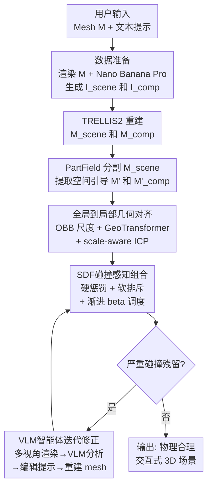

# Interact3D: Compositional 3D Generation of Interactive Objects

**会议**: ECCV 2026  
**arXiv**: [2603.16085](https://arxiv.org/abs/2603.16085)  
**代码**: [https://github.com/SII-Hui/Interact3D](https://github.com/SII-Hui/Interact3D)  
**领域**: 3D视觉  
**关键词**: 3D组合生成, 物理感知组合, 碰撞避免, SDF优化, VLM智能体优化

## 一句话总结
Interact3D 提出无需训练的"先生成再组合"框架，利用 2D/3D 生成模型的空间先验将 3D 组合生成转化为结构化配准问题，通过两阶段组合管线（全局到局部几何对齐锚定主物体 + SDF 碰撞感知优化放置剩余物体）和 VLM 驱动的智能体闭环迭代修正，从单张图像和文本提示自动生成物理合理、无碰撞的交互式 3D 组合场景，并发布 8,000+ 对交互式 3D 数据集。

## 研究背景与动机
机器人仿真（Sim2Real）需要大量具有真实几何、物理属性和正确物体间空间关系（OOR）的交互式 3D 资产来训练操作策略。然而，高质量交互式 3D 数据严重稀缺——手工建模标注成本极高，难以规模化。现有替代方案各有致命缺陷：基于大规模人体视频的方法虽提供丰富语义先验，但 2D 视频天然缺乏精确的 3D 几何 grounding 和物理碰撞约束，导致机器人无法理解复杂空间关系；3D 生成模型（TRELLIS2、Hunyuan3D）虽能合成高质量单体资产，但输出的是"烘焙"成单一几何体的 fused mesh，完全没有独立的物体边界和物理上有意义的空间关系。

一个直觉方案是直接用 PartField 等分割工具把生成场景拆开——但这会在几何体上挖出难以修复的破洞。前馈网络方法（MIDI、2BY2）受限于 3D 组合数据的极度稀缺（2BY2 仅 517 对），泛化能力差且训练成本高。因此核心矛盾在于：如何在无需昂贵 3D 标注的前提下，可靠地生成几何兼容、物理合理的 3D 组合资产？

本文的核心洞察是：图像引导的 3D 生成模型中隐含编码了丰富的空间先验——生成场景虽然几何粗糙（有破洞），但其物体间相对位姿是可靠的。因此可以将传统的复杂几何推理问题重新表述为结构化 3D 配准问题：用生成场景的粗糙分割结果作为空间引导，将独立生成的高质量单体 mesh 配准到正确位置，并通过碰撞优化和 VLM 语义修正保证物理合理性。核心 idea：**generate-then-compose——分别生成高质量单体，再用生成先验提供的空间关系将它们"拼"成物理合理的交互场景**。

## 方法详解

### 整体框架
Interact3D 的核心思路是"先生成再组合"：不试图直接生成组合场景的单一 fused mesh，而是分别生成高质量单体 mesh，然后利用生成模型隐含的空间先验将它们配准到正确相对位姿。整个流程从用户提供一个 3D mesh M 和文本提示出发，经过图像生成、3D 重建、空间引导提取、两阶段组合、可选的智能体修正，最终输出物理合理的交互式 3D 场景。

具体流程如下。(1) **数据准备**：将输入 mesh M 从标准正视角渲染为图像 I_rendered，结合用户文本提示，用 Nano Banana Pro（Gemini）生成组合场景图像 I_scene，再提示模型从 I_scene 中移除原物体得到仅含新增部件的互补图像 I_comp。(2) **3D 重建**：用 TRELLIS2 分别从 I_scene 和 I_comp 重建场景 mesh M_scene 和互补 mesh M_comp。(3) **空间引导提取**：用 PartField 将 M_scene 分割为 M' 和 M'_comp 两部分——这些分割 mesh 虽常有破洞不能用作最终资产，但其相对位姿提供了可靠的空间引导。(4) **两阶段组合**：Stage 1 对锚定物体执行全局到局部几何对齐，确定可靠初始位姿；Stage 2 对剩余物体执行 SDF 碰撞感知优化，在保持几何对齐的同时显式惩罚穿插。(5) **智能体修正**：当碰撞无法通过纯位姿优化解决时，VLM 分析多视角渲染图并生成修正提示，驱动 2D 图像编辑模块迭代修正互补部件的几何形态。

### 关键设计

**1. 全局到局部几何对齐：解决低重叠和分割破洞下的鲁棒配准**

锚定物体的配准面临三重挑战：I_scene 中的遮挡导致生成 mesh 与场景 mesh 不一致；PartField 分割产生结构破洞和不完整表面；结果就是两个待配准点云的重叠率极低且含大量离群点。传统 ICP 对此极其敏感，极易陷入局部最优。

本文采用"全局估计提供 warm start，局部优化精细收敛"的分层策略。首先用 Oriented Bounding Box（OBB）估计两个点云的几何范围，计算初始均匀缩放因子 s，消除尺度歧义。然后使用 GeoTransformer——一个基于 transformer 的 3D 配准网络——在低重叠率几何上鲁棒地估计全局平移 tau 和旋转 R。最后以 (s, R, tau) 的全局估计作为初始化，运行 scale-aware ICP 完成精确对齐。这三步递进——OBB 解尺度、GeoTransformer 解全局位姿、ICP 解局部残差——各司其职：全局初始化防止陷入局部极小，局部优化聚焦于最小化残差几何偏差。

**2. SDF碰撞感知组合：用有符号距离场显式建模物理合理性**

锚定物体固定后，剩余物体 M_remain 需要相对于锚定物体放置。直接用类似的全局到局部对齐虽能提供合理初始位姿，但无法保证物理有效性——微小几何偏差就可能导致物体穿插或不自然间隙。

本文引入 SDF 引导的优化阶段。首先预计算锚定 mesh M_anchor 的有符号距离场 Phi_anchor(p)，其中负值表示点 p 穿入锚定物体内部。对 M_remain 上任一点 p，经变换 theta 后的碰撞损失定义为：

$$\mathcal{L}_{\mathrm{col}}(\boldsymbol{\theta})=\sum_{\mathbf{p}\in\mathbf{M}_{\mathrm{remain}}}\left(\left[-\Phi_{\mathrm{anchor}}(\boldsymbol{\theta}(\mathbf{p}))\right]_{+}^{2}+\lambda\cdot\left[\epsilon-\Phi_{\mathrm{anchor}}(\boldsymbol{\theta}(\mathbf{p}))\right]_{+}\right)$$

其中第一项为硬惩罚（ReLU 平方，仅当点穿入物体内部时激活），第二项为软排斥（在安全裕度 epsilon 内产生推力，lambda 设为极小值保证惩罚场平滑过渡）。最终优化目标联合几何对齐保真项和碰撞损失：

$$\min_{\boldsymbol{\theta}}\;\sum_{p\in\mathbf{M}_{\mathrm{remain}}}\|\boldsymbol{\theta}(\mathbf{p})-\mathbf{p}^{\prime}\|^{2}+\beta^{(k)}\mathcal{L}_{\mathrm{col}}(\boldsymbol{\theta})$$

关键设计在于 beta 的渐进调度：beta 初始化为 0（此时等价于纯 scale-aware ICP），随后线性增长至 beta_max，让优化早期优先保证几何对齐收敛，后期逐步强制物理合理性。这种"先对齐再避碰"的调度策略避免了优化初期碰撞项主导导致位姿未收敛就被推开的问题。

**3. VLM智能体迭代修正：语义级闭环修正解决位姿优化无法处理的几何不兼容**

SDF 优化只能通过平移/旋转/缩放缓解碰撞，但当互补 mesh 本身几何形态与锚定物体根本性不兼容时（如花瓶里的花茎方向错误、毛绒熊塞不进帆布袋），纯位姿优化无能为力。根因是 2D 引导图像中的严重遮挡导致 TRELLIS2 重建丢失了关键空间关系。

本文引入工作在语义层面的智能体修正环路。将当前组合场景从多视角渲染（含内部剖面图），连同原始组合提示一起送入 VLM（Gemini 3 Pro）。VLM 分析空间不一致性并生成有针对性的修正指令（如"缩短花茎并向左偏移 15 度"），指令驱动 Nano Banana Pro 对互补图像 I_comp 进行 2D 编辑，编辑后的图像重新经 TRELLIS2 重建为 3D mesh，再重新进入组合管线。整个过程形成闭环：几何对齐 + SDF 优化 + VLM 语义修正交替迭代，直到无碰撞或达到最大迭代次数（设为 5）。这相当于给纯几何优化装了一个"语义级外循环"——几何方法处理能通过位姿解决的问题，语义方法处理需要改几何形态才能解决的问题。

### 一个完整示例：花瓶插花

以"将花插入花瓶"为例走通完整流程。用户提供花瓶 mesh M 和提示"a vase with flowers"。首先渲染花瓶正视图，Nano Banana Pro 生成花瓶插花的场景图 I_scene 和仅有花朵的互补图 I_comp。TRELLIS2 分别重建出场景 mesh（含花瓶和花的 fused 几何）和花朵 mesh M_comp。PartField 分割场景 mesh 得到花瓶分割 M' 和花朵分割 M'_comp——后者因分割伪影有破洞但提供了花朵相对于花瓶的位置参考。

Stage 1：花瓶在 I_scene 中投影面积更大，被选为锚定物体。OBB 估计尺度差异 → GeoTransformer 估计全局位姿 → scale-aware ICP 精确对齐，花瓶被固定在正确位置。

Stage 2：花朵作为 M_remain，OBB + GeoTransformer 提供初始位姿，SDF 优化在 beta 渐进增长下逐步推开穿插——但这里出现严重问题：I_scene 中花茎被花瓶严重遮挡，导致 TRELLIS2 重建出的花朵 mesh 茎部方向与花瓶开口根本对不齐，纯位姿优化无法解决。

触发智能体修正：渲染组合场景的多视角图（含花瓶剖面图），VLM 发现"花茎偏离花瓶中心轴线，且过长导致穿出瓶底"，生成修正提示"缩短花茎至瓶内 2/3 深度，垂直对齐瓶口中心"。Nano Banana Pro 据此编辑 I_comp，新生成的 I_comp 中花茎更短且居中。重新 TRELLIS2 重建 → SDF 组合优化 → 碰撞消除，第 2 轮即收敛，输出物理合理的花瓶插花场景。

### 损失函数 / 训练策略
本文方法完全无需训练（training-free），所有组件——TRELLIS2、PartField、GeoTransformer、Gemini——均使用预训练权重。方法中的"优化"均指推理阶段的数值优化而非网络训练。

核心优化目标为公式 (3) 中的联合损失：数据项为变换后点与目标对应点的 L2 距离，保证几何对齐；碰撞项 L_col 为公式 (2) 的 SDF 硬惩罚 + 软排斥组合。超参设置：lambda = 0.003（软排斥权重，极小值仅保证碰撞边界平滑过渡），beta 从 0 线性增长至 beta_max = 3.0，共 k_max = 100 步优化。GeoTransformer 使用官方预训练权重（在 3DMatch 和 KITTI 上训练）。VLM 智能体修正最大迭代次数设为 5。推理在单张 NVIDIA H200 GPU 上完成。

## 实验关键数据

### 主实验
在 150 个测试样例上对比 5 个 baseline（分为三类），从语义保真度和物理有效性两个维度评估。

| 方法 | Text CLIP (Avg) ↑ | Image CLIP (Avg) ↑ | Human Rating (Avg) ↑ | VLM Rating (Avg) ↑ | R_surface (×10^-3) ↓ | R_volume (×10^-3) ↓ |
|------|-------------------|--------------------|-----------------------|--------------------|----------------------|---------------------|
| Jigsaw | 0.3004 | 0.7338 | 4.21 | 5.89 | 2.7792 | 16.837 |
| 2BY2 | 0.2798 | 0.6982 | 2.87 | 4.08 | 1.5827 | 9.1734 |
| MIDI | 0.3079 | 0.7840 | 5.27 | 5.84 | 22.185 | 116.70 |
| PartField+RANSAC | 0.3094 | 0.7910 | 6.28 | 6.59 | 2.2287 | 7.9280 |
| **Interact3D (Ours)** | **0.3314** | **0.8236** | **8.33** | **8.57** | **0.6939** | **3.8762** |

前馈基线（Jigsaw、2BY2、MIDI）受限于训练数据分布，泛化能力差，MIDI 尤其在碰撞指标上表现极差（R_volume 高达 116.70）。PartField+RANSAC 虽有所改善，但 RANSAC 缺乏全局配准鲁棒性（出现方向反转）且未显式建模碰撞（R_surface 为本文的 3.2 倍）。Interact3D 在所有指标上全面领先，尤其是物理有效性指标——R_surface 仅为 0.6939×10^-3，R_volume 为 3.8762×10^-3，远低于所有 baseline。

### 消融实验
在 150 个测试样例上消融配准管线的各组件。

| 配置 | Text CLIP ↑ | Image CLIP ↑ | Human Rating ↑ | VLM Rating ↑ | R_surface (×10^-3) ↓ | R_volume (×10^-3) ↓ |
|------|------------|-------------|---------------|-------------|---------------------|---------------------|
| RANSAC only | 0.3094 | 0.7910 | 6.28 | 6.59 | 2.2287 | 7.9280 |
| ICP only | 0.2985 | 0.7729 | 5.04 | 5.88 | 1.2914 | 9.7102 |
| RANSAC+ICP | 0.3023 | 0.7958 | 6.40 | 6.31 | 1.0481 | 6.7536 |
| GeoT. only | 0.3187 | 0.8094 | 7.03 | 7.21 | 0.8854 | 6.0039 |
| GeoT.+ICP(SDF) w/o Agent | 0.3277 | 0.8101 | 7.94 | 8.18 | 0.7458 | 4.9380 |
| **Full (GeoT.+ICP(SDF)+Agent)** | **0.3314** | **0.8236** | **8.33** | **8.57** | **0.6939** | **3.8762** |

关键发现：(1) 纯 ICP 甚至不如纯 RANSAC（Human Rating 5.04 vs 6.28），因为 ICP 对初始化极其敏感，低重叠场景下频繁陷入局部最优。(2) RANSAC+ICP 的全局到局部组合已有提升，但与 GeoTransformer 变体差距显著——GeoTransformer 的 transformer 架构在处理低重叠几何时远比 RANSAC 鲁棒。(3) 去掉 SDF 项（对比 GeoT.+ICP(SDF) w/o Agent 与 RANSAC only）使 R_surface 从 0.7458 升至 2.2287，R_volume 从 4.9380 升至 7.9280——消融掉的恰好是碰撞感知能力。(4) 去掉智能体修正循环使所有指标一致下降，Human Rating 从 8.33 降至 7.94，验证了语义级修正对最终质量的有效贡献。

### 关键发现
- **GeoTransformer 是配准鲁棒性的核心支柱**：在 PartField 分割破洞和生成 mesh 不一致导致低重叠率的条件下，GeoTransformer 的全局配准能力远超 RANSAC 和纯 ICP，是 pipeline 不崩溃的基础保障。
- **SDF 碰撞项贡献最大，但伤害可逆**：消融 SDF 项后碰撞指标显著恶化（R_surface 升 3.2 倍），但语义指标（CLIP、Rating）降幅有限——说明 SDF 主要解决物理有效性，对语义保真度影响较小。
- **智能体修正循环适用面窄但效果显著**：仅在约 10%（16/150）的严重碰撞样例中真正触发，但触发后能从根本上解决纯几何方法无法处理的几何不兼容问题（如对称歧义导致的书本倒置）。
- **方法对超参不敏感**：lambda（软排斥权重）、beta_max、k_max 在合理范围内变化时结果稳定，表明渐进调度策略本身比具体参数值更关键。

## 亮点与洞察
- **"生成场景当空间引导，不当最终输出"的用法切换**：常规思路是生成组合场景 → 直接分割使用，本文反其道而行——分割结果明确承认"有破洞不能用"，只提取其中的空间关系作为配准引导，最终资产来自独立生成的高质量单体。这种"粗糙引导 + 高质量单体"的分工思路可迁移到任何需要组合先验但源数据质量不够的场景。
- **VLM 作为几何优化的"语义外循环"**：传统几何优化处理位姿，VLM 处理几何形态——两层分工清晰且互补。VLM 不看坐标、看渲染图，自然弥合了 2D 语义和 3D 几何之间的 gap。这种"几何优化 + VLM 语义反馈"的闭环模式可迁移到其他需要"改形态而非改位姿"的 3D 编辑/生成任务。
- **渐进 beta 调度的小技巧但大作用**：beta 线性增长从 0 到 beta_max，等价于"先全力对齐，对齐收敛后再慢慢推开碰撞"。如果 beta 一开始就很大，碰撞项会在位姿未收敛时就推开物体导致对齐失败。这种"先保证主目标收敛再加约束"的调度策略在多个优化目标之间存在冲突时通用。

## 局限与展望
- 作者承认对精细部件（螺丝、紧密耦合关节）处理困难——2D 引导图像中的严重遮挡导致 3D 几何歧义，暴露了依赖 2D 空间先验的天花板。未来方向是原生 3D 组合生成，直接在 3D 空间推理，绕过 2D 依赖。
- 强几何对称物体会导致方向歧义（如长方体书本可能上下颠倒），因为 GeoTransformer 不考虑纹理——纯几何匹配在对称物体上无法区分朝向。一个直接改进是加入纹理/外观特征辅助配准。
- 智能体修正依赖 VLM 对多视角渲染图的空间理解能力——VLM 的 3D 空间推理目前仍不成熟，可能在复杂遮挡场景下给出错误修正建议。实验仅测试 Gemini 3 Pro 一种 VLM，其对不同 VLM 的鲁棒性未验证。
- 两阶段组合中锚定物体的选择仅基于 2D 投影面积——这在物体深度差异大时可能不合理（远处大物体 vs 近处小物体）。可考虑基于 3D 体积或 SDF 覆盖率的选择策略。
- 数据集的 8,000+ 对虽远超前人（2BY2 仅 517 对），但仅覆盖 9 个日用品类——泛化到工业零件、医疗器械等专业领域尚待验证。

## 相关工作与启发
- **vs PartField / SAMPart3D**：这些方法做 3D 部件分割——输入 fused mesh，输出分割后的各部件。本文证明直接分割高保真生成场景会导致不可修复的几何破洞，因此只将分割结果用作空间引导而非最终输出。启发：分割质量不够时，"引导"比"直接使用"更务实。
- **vs 2BY2 / MIDI / Jigsaw**：前馈网络做 3D 组合预测——优点是推理快，致命缺陷是泛化差（受限于稀缺的 3D 组合训练数据）。本文 training-free 设计彻底绕过了数据瓶颈，代价是推理更慢（多轮生成+优化）。启发：在数据稀缺领域，利用大模型先验做 zero-shot 往往比收集数据训小模型更可行。
- **vs COPY-TRANSFORM-PASTE**：同样用 VLM 做 3D 组合，但用 CLIP 相似度监督位姿优化——缺乏显式几何配准和碰撞建模。本文的 GeoTransformer + SDF 提供了硬几何约束，物理有效性更好。
- **vs TRELLIS2**：TRELLIS2 是本文使用的 3D 重建 backbone，本文的贡献在于将其从"生成单体"的能力扩展为"生成组合场景"——核心是将配准和碰撞优化作为后处理层，不改动生成模型本身。这种"不改生成模型、在后处理层解决组合问题"的思路可推广到其他生成 backbone。

## 评分
- 新颖性: ⭐⭐⭐⭐ 将 3D 组合生成重新表述为配准 + 碰撞优化，VLM 语义修正作为几何优化的闭环外循环是独特设计；核心"generate-then-compose"思路直观但此前未被系统性探索
- 实验充分度: ⭐⭐⭐⭐⭐ 150 样例 × 5 baseline × 3 类基线 + 6 指标（含 CLIP、人工评分、VLM 评分、面/体碰撞率）+ 6 行消融表 + 140 额外定性结果 + 多部件扩展实验，评估维度全面
- 写作质量: ⭐⭐⭐⭐ 结构清晰，Figure 3 概览图 + Figure 4 修正流程图定位准确，方法和实验细节完整；局限部分诚实地讨论了失败案例
- 价值: ⭐⭐⭐⭐ 解决 Sim2Real 机器人训练的资产瓶颈真问题，发布 8,000+ 对数据集可直接惠及社区；training-free 设计使其可随底层生成模型（TRELLIS2→3→...）进化而自动受益

<!-- RELATED:START -->

## 相关论文

- [\[CVPR 2025\] IAAO: Interactive Affordance Learning for Articulated Objects in 3D Environments](../../CVPR2025/3d_vision/iaao_interactive_affordance_learning_for_articulated_objects_in_3d_environments.md)
- [\[ICML 2026\] PhyScene3D: Physically Consistent Interactive 3D Tabletop Scene Generation](../../ICML2026/3d_vision/physcene3d_physically_consistent_interactive_3d_tabletop_scene_generation.md)
- [\[CVPR 2026\] Pano3DComposer: Feed-Forward Compositional 3D Scene Generation from Single Panoramic Image](../../CVPR2026/3d_vision/pano3dcomposer_feed-forward_compositional_3d_scene_generation_from_single_panora.md)
- [\[ECCV 2026\] Walking in the Implicit: Interactive World Exploration via Neural Scene Representation](walking_in_the_implicit_interactive_world_exploration_via_neural_scene_represent.md)
- [\[ICCV 2025\] REPARO: Compositional 3D Assets Generation with Differentiable 3D Layout Alignment](../../ICCV2025/3d_vision/reparo_compositional_3d_assets_generation_with_differentiable_3d_layout_alignmen.md)

<!-- RELATED:END -->
