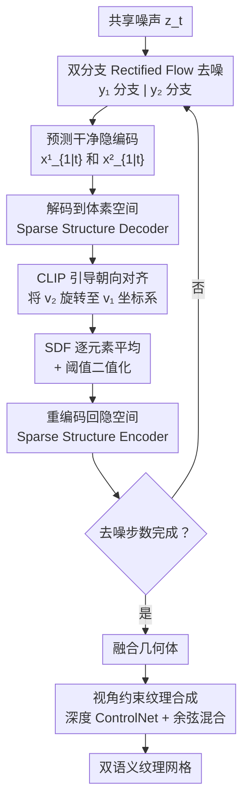

# JanusMesh: Fast and Zero-Shot 3D Visual Illusion Generation via Cross-Space Denoising

**会议**: ECCV2026  
**arXiv**: [2606.20563](https://arxiv.org/abs/2606.20563)  
**项目页面**: https://siang1105.github.io/JanusMesh.github.io/  
**代码**: 暂无  
**领域**: 3D视觉  
**关键词**: 3D视觉幻觉, 零样本生成, 跨空间去噪, SDF融合, 视角约束纹理

## 一句话总结
JanusMesh 提出一个零样本两阶段框架，利用 TRELLIS 结构化 3D 隐空间的双分支去噪与 SDF 融合生成多语义几何体，再通过视角约束的纹理合成赋予各视角对应的外观，在 3–5 分钟内即可生成高质量 3D 视觉幻觉网格。

## 研究背景与动机

3D 视觉幻觉——单个 3D 物体在不同视角下呈现截然不同的语义（如从正面看是孔雀、从背面看是菠萝）——是一个既迷人又极具挑战的问题。近年来扩散模型让 2D 视觉幻象（如 Visual Anagrams）成为可能，但将其拓展到真正的 3D 网格时，现有方法面临严重瓶颈：基于 SDS 的优化方法（如 Shape from Semantics）需要对每个形状做 40 分钟级别的逐形状优化，且生成结果存在严重的颜色过饱和；而朴素的"直接拼接"方法（分别生成两个物体再从中间切开缝合）则在接缝处暴露出明显的几何不连续和背面语义泄漏，破坏幻觉的整体感。

这种困境的核心矛盾在于：3D 视觉幻觉需要一个几何上无缝、语义上视角分离的单一网格，但现有的思路要么在优化空间里缓慢搜索（SDS 路线），要么在空间拼接时无法处理几何的连续性问题。现有前馈式 3D 生成模型（如 TRELLIS）能快速生成高质量单语义网格，但直接在隐空间中插值两个物体的隐编码会破坏 3D 结构的空间有效性，因为隐空间不具备几何层面的可加性。这使得如何在训练好的生成模型上做零样本、高效率的多语义融合成了一个开放问题。

本文的核心 insight 是：与其在隐空间里硬做融合，不如在每个去噪步将隐编码解码回体素空间做几何操作（SDF 平均、二值化），再重新编码回去继续去噪——这样既利用了前馈模型的快速生成能力，又在体素空间保持了几何层面的连续性和可解释性。**核心 idea：提出跨空间双分支去噪管线，在 TRELLIS 的去噪过程中逐步骤将两个提示对应的干净隐编码解码到体素空间，经 CLIP 引导朝向对齐后通过有符号距离场（SDF）逐元素平均完成几何融合，再重编码回隐空间继续去噪，最终获得单一无缝几何体；第二阶段用视角约束的纹理合成为该几何体赋予两套语义对应的外观。**

## 方法详解

### 整体框架

JanusMesh 的管线分为两阶段。给定两个文本提示 $y_1, y_2$ 和目标视角 $\theta_1, \theta_2$，第一阶段基于 TRELLIS 的 Rectified Flow 模型执行双分支去噪：两分支从相同的初始噪声 $z_t$ 出发，分别以 $y_1$ 和 $y_2$ 为条件独立预测当前步的干净隐编码。在每个去噪步，两个预测的干净隐编码通过 Sparse Structure Decoder 解码为体素表示，经由 CLIP 引导的朝向搜索对齐到统一坐标系后，转化为有符号距离场做逐元素平均，再通过阈值二值化得到融合体素，最后用 Sparse Structure Encoder 重编码回隐空间作为下一步的输入。该循环持续到所有去噪步完成，输出一个融合几何体。第二阶段将融合几何体从目标视角渲染为深度图，用深度条件 ControlNet（Stable Diffusion）分别预测两个视角的纹理，再通过余弦权重混合反投影到 3D 表面，得到双语义纹理网格。

### 关键设计

**1. 跨空间逐步骤去噪融合：在几何空间做隐空间做不了的事**

直接对两个 3D 隐编码做平均或插值会产生语义混叠和无意义的几何结构，因为隐空间不具备空间可加性。本文借鉴 LookingGlass 的思路，在每个去噪步将 Rectified Flow 预测的干净隐编码 $\hat{x}^1_{1|t}$ 和 $\hat{x}^2_{1|t}$ 通过 Sparse Structure Decoder 解码到体素空间 $v_1$ 和 $v_2$，将 $v_2$ 旋转至 $v_1$ 的坐标系后，将两个二值占据网格分别转换为有符号距离场，做逐元素平均并阈值二值化：

$$
\text{SDF}_{\text{blend}} = \frac{\text{SDF}(v_1) + \text{SDF}(v_2)}{2}, \quad \hat{x}_{1|t} = [\text{SDF}_{\text{blend}} < \tau]
$$

这一操作的关键在于：SDF 的零等值面自然地对应了两个几何体的中间形状，等值面的渐变特性保证了融合边界的光滑过渡。融合后的体素再通过 Sparse Structure Encoder 重编码，分别生成两个分支下一步的输入隐编码 $\hat{z}^1_{1|t}$ 和 $\hat{z}^2_{1|t}$。这种"解码→体素操作→编码"的跨空间策略使得零样本的多语义几何融合成为可能，且每个去噪步都做一次修正，避免了误差累积。

**2. CLIP 引导的自适应朝向对齐：让不相关物体的轮廓也能自然融合**

多视角幻觉方法通常假设固定视角（如 $0^\circ$ 和 $180^\circ$），但不同物体在标准姿态下的朝向差异很大。如果直接将一只横向伸展的犀牛和一棵竖向生长的菠萝在默认角度融合，SDF 平均的结果就是一团语义混乱的几何体。本文提出先用 TRELLIS 独立生成两个单语义体素 $\hat{v}_1$ 和 $\hat{v}_2$，然后执行两步 CLIP 搜索：第一步，对物体 1 在 Z 轴以 $90^\circ$ 为间隔渲染 4 个候选视图，选取 CLIP 图文相似度最高的视图作为锚点视图 $I_1$；第二步，对物体 2 在 XYZ 三轴上以 $90^\circ$ 间隔采样 28 种旋转组合，选取与 $I_1$ 的 CLIP 图图相似度最高的旋转角作为融合朝向 $\theta_2^*$。该机制仅需约 2 分钟额外时间，但对轮廓不匹配的物体对效果显著。

**3. 噪声引导策略：为几何冲突对提供先验约束**

纯随机噪声作为双分支去噪的起点缺少空间结构约束，对于几何差异大的物体对（如"竹子"与"葡萄"），融合过程中容易产生几何干扰和收敛困难。本文提出两种可选的引导策略。噪声混合引导（Noise Blending Guidance）预先独立生成 $\hat{v}_1$ 和 $\hat{v}_2$，各取一半拼接为引导体素 $v_{\text{guide}}$，编码为引导隐编码后与纯噪声加权混合作为起始去噪隐编码：

$$
z_{\text{init}} = \alpha \cdot \text{Encoder}(v_{\text{guide}}) + (1-\alpha) \cdot z_{\text{noise}}
$$

空间控制引导（Space Control Guidance）进一步在去噪时间步 $t_0$ 处进行插值，使得前 $t_0$ 步在强约束下融合、后续步自由生成。对于轮廓兼容的物体对，两者皆非必需；对于差异大的物体对，空间控制引导效果最佳；而对于轮廓相似但语义不同的物体对，温和的噪声混合引导已足够。

**4. 视角约束纹理合成：赋予融合几何体各视角的专属外观**

第一阶段产生的融合几何体包含非自然的几何混叠，直接用 TRELLIS 做纹理化会产生语义混淆的纹理——两个视角看到的都是两个语义的混合。因此本文将纹理化独立为第二阶段，使用深度条件 ControlNet（以 Stable Diffusion 为骨干）进行视角感知的纹理预测。在每个去噪步，从目标视角 $\theta_1$ 和 $\theta_2$ 渲染网格的深度图，ControlNet 根据各自的文本提示预测对应视角的干净图像 $\hat{x}_{1|t}$，再反投影到 3D 表面。最后通过 Mesh Texture Aggregation 以表面法向的余弦权重混合各视角的纹理贡献，保证接缝处的自然过渡。视角选择使用硬边界（以 $0^\circ$ 为例，$270^\circ$–$90^\circ$ 取 $y_1$ 纹理，其余取 $y_2$ 纹理），但由于余弦权重混合的平滑作用，实际接缝肉眼不可见。

### 损失函数 / 训练策略

本文方法无需训练（zero-shot / training-free）。第一阶段使用 TRELLIS 的 Rectified Flow 模型，第二阶段使用预训练的 Stable Diffusion + ControlNet，均不进行微调。第一阶段采用 Interval CFG（在 $t \in [0.5, 0.95]$ 内施加引导尺度 $\omega=7.5$）避免极端噪声水平下的过饱和。第一阶段 25 步去噪，第二阶段 30 步去噪，总计 3–5 分钟完成。

## 实验关键数据

### 主实验

在 50 个随机采样的提示对上的定量结果（来自 60 个不同物体，5 个类别）：

| 指标 | Shape from Semantics | Direct Concat | TRELLIS | DreamBeast | JanusMesh |
|------|---------------------|---------------|---------|-----------|-----------|
| CLIP Similarity ↑ | 27.46 | 29.03 | 22.18 | 22.99 | **28.17** |
| CLIP (opposite) ↓ | 19.72 | 20.38 | 22.68 | 22.89 | **19.26** |
| GPT Accuracy (%) ↑ | 70 | 76 | 60 | 65 | **84** |
| FID ↓ | 194.14 | 187.89 | 174.13 | 184.96 | 185.56 |
| KID ↓ | 0.051 | 0.067 | **0.044** | 0.094 | 0.051 |
| 目标检测平均计数 (→1) | 0.64 | 2.1 | 0.58 | 0.76 | **0.86** |
| 多物体率 (%) ↓ | 2 | 56 | 8 | 18 | 18 |
| Impact Factor (→1) | 0.973 | 1.129 | 0.952 | 0.974 | **0.994** |
| 生成时间 | ~40 min | ~3–5 min | ~2–3 min | ~3–4 hr | **~3–5 min** |

JanusMesh 在 GPT 准确率（84%）、跨视角语义泄漏抑制（CLIP opposite 19.26）、几何无缝性（Impact Factor 0.994）和生成效率（3–5 分钟）上全面领先。Direct Concatenation 的 CLIP 分数最高但这是系统性伪像——它通过朴素拼接保留了各视角的原始外观，但几何不连续和语义泄漏严重（多物体率 56%）。

### 消融实验

**几何融合策略消融**（"马车"/"圣代"对）：

| 配置 | 关键观察 |
|------|---------|
| Union（逻辑或） | 产生冲突的接合部 |
| Blur Avg（模糊后平均） | 丢失精细几何细节 |
| Minkowski 融合 | 膨胀几何体体积 |
| Polar Coord 融合 | 对非对称物体失效 |
| SDF 平均（本文） | **最优**，等值面自然对应中间形状 |

**噪声引导策略消融**：

| 配置 | 适用场景 |
|------|---------|
| 无引导 | 轮廓兼容的物体对即可 |
| Noise Blending | 轮廓相似但语义不同的物体对最佳 |
| Space Control | 几何差异大的物体对最佳（$t_0=10$） |

**视角约束纹理消融**：去掉第二阶段后，TRELLIS 无法正确处理融合几何体，两视角纹理均呈现语义混淆。

### 关键发现

- **GPT 准确率是本文最关键的超越指标**：JanusMesh 达 84%，远超 Direct Concat（76%）和 Shape from Semantics（70%），说明人眼和自动评估均能清晰分辨各视角的目标语义。
- **目标检测指标揭示几何融合质量**：Direct Concat 的多物体率高达 56%（检测器认为缝合体是两个独立物体），而 JanusMesh 降至 18%（与 DreamBeast 相同），验证了 SDF 融合的几何无缝性。
- **CLIP 引导朝向搜索对不兼容物体对至关重要**：用户研究中 91% 的参与者认为自适应旋转比固定 $0^\circ/180^\circ$ 产生更自然的幻觉效果。
- **三种配置灵活选择**：Case 1/2（固定角度 + 可选噪声引导）可在约 3 分钟完成，Case 3（CLIP 搜索）需约 5 分钟。

## 亮点与洞察

- **跨空间去噪策略巧妙且优雅**：在去噪过程中反复"解码→体素操作→编码"的模式是解决隐空间不可加性的通用范式，不仅限于视觉幻觉——任何需要在 3D 生成中融入空间约束的场景（如多物体组合、部件编辑）都可以借鉴。
- **SDF 平均作为几何融合算子是极佳的设计选择**：相比 Occupancy 直接平均（产生空洞）、Blur（丢失细节）、Minkowski（膨胀），SDF 的零等值面自动对应中间形状，梯度语义保持自然过渡，在可微和离散场景下都有解释性。
- **扩散模型先验的灵活复用**：本文没有任何可训练参数，纯粹通过编排预训练模型的执行流程（TRELLIS 几何 + ControlNet 纹理）就完成了一个全新任务——这体现了一种"零样本编排"的设计哲学。
- **噪声引导策略可类比于条件初始化的通用技巧**：无论是 Noise Blending 的加权混合还是 Space Control 的时间步插值，本质上都是在初始状态注入先验——这一思路可以迁移到各种多分支融合生成场景。

## 局限与展望

- **继承 TRELLIS 的失败案例**：对于某些特定物体类别（如猪、蝙蝠），TRELLIS 本身的生成质量不佳，JanusMesh 无法绕过。
- **三物体幻觉的朝向对齐尚未自动化**：目前三物体版本固定使用 $0^\circ/120^\circ/240^\circ$，因为 CLIP 搜索在三个轮廓平均后会退化为模糊指向，无法有效对齐。如何为三物体场景设计自动朝向搜索仍是一个开放问题。
- **CLIP 搜索精度受限于角度采样粒度**：当前以 $90^\circ$ 为间隔采样（28 种组合），更密的 $45^\circ$ 采样能进一步提高对齐精度但会线性增加搜索时间。
- **纹理阶段的硬视角边界**：虽然余弦权重混合掩盖了切换边界，但理论上基于视角的硬分类可能在极端的视角过渡区产生纹理跳跃——基于注意力权重或几何距离的软切换可能更鲁棒。

## 相关工作与启发

- **vs Visual Anagrams / SyncTweedies**: 2D 方法通过平均不同变换后的噪声预测实现多视角幻觉；JanusMesh 将其从 2D 像素推广到 3D 体素，用 SDF 平均替代噪声平均。
- **vs Shape from Semantics**: 使用 SDS 优化隐空间，单形状 40 分钟且过饱和严重；JanusMesh 通过前馈 + 跨空间去噪将时间降至 3–5 分钟且质量更高。
- **vs Direct Concatenation**: 朴素拼接虽快但几何不连续和语义泄漏严重；SDF 融合从根本上解决了接缝问题。
- **vs SpaceControl**: 本文的 Space Control Guidance 借鉴了 SpaceControl 的起始时间步控制思想，但将其适配到双语义融合场景。
- **vs LookingGlass**: 同样使用"解码→操作→编码"的跨空间策略，但 LookingGlass 用于 2D 到 3D 的变形，JanusMesh 将其拓展为双分支去噪融合。

## 评分

- **新颖性**: ⭐⭐⭐⭐⭐ 首次将跨空间去噪策略用于 3D 视觉幻觉，双分支 SDF 融合 + CLIP 朝向搜索 + 视角约束纹理的编排极有创意。
- **实验充分度**: ⭐⭐⭐⭐⭐ 设计了 6 个定量指标（含自创的 Impact Factor、目标检测分数）、用户研究（50 人）、完整的消融实验（融合策略 ×4、噪声引导 ×3、纹理和朝向搜索各 ×2），覆盖全面。
- **写作质量**: ⭐⭐⭐⭐⭐ 行文流畅，方法部分图文对照清晰，公式有节制地放在真正必要的位置，消融逻辑链完整。
- **价值**: ⭐⭐⭐⭐⭐ 零样本、3–5 分钟、无需训练即可生成高质量 3D 视觉幻觉，在创意内容生成和 3D 设计领域有直接应用价值。

<!-- RELATED:START -->

## 相关论文

- [\[CVPR 2026\] Fast-FoundationStereo: Real-Time Zero-Shot Stereo Matching](../../CVPR2026/3d_vision/fast-foundationstereo_real-time_zero-shot_stereo_matching.md)
- [\[ECCV 2026\] Zero-Shot Depth from Defocus: 从对焦堆栈零样本估计度量深度](zero-shot_depth_from_defocus.md)
- [\[ICLR 2026\] pySpatial: Generating 3D Visual Programs for Zero-Shot Spatial Reasoning](../../ICLR2026/3d_vision/pyspatial_generating_3d_visual_programs_for_zero-shot_spatial_reasoning.md)
- [\[NeurIPS 2025\] 3D Visual Illusion Depth Estimation](../../NeurIPS2025/3d_vision/3d_visual_illusion_depth_estimation.md)
- [\[ECCV 2026\] Agentic Collaborative Cognition for Zero-Shot 3D Understanding](agentic_collaborative_cognition_for_zero-shot_3d_understanding.md)

<!-- RELATED:END -->
