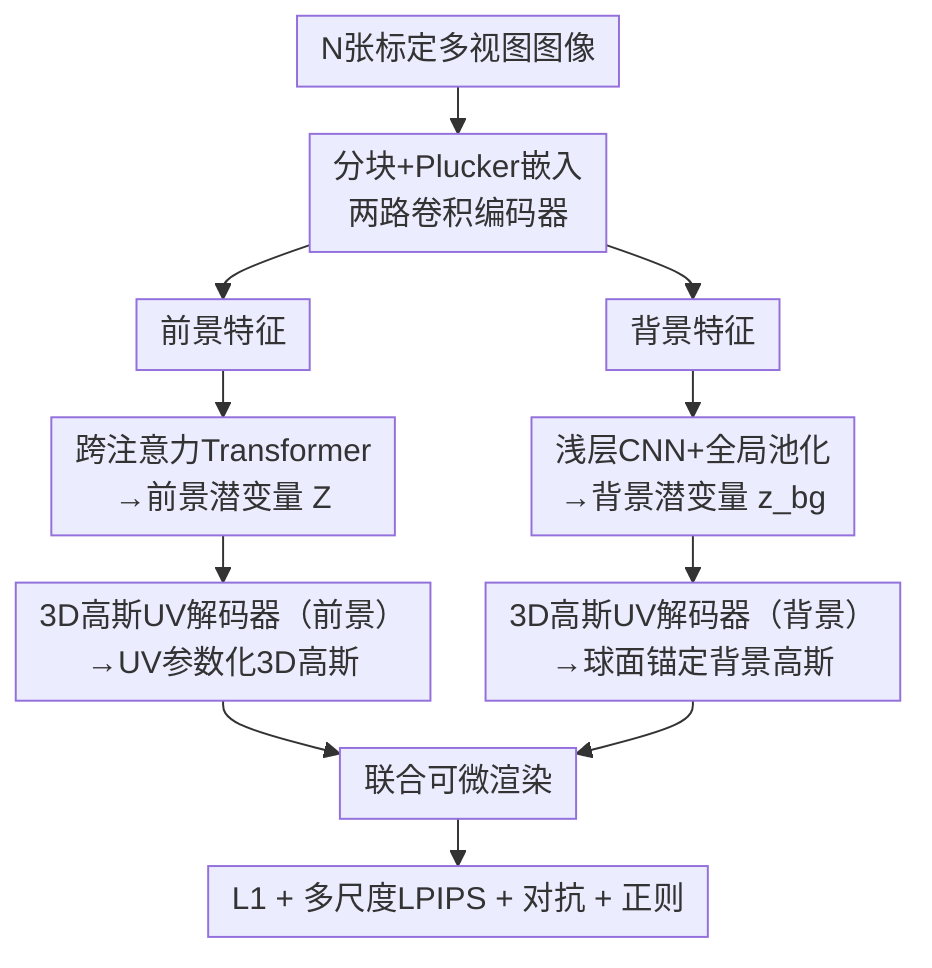

# Large-Scale High-Quality 3D Gaussian Head Reconstruction from Multi-View Captures

**会议**: ECCV 2026  
**arXiv**: [2605.04035](https://arxiv.org/abs/2605.04035)  
**项目**: [https://apple.github.io/ml-headsup/](https://apple.github.io/ml-headsup/)  
**代码**: 无  
**领域**: 3D视觉  
**关键词**: 3D高斯泼溅, 头部重建, 多视图, UV参数化, 前馈网络

## 一句话总结
HeadsUp 提出一种可扩展的前馈式方法，将多相机捕捉的多视图图像通过跨注意力 Transformer 压缩为紧凑 2D 潜变量，再解码到锚定于中性头部模板的 UV 参数化 3D 高斯上，从而将输出高斯数量与输入图像分辨率和视角数解耦，在 10,000+ 人的内部数据集上达到 SOTA 重建质量，且无需测试时优化。

## 研究背景与动机
高保真 3D 头部资产是逼真数字人的基础，在远程呈现、演员数字化和内容创作等近景渲染场景中至关重要。多相机捕捉系统已成为获取头部密集标定图像的标准手段，但如何可靠且高效地将这些精细捕捉转换为紧凑的 3D 重建仍是一个难题。

现有方案在重建保真度与吞吐量之间存在根本性张力。一端是逐实例优化方法（如基于 NeRF 或 3DGS 的逐受试者拟合），它们能实现高质量的视角一致性渲染，但计算成本使大规模部署不现实。另一端是前馈式重建方法（如 Avat3r、pixelSplat、MVSplat），它们将计算摊销到数据集上实现快速推理，但计算和显存成本通常随输入视角数量和分辨率线性增长——这阻碍了对密集高分辨率捕捉设置的充分利用。此外，还有一类工作（如 GAGAvatar、ROME、Real3DPortrait）面向可驱动化身，在规范模型空间中预测几何和外观，虽然支持时序一致性和控制，但往往牺牲了高保真渲染所需的表示容量。

这三种路线的共同局限指向一个明确需求：能否有一种方法既充分利用多相机设备（多视角、高分辨率、海量身份），又产出紧凑的、适合逼真渲染的头部资产？**核心 idea**：用锚定于中性头部模板的 UV 参数化 3D 高斯作为统一表示，将输出与输入分辨率/视角数解耦，结合跨注意力 Transformer 压缩多视图信息，配合显式背景建模和两阶段训练策略，实现大规模、高保真、纯前馈的头部重建。

## 方法详解

### 整体框架
HeadsUp 的输入是 N 张已标定的时间同步多视图图像，输出是一组 UV 参数化的 3D 高斯，分别建模前景（头部）和背景（捕捉设备环境）。整体 pipeline 分四个阶段：图像分块与特征提取、多视图编码、高斯 UV 解码、可微渲染与端到端监督。

输入图像首先被分块（7x7 patch），拼接 Plucker 射线嵌入以显式编码相机几何信息。两路并行的卷积编码器将每张视图解耦为前景特征和背景特征。前景特征送入跨注意力 Transformer，将一组可学习的 2D query token 映射为紧凑的 2D 潜变量 Z（64x64, 512 维），通过交叉注意力聚合来自任意数量输入视图的信息。背景特征则经浅层卷积网络和全局平均池化压缩为紧凑的背景潜变量 z_bg。两个潜变量分别送入独立的高斯 UV 解码器，生成锚定于模板网格（前景为中性头部模板，背景为球面模板）的高斯属性 UV 图。最后通过 3DGS 可微渲染器从任意新视角渲染，与真值图像对比计算损失。

### 关键设计

**1. UV参数化3D高斯表示：将输出高斯数量与输入分辨率/视角数解耦**

传统像素对齐方法（如 Avat3r、FastGHA）为每个输入像素预测一个高斯，导致高斯数量与输入图像分辨率、视角数线性相关，在密集多视角高分辨率设定下显存爆炸。HeadsUp 的核心创新是将 3D 高斯锚定于一个所有身份共享的中性头部模板，在 UV 空间（256x256 分辨率）上预测高斯属性——每个 UV 坐标对应一个高斯，共约 65K 个前景高斯。中性模板定义在规范坐标系中（原点在瞳孔中点，方向对齐法兰克福平面），每个高斯的 3D 位置由模板顶点位置加上一个限幅偏移（tanh 缩放到 200mm）得到：

$$\boldsymbol{\mu}_{u,v} = \mathbf{V}(u,v) + \mathbf{U}^{(\mu)}(u,v), \quad \|\mathbf{U}^{(\mu)}(u,v)\| \leq \delta_{\max}$$

其他属性通过相应激活函数从 UV 特征图解码：尺度用指数激活 $\mathbf{s}_{u,v} = \exp(\mathbf{U}^{(s)}(u,v))$，旋转用 L2 归一化 $\mathbf{q}_{u,v} = \text{normalize}(\mathbf{U}^{(q)}(u,v))$，不透明度用 sigmoid $\alpha_{u,v} = \sigma(\mathbf{U}^{(\alpha)}(u,v))$，球谐颜色系数（L=1）直接输出。这种 UV 表示有三大优势：(1) 共享几何先验——规范网格拓扑为所有受试者和表情提供一致的空间结构，网络只需关注外观和局部变化；(2) 高效多视图聚合——输出高斯数量固定，与输入无关，可处理任意多的高分辨率视图；(3) 对跟踪误差鲁棒——仅需刚性头部姿态跟踪，不依赖脆弱且易出错的表情跟踪。

**2. 跨注意力Transformer多视图编码器：将任意数量视角压缩为紧凑2D潜变量**

多视图信息聚合是前馈重建的核心挑战。HeadsUp 采用一个 8 层、8 头、隐维度 512 的跨注意力 Transformer，将 N 个视角的前景特征（展平为 key-value token）聚合到一组可学习的 2D query token（64x64 网格，512 维）上，输出同等分辨率的 2D 潜变量 Z。关键设计在于 query token 的数量和分辨率是固定的（4096 个），不随输入视角数增长——每增加一个视角只是增加 key-value token，交叉注意力的计算复杂度与 query 数成平方关系而非 key-value 数，因此视角数增长带来的计算开销可控。

输入图像的 patch embedding 先与 6 维 Plucker 射线嵌入沿通道拼接，显式注入每像素的相机射线几何信息。拼接后的特征经一个卷积网络（1 次下采样 + 4 个 bottleneck 残差块，输出 512 通道）提取为前景特征图。Transformer 的 query 网格提供了固定的空间结构，后续解码器可直接 reshape 为 UV 图，而交叉注意力机制则负责从任意数量视角中聚合信息。消融实验表明，Transformer 从 2 层增至 8 层时 PSNR 持续提升（28.24→28.89 dB），超过 8 层后饱和。潜变量分辨率从 16x16 增至 128x128 时 PSNR 从 27.59 升至 29.66 dB，是模型容量最关键的因素。

**3. 显式背景建模：消除前景抠图依赖，恢复头发等高频边界细节**

多视图头部重建中，前景抠图（matting）是常见预处理步骤——先分割出前景，仅对前景区域重建。但抠图在处理头发丝、耳环等半透明或精细边界结构时不可避免产生误差，这些误差会直接传导给重建模型，导致边界模糊或伪影。HeadsUp 引入一个轻量的专用背景模型来避免这一问题：两路编码器中，背景支路使用较浅的卷积网络（两次下采样，通道数 128→64）提取每视图背景特征，经多视图全局平均池化和两层 MLP 压缩为紧凑的 1D 潜变量 z_bg（32 通道瓶颈），再由一个 7 阶段逐步上采样的残差网络解码为锚定于捕获设备球面模板的约 262K 个背景高斯（位置偏移限幅 10mm，比前景的 200mm 紧得多，因为背景是静止的）。

训练时，前景和背景高斯在规范坐标系中联合渲染，与未做抠图的原始真值图像计算损失。背景模型自动学会建模捕捉设备环境（如灯具、支架），无需任何背景真值监督。推理时丢弃背景支路，仅使用前景高斯。消融实验证实，去掉背景模型后，半透明区域和精细前景元素（如头发丝变色）出现明显退化。该设计的巧妙之处在于用极低成本（背景编码器远小于前景编码器）绕过了像素级抠图这一长期困扰多视图重建的预处理瓶颈。

**4. 两阶段训练与区域感知损失：低分辨率预训练+高分辨率微调+眼嘴区域专项监督**

直接在 1000x750 原生分辨率上端到端训练 Transformer 计算代价极高（注意力与 token 数平方相关）。HeadsUp 采用两阶段策略：第一阶段在 2x 下采样图像（500x375）上训练 900K 步（batch 64），让模型学习粗粒度的几何和外观；第二阶段在原生分辨率（1000x750）上微调 200K 步（batch 32），释放模型对高频细节的建模能力。

第二阶段引入两个关键修改。**区域特定损失**：利用头部规范坐标系提取眼睛和嘴巴周围的图像裁剪区域，对这些区域额外施加多尺度 LPIPS 感知损失——因为人眼对这些面部核心区域的感知最为敏感。消融显示，去掉眼部损失使眼部裁剪 PSNR 下降 1.56 dB，去掉嘴部损失使嘴部裁剪 PSNR 下降 1.97 dB。**多分辨率损失策略**：作者观察到在原生分辨率上直接施加全局感知损失（LPIPS）和判别器损失会导致训练不稳定（可能源于高频梯度的噪声），因此改为在 2x 下采样输出上计算全局 LPIPS 和对抗损失，仅对裁剪区域使用原生分辨率。去掉这个半分辨率损失后整体 PSNR 暴跌 3.55 dB，验证了其作为粗到细梯度信号稳定器的关键作用。

### 一个完整示例：从 10 张多视角图像到可渲染 3D 头部

以 Internal10K 数据集的一个典型推理场景为例。输入为 10 张 1000x750 的标定多视图图像，覆盖受试者面部的前方、侧面和斜侧角度。每张图像首先被分块为 7x7 的 patch（图像先缩放到兼容 patch 大小的尺寸），生成 256 维的 patch embedding，与 6 维 Plucker 嵌入拼接后得到 262 维的逐 patch 特征。前景卷积编码器将这些特征处理为 512 通道的特征图（空间分辨率约 143x107→经下采样后为约 72x54）。10 张视图的特征展平后共约 38,880 个 key-value token，送入 8 层跨注意力 Transformer，与 4096 个（64x64）可学习的 query token 进行交叉注意力聚合，输出 64x64x512 的潜变量 Z。同时背景编码器将 10 张视图的背景特征（256 通道）经全局平均池化压缩为 z_bg（32 维）。

潜变量 Z 经前景解码器（两次 2x 最近邻上采样，通道数 512→256）升采样至 256x256 分辨率，最终 3x3 卷积投影为 23 通道的 UV 特征图（位置偏移 3 + 尺度 3 + 旋转 4 + 不透明度 1 + SH 系数 12）——共 65,536 个前景高斯。背景潜变量经 7 阶段上采样解码为 512x512 UV 图，约 262K 个背景高斯。两套高斯在规范坐标系中合并，对任意指定相机姿态做可微光栅化渲染，输出合成图像。整个过程在单张 A100 上仅需 0.33 秒（16 视图），比 Avat3r 的 10.8 秒（6 视图）快 30 倍以上。

### 损失函数 / 训练策略

总损失由重建项和正则项组成：

$$\mathcal{L}_{\mathrm{total}} = \lambda_{\mathrm{L1}}\mathcal{L}_{\mathrm{L1}} + \lambda_{\mathrm{LPIPS}}\mathcal{L}_{\mathrm{LPIPS}} + \lambda_{\mathrm{adv}}\mathcal{L}_{\mathrm{adv}} + \lambda_{\mathrm{pos}}\mathcal{L}_{\mathrm{pos}} + \lambda_{\mathrm{mask}}\mathcal{L}_{\mathrm{mask}} + \lambda_{\mathrm{TV}}\mathcal{L}_{\mathrm{TV}}$$

其中 $\lambda_{\mathrm{L1}}=1.0$，$\lambda_{\mathrm{LPIPS}}=0.1$，$\lambda_{\mathrm{adv}}=0.25$，$\lambda_{\mathrm{TV}}=10.0$。$\mathcal{L}_{\mathrm{L1}}$ 为逐像素 L1 光度损失。$\mathcal{L}_{\mathrm{LPIPS}}$ 为三尺度（原始分辨率、2x 下采样、4x 下采样）AlexNet-LPIPS 感知损失之和。$\mathcal{L}_{\mathrm{adv}}$ 为基于感知判别器（在随机 256x256 裁剪上操作）的对抗损失，仅在训练 240K 步后激活以保证稳定性。

正则项方面：$\mathcal{L}_{\mathrm{pos}}$ 在预热阶段约束高斯位置靠近表情跟踪网格上的对应 3D 点（通过 UV 坐标的重心插值），权重从 1.0 线性衰减至 0.01（100K 步）；$\mathcal{L}_{\mathrm{mask}}$ 最小化渲染前景 alpha 图与真值分割掩码的差异，权重从 2.0 衰减至 0.1（100K 步）；$\mathcal{L}_{\mathrm{TV}}$ 施加在渲染的 UV 空间颜色上，鼓励空间平滑并防止表面孔洞。

优化使用 Adam（lr=2e-4，bfloat16 混合精度），不透明度和尺度在前 1000 步从梯度图中分离进行预热。第一阶段在 16 张 H100 上训练约 10 天，第二阶段约 2 天。Ava-256 微调不到 1 天。

## 实验关键数据

### 主实验

| 数据集 | 方法 | #视角 | #高斯 | PSNR↑ | SSIM↑ | LPIPS↓ | AKD↓ | CSIM↑ |
|--------|------|-------|-------|-------|-------|--------|------|------|
| Internal10K | Avat3r | 4 | 0.8M | 24.10 | 0.830 | 0.371 | 12.78 | 0.738 |
| Internal10K | Avat3r | 6 | 1.1M | 24.37 | 0.831 | 0.362 | 12.99 | 0.787 |
| Internal10K | **HeadsUp** | 10 | **65K** | **29.25** | 0.821 | **0.117** | **10.39** | **0.922** |
| Ava-256 | Avat3r | 4 | 0.8M | 21.54 | 0.788 | 0.370 | 6.39 | 0.698 |
| Ava-256 | Avat3r | 6 | 1.1M | 22.31 | 0.795 | 0.359 | 6.10 | 0.775 |
| Ava-256 | **HeadsUp** | 4 | 65K | 23.64 | 0.805 | 0.178 | 5.09 | 0.833 |
| Ava-256 | **HeadsUp** | 6 | 65K | 24.62 | 0.815 | 0.161 | 4.70 | 0.873 |
| Ava-256 | **HeadsUp** | 16 | 65K | **26.13** | **0.831** | **0.110** | **4.27** | **0.914** |

HeadsUp 在所有指标上大幅领先 Avat3r，尤其在 LPIPS（感知相似度）和 CSIM（身份保持）上的差距最为显著，同时高斯数量仅为 Avat3r 的 1/12-1/17。值得注意的是 Avat3r 受限于显存在 6 视角时即达瓶颈，而 HeadsUp 可轻松扩展至 16 视角以上。

Inference speed comparison (single A100):

| 方法 | 4视角耗时(s) | 6视角耗时(s) | 16视角耗时(s) | 4视角FPS | 6视角FPS | 16视角FPS |
|------|-------------|-------------|--------------|----------|----------|----------|
| Avat3r | 5.6 | 10.8 | OOM | 0.18 | 0.09 | OOM |
| **HeadsUp** | **0.14** | **0.20** | **0.33** | **7.14** | **4.94** | **2.93** |

### 消融实验

| 消融维度 | 配置 | PSNR↑ | LPIPS↓ | AKD↓ |
|---------|------|-------|--------|------|
| 训练身份数 | 250 subjects | 22.19 | 0.267 | 6.27 |
| | 1K subjects | 25.92 | 0.164 | 3.97 |
| | 4K subjects | 28.46 | 0.103 | 3.23 |
| | **10K subjects** | **28.89** | **0.096** | 3.20 |
| 输入视角数 | 1 view | 22.98 | 0.208 | 5.08 |
| | 4 views | 26.51 | 0.135 | 3.91 |
| | 8 views | 28.26 | 0.105 | **3.35** |
| | **16 views** | **29.03** | **0.096** | 3.36 |
| 模板类型 | 表情跟踪网格 | 26.77 | 0.184 | 4.01 |
| | **固定中性网格** | **28.89** | **0.096** | **3.20** |
| 潜变量/Gaussian UV分辨率 | 16/256 | 27.59 | 0.121 | 3.59 |
| | 32/256 | 28.89 | 0.096 | 3.20 |
| | 64/256 | 29.21 | 0.089 | **3.00** |
| | **128/512** | **29.66** | **0.083** | 3.04 |
| 监督视角数 | 1 target view | 28.89 | 0.096 | 3.20 |
| | **8 target views** | **29.54** | **0.093** | **2.97** |
| Transformer块数 | 2 blocks | 28.24 | 0.102 | 3.40 |
| | **8 blocks** | **28.89** | **0.096** | **3.20** |
| | 12 blocks | 28.89 | 0.096 | 3.36 |

| 高分辨率微调消融 | Full Image PSNR↑ | Eye Crop PSNR↑ | Mouth Crop PSNR↑ |
|------------------|------------------|----------------|------------------|
| **Full Model** | **28.35** | **31.94** | 32.14 |
| w/o Eye Loss | 28.33 | 30.38 | **32.27** |
| w/o Mouth Loss | 28.20 | 31.78 | 30.17 |
| w/o HalfRes Loss | 24.80 | 28.26 | 30.54 |

### 关键发现
- **训练身份数是决定性因素**：从 250 人增至 2K 人，PSNR 每翻倍提升 1.7-1.8 dB，呈对数线性缩放；少于 1K 人时模型在分布外人脸上灾难性失败。超过 4K 人后收益递减。
- **模型容量比高斯数量更重要**：将潜变量分辨率从 16x16 翻倍至 128x128，PSNR 提升 2.07 dB；而将高斯 UV 分辨率从 256 翻倍至 512（高斯数翻倍），在同等潜变量分辨率下几乎不带来额外提升。这表明编码器容量才是重建质量的瓶颈而非高斯数量。
- **固定中性模板优于表情跟踪模板**（+2.12 dB PSNR）：表情跟踪网格引入了逐帧噪声顶点位移，中性模板提供了稳定的规范表面，让高斯解码器专注于外观变化。
- **监督视角数越多越好**：从 1 个目标视角增至 8 个，PSNR 提升 0.65 dB，AKD 降低 0.23——多视角监督强制模型生成在多个视角下一致的几何。
- **背景模型对头发等边界细节至关重要**：去掉背景模型后，模型会在头发区域"幻觉"出背景伪影。
- **单目模型已能令人信服地重建**：仅用 1 张正面视图，PSNR 仍有 22.98 dB，展示了方法的鲁棒性和泛化能力。

## 亮点与洞察
- **UV 解耦是最核心的架构洞察**：将输出空间从"像素对齐"切换到"模板 UV 空间"，用固定 65K 高斯表示任意分辨率和视角数的输入——这一设计选择同时解决了显存瓶颈、多视图聚合效率和跟踪误差鲁棒性三个独立问题，实现了一个架构改动多个维度受益的杠杆效应。
- **背景作为辅助任务而非预处理**：传统管线将前景分割作为独立预处理步骤，HeadsUp 将背景建模变为一个辅助解码分支，在训练时与前景联合优化、推理时丢弃——这种"用即可弃"的设计思路在避免抠图误差传导的同时不增加推理负担，可迁移到其他需要前景/背景分离的视觉任务（如物体重建、场景重建）。
- **两阶段训练中的多分辨率损失策略是稳定训练的实用 trick**：在高分辨率阶段对全局损失降采样、仅对关键区域（眼、嘴）使用原生分辨率——本质上是手动控制梯度信号的频率成分，避免高频噪声破坏判别器训练的稳定性。这个 trick 可迁移到任何需要在极高分辨率上做对抗训练的生成/重建任务。
- **对数线性的身份数据缩放律**：PSNR 随训练身份数翻倍稳定提升 1.7-1.8 dB（直到 2K 人），这与 LLM 的 scaling law 在形式上相似，暗示 3D 头部重建的表征学习也遵循某种幂律——对后续工作估算数据需求有实用参考价值。

## 局限与展望
- **依赖标定多相机捕捉设备**：方法专为棚拍环境设计，在自然场景（手机单张照片、野外自拍）上的泛化尚未系统验证。论文仅展示了一个 AI 生成图像的初步单视图重建作为概念验证，承认模型对无约束数据尚不鲁棒。
- **背景模型假设固定设备**：背景支路假设捕捉设备背景不变，不适用于背景动态变化的场景。推理时丢弃背景模型意味着实际部署仍需其他方式处理背景。
- **表情驱动能力有限**：blendshape 驱动动画虽然能在潜变量空间内完成、无需逐身份微调，但论文未系统评估其与专用动画方法（如 GaussianAvatars、GAF）在极端表情和大幅头部转动下的质量对比。
- **10,000 人数据不公开**：模型训练依赖 Apple 内部数据集，外部研究者无法复现完整训练管线。Ava-256 上的微调结果虽可复现，但 Internal10K 的预训练是方法性能的关键基础。
- **计算资源门槛高**：完整训练需 16 张 H100 运行约 12 天，对大多数学术实验室不现实。不过推理端极轻量（单 A100 0.33 秒，MacBook 上 blendshape 动画 65 FPS），实际部署门槛低。

## 相关工作与启发
- **vs Avat3r (ECCV 2024)**：当前前馈头部重建的 SOTA。Avat3r 使用 DUSt3R 位置图和 Sapiens 特征做像素对齐高斯预测，是"模板无关"方案。HeadsUp 的核心区别在于用 UV 参数化解耦了输出与输入、用跨注意力替代了像素对齐，从而摆脱了视角数-显存线性绑定的瓶颈。Avat3r 在 6 视角时即 OOM，HeadsUp 可轻松扩展到 16+ 视角且速度更快。但 Avat3r 不需要模板网格，在非人头部的应用上更灵活。
- **vs FastGHA (CVPR 2026)**：同样做像素对齐高斯预测，依赖 DINOv3 和 SD-VAE 特征。HeadsUp 在 Internal10K 半分辨率上全面领先（PSNR 26.51 vs 22.76，LPIPS 0.135 vs 0.222）。FastGHA 的像素对齐性质同样导致视角数扩展受限。
- **vs GaussianAvatars (CVPR 2024)**：将 3D 高斯绑定到 FLAME 参数化模型实现完全可控头部，但需要逐身份优化（分钟级）。HeadsUp 同样锚定高斯于模板，但用的是固定中性模板（不依赖表情参数）且纯前馈——这二者的区别暗示"固定模板 + 前馈"可能比"参数化模型 + 优化"更适合大规模高质量重建。
- **vs Pippo (CVPR 2025)**：用 DiT 做单图头部生成，质量高但多视图推理需分钟级且不保证严格 3D 一致性。HeadsUp 在速度（0.33 秒 vs 分钟级）和 3D 一致性上有天然优势，但 Pippo 的单图泛化能力更强。

## 评分
- 新颖性: ⭐⭐⭐⭐☆ UV 参数化用于头部 3DGS 本身不是全新概念（LAM、PanoLAM 等也在 UV 空间做），但"用 UV 解耦输入输出 + 跨注意力潜变量 + 显式背景"的组合方案在头部重建中是首创，且解决了一个明确的实际痛点（多视图缩放瓶颈）。
- 实验充分度: ⭐⭐⭐⭐⭐ 10,000 人规模训练、系统 scaling law 分析（身份数/视角数/容量/监督密度/Transformer 层数共 7 个维度的消融）、两个数据集、推理速度对比、下游应用展示（文本生成身份 + blendshape 动画），实验维度全面且结论清晰。
- 写作质量: ⭐⭐⭐⭐⭐ 结构清晰，动机链路完整（从三种路线各自的局限推导出本文需求），方法描述详实，消融实验按维度组织且每个有独立小结，补充材料详尽（完整超参表、架构细节、基线复现细节）。
- 价值: ⭐⭐⭐⭐☆ 对需要大规模棚拍头部重建的工业场景（电影、游戏、远程呈现）有直接实用价值；scaling law 分析对后续工作有参考意义。但方法对棚拍设备和内部数据的依赖限制了学术界的直接跟进。

<!-- RELATED:START -->

## 相关论文

- [\[CVPR 2025\] HRAvatar: High-Quality and Relightable Gaussian Head Avatar](../../CVPR2025/3d_vision/hravatar_high-quality_and_relightable_gaussian_head_avatar.md)
- [\[ECCV 2026\] AnyMatch: Supercharging Universal Multi-Modal Image Matching with Large-Scale Single-View Images](anymatch_supercharging_universal_multi-modal_image_matching_with_large-scale_sin.md)
- [\[ECCV 2026\] Capacity-Controlled Multi-View Stylization of 3D Gaussian Splatting](capacity-controlled_multi-view_stylization_of_3d_gaussian_splatting.md)
- [\[CVPR 2026\] Confidence-Guided Multi-Scale Aggregation for Sparse-View High-Resolution 3D Gaussian Splatting](../../CVPR2026/3d_vision/confidence-guided_multi-scale_aggregation_for_sparse-view_high-resolution_3d_gau.md)
- [\[CVPR 2026\] Skullptor: High Fidelity 3D Head Reconstruction in Seconds with Multi-View Normal Prediction](../../CVPR2026/3d_vision/skullptor_high_fidelity_3d_head_reconstruction_in_seconds_with_multi-view_normal.md)

<!-- RELATED:END -->
