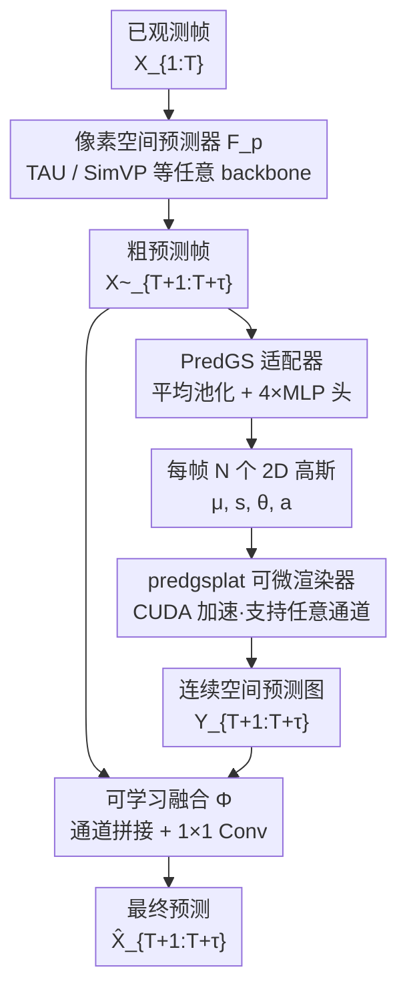

# Learning Video Dynamics with Predictive Differentiable Rendering

**会议**: ECCV2026  
**arXiv**: [2606.31050](https://arxiv.org/abs/2606.31050)  
**代码**: 待确认  
**领域**: 3D视觉  
**关键词**: 视频预测, 可微渲染, 2D高斯泼溅, 连续表示, 即插即用适配器  

## 一句话总结
提出 Predictive Differentiable Rendering（PDR）框架，通过在现有像素空间预测器后附加轻量 PredGS 适配器将粗预测映射为 2D 高斯参数，经 CUDA 加速的可微渲染器生成连续空间预测再与像素预测融合，以极小计算开销显著缓解确定性视频预测的过度平滑问题。

## 研究背景与动机

视频预测——根据已观测帧预测未来帧——是天气预报、交通流建模、人体运动分析等众多实际应用的基础。近年来，基于 ConvLSTM、SimVP、TAU 等架构的确定性预测方法取得了长足进步。然而，几乎所有确定性方法都在离散像素空间操作，并用逐像素均方误差（MSE）作为优化目标。MSE 损失天然鼓励模型在所有可能的未来上取期望值，导致预测结果在长程场景下严重过度平滑：运动边界模糊、纹理细节丢失、帧间一致性退化。这一瓶颈并非架构不够强，而是离散像素空间中 MSE 损失的固有缺陷。

与此同时，3D Gaussian Splatting（3DGS）在场景重建和新视角合成中展现了用少量高斯原语连续表示视觉信息的强大能力。受其启发，2D 高斯表示已被成功用于连续图像表示和超分辨率，但将其引入视频预测这一时序建模任务尚属空白。关键挑战在于：(i) 如何在不对现有预测器做架构改动的前提下引入连续空间建模；(ii) 如何在实时推理要求下高效完成高斯参数到像素的可微渲染；(iii) 连续表示与损失设计如何协同才能发挥最大收益。

本文的核心 idea 是**将确定性视频预测显式拆解为「离散像素空间的粗预测 + 连续 2D 高斯空间的精细渲染」双分支范式（PDR），通过一个即插即用的轻量适配器 PredGS 将粗预测映射为每帧的高斯参数集，经 CUDA 加速的可微渲染器 predgsplat 生成连续空间预测后与像素预测自适应融合，并用 L1+SSIM 替代 MSE 来充分发挥连续表示的潜力。**

## 方法详解

### 整体框架

PDR 的设计思路是：不替换或改造已有的像素空间预测器，而是在其输出端串联一个轻量连续空间分支，形成双域协同预测。给定已观测帧序列 X_{1:T}，像素空间预测器 F_p（如 TAU）首先生成一组粗预测帧 X~_{T+1:T+τ}。然后轻量适配器 PredGS 以粗预测为输入，为每帧预测一组 2D 高斯参数（位置 μ、尺度 s、旋转 θ、幅度 a）。这些参数经 CUDA 加速的可微渲染器 predgsplat 投影回像素网格，得到连续空间预测图 Y_{T+1:T+τ}。最后通过通道拼接加 1×1 卷积的可学习融合函数 Φ 将像素粗预测和连续空间预测融合为最终输出。

### 关键设计

**1. PredGS 适配器：即插即用的离散-连续桥接模块**

像素空间预测器的输出是常规四维张量（B×T×C×H×W），PredGS 首先在其上做空间平均池化降低分辨率以减少后续计算量，然后通过 4 个独立的轻量 MLP 头分别回归每帧 N 个高斯原语的 4 种参数：MLP_μ 输出每个高斯中心在归一化坐标 [-1,1] 上的二维位置、MLP_s 输出各向异性半径、MLP_θ 输出平面旋转角、MLP_a 输出 C 通道的强度向量。各参数按自身物理意义选择激活函数：μ 和 θ 用 tanh 约束范围以保证在 [-1,1] 和 [-π/2,π/2] 内，s 和 a 用 sigmoid 保证非负。MLP 隐层通常仅 64-256 维，整条适配器引入的参数和 FLOPs 可忽略不计。核心巧妙之处在于它不触及 backbone 的任何内部结构，推理时甚至可被关掉退化为纯像素预测器，因此能无缝挂接到 TAU、SimVP、ConvNeXt 等任意架构后面。

**2. predgsplat：面向任意通道的高效可微 2D 高斯渲染器**

将预测出的高斯参数重新投影回像素空间需要一个可微渲染器。现有实现（如 GaussianSR）因反复做仿射变换和低效内存访问速度很慢。predgsplat 做了两项关键优化：第一，取消昂贵的逐高斯仿射变换——事先定义一张归一化基准网格，直接让预测坐标 μ 在该网格上偏移对齐即可，彻底消除了矩阵乘法；第二，设计全向量化 CUDA 内核，在高斯实例和通道两个维度并行光栅化，核心操作为对每个像素位置 p 累加所有高斯的贡献：x(p)=Σᵢ aᵢ·fᵢ(p|μᵢ,Σᵢ)。渲染器支持任意通道数 C（不限于 RGB），这对多变量气象/交通场数据至关重要。两项优化联手让渲染速度比基线快 10 倍，256×256 分辨率下达 1149 FPS，完全满足实时推理需求。

**3. 高斯坐标初始化：稳定训练的空间均匀先验**

直接随机初始化坐标预测 MLP_μ 的权重会导致训练早期梯度被随机噪声主导、收敛不稳。本文系统研究了四种初始化策略：均匀网格采样、Harris 角点采样、最亮像素采样、随机均匀采样。消融实验显示均匀网格初始化效果最稳定——它提供了一个空间均匀的高斯先验分布，让各高斯原语在早期均匀覆盖整个图像平面，后续根据梯度信号各自向需要精细建模的区域移动。训练时无显式初始化仍能收敛且优于 TAU，但网格 init 提供了更快的收敛速度和更低的最终误差。

**4. L1+SSIM 混合损失：连续表示的激活钥匙**

这是全文最反直觉的发现。单独使用连续高斯表示（PDR+L2 损失）不仅不提升，反而比 TAU 基线更差（TaxiBJ 上 MSE 升 9.4%）。单独使用 L1+SSIM 损失（TAU+L1+SSIM）也只有微小改善（MSE 降 0.6%）。但两者组合（PDR+L1+SSIM）产生了惊人的协同效应：TaxiBJ 上 MSE 降 9.7%、KTH 上 LPIPS 降 29.0%。这说明连续高斯表示不是万能药——它需要 L1+SSIM 这种保留高频结构的损失来引导参数空间朝锐利细节方向收敛；反过来 MSE 损失会让连续表示也向均值回归，反而抹平了高斯原语的表达能力。两者必须同时使用才能释放全部潜力。损失形式为 ℒ = λℒ₁ + (1−λ)ℒ_SSIM，λ 统一设为 0.5。

### 损失函数 / 训练策略

整体采用端到端联合训练，像素预测器、PredGS 适配器和可微渲染器一起优化。损失函数为 L1+SSIM 混合损失（λ=0.5），优化器为 AdamW（weight decay 1×10⁻²）。训练轮数与对应 TAU 基线保持一致以公平对比。高斯数量 N 和核大小 K 按数据集配置：低分辨率数据集（TaxiBJ 32×32、WeatherBench 32×32）用 N=300、K=15 和 2× 下采样；高分辨率数据集（KTH 128×128、Human3.6M 256×256）用 N=400、K=51 和 8×/16× 下采样。

## 实验关键数据

### 主实验

| 数据集 | 指标 | TAU（基线） | PDR（本文） | 提升 |
|--------|------|------------|------------|------|
| TaxiBJ (4→4) | MSE↓ | 0.3108 | 0.2807 | -9.7% |
| TaxiBJ (4→4) | MAE↓ | 14.93 | 14.29 | -4.3% |
| WeatherBench T2m (12→12) | MSE↓ | 1.162 | 1.071 | -7.8% |
| WeatherBench T2m (12→12) | MAE↓ | 0.6707 | 0.6353 | -5.3% |
| Human3.6M (4→4) | SSIM↑ | 0.9839 | 0.9857 | +0.2% |
| Human3.6M (4→4) | LPIPS↓ | 0.02783 | 0.02192 | -21.2% |
| KTH (10→20) | SSIM↑ | 0.9086 | 0.9145 | +0.6% |
| KTH (10→20) | LPIPS↓ | 0.22856 | 0.16237 | -29.0% |

### 消融实验

| 配置 | TaxiBJ MSE | KTH LPIPS | 说明 |
|------|-----------|-----------|------|
| TAU+L2+reg（基线） | 0.3108 | 0.22856 | 原始 TAU |
| TAU+L1+SSIM | 0.3088 (-0.6%) | 0.20216 (-11.6%) | 仅换损失，提升有限 |
| PDR+L2+reg | 0.3400 (+9.4%) | 0.21850 (-4.4%) | 连续表示+L2 反而变差 |
| PDR+L1+SSIM | 0.2807 (-9.7%) | 0.16237 (-29.0%) | 连续+正确损失=最大增益 |
| PredGS w/o init | 0.2893 | — | 无 init 仍优于 TAU |
| PredGS w/ grid init | 0.2807 | — | 网格 init 最佳 |
| 融合：Add | 0.2998 | — | 简单加法有限 |
| 融合：Concat+1×1 Conv | 0.2807 | — | 可学习融合最佳 |

### 关键发现

- **损失-表示的协同效应是最核心结论**：连续高斯表示本身不是银弹，必须在 L1+SSIM 损失下才能释放潜力；用 MSE 训练 PDR 反而比纯像素基线更差，这是一个重要的工程洞察。
- PredGS 在 11 种 backbone 上均带来一致提升（WeatherBench 上 MLP-Mixer MSE 降 8.05%、ConvNeXt MAE 降 6.72%），证明适配器无关架构的通用性。
- 与扩散方法对比：在 KTH 64×64 上 PDR 的 SSIM（0.825）超过所有扩散方法、PSNR（26.69）最高，而推理速度是扩散方法的 33-1460 倍。
- 渲染效率极高，256×256 下 1149 FPS，综合优化（base_grid + CUDA）带来最高 16× 加速。
- 分布分析显示 PDR 恢复了 TAU 与 GT 之间 56% 的峰度差距和 57% 的多样性差距，说明连续表示能选择性保留显著运动模式。
- 时序一致性方面 PDR 的 TWE 介于 TAU（过平滑→TWE 过低）与 GT（真实噪声）之间，说明它在恢复锐度时没有引入闪烁伪影。

## 亮点与洞察

- **双域协同范式**：不改造 backbone、不显著增加推理延迟，仅在后端串一个轻量高斯分支就能换来锐度显著提升，这种"插件式"思路可泛化到超分辨率、光流估计等其它像素级预测任务。
- **发现"连续表示 + 正确损失"的负负得正效应**：PDR+L2 差、TAU+L1+SSIM 一般、PDR+L1+SSIM 最优——这个发现对后续在视频预测中使用连续表示的研究有直接指导意义。
- **predgsplat 的坐标偏移技巧**：取消逐高斯仿射变换、直接在归一化网格上加偏移，简单但贡献了 1.3-3.4× 加速，值得其它可微渲染器借鉴。
- **渲染器支持任意通道**：这一设计对多变量气象/交通场等非 RGB 模态至关重要，极大扩展了方法的应用面。
- **与扩散方法的速度对比**（PDR 146 FPS vs ARFree 4.41 FPS）说明确定性预测在实时场景下仍有不可替代的价值，PDR 将确定性预测的感知质量推到了新高度。

## 局限与展望

- 高斯数量 N 和核大小 K 目前是数据集级固定超参，需要人工调节。如果能设计自适应高斯分配机制（如密度引导的动态增减），可能进一步提升泛化性和效率。
- 实验仅在 4 个数据集上进行，缺乏大规模、高分辨率、长时序视频预测 benchmark 的验证（如 Cityscapes、Kinetics-400、VEDAI）。
- PDR 仍是确定性预测，无法像扩散方法那样建模多模态未来分布；在需要多样化的场景（如未来天气采样、行人轨迹预测）中有天然局限。
- 对帧间时序一致性的分析仅用了 TWE 一个指标，且作者承认 TWE 需要与锐度联合解读；还缺乏更系统的时序抖动/闪烁评估。
- 当前 PredGS 使用固定数量的高斯原语，对于内容稀疏区域和密集区域没有区分处理，可能存在表示浪费。

## 相关工作与启发

- **vs TAU / SimVP 等像素空间预测器**：它们只在离散像素空间用 MSE 优化，不可避免地产生模糊预测；PDR 在其输出端附加连续高斯分支，在不改架构的前提下显著提升细节。
- **vs 扩散预测方法（PreDiff、DiffCast、ARFree）**：扩散方法通过迭代去噪生成高质量预测，但推理极慢（KTH 上 ARFree 仅 4.41 FPS）；PDR 是单前馈确定性预测（146 FPS），在 LPIPS 等感知指标上差距大幅缩小。
- **vs 3DGS/2DGS（GaussianImage、GaussianSR）**：现有 2DGS 工作聚焦于静态图像表示或超分辨率；PDR 首次将 2DGS 扩展到视频预测的时序动态建模，并实现了任意通道数 + CUDA 加速的可微渲染。
- **vs STCGS**：STCGS 用 3DGS 逐序列独立优化再做时序预测，计算开销大且非端到端；PDR 是单次前馈端到端框架，没有逐序列优化成本。

## 评分

- 新颖性: ⭐⭐⭐⭐ 将 2DGS 引入视频预测的创意自然但此前未被实践过，"即插即用适配器 + 可微渲染器"的设计干净优雅；损失-表示协同效应的发现是重要洞察。
- 实验充分度: ⭐⭐⭐⭐ 主实验覆盖 4 个数据集、消融全面（损失/高斯数/核大小/初始化/融合策略/backbone 泛化性），与扩散方法的对比也很扎实；但缺少大规模高分辨率 benchmark。
- 写作质量: ⭐⭐⭐⭐⭐ 结构清晰、motivation 层层递进，最关键结论（损失与表示的协同）在多个表格和消融中交叉验证，叙述流畅有力。
- 价值: ⭐⭐⭐⭐ 为确定性视频预测提供了几乎零额外延迟的细节增强方案，即插即用设计易于集成到现有系统；不足是缺乏大规模 benchmark 验证和自适应高斯机制。

<!-- RELATED:START -->

## 相关论文

- [\[CVPR 2026\] MeshSplatting: Differentiable Rendering with Opaque Meshes](../../CVPR2026/3d_vision/meshsplatting_differentiable_rendering_with_opaque_meshes.md)
- [\[NeurIPS 2025\] DynaRend: Learning 3D Dynamics via Masked Future Rendering for Robotic Manipulation](../../NeurIPS2025/3d_vision/dynarend_learning_3d_dynamics_via_masked_future_rendering_for_robotic_manipulati.md)
- [\[CVPR 2026\] Hermite Radial Basis Function for Surface Reconstruction via Differentiable Rendering](../../CVPR2026/3d_vision/hermite_radial_basis_function_for_surface_reconstruction_via_differentiable_rend.md)
- [\[AAAI 2026\] DeepRAHT: Learning Predictive RAHT for Point Cloud Attribute Compression](../../AAAI2026/3d_vision/deepraht_learning_predictive_raht_for_point_cloud_attribute_compression.md)
- [\[NeurIPS 2025\] LinPrim: Linear Primitives for Differentiable Volumetric Rendering](../../NeurIPS2025/3d_vision/linprim_linear_primitives_for_differentiable_volumetric_rendering.md)

<!-- RELATED:END -->
