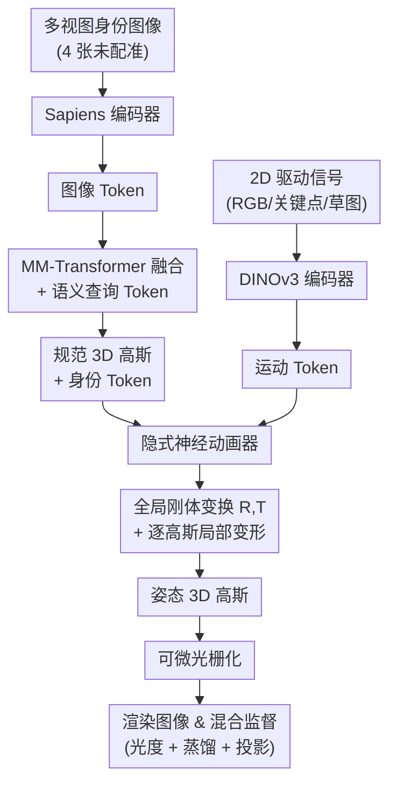

# LUNA: Learning Universal 3D Human Animation Beyond Skinning

**会议**: ECCV 2026  
**arXiv**: [2606.31981](https://arxiv.org/abs/2606.31981)  
**代码**: 无  
**领域**: 3D 视觉  
**关键词**: 人体动画, 3D Gaussian Splatting, LBS-Free, 隐式2D驱动, 跨身份泛化  

## 一句话总结

LUNA 提出首个完全抛弃线性混合蒙皮 (LBS) 的端到端 3D 人体动画框架，通过解耦的 Transformer 动画器将 2D 驱动信号（RGB 图像、关键点、手绘草图甚至未知角色图像）直接映射为 3D 高斯变形；在训练中利用 LBS 蒸馏提供结构性先验防止几何坍缩，推理时彻底摆脱 LBS 约束，实现了零样本跨身份、跨模态的 3D 人体动画。

## 研究背景与动机

从单目输入创建高保真、可驱动的 3D 数字人化身是计算机视觉与图形学的长期目标，在影视制作、VR/AR 和游戏等领域有巨大需求。然而，当前单目人体动画方法几乎完全依赖 SMPL/SMPL-X 等预定义参数化人体模型和线性混合蒙皮来驱动变形——这套管线虽然提供了便利的形状先验，却也带来了根本性限制。一方面，参数化人体模型的拓扑固定，骨架权重无法表达宽松衣物滑动、衣摆飘动等复杂非刚体动态；另一方面，LBS 高度依赖精确的 3D 姿态估计，而单目 3D 姿态估计本身是病态问题，微小的关节误差会放大为渲染中的时序抖动与几何伪影。近年来，以 LHM、IDOL 为代表的 feed-forward 方法虽然通过大规模 Transformer 实现了令人印象深刻的泛化能力，但它们依然以参数化模型为动画锚点——训练时用 LBS 将规范空间映射到姿态空间，推理时仍需显式的单目 3D 姿态作为驱动信号——因此难以摆脱上述瓶颈。

这种困境的核心矛盾在于：LBS 提供的结构性先验对几何稳定性至关重要，但其刚性的骨骼拓扑在本质上限制了可表达的变形范围。如果完全抛弃 LBS，模型在缺乏显式人体形状约束时容易坍缩成扁平结构；如果保留 LBS，又无法捕捉织物滑动等非刚体动态。本文的核心洞察是：LBS 可以作为**训练阶段的软先验**来稳定几何，而推理阶段则可以完全摆脱它——让模型直接学习从 2D 信号到 3D 变形的端到端映射，不再需要显式 3D 姿态估计作为中间表示。

**核心 idea：首次提出完全 LBS-free 的端到端 3D 人体动画框架 LUNA，它通过解耦的 Transformer 神经动画器将 2D 驱动信号直接映射为 3D 高斯变形；训练中利用 LBS 教师蒸馏提供结构性软先验防止几何坍缩，同时通过自适应加权混合监督在有限标注数据和海量无标注视频上学习丰富的非刚体动态；推理时实现零样本跨身份、跨模态的隐式 3D 驱动。**

## 方法详解

### 整体框架

LUNA 的输入包括一组未配准的多视图身份图像（4 张）和一张 2D 驱动图像，输出是驱动图像对应姿态下的高保真 3D 人体化身。整个流程分为两阶段：身份编码器 (Identity Encoder) 将多视图身份图像升维为规范空间中的 3D 高斯集合及对应的语义 Token；隐式神经动画器 (Implicit Neural Animator) 从 2D 驱动信号中提取运动线索，预测解耦的全局刚体变换（旋转 R + 平移 T）和逐高斯局部变形（位置偏移、旋转残差、颜色残差），将规范高斯映射到姿态空间。最终对姿态高斯进行光栅化渲染，以混合监督策略端到端训练。

### 关键设计

**1. 解耦式神经动画器：全局刚体与局部非刚体的分离预测**

传统 LBS 方法将变形隐式捆绑在骨骼权重上，难以表达非刚体动态。LUNA 将动画分解为两个层次：全局刚体变换（旋转 R 和平移 T）负责粗粒度的人体空间对齐，逐高斯局部变形（位置偏移 Δμ、旋转残差 Δq、颜色残差 Δc）负责捕捉姿态变化下的精细非刚体效应。全局旋转由 DINOv3 提取的全局运动描述子通过一个 MLP 头以连续三角形式预测——每个轴向输出 (sᵢ, cᵢ) 经 Tanh 归一化后组合为有效旋转矩阵，避免直接回归欧拉角的 ±π 间断性。局部变形则通过将身份 Token 与运动 Token 做跨模态 Transformer 融合后，由轻量 MLP 解码出每个高斯的残差。这种解耦设计让全局变换全权处理大幅旋转位移而不影响局部细节，局部变形则专注织物滑动、衣摆抖动等非刚体效应，二者配合实现了远超 LBS 的表达范围。

**2. 隐式 2D 驱动：完全绕过显式姿态估计**

LUNA 最引人注目的设计是直接接受 2D 图像信号作为驱动输入，而非传统方法要求的显式 3D 姿态参数。驱动图像经过 DINOv3 编码器生成运动 Token——选择 DINOv3 而非专门的人体编码器 Sapiens 的原因是动画更依赖运动语义而非身份细节，且 DINOv3 对域外信号（如抽象草图、动画角色）泛化更好。这些运动 Token 通过跨模态 Transformer 与规范身份 Token 融合，由动画器直接解码出变形参数。为了让模型只提取运动而非外观，训练中对驱动图像施加灰度化、高斯模糊、随机前景平移等强数据增强，强制模型忽略纹理细节。这一设计的革命性在于：训练完成后，LUNA 可以被 RGB 图像、2D 关键点、手绘草图甚至游戏角色图像等异构信号零样本驱动，彻底消除了单目 3D 姿态估计作为瓶颈环节，大幅减少了误差累积。

**3. 混合监督与 LBS 蒸馏：无骨架先验下的几何稳定性保证**

完全抛弃 LBS 的动画器直接从 2D 学习 3D 变形是严重欠约束的——仅有光度渲染损失会让重建坍缩成扁平结构。LUNA 的解决方案精妙地 "既用且弃"：在训练中保留一个 LBS 教师模型，它为每帧生成结构化的高斯属性作为软蒸馏目标：

$$ \mathcal{L}_{distill} = \|\mu_p - \hat{\mu}\|_1 + \lambda_q \mathcal{L}_{rot}(q_p, \hat{q}) + \lambda_c \|c_p - \hat{c}\|_1 $$

更为关键的是自适应加权方案：标注数据（有 LBS 真值）通常远少于海量无标注网络视频，纯光度梯度会淹没结构化信号。LUNA 采用固定的标注-无标注批次比例（1:5），并将蒸馏损失权重与标注比例成反比（λ_distill=5），使结构化先验在混合批次中不被稀释。此外，对全局平移不直接做 3D 监督，而是采用 2D 重投影损失（将 3D 高斯中心投影到 2D 后与标注对齐），避免深度轴误差主导梯度。这套混合监督让模型既获得了 LBS 锚定的几何稳定性，又在大规模无标注数据上学习到远超 LBS 表达上限的复杂非刚体动态。

### 损失函数 / 训练策略

总损失函数：
$$ \mathcal{L}_{total} = \mathcal{L}_{render} + \mathcal{L}_R + \mathcal{L}_{proj} + \lambda_{distill} \cdot \mathcal{L}_{distill} $$

其中 $\mathcal{L}_{render} = \mathcal{L}_1 + \mathcal{L}_{mask} + \mathcal{L}_{LPIPS}$ 为光度渲染损失（像素 L1 + 前景掩码 + 感知损失）；$\mathcal{L}_R$ 为全局旋转的连续形式监督；$\mathcal{L}_{proj}$ 为平移的 2D 重投影损失。

训练分两阶段：阶段一在单目视频上预训练（Video35K + iPhone1K + Cloth10K，64 块 A100，30K 轮，lr=4e-4，初始 1K 轮仅优化旋转和投影损失做热身）；阶段二在多视图数据集 Dome 上微调（16 块 A100，30K 轮，lr=1e-4）。关键配置：高斯数 K=8192（解码为 65536 个高斯），特征维度 C=1024，身份 Token 含 4096 个身体 + 4096 个面部高斯。

## 实验关键数据

### 主实验

| 数据集 | 指标 | Vid2Avatar | ExAvatar | IDOL | LHM | UP2YOU | MV-LHM* | **LUNA** |
|--------|------|-----------|----------|------|-----|--------|---------|----------|
| Cloth10K | PSNR↑ | 18.97 | 19.53 | 17.43 | 19.20 | 19.74 | 20.12 | **22.07** |
| (非刚体衣物) | L1↓ | 0.042 | 0.041 | 0.067 | 0.047 | 0.047 | 0.038 | **0.027** |
| | LPIPS↓ | 0.157 | 0.153 | 0.213 | 0.167 | 0.149 | 0.158 | **0.131** |
| NeuMan | PSNR↑ | 26.85 | 31.27 | 24.70 | 25.31 | 25.49 | 26.83 | 26.82 |
| | L1↓ | 0.012 | 0.009 | 0.037 | 0.029 | 0.026 | 0.017 | **0.015** |
| | LPIPS↓ | 0.017 | 0.009 | 0.051 | 0.039 | 0.041 | 0.023 | 0.023 |

### 消融实验

| 配置 | PSNR↑(iPhone) | PSNR↑(Dome) | 关键发现 |
|------|:------------:|:----------:|---------|
| Full model | **24.14** | **24.37** | 完整模型 |
| w/o 结构蒸馏 | 21.19 | 21.71 | LBS 蒸馏不可或缺；去掉后深度坍缩，PSNR 下降约 3dB |
| w/o 全局旋转解耦 | 23.10 | 23.29 | 不分离旋转时大幅运动产生严重漂移与边缘锯齿 |
| w/o 多视图微调 | 23.93 | 23.86 | 纯单目监督带来透视畸变和悬浮高斯点 |

### 关键发现

- **结构蒸馏是最关键的组件**：去掉后 PSNR 掉了约 3dB（iPhone 上 24.14→21.19），且出现严重的深度坍缩和几何扁平化，证实无 LBS 先验时仅靠光度损失不足以维持几何形状。
- **全局旋转解耦对大幅运动至关重要**：不分离旋转时，动画器在处理 180 度转身等大幅运动时产生显著漂移和边缘锯齿，定量上 iPhone PSNR 从 24.14 降至 23.10。
- **动画平滑度远超所有 LBS 基线**：在 MSJ（均方加加速度，反映高频抖动）上 LUNA 达到 0.0032，比最强基线 MV-LHM (0.0144) 降低 4.5 倍；在 MAE（平均加速度误差）上 0.0225 vs 0.0477（降低 2.1 倍），证实绕过姿态估计后时序稳定性的巨大提升。
- **跨身份驱动接近自驱动水平**：在 NeuMan 上跨身份驱动 PSNR 26.80 接近自驱动 26.82，关键点误差仅 17.3%（LBS 方法 26.7~28.7%），表明动画器主要从驱动信号中提取纯运动而非外观。
- **在宽松衣物场景优势最大**：在 Cloth10K 上 PSNR 比最优基线 (MV-LHM) 高约 2dB，而 NeuMan（紧身衣物）上与基线持平，说明 LBS-free 的真正价值体现在复杂非刚体动态建模。

## 亮点与洞察

- **"既用且弃"的 LBS 蒸馏策略是最大架构亮点**：不是简单用 LBS 教师做蒸馏，而是设计了自适应加权混合监督，让模型利用 LBS 结构性先验起步，同时在无标注数据上学到远超 LBS 上限的非刚体动态——训练后 LBS 教师被完全拆除，推理零开销。
- **隐式 2D 驱动的跨模态泛化能力惊艳**：训练时从未见过草图或动画角色，但 LUNA 能零样本正确处理——这得益于 DINOv3 对域外信号的泛化能力和训练时的强数据增强，强迫模型关注运动而非纹理。
- **平移的 2D 重投影损失 trick**：不直接监督 3D 平移而是投影到 2D 再对齐，避免深度轴误差主导梯度——这个技巧对任何可微分 3D 变形预测任务都有迁移价值。
- **解耦预测中的旋转连续表示**：将每轴输出 (s, c) 用 Tanh 归一化后组合为旋转矩阵，避免了直接回归欧拉角的 ±π 不连续性——经典但实用的工程优化。

## 局限与展望

- **作者承认的局限**：严重遮挡会降低 2D 驱动信号的语义质量，偶尔引入时序不稳定；极端姿态或体型差异过大时跨身份动画质量退化，因为运动与形状没有被显式解耦。
- **数据依赖问题**：虽然标榜 LBS-free，但训练仍依赖大规模 LBS 蒸馏教师生成的伪标签和多视图标注数据（Dome 数据集），数据获取成本不亚于传统方法的拟合数据。
- **渲染质量上限**：3D Gaussian 的渲染保真度相比 NeRF 在细节保持上逊色——在 NeuMan 上 PSNR 未超过优化型基线 ExAvatar（26.82 vs 31.27），feed-forward 方法的保真度仍有提升空间。
- **改进方向**：引入显式时序建模（如帧间运动约束或视频一致性损失）处理遮挡；将体型与运动解耦为两个独立网络以应对更大体型差异；在更丰富的数据集上扩展训练。

## 相关工作与启发

- **vs LBS-based 方法 (LHM, IDOL)**：它们在训练和推理中都无法脱离 LBS 参数化模型，误差在姿态估计与蒙皮两个环节累积；LUNA 仅在训练中用 LBS 蒸馏做先验，推理完全脱离，消除了误差传递链条。
- **vs 优化型方法 (ExAvatar, Vid2Avatar)**：它们通过逐身份优化达到高保真但无法泛化到新身份；LUNA 是 feed-forward 的，单次前向完成推理，泛化能力强但保真度有差距。
- **vs 2D 人体动画方法 (MagicAnimate, Champ)**：它们基于 2D 扩散模型灵活但缺乏 3D 几何一致性，易产生时序闪烁和视图不一致；LUNA 在真正 3D 空间中工作，天然具备视图一致性，但计算成本（多视图 Gaussian 光栅化）更高。

## 评分

- 新颖性: ⭐⭐⭐⭐⭐ 首个完全 LBS-free 的端到端 3D 人体动画框架，隐式 2D 驱动范式极具原创性
- 实验充分度: ⭐⭐⭐⭐ 在多个数据集上对比了优化型和 feed-forward 两类基线，消融完整；但跨身份泛化实验规模偏小
- 写作质量: ⭐⭐⭐⭐⭐ 方法描述清晰，结构严谨，消融实验设计合理，图表配合得当
- 价值: ⭐⭐⭐⭐⭐ 标志着 3D 数字人动画从"模板驱动"迈向"隐式驱动"的范式转换

<!-- RELATED:START -->

## 相关论文

- [\[CVPR 2026\] Human Geometry Distribution for 3D Animation Generation](../../CVPR2026/3d_vision/human_geometry_distribution_for_3d_animation_generation.md)
- [\[CVPR 2025\] Disco4D: Disentangled 4D Human Generation and Animation from a Single Image](../../CVPR2025/3d_vision/disco4d_disentangled_4d_human_generation_and_animation_from_a_single_image.md)
- [\[CVPR 2026\] RigMo: Unifying Rig and Motion Learning for Generative Animation](../../CVPR2026/3d_vision/rigmo_unifying_rig_and_motion_learning_for_generative_animation.md)
- [\[CVPR 2025\] MotionPRO: Exploring the Role of Pressure in Human MoCap and Beyond](../../CVPR2025/3d_vision/motionpro_exploring_the_role_of_pressure_in_human_mocap_and_beyond.md)
- [\[CVPR 2026\] HumanNOVA: Photorealistic, Universal and Rapid 3D Human Avatar Modeling from a Single Image](../../CVPR2026/3d_vision/humannova_photorealistic_universal_and_rapid_3d_human_avatar_modeling_from_a_sin.md)

<!-- RELATED:END -->
