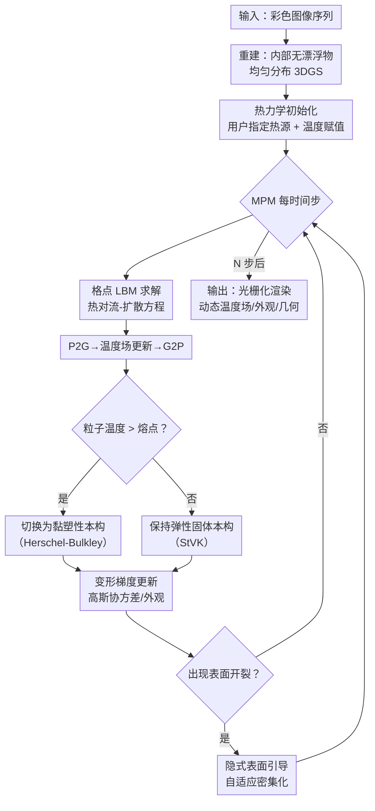

# MeGAS: Thermomechanical Dynamic Gaussian Splatting for Thermophysical Scene Editing

**会议**: ECCV2026  
**arXiv**: [2606.23455](https://arxiv.org/abs/2606.23455)  
**代码**: 待确认  
**领域**: 3D视觉  
**关键词**: 3D高斯泼溅, 热力学模拟, 物理仿真, 场景编辑, 相变

## 一句话总结

MeGAS 将热力学相变动力学（热传导、对流、熔化/凝固）集成进 3D Gaussian Splatting 框架，使真实场景的重建结果能够受控地发生基于物理的热力学形变，并在极端大变形下通过拓扑自适应渲染策略保持光栅化质量。

## 研究背景与动机

将物理模拟器与神经渲染结合是近年来的重要趋势。PhysGaussian、Gaussian Splashing 等工作成功将弹性力学、流体等机械驱动的动力学引入了 3DGS，使得重建的场景不仅能"看"，还能在物理规律驱动下发生形变，生成逼真的动态内容。然而，现有方法聚焦于力学过程，却忽视了一个无处不在却不可见的物理量——温度。熔化、凝固、热传导等热力学现象是自然界中最常见的形变来源，却因为耦合了热传导与力学响应、且在相变时涉及极端非刚体拓扑变化（表面开裂、内部暴露），始终未被纳入神经渲染的物理模拟管线中。

这种缺失的核心困难来自两方面。其一是建模复杂性：热力学动力学不仅需要满足动量守恒，还需要同时处理热量的对流-扩散传递和温度控制的材料相变——固体和熔融状态的应力-应变本构模型截然不同，需要在粒子级别动态切换。其二是渲染稳定性：3DGS 及其物理扩展（如 PhysGaussian）假定几何是连续或平滑变形的，但熔化过程中的极端大变形会导致高斯核拉成针状、表面开裂、内部冗余高斯暴露为漂浮物，使直白的组合方式直接失效。

本文的核心 idea 是**为 3DGS 的每个高斯粒子赋予温度属性，通过格点上的热对流-扩散求解器（LBM）驱动温度场演化，再以温度阈值触发从弹性固体到黏塑性流体本构模型的切换，从而在 MPM 框架内实现物理一致的熔化模拟；同时设计一套包含训练期正则化、光线追踪内部填充和隐式表面引导自适应密集化的拓扑自适应渲染策略，确保极端形变下仍能输出无裂纹、无漂浮物的高质量画面。**

## 方法详解

### 整体框架

MeGAS 的整体管线分为三个阶段。首先，从输入的彩色图像序列重建场景的 3DGS 表示，但不同于标准 3DGS，重建过程中加入了各向异性正则化和低贡献高斯剪枝，得到内部无漂浮物、分布均匀的高斯模型。其次，为每个高斯赋予一个温度属性，根据用户指定的热源区域初始化温度场，然后在 MPM-耦合的格点上用 Lattice Boltzmann Method (LBM) 迭代求解热对流-扩散方程，演化温度分布；每个粒子根据自身温度是否超过熔点阈值，在弹性固体模型（StVK）与黏塑性模型（Herschel–Bulkley）之间切换本构模型，从而驱动力学形变。最后，在形变后的时间步上，通过光线追踪检测开裂区域，利用从变形高斯拟合的隐式曲面（IMLS）引导内部填充粒子的高斯核参数重建，恢复完整的几何与外观渲染。

### 关键设计

**1. 热力学动态高斯表示：为每个高斯粒子附加温度属性**

标准 3DGS 仅存储位置、协方差、透明度和球谐颜色参数。MeGAS 在每个高斯上额外存储一个标量温度 $T_i$，温度场可以用和颜色渲染完全相同的 alpha-blending 公式投影到任意视角，输出一张热力图。这带来了一个关键的编辑灵活性：用户可以直接在场景中"放置"热源区域——用画笔在某个区域标记高温，MeGAS 会据此初始化温度场，然后让热量自主扩散。温度信息的可渲染性（可视化查看温度分布）和可操控性（用户任意指定热源）共同构成了物理可控编辑的基础。温度场的演化不依赖启发式规则，而是由一个格点上的物理求解器驱动。

**2. 基于 LBM-MPM 的热-力耦合求解与相变本构切换**

温度场一旦初始化，MeGAS 便将其映射到模拟格点上，用 Lattice Boltzmann Method (LBM) 同时求解 Navier-Stokes 方程（决定速度场 $\mathbf{u}$）和对流-扩散方程（决定温度场 $T$），并利用 Boussinesq 近似引入热浮力（高温区域上升、低温区域下沉），产生自然对流效果。周期性执行 P2G（粒子到格点，传递质量和温度）→ 格点更新（速度、温度边界、LBM 扩散）→ G2P（格点到粒子，插回温度和速度）的标准 MPM 流程。在每次 G2P 之后，每个粒子检查自己的温度是否超过了材料的熔点阈值 $T_{\mathrm{melt}}$：如果未超过，按弹性固体（StVK 模型）计算应力；如果超过，切换到黏塑性流体（Herschel-Bulkley 模型）计算应力，这会在宏观上表现为"固体区域保持形状、熔融区域开始流动"。这种基于物理的相变控制让熔化过程是渐进、局部、可预测的——只有高温区域液化，低温区域仍然保持刚性，这和真实世界的熔化行为完全一致。

**3. 拓扑自适应渲染策略：训练期正则化 + 光线追踪内部填充 + 隐式曲面引导密集化**

熔化过程中的极端形变会使直接使用 PhysGaussian 方式的 3DGS 产生三类严重伪影：针状高斯核、内部漂浮物暴露、表面开裂。MeGAS 为此设计了四个依次作用的机制。

训练期先做两项清洗：其一是遍历所有训练视角，记录每个高斯在各个像素上对渲染贡献的最大权重 $w_{\max}$，剪除低于阈值 $\tau_{\mathrm{prune}}$ 的低贡献高斯（这些高斯通常是重建场景时内部冗余的产物，在静态渲染时被遮挡看不见，但一旦形变暴露出来就成为漂浮物）；其二是加入各向异性正则化损失 $\mathcal{L}_{\mathrm{aniso}}$，惩罚最大与最小尺寸之比过大的高斯核（防止针状伪影），同时对缩放因子做截断 $\mathbf{S}_p \leftarrow \min(\mathbf{S}_p, \tau_{\mathrm{scale}})$ 保证体积一致。

形变发生前需要提供体支撑——因为剪除了内部高斯后，MPM 需要粒子来承载形变计算。MeGAS 使用基于高斯光线追踪的填充策略：将场景包围盒划分为均匀网格，每个网格沿主方向发射射线，如果射线累积透明度表明它完全处于物体内部（即从内部出发且方向与高斯法向一致），则该网格点被补充为内部 MPM 粒子。这一策略相比密度场填充（如 PhysGaussian 使用的方案）更均匀、不产生空洞。

形变过程中，开裂区域会由从内部区域自然迁移过来的填充粒子填补，但这些粒子缺少有效的协方差和外观参数。MeGAS 对每个时间步检测到达开裂区域的粒子，从周围原始高斯中通过隐式移动最小二乘法 (IMLS) 拟合出一个局部隐式曲面，将粒子投影到该曲面上获得表面法向和旋转矩阵，再从 $K$ 近邻原始高斯取平均颜色，从而赋予这些填充粒子表面对齐、外观合理的高斯核参数。这个机制使得开裂区域被平滑地"缝合"，且无需昂贵的逐帧重训练。

### 一个完整示例：雕像熔化

以一个真实场景中的石膏雕像为例。用户先用笔刷在雕像头部标记一个"热源区域"，设定温度为 300°C，材料熔点设为 200°C。MeGAS 初始化温度场：头部粒子的温度为 300°C，其余部分为环境温度 25°C。第一个时间步，LBM 求解器计算头部热量沿雕像颈部向下传导，温度梯度形成；同时热浮力使高温区域周围空气产生微弱的自然对流。当颈部温度超过 200°C 的阈值时，颈部粒子从 StVK 弹性固体切换到 Herschel–Bulkley 黏塑性状态，在重力和自身质量作用下开始下凹变形——变形梯度更新高斯协方差，使头部整体产生下坠效果。随着形变加剧，颈部区域出现表面微裂纹，光线追踪检测到这些裂纹区域后，IMLS 拟合当前头部的隐式表面，将附近填充粒子投影上表面并获得正确的法向和颜色，缝合裂纹。最终渲染的每一帧都保持了照片级真实感、多视角一致的物理行为。

### 损失函数 / 训练策略

整体优化目标为 3DGS 的 RGB 渲染损失结合各向异性正则化：
$$\mathcal{L} = \mathcal{L}_{\mathrm{RGB}} + \lambda_{\mathrm{aniso}} \mathcal{L}_{\mathrm{aniso}}$$
其中各向异性损失对每个高斯惩罚其最大与最小缩放之比超过阈值 $a$ 的部分。整个管线的训练分为两阶段：第一阶段在静态场景重建中加入正则化和剪枝，得到内部无漂浮物、均匀分布的高斯模型（约 30k 步）；第二阶段加载这个模型后进行热力学动画，动画阶段每个时间步只需自适应密集化的局部微调（约 10 秒 / 场景），无需全局优化。

## 实验关键数据

### 主实验

论文对真实场景（MipNeRF360、Tanks and Temples 数据集）进行熔化风格编辑，与三种基线对比：

| 场景 | 对比方法 | 物理真实感 | 视觉真实感 | 多视角一致性 |
|------|---------|-----------|-----------|------------|
| 多场景平均用户评分 | DGE | 1.538 | 2.038 | 2.154 |
| 多场景平均用户评分 | AutoVFX | 2.692 | 2.154 | 2.385 |
| 多场景平均用户评分 | Runway Gen-4.5 | 2.038 | 2.154 | 1.885 |
| 多场景平均用户评分 | **MeGAS** | **3.731** | **3.654** | **3.577** |

用户研究（20+ 名参与者，对匿名视频排序，最高 4 分）显示 MeGAS 在物理真实感、视觉真实感和多视角/时间一致性三个维度上大幅领先。

### 消融实验

| 配置 | 效果 | 说明 |
|------|------|------|
| Full MeGAS | 无裂纹、无漂浮物、均匀体积 | 完整方法 |
| w/o Internal Prune | 内部漂浮物在变形后暴露 | 低贡献高斯基聚类 |
| w/o Anisotropy Loss | 针状高斯核造成渲染条纹 | 最大/最小缩放比不受约束 |
| w/o Scale Clamping | 体积不一致，变形不自然 | 高斯体积差异大 |
| w/o Adaptive Densification | 表面开裂无法修复 | 隐式曲面引导失效 |
| w/ Density Field Filling | 内部填充不均匀、易坍塌 | 替代方案不如光线追踪填充 |
| w/o Phase-Change Switching | 所有高斯初始即为熔融态，全局过早坍塌 | 温度阈值控制至关重要 |
| w/o (仅热扩散) | 温度场正常演化但不产生形变 | 无相变力学耦合则无熔化效果 |

### 关键发现

- 各向异性正则化 + 低贡献剪枝是整套拓扑自适应策略中贡献最大的两个组件，去掉它们后变形渲染会出现最严重的人眼可察伪影。
- 相变切换（温度阈值控制而非全盘熔融）是物理合理性的核心：没有它，场景会在模拟开始后立刻全局坍塌，丧失渐进熔化的视觉效果。
- 在不同热源位置和温度组合下（不同热扩散率、黏度），MeGAS 可以模拟从"快速塌陷"到"缓慢滴落"的多样熔化模式，展示了良好的可控性。
- 框架自然地支持双向相变（加热→熔化→移除热源→冷却→凝固），证明了其不局限在熔化这一单一现象。

## 亮点与洞察

- **将温度作为第一公民引入 3DGS**：不同于以往仅在重建阶段使用热红外图像或简化热扩散估计，MeGAS 把温度作为显式可渲染、可编辑、可驱动力学形变的物理量，打开了一个全新的编辑维度。
- **LBM 求解器的选择巧妙**：MPM + LBM 的组合使得同一组格点同时求解流体力学（NSE）和热对流-扩散（ADE），避免了重新实现复杂的耦合求解器，且 LBM 天然的并行性有利于后续 GPU 加速。
- **"训练期剪枝→填充→形变后自适应缝合"的三段式策略解决极端大变形**：不试图在形变过程中做全局优化，而是在训练阶段就从数据上消除不稳定因素（内部高斯和针状核），在预填充阶段主动提供体支撑，在形变阶段只做局部的最小缝合——这种"预防为主、局部修补"的思路极具实用性。
- **IMLS 隐式曲面缝合方案**：将内部填充粒子投影到从变形高斯拟合出的隐式曲面上来重定向高斯核参数，做法优雅且高效（无需额外训练数据，纯几何运算）。

## 局限与展望

- 当前未建模相变导致的材料外观变化：熔化时物体表面颜色、反射率（PBR 属性）会发生显著变化，但 MeGAS 的球谐颜色是在静态重建时固定下来的，不随相变动态更新。作者指出可以与视频扩散模型（如 Stable Video Diffusion、Wan）结合来增强最终的外观渲染。
- 依赖 MPM 仿真器的物理参数设定（热扩散率、黏度、熔点等），对非专业用户有一定门槛；目前缺乏自动估测这些参数的手段。
- 当前每个时间步的自适应密集化需要光线追踪和 IMLS 拟合，计算开销较大（论文报告每帧约数秒级别），距离实时交互尚有一定距离。
- 目前仅以熔化作为主要示例展示了热力学编辑，更广泛的场景如焊接、蒸发、燃烧等仍待探索。

## 相关工作与启发

- **vs PhysGaussian**：PhysGaussian 首次将弹塑性 MPM 与 3DGS 结合，但只考虑机械驱动的形变且假定形变较小。MeGAS 在其基础上引入温度属性和相变本构切换，并将处理极端大变形作为核心设计目标，用拓扑自适应渲染解决了 PhysGaussian 在大形变下失效的问题。
- **vs Gaussian Splashing / FieryGS**：前者聚焦流体（液体飞溅）力学模拟，后者聚焦火与烟雾的合成；MeGAS 则关注固-液相变这一温度驱动的物理过程，属于不同的物理现象域。
- **vs Thermal3D-GS / NTR-Gaussian / ETGS**：这些工作用 3DGS 重建热红外视角下的温度场但限于静态场景或无相变的热传导，核心是"重建"而非"编辑"；MeGAS 是"用温度驱动场景形变"，本质是物理仿真驱动的内容生成。
- **vs DGE / AutoVFX / Runway Gen-4.5**：基于 diffusion 或 LLM pipeline 的编辑工具在物理真实性上天然匮乏（视频生成缺乏多视角一致性和物理约束），而 MeGAS 通过底层的显式物理模拟获得了不可比拟的物理一致性和多视角稳定性。

## 评分

- 新颖性: ⭐⭐⭐⭐⭐ [首次将热力学相变与 3DGS 结合，问题定义和设计方案均具原创性]
- 实验充分度: ⭐⭐⭐⭐ [真实场景 + 合成场景 + 用户研究全面，但缺少量化指标与 SOTA 方法的直接数值对比（由于基线不支持热力学编辑，仅做用户研究）]
- 写作质量: ⭐⭐⭐⭐⭐ [动机清晰、方法叙述详尽、消融实验完整，Fig.9 的渐进式消融可视化尤其直观]
- 价值: ⭐⭐⭐⭐⭐ [为 physics-integrated neural rendering 开辟了全新的方向——温度驱动建模，使"可编辑物理世界"向真正全面的世界模型迈出重要一步]

<!-- RELATED:START -->

## 相关论文

- [\[ICLR 2026\] ODE-GS: Latent ODEs for Dynamic Scene Extrapolation with 3D Gaussian Splatting](../../ICLR2026/3d_vision/ode-gs_latent_odes_for_dynamic_scene_extrapolation_with_3d_gaussian_splatting.md)
- [\[CVPR 2025\] Instruct-4DGS: Efficient Dynamic Scene Editing via 4D Gaussian-based Static-Dynamic Separation](../../CVPR2025/3d_vision/efficient_dynamic_scene_editing_via_4d_gaussian-based_static-dynamic_separation.md)
- [\[CVPR 2025\] Ctrl-D: Controllable Dynamic 3D Scene Editing with Personalized 2D Diffusion](../../CVPR2025/3d_vision/ctrl-d_controllable_dynamic_3d_scene_editing_with_personalized_2d_diffusion.md)
- [\[CVPR 2026\] Catalyst4D: High-Fidelity 3D-to-4D Scene Editing via Dynamic Propagation](../../CVPR2026/3d_vision/catalyst4d_highfidelity_3dto4d_scene_editing_via_d.md)
- [\[AAAI 2026\] Sparse4DGS: 4D Gaussian Splatting for Sparse-Frame Dynamic Scene Reconstruction](../../AAAI2026/3d_vision/sparse4dgs_4d_gaussian_splatting_for_sparse-frame_dynamic_scene_reconstruction.md)

<!-- RELATED:END -->
