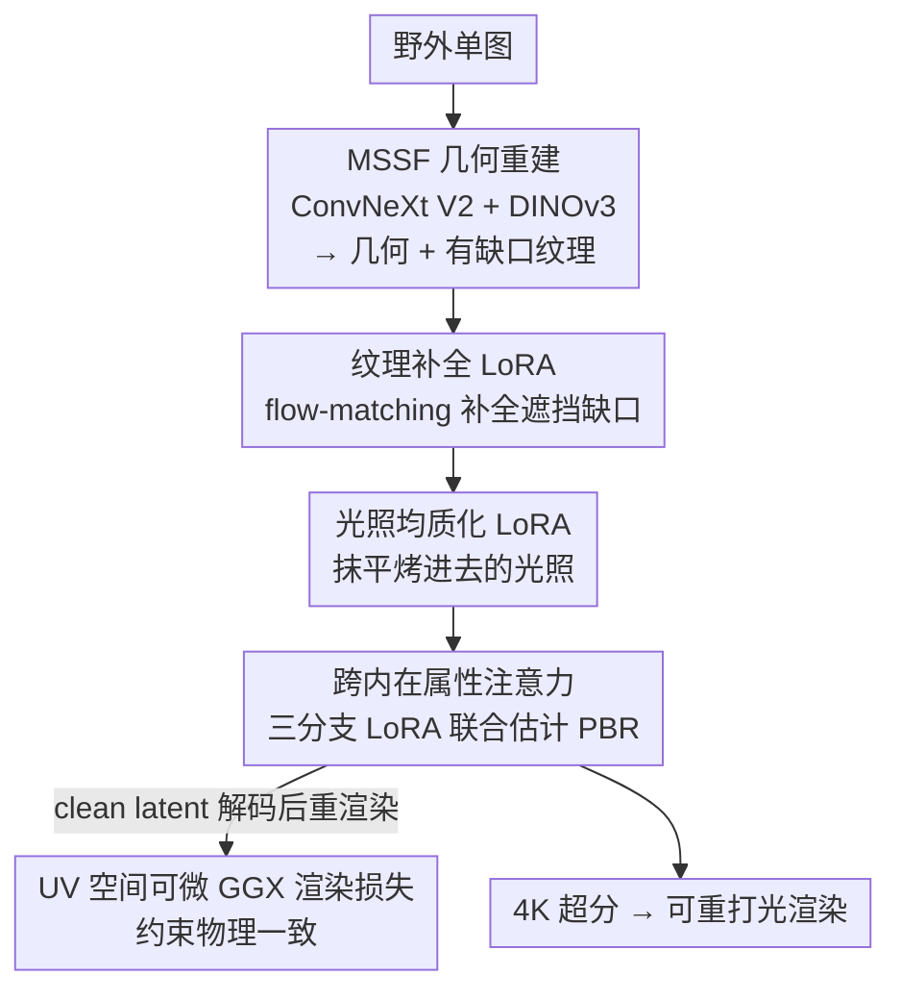

# Monocular Avatar Reconstruction via Cascaded Diffusion Priors and UV-Space Differentiable Shading

**会议**: ECCV 2026  
**arXiv**: [2606.28144](https://arxiv.org/abs/2606.28144)  
**代码**: [https://marcus-avatar.github.io](https://marcus-avatar.github.io) (项目页，代码承诺录用后放出)  
**领域**: 3D视觉  
**关键词**: 3D 数字人重建、PBR 材质估计、扩散先验、UV 空间可微渲染、级联 LoRA

## 一句话总结
用一个统一的预训练扩散骨干串联「纹理补全 → 光照均质化 → 材质分解」三个子任务、每个子任务只挂一个 LoRA，再配合 UV 空间可微 BRDF 渲染损失，仅用不到 100 个真实 3D 扫描就从单张野外照片重建出 4K 分辨率、可重打光的高保真人脸 PBR 数字人。

## 研究背景与动机
从单张野外照片重建可重打光（relightable）的高保真 3D 人脸数字人，是一个典型的病态问题。行业金标准 Light Stage 光场采集系统能拿到最好的几何和材质，但一套设备造价高昂、依赖复杂棚拍环境，注定无法普及。于是学界转向单目重建：传统 3DMM（3D Morphable Model）在紧凑的线性子空间里表达人脸，鲁棒但天然抓不住皱纹、毛孔这类高频细节；后来神经纹理补全类方法（UV-GAN、GANFit、UV-IDM、FreeUV 等）虽然能把不可见区域幻觉出来，却把光照「烤」进了纹理里，导致重建出来的资产没法在 PBR 管线里重打光。要真正做到光照与材质解耦，就得让生成网络（GAN 或扩散）去预测非线性的反照率/法线/粗糙度等各路材质图。

但这条路撞上了一个数据效率与泛化的两难。一方面，高质量 PBR 训练数据极其稀缺：合成数据往往不够真实，真实 Light Stage 扫描又贵又难规模化；另一方面，方法本身也有瓶颈——GAN 容易模式坍塌、过度平滑（MoSAR 就有蜡像感和肤色偏白的毛病），而想在小数据上微调扩散模型的做法（如 UltraAvatar）又常常把模型宝贵的先验知识给「微调没了」，一到野外图像就泛化失败。更麻烦的是，绝大多数框架依赖可微光栅化 + 2D 屏幕空间监督，这套优化范式对输入图里的头发、眼镜等遮挡非常敏感，经常把这些遮挡物连同伪影一起烤进重建纹理。

本文的切入角度是：与其去堆专有大数据集或从头训一个脆弱的生成器，不如把大规模预训练扩散模型的强先验当成主力，只用现代渲染引擎（Blender）把不到 100 个高质量扫描「放大」成海量合成配对数据来适配它，并把物理约束直接施加在 UV 空间的材质上，绕开屏幕空间监督对遮挡的敏感。**核心 idea：以一个共享的预训练扩散骨干为核心，用级联 LoRA 把它依次适配成纹理补全器、光照均质器和材质估计器，在 UV 空间通过一个跨内在属性注意力（Cross-Intrinsic Attention）协同生成各路 PBR 图、并用可微 GGX 渲染损失强制物理一致——从而在极少真实扫描下实现高保真、可泛化的可重打光数字人重建。**

## 方法详解

### 整体框架
给定一张野外单图，整条管线先估计 3D 人脸几何和相机参数，把图像投影回 UV 空间得到一张「有缺口」的纹理图；然后让一个冻结的预训练扩散骨干（LongCat-Image-Edit DiT）通过挂载不同 LoRA，依次完成三件事：先补全被遮挡缺失的纹理，再把烤进去的光照抹平成统一光照基线（光照均质化），最后在这张干净纹理上做多分支材质估计，一次预测出反照率、法线、粗糙度、镜面反射、位移五张图；预测出的材质图最后经超分网络上采样到 4K。训练侧的关键是一个「造数据」的管线：拿 FFHQ / CelebAMask-HQ 近 10 万张野外人脸重建几何、算可见性掩码，把不到 100 个扫描的 PBR 材质随机贴到这些几何上，用 Blender 在 2041 张 HDRI 环境光下渲染 + 烘焙，凑出「带光照的纹理 / 均质纹理 / 有缺口纹理」三套配对监督。

整条流程是清晰的多阶段串行 pipeline，用一张纵向框架图对照：

### 关键设计

**1. 级联 LoRA 复用一个扩散骨干：把三个子任务变成同一模型的三副「适配器」**

痛点很直接：纹理补全、去光照、材质估计传统上是三套割裂的网络，每套都要单独训、单独喂数据，既费数据又难保证风格一致。本文的做法是让这三件事共享同一个冻结的预训练扩散 Transformer（一个现代图像编辑 DiT），三个任务只在「条件输入 + 监督目标 + 挂哪个 LoRA」上不同，骨干参数全程冻结、只优化 LoRA。每个 LoRA（rank 32）约 91M 参数，仅占骨干的 0.7%，被注入到注意力和前馈的投影层里。补全和均质化都写成 flow-matching 的条件扩散：给定噪声水平 $\sigma\in(0,1)$，噪声隐变量 $z_\sigma=(1-\sigma)z_0+\sigma\epsilon$，模型学着预测速度场 $(\epsilon-z_0)$，补全任务把有缺口纹理 $T_{\text{inc}}$ 当条件、监督目标是完整纹理，均质化任务把带光纹理 $T_{\text{env}}$ 当条件、监督目标换成均匀光照下的 $T_{\text{hom}}$。这样做的好处是：昂贵的生成先验被三个任务共享复用，小数据只需学「怎么把先验拧到这个子任务上」，而不是从头学一个生成器，因此不到 100 个扫描也能撑起整条管线。

$$\mathcal{L}_{\text{FM}}=\mathbb{E}_{\sigma,\epsilon}\left[\left\|f(z_\sigma,\,c,\,\sigma)-(\epsilon-z_0)\right\|_2^2\right]$$

**2. 光照均质化：先把光照抹平，再谈材质分解**

即便纹理补全把 UV 图补完整了，光照仍然是场景相关的——每张脸都带着自己那套高光、阴影。如果直接在这种带光纹理上做材质估计，网络面对的是一个极难的一对多逆渲染问题：要同时幻觉材质、又要从单张纹理里隐式拆出未知的复杂光照，解空间大到优化会崩。本文因此专门插入一个光照均质化阶段，用同一个扩散骨干把「带光纹理」映射到一个规范的统一光照域（用全白环境光烘焙出的 $T_{\text{hom}}$ 作监督）。消融显示这一步是「稳定训练」的命门：去掉它，材质估计会退化到 degenerate 解——高对比阴影被烤进反照率、又被法线/位移图误读成高频几何噪声，即便训到 40k 步也拿不到物理合理的结果。它本质是一个把解空间大幅收窄的归一化步骤，让后续分解从「病态」变「良态」。

**3. 跨内在属性注意力：让各路材质图互相「对齐」而非各画各的**

如果给反照率、法线、粗糙度各训一个独立 LoRA，会出现模态各自过拟合：独立分支倾向于把局部高频信号（皮肤纹理、胡茬）误当成几何结构，于是法线图上毛孔被重建成尖锐的几何刺、皱鱼尾纹被打散成碎裂的划痕。本文让三个材质分支（反照率、法线、把粗糙度/镜面/位移打包在一起的 reflectance）共享骨干、各挂一个 LoRA，训练时把三个模态沿 batch 维堆叠联合处理；在每个 Transformer block 里，把标准自注意力换成跨内在属性注意力——每个模态各自算自己的 query，但 key 和 value 由所有材质分支的特征拼接而成，即 $K=[k_{\text{alb}},k_{\text{nrm}},k_{\text{rsd}}]$、$V=[v_{\text{alb}},v_{\text{nrm}},v_{\text{rsd}}]$，让每个分支都能直接「看」到其他分支互补的几何与反射线索。这样既保留了各模态专属的 LoRA 适配，又通过跨模态信息交换强制它们在空间上对齐、生成结构连贯的细节，把「表面色素冒充几何」这类幻觉压下去。

**4. UV 空间可微 GGX 渲染损失：把渲染方程直接钉在材质上，绕开屏幕空间监督**

联合扩散能保证各图空间对齐，但不保证分解在物理上有意义——网络可以画出看着协调、却不符合光照物理的材质。本文引入一个 UV 空间的可微 BRDF 渲染损失把材质预测和成像过程显式耦合起来。训练中先从噪声态 $z_\sigma$ 和预测速度场反推出干净隐变量 $\hat z_0=z_\sigma-\sigma\,\hat v_\theta$，解码得到预测的反照率/法线/reflectance 图；然后关键一招是把纹理解码和「个体几何」解耦——固定一张模板脸，预先用 Blender 算好它的世界坐标位置图、几何法线图、几何切线图当几何先验，这样光照就能在 2D 的 UV 域里直接算准 3D 光传输，而不必依赖光栅化。着色用 GGX 微表面着色器 $\mathcal{S}_{\text{GGX}}$ 在采样的光/视方向下渲出 $\hat T_{\text{shaded}}$，再和真值带光纹理算 L2 + LPIPS 损失。之所以选 UV 空间可微着色而非传统 2D 光栅化监督，正是因为后者对头发、眼镜等遮挡敏感、会把伪影烤进纹理；在 UV 空间用固定模板几何 + 可见性掩码加权，就能干净地施加物理约束、避开遮挡污染。为数值稳定，实现里用了简化 GGX（省掉经典归一化分母、切线空间重正交化、加低强度环境项防止全遮挡区梯度消失），细节见附录。

$$\hat T_{\text{shaded}}=\mathcal{S}_{\text{GGX}}\big(\hat T_{\text{alb}},\hat T_{\text{nrm}},\hat T_{\text{rough}},\hat T_{\text{spec}},\hat T_{\text{disp}};\,\tilde T_{\text{pos}},\tilde T^{\text{geo}}_{\text{nrm}},\tilde T^{\text{geo}}_{\text{tan}},L,V\big)$$

### 损失函数 / 训练策略
几何重建（MSSF 编码器：可训练 ConvNeXt V2 + 冻结 DINOv3，回归 Hifi3D++ 参数）用自监督目标 $\mathcal{L}=\lambda_{\text{pho}}\mathcal{L}_{\text{pho}}+\lambda_{\text{lan}}\mathcal{L}_{\text{lan}}+\lambda_{\text{per}}\mathcal{L}_{\text{per}}+\lambda_{\text{reg}}\mathcal{L}_{\text{reg}}$，其中光度损失用皮肤注意力掩码处理遮挡，并把标准 68 点关键点升级成 88 点混合配置（稳定面部轮廓点 + MediaPipe 鲁棒嘴部点）以解决嘴周检测不稳的问题。材质估计用扩散监督 + 渲染约束的混合目标 $\mathcal{L}=\mathcal{L}_{\text{diff}}+\lambda_{\text{img}}\|\hat T_{\text{shaded}}-T_{\text{shaded}}\|_2^2+\lambda_{\text{lpips}}\text{LPIPS}(\hat T_{\text{shaded}},T_{\text{shaded}})$（$\lambda_{\text{img}}=0.5$、$\lambda_{\text{lpips}}=0.1$）。全部在 8×H100 上以 BF16 训练：补全和均质化 LoRA 各训 20k 步；材质 LoRA 走两阶段——先 10k 步独立训、再 10k 步联合训。

## 实验关键数据

### 主实验
几何在 REALY benchmark（100 个受试者、按鼻/嘴/额/颊四区报 NMSE）上评估；纹理补全与光照均质化则用 PSNR/SSIM/LPIPS/CSIM 等指标定量比较。

| 任务 | 指标 | 本文 | 对比方法 | 说明 |
|--------|------|------|----------|------|
| 几何重建（REALY All，mm↓）| NMSE | 1.490 | MoSAR 1.500 / HiFace 1.275 | 全场第三，但用线性 3DMM 反超非线性的 MoSAR |
| 纹理补全 | PSNR↑ | 22.44 | UV-IDM 19.39 / HRN 15.70 | 全面领先 |
| 纹理补全 | LPIPS↓ | 0.0621 | UV-IDM 0.1674 / HRN 0.2982 | 细节保真显著更好 |
| 纹理补全 | CSIM↑ | 0.540 | UV-IDM 0.269 / HRN 0.441 | 身份一致性最高 |
| 光照均质化 | CSIM↑ / BS↓ | 0.4667 / 3.963 | FFHQ-UV 0.1340 / 5.738 | 更均匀、更保身份 |

材质估计因 MoSAR / FitMe / Relightify 均未开源，采用其官方测试样例做定性对比 + 用户研究：本文在几何细节、纹理真实感、重打光质量三个维度上，对 Relightify 偏好率 100%、对 FitMe 达 93.3%~96.7%、对 MoSAR 在纹理真实感 83.3% / 重打光 80.0%，并声称在细节与材质完整度上超过闭源商用 ChatAvatar（后者只给反照率/法线/镜面，本文预测完整 PBR 含粗糙度和位移）。

### 消融实验

| 配置 | 关键现象 | 说明 |
|------|---------|------|
| Full model | REALY All 1.490 | 完整模型 |
| w/o Enhanced $\mathcal{L}_{\text{lan}}$ | All 掉到 1.457（嘴区变差）| 去掉 88 点混合关键点损失 |
| w/o MSSF | All 掉到 1.806 | 去掉 DINOv3 语义先验，全指标恶化 |
| w/o 光照均质化 | 40k 步仍拿不到合理材质 | 阴影被烤进反照率、法线/位移出噪声 |
| 独立 LoRA（无跨内在注意力）| 法线图碎裂、毛孔成几何刺 | 各模态过拟合高频、色素被误当几何 |

### 关键发现
- 光照均质化是「稳定训练」的最大功臣：去掉它，材质估计从良态逆问题退化成病态一对多问题，直接崩解到 degenerate 解——这是全文最有说服力的消融。
- MSSF 里 DINOv3 的语义先验贡献巨大：去掉后 REALY 全指标恶化（All 从 1.490 掉到 1.806），也正是它让线性 3DMM 能反超非线性的 MoSAR。
- 跨内在属性注意力的价值在几何连贯性：独立分支会把皮肤色素/胡茬误读成几何、法线碎裂；联合 + 可微 BRDF 约束后鱼尾纹连续、皮肤平滑。
- 代价是推理慢：单张 H100 上补全 30s、均质化 30s、联合材质估计约 3 分钟，全程约 4 分钟——适合离线高质量资产制作而非实时。

## 亮点与洞察
- 「一个冻结骨干 + 级联 LoRA 打多个子任务」把数据效率做到极致：每个 LoRA 仅占骨干 0.7% 参数，却让不到 100 个扫描撑起补全/去光/材质三条任务线——这套「共享生成先验、只学任务适配」的范式可迁移到任何数据稀缺的逆渲染/内在分解任务。
- 用 Blender 把 <100 个扫描「放大」成 10 万合成配对（贴材质到野外几何 + 2041 张 HDRI 渲染烘焙 + 可见性掩码造缺口）是很实用的造数据工程：把「稀缺真值当物理锚点、用渲染引擎补充多样性」这条思路讲得很清楚。
- 把物理约束从屏幕空间搬到 UV 空间是关键 insight：固定模板几何 + 可见性掩码加权，既能施加渲染方程约束、又天然避开遮挡把伪影烤进纹理，直接回应了光栅化监督对遮挡敏感这个老问题。
- 跨模态注意力用「共享 K/V、独立 Q + 各自 LoRA」的写法很巧：既让各路材质图对齐、又保住每个模态的专属适配，是多任务生成里值得复用的结构。

## 局限与展望
- 作者承认只做人脸/头部 PBR 资产，不重建全身、动态头发、衣物、配饰；把头发/眼镜/手当遮挡处理虽利于人脸材质恢复，但会丢失遮挡物后的身份细节、在极端表情下失效。
- 几何依赖线性 Hifi3D++ 基，抓不住极端非刚性形变（如眨眼、非对称眯眼会导致渲染错位）；半透明遮挡（眼镜）去除后眼周会因缺高频信息而过度平滑。
- 推理延迟大（约 4 分钟/张），作者提到用一致性/对抗/分布匹配蒸馏来加速。
- 在小规模专业扫描上微调 LoRA 会削弱基模型的开放域文本编辑能力——在物理准确材质估计与灵活文本外观编辑之间取舍仍是开放问题。
- 自己补充：几何指标在 REALY 上仅第三，作者主要靠「同等训练条件下更优」和大量定性图 + 用户研究来立论，缺一个统一条件下的材质定量 benchmark（因对手不开源）；4K 超分是后处理的 Real-ESRGAN 微调，非端到端，最终细节质量部分受限于超分模块。

## 相关工作与启发
- **vs MoSAR**：都做单目可重打光数字人；MoSAR 用 GAN 骨干 + 可微着色，易模式坍塌、蜡像感、肤色偏白，且光栅化难处理遮挡。本文换成扩散先验 + UV 空间物理约束，肤色更准、遮挡区更干净，且用线性几何反而在 REALY 上超过它。
- **vs UltraAvatar**：都想用扩散模型解决数字人；UltraAvatar 在小数据上微调早期扩散模型，质量有限且丢失野外泛化。本文冻结骨干只训 LoRA、并用 Blender 造大量合成配对，既保先验又保泛化。
- **vs UV-IDM / FreeUV（纹理补全类）**：它们把光照烤进纹理、无法重打光。本文显式做光照均质化 + PBR 材质分解，产出可重打光资产。
- **vs NextFace（可微光线追踪显式建模自遮挡）**：思路相近（都想避开屏幕空间监督对遮挡的敏感），但 NextFace 计算开销高、泛化差；本文在 UV 空间用固定模板几何做可微着色，更高效也更能泛化。
- **vs HiFace / 3DDFA-V3（几何 SOTA）**：数值上本文几何略逊，但 HiFace 依赖大规模合成图 + 真实网格，3DDFA-V3 用分割聚类关键点却易过拟合出几何鼓包；同等野外训练条件下本文更稳，且靠预测的法线+位移图恢复出更清晰的高频细节。

## 评分
- 新颖性: ⭐⭐⭐⭐ 「级联 LoRA 复用扩散骨干 + 跨内在属性注意力 + UV 空间可微 BRDF 损失」的组合在数据效率与遮挡鲁棒上给出了清晰有效的解法，虽各组件多为已有技术的巧妙拼装。
- 实验充分度: ⭐⭐⭐⭐ 几何有 REALY 定量、纹理有多指标对比、消融把光照均质化和联合注意力的作用讲得很透；但材质因对手不开源只能靠定性 + 用户研究，缺统一定量 benchmark。
- 写作质量: ⭐⭐⭐⭐ 动机链条清晰、图文对照到位、消融解释有物理直觉，附录把可微着色器公式交代得很细。
- 价值: ⭐⭐⭐⭐ 用 <100 扫描做出 4K 可重打光数字人，显著降低高质量数字人门槛，对影视/游戏/虚拟制作有实用价值；作者也认真讨论了 deepfake 滥用与缓解。

<!-- RELATED:START -->

## 相关论文

- [\[CVPR 2026\] HAD: Hallucination-Aware Diffusion Priors for 3D Reconstruction](../../CVPR2026/3d_vision/had_hallucination-aware_diffusion_priors_for_3d_reconstruction.md)
- [\[ICCV 2025\] MoGA: 3D Generative Avatar Prior for Monocular Gaussian Avatar Reconstruction](../../ICCV2025/3d_vision/moga_3d_generative_avatar_prior_for_monocular_gaussian_avatar_reconstruction.md)
- [\[CVPR 2026\] GeoDiff4D: Geometry-Aware Diffusion for 4D Head Avatar Reconstruction](../../CVPR2026/3d_vision/geodiff4d_geometry-aware_diffusion_for_4d_head_avatar_reconstruction.md)
- [\[CVPR 2026\] Unsupervised Monocular 3D Keypoint Discovery from Multi-View Diffusion Priors](../../CVPR2026/3d_vision/unsupervised_monocular_3d_keypoint_discovery_from_multi-view_diffusion_priors.md)
- [\[ICLR 2026\] Pixel3DMM: Versatile Screen-Space Priors for Single-Image 3D Face Reconstruction](../../ICLR2026/3d_vision/pixel3dmm_versatile_screen-space_priors_for_single-image_3d_face_reconstruction.md)

<!-- RELATED:END -->
