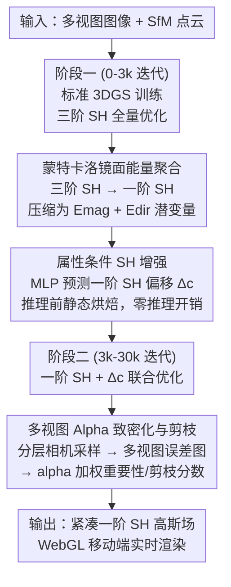

# Monte Carlo Energy Aggregation for Mobile 3D Gaussian Splatting

**会议**: ECCV 2026  
**arXiv**: [2606.30017](https://arxiv.org/abs/2606.30017)  
**代码**: [https://xiaobiaodu.github.io/flux-gs-project/](https://xiaobiaodu.github.io/flux-gs-project/)  
**领域**: 3D视觉 / 模型压缩  
**关键词**: 3D高斯泼溅, 移动端渲染, 球谐函数压缩, 多视图一致性, 神经渲染

## 一句话总结
Flux-GS 通过蒙特卡洛镜面能量聚合将三阶球谐函数压缩为一阶表示，辅以零推理开销的属性条件增强模块和多视图 alpha 加权致密化/剪枝策略，在移动端骁龙 8 Gen 3 上实现 130+ FPS 的实时高保真新视角合成，同时将存储压缩至 2-5 MB，训练时间从 Mobile-GS 的 80+ 分钟降至 11 分钟。

## 研究背景与动机
**领域现状**：3D Gaussian Splatting (3DGS) 凭借显式各向异性高斯表示，在桌面 GPU 上实现了高保真实时新视角合成，已成为三维重建和渲染的主流范式。然而，每个高斯原语需要 48 个三阶球谐函数（SH）系数来建模视角依赖的辐射度，当成千上万的高斯原语堆积时，存储和显存带宽需求对移动端而言是不可承受的。

**现有痛点**：已有轻量化工作沿着两条路线推进——（1）SH 压缩与蒸馏：Mobile-GS 通过教师-学生蒸馏将三阶 SH 迁移到一阶，但蒸馏过程训练成本极高（80+ 分钟），且其视角依赖的 MLP 增强模块在推理时仍需在线计算，拖慢渲染速度；（2）高斯剪枝：多数方法基于单视图梯度或重要性分数剪枝，缺乏多视图结构感知，容易过度致密化、产生冗余高斯原语，导致训练时间膨胀和存储增加。

**核心矛盾**：高保真渲染需要高阶 SH 捕捉复杂的镜面反射和视角依赖效果，但高阶 SH 的存储（每高斯 48 个浮点系数）和带宽开销与移动端严格的资源约束之间存在根本冲突。同时，单视图驱动的致密化策略在追求重建精度时会无节制地膨胀原语数量，与移动端所需的紧凑表示形成另一重矛盾。

**本文目标**：在不依赖昂贵蒸馏或预训练的前提下，将三阶 SH 的镜面能量压缩到紧凑的一阶子空间，同时用多视图一致性指导高斯原语的增删，使模型在移动端同时满足高帧率、低存储和快速训练三大目标。

**切入角度**：不做逐像素的辐射度残差聚合（那样会丢失角度梯度信息），而是用蒙特卡洛采样提取镜面残差的一阶方向矩（能量幅值 + 主导方向），将稀疏的 specular peak 信息编码进紧凑潜空间；不做单视图梯度驱动致密化，而是用多视图 alpha 加权误差累积来识别真正需要增删的高斯原语。

**核心 idea**：把高阶 SH 的 view-dependent 信号压缩成“能量 + 方向”的紧凑描述子，再用几何条件 MLP 在推理前一次性解码成一阶 SH 偏移——推理时零额外开销；同时让多视图重建误差反向指导哪些高斯该分裂、哪些该剪掉。

## 方法详解

### 整体框架
Flux-GS 的训练分为两个阶段。前 3k 迭代使用标准三阶 SH 训练，建立高频表示；之后通过蒙特卡洛镜面能量聚合器一次性将三阶 SH 压缩为一阶 SH，并初始化属性条件 SH 增强模块在后续 27k 迭代中持续细化一阶表示。最终推理时，增强模块预测的 SH 偏移被静态烘焙进高斯参数，渲染管线完全不需要额外 MLP 推理。

框架的核心是三个贡献模块串联：蒙特卡洛镜面能量聚合器负责“压”（三阶到一阶的保真压缩），属性条件 SH 增强模块负责“补”（补偿压缩损失的高频细节），多视图 alpha 加权致密化与剪枝负责“控”（控制高斯原语数量和质量）。

### 关键设计

**1. 蒙特卡洛镜面能量聚合器：把三阶 SH 的镜面信息压缩进“能量幅值 + 方向”的紧凑潜空间**

高阶 SH 用大量系数去抵消非镜面 ringing artifact 来表达一个稀疏的镜面峰——这是低效的。直接丢弃高阶系数会丢失关键的 view-dependent 细节，但把残差做简单的球面积分又会因为 SH 正交性导致高阶项积分为零、白做。本文的 insight 是：镜面反射的感知影响本质上由“有多亮”和“在哪个方向”决定，这两个量可以通过对高阶残差做蒙特卡洛方向矩估计来提取。

具体做法：在单位球面上均匀采样 $K=2048$ 个方向 $\mathbf{d}_k$，计算三阶 SH 辐射度 $c_i(\mathbf{d}_k)$ 与二阶 SH 辐射度 $c_i^2(\mathbf{d}_k)$ 的残差 $c_{res}(\mathbf{d}_k) = c_i(\mathbf{d}_k) - c_i^2(\mathbf{d}_k)$，然后聚合能量幅值 $E_{mag} = \frac{1}{K}\sum \max(0, c_{res}(\mathbf{d}_k))$ 和方向 $E_{dir} = \frac{1}{K}\sum \mathbf{d}_k \otimes \max(0, c_{res}(\mathbf{d}_k))$（外积）。这两个量分别编码了每个高斯原语上 specular 残差的整体亮度和主导入射方向，维度远低于原始 48 个 SH 系数。随后用一个轻量 MLP $\Psi$ 将 $(E_{mag}, E_{dir}, f(\hat{\mu}))$ 映射为一阶 SH 系数 $c'$（条件于归一化的高斯位置 $\hat{\mu}$）。整个过程只在第 3k 迭代执行一次，此后模型只维护一阶参数。

与 Mobile-GS 的蒸馏方案相比，MC-SEA 不需要训练一个高阶教师模型、不需要逐场景蒸馏，训练时间从 80+ 分钟直降到 11 分钟。

**2. 属性条件 SH 增强模块：用高斯自身几何属性预测 SH 偏移，推理前静态烘焙实现零推理开销**

从三阶压缩到一阶不可避免地会损失颜色保真度和场景结构信息。作者发现这些被丢弃的残差能量与高斯原语的内在属性（空间位置、各向异性尺度、不透明度、旋转四元数）高度相关。基于此，设计了一个轻量 MLP $\Phi$，输入归一化一阶 SH $\hat{c}'$、不透明度 $o$、归一化尺度 $\hat{s}$、位置 $\mu$ 和旋转 $r$ 的拼接向量，输出一阶 SH 的残差偏移 $\Delta c$：$c^{out} = c' + \Delta c$。

两个关键细节保证实用性和稳定性：（1）$\Phi$ 的最后一层做零初始化，让模型在训练初期自然回退到标准 3DGS 行为，然后平滑学习残差；（2）$\Phi$ 不依赖相机视角方向，因此 $\Delta c$ 只需在推理前解码一次并静态烘焙进高斯参数，推理时完全不需要任何 MLP 前向——真正做到零推理开销。Mobile-GS 的对应模块依赖 viewing direction 在线推理，会拖慢渲染。

**3. 多视图 Alpha 加权致密化与剪枝：用多视图重建误差反向指导高斯的增删，替代单视图梯度驱动**

标准 3DGS 的致密化只看单视图位置梯度 $\|\nabla_{\mu_i}\mathcal{L}\|_2 > \tau$，容易对某个特定视角过拟合、产生大量冗余高斯。Flux-GS 的做法分三步：

**分层相机采样**：先估计场景中心 $\mathbf{x}^{*}$（求解所有相机射线的最小二乘交点），将相机位置转到球坐标并按方位角和仰角分 bin，从每个非空 bin 均匀采样一个代表视角，最终随机截断到预算 $K$，得到角度覆盖均匀的相机子集 $\mathcal{C}$。

**光度损失引导**：对 $\mathcal{C}$ 中每个视角渲染并计算逐像素混合损失 $\mathcal{L} = (1-\lambda)\mathcal{L}_1 + \lambda\mathcal{L}_{DSSIM}$，通过阈值 $\tau^+$ 和 $\tau^-$ 二值化得到“重建差”和“重建好”的像素掩码 $M^+$ 和 $M^-$。

**Alpha 加权误差累积**：定制 CUDA 核，对每个高斯 $i$ 在 $M^+$ 区域的 alpha 贡献求和得重要性分数 $S_i^+$，在 $M^-$ 区域用 alpha 加权 loss 求和得剪枝分数 $S_i^-$。最终的 clone/split 掩码在原有梯度条件基础上再与重要性分位数过滤取交集：$\mathcal{M}_{clone} = \mathcal{M}_{clone}^{base} \land (S^+ > Q_{\tau^+}(S^+))$，确保只有对多视图高误差区域持续贡献的高斯才会被增密。剪枝掩码为 $\mathcal{M}_{prune} = (o_i < o_{min}) \land (S^- > Q_{\tau^-}(S^-))$，既保留标准低不透明度剪枝，又引入多视图冗余度判断，实现“适度剪枝”而非激进删除。

### 一个完整示例：从三阶 SH 训练到一阶 SH 移动端推理

以一个 Mip-NeRF 360 室内场景（如 kitchen）为例走完整条管线。初始 SfM 点云给出约 5k 个初始高斯位置，Flux-GS 在前 3k 迭代中用标准 3DGS 流程训练——每个高斯维护 48 个三阶 SH 系数，配合多视图 alpha 加权致密化将高斯数从 5k 逐步膨胀到约 360k。此时 PSNR 约 29.5，存储约 150 MB（三阶 SH 占主导），移动端完全无法运行。

第 3k 迭代执行 MC-SEA 压缩：对 360k 个高斯中的每一个，在球面上采 2048 个方向，计算三阶 SH 与二阶 SH 的残差辐射度 $c_{res}(\mathbf{d}_k)$，聚合得到 $E_{mag} \in \mathbb{R}^3$ 和 $E_{dir} \in \mathbb{R}^{3 \times 3}$，通过 MLP $\Psi$ 一次性解码为 12 个一阶 SH 系数（4 系数/通道 $\times$ 3 通道）。三阶 SH 系数随后被丢弃，存储从 150 MB 骤降到约 20 MB。此时 PSNR 掉到约 26.6（损失约 2.9 dB），主要丢失了 specular 细节。

随后立即初始化属性条件 SH 增强模块 $\Phi$（4 层 MLP，最后一层零初始化），对每个高斯输入其位置 $\mu$、尺度 $\hat{s}$、旋转 $r$、不透明度 $o$ 和刚解码的一阶 SH $\hat{c}'$，预测残差 $\Delta c$ 加到 $c'$ 上。由于零初始化，刚启动时 $\Delta c = 0$，模型平滑过渡。在接下来 27k 迭代中，$\Phi$ 逐渐学会用高斯几何属性补偿压缩损失的高频细节，PSNR 从 26.6 回升到 27.02。多视图 alpha 致密化与剪枝在此期间持续运行——每轮从 6 个分层采样的视角计算逐像素 loss 掩码，累计 alpha 加权分数，只对“多视图都高误差”区域的高斯做 clone/split（$S^+ > Q_{0.6}$），只对“低误差且低不透明度”的高斯剪枝（$o < o_{min}$ 且 $S^- > Q_{0.1}$）。最终高斯数稳定在约 366k，存储经量化后压至 3.5 MB。

推理前，$\Phi$ 对全部 366k 个高斯各前向一次，预测的 $\Delta c$ 被静态写回每个高斯的 SH 系数。推理时 WebGL 渲染管线只读取烘焙后的一阶 SH + 几何参数做光栅化——没有任何 MLP 计算，移动端 FPS 达 139。

### 损失函数 / 训练策略

训练目标与标准 3DGS 一致，采用混合光度损失 $\mathcal{L} = (1-\lambda)\mathcal{L}_1 + \lambda\mathcal{L}_{DSSIM}$，同时优化高斯几何参数和压缩 SH 特征。总共 30k 迭代，前 3k 迭代使用完整三阶 SH 建立高频基座，第 3k 迭代执行一次性 MC-SEA 压缩，之后关闭三阶 SH、只维护一阶 SH + 属性条件增强模块。不需要预训练或蒸馏。MC-SEA 的超参：球面采样点数 $K=2048$（消融表明 2048 后 PSNR 饱和），两个 MLP 分别为单隐层 64 神经元和 4 层 (128, 64, 32, 12) ReLU。多视图致密化与剪枝：采样 6 个视角，$\tau^+ = 0.1$，$\tau^- = 0.01$，$Q_{\tau^+} = 0.6$，$Q_{\tau^-} = 0.1$。量化方案沿用 Mobile-GS 的方法。

## 实验关键数据

### 主实验

Flux-GS 在 Mip-NeRF 360 数据集上，使用骁龙 8 Gen 3 移动端 GPU 与 RTX 4090 桌面端评估。以下为主表（Table 1），室内/室外分开报告。

| 方法 | PSNR↑ (室内) | #G×10⁶↓ (室内) | Storage MB↓ (室内) | FPS↑ (室内) | Train min↓ (室内) | PSNR↑ (室外) | #G×10⁶↓ (室外) | Storage MB↓ (室外) | FPS↑ (室外) | Train min↓ (室外) |
|------|-------------|----------------|--------------------|-------------|--------------------|--------------|-----------------|---------------------|-------------|---------------------|
| 3DGS | 30.41 | 1.45 | 478 | - | 27 | 24.61 | 3.14 | 1361 | - | 36 |
| 3DGS* (量化) | 30.04 | 1.45 | 46 | 11 | 27 | 24.39 | 3.14 | 85 | 5 | 36 |
| C3DGS | 30.01 | 0.75 | 21 | 18 | 31 | 24.38 | 0.91 | 34 | 13 | 45 |
| Mobile-GS | 30.37 | 0.38 | 3.5 | 131 | 86 | 24.51 | 0.58 | 5.5 | 114 | 136 |
| Mobile-GS* (无 MLP) | 29.58 | 0.38 | 3.4 | 142 | 64 | 23.74 | 0.58 | 5.4 | 128 | 114 |
| **Flux-GS** | **30.22** | **0.22** | **2.1** | **147** | **11** | **24.45** | **0.48** | **4.6** | **132** | **11** |

Flux-GS 在室内外均取得最高的 FPS（147/132），最低的高斯数（0.22M/0.48M）和最小存储（2.1/4.6 MB），PSNR 与 Mobile-GS 差距在 0.15/0.06 dB 以内，但训练时间仅为其 1/8 到 1/12。

在 Tanks&Temples 和 Deep Blending 数据集上的评估（Table 2）：

| 方法 | T&T PSNR↑ | T&T SSIM↑ | T&T LPIPS↓ | T&T Storage↓ | T&T FPS↑ | DB PSNR↑ | DB SSIM↑ | DB LPIPS↓ | DB Storage↓ | DB FPS↑ |
|------|-----------|-----------|------------|--------------|----------|----------|----------|------------|-------------|---------|
| 3DGS | 23.14 | 0.841 | 0.183 | 358.7 | - | 29.41 | 0.903 | 0.243 | 697.3 | - |
| C3DGS | 23.32 | 0.831 | 0.202 | 21.8 | 15 | 29.73 | 0.900 | 0.258 | 24.7 | 16 |
| Mobile-GS* | 22.41 | 0.825 | 0.227 | 2.5 | 129 | 29.14 | 0.895 | 0.281 | 4.5 | 146 |
| **Flux-GS** | **23.27** | **0.827** | **0.221** | **2.4** | **137** | **29.73** | **0.898** | **0.275** | **1.9** | **158** |

Flux-GS 在 T&T 和 DB 上均取得最高 FPS 和最小存储，PSNR/SSIM/LPIPS 与 C3DGS 等接近，明显优于去掉 MLP 的 Mobile-GS*。

### 消融实验

在 Mip-NeRF 360 上的消融（Table 3）：

| 配置 | PSNR↑ | Storage MB↓ | Peak VRAM↓ | FPS↑ | #Points×10⁶↓ | Train min↓ |
|------|-------|-------------|-------------|------|--------------|-------------|
| Flux-GS (full) | 27.02 | 3.5 | 388 | 139 | 0.36 | 11 |
| w/o MC-SEA | 26.64 | 3.5 | 388 | 139 | 0.36 | 11 |
| w/o Δc (SH 增强偏移) | 26.71 | 3.5 | 388 | 139 | 0.36 | 9 |
| w/o 多视图致密化 | 27.14 | 16 | 1591 | 24 | 1.37 | 18 |
| w/o 多视图剪枝 | 27.09 | 4.8 | 416 | 119 | 0.59 | 13 |

去掉多视图致密化（回退到标准单视图梯度致密化）后，高斯数从 0.36M 暴涨到 1.37M（3.8 倍），存储从 3.5 MB 涨到 16 MB（4.6 倍），FPS 从 139 暴跌到 24——这是贡献最大的单一模块。去掉 MC-SEA 掉 0.38 PSNR，去掉 Δc 掉 0.31 PSNR，两者互补。

### 关键发现

- **多视图致密化是效率的灵魂**：回退到单视图梯度致密化后高斯数膨胀近 4 倍，说明多视图 alpha 加权约束能精准抑制对单视角的过拟合，是 Flux-GS 能以最小原语数量维持画质的根本原因。
- **MC-SEA 和 SH 增强互补**：单独去掉 MC-SEA（-0.38 PSNR）和去掉 Δc（-0.31 PSNR）均低于完整模型，说明能量聚合保留了低频主导信息、而增强模块补回了几何相关的高频残差。
- **采样点数 K=2048 是甜点**：K 从 64 增加到 2048 时 PSNR 单调上升，K=4096 时饱和，计算开销线性增长——2048 是质量与效率的最优平衡点。
- **多视图相机数 6 为最优**：从 2 增到 6 时 PSNR 上升且高斯数显著下降，超过 6 后 PSNR 趋于平稳——6 个视角的多视图约束已足够区分重要和冗余高斯。
- **量化分析**：致密化分位数 $Q_{\tau^+}$ 越大，越少高斯被分裂/克隆，PSNR 逐渐降低（0.6 时 27.02，0.9 时 26.91）；剪枝分位数 $Q_{\tau^-}$ 越小剪得越激进，PSNR 下降（0.01 时 26.81 vs 0.1 时 27.02），取 0.1 为平衡点。
- **用户研究**：30 名志愿者在 Mip-NeRF 360、T&T、DB 三个数据集上盲评，Flux-GS 的主观画质偏好显著高于 Mobile-GS、Speedy-Splat 和量化版 3DGS。

## 亮点与洞察

- **用“方向矩”替代“残差聚合”的视角很有启发**：常规做降阶的思路是直接投影像素残差，但残差积分为零（SH 正交性）让这条路走不通。转而去估计残差的“一阶矩”——能量幅值和主导方向——既绕开了数学障碍，又抓住了 specular 最本质的两个物理量。这种“不直接压缩信号本身、而是压缩信号的矩”的思路可以迁移到其他需要降维保持关键结构的场景（如 NeRF 的视角依赖颜色降维、环境光照 probe 压缩）。
- **“推理前静态烘焙”是移动端部署的黄金法则**：属性条件 SH 增强模块的训练时算力开销可以接受，但作者严格保证它对视角方向无依赖、推理时只运行一次并烘焙进参数——这比 Mobile-GS 的 online MLP 方案在 FPS 上的优势充分体现了“训练可以贵、推理必须零开销”的设计哲学。这对其他 mobile-friendly 模型设计有直接的参考价值。
- **Alpha 加权比梯度加权更适合高斯剪枝**：梯度反映的是“这个高斯被优化了多少”，而 alpha 反映的是“这个高斯对最终像素贡献了多少”——后者才是衡量高斯重要性的直接指标。加上多视图聚合后，能有效区分“对多视图都重要”和“只对单视图 artefact 重要”的高斯，这是比其他重要性分数方法（transmittance、Hessian 敏感度等）更自然的剪枝准则。
- **分层相机采样的轻量设计**：不做复杂的视点选择优化，只用球坐标分 bin + 均匀采样 + 随机截断，就实现了足够好的多视图覆盖。这种“够用就好”的工程务实性让多视图致密化可以无缝嵌入标准 3DGS 训练循环，不引入新的复杂超参。

## 局限与展望

- **镜面反射上限受限于一阶 SH**：作者承认，一阶 SH 天然无法表达三阶 SH 能捕捉的复杂镜面反射（如完美的镜面反射、窄 specular lobe），对包含大量镜面材质的场景（如汽车展厅、玻璃建筑）画质会明显下降。
- **训练峰值显存仍是三阶水平**：前 3k 迭代仍需维护完整三阶 SH（48 系数/高斯），峰值 VRAM 与标准 3DGS 相当（消融表显示 388 MB），并未因为最终模型轻量而降低训练门槛——在显存极度受限的边缘设备上训练仍有困难。
- **分层采样可能遗漏关键窄视角**：多视图剪枝依赖采样相机子集来评估冗余度，如果某些微结构只在一个极窄的未采样视角可见，可能被误剪——这在极稀疏视角重建场景下风险更高。
- **量化方案的压缩比未深入挖掘**：当前采用 Mobile-GS 的量化方案，未探索与本文的紧凑一阶 SH 表示更匹配的编码策略（如基于 codebook 的熵编码、残差量化等）——这是进一步压缩存储的直接方向。
- **动态场景未覆盖**：方法当前仅支持静态场景，扩展到 4D GS（动态场景）需要处理时域冗余——多视图致密化策略有机会适配为多时间步一致性约束，但未在本文探索。

## 相关工作与启发

- **vs Mobile-GS**: 同为移动端 GS 方案，Mobile-GS 用知识蒸馏 + online MLP 增强，Flux-GS 用 MC 能量聚合 + 静态烘焙增强。本质区别在于 Flux-GS 把“恢复高频”的计算从推理阶段移到了训练阶段的一次性操作，换来数倍训练加速和推理零开销。
- **vs C3DGS / LocoGS**: 这些方法用神经场架构建模视角依赖颜色或全量高斯属性，但需要在推理时做 MLP 前向——Flux-GS 的“预烘焙”策略在 FPS 上直接压制。
- **vs EAGLES / PUP 3DGS**: 这些剪枝方法依赖透射率或 Hessian 的敏感性分析来做重要性排序，仍基于单视图评估。Flux-GS 的多视图 alpha 加权评估引入了视角一致性维度，是更自然的冗余判断标准——这个思路可以迁移到其他需要“剪枝”的神经渲染方法（如 NeRF-based 方法中的采样点剔除）。
- **vs MVGS**: MVGS 是首个提出多视图正则化训练 GS 的工作，但它的多视图约束作用于 loss 层面。Flux-GS 将多视图信息用于致密化与剪枝决策，是一种更底层、更直接的结构级多视图引导。

## 评分
- 新颖性: ⭐⭐⭐⭐ 用方向矩估计替代蒸馏做 SH 压缩思路新颖，多视图 alpha 加权致密化/剪枝的评估视角有 insight，但整体上仍是已知组件（MC 采样 + MLP 解码 + 多视图一致）的组合创新
- 实验充分度: ⭐⭐⭐⭐⭐ 包含 3 个数据集主表、5 组消融、K 值/相机数/分位数敏感性分析、per-scene 结果、用户研究、SH 分量可视化，实验设计全面且扎实
- 写作质量: ⭐⭐⭐⭐ 方法动机清晰、每个组件都解释“为什么这样做”以及“和旧方法比好在哪”，与 Mobile-GS 的系统性差异分析章节（Sec 4）是很好的增量对比实践；Fig 3 框架图和 Fig 4 致密化对比图直观有效
- 价值: ⭐⭐⭐⭐⭐ 训练时间从 80+ 分钟降到 11 分钟仍保持有竞争力的画质，存储 2-5 MB，WebGL 跨平台可用——实用价值极高，直接降低了 3DGS 在移动端落地的门槛

<!-- RELATED:START -->

## 相关论文

- [\[CVPR 2026\] Energy-GS: Image Energy-guided Pose Alignment Gaussian Splatting with redesigned pose gradient flow](../../CVPR2026/3d_vision/energy-gs_image_energy-guided_pose_alignment_gaussian_splatting_with_redesigned_.md)
- [\[ICLR 2026\] Mobile-GS: Real-time Gaussian Splatting for Mobile Devices](../../ICLR2026/3d_vision/mobile-gs_real-time_gaussian_splatting_for_mobile_devices.md)
- [\[ICCV 2025\] BANet: Bilateral Aggregation Network for Mobile Stereo Matching](../../ICCV2025/3d_vision/banet_bilateral_aggregation_network_for_mobile_stereo_matching.md)
- [\[CVPR 2026\] Confidence-Guided Multi-Scale Aggregation for Sparse-View High-Resolution 3D Gaussian Splatting](../../CVPR2026/3d_vision/confidence-guided_multi-scale_aggregation_for_sparse-view_high-resolution_3d_gau.md)
- [\[ECCV 2026\] Capacity-Controlled Multi-View Stylization of 3D Gaussian Splatting](capacity-controlled_multi-view_stylization_of_3d_gaussian_splatting.md)

<!-- RELATED:END -->
