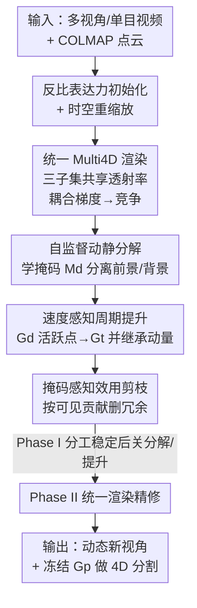

# Multi4D: High-Fidelity Dynamic Gaussian Splatting via Multi-Level Competitive Allocation

**会议**: ECCV 2026  
**arXiv**: [2606.22197](https://arxiv.org/abs/2606.22197)  
**代码**: [https://batfacewayne.github.io/Multi4D.io/](https://batfacewayne.github.io/Multi4D.io/) （项目页）  
**领域**: 3D视觉 / 动态高斯泼溅 / 动态场景重建  
**关键词**: 动态高斯泼溅, 4D 重建, 竞争性分配, 静态-动态分解, 4D 分割

## 一句话总结
Multi4D 把动态场景显式拆成「静态结构 + 持久动态几何 + 瞬态外观」三套高斯子集，让它们在共享光栅化下**竞争性地**去解释光度残差，从而同时保住长时运动一致性和高频外观细节，用比 4DGS 少 25× 的动态高斯就拿到 SOTA 渲染质量、实时帧率，还能顺带做到 10× 提速的 4D 分割。

## 研究背景与动机

**领域现状与痛点**：3DGS 把显式高斯 + 可微光栅化推成了实时新视角合成的主力，但一扩展到动态场景，就撞上「物理合理性（运动、对应关系）」和「视觉保真度（渲染质量）」这对根本冲突，现有方法据此分成两个对立阵营、各有硬伤。第一类是**形变（deformation）派**：维护一组固定的规范高斯，用神经形变网络 / 显式轨迹 / 特征网格把它们随时间 warp 过去；因为强制了时间对应关系，它天然保住高斯身份，很适合下游的语义嵌入和跟踪。但它的形变场会把邻近运动强行归组、过度平滑掉高频动态（motion over-factorization），还常把复杂外观变化（高光、光照漂移）误解成物理运动、为压光度误差而制造出假的几何扭曲；更要命的是每帧要为每个 primitive 查一次形变网络，开销随高斯总数线性增长——想加 primitive 抓细节，就直接牺牲实时性和显存。第二类是 **4D-primitive 派**：把动态建模成 4D 时空高斯超柱体，在任一时刻沿时间轴切片得到带时变不透明度的 3D 高斯，外观细节抓得很好、还能靠时间预过滤只渲活跃高斯来加速。可它反过来会**时间过参数化**（temporal over-parameterization）：优化倾向于用时间缩放去凑光度误差，幻化出几百万个寿命极短的 primitive 来冒充运动，在快速运动区域反而把几何搞碎；且缺乏整体运动先验和规范几何约束，在稀疏相机 / 单目输入下泛化很差。

**核心矛盾**：两派各按住了矛盾的一头——形变派保运动一致但丢高频，4D 派抓细节但碎几何、且过度膨胀。此前的补丁（coarse-to-fine 形变、频率感知场、样条轨迹、时间剪枝/敏感度分析）都是在各自阵营内小修，没跳出「一套单一表征必须同时解释物理运动学和瞬态外观」这个隐含假设。本文的目标就是打掉这个「单体表征（monolithic）」假设：既然一套表征做不到两全，那就不让它硬扛。

本文的核心 idea 是：把动态重建重新表述成一个**竞争性多级优化问题**——让几套带不同归纳偏置（inductive bias）的模型，在同一个可微渲染器下**竞争解释光度残差**，谁的偏置更适合某个区域谁就去建它。具体拆成静态、持久动态、瞬态三套高斯子集，通过共享光栅化耦合梯度，实现「残差驱动」的自适应分工，而不是预先人为分配谁管什么。

## 方法详解

### 整体框架
Multi4D 把场景表示为三套高斯子集的并集 $\mathcal{G}=\mathcal{G}_s\cup\mathcal{G}_d\cup\mathcal{G}_t$：**静态子集** $\mathcal{G}_s$ 是时不变的 3D 高斯，锚住稳定结构；**持久动态子集** $\mathcal{G}_d$ 是规范高斯，由一个「只管几何」的形变场 $\Phi_g$（基于 HexPlane）驱动，只预测刚性运动 $(\boldsymbol{\mu}_t,\mathbf{r}_t)=(\boldsymbol{\mu},\mathbf{r})+\Phi_g(\boldsymbol{\mu},t)$，从而维持长时身份和可跟踪性；**瞬态子集** $\mathcal{G}_t$ 是短寿命的 4D 时空高斯，专门建模高频外观变化和瞬态几何。

整条 pipeline 是「自底向上（bottom-up）」的：先给三套子集按「表达能力越强、初始化越弱」的反比原则埋下归纳偏置，再让它们在一个统一可微光栅化里联合渲染。关键在于**共享透射率（shared transmittance）会耦合三套子集的梯度**——一旦某套子集把某区域解释清楚了，其它子集在该区域的残差驱动稠密化就被自然抑制，这就是「竞争」的物理来源。训练分两阶段：Phase I 靠自监督动静分解 + 速度感知周期提升 + 掩码感知剪枝把三套子集的分工「competitively」建立起来；Phase II 关掉分解和提升，只用统一渲染器精修几何和外观。最后冻结持久子集 $\mathcal{G}_p=\mathcal{G}_s\cup\mathcal{G}_d$，在其上做高效 4D 分割。

### 关键设计

**1. 多级竞争性分配：三套子集在共享透射率下抢着解释残差**

这是全文的立身之本，直接针对「一套表征扛不动物理运动 + 瞬态外观」这个矛盾。所谓「competitive」不是玄学，而是落在两处硬机制上。其一是**统一渲染耦合梯度**：三套子集不是各渲各的再叠加，而是在**同一次**可微光栅化里按深度联合排序、共享透射率累积（作者在 [Hybrid 3D-4D GS] 基础上把三套一起深度排序）。每个 primitive 按所属子集投影成瞬时 3D 状态 $\Theta_{t,i}$——$\mathcal{G}_s$ 直接用规范参数，$\mathcal{G}_d$ 用 $\Phi_g$ 形变后的 $(\boldsymbol{\mu}_t,\boldsymbol{\Sigma}_t)$，$\mathcal{G}_t$ 用 4D 切片得到的时变几何和不透明度 $\sigma_t=\sigma\exp(-(t-\mu_t)^2/2\boldsymbol{\Sigma}_{4,4})$。因为透射率是共享的，一旦某套子集在某区域「站住了」（稳定几何解释了该像素），后面 primitive 的梯度被前面挡住、稠密化被抑制，冗余建模自然被压下去。其二是**反比表达力初始化（Initialization via Inverse Expressiveness）**制造归纳偏置的起跑差：约束力最强的 $\mathcal{G}_s$ 用 COLMAP 稠密点初始化（先占住静态结构，防止静态被误建成运动）；$\mathcal{G}_d$ 用稀疏随机点起步，让动态几何在自监督下慢慢长出来；表达力最强、最容易过拟合噪声的 $\mathcal{G}_t$ 初始为空，只在后期靠提升机制注入。这样分工不是人为指派，而是从优化里「涌现」出来的——形变场只吃刚性运动、把瞬态光度噪声让给 4D primitive，两边都不越界。此外，为避免联合优化三套子集时因场景空间/时间尺度不一致导致梯度失衡、甚至 $\boldsymbol{\Sigma}_{4,4}$ 求逆奇异，训练前会按相机分布和视频时长做**时空线性重缩放**来稳住数值。

**2. 自监督动静分解：无需跟踪标签就把动的从静的里剥出来**

要让 $\mathcal{G}_d$ 只管「动的演员」、$\mathcal{G}_s$ 只管背景，得先知道哪儿在动——但作者不用任何真值跟踪标签。做法（沿用 DeGauss 的概率掩码思路）是给每个持久动态高斯挂一个基础掩码 logit $m_i$，再用一个轻量 MLP $\mathcal{D}_m$ 吃 HexPlane 时空特征 $\mathcal{H}(\boldsymbol{\mu}_i,t)$ 预测时变偏移 $m'_i(t)=m_i+\mathcal{D}_m(\mathcal{H}(\boldsymbol{\mu}_i,t))$。Phase I 里把 $\mathcal{G}_d$ 的 SH 颜色临时换成激活后的掩码概率去光栅化，就得到一张连续 2D 动态掩码 $\mathbf{M}_d\in[0,1]^{H\times W}$，静态掩码即 $1-\mathbf{M}_d$。再分别从动态、静态子集独立渲两张图，用掩码合成 $\mathbf{C}_{\text{comp}}=\mathbf{M}_d\odot\mathbf{C}_d+(1-\mathbf{M}_d)\odot\mathbf{C}_s$ 做早期光度监督。这里的巧思是初始化本身制造的**结构不对称**：$\mathcal{G}_s$ 稠密（COLMAP）、$\mathcal{G}_d$ 稀疏随机（10k 点），优化天然倾向把稳定内容丢给 $\mathcal{G}_s$，于是 $\mathbf{M}_d$ 会自动收缩到真正有时间变化的区域。再补一个空间感知的不透明度惩罚 $\mathcal{L}_\alpha=\lambda_\alpha\|\alpha_d-\mathbb{I}_{\mathbf{M}_d>\tau}\|_1$，把投到静态区（$\mathbf{M}_d\approx0$）的持久动态高斯往零不透明度压，方便后续剪掉。

**3. 速度感知周期提升：给瞬态 4D primitive 注入运动先验，而不是让它瞎长**

$\mathcal{G}_t$ 初始为空，那它怎么诞生？答案是从 $\mathcal{G}_d$ 里「提升（lifting）」。等动静分离稳定后，用形变后的掩码 logit $m'_i(t)$ 当活跃度分数，从活跃集 $\{g_i\in\mathcal{G}_d\mid m'_i(t)>\tau\}$ 采样 $K$ 个候选提升到 $\mathcal{G}_t$（因为 $\mathcal{G}_d$ 一直保持稀疏，采样很便宜）。关键是提升时做**动量继承（Momentum Inheritance）**：先用有限差分估父高斯瞬时速度 $\mathbf{v}_i=(\Phi_g(\boldsymbol{\mu}_i,t+\Delta t)-\Phi_g(\boldsymbol{\mu}_i,t))/\Delta t$，用它初始化新 4D primitive——位置设为 $[\boldsymbol{\mu}_i(t)+\epsilon,\ t]^T$（$\epsilon$ 朝相机中心偏一点防被父高斯立即遮挡），朝向用 `Align` 把 4D 主轴对齐到时空轨迹 $[\mathbf{v}_i^T,1]^T$。这一步很要紧：无约束的 4D 优化在稀疏/单目下极不稳定，动量继承相当于给高表达力的瞬态子集塞了个强运动先验，让它一出生就沿着物理运动方向长，之后再自主稠密化去建高频外观残差。消融显示把它换成随机初始化会掉 0.70 dB PSNR（33.92→33.22）。

**4. 掩码感知效用剪枝：按「对最终画面的实际贡献」删冗余，而非按不透明度**

三套子集容易互相重叠建同一块区域，光看不透明度剪枝抓不住这种冗余。作者改用「峰值可见贡献」打分：对每个高斯、每个视角 $I$，取它在所有像素上的最大混合权重再乘一个门控掩码 $M(\mathbf{u})$——$\mathcal{G}_d$ 用 $\mathbf{M}_d$、$\mathcal{G}_s$ 用 $1-\mathbf{M}_d$、$\mathcal{G}_t$ 用 $1$，得到 $w_{i,I}$。这个前景/背景感知的门控确保持久与静态 primitive 只在各自分区里计贡献，防跨集重叠；而 $\mathcal{G}_t$ 的透射率跨整个深度排序并集，让 $w_{i,I}$ 能借助跨集遮挡推理、剪掉藏在实体几何后面的瞬态噪声。再在一个时间窗上聚合成最终分数：

$$s_i=\beta\cdot\max_{I\in\mathcal{I}_s}(w_{i,I})+(1-\beta)\cdot\frac{1}{|\mathcal{I}_s|}\sum_{I\in\mathcal{I}_s}w_{i,I}$$

$\beta$ 在「保住偶尔高贡献的 primitive」和「删掉持续没用的」之间平衡，$s_i<\tau_{\text{prune}}$ 的直接删。为进一步抑制视角依赖的过拟合，训练时还随机丢弃 primitive（Stochastic Primitive Dropout），逼三套子集协同建模。消融里去掉这个剪枝，动态高斯数会从 165k 暴涨到 729k、存储 +145%。

### 损失函数 / 训练策略
总损失 $\mathcal{L}_{total}=\mathcal{L}_{\text{color}}+\lambda_{sep}\mathcal{L}_{\text{sep}}+\lambda_{reg}\mathcal{L}_{\text{reg}}+\lambda_{div}\mathcal{L}_{\text{diversity}}$。其中 $\mathcal{L}_{\text{color}}$ 是 L1 + SSIM 光度监督（Phase I 还独立作用于持久前景和静态背景渲染以促分离）；$\mathcal{L}_{\text{sep}}$ 是动静分解损失（掩码合成 + 区域监督，早期用 $\gamma=0.9$ 弱化目标信号防前景过拟合背景）；$\mathcal{L}_{\text{diversity}}$ 是**跨子集多样性损失**，用掩码加权 SSIM 惩罚瞬态渲染 $\mathbf{C}_t$ 和持久渲染 $\mathbf{C}_p$ 的结构相似，逼两者不重复建模（$\lambda_{div}=0.1$）；$\mathcal{L}_{\text{reg}}$ 聚合掩码感知不透明度、深度排序（约束瞬态在持久几何之前/之上）、尺度、长宽比、边缘感知深度 TV 等正则。训练两阶段：Phase I（0–$T_{sep}$，$T_{sep}=10$k）先冻结 $\Phi_g$ 前 2k 步建稳规范几何，再开形变 + 全套解耦损失 + 周期提升 + 分子集剪枝；Phase II 关掉动静分解和 $\mathcal{L}_{sep}$，只用统一渲染器精修。全程 20k 步，单张 RTX 4090，1.2 小时收敛。

## 实验关键数据

### 主实验
在 Technicolor（多视角）、Neu3D（多视角）、NeRF-DS（单目）三个基准上评测。Multi4D 在渲染质量、帧率、动态高斯数上同时领先，尤其单目场景优势明显（4D-primitive 派在此严重退化）。下表为 Neu3D 六场景均值（DSSIM 越低越好）：

| 数据集 | 方法 | PSNR↑ | DSSIM↓ | FPS↑ |
|--------|------|-------|--------|------|
| Neu3D | 4DGS（4D-primitive） | 31.57 | 0.029 | 114 |
| Neu3D | STG（4D-primitive，最强 GS 基线） | 32.04 | 0.026 | 140 |
| Neu3D | E-D3DGS（形变派） | 31.20 | 0.026 | 70 |
| Neu3D | **Multi4D（本文）** | **32.30** | 0.026 | **217** |
| Technicolor | STG | 33.35 | 0.040 | 86 |
| Technicolor | **Multi4D（本文）** | **34.30** | **0.037** | **161** |
| NeRF-DS（单目） | STG | 22.54 | 0.089 | — |
| NeRF-DS（单目） | Def-3DGS（形变派） | 23.43 | 0.086 | — |
| NeRF-DS（单目） | **Multi4D（本文）** | **23.69** | **0.077** | — |

Technicolor 上比最强高斯基线 PSNR +0.95 dB 且 161 FPS 实时；Neu3D 达 217 FPS。单目 NeRF-DS 上，4DGS/STG 因缺整体运动先验退化严重、常有漂浮 artifact，而 Multi4D 靠 $\mathcal{G}_d$ 建连贯运动、$\mathcal{G}_t$ 建局部高光，稳定领先。

4D 分割（Neu3D-Mask 基准）：Multi4D 平均 mIoU **0.9142**、mAcc 0.9952，超过 TRASE（0.8932）。更关键的是只用 **13k 动态高斯**（TRASE 用 624k），做 32 维特征渲染达 204 FPS，比 TRASE 的 21 FPS 快近 **10×**。

### 消融实验
在 Neu3D 4 场景（Cut Beef / Cook Spinach / Sear Steak / Flame Steak）均值，动态高斯数记为（持久 $\mathcal{G}_d$ + 瞬态 $\mathcal{G}_t$）：

| 配置 | PSNR↑ | DSSIM↓ | 动态高斯数↓ | 存储↓ |
|------|-------|--------|------------|-------|
| Baseline 4DGS | 33.14 | 0.0219 | 4215 k | 2.6 GB |
| w/o $\mathcal{G}_d$（去持久动态） | 32.78 | 0.0237 | 1139 k | 727.5 MB |
| w/o $\mathcal{G}_t$（去瞬态） | 32.86 | 0.0217 | 25 k | 105.4 MB |
| w/o 周期提升 | 33.22 | 0.0216 | 13k + 132k | 184.84 MB |
| w/o $\mathcal{L}_{\text{diversity}}$ | 33.66 | 0.0203 | 19k + 257k | 263.8 MB |
| w/o 掩码感知剪枝 | 33.68 | 0.0199 | 70k + 659k | 527.9 MB |
| **Multi4D（完整）** | **33.92** | **0.0197** | 13k + 152k | 214.7 MB |

### 关键发现
- **两套动态子集缺一不可、且分工确实成立**：去掉 $\mathcal{G}_d$（运动只能靠随机初始化的瞬态点凑）PSNR 掉到 32.78 且几何碎裂、primitive 爆到 1139k；去掉 $\mathcal{G}_t$ 表征极紧凑（25k）但高频外观建不出、PSNR 只 32.86。这直接证明 $\mathcal{G}_d$ 管连贯运动、$\mathcal{G}_t$ 管残差外观的分工是真实的，不是名义上的。
- **动量继承是提升机制的灵魂**：去掉速度感知（换随机初始化）掉 0.70 dB，说明给 4D primitive 的运动先验比「提升」这个动作本身更值钱。
- **多样性损失和剪枝主要管「压膨胀」**：去掉 $\mathcal{L}_{\text{diversity}}$ 动态高斯 +67%（276k vs 165k）、去掉剪枝直接涨到 729k（+145% 存储）——两者是防止时间过参数化复发的闸门，去掉后 PSNR 反而虚高一点点但表征臃肿、且持久运动质量退化。
- **紧凑性 = 分解质量，不只是省存储**：相比 4DGS，Multi4D 只用 165k 动态高斯（25× 缩减）、模型从 2.6 GB 降到 214.7 MB、训练从 5.5 小时降到 1.2 小时（4.6× 加速），同时 PSNR 反升。作者强调过度瞬态参数化会破坏分解、拉低 PSNR 并劣化持久运动。
- **对超参不敏感**：在 $\mathcal{L}_\alpha$、深度 TV、提升采样数 $K$、掩码阈值 $\tau$ 上扫参，$\Delta$PSNR 多在 $\pm0.1$ 内（仅极端值如 $\tau=0.5$ 掉 0.28），说明最终分配靠竞争 + 稠密化 + 剪枝自纠错，一套固定参数能跑所有场景。

## 亮点与洞察
- **把「谁建什么」从人为指派变成优化涌现**：最「啊哈」的一点是分工不靠预设标签，而靠「共享透射率耦合梯度 + 反比表达力初始化」这两个物理机制让子集自己竞争出来。这比很多硬编码静/动分离的方法更优雅，也更鲁棒。
- **「反比表达力初始化」是可迁移的 trick**：给能力强的模块弱初始化、给能力弱的模块强初始化，制造归纳偏置起跑差，能有效防止高容量模块过拟合噪声、抢占本该由稳定模块建的内容。这个思路可迁移到任何「多分支、分支容量不均」的表征学习里。
- **动量继承给不稳定的 4D 优化上了保险**：无约束 4D 高斯在稀疏/单目下极易崩，用父高斯的有限差分速度去初始化子 primitive 的位置和朝向，等于免费塞进物理先验，是解决单目退化的关键一招。
- **紧凑表征反哺下游语义**：因为持久子集只有 13k 高斯且身份稳定，4D 分割直接冻结它做对比特征蒸馏，避开瞬态噪声、身份不漂移，顺带拿到 10× 提速——「为重建做的分解」直接变成「为分割省的算力」。

## 局限与展望
- **作者承认**：目前只靠优化驱动的紧凑性减少 primitive 数，没做显式的属性压缩（如高斯量化）。165k 动态高斯虽比 4DGS 少 25×，但 214.7 MB 存储仍有压缩空间；未来可探索训练后形变蒸馏、高斯量化、轻量形变参数化把「结构紧凑」进一步转成「存储高效」。
- **依赖 COLMAP 稠密初始化**：整套动静分解的结构不对称建立在「$\mathcal{G}_s$ 用 COLMAP 稠密点、$\mathcal{G}_d$ 稀疏随机」上，若 COLMAP 在弱纹理/剧烈运动场景失败，静态骨架不稳，动静分离的先验就会松动（论文未专门压测这种退化）。
- **三套子集 + 多阶段 + 多损失的复杂度**：每套子集各自的 Adam / 学习率 / 稠密化-剪枝策略 + 两阶段调度 + 十来项正则，超参虽被证明不敏感，但工程实现和调试成本明显高于单体 4DGS，复现门槛偏高。
- **改进思路**：可探索把「竞争性分配」推广到更多归纳偏置的子集（如显式非刚性形变子集），或把动静掩码的 MLP 换成前馈预测以进一步提速。

## 相关工作与启发
- **vs 形变派（4DGaussian / Def-3DGS / E-D3DGS）**: 他们用单套规范高斯 + 形变场建全部动态，强制时间对应但过度平滑高频、且每帧查网络开销随高斯数线性涨。Multi4D 只让 $\mathcal{G}_d$ 的形变场管刚性运动、把高频外观甩给 $\mathcal{G}_t$，既保住可跟踪身份又不牺牲细节；代价是多维护两套子集。
- **vs 4D-primitive 派（4DGS / STG）**: 他们用 4D 时空高斯切片抓细节，质量高但时间过参数化、快速运动区几何碎、单目严重退化。Multi4D 保留 4D primitive 的表达力却只用它建「几何解释不了的残差」，靠动量继承 + 掩码剪枝把 primitive 从 4.2M 压到 165k，同时补上单目鲁棒性——本质是取两派之长。
- **vs DeGauss**: 借用了它的自监督动静概率掩码分解，但 DeGauss 是二元静/动分解、面向去干扰物重建；Multi4D 把它扩成静/持久动态/瞬态三级，并让三者在统一渲染下竞争。
- **vs TRASE（4D 分割）**: TRASE 在完整动态表征上做对比特征蒸馏，需 624k 高斯、21 FPS。Multi4D 只在紧凑持久子集（13k）上蒸馏，避开瞬态噪声，mIoU 更高且近 10× 提速——说明「先做好分解」能直接让下游语义任务受益。

## 评分
- 新颖性: ⭐⭐⭐⭐⭐ 把动态重建重构成「多级子集竞争解释残差」，跳出单体表征假设，机制（共享透射率耦合 + 反比初始化 + 动量继承）自洽且有洞见。
- 实验充分度: ⭐⭐⭐⭐ 三基准 + 多视角/单目/分割三任务、消融和敏感度都到位；但缺 COLMAP 失败等退化场景压测，LPIPS 等指标在正文外。
- 写作质量: ⭐⭐⭐⭐ 矛盾陈述清晰、方法层次分明、图表完整；符号偏多、部分机制（如 competition 的梯度耦合）需补充材料才讲透。
- 价值: ⭐⭐⭐⭐⭐ 用 25× 更少动态高斯拿到 SOTA 质量 + 实时 + 4.6× 训练加速，还顺带 10× 提速 4D 分割，实用性和影响力都强。

<!-- RELATED:START -->

## 相关论文

- [\[CVPR 2026\] HyperGaussians: High-Dimensional Gaussian Splatting for High-Fidelity Animatable Face Avatars](../../CVPR2026/3d_vision/hypergaussians_high-dimensional_gaussian_splatting_for_high-fidelity_animatable_.md)
- [\[ICLR 2026\] Frequency-Aware Dynamic Gaussian Splatting](../../ICLR2026/3d_vision/frequency-aware_dynamic_gaussian_splatting.md)
- [\[CVPR 2026\] MAPo: Motion-Aware Partitioning of Deformable 3D Gaussian Splatting for High-Fidelity Dynamic Scene Reconstruction](../../CVPR2026/3d_vision/mapo_motion-aware_partitioning_of_deformable_3d_gaussian_splatting_for_high-fide.md)
- [\[CVPR 2025\] MARVEL-40M+: Multi-Level Visual Elaboration for High-Fidelity Text-to-3D Content Creation](../../CVPR2025/3d_vision/marvel-40m_multi-level_visual_elaboration_for_high-fidelity_text-to-3d_content_c.md)
- [\[CVPR 2026\] 3D Gaussian Splatting with Self-Constrained Priors for High Fidelity Surface Reconstruction](../../CVPR2026/3d_vision/3d_gaussian_splatting_with_self-constrained_priors_for_high_fidelity_surface_rec.md)

<!-- RELATED:END -->
