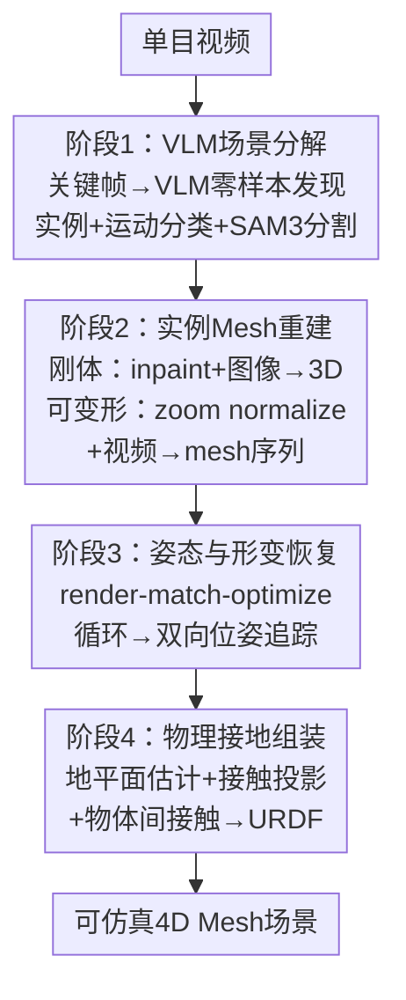

# One Video, One World: Turning Monocular Video into Physical 4D Scenes

**会议**: ECCV 2026  
**arXiv**: [2606.31388](https://arxiv.org/abs/2606.31388)  
**项目主页**: [https://OneVideoOneWorld.github.io](https://OneVideoOneWorld.github.io)  
**代码**: 无  
**领域**: 3D视觉  
**关键词**: 4D重建, 单目视频, 物理仿真, 实例级网格, 训练无关

## 一句话总结
OVOW是首个将单目视频转为实例级、可物理仿真的4D mesh场景的训练无关系统，通过VLM引导场景分解、类别感知网格重建、迭代尺度姿态恢复和物理接地组装四阶段流水线，无需微调即可输出watertight网格实例并直接用于MuJoCo等物理仿真器。

## 研究背景与动机

近年来4D重建在渲染质量上取得了长足进步——从NeRF、3D Gaussian Splatting到动态4D表示，生成的场景已经能做到肉眼难辨真伪。然而这些方法输出的是隐式场、高斯原语或点云，离"能用"还有一道鸿沟：机器人操控、具身AI、游戏引擎等下游应用需要的是watertight（水密）网格、实例分离的独立物体、以及URDF等标准物理仿真接口。当前的4D重建擅长"看起来像"，却不擅长"能用"——在MuJoCo或Isaac Gym里搭不出一个可交互的物理场景。

这个矛盾的核心在于：从单目视频重建可仿真的4D场景需要同时解决场景表示和数据评估两个难题。场景表示方面，基于骨架的方法需要预定义关节拓扑，在复杂形变上容易出现蒙皮伪影，且受限于物体类别。数据评估方面，没有任何数据集将实例级4D网格标注与源视频配对，也没有benchmark能衡量几何精度、实例分离度和物理合理性这些对下游任务至关重要的结构化质量——渲染保真度（PSNR/SSIM/LPIPS）之外的评价几乎空白。这两道门槛导致从视频到物理仿真场景的管线长期不存在。

本文的切入点是：既然预训练的VLM、图像转3D、视频转mesh、视觉几何和位姿追踪等基础模型各自已经足够强，那就不需要训练任何新模块，而是把它们组合成一条完整的流水线。**核心idea：将单目视频转物理4D场景拆为"场景分解→实例重建→姿态恢复→物理组装"四个步骤，全部由现成基础模型以training-free的方式串联，用直接顶点形变（而非骨架/类别先验）统一建模刚性和非刚性运动，最终输出watertight、实例分离、带URDF接口的4D mesh场景。**

## 方法详解

### 整体框架

OVOW的输入是一段单目视频，输出是一个实例级、可物理仿真的4D scene，每个物体带watertight mesh和逐帧6-DoF位姿轨迹。流水线分为四个阶段：首先用VLM对视频做零样本场景分解，自动发现所有实例、命名并分类运动类型；然后对每个实例单独重建watertight mesh（刚体用单帧补全转3D，可变形体用视频重建拓扑一致的mesh序列），同时从场景点云恢复公制尺度；接着通过迭代渲染-匹配-优化循环精确恢复每帧的6-DoF位姿；最后将所有实例在物理接地约束下组装成完整场景，导出为URDF格式。整个过程不涉及任何任务独享的训练。

### 关键设计

**1. VLM引导的场景分解：用多帧视觉语言模型实现零样本实例发现和运动分类**

输入视频上均匀采样3个关键帧，编码为多图prompt送入Qwen3-VL。VLM在单一前向中完成三项任务：开放词汇的物体发现（不依赖预定义类别列表）、为每个实例生成唯一命名标签（`<名词>_<序号>`格式）、运动类别分类（静态/刚体运动/可形变运动），输出结构化JSON记录。有了实例标签后，用SAM3做文本prompt驱动的密集视频分割，输出逐帧二值掩码；面积小于200px的微小实例被丢弃。这里用VLM替代传统预定义类别检测器的关键在于零样本迁移能力——不需要任何标注数据就能在新场景中发现任何物体并理解其运动模式。

**2. 类别感知的实例级网格重建：刚体用单帧补全转3D、可变形体用视频重建拓扑一致序列**

对不同运动类别采用差异化的重建策略。刚体和静态物体：在掩码面积最大的锚帧上，先用FLUX.2对遮挡区域做amodal inpainting（依据VLM的视觉描述补全被遮挡部分），再将完整图像送入前馈式图像转3D模型Hi3DGen生成canonical mesh。可变形物体：提取mask后的视频做zoom normalization（将物体居中缩放到帧的65%大小），再送入Motion324重建拓扑一致的mesh序列——所有帧共享网格拓扑，只有顶点位置随形变变化。这种差异化策略的本质是"刚体用单帧的纹理补全能力，形变体用时序的拓扑一致性"——每种运动类型都用最适合的工具。

**3. 迭代渲染-匹配-优化的尺度与姿态恢复：多视角比对从RGBD精确对齐公制尺度和6-DoF位姿**

独立重建的mesh缺乏公制尺度和全局方向。这是一个精巧的迭代循环：在锚帧上先用FoundationPose从RGBD估计粗略旋转，然后从多个球面视角渲染mesh，用RoMa v2特征匹配器在渲染图和真实RGBD之间建立密集2D-3D对应，再通过PnP-RANSAC和L-BFGS-B联合优化尺度和方向：

$$s^{(n)} = \arg\min_{s} \sum_m w_m \|\bar{\mathbf{q}}_m^{\text{depth}} - s \cdot \bar{\mathbf{q}}_m^{\text{mesh}}\|_2^2$$

其中$\bar{\mathbf{q}}$是中心化坐标，$w_m$是匹配置信度，前5%残差被截断。迭代3次后尺度收敛（IoU-B从0.58提升到0.78）。得到锚帧的精确尺度和方向后，在全部帧上做双向位姿追踪——从锚帧向前后逐帧追踪，追踪失败时fallback到完整重新注册。静态物体锁定在锚帧姿态；可变形物体进一步分解为全局刚体位姿和局部非刚性形变。核心洞察是前馈式mesh重建给出合理形状但缺尺度和方向，而RGBD深度提供了绝对参考——通过render-match-optimize循环在两者间找到最优对齐。

**4. 物理接地场景组装：地平面估计与接触投影确保场景物理稳定**

独立重建的各物体坐标系不同、地面可能倾斜或带偏移，直接组合会出现穿模或悬空。组装分三步：首先从场景级点云中用迭代RANSAC提取候选地平面，选一个最大化"地面上方比率"且最小化"接触距离中位数"的最优平面，用相机朝上先验消解法向量符号歧义，变换到XY平面。然后对每个物体每帧提取底部10%顶点，按重力轴方向做分段接触投影——穿模时上抬、悬空时下放、正常时不动。最后用KD树查询物体间最近表面距离，若小于阈值（场景对角线的3%），已落地的物体表面作为局部地平面，自然处理堆叠配置。整道工序迭代两轮解决级联依赖。场景还附带从视频恢复的HDR环境光，支持导出后的逼真渲染。

### 一个完整示例

假设输入视频中一张桌子上摆着一个旋转的陶瓷碗和一个静止的马克杯。阶段1：VLM从3个关键帧中发现两个实例，命名`bowl_1`和`cup_2`，标记碗为rigid、杯为static，SAM3逐帧分割出两者的掩码。阶段2：对马克杯选掩码面积最大的锚帧，FLUX.2补全杯把后面的遮挡区域，Hi3DGen生成完整杯子的canonical mesh；对碗，提取mask后的视频做zoom normalization，Motion324输出拓扑一致的mesh序列。阶段3：VGGT给出场景点云和稠密深度，在碗的锚帧上render-match-optimize 3轮确定准确尺度和旋转，然后从锚帧向前后双向追踪到每帧；马克杯锁定在锚帧姿态。阶段4：从点云估计桌面平面，将杯子和碗的底部顶点投影到桌面——碗虽然旋转但底部始终接触桌面，最终导出URDF，直接丢进MuJoCo看物理交互。

### 损失函数 / 训练策略

OVOW完全training-free，不涉及任何任务专属的损失函数或训练。所有组件（Qwen3-VL、SAM3、FLUX.2、Hi3DGen、Motion324、VGGT、FoundationPose、RoMa v2）均来自现成基础模型，以上述四阶段流水线组合。

## 实验关键数据

### 主实验

作者构建了首个结构化Video-to-4D基准，包含OVOW-3D-Scene-Bench（120个静态场景）和OVOW-4D-Scene-Bench（120个动态场景），在Objaverse-OA和Poly Haven资产上渲染合成。与现有单帧场景重建方法（CAST、SAM3D、VIGA、MIDI、SceneGen、TabletopGen）对比。

| 数据集 | 指标 | OVOW | 最佳基线 | 提升 |
|--------|------|------|----------|------|
| 3D-Bench | Scene-IoU OBB↑ | 0.218 | 0.216 (MIDI) | +0.9% |
| 3D-Bench | Object-IoU↑ | 0.190 | 0.136 (MIDI) | +39.7% |
| 3D-Bench | PL↓ | 5.70 | 7.90 (CAST) | -27.8% |
| 3D-Bench | N-CLIP↓ | 1.87 | 1.89 (SceneGen) | -1.1% |
| 4D-Bench | Scene-IoU OBB↑ | 0.440 | 0.200 (TabletopGen) | +120.0% |
| 4D-Bench | Object-IoU↑ | 0.210 | 0.174 (MIDI) | +20.7% |
| 4D-Bench | PL↓ | 2.90 | 5.60 (MIDI) | -48.2% |
| 4D-Bench | N-CLIP↓ | 1.43 | 1.54 (SceneGen) | -7.1% |
| 4D-Bench | Time (s/frame)↓ | 3.35 | 103~788 | 快1-2个数量级 |

### 消融实验

| 配置 | IoU-B | 说明 |
|------|-------|------|
| Full (Niter=3, ρ=0.65) | 0.78 | 完整模型 |
| Niter=1 | 0.58 | 仅1次迭代，尺度对齐严重不足 |
| Niter=2 | 0.72 | 2次已恢复大部分精度 |
| Niter=5 | 0.79 | 3次后饱和 |
| ρ=0.55 (zoom ratio) | 0.74 | 物体占比偏小 |
| ρ=0.75 | 0.76 | 占比较大反而略降 |
| τarea=100px | 84.9% valid | 阈值过小引入噪声实例 |
| τarea=400px | 85.7% valid | 阈值偏大漏小物体 |

| 配置 | 仿真稳定性 | 说明 |
|------|-----------|------|
| τcontact=2% | 79.8% | 接触阈值偏严 |
| τcontact=3% (默认) | 82.7% | 最佳 |
| τcontact=4% | 81.5% | 偏宽松 |
| Nasm=1 | 78.9% | 组装只迭代1轮 |
| Nasm=2 (默认) | 82.7% | 足够 |
| Nasm=5 | 82.8% | 再增加几乎无收益 |

### 关键发现

- 流水线各阶段可靠性很高：运动分类准确率95.4%，刚体重建成功率93.1%，可变形体重建88.7%，姿态恢复92.4%，最终有效性86.8%，仿真稳定性82.7%——故障极少跨阶段传播。
- 动态场景上的优势远大于静态场景：4D-Bench上OBB领先120%、Object-IoU领先20.7%、PL仅2.90（基线最低5.60），说明视频时序信息对场景布局和几何精度有决定性帮助。
- 每帧3.35秒的速度比基线方法的103-788秒快1-2个数量级，这是training-free pipeline的核心优势——无需运行扩散采样或逐帧优化。
- 仿真稳定性82.7%说明大多数场景在重力下保持稳定，但近18%仍然出现穿模或散落，主要发生在多物体堆叠配置中。
- 视觉定性对比显示，点云融合方法和单物体视频转mesh方法在参考视角上尚可，但在未见视角或实例分离上显著劣于OVOW。

## 亮点与洞察

- **完全training-free的系统设计**：整条流水线组合了7个以上的基础模型，没有经过任何针对本任务的微调。这既意味着快速部署和零训练成本，也意味着每个模型的失败模式都会向上传播——好在各阶段独立可靠性都超过88%，级联故障不常见。
- **render-match-optimize循环是从粗糙到精确的优雅范式**：前馈式mesh重建给几何形状，RGBD给公制参考，渲染+特征匹配给2D-3D对应，PnP+L-BFGS-B做优化——每一步都不完美，但循环3次后收敛到精确结果。这个范式可迁移到其他需要从粗到精对齐的任务。
- **直接顶点形变 vs 骨架绑定**：不用预定义骨架拓扑或蒙皮权重，直接用每个顶点的位移场表示非刚性形变，消除对物体类别的假设——一只猫、一块布、一团橡皮泥用同一种表示。代价是大尺度形变（如布料展开）可能超出位移容量。
- **物理接地组装的接触投影逻辑简洁有效**：用底部顶点集合的符号距离分段处理穿模/悬空/正常三种情况，KD树查询物体间距离来实现堆叠。不依赖复杂物理引擎求解，在大多数场景下就够了。
- **双用途——既是重建系统也是数据引擎**：OVOW可以把无标注单目视频自动转化为"视频↔4D mesh场景"配对数据，为未来4D世界模型和具身AI提供了可规模化的训练数据来源。

## 局限与展望

- **基础模型依赖**：作为training-free pipeline，OVOW继承了所有底层模型的失败模式——VLM误分类运动类型向下传播，Hi3DGen对高度遮挡（>80%）或罕见类别可能生成低质量mesh，VGGT深度估计误差导致尺度偏差。未来可用置信度感知融合或自一致性检查缓解。
- **物理交互建模有限**：当前只处理重力对齐接触和简单堆叠，不处理铰链关节、形变体间接触、摩擦依赖等复杂物理交互。融入可微物理仿真可进一步丰富能力。
- **挑战性视觉条件**：细长/反光/透明/低纹理物体、运动模糊、剧烈光照变化都会影响分割和深度估计质量。
- **相机运动容忍度有限**：VGGT估计相机运动有一定容忍度，但360度绕行或剧烈抖动会导致点云和深度质量下降。
- **不重建背景**：只处理前景实例，不重建墙壁、地面、户外地形等背景元素。未来可作为扩展方向。
- **极端形变失效**：物体发生拓扑变化（如从包里抽出物体、打碎、倒液体）时，一致mesh拓扑假设被打破，Motion324输出严重伪影。大尺度形变也可能超出顶点位移表示能力。

## 相关工作与启发

- **vs DreamScene4D / 单物体视频转mesh方法**：这些方法参考视角合理但未见视角严重退化，不恢复公制尺度和物体间接触。OVOW的实例分离和物理接地是质的区别。
- **vs 场景级3D重建（CAST/MIDI/SAM3D等）**：基线方法只支持单帧输入、缺乏时序信息，位置布局准确性差。OVOW通过视频级时序一致性和物理接地组装获得更精确的场景布局。
- **vs 点云融合（Depth Anything 3+NKSR）**：融合成单一连续表面，无实例分离、无watertight逐物体拓扑、无物理接地。OVOW的输出直接可做下游仿真。
- **vs 可形变4D重建（4DGS/Motion324）**：这些方法输出渲染原语或单物体mesh，不做场景级组装和instance separation。OVOW在它们的基础上增加了场景组装层。

## 评分

- 新颖性: ⭐⭐⭐⭐½ [首个从单目视频到实例级可仿真4D mesh的完整系统且完全training-free；但各基础模型本身非本文贡献，创新主要在于系统集成和管线设计]
- 实验充分度: ⭐⭐⭐⭐½ [两个合成基准+定量/定性/消融/仿真验证，覆盖主要超参；但基准全部为合成数据，真实场景仅有定性展示]
- 写作质量: ⭐⭐⭐⭐⭐ [管线描述详实、公式和插图配合到位、附录涵盖失败案例和诚实分析，方法论表达清晰]
- 价值: ⭐⭐⭐⭐⭐ [填补了"看起来像"到"能用"的空白，直接服务于机器人/具身AI/虚拟现实，附带的配对数据引擎也为未来4D世界模型提供了可规模化的训练数据来源]

<!-- RELATED:START -->

## 相关论文

- [\[ECCV 2026\] HAT-4D: Lifting Monocular Video for 4D Multi-Object Interactions via Human-Agent Collaboration](hat-4d_lifting_monocular_video_for_4d_multi-object_interactions_via_human-agent_.md)
- [\[ICCV 2025\] Vivid4D: Improving 4D Reconstruction from Monocular Video by Video Inpainting](../../ICCV2025/3d_vision/vivid4d_improving_4d_reconstruction_from_monocular_video_by_video_inpainting.md)
- [\[CVPR 2026\] Inferring Compositional 4D Scenes without Ever Seeing One](../../CVPR2026/3d_vision/inferring_compositional_4d_scenes_without_ever_seeing_one.md)
- [\[ECCV 2026\] Progressive Pose-Guided 4D Animal Reconstruction from Monocular Video](progressive_pose-guided_4d_animal_reconstruction_from_monocular_video.md)
- [\[ICLR 2026\] Contact-guided Real2Sim from Monocular Video with Planar Scene Primitives](../../ICLR2026/3d_vision/contact-guided_real2sim_from_monocular_video_with_planar_scene_primitives.md)

<!-- RELATED:END -->
