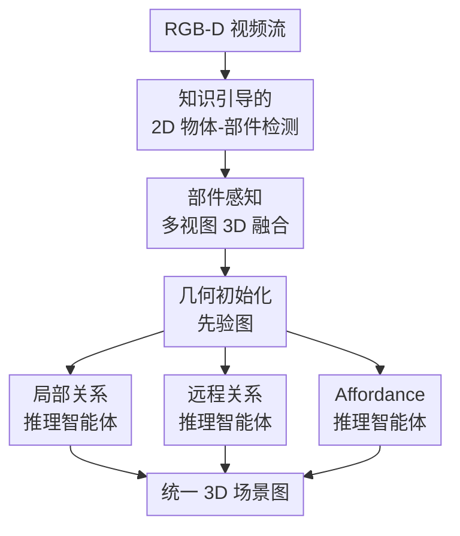

# OP3DSG: Open-Vocabulary Part-Aware 3D Scene Graph Generation for Real-World Environments

**会议**: ECCV2026  
**arXiv**: [2606.29786](https://arxiv.org/abs/2606.29786)  
**代码**: 待确认  
**领域**: 3D视觉  
**关键词**: 3D场景图, 开放词汇, 部件级感知, 具身智能, 多视图融合

## 一句话总结
OP3DSG 提出统一 3D 场景图生成框架，通过知识引导的部件检测、部件感知多视图融合和几何初始化先验图+验证门控 LLM 推理，联合建模物体、交互部件、空间关系、功能关系和 affordance，在自建 UniGraph3D 基准上部件节点召回以绝对优势领先此前方法 31+ 点，并可直接作为机器人问答、导航和任务规划的感知后端。

## 研究背景与动机

3D 场景图为具身智能体提供了持久可查询的"心智模型"，近年借助视觉-语言基础模型和开放集检测器，已推进到开放词汇场景。然而，当前的 3DSG 研究分岔为两条各自残缺的路线：空间 3DSG 以物体为节点、建模空间关系，但缺少对交互部件的感知；功能 3DSG 聚焦于交互部件和功能关系，但缺失了空间结构和物体-部件层级。在实际具身任务中，智能体需要同时理解"微波炉在哪"和"它的按钮怎么按"——但现有工作各自只能回答一半。问题有两个核心难点。第一，部件级开放词汇定位天然比物体级更困难：部件更小、更模糊、严重依赖视角，且在基础模型的物体中心数据分布中被系统性低估——用"椅子腿"提示，CLIP 和 GroundingDINO 几乎总是输出物体级定位。第二，统一化暴增推理空间：一旦部件成为节点，朴素关系预测随节点数平方向爆炸；若对所有候选对做无约束 LLM 推理，不仅计算昂贵，还会产生大量幻觉关系。

**核心 idea：用几何作为强先验使部件级开放词汇推理变得可控——先通过物体-部件知识库强制检测器关注"该有部件的区域"，再以多线索融合（几何+语义+颜色）跨视角稳定关联细小部件，最后用几何初始化的先验图约束 LLM 只验证几何上合理的候选关系，将 LLM 从自由形式生成转变为约束感知精炼。**

## 方法详解

### 整体框架

OP3DSG 是一个训练自由的开放词汇统一 3D 场景图生成 pipeline，分三阶段串行。第一阶段对每帧 RGB-D 输入做知识引导的 2D 检测：用一个开放词汇标签模型检出物体类别，从预编的物体-部件知识库中检索每个物体可能的部件列表，将物体名和部件名拼接成提示词送入开放词汇检测器，获得目标实例的语义标签、掩码和 CLIP 对齐特征。第二阶段是多视图 3D 融合：将各帧检测结果增量集成到全局 3D 地图——物体用几何邻近度+语义相似度做关联，部件额外加颜色分布相似度以稳定跨视角匹配，关联后特征按指数移动平均更新。第三阶段是 LLM 推理：先基于融合后的 3D 地图构建几何初始化的先验图（距离阈值定邻域、词法启发式定物体-部件隶属），再由三个分工的 LLM 智能体并行推理局部功能关系、远程功能关系和 affordance，每步推理受几何锚定验证门控约束，输出统一 3D 场景图。

### 关键设计

**1. 知识引导的检测空间控制：让基础模型看见小部件**

开放词汇检测器在物体级很强，但面对"烤箱按钮""橱柜把手"这类部件提示词时往往滑回物体级定位——其训练数据中部件实例严重不足。OP3DSG 引入一个预先整理的物体-部件知识库，覆盖室内常见物体的交互部件（如烤箱→{烤箱按钮, 烤箱门, 烤箱把手}）。工作流程很直接：先用开放词汇标签模型检出当前帧存在的物体，对每个检出的物体，从知识库中检索其部件列表，将物体名和部件名拼接成提示词送入检测器。这样一来，即使检测器对某些部件"无感"，知识库也强制它在对应区域搜索。同时，物体识别本身仍然是开放词汇的——出现知识库未收录的新物体，检测器正常检出。消融实验显示，去掉知识引导后部件节点召回从 83.6 暴跌至 45.9，且下游关系和 affordance 全面崩溃，说明这是整个 pipeline 中最关键的环节。

**2. 部件感知多视图融合：用颜色分布兜住细小部件**

跨帧关联小部件的难点在于：部件通常体积小、重复度高（同一排按钮），且因其材料一致——颜色和纹理在不同视角下比语义特征更稳定——纹理信息成为更具鉴别力的关联线索。对每个部件掩码，OP3DSG 先去除高光异常像素（HSV 空间中去掉同时过曝且低彩度的点），然后抽取 Color Names、CIELAB a*b*、Opponent 三种互补颜色空间的归一化直方图，用加权卡方距离度量颜色相似度：

$$s^c(i,j) = \frac{1}{1 + w_1^c \cdot d^{\text{cn}} + w_2^c \cdot d^{ab} + w_3^c \cdot d^{\text{opp}}}$$

最终部件的关联相似度是几何+语义相似度与颜色相似度的加权和。消融实验中，去掉颜色特征后部件召回只降约 4 个点，但下游功能三元组和 affordance 下降 10+ 个点——说明即使部件召回变动不大，少量不稳定的部件匹配也会通过错误边在图级推理中被放大。

**3. 几何初始化先验图 + 验证门控多智能体 LLM 推理：不枚举所有节点对**

统一 3DSG 最直接的陷阱是让 LLM 对所有节点对做关系推理——不仅 $O(N^2)$ 枚举昂贵，LLM 还会自信地编造几何上不可能的关系。OP3DSG 的策略是先构造一张几何初始化的先验图：将 3D 中心距离小于 1 米的节点视为邻居，根据相对几何配置分配初始空间关系；对部件节点，只保留其与语义一致物体节点的连接（如"抽屉把手"只连"抽屉"而非附近的"微波炉"）。这张先验图已过滤掉大多数不合理候选。在此基础上，三个并行的 LLM 智能体各自负责一类推理，每步受几何锚定验证门控——先检查标签、包围盒尺寸和 3D 中心坐标以验证候选关系的几何合理性，再做预测。三个智能体分别为：局部关系推理（处理物理连接的目标-部件对，如旋钮→旋转→烤箱）、远程关系推理（处理空间分离但有功能关联的对，如遥控器→控制→电视，只对先验图中标记为"可远程"的候选子集推理）、Affordance 推理（为每个节点预测可行物理交互，部件节点额外参考所属物体标签和几何属性）。消融中将三个角色合并为一个后，功能三元组从 51.1 腰斩至 20.7——单一上下文过长导致 LLM 产生大量幻觉，而分治让每个智能体更聚焦。

### 损失函数 / 训练策略

OP3DSG 无需任何训练，全部使用预训练的开放词汇检测器和 LLM，零样本完成场景图生成。检测器使用在大规模部件数据集上预训练过的开放词汇模型；颜色特征采用经典无参数直方图方法；LLM 推理通过结构化提示完成，无微调。

## 实验关键数据

### 主实验

OP3DSG 在自建 UniGraph3D 基准上评估。该基准合并并扩充了 FunGraph3D 和 SceneFun3D，包含 251 物体节点 / 414 部件节点 / 357 空间边 / 425 功能边 / 554 affordance。

| 任务 | R@3 | R@5 | 最强基线 (OpenFunGraph++ R@3) | 提升 |
|------|:---:|:---:|:---------------------------:|:---:|
| 物体节点 | 84.9 | 93.2 | 62.2 | +22.7 |
| 部件节点 | 83.6 | 86.2 | 51.7 | +31.9 |
| 整体节点 | 84.1 | 88.9 | 55.6 | +28.5 |
| Affordance | 76.7 | 83.2 | 32.1 | +44.6 |
| 功能三元组 | 51.1 | 64.5 | 41.9 | +9.2 |
| 空间三元组 | 52.4 | 66.9 | 44.5 | +7.9 |

### 消融实验

| 配置 | 部件节点 R@3 | 功能三元组 R@3 | 空间三元组 R@3 | Affordance R@3 |
|------|:-----------:|:------------:|:------------:|:-------------:|
| Full | 83.6 | 51.1 | 52.4 | 76.7 |
| w/o 知识引导 | 45.9 | 15.5 | 12.6 | 30.7 |
| w/o 颜色特征 | 79.0 | 40.2 | 41.7 | 64.8 |
| w/o 先验图 | 83.6 | 47.1 | 47.6 | 74.7 |
| w/o 多智能体拆分 | 83.6 | 20.7 | 19.3 | 40.8 |

### 关键发现

- **知识引导是最关键的单点设计**：去掉后部件召回腰斩，并引发蝴蝶效应使下游关系和 affordance 全面不可用。单纯依赖开放词汇检测难以可靠拾取部件，需要先验知识补偿。
- **颜色特征的贡献不在召回而在鲁棒性**：去掉后部件召回仅降约 4 点，但下游三元组下降 10+ 点——少量不稳定匹配通过图中的错误边传播放大。
- **多智能体拆分不可或缺**：合并为一个 LLM 后功能三元组从 51.1 暴跌至 20.7，说明单一上下文过长导致 LLM 大量幻觉，窄范围推理效果更好。
- **部件定位精度仍是开放问题**：在 IoU≥0.25 的严格评估下，OP3DSG 的部件召回仅 13.0，远低于物体级的 61.8。

## 亮点与洞察

- **知识库补偿基础模型的部件盲区**：承认基础模型在部件级天生弱，用常识知识显式弥补，而非期待更强的基座模型自动学会。思路朴素但效果巨大。
- **"几何锚定"是将 LLM 落地 3D 场景推理的关键原则**：让 LLM 在几何先验约束下做验证而非自由生成，比直接放 LLM 自由发挥更可靠——可迁移到任何需要 LLM 理解 3D 空间的任务。
- **分治推理天然适配异构关系**：局部与远程关系所需先验截然不同，分开推理避免上下文混淆，且计算量只随实际候选对而非全节点对的平方增长。

## 局限与展望

- **部件几何定位精度远低于物体级**，在严格 IoU 阈值下大幅落后，这对需要精确空间信息的机器人操作构成瓶颈。
- **知识库依赖人工整理**，当前仅覆盖室内场景常见物体-部件关系，扩展到户外或工业环境需额外标注。
- **无训练 pipeline 上限受限于检测器和 LLM**，极端场景（严重遮挡、极度细小部件）仍可能失败，引入针对部件的微调可能是下一步。
- **实时性未充分验证**：多智能体 LLM 推理在流式场景下的延迟未做量化分析。

## 相关工作与启发

- **vs ConceptGraphs**: ConceptGraphs 也是训练自由开放词汇 3DSG，但完全物体级、无部件节点和功能关系。OP3DSG 通过知识库和颜色融合新增部件感知。
- **vs OpenFunGraph**: OpenFunGraph 关注功能关系但用 VLM 逐节点描述做部件感知，计算量大且小部件召回有限。OP3DSG 用检测+几何锚定代替 VLM 描述。
- **vs KeySG / SceneFun3D**: 这些方法只建模了功能边或空间边之一，OP3DSG 是首个将它们统一在单一图中的框架。

## 评分
- 新颖性: ⭐⭐⭐⭐ 首次提出统一 3DSG 任务定义，将物体-部件层级、功能/空间关系、affordance 统一建模，知识库+几何锚定的组合设计有原创性。
- 实验充分度: ⭐⭐⭐⭐⭐ UniGraph3D 基准构建严谨、消融设计系统、下游机器人任务演示完整，分析深入。
- 写作质量: ⭐⭐⭐⭐⭐ 动机链条清晰，图示直观，实验分析落到具体技术洞察而非泛泛描述。
- 价值: ⭐⭐⭐⭐⭐ 统一场景表示为具身智能提供更完整的感知抽象，有明确工程应用价值（导航/规划/问答）。

<!-- RELATED:START -->

## 相关论文

- [\[CVPR 2025\] Open-Vocabulary Functional 3D Scene Graphs for Real-World Indoor Spaces](../../CVPR2025/3d_vision/open-vocabulary_functional_3d_scene_graphs_for_real-world_indoor_spaces.md)
- [\[AAAI 2026\] Open-World 3D Scene Graph Generation for Retrieval-Augmented Reasoning](../../AAAI2026/3d_vision/open-world_3d_scene_graph_generation_for_retrieval-augmented_reasoning.md)
- [\[ICCV 2025\] Open-Vocabulary Octree-Graph for 3D Scene Understanding](../../ICCV2025/3d_vision/open-vocabulary_octree-graph_for_3d_scene_understanding.md)
- [\[ECCV 2026\] DeWorldSG: Depth-Aware 3D Semantic Scene Graph Generation via World-Model Priors](deworldsg_depth-aware_3d_semantic_scene_graph_generation_via_world-model_priors.md)
- [\[ICLR 2026\] Progressive Gaussian Transformer with Anisotropy-aware Sampling for Open Vocabulary Occupancy Prediction](../../ICLR2026/3d_vision/progressive_gaussian_transformer_with_anisotropy-aware_sampling_for_open_vocabul.md)

<!-- RELATED:END -->
