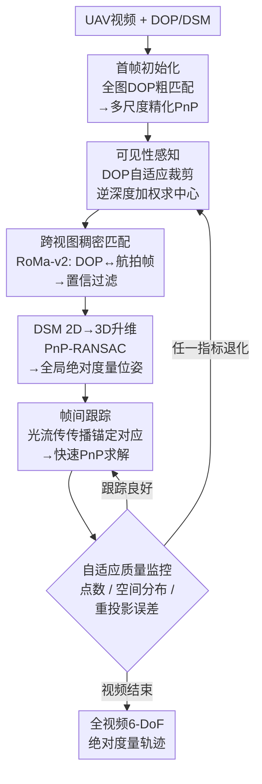

# OrthoTrack: Continuous 6-DoF UAV Trajectory Estimation Anchored in Public Orthophotos

**会议**: ECCV 2026  
**arXiv**: [2606.25245](https://arxiv.org/abs/2606.25245)  
**代码**: [https://github.com/cvg/orthotrack](https://github.com/cvg/orthotrack)  
**项目页**: https://orthotrack.ethz.ch  
**领域**: 3D视觉  
**关键词**: UAV轨迹估计, 正射影像, 稠密匹配, 光流跟踪, 免训练位姿估计

## 一句话总结
OrthoTrack 提出一种免训练的无人机6-DoF连续轨迹估计系统，仅利用公开的正射影像（DOP）和地表模型（DSM），通过"关键帧稠密匹配锚定 + 帧间光流传播"的交替策略，在无需GPS、IMU或后处理对齐的条件下，以实时帧率实现亚米级绝对度量位姿估计，并配套发布了大规模多模态基准 MovingDrone。

## 研究背景与动机

无人机自主飞行在基础设施检测、应急救援和环境监测等任务中高度依赖精确的6自由度（6-DoF）位姿估计。GPS虽能提供粗略的位置信息，但缺少朝向信息，且在城区峡谷等信号遮蔽环境中性能严重退化甚至失效——因此视觉定位方法成为自然且必要的替代方案。然而现有视觉方案各有根本性的局限：视觉里程计和SLAM方法（如ORB-SLAM3、DROID-SLAM）依赖帧间特征跟踪，产生累积漂移，且只输出相对轨迹、缺乏全局尺度和绝对坐标；单帧地理定位方法（如OrthoLoC）利用正射影像（DOP）和数字地表模型（DSM）可获得绝对度量位姿，但稠密跨视图匹配计算开销极大（每帧约需1.4秒），无法满足视频帧率要求，且独立处理每帧意味着孤立离群值无从被时序信息修正。

这一困境的核心矛盾在于：基于地理数据的定位（DOP+DSM）能提供无漂移的绝对锚定，但代价过高无法逐帧执行；VO/SLAM能提供帧率级的连续跟踪，但始终受漂移和尺度不确定性困扰。两者的优势恰好具有互补性——如果能设计一种机制，让地理定位只在少数关键帧上执行作为"锚点"，中间帧则用更轻量的方法维持连续性，就可以同时获得绝对精度和实时帧率。

本文的切入角度正是利用这种根植于问题结构本身的互补性。**核心 idea：将无人机视频位姿估计拆解为"关键帧稠密匹配锚定 + 帧间光流传播"的交替循环——关键帧通过DOP/DSM的跨视图匹配与3D升维获取全局绝对度量位姿，中间帧通过光流传播锚定对应关系以低成本维持连续性，并由自适应质量监控器自动决定何时触发新的关键帧——构成一套无需任何传感器先验、无需训练、无需后处理对齐的实时绝对度量轨迹估计系统。**

## 方法详解

### 整体框架

OrthoTrack 的目标是仅凭无人机视频、相机内参和公开地理数据（DOP+DSM），为每一帧输出全局度量坐标系下的6-DoF位姿。整个系统完全自初始化——首帧通过对全图DOP的低分辨率粗匹配和后续多尺度精化获得初始位姿。之后进入一个闭环循环，系统在两种模式间交替运行：

在**关键帧模式**下，系统首先根据上一帧位姿对DOP进行可见性感知的自适应裁剪（解决倾斜视角导致的视场错位），然后用预训练稠密匹配器（RoMa-v2）在裁剪后的DOP和当前航拍帧之间建立跨视图像素对应，接着将这些对应通过DSM升维为度量3D点，最后经PnP-RANSAC求解全局绝对位姿。在**帧间跟踪模式**下，系统将关键帧建立好的锚定2D-3D对应关系通过光流（Lucas-Kanade）传播到后续帧，对每帧仅需一次轻量PnP求解即可得到位姿，完全避免重复的跨视图匹配。一个自适应质量监控器持续跟踪跟踪点的数量衰减、空间分布和重投影误差，当任一指标退化到阈值以下时自动触发新一轮关键帧定位。

### 关键设计

**1. 可见性感知的正射影像自适应裁剪**

在顺序跟踪的每一轮定位中，系统都需要从全局DOP中裁剪一个局部区域与航拍帧进行匹配。简单的天底正下方裁剪方案在倾斜视角下会完全失效——拍摄到的地面景物实际上偏离相机正下方甚远，裁剪区域与画面内容几乎不重叠。OrthoTrack 利用上一帧的位姿和已知的DSM网格来解决这个问题：将DSM格网点投影到上一帧图像中，用Z-buffer（粗糙深度缓存）剔除被遮挡的点，保留真正可见的点集；对于倾斜视角（倾角>15°），计算这些可见点的逆深度加权平均位置作为裁剪中心。逆深度加权的直觉是：近地面区域在图像中占据最大像素面积，也是匹配器最能分辨细节的区域，而远处的地面只贡献少量像素且可能引入噪声，用权重压低它们的贡献能显著提升匹配质量。对近天底视角（倾角≤15°），深度变化小，直接取可见点的包围盒中心即可。裁剪尺寸与可见点集的投影空间尺度成正比，确保裁剪区域恰好覆盖画面实际看到的地面范围。

**2. 光流传播实现高效帧间跟踪**

稠密跨视图匹配（RoMa-v2）一次推理约需1.4秒，显然无法以帧率运行。OrthoTrack 的核心效率策略是只在关键帧上执行匹配，然后将这些锚定2D-3D对应关系通过光流传播到后续帧。具体而言，设关键帧k建立了对应集C_k = {(u_i^k, X_i)}——每个是航拍图上的2D像素点与其通过DSM获取的度量3D坐标的配对。对后续每一帧t>k，将C_k中每个2D点从上一帧I_{t-1}用光流跟踪到当前帧I_t，并施加前向-后向一致性校验（round-trip位移阈值τ_fb=1.0像素）剔除误匹配。由于3D点X_i被永固地锚定在静态地理坐标系中，传播得到的2D-3D对应可直接送入PnP-RANSAC求解当前帧的全局绝对位姿——不需要再查询地理数据，也不需要任何尺度恢复。实验表明，在30fps输入下帧间位移极小，经典的金字塔Lucas-Kanade光流即可与RAFT、NeuFlow v2等学习型方法达到相当的精度，且速度更快（23.8fps vs 10.0fps），成为最佳精度-速度权衡。这套机制将稠密匹配的调用频率压缩到仅约1%的帧，实现了二十倍以上的加速。

**3. 自适应双阈值重投影关键帧触发**

系统需要一个可靠的机制来决定何时触发新一轮关键帧定位。固定间隔触发的最优间隔随场景内容和飞行速度剧烈变化；固定重投影阈值同样不可靠——新关键帧的匹配质量（初始重投影误差）因场景不同而变化，阈值太紧会导致「刚定位完就重新触发的无休止循环」，太松则漏掉缓慢漂移。OrthoTrack 设计了组合自适应阈值来解决这个困境。第一个是**绝对阈值**，带有一段宽限期：刚完成关键帧定位后，阈值从e_base+δ暂时放宽，然后在G帧内线性衰减到稳态值e_base，避免因新关键帧的高初始重投影噪声误触发回跳。第二个是**相对阈值**，在宽限期结束后生效：它基于当前关键帧的基线误差e_k进行缩放，系数从f_0倍随时间衰减到1+m倍，确保即使重投影误差绝对值很小、但相对增长幅度足够大时也会触发重新定位。两个阈值配合形成了"宽限期防回跳 + 相对值捕慢漂"的自动调节机制——宽限期放过刚锚定时的瞬态波动，衰减中的相对阈值则确保任何累积漂移最终都会被捕捉。12个超参数的单因素扫掠分析显示，所有参数变化对ATE的影响不超过0.26m，说明这套触发机制在实际部署中几乎无需调参。

## 实验关键数据

### 主实验

在本文提出的 MovingDrone 基准（10个测试序列，含5个同区域和5个跨区域测试，共1.3万帧）和真实世界 UAVScenes 基准（20个序列，12万帧，覆盖亚美尼亚和香港）上对比各方法的轨迹估计精度。

| 方法 | 对齐方式 | UAVScenes ATE(m)↓ | MovingDrone ATE(m)↓ | MovingDrone TE(m)↓ | MovingDrone RE(°)↓ | FPS↑ |
|------|---------|-----------------|------------------|------------------|--------------|------|
| ORB-SLAM3 | Sim(3) | 36.90 | 13.14 | 9.11 | 14.30 | 22.3 |
| DROID-SLAM | Sim(3) | 103.96 | 0.34 | 0.22 | 0.47 | 4.7 |
| DROID-SLAM | piecewise锚定 | 8.03 | 0.63 | 0.35 | 0.08 | 4.7 |
| VGGT-SLAM v2 | Sim(3) | 57.17 | 11.94 | 9.28 | 15.88 | 3.1 |
| DA3-Nested | Sim(3) | 58.27 | 2.74 | 1.83 | 2.57 | 11.3 |
| OrthoLoC (单帧) | 无 | 38.24 | 19.78 | 0.50 | 0.08 | 0.5 |
| **OrthoTrack** | **无** | **1.51** | **0.67** | **0.33** | **0.06** | **23.8** |

OrthoTrack 是唯一一个在两个基准上均保持亚米级ATE且无需任何oracle对齐或传感器先验的方法。VO/SLAM方法在高空近平面场景中因视差微弱导致深度塌陷，即便oracle Sim(3)对齐也无法恢复；3D基础模型因局部坐标系依赖相似变换对齐且受航拍视角分布外偏移限制，性能普遍远弱于OrthoTrack。

### 消融实验

| 配置 | ATE(m)↓ | TE(m)↓ | RE(°)↓ | R@1(%)↑ | #KF | FPS |
|------|---------|--------|--------|---------|-----|-----|
| **完整模型** | **0.67** | **0.33** | **0.06** | **90.9** | 15 | **23.8** |
| 仅定位（每帧匹配，无跟踪） | 4.83 | 0.30 | 0.06 | 95.8 | 所有帧 | 1.9 |
| 仅跟踪（首帧锚定后不重定位） | 27.70 | 16.36 | 5.20 | 3.0 | 1 | 13.4 |
| 固定重投影阈值 e=2px | 0.79 | 0.46 | 0.08 | 85.2 | 9 | 21.4 |
| 固定间隔 K=50 帧 | 0.53 | 0.35 | 0.06 | 93.3 | 28 | 19.0 |
| 仅点数触发（无重投影/空间监控） | 1.69 | 0.93 | 0.06 | 61.1 | 4 | 22.5 |
| LK光流（默认） | 0.67 | 0.33 | 0.06 | 90.9 | 15 | 23.8 |
| RAFT光流（学习型） | 0.66 | 0.37 | 0.08 | 91.9 | 10 | 10.0 |
| RoMa v2 Base（弱匹配器） | 0.90 | 0.49 | 0.10 | 86.4 | 13 | 26.3 |
| L2M稠密匹配器 | 6.23 | 0.29 | 0.06 | 94.9 | 15 | 15.0 |

### 关键发现

- **跟踪是效率关键，定位是精度保障**: 去掉跟踪后（逐帧匹配），ATE上升7倍且FPS从23.8骤降至1.9；去掉重锚定后（纯跟踪），ATE进一步飙升到27.70m。两者缺一不可，完整的交替框架将两者优势完美合并。
- **自适应触发 vs 固定间隔**: 固定间隔K=50虽然ATE最低（0.53m），但需28次关键帧（几乎翻倍），且降低输入帧率到2fps后ATE崩塌到12.26m——说明它对运动速度敏感。自适应方案仅需15次关键帧，在不同帧率下均稳定。
- **LK光流与现代学习型光流打成平局**: 30fps下帧间位移极小，加上关键帧复位及时，经典方法足以应对。LK的GPU实现获得23.8fps，远超RAFT的10.0fps，成为最佳精度-速度权衡选项。
- **匹配器鲁棒性极强**: 5种稠密匹配器均实现亚米级TE，即使使用最弱的RoMa v2 Fast变体（ATE 0.88m）系统仍稳健。关键帧仅占约1%帧数，匹配器速度对端到端吞吐影响有限。
- **传感器先验几乎不影响精度**: GPS噪声0-20m、IMU偏航噪声0-30°范围内ATE波动不超过0.1m——先验仅在首帧搜索中辅助DOP裁剪，对后续位姿估计完全无影响。
- **DOP时效性影响显著但良性的**: 14年旧数据中2011年ATE达110m（主要因非几何校正DOP的建筑物透视畸变），但TrueDOP（几何校正）即使在2013年也保持了10.22m ATE。时间相近的TrueDOP是显著优先选择。

## 亮点与洞察

- **"地理锚定+光流传帧"的互补架构是最深刻的洞察**: 最令人印象深刻的设计不是任何一个具体模块，而是认识到DOP+DSM定位和光流跟踪在精度与效率上天然互补——前者提供绝对锚定、后者提供时序效率，且二者分别使用独立的数据通路（地理栅格vs帧间像素运动），组合时不需端到端训练。这类模块化互补组合的思想可以广泛迁移到需要长期稳定跟踪与其他传感器的融合场景。
- **逆深度加权裁剪是一个优雅的工程直觉**: 倾斜视角下DOP裁剪看似一个简单问题，但直接用正下方或简单均值都会产生大量错位。逆深度加权自然地将裁剪中心偏向近地面区域（占最大图像面积），用纯粹的几何推理而非学习解决了"该从地图的哪里裁"的问题。
- **自适应双阈值触发机制的稳健性极具实践价值**: 12个超参数的灵敏度分析显示ATE最大偏差仅0.26m，中位平移误差和召回率几乎不变——这意味着系统的核心性能对参数选择不敏感，在新场景部署时几乎不需要调参，实用性远高于手动调参的方案。
- **MovingDrone数据集的系统化程度极高**: 194个序列、343k帧、21个柏林区域，配以14个年份的多时相DOP、DSM、LiDAR、LoD1/2建筑网格、深度图、法线图等8种模态数据，并带有三类物理驱动的真实感增强（GPS漂移+阵风抖动+速度相关运动模糊），是一个质量极高的标准参考。

## 局限与展望

- **极端倾斜视角（>70°）仍失败**: 此时航拍画面以建筑物立面为主，而DOP只记录屋顶纹理，两者存在根本性的几何不匹配。这是所有正射影像方法的固有限制，作者提及引入倾斜影像数据或侧视辅助图可作为改进方向。
- **高海拔场景（>800m）精度下降**: DOP的0.2m/pxGSD与航拍图像的尺度不匹配成为主要误差源。可考虑基于飞行高度的自适应DOP重采样策略。
- **地理数据覆盖和质量直接影响精度**: 虽然跨地域验证（UAVScenes香港、UAVD4L长沙）展示了可迁移性，但不具备高质量DOP/DSM的区域无法应用。DOP的时效性和几何校正类型（TrueDOP vs 标准DOP）对精度有显著影响。
- **回退机制尚未完善集成**: 对长时间地理数据缺失（如穿越隧道），作者提出了回退到DROID-SLAM的桥接方案（离线双端锚定在15s缺失下ATE仅0.52m），但这一方向的系统集成与在线运行尚未完全实现，引入IMU可进一步提升鲁棒性。
- **MovingDrone为合成数据**: 虽然经过物理增强，但序列轨迹基于设计而非真实飞行记录，极端机动和复杂环境条件可能未被充分覆盖。

## 相关工作与启发

- **vs OrthoLoC (同团队先导工作)**: 两者都使用DOP+DSM进行地理定位。OrthoLoC处理独立单帧、缺乏时序连续性，孤立离群值无法被抑制。OrthoTrack在其基础上引入关键帧-帧间跟踪交替框架，将ATE从19.78m降低到0.67m（~30倍），吞吐从0.5fps提升到23.8fps（~50倍）。
- **vs DROID-SLAM (piecewise锚定)**: DROID-SLAM同样使用地理数据做piecewise Sim(3)锚定（每50帧对齐一次），但由于VO自身在高空近平面场景的深度退化，漂移在两次锚定间持续积累（UAVScenes上ATE 8.03 vs OrthoTrack 1.51m）。OrthoTrack消除了中间的VO层，直接每帧产出绝对位姿，从根本上消除了漂移累积窗口。
- **vs 3D基础模型（DUSt3R / VGGT / DA3）**: 这些模型预测的3D几何在局部坐标系中，需要相似变换才能对齐到地理参考，且训练数据以近景地面视角为主、缺乏高空视点覆盖，导致在航拍域旋转误差严重（如DUSt3R在MovingDrone上RE达81°）。即使oracle Sim(3)对齐，仍无法接近OrthoTrack的亚米级精度。
- **vs LoD-Loc**: 基于CityGML LoD1/2建筑模型的线框/轮廓对齐方法，在建筑密度低的场景退化严重（MovingDrone上仅10m ATE），且不利用密集纹理信息，精度上限低于稠密跨视图匹配方案。但LoD数据具有隐私保护和轻量级等独特优势，在某些应用场景中仍是更好的选择。

## 评分

- 新颖性: ⭐⭐⭐⭐☆ 核心新颖性不在于提出新的算法模块，而在于识别并系统性地利用了两类方法（地理锚定vs时序传播）的互补性；这种视角加上精心设计的交替框架与自适应触发机制具有高度的实用原创性；MovingDrone数据集也是一个高质量的数据贡献
- 实验充分度: ⭐⭐⭐⭐⭐ 覆盖3个跨洲际数据集、12个超参数的灵敏度分析（证明几乎免调参）、5种匹配器×4种光流×多种触发策略×多帧率×地理数据质量的全面消融，每项消融都有明确的因果分析
- 写作质量: ⭐⭐⭐⭐⭐ 方法描述逻辑链条清晰、动机叙述有递进感、消融推理充分且每项都有具体结论和解释，附录补充了丰富的实验细节（传感器噪声、故障模式分析、深度估计基准等）
- 价值: ⭐⭐⭐⭐⭐ 提出了一套无需训练、无需GPS/IMU、仅用公开地理数据即可实时运行的绝对度量位姿估计方案，对无人机自主导航、应急响应等任务具有极高的实用部署价值；模块化设计使其能自然受益于未来稠密匹配器的进展而无需架构改动

<!-- RELATED:START -->

## 相关论文

- [\[ECCV 2026\] AerialMetric: Benchmarking and Adapting UAV Monocular Metric Depth Estimation in the Real World](aerialmetric_benchmarking_and_adapting_uav_monocular_metric_depth_estimation_in_.md)
- [\[CVPR 2026\] Cov2Pose: Leveraging Spatial Covariance for Direct Manifold-aware 6-DoF Object Pose Estimation](../../CVPR2026/3d_vision/cov2pose_leveraging_spatial_covariance_for_direct_manifold-aware_6-dof_object_po.md)
- [\[ICLR 2026\] Trace Anything: Representing Any Video in 4D via Trajectory Fields](../../ICLR2026/3d_vision/trace_anything_representing_any_video_in_4d_via_trajectory_fields.md)
- [\[NeurIPS 2025\] Orientation-anchored Hyper-Gaussian for 4D Reconstruction from Casual Videos](../../NeurIPS2025/3d_vision/orientation-anchored_hyper-gaussian_for_4d_reconstruction_from_casual_videos.md)
- [\[ECCV 2026\] Towards in-the-wild Egocentric 3D Hand-Object Pose Estimation](towards_in-the-wild_egocentric_3d_hand-object_pose_estimation.md)

<!-- RELATED:END -->
