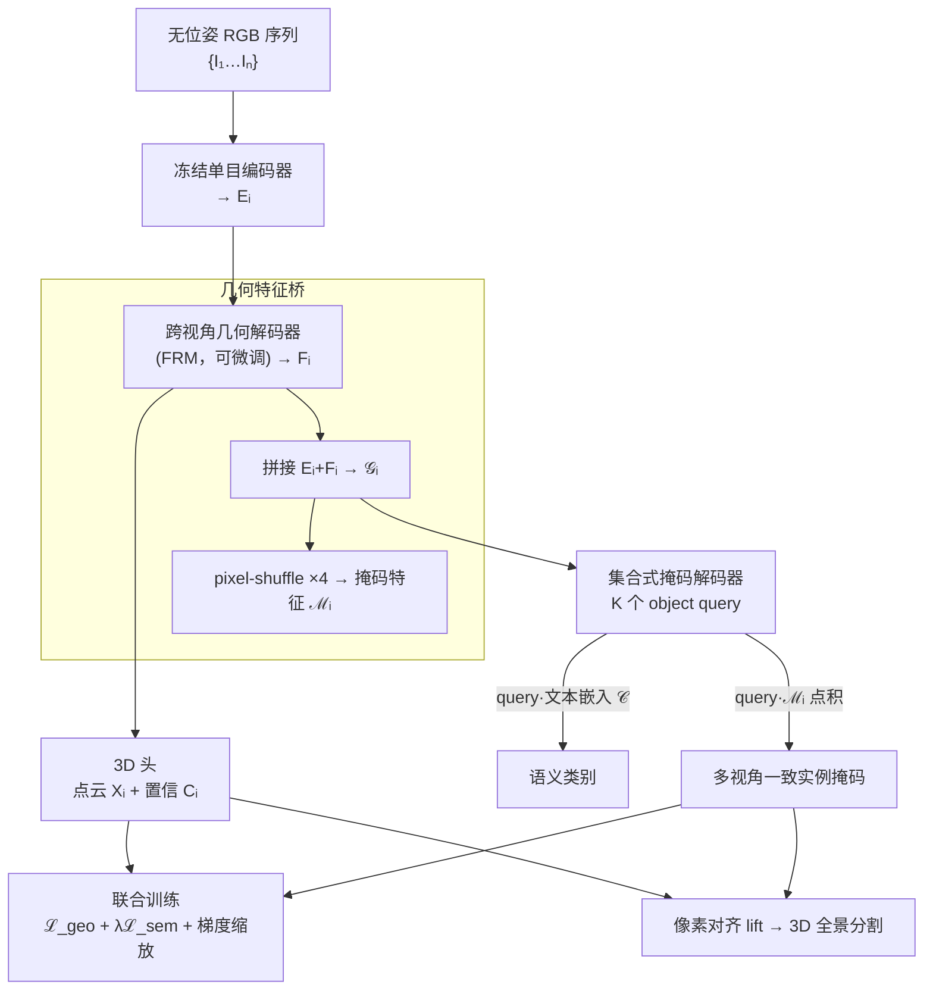

# Pano3D: Unified 3D Reconstruction and Panoptic Segmentation

**会议**: ECCV2026  
**arXiv**: [2606.14307](https://arxiv.org/abs/2606.14307)   
**论文**: [项目主页 victorbbt.github.io/Pano3D](https://victorbbt.github.io/Pano3D)  
**代码**: 项目页（Google DeepMind × École des Ponts）  
**领域**: 3D视觉 / 全景分割  
**关键词**: 前馈式重建, 全景分割, 集合式掩码解码器, 联合训练, 多视角一致性

## 一句话总结
Pano3D 在前馈式 3D 重建模型（FRM，如 MUSt3R / Pi3）后面直接接一个 Mask2Former 风格的集合式掩码解码器，用几何+语义两个损失联合微调几何解码器，第一次做到无需外部 2D 模型、无需聚类后处理就在单次前馈里同时输出稠密点云 + 3D 全景分割，在 ScanNet / ScanNet200 / ScanNet++ 上语义分割 mIoU 大幅超过 SOTA（ScanNet +16.6）。

## 研究背景与动机

**领域现状与已有方法的不干净**：以 DUSt3R / MASt3R / MUSt3R / VGGT / Pi3 为代表的前馈式重建模型（Feedforward Reconstruction Model, FRM）已经证明 Transformer 可以从「无位姿」的一堆 RGB 图直接回归稠密点云（pointmap），不需要相机内外参，打开了统一 3D 场景理解的大门——但这些模型只懂「几何」（where），不懂「语义」（what）。给 FRM 加语义能力的已有做法有两类、都不干净：一类是**冻结骨干、外挂 2D 特征**（PanSt3R 用冻结 MUSt3R + DINOv2 特征、SIU3R 早早分叉几何/语义分支），得靠手工设计的一致性正则或 QUBO 后处理来保证多视角掩码一致；另一类是**加稠密对比头**（UNITE 在 VGGT 上加 DPT 头、IGGT 用 SAM2 特征），推理时还要跑 HDBSCAN 无监督聚类才能把特征聚成实例掩码，聚出来的边界往往很糙。

**核心矛盾**：想要多视角一致的 3D 实例掩码，却又不想引入「聚类 + 后处理 + 外部模型」这套启发式流水线——前者要精确边界和一致性，后者的每个环节都在牺牲精度和端到端可导性。本文的目标就是把 3D 重建和 3D 全景分割做进**同一个可端到端训练的前馈框架**里，彻底去掉聚类和后处理。

支撑这一目标的核心 idea 是一个关键 insight：**「识别物体」的信息其实已经隐含在前馈重建模型内部了**。FRM 的编码器阶段带有单目 2D 信息，跨视角解码器在迭代细化时会去检测空间边界和 3D 结构连贯性，两者一结合就构成对物体的强表征。所以不需要外挂语义模型，只要在 FRM 输出上接一个基于「可学习 query」的集合式全景头（像 Mask2Former），并让语义梯度回流去微调几何解码器，就能原生地、前馈地预测实例掩码和类别——这就是 Pano3D 的 alignment-free（免对齐、免聚类、免后处理）路线。

## 方法详解

### 整体框架

Pano3D 的输入是一组**无位姿、无序**的 RGB 图 $\mathcal{I}=\{I_1,\dots,I_N\}$，输出是稠密点云 + 每个像素的语义类别 + 3D 一致的实例掩码。整条链路可以拆成四块：① 用一个预训练 FRM（MUSt3R 或 Pi3）当几何骨干，冻结其单目编码器、微调其跨视角解码器，产出跨视角一致的几何隐特征 $F_i$，再由 3D 头回归点云 $X_i$ 和置信度 $C_i$；② **几何特征桥（Geometric Feature Bridge）**把冻结编码器特征 $E_i$ 和微调解码器特征 $F_i$ 拼起来、过 MLP，产出供 query 做交叉注意力的 patch 特征 $\mathcal{G}_i$，并经 pixel-shuffle 上采样 4 倍得到高分辨率掩码特征 $\mathcal{M}_i$；③ **集合式掩码解码器**用 $K$ 个可学习 object query 在整段序列上做集合预测，每个 query 追踪一个跨所有视角的 3D 实例，query 与冻结 CLIP 文本嵌入点积得到类别；④ **联合训练**放开几何解码器、让语义梯度回流，几何损失 $\mathcal{L}_{geo}$ 和语义损失 $\mathcal{L}_{sem}$ 一起优化，中间用梯度缩放保护几何。由于掩码和点云像素对齐，直接把掩码 lift 到 3D 就得到 3D 实例分割，全程单次前馈。

### 关键设计

**1. 几何特征桥：把「单目局部」和「跨视角一致」两级特征拼给掩码 query**

痛点是：只用编码器特征，缺乏多视角一致性（消融里 -3 mIoU）；只用解码器特征，几何又会被拉低。作者的观察是「物体表征分布在几何骨干的整个层级里」——编码器（常是自监督预训练的 CroCoV2/DINOv2）带的是**局部单目上下文**，解码器带的是**场景级一致性和几何外观**。所以桥模块对每帧把冻结编码器特征 $E_i$ 和微调解码器特征 $F_i$ **拼接**后过一个 MLP adapter，产出 patch 特征 $\mathcal{G}_i$ 供 query 交叉注意力；再用连续的 pixel-shuffle 把 $\mathcal{G}_i$ 从 stride 16（patch 级）上采样到 stride 4 得到掩码特征 $\mathcal{M}_i$（384×512 输入 → 96×128 掩码）。关键是**不在拼接处 stop-gradient**，于是 $\mathcal{L}_{sem}$ 能通过 $\mathcal{G}_i$ 和 $\mathcal{M}_i$ 两条路直接把梯度送进几何解码器——这是后面「联合训练」能生效的前提。

**2. 集合式全景解码器：一个 query 在整段序列上追一个 3D 实例**

痛点是聚类方法（UNITE/IGGT 靠 HDBSCAN）掩码糙、边界会 bleed 到背景。Pano3D 采用 Mask2Former 的集合预测框架、并按 ODIN 的思路扩展到序列：初始化 $K$ 个可学习 object query $\mathcal{Q}=\{q_k\}$，每个 $q_k$ 当「序列级检测器」——**单个 query 负责在全部 $N$ 张图里追踪同一个 3D 实例**。类别不是普通分类头，而是 query 嵌入与一个**冻结 CLIP 文本嵌入矩阵** $\mathcal{C}$ 做相似度（因此推理时换文本矩阵就能做开放词表查询）。语义损失走标准的二部图匹配（bipartite matching）。因为 Dice loss 直接优化 IoU，掩码边界比聚类方法更「脆」（crisp）、假阳更少——这解释了为什么它 mIoU 的领先幅度比 mAcc 更大（聚类把掩码糊到背景，覆盖了 GT 但假阳多，掉 mIoU 不掉 mAcc）。

**3. 联合训练 + 语义梯度当「隐式物体先验」**

这是全文最反直觉的一点。已有工作要么冻结 FRM、要么加逐像素一致性损失，都是**怕语义训练把几何搞坏**。Pano3D 反着来：**放开几何解码器 $\Phi_{geo}$**，让二部图匹配损失的语义梯度回流进几何特征，网络就学会把像素**聚成离散实体**。总目标是

$$\mathcal{L}_{total}=\mathcal{L}_{geo}+\lambda\mathcal{L}_{sem}$$

作者论证：FRM 被训练成会「丢弃无纹理/反光区的模糊预测」，而语义实例分割恰好能当**隐式物体先验**去缓解这个缺陷——消融显示联合训练对**实例定位**（AP +4.9，15.7 vs 10.8 冻结基线）的提升比对语义还大，说明语义梯度不是单纯灌类别标签，而是在**主动细化 3D 物体边界和多视角一致性**，起到「结构正则」的作用。定性上（Fig.5）联合训练后的模型会把玻璃窗识别为「模糊区」而非当成墙、在阴影/反光的物体中心反而更自信。

**4. 分割梯度缩放：给几何解码器上「保险丝」**

放开几何解码器有风险：作者实测发现**语义梯度的模长通常比几何梯度大一个数量级**，直接回流会过度扰动跨视角解码器的权重。解决办法是先在「不加乘子」时测两者梯度范数之比，然后对**进入几何解码器之前**的分割梯度乘一个常数 $\gamma=0.1$ 缩小。消融（Tab.6）表明这个缩放对分割指标影响很小（mIoU -1），却把几何提上去不少（per-view/multi-view inlier +3%），是几何保真度的安全阀。

### 损失函数 / 训练策略

几何损失 $\mathcal{L}_{geo}$ 是置信度加权的稠密点云回归 $\sum_i\sum_p C_{i,p}\lVert X_{i,p}-\hat{X}_{i,p}\rVert_2 - \alpha\log(C_{i,p})$（具体形式随 FRM 而异：MUSt3R 用参考帧全局点云、Pi3 用尺度不变局部点云+仿射不变位姿）。语义端沿用 Mask2Former 的分类/Dice/BCE 三项，权重 2/2/5；几何损失相对分割整体加权 10 倍。掩码解码器每层都监督 query（更快更稳收敛）。对 **MUSt3R 记忆型骨干**还有专门的两阶段训练（Update 建几何记忆并初始化 query、Render 用同一批 query 状态渲染新帧），两阶段掩码沿视角轴拼起来做**一次**二部图匹配，强制同一 query 在两阶段检测同一实例——这是记忆模型保持实例一致的关键。模型在 TPU v6 上用 AdamW 训练，ScanNet 30k 步、ScanNet200/++ 50k 步。

## 实验关键数据

### 主实验：3D 语义分割（UNITE 协议，仅 RGB 输入）

| 数据集 | 指标 | Pano3D(MUSt3R) | 次优(UNITE) | 提升 |
|--------|------|------|----------|------|
| ScanNet | mIoU₃D | **65.3** | 48.7 | +16.6 |
| ScanNet | mAcc₃D | **76.6** | 68.3 | +8.3 |
| ScanNet200 | mIoU₃D | **24.6** | 14.5 | +10.1 |
| ScanNet++ | mIoU₃D | **29.7** | 21.6(PanSt3R) | +8.1 |

类无关 3D 实例分割上 Pano3D 同样领先，ScanNet 的 AP50 达 38.9（比 UNITE 的 29.6 高 +9.3）。作者点出一个诚实的 caveat：在实例极多的 ScanNet++ 上，Pano3D 的 AP25 反而低于 UNITE——因为 AP25 奖励「检出更多小物体但精度可放松」，聚类法能在 3D 里找小簇多检出，而 query 法一旦漏检就漏了；「检出的更准，但数量多时会漏」。

在 IGGT 的**体素化联合评测**（几何+语义同时算对才算 TP）上：换更强的 Pi3 骨干后，Pano3D(Pi3) 在 ScanNet++ 取得 2D mIoU 52.5 / 3D mIoU 29.5，几何 AbsRel 2.44 与 IGGT(2.61) 相当甚至更好，说明「更强的 FRM 天然产出更利于分割的特征」。

### 消融实验（ScanNet 验证集）

| 配置 | mIoU₃D | AP₃D | AbsRel↓ | 说明 |
|------|--------|------|---------|------|
| Frozen Geo + Sem Head | 61.9 | 10.8 | 5.2 | 冻结骨干，只训语义头 |
| FT Semantics Only | n/a | n/a | **156.3** | 只训语义→几何空间彻底崩坏 |
| Pano3D (G+S 联合) | **65.3** | **15.7** | 3.5 | 联合训练，几何保真+实例定位双升 |
| 仅编码器特征 Eᵢ | 60.4 | 7.8 | 3.4 | 缺跨视角一致性，-3 mIoU |
| 仅解码器特征 Fᵢ | 63.8 | 13.9 | 3.7 | 几何细化能力下降 |

### 关键发现
- **联合训练贡献最大**：只训语义会让 AbsRel 从 3.5 飙到 156.3（几何完全崩），而 G+S 联合既保住几何又把 AP 从 10.8 提到 15.7——证明语义梯度是「隐式结构正则」，主要帮的是**实例定位**而非语义分类。
- **特征桥两级缺一不可**：只用编码器特征掉多视角一致性（-3 mIoU），只用解码器特征掉几何——拼接才两全。
- **梯度缩放是几何保险丝**：$\gamma=0.1$ 时分割仅 -1 mIoU，几何 inlier +3%；不缩放（1.0）其实分割/几何都还行，但作者为几何稳健性保守选 0.1。
- **损失配比敏感**：几何权重太弱（$\lambda_{geo}=\lambda_{sem}$）几何语义双输；太强（20×）几何微增但语义掉——10× 是甜点。
- **query 数随类别数增**：ScanNet++（类多、每场景实例多）用 200 query 优于 100，加到 400 收益递减（饱和）。

## 亮点与洞察
- **「重建模型里已经藏着物体识别」这个 insight 很漂亮**：它把「加语义」从「外挂一个语义系统」重构成「唤醒骨干里已有的物体表征」，直接砍掉了聚类+后处理+外部 2D 模型整条启发式流水线。这是可复用的思路——凡是「大模型内部隐含某种结构、但被下游用聚类硬提」的场景，都可以试试改成「接可学习 query + 让任务梯度回流唤醒」。
- **反常识地放开几何解码器**：所有同行都在「保护几何、冻结骨干」，本文反而证明「让语义梯度进来微调几何」不仅不坏几何，还因为物体先验让几何更好（无纹理/反光区更鲁棒）。这提示「多任务不是零和」。
- **一个 query 追一个 3D 实例 + 像素对齐 lift**：实例的多视角一致性不靠显式一致性损失或 QUBO，而是「集合预测 + 单次二部图匹配」原生保证，工程上极简。
- **梯度范数量级诊断**：先 log 两个任务的梯度范数、发现差一个数量级、再据此设缩放因子——这种「先测量再对症」的多任务平衡做法很实用，可迁移到任何几何/语义、密集/稀疏混合训练。

## 局限与展望
- **拥挤场景 query 会「粘连」**（作者承认，Fig.6）：物体多时会把两把椅子/两张桌子并进同一个掩码，实例数一大就漏检——这是 query-based 检测的固有缺陷，实例极多时不如聚类法能捞小簇。
- **几何被语义轻微拖累**：联合训练下 per-view 深度略降（预测有点糊），虽然场景级 MVD 反而更好，但绝对几何精度仍低于「只训几何」的原始 FRM；且 MUSt3R 骨干（450M）本身弱于 VGGT（1B+），几何精度受骨干规模制约。
- **域泛化有限**：只在室内 ScanNet 系训练，室外/OOD 类（如「tree」「person」）会失败，开放词表只在「离训练集不太远」时管用。
- **仍是「微调已有几何骨干」**：作者自己指出，理想应从头就联合训练几何+语义的基础模型；当前是把语义嫁接到 geometry-first 骨干上的过渡形态。改进方向：更大更强的 FRM 骨干 + 更大规模多样词表数据 + 针对拥挤场景的 query 去重/增数机制。

## 相关工作与启发
- **vs UNITE**：UNITE 在 VGGT 上加稠密 DPT 头、蒸馏大量教师信息（实例/语义/关节），推理靠对比聚类（HDBSCAN）。Pano3D 直接用集合式解码器优化目标任务、无需聚类——所以掩码更脆、mIoU 领先幅度（+16.6）远大于 mAcc（聚类掩码 bleed 到背景，假阳多）。
- **vs PanSt3R**：PanSt3R 在**冻结** MUSt3R 上放 Mask2Former 头 + DINOv2 特征 + QUBO 后处理，还要选「记忆帧」子集。Pano3D 的全局 query 关注**整段序列**、且**微调**几何解码器——全场景覆盖、多视角信息更一致，静态选帧会漏掉未选视角里的物体。
- **vs IGGT**：IGGT 用 SAM2 特征、开放词表、推理时聚类+重投影 2D+调外部语义模型，流水线重且非纯前馈。Pano3D 是纯前馈单次推理，in-domain 训练在语义上更强，但 IGGT 的开放词表泛化更广。
- **vs ODIN（2-stage：先重建再分割）**：把 MUSt3R 预测的噪声点云喂给 SOTA 的 ODIN 做 3D 分割，mIoU 只有 39.2（ODIN 用 GT 深度时 69.3），因为噪声点云建立不起可靠的 3D 邻域对应；而 Pano3D 端到端做到 56.1——证明「重建-分割解耦」在无位姿噪声下会崩，联合前馈才对。

## 评分
- 新颖性: ⭐⭐⭐⭐⭐ 「FRM 内部已隐含物体识别→接 query 让语义梯度回流唤醒」的 insight 干净有力，反常识地放开几何解码器且证明多任务互益。
- 实验充分度: ⭐⭐⭐⭐⭐ 两套评测协议（UNITE mesh + IGGT voxel）、三数据集、两种骨干（MUSt3R/Pi3）、丰富消融（训练机制/特征桥/损失配比/梯度缩放/query 数/2-stage 对比），且诚实报告 AP25 落后等 caveat。
- 写作质量: ⭐⭐⭐⭐ 结构清晰、动机层层递进、图文对应好；公式和附录充分，个别记忆模型两阶段细节偏密需对照图看。
- 价值: ⭐⭐⭐⭐⭐ 把 3D 重建与全景分割统一进单次前馈、SOTA 大幅领先，且指出「未来基础模型应从头联合训练几何+语义」的方向，对统一 3D 场景理解有推动力。

<!-- RELATED:START -->

## 相关论文

- [\[ICML 2026\] EPS3D: End-to-End Feed-Forward 3D Panoptic Segmentation](../../ICML2026/3d_vision/eps3d_end-to-end_feed-forward_3d_panoptic_segmentation.md)
- [\[ICCV 2025\] PanSt3R: Multi-view Consistent Panoptic Segmentation](../../ICCV2025/3d_vision/panst3r_multi-view_consistent_panoptic_segmentation.md)
- [\[AAAI 2026\] UniC-Lift: Unified 3D Instance Segmentation via Contrastive Learning](../../AAAI2026/3d_vision/unic-lift_unified_3d_instance_segmentation_via_contrastive_learning.md)
- [\[ICLR 2026\] FastAvatar: Towards Unified and Fast 3D Avatar Reconstruction with Large Gaussian Reconstruction Transformers](../../ICLR2026/3d_vision/fastavatar_towards_unified_and_fast_3d_avatar_reconstruction_with_large_gaussian.md)
- [\[CVPR 2026\] OnlinePG: Online Open-Vocabulary Panoptic Mapping with 3D Gaussian Splatting](../../CVPR2026/3d_vision/onlinepg_online_open-vocabulary_panoptic_mapping_with_3d_gaussian_splatting.md)

<!-- RELATED:END -->
