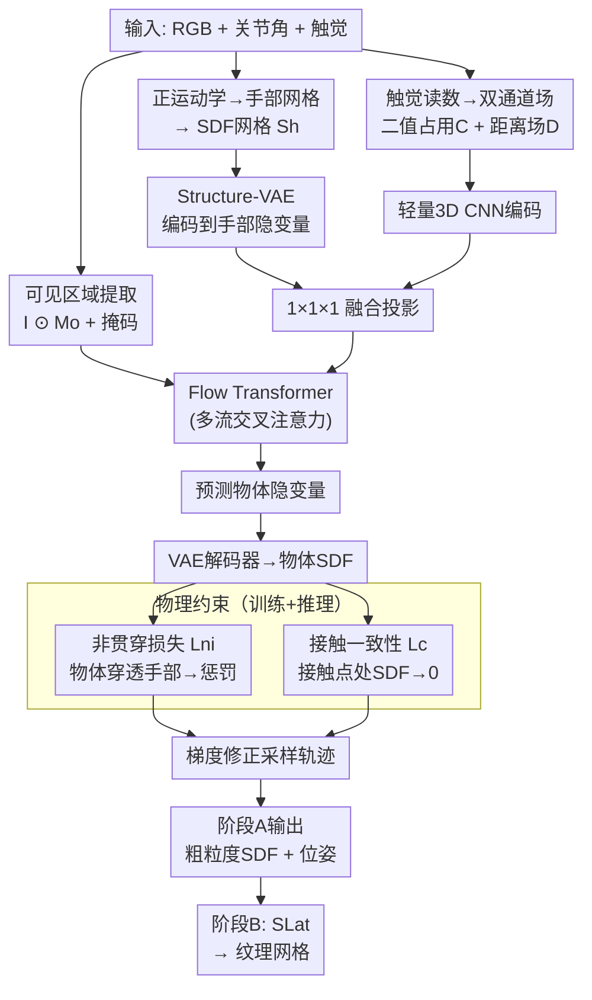

# Physically Grounded 3D Generative Reconstruction under Hand Occlusion using Proprioception and Multi-Contact Touch

**会议**: ECCV 2026  
**arXiv**: [2604.09100](https://arxiv.org/abs/2604.09100)  
**代码**: [https://github.com/hsp-iit/physical-generative-reconstruction](https://github.com/hsp-iit/physical-generative-reconstruction)  
**领域**: 3D视觉  
**关键词**: 手部遮挡重建, 触觉感知, 流匹配扩散, 物理约束, 本体感知  

## 一句话总结
本文融合单目RGB视觉、本体感知（手部姿态）和多点触觉，在流匹配扩散框架下生成严重手部遮挡下的公制尺度物体SDF，并通过非贯穿与接触一致性两项物理损失同时在训练和推理采样阶段引导形状重建，使输出在物理上可行且位姿隐式估计。

## 研究背景与动机

机器人抓取和操作中，物体几何信息对规划控制至关重要——它决定了稳定接触点的选取、碰撞避免的自由空间以及后续动作的精确编排。然而，恰恰在几何信息最为关键的时刻，视觉信号最不可靠：抓取和手内操作时手部严重遮挡物体，单目RGB重建从根本上就是一个病态问题。近年来基于扩散和流匹配的3D生成模型在单视图三维推理上取得了长足进步，它们学习了强大的形状先验，但在重度遮挡下，纯视觉驱动的方法会产生违反物理可行性的输出——物体穿透手部、真实接触区域缺失、尺度漂移，这类重建对机器人控制毫无用处。Amodal3R和Sam3D虽然通过前景掩码建模了部分遮挡，但本质上仍在做"视觉补全"，没有引入任何物理证据来消除歧义。

一个自然却尚未被充分利用的思路是：操作过程本身就在持续产生物理证据。本体感知（proprioception）通过关节角度精确给出手部在空间中的姿态和几何，触觉传感器指示表面一定经过了哪些位置，而手部几何本身则约束了物体不可能出现在哪里——这些交互信号恰恰在视觉最模糊的地方提供了最直接的几何约束。尽管触觉感知在机器人领域已被广泛用于物体属性估计、位姿估计和抓取鲁棒性提升，但现有3D生成方法几乎从不将这些线索整合为显式的几何约束来驱动密集三维重建。它们针对的是完全可见或轻微遮挡的物体场景。

本文的核心洞察是：手部遮挡下的3D重建本质上是一个受物理约束的生成推理问题，而非单纯的视觉补全。**核心 idea：将物体几何表示为与手部共享同一相机对齐3D网格的有符号距离场（SDF），在Structure-VAE隐空间上训练条件流匹配扩散模型，以RGB可见证据、手部SDF隐变量和多点触觉编码为条件进行生成，并用非贯穿和接触一致性两项物理损失同时在训练和推理采样阶段以梯度方式引导重建，从而得到公制尺度、物理可行的三维形状和位姿。**

## 方法详解

### 整体框架

本文将手内物体重建拆为两阶段。Stage A是核心贡献所在：给定单目RGB图像、手部关节角度和指尖触觉读数，输出一个与相机对齐的粗粒度物体SDF（隐式包含公制尺度和位姿）。Stage A内部由一个Structure-VAE（将SDF网格压缩为紧凑隐空间）和一个条件流匹配扩散模型（在隐空间上生成）构成。扩散模型先在无遮挡的纯物体渲染图上预训练学习形状先验，再在仿真抓取场景上微调——微调时额外以可见区域图像、遮挡掩码、手部SDF隐变量和触觉编码为条件。微调和推理阶段均施加两项物理损失。Stage B是SLat风格的细化模块（可选），将Stage A的粗SDF进一步精化为带纹理的三角网格。

### 关键设计

**1. 相机对齐SDF表示：统一视觉、本体与触觉的共享空间**

为将RGB图像、手部几何和触觉接触点对齐到同一个3D物理空间，本文定义了一个与相机视图对齐的笛卡尔网格：网格+z轴与渲染相机视线方向一致，物体SDF $S_o$ 和手部SDF $S_h$ 均在该网格上计算。这使得2D证据与3D表示天然一致——沿z轴投影SDF即对应条件图像，避免了坐标变换歧义。网格分辨率64³，覆盖范围归一化到 $[-1,1]^3$。数据生成时对物体SDF施加随机相似变换（缩放0.5~1.0 + 面内平移），使其位置和尺度与抓取场景一致（抓取场景中物体位置由真实尺度和手-物相对位姿决定，并非居中），增强了模型对不同物体-网格相对位置的适应性。

**2. Structure-VAE：可微、几何感知的SDF隐空间**

直接对64³网格进行生成建模效率低且缺乏平滑性。本文用3D卷积VAE将SDF编码为紧凑隐变量 $\mathbf{z}$。除L1重建和KL散度外，引入两项几何正则：Eikonal Loss $\mathbb{E}(||\nabla\hat{S}||_2 - 1)^2$ 迫使梯度范数处处为1（SDF的固有性质），法向一致性损失促进预测表面法向与真值在近表面窄带内对齐。这两项保证了解码SDF的正确几何性质，为后续基于梯度的物理引导（需要计算 $\nabla_{\mathbf{x}}E$）奠定了可微基础。

**3. 多模态条件注入：手部几何提供全局约束、触觉提供局部精修**

微调阶段的扩散模型接收三类条件。视觉条件：可见区域图像 $I_o = I \odot M_o$ 和遮挡掩码 $(M_o, M_h)$，遵循Amodal3R的做法。本体条件：手部SDF $S_h$ 经共享的Structure-VAE编码器得到手部隐变量 $\mathbf{x}_{0,h}$，编码了手部在共享网格中的完整几何。触觉条件：双通道3D张量 $T=[C,D]$，C是二值接触占用网格，D存储每个体素到最近接触点的距离。D的设计巧妙——它将稀疏离散的二值接触信号弥散为连续的平滑场，使梯度可传播到未接触的体素，大幅降低了学习难度。$T$ 经轻量3D CNN编码后与 $\mathbf{x}_{0,h}$ 通过 $1\times1\times1$ 卷积融合，结果被分片(tokenize)为token，通过额外的交叉注意力流输入去噪器。

**4. 物理引导训练与推理：让生成遵循不可碰和必须碰两条约束**

这是本文最核心的技术贡献，双层设计覆盖了训练和推理两个阶段。

训练时，在标准流匹配回归损失 $\mathcal{L}_{FM}$ 外增加两项从解码SDF上计算的物理损失。非贯穿损失 $\mathcal{L}_{NI}$：对物体在手部体积内部的SDF值施以饱和函数 $\psi_\tau(s)=\tau\tanh(\text{ReLU}(s)/\tau)$ 平滑化（防止深度穿透产生不稳定梯度），再取平均值。接触一致性损失 $\mathcal{L}_{C}$：直接在接触体素处惩罚 $|\hat{S}_o(\mathbf{x})|$，迫使重建表面穿过接触点。两项损失按 $(1-t)^2$ 对扩散时间步t降权——早期预测高度噪声，物理约束尚不适用。

推理时，同样的物理损失以解码器梯度引导的形式注入采样过程。对当前隐变量 $\mathbf{x}_k$ 解码得 $\hat{S}_o$，计算物理能量 $E = \lambda_{NI}\mathcal{L}_{NI} + \lambda_C\mathcal{L}_C$ 对 $\mathbf{x}_k$ 的梯度 $\mathbf{g}_k = \nabla_{\mathbf{x}_k} E$，用指数移动平均更新控制项 $\theta_{k+1} = \beta\theta_k + \eta\mathbf{g}_k$ 并加入速度场：$\mathbf{x}_{k+1} = \mathbf{x}_k - \Delta t_k (\mathbf{v}_\vartheta + \theta_k)$。梯度归一化和信任域约束确保引导不会偏离流匹配先验太远。

### 损失函数 / 训练策略

VAE训练目标：
$$\mathcal{L}_{VAE} = \lambda_{L1}\mathcal{L}_{L1} + \lambda_{eik}\mathcal{L}_{eik} + \lambda_n\mathcal{L}_n + \lambda_{KL}\mathcal{L}_{KL}$$

流匹配微调总损失（含物理项）：
$$\mathcal{L} = \mathcal{L}_{FM} + \lambda_{NI}\mathcal{L}_{NI} + \lambda_C\mathcal{L}_C$$

其中 $\lambda_{NI}$ 从零逐步预热（warm-up），$\lambda_C$ 固定。推理引导使用相同系数。

## 实验关键数据

### 主实验

在YCB数据集36个物体的仿真抓取场景上测试，按遮挡程度分5个bin（B1最轻~B5最重），与Amodal3R（同架构纯视觉基线）和Sam3D（更强单图3D基线）对比。

| 指标 | 方法 | B1 (低遮挡) | B3 (中遮挡) | B5 (高遮挡) | All |
|------|------|-------------|-------------|-------------|-----|
| CD ↓ | Amodal3R | 0.126 | 0.212 | 0.439 | 0.188 |
| | Sam3D | 0.020 | 0.034 | 0.153 | 0.039 |
| | **本文** | **0.021** | **0.027** | **0.109** | **0.033** |
| NC ↑ | Amodal3R | 0.704 | 0.644 | 0.602 | 0.669 |
| | Sam3D | 0.837 | 0.081 | 0.732 | 0.803 |
| | **本文** | **0.868** | **0.834** | **0.803** | **0.844** |
| Voxel IoU ↑ | Amodal3R | 0.386 | 0.302 | 0.262 | 0.339 |
| | Sam3D | 0.558 | 0.490 | 0.337 | 0.504 |
| | **本文** | **0.616** | **0.576** | **0.532** | **0.586** |

位姿估计方面，本文在3D IoU（0.53 vs 0.406）和ADD-S@0.1（0.73 vs 0.658）上全面超越Sam3D。真实机器人迁移实验中，本文CD 0.035、NC 0.903、Voxel IoU 0.648，同样优于Sam3D的0.037、0.888、0.510。

### 消融实验

| 配置 | CD ↓ | NC ↑ | Voxel IoU ↑ | 说明 |
|------|------|------|-------------|------|
| Vision-Only | 0.142 | 0.696 | 0.357 | 纯视觉，等同Amodal3R信息量 |
| No-Touch (有本体) | 0.085 | 0.760 | 0.430 | 加手部几何后大幅提升 |
| 训练去掉物理损失 | 0.052 | 0.774 | 0.487 | 物理损失是关键组件 |
| 推理去掉引导 | 0.036 | 0.811 | 0.530 | 引导贡献相对有限 |
| 仅二值接触 | 0.046 | 0.798 | 0.505 | 距离场补充重要 |
| 仅距离接触 | 0.037 | 0.816 | 0.532 | |
| **本文完整** | **0.033** | **0.844** | **0.586** | |

### 关键发现

- 本体感知（手部几何）带来的提升远大于触觉：No-Touch相比Vision-Only的CD降幅达40%（0.142→0.085），而完整模型在此基础上又从0.085降至0.033。手部几何提供大范围形状约束，触觉提供局部接触精修。
- 训练阶段的物理损失是决定性组件：去掉后CD从0.033升至0.052（增57%），各项指标全面退化。推理时的引导贡献虽正面但幅度小得多，说明模型在训练中已将物理偏好内化。
- 模型对运动学噪声敏感、对触觉噪声较鲁棒：5mm运动学误差使CD升至0.042，而触觉5mm噪声仅升至0.036——这与64³网格约3cm的体素尺寸一致，触觉噪声可被量化效应部分吸收。
- 真实场景性能略低于仿真（CD 0.035 vs 0.033），主要瓶颈来自手眼标定和正运动学误差。消融中运动学噪声的敏感度解释了这一差距。

## 亮点与洞察

- 物理约束的双层设计（训练损失+推理引导）是最亮眼之处：训练决定模型能力上限，推理在固定模型基础上精调——二者互补，消融也印证了这一设计合理性（训练物理损失作用远大于推理引导）。
- 触觉双通道编码（二值占用+距离场）很巧妙：C提供稀疏但精确的表面约束，D将其弥散为连续的平滑信号，让梯度可传播到全身。两者消融显示结合优于任何单独使用，D贡献更大。
- 与手部共享相机对齐3D网格使位姿被隐式估计，无需额外位姿回归头——巧妙利用了机器人操作场景中手眼标定天然可用的特性，是"任务驱动的表示设计"的好范例。
- 虽然Stage B仅简单适配SLat而非本文贡献，但整个管线设计清晰体现了"物理推理→视觉细化"的解耦哲学，便于替换下游细化模块。

## 局限与展望

- 对手眼标定精度敏感：运动学5mm误差即造成可感知的性能下降，在低成本或未标定的机器人平台上可能更严重。作者坦承这是Sim2Real差距的主要来源。
- 64³固定网格限制了薄壁结构和凹陷细节，物体与手部共享网格时有效分辨率更低。可考虑自适应稀疏体积或八叉树表示。
- 多流交叉注意力效率较低：Stage A推理在A6000上约11s（H200约5s），约为Sam3D的2倍。当前推理时间和性能间需进一步权衡。
- 数据集全为合成场景，真实场景仅验证5个YCB物体。作者注意到更丰富、更多样的物体-交互数据集是未来方向，进一步可扩展到摩擦、柔顺等物理属性的触觉推理。

## 相关工作与启发

- **vs Amodal3R**: 共享TRELLIS架构的隐空间扩散模型。本文通过本体+触觉+物理损失的完整配置，在重度遮挡下CD从0.188降至0.033（降幅82%）。对比明确显示纯视觉在严重手部遮挡下能力有天花板，物理交互信号是关键增量。
- **vs Sam3D**: Sam3D是更强的单图3D基线（更大模型+更大数据+深度点图）。本文在无深度输入下YCB指标全面胜出，位姿估计3D IoU从0.406提升至0.53。本文Stage A输出也可替代Sam3D的几何模块，说明两方法具有互补性。
- **vs TouchSDF / NeuralFeels**: 纯触觉方法需要主动探索多步接触才能逐点构建形状。本文将触觉融入生成框架，单帧即可完成重建——在全局形状先验提供粗结构的前提下，触觉只做局部精修，效率和数据需求都更合理。
- **vs FollowMyHold / EasyHOI**: 这些为人手操作设计的方法推理需分钟级（>10min/sample），本文仅数十秒。在DexYCB上本文重建率达99%（vs 58%和30%），且无需为机器人手做针对性适配，展示了跨具身的泛化能力。

## 评分

- 新颖性: ⭐⭐⭐⭐⭐ 将物理约束同时注入训练与推理引导的3D生成方法在机器人操作场景中首次被完整提出，触觉距离场编码方式也极具巧思
- 实验充分度: ⭐⭐⭐⭐ 消融实验完整（传感模态/噪声鲁棒性/训练推理组件独立消融），但真实场景仅有5物体，且仿真数据全为合成
- 写作质量: ⭐⭐⭐⭐⭐ 方法描述精准，公式编号规范，消融逻辑链完整，Limitations部分坦诚清晰
- 价值: ⭐⭐⭐⭐⭐ 为遮挡下3D重建开辟了"物理引导生成"的新方向，对机器人操作和触觉感知两个领域均有重要启发

<!-- RELATED:START -->

## 相关论文

- [\[CVPR 2026\] PhyGaP: Physically-Grounded Gaussians with Polarization Cues](../../CVPR2026/3d_vision/phygap_physically-grounded_gaussians_with_polarization_cues.md)
- [\[CVPR 2026\] Artiverse: A Diverse and Physically Grounded Dataset for Articulated Objects](../../CVPR2026/3d_vision/artiverse_a_diverse_and_physically_grounded_dataset_for_articulated_objects.md)
- [\[CVPR 2025\] Generative Multiview Relighting for 3D Reconstruction under Extreme Illumination Variation](../../CVPR2025/3d_vision/generative_multiview_relighting_for_3d_reconstruction_under_extreme_illumination.md)
- [\[CVPR 2025\] Touch2Shape: Touch-Conditioned 3D Diffusion for Shape Exploration and Reconstruction](../../CVPR2025/3d_vision/touch2shape_touch-conditioned_3d_diffusion_for_shape_exploration_and_reconstruct.md)
- [\[ECCV 2026\] Towards in-the-wild Egocentric 3D Hand-Object Pose Estimation](towards_in-the-wild_egocentric_3d_hand-object_pose_estimation.md)

<!-- RELATED:END -->
