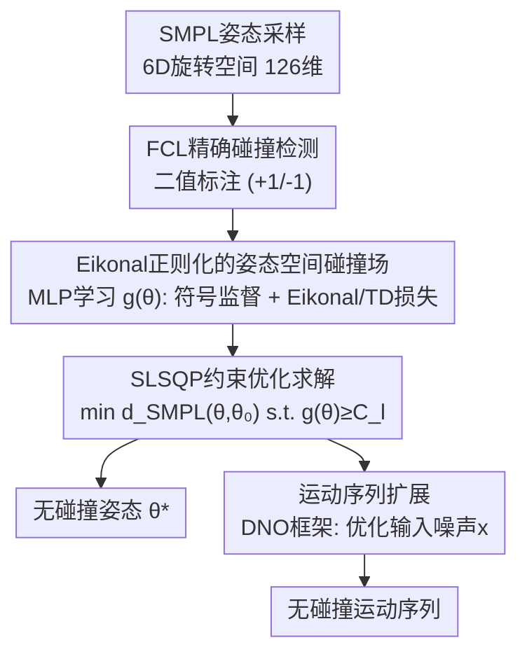

# PoseShield: Neural Collision Fields for Human Self-Collision Resolution

**会议**: ECCV 2026  
**arXiv**: [2606.29686](https://arxiv.org/abs/2606.29686)  
**代码**: 无  
**领域**: 3D视觉  
**关键词**: SMPL自碰撞消除、神经碰撞场、Eikonal正则化、约束优化、人体运动生成

## 一句话总结
PoseShield 在 SMPL 姿态空间内学习一个带 Eikonal 正则化的神经碰撞场（近似姿态空间 SDF），将其作为可微约束函数嵌入 SLSQP 等梯度约束优化器中，实现从自穿透姿态到最近无碰撞姿态的后处理修正；该方法无需重训下游运动生成模型即可扩展到运动序列碰撞修正，在自建 HwC 数据集上达到 95.8% 的成功率，远超 COAP（44.6%）。

## 研究背景与动机

**领域现状**：SMPL 参数化人体模型是人姿态估计和运动生成的标准几何表示，但无论从单目重建（PROX 等数据集广泛存在自穿透）还是随机运动合成（MDM、MoMask 等扩散模型输出），生成的人体网格频繁出现自碰撞，破坏物理合理性。现有后处理碰撞修正方法分为两类：一类在网格空间操作（惩罚能量、内点方法），需要提供无碰撞参考位形且优化变量是顶点而非姿态参数，无法直接嵌入基于 SMPL 的学习管线；另一类在姿态空间用可微穿透损失或学习碰撞分类器做软约束，但缺乏梯度正则性保证，在梯度约束优化器中数值不稳定。

**现有痛点**：纯网格方法无法适配以姿态参数为优化变量的 SMPL 管线，而现有姿态空间方法（如 COAP 的占用场采样惩罚、N-Penetrate 的神经分类器）虽然可微，但约束函数的梯度可能在约束边界附近消失（违反 LICQ），导致 SLSQP 等标准约束优化器陷入不可行驻点而失败。

**核心矛盾**：碰撞检测本质上是二值的、不可微的离散函数，而约束优化器要求约束函数至少 C1 光滑且满足 LICQ（梯度在边界处非零）。如何在保持碰撞判别能力的同时让神经约束函数的梯度范数在整个姿态空间内一致有界，是让约束优化器可靠工作的关键。

**本文目标**：(1) 学习一个定义在 SMLP 姿态空间上的可微碰撞约束函数 g(θ)，其符号准确指示碰撞状态、梯度在全局非零；(2) 以该函数作为约束，用 SLSQP 求解最近无碰撞姿态；(3) 将同一约束函数复用于运动序列碰撞修正，与运动生成器解耦。

**切入角度**：作者发现约束优化理论中的 LICQ 条件（约束梯度非零）与 Eikonal 方程天然对应——带符号距离函数（SDF）恰好满足梯度范数处处为 1。因此，如果能将神经碰撞场训练得近似 SDF（满足 ‖∇g‖ ≈ 1），就能自然满足 LICQ，从而使梯度约束优化器有全局收敛保证。这是本文最核心的洞察。

**核心 idea**：用 Eikonal 正则化训练一个姿态空间的伪 SDF 作为可微碰撞约束，替代网格空间的二值碰撞检测，使约束优化器（SLSQP）能够可靠地从任意自穿透姿态收敛到最近的无碰撞姿态。

## 方法详解

### 整体框架

PoseShield 的完整管线分为训练和推理两个阶段。训练阶段：在 SMPL 6D 旋转姿态空间（21 个关节 x 6 = 126 维）内采样大量姿态，用 FCL 精确碰撞检测器标注二值标签，训练一个 12 层 MLP g(θ) 同时接受符号监督和 Eikonal 正则化，使其输出值近似姿态空间内样本点到碰撞边界的带符号距离。推理阶段：给定一个自穿透姿态 θ₀，将 g(θ) ≥ C_l 作为可微约束嵌入 SLSQP 约束优化器，以最小化姿态距离 d_SMPL(θ, θ₀) 为目标，求解最近的无碰撞姿态 θ*。对于运动序列，将训练好的 g(θ) 冻结，通过 DNO 框架优化扩散模型的输入噪声而非运动本身，实现与生成器无关的时序碰撞修正。

### 关键设计

**1. Eikonal 正则化的姿态空间神经碰撞场：让约束函数变成伪 SDF**

核心问题是：如何让一个神经网络 g(θ) 的输出既能准确区分碰撞/无碰撞姿态（符号监督），又能保证梯度范数在全局非零（满足 LICQ）。作者的关键洞察是：对于碰撞/无碰撞的二值划分，存在一个理论上的带符号距离函数 φ(θ)，满足 Eikonal 方程 ‖∇φ‖ = 1（几乎处处），它是碰撞边界作为水平集的唯一粘性解。如果能用神经网络逼近这个 φ(θ)，就同时解决了符号准确性和梯度正则性。

具体实现：g(θ) 的符号监督通过 hinge-style 损失实现，L_sign = -min(g(θ) * ι(θ), 0)，当 g(θ) 与真实标签 ι(θ) 同号时损失为零，异号时惩罚。Eikonal 正则化 L_grad = |‖∇g(θ)‖ - 1| 强制梯度范数接近 1。作者证明（Proposition 1）：若 L_grad ≤ ε，则 Eikonal 条件在大范围失效（偏离 1 超过 δ）的区域体积不超过 ε/δ，即训练越充分，LICQ 成立的区域越大。这一命题在理论和实践之间架起了量化桥梁。

**2. SLSQP 约束优化求解与 LICQ 收敛保证：从二值标签到可微约束的理论闭环**

有了满足近似 Eikonal 条件的 g(θ)，就可以将碰撞修正形式化为约束优化问题：θ* = argmin d_SMPL(θ, θ₀) s.t. g(θ) ≥ C_l。作者基于三个假设给出了完整收敛分析：(1) Smoothness：g 是 C2 且梯度/黑塞 Lipschitz 连续（Softplus MLP 天然满足）；(2) Feasibility consistency：g 的符号与真实碰撞标签一致；(3) Approximate Eikonal：1-δ ≤ ‖∇g‖ ≤ 1+δ。

在这三条假设下，作者证明了两个核心定理。Theorem 1（全局收敛）：由于 ‖∇g‖ ≥ 1-δ > 0 全局成立，LICQ 始终满足，从任意初始点出发的线搜索 SQP 方法（ℓ1 惩罚）的所有聚点都是一阶 KKT 点，且达到 ε 近似 KKT 点的迭代复杂度为 O(ε⁻²)，与无约束光滑优化同阶——因为约束 Jacobian 的最小奇异值有下界 1-δ，不退化。Theorem 2（局部收敛）：当 κ = λ*‖∇²g(θ*)‖₂ < 2 时（λ* 是 KKT 乘子），拉格朗日黑塞正定，二阶充分条件成立，SQP 局部二次收敛，BFGS 超线性收敛。这里的 κ < 2 条件给出了一个可检验的快速收敛判据。

这些定理的价值不仅在于证明 PoseShield 可行，更在于揭示了 Eikonal 正则化为何是必需的：没有它，梯度消失会导致 LICQ 失效、QP 子问题退化为不可行，优化器停滞在不可行驻点。这是本文与 N-Penetrate 等仅用交叉熵训练分类器的方法之间的本质区别——后者没有梯度正则性保证。

**3. 时序差分训练变体与主动学习策略：稳定训练与边界精度**

直接用 L_grad = |‖∇g‖ - 1| 需要计算二阶导数（梯度范数的梯度），在 126 维姿态空间中计算开销大且训练不稳定。作者受物理信息神经网络（PINN）和离线强化学习中 TD 损失的启发，提出对称时序差分替代方案：L_TD = |g(θ + v·Δt) - g(θ - v·Δt) - 2Δt|，其中 v = ∇g/‖∇g‖ 是归一化梯度方向，Δt 默认为 0.01。直觉上，如果 g 严格满足 Eikonal 方程，沿梯度方向每步 Δt 函数值应变化 Δt，往返差恰为 2Δt。实验表明单独用 L_TD 效果最佳（SCC 95.8%），加入 L_grad 反而因二阶导数引入训练不稳定而下降。

此外，碰撞修正的精度关键取决于 g(θ) 在碰撞边界（零水平集）附近的准确性，但随机采样很难覆盖这些区域。作者沿用 N-Penetrate 的主动学习策略：每 40 个 epoch 对一批样本以 min 0.5|g(θ)|² 为目标做梯度下降，收集优化路径上的所有中间解加入训练集，这些点天然集中在零水平集附近。整个训练在单 GPU 上约 17 小时。

**4. 运动序列的无训练扩展：冻结碰撞场 + DNO 框架**

单个姿态的碰撞修正自然地扩展到时序运动序列，核心挑战是如何在修正碰撞的同时保持运动平滑性和整体结构。作者采用 DNO（Diffusion Noise Optimization）框架：对于扩散模型生成的含碰撞运动序列 m_s = f(x)，不直接优化运动帧 θ^t，而是优化扩散模型的输入噪声 x，目标函数 Q(m) = Σ max(C_l - g(θ^i), 0) + λ_m · d_motion(m, m_s)。第一项是碰撞约束的软惩罚版本（DNO 不支持硬约束），第二项 d_motion 由三部分组成：姿态参数空间的 L2 距离 L_feat、3D 关节位置的 L2 距离 L_pos、以及关节速度的 L2 距离 L_vel（权重 λ_joint=1, λ_vel=0.1），共同保证修正后的运动不会偏离原始运动太远。

这个设计的精巧之处在于：g(θ) 只在静态姿态上训练，但可以直接用于运动序列的每一帧，无需在运动数据上微调，实现了与具体运动生成器（MDM、MoMask 等）的解耦。

### 损失函数 / 训练策略

总训练目标为 L_Eikonal = (1/|D_θ|) Σ (L_sign^i + L_TD^i)，其中 L_sign = -min(g(θ)·ι, 0) 是符号监督项，L_TD 是时序差分 Eikonal 损失（Δt=0.01）。不使用显式的梯度范数损失 L_grad，因其引入二阶导数导致训练不稳定。网络结构：12 层 MLP，隐层维度 512，Softplus 激活。优化器使用 SLSQP（推理时，通过 SciPy 实现），训练 200 epoch，每 40 epoch 执行一次主动学习。约束阈值 C_l 默认为 0，可调大换更高的碰撞消除率（但会增加姿态偏移 MVD），典型可调范围 [-0.2, 0.6]。单姿态推理约 7.26 秒。

## 实验关键数据

### 主实验

HwC 数据集（自建 931k 姿态，500 子集基准测试）和 PROX 数据集上的结果：

| 方法 | HwC SCC↑ | HwC PDR↑ | HwC MVD↓ | PROX SCC↑ | PROX PDR↑ | PROX MVD↓ |
|------|----------|----------|----------|-----------|-----------|-----------|
| Torch-mesh-isect | 0.100 | 0.357 | 0.041 | 0.110 | 0.291 | 0.012 |
| Classifier baseline | 0.056 | 0.081 | 0.002 | 0.170 | 0.204 | 0.006 |
| COAP | 0.446 | 0.832 | 0.106 | 0.560 | 0.775 | 0.016 |
| VolumetricSMPL | 0.250 | 0.541 | 0.068 | 0.333 | 0.699 | 0.013 |
| **PoseShield (Ours)** | **0.958** | **0.982** | **0.059** | **0.800** | **0.893** | **0.021** |

PoseShield 在 HwC 上将 SCC 从 44.6% 提升到 95.8%，同时 MVD 更低（0.059 vs 0.106），说明修正后的姿态更接近原始输入。

### 消融实验

| 配置 | HwC SCC↑ | HwC PDR↑ | HwC MVD↓ | 说明 |
|------|----------|----------|----------|------|
| Full model (L_TD + WD) | 0.958 | 0.982 | 0.059 | 完整模型 |
| w/o Weighted Distance | 0.960 | 0.987 | 0.067 | MVD 略升，关节权重有助于保持姿态结构 |
| L_grad + WD | 0.862 | 0.917 | 0.062 | 仅用梯度范数损失，效果明显下降 |
| L_grad + L_TD + WD | 0.870 | 0.922 | 0.062 | 两者混用也不如纯 L_TD |
| w/o grad term | 0.068 | 0.081 | 0.458 | 没有 Eikonal 正则化，几乎完全失效 |

运动序列修正（100 条序列，Hymotion 生成器）：

| 方法 | Jitter↓ | MFD↓ | FSR(%)↓ | RPD↓ |
|------|---------|------|---------|------|
| GT（原始含碰撞） | 0.598 | 0.000 | 7.47 | 1.721 |
| COAP (DNO) | 0.625 | 0.825 | 13.93 | 0.550 |
| Direct Optimization | 0.765 | 0.086 | 7.89 | 0.071 |
| **PoseShield (Ours)** | **0.514** | **0.401** | **2.42** | **0.017** |

### 关键发现

- **L_TD 单独使用效果最好**：显式梯度范数损失 L_grad 引入二阶导数导致训练不稳定，而 L_TD 通过函数值差分间接强制 Eikonal 性质，既稳定又有效。去掉所有梯度项后模型完全失效（SCC 6.8%），证明 Eikonal 正则化是方法的核心。
- **加权关节距离（WD）有意义**：按运动链子树大小加权后，MVD 从 0.067 降到 0.059——惩罚近端关节的变化比惩罚远端手指更合理，因为躯干旋转会带动整条手臂大幅位移。
- **g(θ) 的值与穿透深度强相关**：尽管训练只用二值标签，g(θ) 的数值（越负穿透越深）天然与物理穿透深度呈正相关，说明 Eikonal 训练隐式编码了碰撞严重程度。
- **C_l 阈值提供可控的 SCC-MVD 折中**：增大约束容限 C_l（从 0 到 0.6），SCC 上升但 MVD 增大，PoseShield 的 SCC-MVD 曲线始终优于所有基线，即在同样 MVD 下碰撞消除更彻底。
- **运动序列上优势明显**：PoseShield 的 RPD（0.017）远低于直接优化（0.071）和 COAP（0.550），且脚滑动比率（2.42%）甚至低于原始含碰撞序列（7.47%），说明修正过程没有引入额外的拖地伪影。

## 亮点与洞察

- **Eikonal-LICQ 的理论桥梁是整篇论文最精妙的设计**：将约束优化的数学条件（梯度非零）等价于物理几何条件（Eikonal 方程），使一切有了理论闭环——不是"用了 Eikonal 效果好"，而是"不用 Eikonal 优化器就会数学上必然失败"。这种"先证明一个必要条件、再设计损失函数满足它"的思路可以迁移到任何需要用神经网络做可微约束的场景（如机器人运动规划的碰撞避免、抓取稳定性约束等）。
- **TD 损失替代梯度范数损失**：在 126 维高维空间中直接正则化梯度范数不稳定，用有限差分形式的 TD(0) 等价目标来间接实现，既避免了二阶导数，效果反而更好。这一技巧源自 PINN 和离线 RL，在神经场训练中有通用借鉴价值。
- **冻结的静态碰撞场直接服务运动序列**：无需在时序数据上训练或微调，只需逐帧评估 g(θ^i)，通过 DNO 在扩散模型的噪声空间而非运动空间优化——这保持了生成先验对运动自然性的约束，是一种巧妙的解耦设计。
- **主动学习集中采样边界**：沿梯度下降路径收集中间点作为边界附近样本，是针对碰撞/无碰撞分类任务的一个高效数据增强策略——碰撞边界的精确形状远比远离边界区域重要。

## 局限与展望

- **仅支持固定体型**：当前 PoseShield 针对固定的 β（体型参数）训练，因为 126 维的姿态空间已经很高维，再加入体型变量会进一步增加难度。对于需要跨体型泛化的应用（如多人场景），需要重新训练或设计以体型为条件的网络。作者指出在数字内容创作中角色体型固定是常见设定，此局限有一定合理性。
- **距离度量仅有几何意义**：d_SMPL 和 d_motion 都基于 L2 范数，无法刻画语义相似度（如手指是否确触头部）。在动画和交互场景中，语义保真度往往比几何距离更重要。引入语义距离度量将是有价值的扩展方向。
- **推理速度较慢**：单姿态平均 7.26 秒，对于实时交互应用（如 VR 中即时修正）不够快。虽然 SLSQP 收敛理论上是二次/超线性的，但实际仍需多次迭代评估 g(θ) 和其梯度。
- **运动序列方法的软约束局限**：DNO 框架不支持硬约束（如 g(θ) ≥ 0），只能用软惩罚近似，理论上不能保证完全消除碰撞。
- **HwC 基准规模有限**：只用 500 个姿态做测试，覆盖的碰撞类型和严重程度可能不够全面。
- **未与 N-Penetrate 直接比较**：因为 N-Penetrate 未开源，分类器基线只是对其的近似复现而非原版对比。

## 相关工作与启发

- **vs COAP / VolumetricSMPL**：COAP 在 3D 工作空间学习占用场，通过采样点评估穿透损失来做姿态优化——本质是"在物理空间看有没有穿透"。PoseShield 直接在姿态空间学习碰撞 SDF，本质是"在参数空间看离碰撞边界有多远"。后者的优势是优化变量和约束函数在同一空间，梯度直接作用于姿态参数，不需要通过 SMPL 前向运动学链反向传播。COAP 的 SCC 44.6% vs PoseShield 95.8%，差距主要来自 Eikonal 正则化带来的梯度稳定性。
- **vs N-Penetrate**：N-Penetrate 也是姿态空间分类器 + 优化框架，但没有 Eikonal 正则化。作者的分析揭示了为什么这不够：没有 Eikonal 保证，分类器的梯度可能在边界处消失，导致优化器收敛到错误的结果。PoseShield 的理论分析将 N-Penetrate 的实证缺陷上升到了数学必然性。
- **vs PoseNDF / NRDF**：这些工作也学习姿态流形上 SDF 风格的神经场，但用途是编码"可行动作的流形"（数据驱动的先验），用于去噪、逆运动学。PoseShield 学习的是特定几何约束（自碰撞），且明确针对约束优化而非生成/去噪设计场属性。两者互补——可以将 PoseShield 作为约束项嵌入 PoseNDF 的先验优化中。
- **vs 经典网格碰撞处理（IPC、Repulsive Shells 等）**：这些方法在网格顶点空间优化，需要无碰撞参考位形，是仿真管线内的求解器。PoseShield 工作在姿态空间，与学习管线兼容，不需要参考位形，定位是后处理模块。

## 评分

- 新颖性: ⭐⭐⭐⭐⭐ 将碰撞修正定义为约束优化问题、用 Eikonal 正则化桥接 LICQ 与神经场训练，思路非常优雅且有理论深度，不是简单的"加个 loss 效果好"
- 实验充分度: ⭐⭐⭐⭐ 主实验覆盖 2 个数据集 + 5 个基线，消融分析到位（损失项、距离度量、阈值折中、运动扩展），但 HwC 测试子集仅 500 个略小，且未与 N-Penetrate 原版对比
- 写作质量: ⭐⭐⭐⭐⭐ 问题定义清晰、理论-实践-实验的逻辑链完整，定理陈述严谨（有完整证明在补充材料），图表的 SCC-MVD 折中曲线清楚传达了关键信息
- 价值: ⭐⭐⭐⭐⭐ 对 SMPL 相关应用（姿态估计、运动生成、数字人动画）有直接实用价值，Eikonal-LICQ 的设计范式可迁移到其他需要用神经网络替代离散约束的场景

<!-- RELATED:START -->

## 相关论文

- [\[CVPR 2025\] Structure from Collision](../../CVPR2025/3d_vision/structure_from_collision.md)
- [\[CVPR 2026\] InfiniDepth: Arbitrary-Resolution and Fine-Grained Depth Estimation with Neural Implicit Fields](../../CVPR2026/3d_vision/infinidepth_arbitrary-resolution_and_fine-grained_depth_estimation_with_neural_i.md)
- [\[ECCV 2026\] GRAFT: Geometric Refinement and Fitting Transformer for Human Scene Reconstruction](graft_geometric_refinement_and_fitting_transformer_for_human_scene_reconstructio.md)
- [\[ECCV 2026\] LUNA: Learning Universal 3D Human Animation Beyond Skinning](luna_learning_universal_3d_human_animation_beyond_skinning.md)
- [\[ECCV 2024\] MeshFeat: Multi-Resolution Features for Neural Fields on Meshes](../../ECCV2024/3d_vision/meshfeat_multi-resolution_features_for_neural_fields_on_meshes.md)

<!-- RELATED:END -->
