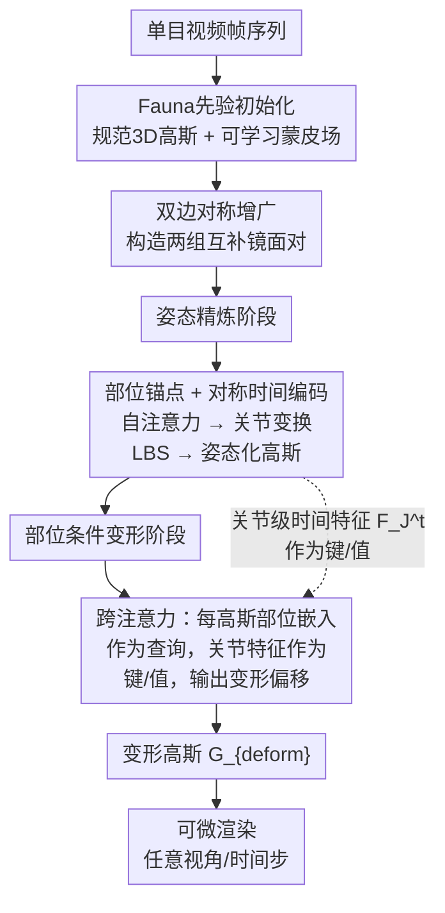

# Progressive Pose-Guided 4D Animal Reconstruction from Monocular Video

**会议**: ECCV2026  
**arXiv**: [2607.00157](https://arxiv.org/abs/2607.00157)  
**代码**: 无  
**领域**: 3D视觉  
**关键词**: 4D重建, 动物重建, 3D高斯溅射, 姿态估计, 渐进式优化

## 一句话总结

本文提出基于3D高斯溅射的渐进式测试时优化框架，通过解耦骨架运动与非刚体变形，从单目视频中重建高保真4D动物模型，仅需粗粒度形状先验即可泛化到多种物种。

## 研究背景与动机

从单目视频重建动物的4D模型在野生动物监测、动物行为研究和沉浸式内容创作中具有重要应用价值。与人体重建不同——人体有SMPL等成熟的参数化模型和大量3D动作捕捉数据支撑——动物物种间的形态和运动变化极其多样，而标注数据严重匮乏。这种矛盾导致现有方法陷入了两难境地：基于类别特异先验的方法（如MagicPony、BARC）在特定物种上能达到较高重建质量，但泛化到未见物种时效果急剧下降；而类别无关的方法（如FAUNA、SAOR）虽然扩大了物种覆盖范围，但重建保真度往往不尽如人意。扩展到4D动态重建时，这一困境进一步加剧——网格基方法受限于固定拓扑，神经隐式方法计算成本高昂，而基于3DGS的方法（如GART）仍依赖参数化模板，生成式方法（如GVFDiffusion、DreamMesh4D）则牺牲了对输入身份的忠实度。

现有方法背后隐含着一个共同假设：形状先验必须足够精确才能支撑后续的动态重建。然而在动物数据上，精确先验本身就难以获得——SMAL从玩具模型学来、Fauna从互联网图片学来，都只提供粗糙近似。本文的核心洞察恰恰与这一假设相反：**形状先验不需要高度精确，只要在渐进式优化中通过结构化的解耦让姿态估计和变形修正各司其职，粗先验就足以驱动高质量4D重建。** 基于此，本文提出了一个基于3DGS的渐进式测试时优化框架，将重建过程拆分为对称性感知的姿态精炼和部位条件变形两个阶段，并设计了可学习的部位锚点作为两个阶段的共享身份空间，实现从单目视频到高保真4D模型的全流程重建。

## 方法详解

### 整体框架

本文方法以单目视频帧序列为输入，输出对应每帧的4D高斯表示（支持任意视角和时间步渲染）。整体流程分为三个阶段：首先从Fauna先验初始化规范空间3D高斯和可学习的蒙皮场，并利用双边对称增广构造两个互补的监督组；然后进入姿态精炼阶段，用可学习部位锚点和对称性感知时间编码估计每帧关节变换，通过线性混合蒙皮（LBS）得到姿态化高斯；最后在部位条件变形阶段，姿态化高斯通过跨注意力从姿态阶段输出的关节级时间特征中检索非刚体变形信号，生成最终变形后的高斯参数。两个阶段使用不同的渲染监督策略——姿态阶段只接收轮廓损失（避免外观梯度污染姿态），变形阶段才联合优化轮廓和光度损失。

### 关键设计

**1. 双边对称增广：利用镜面对称性吸收相机漂移**

动物身体通常具有左右对称性，水平翻转视频帧能够有效扩展视角覆盖。然而，基于学习的Fauna先验在估计翻转帧的相机参数时会产生系统性的漂移偏差——翻转帧的估计相机并不精确等于原帧相机经过对称平面反射的结果。如果强制将原帧与翻转帧作为精确镜面对来处理，这种漂移会以冲突监督的形式注入优化；如果完全当成独立样本，则丢失了对称性带来的几何约束。

本文的解决思路是对每个视角构造两个内部一致的对称组，而不是试图一次性用齐全部四帧。具体来说，对原帧 `I^t` 及其翻转帧 `I_flip^t` 各自应用对称平面反射变换 `M`，得到两组相机参数：`𝒱_orig` 组包含 `(I^t, C^t, P^t)` 和 `(I_flip^t, C_sym^t, P_flip^t)`，其中 `C_sym^t = M·C^t`；`𝒱_flip` 组包含 `(I_flip^t, C_flip^t, P_flip^t)` 和 `(I^t, C_flip_sym^t, P^t)`。每组内部是精确镜面对称（因为反射变换手工施加，没有估计误差），组间允许存在相机漂移。训练时每次迭代随机采样其中一组，既利用对称性扩展了监督信号，又避免了漂移造成的冲突。对称性感知时间编码用 `m` 标记（`m=1` 对应 `𝒱_orig`，`m=-1` 对应 `𝒱_flip`）让姿态精炼阶段能够区分输入来自哪个相机组，从而将组间偏差作为系统性的偏移去学习而不是作为矛盾去硬拟合。

**2. 对称性感知姿态精炼：部位锚点解耦关节运动**

Fauna先验提供的初始姿态往往不准确，特别是在少视角和姿态模糊的情况下。姿态精炼阶段的目标是学习每帧每关节的变换参数，通过LBS将规范高斯映射到姿态化高斯。这里有两个关键挑战：如何融入对称性信息的同时处理相机组的系统漂移，以及如何让不同帧的同一关节共享稳定的身份表示。

应对第一个挑战，本文设计了对称性感知时间编码：编码向量由两部分拼接而成——`embed(t·m)` 编码时间与相机组标记的乘积，利用正弦编码的反对称性质让两个相机组的同帧时间编码在结构上相关联；`v` 标记输入是原帧（1）还是翻转帧（-1），显式解耦了2D视觉对称性与3D相机配置。应对第二个挑战，引入了随机初始化但可学习的部位锚点矩阵 `A ∈ ℝ^{J×D}`（J=20个关节，D=8维），每个锚点学习对应关节的稳定身份表示。部位锚点与时间编码拼接后经自注意力模块生成关节级时间特征 `F_J^t`，再投影为每关节的姿态变换参数。一个关键设计是：姿态阶段只使用轮廓损失监督，并且通过stop-gradient阻断非姿态属性（尺度、不透明度、颜色）回传——这确保了姿态更新纯由几何对齐驱动，不被纹理信息干扰。最终输出的姿态化高斯 `G_pose^t` 作为变形阶段的起点。

**3. 部位条件变形：共享锚点桥接两阶段**

LBS驱动的姿态精炼只能捕捉骨架层级的刚体运动，而真实动物还存在皮毛飘动、肌肉颤动、脚趾弯曲等非刚体效应。变形阶段的输入正是姿态化高斯 `G_pose^t`，其目标是在此基础上预测细微的几何偏移。

最关键的设计之处在于：变形阶段复用了姿态精炼阶段的部位锚点 `A`，但使用方式不同。每个高斯的蒙皮权重 `w_i` 与锚点矩阵做内积得到部位感知嵌入 `z_i = w_i^T A ∈ ℝ^D`。这个嵌入编码了该高斯与各关节的隶属程度，作为空间位置的补充信号——当不同身体部位在姿态空间中重叠时（如前后腿交叉），仅靠空间坐标无法区分，而 `z_i` 提供了位置无关的身份线索。变形阶段的跨注意力以每个高斯的 `z_i` 和姿态化几何属性 `(x_p, q_p, s)` 作为查询（Query），以姿态阶段输出的关节级时间特征 `F_J^t` 作为键和值（Key/Value）。通过这种注意力机制，每个高斯可以选择性地从它所属的关节的时变特征中提取所需的变形信号——前腿高斯更多参考前腿关节的变形模式，躯干高斯更多参考躯干关节。这样，部位锚点就同时承担了两个角色：在姿态阶段是关节级时间嵌入的生成源，在变形阶段是每高斯身份嵌入的计算基础，成为两个阶段之间无缝共享的隐式身份空间。变形阶段仅预测几何属性 `(x_d, q_d, s_d)` 的偏移，外观属性 `(α, c)` 从规范高斯共享，保证了时序外观一致性。

### 损失函数 / 训练策略

总损失包含三项：`L_total = L_pose + L_deform + L_geo`。姿态损失 `L_pose` 仅含轮廓BCE+Dice损失（权重0.2），通过stop-gradient阻断外观属性；变形损失 `L_deform` 联合L1+SSIM光度损失和轮廓损失（SSIM权重0.2，轮廓权重0.1）。几何正则化 `L_geo`（仅前1万迭代生效）包含三项：蒙皮场Huber总变分平滑（权重10，保证蒙皮场物理合理）、部位紧凑损失（权重0.1，通过主成分分析仅惩罚最小两个特征值来抑制浮动碎片、同时保留肢体沿主轴的细长结构）、法向图平滑损失（权重0.1，利用绝对余弦相似度约束新视角法向局部平滑）。训练策略上，预测姿态与Fauna先验做线性混合（混合权重从1退火到0持续7K迭代），前4K迭代施加L2先验正则化，两者在训练后期自然消失以保证模型不受先验限制；同时在早期向时间坐标注入衰减高斯噪声以鼓励时序平滑。

## 实验关键数据

### 主实验

| 数据集 | 指标 | 本文 | 最佳基线 | 提升 |
|--------|------|------|----------|------|
| DAVIS（输入视角） | PSNR / SSIM / LPIPS | **26.32** / **0.920** / **0.089** | D-3DGS*: 25.78 / 0.905 / 0.100 | +0.54 PSNR |
| Online（输入视角） | PSNR / SSIM / LPIPS | **26.21** / **0.923** / **0.091** | DreamMesh4D: 23.86 / 0.889 / 0.131 | +2.35 PSNR |
| APTv2（输入视角） | PSNR / SSIM / LPIPS | 24.94 / 0.878 / **0.139** | DreamMesh4D: **26.00** / **0.899** / 0.102 | -1.06 PSNR（第二） |
| DAVIS（新视角） | KID-16V↓ / FVD-F↓ / FVD-Diag↓ | **0.108** / **895.7** / **696.2** | D-3DGS*: 0.199 / 1192.0 / 980.7 | 全面最优 |
| Online（新视角） | KID-16V↓ / FVD-F↓ / FVD-Diag↓ | **0.160** / **972.0** / 1245.4 | D-3DGS*: 0.231 / 1244.4 / 1268.1 | 全面领先 |
| Artemis（新视角） | PSNR / SSIM / LPIPS | **24.03** / **0.938** / **0.065** | D-3DGS*: 20.05 / 0.903 / 0.103 | +3.98 PSNR |
| Artemis（3D几何） | Chamfer↓ / F@1%↑ / F@2%↑ | **0.0156** / **0.439** / **0.760** | D-3DGS*: 0.0181 / 0.358 / 0.683 | 全面最优 |

### 消融实验

| 配置 | PSNR | SSIM | LPIPS | 说明 |
|------|------|------|-------|------|
| Full model | **24.03** | **0.938** | **0.065** | 完整模型 |
| w/o 变形模块 | 22.80 | 0.929 | 0.072 | 非刚体动态被挤入规范空间，脚趾等细微运动丢失 |
| w/o 形状先验 | 23.89 | 0.937 | 0.068 | 规范空间不对称，姿态反转时前腿交叉位置错乱 |
| w/o 部位锚点 | 23.35 | 0.927 | 0.086 | 两条腿仅重建一条，另一条由拉伸高斯近似 |
| w/o 对称编码 | 23.87 | 0.937 | 0.068 | 规范空间不对称，前腿前后错位 |
| 固定蒙皮场 | 23.93 | 0.938 | 0.067 | 规范空间仅一条腿，变形阶段被迫补足缺失肢体 |

### 关键发现

- **变形模块贡献最大**：去掉后PSNR下降1.23，但感知质量下降更明显（LPIPS升0.007），且规范空间中非刚体动态泄露到外观导致几何混乱
- **部位锚点最关键于感知质量**：去掉后PSNR降幅不大（0.68），但LPIPS升0.021，两条腿只剩一条，说明部位身份信息对准确重建肢体的必要性远超PSNR所反映
- **对称编码与形状先验具有互补性**：两者分别去掉会产生相似的规范空间不对称问题——对称编码提供双边约束，形状先验提供对称初始位置，缺一不可
- **在稀疏帧场景（APTv2 15帧）**：DreamMesh4D凭借强生成先验在输入视角PSNR上反超，但本文在新视角KID-V和时序稳定性FVD上仍明显领先，说明生成式方法在少帧下能补足视角信息，但牺牲了视角一致性

## 亮点与洞察

- **"粗先验 + 渐进解耦"的设计哲学**：不追求精确初始化，而是让先验在优化过程中持续进化，通过解耦骨架运动和非刚体变形让两条监督路径各司其职。这种思路对任何"先验弱但可提供稳定优化信号"的场景都有通用启发价值
- **部位锚点的双角色设计**：在姿态阶段产生关节级时间特征，在变形阶段通过蒙皮权重加权提供每高斯的部位嵌入，自然桥接两个优化阶段而不需要额外的特征对齐或变换网络
- **对称性感知时间编码处理系统性漂移**：通过`m`标记和`t·m`乘法利用正弦编码的反对称性，将组间相机漂移从冲突监督转化为可学习的系统偏差，是处理"估计器本身有系统性偏差"场景的优雅解法

## 局限与展望

- **对严重相机不稳定的鲁棒性有限**：当原帧和翻转帧两个序列都被不稳定相机估计影响时，双边增广无法挽回，优化可能收敛到次优解
- **掩膜质量依赖Grounded-SAM**：不使用人工修正时，不准确的分割区域会降低几何精度；侧向自身遮挡虽被双边增广部分缓解，但持续遮挡仍是限制
- **头部运动难以捕捉**：头部旋转产生的剪影变化细微，仅靠轮廓监督不足；法向平滑正则化虽缓解了头部分裂但未完全解决问题
- **当前评估依赖渲染指标作为几何精度间接代理**，在野生视频上缺乏真实3D几何真值的直接评价

## 相关工作与启发

- **vs GART**: GART将姿态和变形作为隔离的阶段处理，依赖D-SMAL参数化模板，模板不匹配时（如坐着的熊猫）重建失败；本文通过部位锚点共享身份空间实现两阶段无缝耦合，同时用可学习蒙皮场替代固定模板，大幅扩展了可处理姿态范围
- **vs D-3DGS**: D-3DGS是一般性动态3DGS，缺乏动物语义约束，容易出现浮动碎片；本文的骨骼引导变形约束了高斯的位置更新空间，同时对称性编码利用了双边信息，使规范空间更稳定
- **vs 生成式方法（GVFDiffusion/DreamMesh4D）**: 生成式方法能产生"视觉合理但不像输入"的结果，其规范空间偏向训练集分布而非具体输入；本文坚持纯重建监督，让规范空间持续进化，保证了身份保真度

## 评分

- 新颖性: ⭐⭐⭐⭐ [粗先验+渐进解耦的思路在3D动物重建中具有开创性，双边对称增广和部位锚点双角色设计精巧务实]
- 实验充分度: ⭐⭐⭐⭐⭐ [在4个数据集（含87个野生视频+合成多视角数据）上与5种基线全面对比，提供输入/新视角/RGB/3D几何多维度量化评估，消融实验覆盖所有组件并深入规范空间可视化根因]
- 写作质量: ⭐⭐⭐⭐ [方法描述清晰，流程完整，消融分析深入规范空间可视化；法向平滑等部分细节补充材料未公开略显遗憾]
- 价值: ⭐⭐⭐⭐⭐ [显著提升了单目视频4D动物重建的泛化能力和保真度，对野生动物监测、动物行为研究和虚拟内容创作等实际应用有直接推动作用]

<!-- RELATED:START -->

## 相关论文

- [\[ECCV 2026\] One Video, One World: Turning Monocular Video into Physical 4D Scenes](one_video_one_world_turning_monocular_video_into_physical_4d_scenes.md)
- [\[ECCV 2026\] HAT-4D: Lifting Monocular Video for 4D Multi-Object Interactions via Human-Agent Collaboration](hat-4d_lifting_monocular_video_for_4d_multi-object_interactions_via_human-agent_.md)
- [\[NeurIPS 2025\] Web-Scale Collection of Video Data for 4D Animal Reconstruction](../../NeurIPS2025/3d_vision/web-scale_collection_of_video_data_for_4d_animal_reconstruction.md)
- [\[ICCV 2025\] Vivid4D: Improving 4D Reconstruction from Monocular Video by Video Inpainting](../../ICCV2025/3d_vision/vivid4d_improving_4d_reconstruction_from_monocular_video_by_video_inpainting.md)
- [\[CVPR 2026\] Mesh4D: 4D Mesh Reconstruction and Tracking from Monocular Video](../../CVPR2026/3d_vision/mesh4d_4d_mesh_reconstruction_and_tracking_from_monocular_video.md)

<!-- RELATED:END -->
