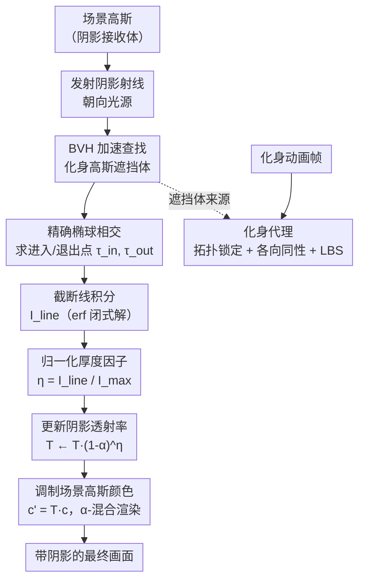

# RAGA: Real Time Ray Traced Gaussian Shadow Casting for 3DGS Avatar-Scene Interaction

**会议**: ECCV 2026  
**arXiv**: [2606.29329](https://arxiv.org/abs/2606.29329)  
**代码**: 无  
**项目页**: [https://miraymen.github.io/raga/](https://miraymen.github.io/raga/)  
**领域**: 3D视觉  
**关键词**: 3D高斯泼溅, 阴影投射, 光线追踪, 化身-场景交互, 时序稳定性

## 一句话总结
RAGA 提出了一种完全在高斯空间中计算阴影的射线追踪方法——对每条阴影射线做精确的高斯线积分并归一化，得到描述光线"穿过多少"遮挡体的厚度因子，以此驱动阴影透射率；同时引入化身代理（avatar proxy）消除动画中的时序抖动，在 NVIDIA OptiX 上实现约 50 FPS 的交互式阴影投射。

## 研究背景与动机
3D Gaussian Splatting（3DGS）不仅能做高质量场景重建，近年还被扩展到可驱动的动态人体化身，支持将化身嵌入到复杂真实场景中。然而一个根本性限制始终存在：当化身在静态场景或物体旁运动时，缺乏物理上可信的阴影——插入的人看起来"浮"在环境之外，严重破坏真实感和场景一致性，在需要阴影提供空间/时间线索的动态场景中尤其明显。

现有方法无法在"组合时刻"（化身插入新场景时）支持体积式阴影投射。经典阴影映射依赖网格面相交和深度测试，但 3DGS 是体积式、基于不透明度的表示，没有明确定义的内外结构。逆渲染方法可以恢复逐场景的自阴影，但它们是静态几何上的逐场景优化，无法处理动态化身。基于射线的泼溅方法（3DGRT、RaySplat）虽然做射线-高斯相交检测，但使用二元命中测试（hit test），只判断"是否相交"而忽略"穿过了多少"；而且这些方法假设阴影遮挡体是网格，不解决"遮挡体和接收体都是 3D 高斯"的全体积场景。

核心 idea：将每个高斯的阴影贡献建模为沿阴影射线的归一化线积分——对每个遮挡高斯计算射线穿过其 χ² 置信椭球的精确进入/退出点，在该区间上积分不透明度轮廓（有 erf 解析解），再除以该高斯的理论最大积分。归一化后的厚度因子自然区分了"擦边而过"和"沿长轴贯穿"两种情形，解决了二元命中测试无法处理的各向异性体积遮挡问题。

## 方法详解

### 整体框架
给定一个 3DGS 场景和若干动画 3DGS 化身，RAGA 的目标是在每一帧为化身投射到场景上的阴影做物理可信的计算，全程在高斯空间中操作，不需要任何网格重建。

核心流程：对每个场景高斯（接收体），朝光源方向发射一条阴影射线；沿射线用 BVH 加速找到所有化身高斯（遮挡体）；对每个遮挡高斯做（i）精确椭球相交求进入/退出点，（ii）在该区间上积分不透明度得线积分，（iii）用理论最大积分归一化得厚度因子 η；（iv）用 η 调制该高斯的不透明度 α，更新阴影透射率 T。最终用 T 调制场景高斯的颜色后进行标准 α-混合渲染，得到带阴影的画面。为抑制化身动画中的时序闪烁，额外构造一个稳定的化身代理来替代原始各向异性高斯做阴影投射。

### 关键设计

**1. 精确射线-高斯椭球相交与进入/退出点：替代二元命中测试**

现有方法（3DGRT、RaySplat）在判断射线是否碰到高斯时，要么用二十面体代理近似（3DGRT），要么用精确解析相交但只做二元命中/未命中判断。前者的二十面体代理会在高斯实际支撑区域外产生错误命中（图1a）；后者虽然相交检测更准，但二元判断把所有相交一视同仁——射线擦过高斯边缘和贯穿高斯的"胖"方向得到相同权重，无法区分。

RAGA 换了一个思路：不是在"是否相交"上做文章，而是精确算出射线进入和离开 χ² 置信椭球（χ²=9，对应 3σ 截断）的参数坐标。具体做法是先将世界坐标通过白化变换 L = diag(s_x⁻¹, s_y⁻¹, s_z⁻¹)R^T 映射到各向同性空间，使得高斯的马氏距离退化为 Euclidean 距离 ‖y‖²₂。射线在此空间变为 y(τ) = o' + τ v'，与椭球约束 ‖y‖²₂ ≤ χ² 联立得到一个关于 τ 的二次方程 Aτ² + 2Bτ + C，其中 A = ‖v'‖²₂, B = o'^T v', C = ‖o'‖²₂。若射线与椭球有交（即最小马氏距离 d²_⊥ = C - B²/A ≤ χ²），则定义 Δ = χ² - d²_⊥，进入/退出时间为：

τ_in = τ_c - √(Δ/A),  τ_out = τ_c + √(Δ/A),  其中 τ_c = -B/A 是射线上离高斯中心最近的点。

随后钳位到射线段 [0,1] 得 τ̃_in, τ̃_out，若 τ̃_in ≥ τ̃_out 则丢弃该高斯。这一步只给出区间边界，还没有涉及"穿过了多少"——那个由下一个设计接手。

**2. 归一化线积分与厚度因子 η：从"是否碰到"到"穿过了多少"**

有了进入/退出区间后，RAGA 沿射线在该区间上对高斯的（未归一化）核函数做积分。在射线参数化下，高斯的核函数退化为一维高斯：

g(x(τ)) = exp(-½d²_⊥) · exp(-½A(τ - τ_c)²)

在 [τ̃_in, τ̃_out] 上的定积分有 erf 闭式解：

I_line = exp(-½d²_⊥) · √(π/(2A)) · [erf(√(A/2)(τ̃_out - τ_c)) - erf(√(A/2)(τ̃_in - τ_c))]

仅凭 I_line 还不够：不同大小的高斯的线积分天然不可比——大高斯的积分值会比小高斯高得多。为此 RAGA 做归一化：除以该高斯在同等 χ² 约束下的理论最大积分。最大积分发生在射线沿高斯最长轴（s_max = max(s_x, s_y, s_z)）正中穿过（d²_⊥ = 0）的情形：

I_max = √(2π) · (s_max / ‖v‖₂) · erf(√(χ²/2))

其中 s_max / ‖v‖₂ 是 τ-参数与真实世界距离之间的换算因子。最终得到归一化厚度因子：

η = clamp(I_line / I_max, 0, 1)

这个 η 是 RAGA 最核心的设计选择：射线擦过高斯 → 小的线积分 → 低的 η；射线沿长轴贯穿高斯 → 大的线积分 → 高的 η；同一高斯沿窄方向穿过 → 相应低的 η，正确反映出小得多的体积遮挡。相比之下，若只在最近点 τ_c 处评估高斯响应值 g(x(τ_c)) = exp(-½d²_⊥)，则仅依赖垂直距离 d_⊥ 而完全无视穿越方向——同一距离下贯穿长轴和擦边而过得到相同权重，这是二元命中测试和各向异性忽略都无法处理的。

**3. 不透明度到阴影透射率：三种更新规则**

每个遮挡高斯带有一个不透明度参数 α ∈ (0,1)。厚度因子 η 用于调制该高斯对阴影透射率 T 的贡献，RAGA 设计了三种更新规则：

- **线性归一化模型**：T ← T · (1 - αη)，将 η 视为分数覆盖率。
- **指数归一化模型**（论文最终采用）：T ← T · (1 - α)^η，等价于有效不透明度 α_eff = 1 - (1 - α)^η，再 T ← T · (1 - α_eff)。该模型将 η 解释为光学厚度的分数，使得多个遮挡体的累积效果在厚度意义上一致。
- **Beer-Lambert 积分模型**：T ← T · exp(-κ(α) · I_line)，其中 κ(α) = -ln(1 - α) ≥ 0 是从不透明度映射到的消光系数。这是物理上最自然的做法，直接使用原始线积分 I_line。

消融实验表明指数归一化模型在 SAE / SM-IoU / BF / TSC 四项指标上均最优，论文所有实验均使用该模型。三种模型共享同一套线积分和归一化前向计算，在工程实现上可切换。

**4. 化身代理与时序稳定阴影：解耦渲染几何与阴影几何**

直接用姿态驱动 3DGS 化身（一个以身体姿态 θ_t 为输入、输出 3D 高斯原语的神经网络 H(θ_t)）的原始高斯做阴影遮挡体会出现严重的时序闪烁。原因在于 H 为了满足视角依赖的光度损失，输出的高斯在拓扑、不透明度、各向异性朝向上都会逐帧波动——这些波动对渲染 RGB 影响不大，但对阴影轮廓极其敏感，导致阴影边缘高频抖动。

RAGA 的做法是将"渲染用的几何"和"阴影投射用的几何"解耦，构造一个稳定的化身代理（avatar proxy），包含三个机制：

- **拓扑锁定**：将生成过程冻结在参考姿态 θ_ref（如 T 姿态），缓存一次原语配置 P_proxy = {(μ_k^(0), s_k^(0), α_k^(0))}，保证遮挡体数量和初始属性在帧间不变，消除原语"时有时无"造成的阴影闪烁。
- **各向同性正则化**：用保守的各向同性半径 r_k = max(s_{k,x}, s_{k,y}, s_{k,z}) 替换各向异性尺度，协方差退化为 Σ'_k = r_k² I。球体的轮廓是旋转不变的，因此阴影投影与原语朝向无关。
- **简化运动学**：推理时用线性混合蒙皮（LBS）只更新代理位置：μ_k^(t) = Σ_j w_{kj} M_j(θ_t) μ_k^(0)。不更新旋转（球体旋不旋转不影响射线检测），保证阴影信号是姿态 θ_t 的连续函数。

TSC（时序阴影一致性）指标显示完整代理将闪烁降至 0.0018，比无代理（0.0061）低 3.4 倍，比 3DGRT（0.0114）低 6 倍以上。

### 损失函数 / 训练策略

RAGA 本身不需要训练——它是纯推理管线。阴影投射公式中的所有量（高斯的 μ, Σ, α，射线的 o, v）在推理时直接计算。BVH 在每帧对化身高斯的保守 AABB 构建一次，AABB 包围盒由椭球在三个世界轴上的投影半径 e_d = √(χ² · Σ_{3×3 对角元素}) 确定。CUDA kernel 集成 NVIDIA OptiX 利用硬件 RT 核做加速，整个阴影追踪器约 50 FPS，端到端管线（含 3DGS 光栅化）在密集化身场景下接近实时。

## 实验关键数据

### 主实验

在 ScanNet++ 的 5 个场景上与伪真值（pseudo-GT，基于网格的经典阴影映射）对比阴影质量，使用三个像素空间指标：SAE（阴影衰减误差，越低越好）、SM-IoU（阴影蒙版 IoU）、BF（边界 F-measure，2 px 容差）。

| 方法 | SAE ↓ | SM-IoU ↑ | BF ↑ |
|------|-------|----------|------|
| Mesh Shadow（oracle） | 0.000 | 1.000 | 1.000 |
| **RAGA（本文）** | **0.031** | **0.847** | **0.812** |
| 3DGRT（修改版） | 0.058 | 0.741 | 0.693 |
| RaySplat（修改版） | 0.062 | 0.728 | 0.679 |

RAGA 在所有高斯方法中显著最优，SM-IoU 比 3DGRT 高 10.6 个百分点，BF 高 11.9 个百分点。3DGRT 的二十面体代理产生硬阴影边界无半影，RaySplat 的碰撞检测退化为最大响应评估，缺乏衰减建模。

### 时序稳定性

TSC（Temporal Shadow Consistency）为连续帧间阴影图的平均逐像素绝对差。在 5 个序列上评估：

| 方法 | TSC ↓ |
|------|-------|
| **RAGA（完整代理）** | **0.0018** |
| RAGA w/o 代理 | 0.0061 |
| 3DGRT（修改版） | 0.0114 |
| RaySplat（修改版） | 0.0121 |

化身代理将时序抖动降低 3.4 倍。TSC 差值图（|S_t - S_{t-1}|）可视化也确认了代理显著减少闪烁区域。

### 消融实验

衰减模型消融（在 ScanNet++ 上 vs pseudo-GT）：

| 配置 | SAE ↓ | SM-IoU ↑ | BF ↑ | TSC ↓ |
|------|-------|----------|------|-------|
| **指数归一化（本文）** | **0.031** | **0.847** | **0.812** | **0.0018** |
| 线性归一化 | 0.035 | 0.831 | 0.796 | 0.0021 |
| Beer-Lambert | 0.039 | 0.819 | 0.781 | 0.0024 |
| w/o I_max 归一化 | 0.047 | 0.793 | 0.754 | 0.0022 |

化身代理消融：

| 变体 | TSC ↓ |
|------|-------|
| **完整代理（本文）** | **0.0018** |
| w/o 拓扑锁定 | 0.0037 |
| w/o 各向同性正则化 | 0.0032 |
| 无代理 | 0.0061 |

### 关键发现
- 线积分归一化（I_max）是最关键的单一组件：去掉后 SAE 从 0.031 升到 0.047，视觉上大尺度各向异性高斯会投射出不成比例的深黑影（图 4 左），因为原始 I_line 随高斯大小线性增长，不归一化会让大高斯"过度遮挡"。
- 化身代理的三个组件中，拓扑锁定（+0.0019 vs 无代理）和各向同性正则化（+0.0029）贡献接近，两者协同效果最好——说明帧间拓扑抖动和各向异性旋转都独立地构成闪烁源。
- 指数衰减模型优于线性和 Beer-Lambert：线性模型产生较硬的阴影衰减边缘（图 4 中），Beer-Lambert 的物理建模未带来额外收益，可能是因为高斯 α 值本身并非真实消光系数，直接套用 Beer-Lambert 存在模型失配。
- 感知研究：12 名评测者在 5 个场景上的 2AFC 测试中平均 73% 偏好 RAGA 的阴影效果。
- 运行效率：在 H100 上，阴影追踪器单独约 50 FPS；化身高斯数量从 20K 增长到 400K 时，阴影计算时间近似线性增长，受益于 OptiX 硬件 BVH 遍历。

## 亮点与洞察
- **线积分归一化的设计直觉非常漂亮**：将"射线穿过多大一块体积"这个连续物理量映射到 [0,1] 的 η 因子，本质上是把各向异性高斯的体积遮挡量化——擦边、贯穿长轴、贯穿短轴三种情况天然被 η 区分开，而无需额外的手工规则或学习参数。这种"算出一个有物理意义的量再归一化"的思路可以迁移到任何需要处理各向异性体积遮挡的任务（如体积光、体积雾中的 3DGS 渲染）。
- **化身代理的"解耦"哲学值得借鉴**：渲染几何和阴影几何不需要是同一套数据。RAGA 用各向同性球体 + LBS 骨骼驱动的代理来做阴影投射，放弃了高斯的各向异性和视角依赖，但阴影质量的损失远小于时序稳定性的收益。这种"用更稳定但不那么精确的代理替代不稳定原件"的思路在实时渲染中常见（LOD、impostor），但在 3DGS 动态场景中首次被系统性地用于阴影任务。
- **工程上整合了 OptiX 硬件 RT 核做 BVH 遍历**：把射线-高斯查询从软件遍历提升到硬件加速，是能在密集场景跑 50 FPS 的关键工程决策。这个 CUDA + OptiX 的技术栈选择说明，神经渲染方法要实现"可用"级别的实时性能，不能只靠算法创新，算法和硬件加速的协同设计同样重要。

## 局限与展望
- 仅支持点和方向光源，不支持面光源（area light），无法产生柔和的半影过渡——目前靠高斯本身的体积衰减模拟软阴影，但在物理上不是真正的面光源半影。
- 光照是"烤"在 3DGS 表示中的（baked）：RAGA 通过调制场景高斯颜色来制造阴影，但并不重新打亮化身或场景。也就是说，场景和化身的直接光照是固定的，阴影只做减法，不能将化身放入全新光照环境中。
- 光源位置需要用户手动指定，没有从场景自动估计光源方向/位置的能力。作者将此列为未来工作方向。
- 化身代理虽然稳定，但丢失了化身的高频几何细节（头发、衣物褶皱）对阴影轮廓的贡献——论文承认代理"保留了比裸 SMPL 网格更多的几何信息"，但比原始各向异性高斯仍有损失。如何在稳定性和细节之间做自适应平衡是一个开放问题。
- 伪真值协议本身有局限：ScanNet++ 的网格重建质量参差不一，SuperSplat 等通用场景只能用平面代理，导致定量评估的"真值"并非绝对真值。后续工作若能建立 3DGS 阴影的标准化 benchmark 会很有价值。

## 相关工作与启发
- **vs 3DGRT / RaySplat**: 这些方法做射线-高斯相交用于颜色渲染，但用于阴影时只用二元命中测试判断遮挡。RAGA 的区别在于用线积分替代二元命中，从"是否遮挡"变成"遮挡多少"，对各项异性体积遮挡的处理能力有质的提升。此外 RAGA 不需要网格遮挡体，是首个在遮挡体和接收体都是 3DGS 的全高斯设置下工作的阴影方法。
- **vs GS-IR / IRGS / GS^3 等逆渲染方法**: 它们将场景分解为材质和光照，恢复逐场景的自阴影（通过烘焙遮挡体积、可微光线追踪、或学习阴影参数）。但它们做的是静态几何上的逐场景优化，无法处理动态化身插入新场景的场景组合问题。RAGA 在"组合时刻"运行，不对场景做任何预优化——两者的设计目标不同。
- **vs 经典阴影映射 / 深度阴影映射**: 它们依赖明确的表面几何和深度比较，3DGS 没有定义的表面，无法直接适配。RAGA 的射线追踪公式可以看作是将阴影映射的"沿射线衰减"逻辑从表面世界推广到了体积世界。
- **启发**: 线积分归一化的技巧本质上是将"一条射线穿过各向异性体积"这个三维问题约化到参数空间的一维积分，再用解析解消除数值积分的不确定性。这个思路可以迁移到其他需要量化体积穿透量的 3DGS 任务，例如体积渲染中的透光率计算、神经辐射场的快速遮挡查询等。化身代理的"解耦几何"设计也可以推广到 3DGS 化身在其他物理交互（碰撞检测、接触力学）中的加速和稳定化。

## 评分
- 新颖性: ⭐⭐⭐⭐☆ 全高斯空间做阴影投射是明确的空白领域首次填补；线积分归一化公式本身是标准方法但迁移到 3DGS 阴影场景有创造性；化身代理的"解耦几何"想法简洁有效。
- 实验充分度: ⭐⭐⭐⭐☆ 主实验有定量（ScanNet++ 三项指标 + TSC）和定性（多场景渲染图），消融覆盖衰减模型/归一化/代理三方面，感知研究补充了主观偏好。但缺少与纯基于网格的经典阴影映射在更多指标上的系统对比，且伪真值协议本身的质量依赖网格重建精度。
- 写作质量: ⭐⭐⭐⭐⭐ 方法推导清晰，从问题定位（表格对比 gap）到数学公式（封闭形式求解）到工程实现（OptiX CUDA）层次分明；图 1 将六种射线-高斯处理策略的对比浓缩在一张图上，信息密度高。
- 价值: ⭐⭐⭐⭐☆ 3DGS 化身-场景交互是内容创作、虚拟制作、仿真等应用的核心需求，RAGA 提供的实时阴影能力直接提升了 3DGS 在这些场景下的可用性。方法本身对训练无依赖、纯推理管线，易于集成到现有 3DGS 管线中。局限在于光源类型和自动光源估计的缺失，短期内限制了完全自动化的场景。

<!-- RELATED:START -->

## 相关论文

- [\[ICCV 2025\] Radiant Foam: Real-Time Differentiable Ray Tracing](../../ICCV2025/3d_vision/radiant_foam_real-time_differentiable_ray_tracing.md)
- [\[ICLR 2026\] Joint Shadow Generation and Relighting via Light-Geometry Interaction Maps](../../ICLR2026/3d_vision/joint_shadow_generation_and_relighting_via_light-geometry_interaction_maps.md)
- [\[ECCV 2026\] GaussLite: Online Task-Conditioned 3D Gaussian Splatting for Real-Time Robotic Mapping](gausslite_task_conditioned_3dgs_mapping.md)
- [\[CVPR 2026\] Stochastic Ray Tracing for the Reconstruction of 3D Gaussian Splatting](../../CVPR2026/3d_vision/stochastic_ray_tracing_for_the_reconstruction_of_3d_gaussian_splatting.md)
- [\[ECCV 2026\] Improving Sparse-View 3DGS Generalization via Flat Minima Optimization](improving_sparse-view_3dgs_generalization_via_flat_minima_optimization.md)

<!-- RELATED:END -->
