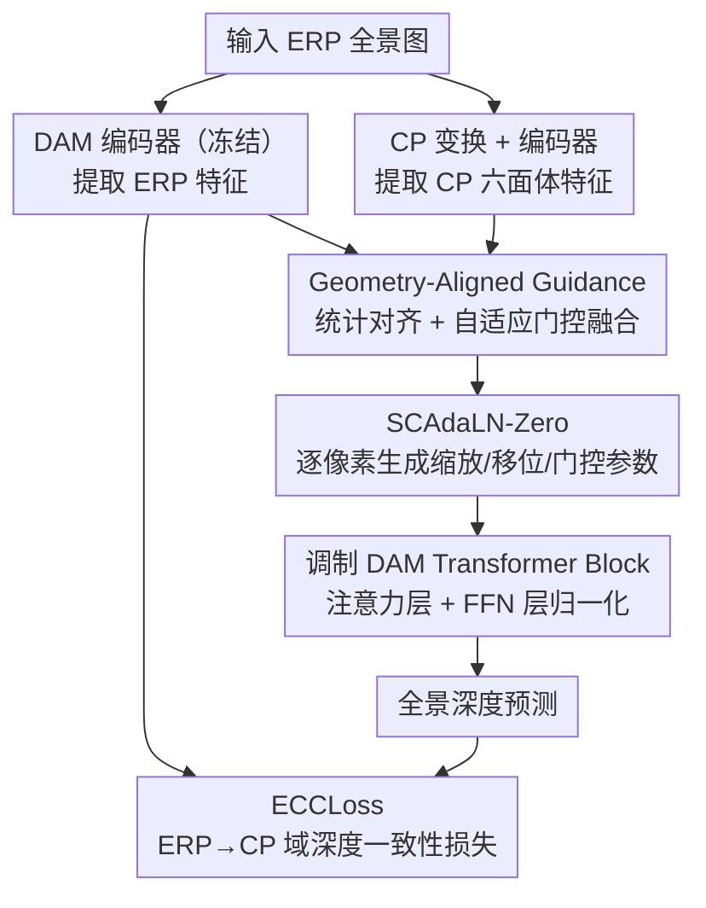

# RePer-360: Releasing Perspective Priors for 360$^\circ$ Depth Estimation via Self-Modulation

**会议**: ECCV2026  
**arXiv**: [2603.05999](https://arxiv.org/abs/2603.05999)  
**代码**: [https://github.com/munimo/RePer360](https://github.com/munimo/RePer360)  
**领域**: 3D视觉  
**关键词**: 全景深度估计, 域自适应, 归一化调制, 深度基础模型, 互补投影

## 一句话总结
RePer-360 提出一种基于归一化调制的自条件框架，在不覆盖预训练透视先验的前提下，利用互补投影（CP 与 ERP）的特征作为几何对齐的引导信号来调制深度基础模型，从而以极少量全景数据（约 1%）实现 SOTA 的全景深度估计。

## 研究背景与动机

单目全景深度估计在 VR/AR、自动驾驶等需要完整球面场景理解的场景中至关重要。近年来，以 Depth Anything 为代表的深度基础模型在透视图像上展现出强大的泛化能力，但当输入转为全景图像（Equirectangular Projection, ERP）时，性能急剧下降。根本原因在于预训练表征遵循的是透视域的统计规律——透视图像假设针孔相机模型、近似的均匀采样密度，而 ERP 全景图在极地区域存在严重拉伸畸变，物体形状和上下文关系被扭曲，产生所谓"先验失配"问题。

现有的解决方案大致分为两类。第一类是投影-拼接范式，将全景图切分为多个透视子视图分别推理再融合——MoGe-2 和 ST2360D 是代表，但多视图推理和后续拼接引入大量计算开销，且每个子视图独立处理、缺乏对整体球面几何的显式建模。第二类是在全景域上微调透视深度模型——PanDA 用 LoRA 做参数高效微调，但依赖大规模全景数据（约 12 万张）来保证性能，且在全景域微调过程中很容易覆盖甚至破坏预训练的透视先验。这两类方法共享一个深层矛盾：**要么不碰预训练权重但计算成本高，要么微调权重但需要海量数据且容易遗忘有用先验**。

本文从互补投影特征融合入手进行了前期探索：冻结 DAM 骨干，从 ERP 和 Cubemap Projection（CP）两个互补投影中提取特征并做显式融合。但实验发现直接融合几乎没带来提升，反而会扰动预训练特征的统计分布。受此启发，作者提出一个关键洞察：互补投影特征不应被"硬融合"进骨干表征，而应作为**结构化的引导信号**，通过归一化层的调制来实现更稳定的域迁移。**核心 idea：用几何对齐的互补投影特征作为自条件信号，通过一种零初始化的自适应层归一化机制（SCAdaLN-Zero）在归一化层内对骨干特征逐像素调制，从而在保留预训练透视先验的同时完成全景域自适应，仅需约 1% 的训练数据即可超越全量微调方法。**

## 方法详解

### 整体框架

RePer-360 的整体架构遵循"引导 - 调制 - 监督"的三段式设计。输入一张 ERP 全景图后，一个冻结的 DAM 编码器提取 ERP 特征主分支；同时，全景图被转换为 CP 格式送入另一个编码器提取六面体的透视对齐特征作为互补分支。Geometry-Aligned Guidance（GAG）模块将 CP 特征与 ERP 特征在几何上对齐，并通过可学习的门控机制融合两者，输出一个几何感知的引导信号。这个引导信号不直接残差加回骨干特征，而是送入 Self-Conditioned AdaLN-Zero（SCAdaLN-Zero）模块，在 Transformer 注意力层和 FFN 层的归一化步骤中逐像素生成缩放/移位/门控参数，实现对骨干特征的微调式调制。最后，E2C Consistency Loss（ECCLoss）在 CP 域上施加深度一致性约束，抑制 ERP 畸变带来的监督信号不平衡。

### 关键设计

**1. Geometry-Aligned Guidance：从互补投影中提取几何对齐的引导信号**

GAG 模块的核心动机是：CP 每张面近似透视图像，更接近 DAM 预训练域的分布，能提供可靠局部结构细节；但 CP 六张面之间存在边界不连续，缺乏全局连贯性。ERP 特征则保留了连续全景布局和稳定全局上下文，但受畸变影响局部细节退化。GAG 的关键在于**不是直接融合这两类特征**，而是先做统计对齐再做自适应选择。

具体地，将 ERP 特征投影到 CP 域（E2C 变换），得到同一几何参考系下的两个特征张量。然后执行无参数的通道级统计对齐：对 CP 特征做 Instance Normalization（减去自身均值、除以自身标准差），再通过 E2C 特征的均值和标准差做逆归一化——本质上是让 CP 特征的统计量（均值、方差）对齐到 E2C 特征，从而消除两个投影域之间的分布差异。这种对齐保留了 CP 特征的局部结构模式，仅改变了其数值分布区间。

对齐后的 CP 特征投影回 ERP 域后，与原始 ERP 特征拼接，过一个轻量卷积+Sigmoid 生成空间自适应门控权重 $\mathbf{G} \in [0,1]^{C\times H\times W}$，最终引导信号为 $\mathbf{F}_{GAG} = \mathbf{G} \odot \mathbf{F}_{aligned} + (\mathbf{I}-\mathbf{G}) \odot \mathbf{F}_{ERP}$。门控权重在空间上逐像素决定哪些区域更依赖 CP 的局部细节、哪些区域更依赖 ERP 的全局布局——从论文可视化的门控热图看，CP 在高频纹理区域权重更高，ERP 在平滑区域占主导。

**2. SCAdaLN-Zero：归一化内参数空间的自条件调制**

GAG 生成的引导信号不直接注入骨干特征，而是用来"参数化"归一化层的调制过程。SCAdaLN-Zero 受 DiT 中的 AdaLN-Zero 启发，但有三个关键不同：条件信号不是外部的 timestep 或类别标签，而是网络内部从 GAG 得到的 2D 几何感知信号；调制是逐像素的（channel×spatial 精细度），而非逐通道的；零初始化策略确保训练开始时退化为标准 Transformer Block，保障稳定启动。

技术流程：引导信号 $\mathbf{F}_{GAG}$ 经 SiLU 激活 + depthwise separable convolution，产生 $6C \times H \times W$ 的参数张量，沿通道维拆分为六组——每组对应注意力路径的缩放 $\boldsymbol{\gamma}_{attn}$、移位 $\boldsymbol{\beta}_{attn}$、门控 $\mathbf{g}_{attn}$，以及 FFN 路径的 $\boldsymbol{\gamma}_{mlp}$、$\boldsymbol{\beta}_{mlp}$、$\mathbf{g}_{mlp}$。在注意力路径中，LayerNorm 先去掉可学习仿射参数，然后应用 $\text{modulate}(\mathbf{F}, \boldsymbol{\beta}, \boldsymbol{\gamma}) = \mathbf{F} \odot (1 + \boldsymbol{\gamma}) + \boldsymbol{\beta}$，将调制后的特征送入全景自注意力 PanoAttn，最后用 $\mathbf{g}_{attn}$ 控制残差路径强度。FFN 路径同理。DSC 的最后一层卷积零初始化，保证训练初期 $\boldsymbol{\gamma}=\boldsymbol{\beta}=\mathbf{0}$，调制恒等。

这种设计的巧妙之处在于：它将全景域适应转化为归一化参数空间的受控重校准，而不是对特征值的直接改写。预训练透视先验仍然保留了骨干特征的主体内容，调制只改变其"强调什么、抑制什么"的比例。

**3. ECCLoss：立方体域一致性损失**

ERP 图像的分辨率分布在球面上不均匀——极地区域占据过多像素但信息密度低，赤道区域信息密集但像素占比小。这种像素-信息密度不匹配导致标准监督信号天然偏向极地的畸变区域，降低几何有意义区域的学习效率。

ECCLoss 将预测深度图和真值深度图都从 ERP 投影到 CP 域，在 CP 的六个面上分别计算 Scale-Shift Invariant MAE （SSI-MAE）。CP 域每张面遵循标准透视几何，自然地分离了极地与赤道区域，让网络在几何一致的投影域中学习深度结构。公式为 $\mathcal{L}_{ECC} = \frac{1}{B}\sum_{i=1}^{B} \|\psi(\mathbf{D}_i) - \psi(\mathbf{D}_i^x)\|_1$，其中 $\psi(\mathbf{D}) = (\mathbf{D} - \mu(\mathbf{D})) / (\sigma(\mathbf{D}) + \epsilon)$ 做尺度-移位归一化，消除全局深度尺度与偏移的影响，迫使网络关注相对深度关系。

### 损失函数 / 训练策略

总损失 $\mathcal{L}_S = \mathcal{L}_{SILog} + \mathcal{L}_{Grad} + \lambda_E \cdot \mathcal{L}_{ECC}$，其中 SILog 与梯度域损失为标准深度估计损失，$\mathcal{L}_{ECC}$ 的权重 $\lambda_E$ 平衡各分量。训练时骨干 DAM v2 ViT-L 冻结，SCAdaLN-Zero 仅在奇数层（第 4、11、17、23 层为输出相关层 + 奇数列）插入以平衡效率与性能，优化器 Adam，初始学习率 $5 \times 10^{-5}$，batch size 1，数据增广含左右翻转、全景水平旋转与亮度调整。

## 实验关键数据

### 主实验

| 数据集 | 方法 | Abs Rel ↓ | RMSE ↓ | $\delta_1$ ↑ |
|--------|------|-----------|--------|--------------|
| Matterport3D | PanDA-L（同域微调） | 0.0788 | 0.3827 | 93.73 |
| | **RePer-360** | **0.0691** | **0.3164** | **95.67** |
| | 相对提升 | **12.3%** | **17.3%** | **2.07%** |
| Stanford2D3D | PanDA-L（同域微调） | 0.0881 | 0.3185 | 93.42 |
| | **RePer-360** | **0.0580** | **0.2474** | **97.37** |
| | 相对提升 | **34.2%** | **22.3%** | **4.22%** |

两个数据集上 RePer-360 均超越 SOTA。注意 PanDA-L* 使用了 12 万张全景图的半监督预训练再微调，而 RePer-360 仅用同域训练数据（Matterport3D 约 8K、Stanford2D3D 约 1K），数据效率优势明显。

### 消融实验

| 配置 | RMSE ↓ | Abs Rel ↓ | 说明 |
|------|--------|-----------|------|
| w/o 任何调制（退化为 DAM 基线） | 0.3846 | 0.0915 | 冻结骨干直接推理 |
| Cross-Attention 融合 GAG | 0.4549 | 0.1168 | 显式值级融合反而降性能 |
| SCAdaLN + 仅 ERP 引导 | 0.3206 | 0.0698 | 单分支引导不如双分支 |
| SCAdaLN + 仅 CP 引导 | 0.3227 | 0.0692 | 同上 |
| **SCAdaLN + GAG（完整）** | **0.3164** | **0.0691** | 双分支几何对齐最佳 |
| w/o ECCLoss | 0.3249 | 0.0716 | 去掉 CP 域一致性损失 |
| 替换 ECCLoss 为 EPNL（PanDA） | 0.3180 | 0.0731 | 随机 patch 采样一致性 |
| 替换 GAG 为 UniFuse CEE 融合 | 0.3244 | 0.0731 | 传统融合方案不及调制 |
| NormalAttn 替代 PanoAttn | 0.3209 | 0.0725 | 注意力类型影响较小 |

### 关键发现

- **归一化调制远优于显式特征融合**：Cross-Attention 或 UniFuse 的显式融合方案均导致性能下降（RMSE 0.45+ vs 0.32-），说明直接混合特征会破坏预训练表征的统计结构，而归一化参数空间的调制更温和有效。
- **SCAdaLN-Zero 是核心增益来源**：无论是 ERP 单分支还是 CP 单分支引导，只要引入 SCAdaLN-Zero 就大幅超越退化基线，完整 GAG 双分支引导进一步小幅提升。
- **ECCLoss 的几何一致性约束比随机 patch 采样（EPNL）更有效**：CP 域的结构化监督提供了固定的几何参考系，优于 EPNL 的随机高斯采样策略。
- **零样本泛化能力强**：仅用合成数据（Structured3D + Deep360）训练，在真实场景上 Zero-shot RMSE 22.4% 优于 PanDA-L。
- **计算效率权衡合理**：RePer-360 约 1.30 FPS，比 PanDA-L 慢但比 MoGe-2（0.02 FPS）快约 65 倍。

## 亮点与洞察

- **"不做融合，只做调制"的设计哲学很有启发性**：作者通过实验发现互补投影的直接特征融合会扰动预训练统计分布，转而将融合"内化"为归一化调制——这个从失败经验中反向提炼出的思路在域自适应任务中具有普适意义。
- **SCAdaLN-Zero 将 2D 引导信号转化为 1D 归一化参数**：引导信号空间精细度从像素级保持到参数空间，但通过归一化层注入避免了直接值级修改，巧妙平衡了适应强度与先验保护。
- **零初始化的稳定启动设计**：DSC 最后一层卷积零初始化使模型训练初期退化为标准 DAM Block，保障了训练的稳定性，避免了大扰动导致的不收敛风险。
- **GAG 的门控可视化提供了可解释性**：门控热图清楚显示 CP 在高频区域权重高、ERP 在平滑区域权重高，直观验证了"局部细节+全局布局"的双分支互补假设。

## 局限与展望

- **双分支架构带来推理速度下降**：相比单分支 PanDA-L，RePer-360 的 FPS 降低约一半（2.59 → 1.30），ERP↔CP 之间的投影变换和额外编码器是瓶颈。
- **小骨干上增益有限**：ViT-S 骨干上 RePer-360 相比 PanDA 优势不大，说明引导信号的丰富度依赖骨干的特征提取能力——小模型提供的 CP 引导质量不足以充分调制。
- **仅验证了 DAM 系列骨干**：虽在 DINOv2 上也做了实验，但未探索更广泛的骨干架构（如 ViT+Adapter 变体）或跨任务迁移（如全景语义分割、全景法线估计）。
- **未讨论多任务联合训练的可能性**：ECCLoss 的 CP 域一致性思想能否推广到其他全景感知任务值得探索。

## 相关工作与启发

- **vs PanDA（当前 SOTA 基线）**: PanDA 用 LoRA 在全景域微调 DAM，依赖 12 万张全景图的大规模半监督预训练。RePer-360 用归一化调制替代参数微调，仅需约 1% 的数据即超越之——关键在于"保留先验而非覆盖先验"的适应策略差异。
- **vs MoGe-2 / ST2360D（投影-拼接范式）**: 这两类方法切分全景图为多个透视子视图分别推理再融合，计算开销巨大（MoGe-2 0.02 FPS）。RePer-360 通过端到端调制避免了多视图推理，速度提升约 65 倍。
- **vs DiT AdaLN-Zero（调制机制灵感来源）**: DiT 用外部的 timestep/class embedding 作为 1D 条件生成缩放移位参数。RePer-360 将这一机制推广为**内部 2D 几何条件**，从互补投影的差异中自条件化地生成调制参数，是一个从生成模型迁移到感知任务的巧妙适配。
- **vs UniFuse / HRDFuse（传统全景融合方法）**: 这些方法设计专门的双分支融合模块来混合 CP 与 ERP 特征。RePer-360 证明了**特征级融合不如调制级融合**：保留特征内容的完整性仅在归一化参数空间做重校准，更能保持预训练先验。

## 评分

- **新颖性**: ⭐⭐⭐⭐⭐ 将生成模型中的 AdaLN-Zero 机制适配到全景深度估计任务，提出"基于归一化调制的域自适应"这一新范式，工作扎实且动机链条清晰。
- **实验充分度**: ⭐⭐⭐⭐⭐ 覆盖 Matterport3D/Stanford2D3D 两个室内数据集 + 零样本跨域评估 + SUN360 自采数据定性 + 架构消融 8 种变体 + 多骨干 ViT-S/B/L + CDF 分析 + 表征漂移分析，体系完整。
- **写作质量**: ⭐⭐⭐⭐ 逻辑链条清晰（"融合失败→转向调制"的叙事自然），方法解释详细，图表丰富。部分公式较多，但核心机制有充分的中文叙述支撑。
- **价值**: ⭐⭐⭐⭐⭐ 数据效率极高（1% 训练数据即 SOTA），对预训练基础模型在几何失配域上的微调范式有指导意义——未来很多"将透视预训练模型迁移到非透视域"的工作都可能借鉴此"调制而非重写"的思路。

<!-- RELATED:START -->

## 相关论文

- [\[CVPR 2026\] VGGT-360: Geometry-Consistent Zero-Shot Panoramic Depth Estimation](../../CVPR2026/3d_vision/vggt-360_geometry-consistent_zero-shot_panoramic_depth_estimation.md)
- [\[CVPR 2026\] Pose-Free Omnidirectional Gaussian Splatting for 360-Degree Videos with Consistent Depth Priors](../../CVPR2026/3d_vision/pose-free_omnidirectional_gaussian_splatting_for_360-degree_videos_with_consiste.md)
- [\[CVPR 2026\] ORBIT: Benchmarking SfM in the Wild with 360° Video](../../CVPR2026/3d_vision/orbit_benchmarking_sfm_in_the_wild_with_360deg_video.md)
- [\[CVPR 2025\] SphereUFormer: A U-Shaped Transformer for Spherical 360 Perception](../../CVPR2025/3d_vision/sphereuformer_a_u-shaped_transformer_for_spherical_360_perception.md)
- [\[CVPR 2026\] Depth Any Panoramas: A Foundation Model for Panoramic Depth Estimation](../../CVPR2026/3d_vision/depth_any_panoramas_a_foundation_model_for_panoramic_depth_estimation.md)

<!-- RELATED:END -->
