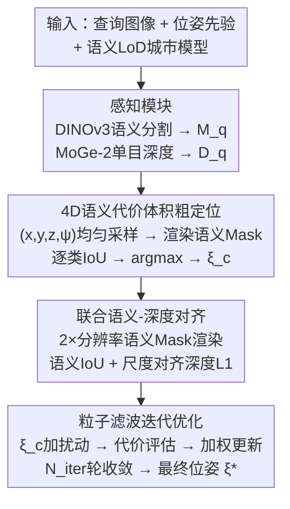

# SemCityLoc: Aerial 6DoF Localization Using Semantic 3D City Models  

**会议**: ECCV 2026  
**arXiv**: [2606.27444](https://arxiv.org/abs/2606.27444)  
**代码**: [https://albertchen98.github.io/SemCityLoc](https://albertchen98.github.io/SemCityLoc)  
**领域**: 3D视觉  
**关键词**: 空中定位, 6DoF位姿估计, 语义3D城市模型, 语义-几何对齐, 无人机定位  

## 一句话总结
SemCityLoc 将无人机空中 6DoF 位姿估计重新定义为「基础模型视觉先验（语义分割 + 单目深度）与标准化语义 3D 城市模型之间的结构化表面配准」问题，通过「4D 语义代价体积粗定位 → 粒子滤波联合语义-深度精对齐」的两阶段管线，在无需稠密辐射重建的前提下，将城市峡谷场景的定位召回率从 35.11% 提升至 69.15%（2m-2度阈值），位置误差从 9.89m 降至 2.62m，并同步发布首个厘米级精度真实无人机定位基准 SemCityLockeD。

## 研究背景与动机
无人机空中 6DoF 定位是城市导航、巡检、测绘和数字孪生的核心能力，尤其在 GNSS 拒止环境中不可或缺。传统方案依赖 RTK-GNSS 结合稠密纹理化 3D 网格，虽然精度高，但这类辐射丰富模型内存占用大、计算开销高、难以规模化部署，且在城市场景中可能引发隐私问题，因此业界对轻量化替代方案有强烈需求。

现有轻量化工作尝试减少对稠密纹理的依赖，但各有短板：OrthoLoC 依赖 2D 正射影像和 DSM，本质上仍是纹理依赖；LoD-Loc v1/v2 使用抽象建筑模型做定位，但仅依赖轮廓级别的线框对齐，缺乏对语义表面和深度几何的利用，在低空近景城市峡谷场景中鲁棒性不足。更深层的矛盾在于：空中图像基线大、结构细节少、消失方向占主导，导致纯几何约束弱——而传统视觉定位依赖的稠密 SfM 重建恰好是想要摆脱的负担。

核心矛盾很清晰：要获得足以支撑高精度位姿估计的几何约束，是否必须付出稠密辐射重建的代价？本文的切入角度是：CityGML 标准下全球公开可用的语义 3D 城市模型超过 2.16 亿栋，它们自带语义表面分类（屋顶/墙面等）、结构化几何和厘米级地理配准，如果能用现代基础模型（DINOv3 语义分割、MoGe-2 单目深度）从单张航拍图中提取语义-几何先验，并将其与这些轻量化城市模型做结构化配准，就能在不依赖纹理重建的前提下获得足够的位姿可观测性。

**核心 idea**：将空中定位从「边缘/轮廓匹配」升级为「语义表面 + 深度几何的结构化区域配准」——语义表面划分引入了区域级结构约束，结合深度互补信号，使得重复建筑立面和遮挡条件下的位姿判别力大幅提升。

## 方法详解

### 整体框架
SemCityLoc 采用「粗到精」的语义-几何对齐策略。输入为一张无人机查询图像 $I_q$、一个粗略的位姿先验 $\boldsymbol{\xi}_{pri}$（来自 GNSS/IMU，误差可达数十米）以及目标区域的标准化语义 LoD 城市模型 $\mathcal{M}$；输出为精确的 6DoF 相机位姿 $\boldsymbol{\xi}^* = (x,y,z,\phi,\theta,\psi)$。由于 roll 和 pitch 可通过重力测量可靠估计，方法在搜索空间中将 $(\phi,\theta)$ 固定，仅在 $(x,y,z,\psi)$ 四维空间中搜索。

整个管线分两个感知模块 + 两个定位阶段。两个感知模块分别用基础模型提取查询图像的语义掩码 $M_q$（DINOv3 主干 + 轻量 DPT 解码器）和单目深度图 $D_q$（MoGe-2 预训练模型）。粗定位阶段在 4D 空间 $(x,y,z,\psi)$ 中对先验位姿附近均匀采样，每个候选位姿从城市模型渲染语义掩码 $M_c$，与 $M_q$ 逐类计算 IoU 构建 4D 代价体积，选最大值作为粗位姿 $\boldsymbol{\xi}_c$。精对齐阶段从 $\boldsymbol{\xi}_c$ 出发，用粒子滤波产生扰动候选，每个粒子同时评估高分辨率语义对齐代价 $C^s$ 和深度对齐代价 $C^d$，加权融合后迭代更新，最终收敛到 $\boldsymbol{\xi}^*$。

### 关键设计

**1. 4D 语义代价体积粗定位：用语义表面配准替代稀疏轮廓匹配**

LoD-Loc 等前人工作在粗定位阶段仅依赖建筑轮廓/线框与图像的边缘匹配，这类稀疏约束在低空倾斜视角、建筑立面重复和遮挡条件下极易产生歧义。SemCityLoc 的核心替代思路是：利用 CityGML 语义 3D 城市模型自带语义表面分类（屋顶、墙面等），将定位问题转化为多类语义掩码的密集区域配准。

具体而言，在先验位姿 $\boldsymbol{\xi}_{pri}$ 附近以采样范围 $\mathbf{e}_c = [e_{cx}, e_{cy}, e_{cz}, e_{c\psi}]$ 和采样数 $\mathbf{n}_c = [n_{cx}, n_{cy}, n_{cz}, n_{c\psi}]$ 在 $(x,y,z,\psi)$ 四维空间中均匀采样，生成 $n_{cx} \times n_{cy} \times n_{cz} \times n_{c\psi}$ 个候选位姿。对每个候选位姿 $\boldsymbol{\xi}_i^{\text{samp}}$，从城市模型通过 GPU 光栅化渲染对应的语义掩码 $M_r(\boldsymbol{\xi}_i^{\text{samp}})$，与查询图像语义掩码 $M_q$ 计算逐类 IoU 的均值作为语义代价：

$$C_i^s = \frac{1}{N_c}\sum_{k=1}^{N_c}\frac{|M_r^k(\boldsymbol{\xi}_i^{\text{samp}}) \cap M_q^k|}{|M_r^k(\boldsymbol{\xi}_i^{\text{samp}}) \cup M_q^k|}$$

其中 $N_c$ 为语义类别数，$M_r^k$ 和 $M_q^k$ 分别为第 $k$ 类的渲染掩码和预测掩码。构建完整的四维代价体积后，取最大值对应的位姿为粗定位结果 $\boldsymbol{\xi}_c$。

这一设计的有效性源于语义表面配准的三重优势：第一，语义表面是区域级约束而非稀疏边缘，对局部遮挡和视角变化更鲁棒；第二，逐类 IoU 天然要求渲染掩码和预测掩码在空间范围上一致，这比边缘对齐提供了强得多的空间正则化；第三，不同语义类在空间中具有不同的几何分布模式（如屋顶在上、墙面在侧），类间组合进一步增强了位姿可辨识性。消融实验证实，仅粗定位阶段就将定位召回率从 41.49% 提升至 56.38%（2m-2度）。

**2. 联合语义-深度精对齐：互补几何约束消除重复结构的歧义**

粗定位阶段使用低分辨率语义掩码以控制搜索成本，但其精度受限于分辨率且仅依赖单一语义模态。在精对齐阶段，SemCityLoc 引入两个关键增强：将语义掩码分辨率翻倍以捕捉局部几何细节，同时引入单目深度作为独立且互补的几何信号。

深度对齐的核心挑战在于单目深度估计 $D_q$ 输出的是尺度模糊的相对深度，无法直接与从城市模型渲染的度量深度 $D_r(\boldsymbol{\xi}_i^{\text{samp}})$ 做数值比较。论文通过最小二乘法为每次匹配估计全局尺度 $s^*$ 和平移 $t^*$，使预测深度与渲染深度在有效区域 $\mathcal{M}_{valid}$ 内对齐：

$$C_i^d = \sum_{p \in \mathcal{M}_{valid}} \frac{1}{D_r(p)}\left\|s^* D_q(p) + t^* - D_r(p)\right\|_1$$

其中 $1/D_r(p)$ 的倒数加权使得远处深度估计的不可靠性得到抑制（远处深度值大，权重小）。最终的综合代价为语义和深度的加权融合：

$$C_i^{final} = \lambda_1 C_i^s + \lambda_2 C_i^d$$

联合使用的效果互补且显著：当语义特征在重复建筑立面之间无法区分时（多个相同的窗户/阳台排列），深度提供了独立的几何距离约束来消除歧义；当深度估计在纹理缺失区域不可靠时，语义表面边界提供了强结构先验。消融实验表明，加入深度对齐后，2m-2度召回率从 56.38% 进一步提升至 69.15%，yaw 误差从 1.04 度降至 0.42 度，证明语义和深度两个信号在精对齐阶段是互补且共同关键的。

**3. 粒子滤波迭代优化：随机探索替代高维穷举搜索**

粗定位给出了一个四维空间的离散最优值，但其网格分辨率受限于计算成本。若要在四维连续空间中做更细粒度的搜索，穷举方式的计算量会呈指数增长。论文借鉴视觉定位领域的粒子滤波思想，设计了一种随机优化策略来实现高效收敛。

具体做法：以粗位姿 $\boldsymbol{\xi}_c$ 为起点，对其平移和旋转参数施加小扰动 $\delta$，生成 $N_f$ 个粒子候选位姿：

$$\{\boldsymbol{\xi}_{p_i}\}_{i=1}^{N_f} = \boldsymbol{\xi}_c + \{\delta\boldsymbol{\xi}_i\}_{i=1}^{N_f}$$

每个粒子按照公式 (7) 的综合代价 $C_i^{final}$ 评估质量，再根据代价的概率得分对位姿做加权更新。该过程迭代 $N_{iter}$ 轮，粒子逐渐向高代价区域集中，最终收敛得到 $\boldsymbol{\xi}^*$。

粒子滤波在这里的巧妙之处在于：它不是简单的随机采样后取最优，而是通过加权更新让粒子群体在迭代中自适应地收缩到高概率区域，从而在有限粒子数下实现比均匀网格搜索更精细的位姿恢复。相比穷举搜索，粒子滤波的复杂度从 $O(n^4)$ 降至 $O(N_f \times N_{iter})$，且在消融实验中证明是粗定位的必要补充——去掉精对齐阶段后，位置误差从 2.62m 升至 3.20m，yaw 误差从 0.42 度升至 1.04 度。

### 损失函数 / 训练策略

SemCityLoc 的定位管线（代价体积搜索 + 粒子滤波）本身是无参数的优化过程，不需要训练。唯一需要训练的是语义分割模块：DINOv3 ViT 主干冻结，仅在顶部训练一个轻量 DPT 解码器。训练按数据集分别进行，在 SemCityLockeD 上达到 88% mIoU、UAVD4L-LoD 上 85%、Swiss-EPFL 上 78%，均在约 15 个 epoch 内稳定收敛，远快于 LoD-Loc 的从零训练。MoGe-2 深度估计器使用预训练权重，不做任何微调。

定位阶段的关键超参包括：粗搜索采样范围 $\mathbf{e}_c$ 和采样数 $\mathbf{n}_c$（决定代价体积分辨率和搜索覆盖范围），粒子数 $N_f$ 和迭代轮数 $N_{iter}$（控制精对齐的探索-利用平衡），代价权重 $\lambda_1$ 和 $\lambda_2$（调节语义和深度的相对贡献）。整条管线在单张图像上总耗时 0.878 秒（感知推理 0.116s + 粗搜索 0.409s + 粒子滤波 0.353s），达到亚秒级实时性。

## 实验关键数据

### 主实验

在 SemCityLockeD 基准上，SemCityLoc 在所有召回率阈值和误差指标上全面超越所有基线方法。特征匹配类方法（CAD-Loc、MC-Loc 基于 RoMa/e-LoFTR）在密集城市峡谷场景中几乎完全失效（召回率接近 0%），因为它们依赖的纹理特征在建筑重复立面和遮挡条件下无法建立可靠对应。LoD-Loc 的线框对齐方法表现稍好但在最严格的 2m-2度阈值下仅 35.11% 召回率，而 SemCityLoc 达到 69.15%，同时将平均 yaw 误差从 1.78 度降至 0.42 度，位置误差从 9.89m 降至 2.62m。

| 方法 | 2m-2度(%) | 3m-3度(%) | 5m-5度(%) | Yaw(度) | XYZ(m) |
|------|-----------|-----------|-----------|---------|--------|
| CAD-Loc (e-LoFTR) | 0 | 0 | 0 | - | - |
| CAD-Loc (RoMa) | 0 | 0 | 0 | - | - |
| MC-Loc (DINOv2) | 5.32 | 8.51 | 18.09 | 5.90 | 10.71 |
| MC-Loc (RoMa) | 0 | 1.06 | 3.19 | 6.67 | 18.61 |
| LoD-Loc | 35.11 | 47.87 | 53.19 | 1.78 | 9.89 |
| SemCityLoc (Full) | **69.15** | **84.04** | **89.36** | **0.42** | **2.62** |

在 UAVD4L-LoD 和 Swiss-EPFL 两个公开基准上，SemCityLoc 同样展现出一致的优势。尤其在 Swiss-EPFL 的跨地点（out-of-Place）泛化场景中，SemCityLoc 将 2m-2度召回率从 17.41% 提升至 35.36%，5m-5度召回率从 48.55% 提升至 89.18%，位置误差从 12.54m 降至 3.09m——说明语义-几何对齐策略比线框匹配具有更强的跨场景泛化能力。

### 消融实验

| 配置 | 2m-2度(%) | 3m-3度(%) | 5m-5度(%) | Yaw(度) | XYZ(m) | 说明 |
|------|-----------|-----------|-----------|---------|--------|------|
| Full model | 69.15 | 84.04 | 89.36 | 0.42 | 2.62 | 完整两阶段管线 |
| w/o Refinement | 56.38 | 70.21 | 81.91 | 1.04 | 3.20 | 去掉粒子滤波精对齐 |
| w/o Coarse Selection | 41.49 | 56.38 | 72.34 | 1.11 | 5.94 | 去掉4D代价体积粗搜索 |

消融结果清晰揭示两个阶段的互补性：粗搜索贡献了从 41.49% 到 56.38% 的第一次大幅跃升（+14.89% @ 2m-2度），精对齐贡献了从 56.38% 到 69.15% 的第二次跃升（+12.77%）。去掉粗搜索（仅用粒子滤波从先验出发）导致位置误差膨胀至 5.94m，说明在没有粗定位提供的良好初始值情况下，粒子滤波的局部探索能力不足以覆盖先验的大误差范围。去掉精对齐则使 yaw 误差从 0.42 度升至 1.04 度，说明深度对齐对旋转精度的贡献尤为突出。

### 关键发现

**LoD 级别的影响**：在 SemCityLockeD 独有的标准化 LoD1-LoD3 模型上评估发现，定位精度随几何细节增加而提升（LoD1: 48.94% → LoD2 semantic: 69.15% → LoD3: 70.21% @ 2m-2度），但语义 LoD2 在 3m-3度阈值上（84.04%）甚至超过 LoD3（75.53%）。这表明语义表面结构能部分补偿几何分辨率的不足——位姿精度不只取决于几何密度，更取决于可判别结构线索和语义一致表面表征的联合可用性。

**位姿先验鲁棒性**：在先验平移扰动高达每轴 50m 时，2m-2度召回率仍维持在 62.77%，说明方法对大初始误差有较强容忍度。但当扰动超过 100m/轴时，召回率骤降至 18.09%，揭示了方法的操作边界——粗搜索的采样范围需要覆盖真实位姿，超出范围后无法恢复。

**分割质量敏感性**：将 DINOv3 轻量微调头替换为零样本方案（CLIP + Semantic-SAM 或 Grounded-SAM2）后，mIoU 从 88% 降至 32-37%，召回率从 69.15% 骤降至 15.93%（2m-2度）。这既是局限（当前依赖一定程度的域内监督）也是机遇（随着基础模型在航拍视角上的持续进步，零样本定位精度有望自然提升）。

**跨数据集泛化**：SemCityLoc 在三个差异显著的数据集（SemCityLockeD 密集城市峡谷、UAVD4L-LoD 混合城郊、Swiss-EPFL 高空混合）上一致优于 LoD-Loc，证明语义-几何对齐框架具有广泛的场景适应性，不是仅在特定条件下有效的特化方案。

## 亮点与洞察

- **「语义表面配准」重塑了空中定位的问题定义**：前人方法都在「匹配什么几何特征」（点、线、轮廓、纹理）的框架内做改进，本文直接跳到了「匹配什么表面区域」——利用 CityGML 自带的语义表面分类（屋顶、墙面等），将定位从稀疏对应问题转化为密集区域配准问题。这个视角转换是整篇论文最核心的洞察，可迁移到任何有结构化语义地图的定位任务中。

- **LoD2 语义模型在多项指标上媲美甚至超越 LoD3**：这一反直觉发现揭示了一个重要规律——对于定位任务而言，「知道每一块表面是什么」可能比「知道表面有多精细的几何细节」更重要。这对实际部署有直接启示：全球已有 2.16 亿+ 公开 LoD2 模型，无需等待更高 LoD 的覆盖即可获得高精度定位。

- **基础模型作为「可插拔感知前端」的架构设计**：语义分割（DINOv3）和深度估计（MoGe-2）在整个系统中被当作模块化感知先验，定位管线本身不依赖特定模型架构。这意味着随着基础模型能力提升（尤其航拍领域适应性的改善），定位精度会自然水涨船高，而无需修改核心对齐算法——这是一种具有长期生命力的系统设计模式。

- **倒数深度加权的 L1 损失**：公式 (6) 中用 $1/D_r(p)$ 对深度误差做反距离加权，远处像素因为深度值大而获得更低权重。这个看似简单的 trick 实际上精准解决了单目深度估计的根本问题——远处深度不可靠——避免了不可靠信号污染整体匹配代价，是一个通用且可直接复用的深度对齐技巧。

- **亚秒级全管线推理**：0.878 秒/帧（含两阶段定位）意味着该方法具备在线重定位的实用性，这对 GNSS 拒止环境中的无人机自主飞行直接可用。

## 局限与展望

- **依赖城市模型的可用性和精度**：SemCityLoc 的性能上限受限于目标区域的 LoD 模型覆盖率和几何精度。全球虽已有大量公开 CityGML 数据，但覆盖面仍不均匀（欧洲密集、其他地区稀疏），且部分地区的模型可能缺乏语义标注或存在几何偏差。

- **极低几何可观测性场景失效**：当视野内仅包含单一建筑立面或极少量可见结构时，即使是语义-深度联合约束也可能不足以唯一确定位姿。这是结构配准类方法的固有边界，不同于基于稠密特征匹配的方法。

- **零样本语义分割的天花板**：当前零样本方案（CLIP + SAM 系列）在航拍视角上的 mIoU 仅 32-37%，远不足以支撑可靠定位，仍需按数据集轻量微调。这既是本文的局限，也是整个领域待解决的问题——航拍领域的视觉基础模型远不如地面视角成熟。

- **未探索的扩展方向**：论文仅在静态场景下评估，未涉及动态物体（车辆、行人）对渲染掩码和深度对齐的干扰；也尚未探索多帧时序融合以进一步提升鲁棒性；此外，将方法从建筑扩展至道路、植被等其他 CityGML 语义类的潜力也未充分挖掘。

## 相关工作与启发

- **vs LoD-Loc / LoD-Loc v2**：两者都使用 LoD 建筑模型做空中定位，但 LoD-Loc 仅用轮廓/线框对齐，LoD-Loc v2 扩展为剪影对齐，本质上都是边缘级匹配。SemCityLoc 的关键区别在于引入语义表面类别信息和单目深度信号，将匹配从稀疏边缘升级为密集区域 + 深度联合配准。实验证明这一升级在所有场景下都有显著收益，尤其在遮挡和重复结构场景中差距拉大。

- **vs OrthoLoc**：OrthoLoc 使用航拍图像与正射影像/DSM 做跨模态匹配实现 6DoF 定位，但本质上依赖 2D 纹理信息。SemCityLoc 完全放弃纹理，仅依赖语义标签和几何结构的对齐，在隐私敏感场景和缺乏更新正射影像的地区更具优势。

- **vs OrienterNet / MapLocNet**：这两类方法使用导航地图（道路网络、建筑物轮廓的 2D 矢量图）做定位，但仅限于 3-DoF（x,y,yaw）。SemCityLoc 利用 3D 城市模型的立面信息将定位扩展至完整 6DoF，这对需要精确高度和俯仰/滚转信息的下游任务（如三维重建、建筑物检测）是必要条件。

- **vs 传统 SfM + 特征匹配**：经典 SfM 重建 + SuperGlue/LoFTR 匹配 + PnP 的管线精度高但依赖稠密纹理化场景模型，存储和计算开销大。SemCityLoc 的思路本质上是用「公开可用的结构化语义几何」替代「私有采集的稠密纹理重建」，为规模化部署开辟了一条更可行的路径。

## 评分
- 新颖性: ⭐⭐⭐⭐ 将空中定位从轮廓/边缘匹配升级为语义表面配准的视角转换有新意；联合语义和深度做结构化对齐的思路在定位领域是首次提出。
- 实验充分度: ⭐⭐⭐⭐⭐ 在 3 个数据集、多个 LoD 级别、不同先验噪声幅度、不同分割质量下做了全面评估；消融实验清晰拆解了两阶段的各自贡献；包含效率分析和定性对比。
- 写作质量: ⭐⭐⭐⭐ 问题定义清晰，方法流程逻辑自洽，实验设计完整覆盖关键维度。LoD 分析与语义表面配准概念的呼应尤其出色。
- 价值: ⭐⭐⭐⭐ 为「用公开可用的结构化地图替代稠密重建做定位」这条路线提供了强有力的实证支撑；SemCityLockeD 基准填补了领域空白；亚秒级推理使其具备直接落地潜力。

<!-- RELATED:START -->

## 相关论文

- [\[ECCV 2026\] AirZoo: A Unified Large-Scale Dataset for Grounding Aerial Geometric 3D Vision](airzoo_a_unified_large-scale_dataset_for_grounding_aerial_geometric_3d_vision.md)
- [\[CVPR 2026\] VGA: Empowering Aerial-Ground Localization by Visual Geometry Alignment](../../CVPR2026/3d_vision/vga_empowering_aerial-ground_localization_by_visual_geometry_alignment.md)
- [\[CVPR 2026\] Yo'City: Personalized and Boundless 3D Realistic City Scene Generation via Self-Critic Expansion](../../CVPR2026/3d_vision/yocity_personalized_and_boundless_3d_realistic_city_scene_generation_via_self-cr.md)
- [\[ECCV 2026\] EPO: Boosting 3D Foundation Models with Edge-based Pose Optimization](epo_boosting_3d_foundation_models_with_edge-based_pose_optimization.md)
- [\[ECCV 2026\] Hierarchical 3D Scene Graph Construction and Belief-based Planning for Semantic Navigation](hierarchical_3d_scene_graph_construction_and_belief-based_planning_for_semantic_.md)

<!-- RELATED:END -->
