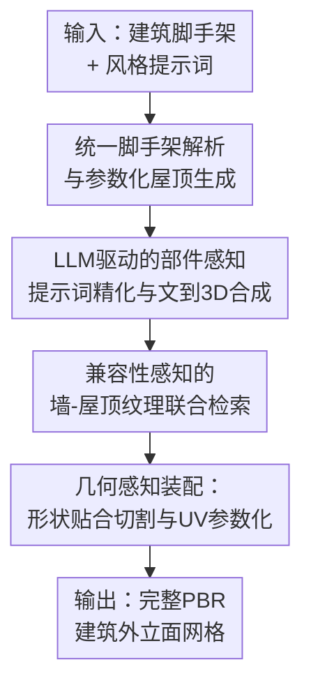

# ShellMaker: Language-Guided Exterior Completion under Structural Constraints

**会议**: ECCV 2026  
**arXiv**: [2606.31680](https://arxiv.org/abs/2606.31680)  
**论文**: [项目页](https://ruiqixu37.github.io/ShellMaker_web/)  
**代码**: 暂无（论文承诺开源）  
**领域**: 3D视觉  
**关键词**: 建筑外观补全, 语言引导生成, 结构约束保持, PBR材质, 参数化屋顶

## 一句话总结
ShellMaker 提出语言引导的建筑外观补全框架：给定建筑脚手架（室内生成器/CityGML/CAD 输出的墙体+门窗开洞布局）和一句风格提示词，通过参数化屋顶生成、LLM 部件感知提示词精化、兼容性感知的墙-屋顶纹理联合检索、几何感知装配四个模块，产出完整 PBR 外立面网格，在严格保持足迹和开洞布局的前提下匹配任意建筑风格，足迹 IoU 达 0.992，开洞中心误差仅 0.091。

## 研究背景与动机
近年室内场景生成系统（Holodeck、SceneWeaver、Artiscene 等）已能自动合成带墙体布局和门窗开洞语义的结构化室内空间，但这些管线在建筑外壳层就停下了——没有立面、没有屋顶、没有任何风格化的外观细节。生成的建筑因此是"半成品"，无法直接用于数字孪生、建筑可视化或城市场景建模。

直接套用现有的可控 3D 生成模型（Trellis-2、SpaceControl、SAT-Skylines）来做外观补全存在根本性矛盾：这些模型追求"感知真实"，但不保证"布局忠实"——生成的外立面无法严格对齐室内布局中的墙体足迹和门窗开洞位置，因为大规模"结构化建筑布局—完整带纹理外立面"配对数据集根本不存在，模型从未学过这一约束。这就是核心矛盾：**感知质量与布局约束无法兼得**。

本文目标很明确：把建筑外观补全定义为一个在硬结构约束下做语言引导生成的任务。脚手架提供的足迹拓扑、墙体边界和门窗开洞位置是"不可变约束"，风格提示词提供"可变语义"。核心 idea 是用分阶段模块化管线替代端到端生成模型——结构阶段管约束满足，风格化阶段管语义对齐，装配阶段管几何整合——各阶段职责分离，既避免跨阶段误差传播，也让每个模块可以用最适合的工具（参数化几何、LLM、检索、预训练生成模型）而非一个万能模型硬扛。

## 方法详解

### 整体框架
ShellMaker 解决的核心问题是：给定一个结构化建筑脚手架 S 和一句文本风格提示词 P，生成一个既忠实于脚手架几何约束又与指定建筑风格语义对齐的完整 PBR 外立面网格 E = Phi(S, P)。框架将这一生成过程拆成三个串行阶段（图）：结构生成阶段从脚手架推导固定足迹并参数化生成屋顶几何；风格化阶段将用户提示词精化为部件级规格、合成风格一致的门窗资产并检索兼容的墙-屋顶纹理对；装配阶段通过几何感知的布尔切割、语义对齐的资产放置和尺度一致的 UV 展开将所有部件组合为最终网格。

### 关键设计

**1. 统一脚手架解析与参数化屋顶生成：让三种异构输入落到同一条管线上**

室内生成器输出场景图、CityGML 输出语义标注表面、BIM/CAD 输出几何基元——这三种输入的表示格式完全不同。ShellMaker 的第一个关键设计是定义一个统一脚手架表示层：墙体用 2D 端点+外向法向量表示，楼板和天花板用多边形，门窗开洞同时记录世界坐标和墙体局部坐标。三种输入各有一个专用解析器（室内生成器解析场景图语义、CityGML 合并共面墙片段并投影开洞到墙局部坐标系、CAD 用 ifcopenshell 细分+法向量推断），但最终产出同一个标准化脚手架，下游所有阶段都不再感知输入格式差异。

屋顶生成从足迹分解开始。复杂多边形足迹先被拆成简单子区域：可选直骨架分解（计算中轴→划分条带区域→凸性容差合并，适合保形屋顶）或贪心矩形分解（递归提取最大轴对齐矩形→减掉→剩余区域重复，适合多样拼合屋顶）。随后在整体或子区域上套用五种标准屋顶类型（平顶、人字形、金字塔形、四坡顶、半四坡顶），每个屋顶由倾角、檐口挑出、脊长比例、半坡裁切比例四个连续参数控制形态变化。这一设计的关键洞察是：**屋顶是连接"固定足迹约束"和"风格可变性"的关键桥梁**——参数化生成让屋顶形态随风格连续变化，同时天然保证不超出足迹边界。

**2. LLM 驱动的部件感知提示词精化与两阶段文到3D合成：让一句话变成五句有用的提示词**

用户输入的风格提示词如 "a Victorian bakery" 对整体风格有指向性，但对生成具体的门、窗、屋顶装饰几乎没有任何可操作的几何描述。直接用这句话当 text-to-3D 提示词，生成的部件会在风格上各自为政。ShellMaker 的做法是用指令微调的 LLM（GPT-4.1）把一句话自动展开为五类结构化提示词——墙体材质、屋顶材质、入口门、窗户、屋顶装饰——每类提示词的 system instruction 都明确要求"描述单个孤立建筑构件、不含周围墙壁或环境背景、风格细节必须契合目标建筑风格"。这一步把"粗粒度的风格语义"翻译成"每个部件级别的可操作几何描述"，是风格一致性的关键保证。

每个精化后的提示词走两阶段 text-to-3D 管线：Nano Banana 先生成参考图，Trellis-2 再把参考图重建为带 PBR 材质参数（diffuse/normal/roughness）的纹理网格。这种"图像生成+3D重建"的拆解利用了图像生成模型在风格保真度上的优势，同时让 3D 重建专干几何——不需要对每种建筑风格做微调或监督。生成的资产按 `<style, category, part-name>` 三元组缓存复用，同一建筑上同类型的开洞共享一个网格以保证视觉规整。

**3. 兼容性感知的墙-屋顶纹理联合检索：不只是"找像的"，更要"找配的"**

对大面积建筑表面（墙体、屋顶），用生成式纹理容易产生不可平铺、PBR 通道不对齐的问题，所以 ShellMaker 改用检索。但简单独立检索会忽略一个常识：真实建筑中墙体和屋顶材质有强共现模式（砖墙配陶瓦顶，混凝土配金属顶，石灰石配石板顶），独立检索可能给出风格矛盾的组合（如红砖墙配茅草顶）。

ShellMaker 的方案是离线预计算一个兼容性矩阵 C，维度 Nw x Nr（498 墙体纹理 x 81 屋顶纹理），每个条目融合四种信号：Cmat（材料共现先验，给砖-陶瓦、混凝土-金属等经典组合高分）、Ccolor（CIELAB 色差+饱和度差，度量色彩协调性）、Cfreq（2D FFT 径向功率谱的余弦相似度，度量纹理尺度匹配）、Cclip（CLIP embedding 相似度，高层语义信号），加权为 lambda = (0.45, 0.25, 0.15, 0.15)。

运行时先分别对墙/屋顶提示词和纹理库算 CLIP 相似度，各取 top-K（K=32）纹理，形成 K^2 个候选对，再融合单侧相似度和预计算兼容性打分：s_ij = alpha * s_w(i) + beta * s_r(j) + gamma * C_ij，权重 (alpha, beta, gamma) = (0.40, 0.30, 0.30)。保留 top-M（M=8）对，用温度控制 softmax 采样最终纹理对：温度 tau 越低越保守（选最兼容的），越高越多样。这一设计的精妙之处在于兼容性离线算一次、运行时只做轻量查表和加权——检索延迟几乎为零。

**4. 几何感知装配：切开墙体、塞入资产、UV 展平，三步都不能破坏约束**

装配阶段是"约束兑现"的最后关卡。对于每个要嵌入的门窗资产，先做形状贴合切割：去掉资产外围 5% 面积来排除装饰性突起（山花、壁柱等会吹大气边界框的元素），再在背面削平确保不伸进室内。如果投影后轮廓足够矩形（面积 >= 95% 包围盒），直接用矩形切割；否则用分箱轮廓包络——把 X 轴分 64 个 bin，每 bin 取上下 Y 极值连成闭合多边形，简化后向外膨胀 0.01 确保全覆盖——这个多边形就是墙体布尔减法的切割器。

UV 展开用世界空间平面投影：每面墙/屋顶沿其主法向量方向投影，屋顶斜面用地面投影统一 UV 原点，垂直檐口面用同一水平坐标加垂直偏移来消除檐口-斜面接缝。最关键的是自动 UV 缩放因子：对每张纹理贴图算其亮度图的 2D FFT、径向平均功率谱、加权平均频率 f_dominant，跨纹理库取中位数频率为参考——粗纹理（如大块砖）缩放因子大，每面重复更多、单块更小；细纹理反之。这一步保证了不同材质在建筑表面上感知到的纹理密度一致，不会出现"砖墙纹理细密但混凝土纹理粗糙"的尺度不一致。

### 一个完整示例

以 "a Victorian bakery"（维多利亚风格面包店）为例走一遍完整管线：（1）结构阶段，解析室内生成器输出的面包店脚手架（矩形足迹，前立面两个大窗+居中门），因足迹简单选整体模式、直骨架分解、四坡屋顶，倾角 35 度、檐口挑出 0.3m；（2）风格化阶段，LLM 根据 "Victorian bakery" 精化出五组提示词——墙体"aged red brick with decorative string courses"、屋顶"dark grey natural slate"、门"Victorian double door with fanlight transom and carved pediment"、窗"tall arched sash window with stone keystone and sill brackets"、烟囱"ornate brick chimney with corbelled cap"；Nano Banana 为每个部件生成参考图，Trellis-2 重建为带 PBR 的网格；（3）纹理检索，离线兼容性矩阵里红砖-深灰石板得分最高（材料共现+暖色砖配冷色顶互补色和谐），运行时 CLIP 相似度确认后温度 0.12 采样命中该组合；（4）装配阶段，窗户区域走分箱轮廓包络切割（拱形窗投影非矩形），门用矩形切割，屋檐下自动生成落水管，屋顶嵌烟囱并裁剪只留屋面上方部分，全部墙面和屋顶面做 FFT 校准 UV 展开。最终输出一个 PBR 完整外立面网格，门窗位置与脚手架一致，屋顶倾角和材质呼应维多利亚风格。

### 损失函数 / 训练策略

ShellMaker 是一个模块化管线，不涉及神经网络端到端训练，因此没有传统意义上的损失函数。管线中的"优化"体现为离线预计算的兼容性矩阵和运行时的纹理对打分与采样机制。兼容性矩阵 C_ij 由四种人工定义的信号加权合成，权重 lambda = (0.45, 0.25, 0.15, 0.15) 由人工根据各信号重要性设定。运行时检索的超参包括：K=32（短名单长度），M=8（保留候选对数量），采样温度 tau = 0.12（偏保守，确保纹理对协调），对打分权重 (alpha, beta, gamma) = (0.40, 0.30, 0.30)。所有超参固定，不随输入变化，论文未报告对这些超参的敏感性分析。

## 实验关键数据

### 主实验

| 方法 | CLIP-Sim ↑ | UNI3D ↑ | 足迹 IoU ↑ | 开洞 IoU ↑ | 开洞中心 L2 ↓ |
|------|-----------|---------|-----------|-----------|-------------|
| Trellis-2 | 0.318 | 0.401 | 0.492 | 0.431 | 0.914 |
| SpaceControl | 0.274 | 0.258 | 0.812 | 0.508 | 0.523 |
| SAT-Skylines | 0.281 | 0.265 | 0.761 | 0.548 | 0.463 |
| **ShellMaker (完整)** | **0.315** | **0.424** | **0.992** | 0.883 | **0.091** |

ShellMaker 在结构一致性上形成断崖式领先：足迹 IoU 0.992 接近完美（管线从不修改墙体几何），开洞中心误差仅 0.091。风格指标上，CLIP-Sim 与最强的 Trellis-2 持平（0.315 vs 0.318），UNI3D 则显著超越所有基线（0.424 vs 最高 0.401），说明多视角无关的 3D 风格评估对 ShellMaker 更有利——因为它的部件级生成天然比端到端图像条件方法产生更一致的跨视角风格表现。注意所有方法共用同样的图像条件（脚手架深度/语义图渲染→Nano Banana→生成图像→喂给各 3D 模型），因此差异完全来自管线设计本身。

### 消融实验

| 配置 | CLIP-Sim ↑ | UNI3D ↑ | 足迹 IoU ↑ | 开洞 IoU ↑ | 开洞中心 L2 ↓ |
|------|-----------|---------|-----------|-----------|-------------|
| ShellMaker 完整 | 0.315 | 0.424 | 0.992 | 0.883 | 0.091 |
| w/o 联合纹理检索 | 0.285 | 0.357 | 0.992 | 0.889 | 0.083 |
| w/o LLM 提示词精化 | 0.293 | 0.364 | 0.992 | 0.922 | 0.095 |
| w/o 两者 | 0.280 | 0.305 | 0.992 | 0.881 | 0.084 |

去掉联合纹理检索后，CLIP-Sim 从 0.315 掉到 0.285（-9.5%），UNI3D 从 0.424 掉到 0.357（-15.8%），说明材质的跨表面协调性对整体风格感知贡献很大。去掉 LLM 提示词精化后，CLIP-Sim 降幅略小（-7.0%），但 UNI3D 同样显著下降（-14.2%），说明粗粒度提示词直接用于 text-to-3D 会导致视角间风格不一致。同时去掉两者后两个风格指标双双崩塌（-11.1% / -28.1%），验证了纹理检索和提示词精化的互补性。结构指标在全部消融中保持稳定（足迹 IoU 恒为 0.992，因为管线从不动墙体几何），开洞 IoU 的微小波动来自不同提示词配置生成的窗型差异（拱形窗 vs 矩形窗）。

### 感知评估

| ShellMaker vs | 综合胜率 ↑ | 风格胜率 ↑ | 结构胜率 ↑ |
|-------------|-----------|-----------|-----------|
| Trellis-2 | 71.2% | 48.3% | 84.1% |
| SpaceControl | 80.1% | 71.2% | 92.8% |
| SAT-Skylines | 87.4% | 68.8% | 91.2% |

100 组脚手架-提示词对，GPT-4.1 做 2AFC 裁判。对 Trellis-2 的风格胜率仅 48.3%（几乎平手），但结构胜率 84.1%——这正是"感知质量 vs 布局忠实"矛盾最直观的体现：Trellis-2 生成的图像确实好看，但几何完全对不上脚手架。对 SpaceControl 和 SAT-Skylines 结构胜率高达 92.8% 和 91.2%，因为它们的几何注入机制仍不能保证硬约束满足。

### 关键发现
- **结构约束保持不是靠"约束进去"而是靠"分阶段隔离"**：ShellMaker 的足迹 IoU 恒为 0.992 的根本原因不是某种约束注入机制，而是结构阶段和风格化阶段完全解耦——墙体几何在结构阶段确定后就不再修改，风格化阶段只生成"塞进去"的部件和"贴上去"的材质。这一设计原则比任何 conditional generation 技巧都更可靠。
- **联合纹理检索是风格得分的最大单一贡献者**：去掉后 CLIP-Sim 下降 9.5%，超过去掉 LLM 精化的 7.0%，说明"墙和屋顶看起来配不配"比"单个部件好不好看"对整体风格的贡献更大。
- **CAD 输入是最大挑战**：跨格式泛化实验中，CAD 源的足迹 IoU 降到 0.889（室内生成器 0.992、CityGML 0.991），因为 CAD 几何噪声和拓扑不一致让脚手架解析更困难。

## 亮点与洞察
- **"硬约束解耦"的设计哲学**：把约束满足交给确定性的参数化几何和布尔运算，把语义对齐交给 LLM 和检索，两者完全解耦。这个思路比在生成模型的 latent space 里强行注入约束条件要干净和可靠得多，可迁移到任何需要在生成式管线中保持结构化约束的场景（如家具布局保持房间尺寸、服装设计保持人体尺寸）。
- **FFT 驱动的 UV 自动缩放**：用纹理的频域特征（主导频率）来归一化不同材质的感知纹理密度，是一个低成本但效果显著的 trick。这个思路本质上是在做"感知一致性"而非"几何一致性"，可以迁移到任何涉及多材质映射的场景（如地形纹理、产品渲染）。
- **LLM 做"语义分解"而非"端到端生成"**：不指望 LLM 直接生成 3D 模型，而是用 LLM 把粗粒度风格词翻译为部件级 text-to-3D 提示词——这在当前 LLM 的能力边界内非常合理且稳定。用 LLM 做"翻译器"而非"生成器"的思路可以广泛应用。

## 局限与展望
- **门窗生成质量受上游模型限制**：偶尔产生退化部件（畸形窗框、坏面），因为管线对 Trellis-2 的输出没有做几何校验或重试机制。加一道简单的几何质量检查（如 manifold check、面数阈值过滤）就可以兜底。
- **无逐层立面变化**：当前所有窗户共用同一风格，无法模拟真实建筑中底层商铺大窗、上层住宅小窗的逐层差异化处理。这需要在 LLM 精化阶段引入"楼层上下文"，让不同层的部件走不同的提示词分支。
- **纹理检索限制风格多样性**：498 墙体 + 81 屋顶的纹理库虽精选但终究是封闭集，无法处理"粉红外墙配彩虹屋顶"这类非常规风格需求。论文自己也指出未来应该引入生成式纹理合成来突破库的限制。
- **缺少碰撞检测**：密集开洞区域可能出现部件相交（如两扇紧邻的窗户装饰框互相穿插），因为装配阶段没有几何碰撞检查。

## 相关工作与启发
- **vs Trellis-2 / 通用 text-to-3D**：这些方法生成质量和风格多样性更强，但完全无视预定义几何布局，生成的网格可能在任意位置出现任意形状。本文的价值不在于"生成得更好看"而在于"生成得更对"——严格保留输入的墙体拓扑和开洞语义，这是通用方法做不到的。
- **vs SpaceControl / SAT-Skylines（可控 3D 生成）**：这些方法通过在 latent space 注入深度/法向/几何先验来"引导"生成结果靠近目标结构，但引导是软性的、近似性的，不能保证硬约束满足。本文的分阶段解耦方案在这个维度上是一个更根本的解法——不为"生成模型能学会约束"下注，而是"不让生成模型碰约束相关的东西"。
- **vs 程序化城市建模（CityEngine 等）**：传统程序化方法能保证几何约束但需要手工编写语法规则，且无法根据自然语言风格提示词自动调整外观。本文的创新在于用 LLM 和检索把"语言驱动的风格控制"嫁接到原本需要手工调参的程序化管线上。

## 评分
- 新颖性: ⭐⭐⭐⭐ 首次将建筑外观补全形式化为硬约束下的语言引导生成任务，"结构-风格解耦+三阶段管线"的设计范式干净且有说服力。不过各子模块本身（参数化屋顶、LLM 提示词、纹理检索）都是成熟技术，组合方式而非单点技术构成主要贡献。
- 实验充分度: ⭐⭐⭐⭐ 200 个脚手架、500+ 纹理、60 个提示词、3 个基线、全套消融、跨格式泛化测试、2AFC 感知评估，覆盖全面。扣一星是因为"感知评估"用了 GPT-4.1 而非真人受试者，且未报告超参敏感性分析。
- 写作质量: ⭐⭐⭐⭐ 结构清晰，配图充分，补充材料覆盖纹理库样本、运行时分析、完整提示词集、失败案例，可复现性高。略有瑕疵：消融实验嵌入主实验表而非独立呈现，读者容易漏看。
- 价值: ⭐⭐⭐⭐ 为室内场景生成→完整建筑资产这条管线补上了关键的"外墙"环节，且格式无关的脚手架抽象使其适用范围远超最初的室内生成器场景，对数字孪生、建筑可视化、城市建模等下游应用有直接实用价值。

<!-- RELATED:START -->

## 相关论文

- [\[CVPR 2026\] Revisiting Optimal Coding for I-ToF under Practical Sensor Constraints](../../CVPR2026/3d_vision/revisiting_optimal_coding_for_i-tof_under_practical_sensor_constraints.md)
- [\[CVPR 2026\] Copy-Transform-Paste: Zero-Shot Object-Object Alignment Guided by Vision-Language and Geometric Constraints](../../CVPR2026/3d_vision/copy-transform-paste_zero-shot_object-object_alignment_guided_by_vision-language.md)
- [\[ICCV 2025\] Image-Guided Shape-from-Template Using Mesh Inextensibility Constraints](../../ICCV2025/3d_vision/image-guided_shape-from-template_using_mesh_inextensibility_constraints.md)
- [\[CVPR 2026\] Zero-Shot Depth Completion with Vision-Language Model](../../CVPR2026/3d_vision/zero-shot_depth_completion_with_vision-language_model.md)
- [\[ECCV 2026\] Gaussian Belief Propagation Network for Depth Completion](gaussian_belief_propagation_network_for_depth_completion.md)

<!-- RELATED:END -->
