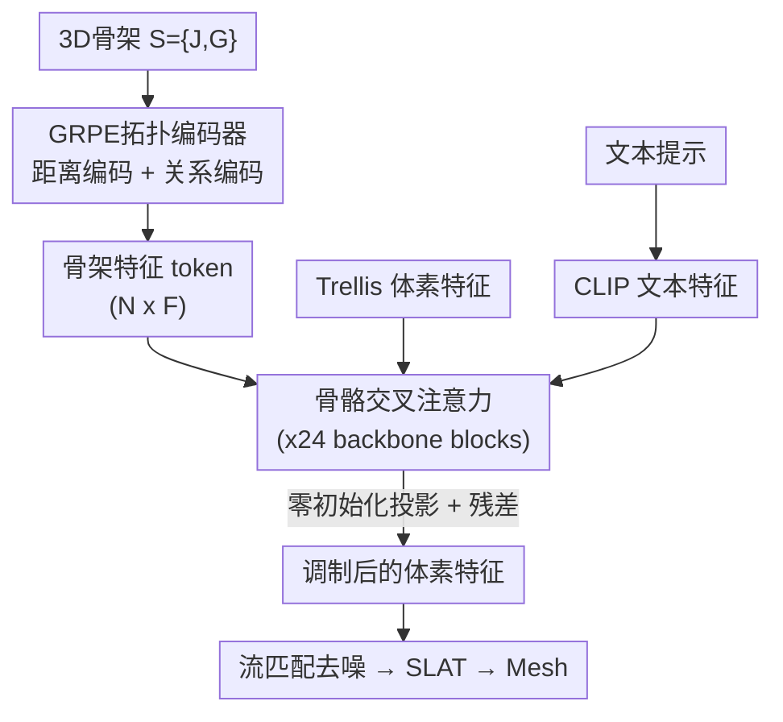

# SK-Adapter: Skeleton-Based Structural Control for Native 3D Generation

**会议**: ECCV2026  
**arXiv**: [2603.14152](https://arxiv.org/abs/2603.14152)  
**项目页**: https://sk-adapter.github.io/  
**代码**: 待确认  
**领域**: 3D视觉  
**关键词**: 3D骨架控制, 原生3D生成, Adapter微调, 图相对位置编码, 骨骼引导生成

## 一句话总结

SK-Adapter 提出将 3D 骨架作为第一类控制信号，通过轻量级 adapter 网络（GRPE 拓扑编码 + 骨骼交叉注意力）注入冻结的 3D 流匹配生成骨干（Trellis），在保留预训练生成先验的前提下实现面向原生 3D 空间的精确骨架结构控制，同时配套构建了 24k 图文-网格-骨架三元组数据集 Objaverse-TMS。

## 研究背景与动机

原生 3D 生成模型（如 Trellis、Hunyuan3D）近年来取得了飞跃式进展，能够在数秒内从文本或图片生成高保真 3D 资产。然而，这些模型面临一个关键缺陷：无法指定精确的结构姿态。文本提示可以描述「一只站立的狗」，却无法精确表达「膝盖弯曲 60 度」或「左前肢前伸、右后肢后蹬」这类具体的关节级拓扑约束；图片提示提供的是视角特定的外观线索而非完整的结构规格。对于动画和游戏管线，显式的结构控制是接入下游流程的前提——生成的资产必须能够被重新绑定骨骼、驱动动画，而当前原生 3D 生成模型缺乏这种结构层面的可控性。

在 2D 生成领域，骨骼引导已经非常成熟：ControlNet 和 T2I-Adapter 通过注入 2D 人体姿态骨架实现了精确的布局和姿态控制。受此启发，SKDream 等 3D 工作尝试通过「2D 提升」策略将 3D 骨架投影到 2D 平面，以此条件化多视角扩散模型，再经重建和 UV 细化得到 3D 资产。然而这种方法存在一个根本性的维度不匹配问题：3D 结构被压缩到 2D 平面后深度信息完全丢失，自遮挡更让模型误解复杂拓扑关系；多阶段重建管线还会退化纹理质量、引入几何伪影，最终结果的结构保真度和视觉质量都大打折扣。

本文的核心洞察是：精确的结构控制要求控制信号与生成空间同构——骨架信息应当在原生 3D 空间直接注入，而不经过有损的 2D 投影瓶颈。然而，将大规模 3D Transformer 适配到严格的骨架结构约束而不发生灾难性遗忘是一个关键难题。**核心 idea：将 3D 骨架编码为拓扑感知的稀疏空间 token，通过轻量 adapter 的交叉注意力层注入冻结的 Trellis 生成骨干，在对预训练先验零遗忘的前提下实现精确的骨骼结构控制。**

## 方法详解

### 整体框架

SK-Adapter 以 Trellis 的 Sparse Flow Transformer 为冻结骨干，在其每个 DiT block 中插入一套专为骨骼控制设计的轻量适配模块。输入包含三部分：一个 3D 骨架 $\mathcal{S} = \{J, G\}$（关节坐标 $J \in \mathbb{R}^{N \times 3}$ + 拓扑图 $G$）、文本提示、以及高斯噪声；输出是与骨架结构和文本语义一致的 3D 资产（SLAT latent → Mesh/Gaussian）。整个流程由两个核心模块串联工作：GRPE 拓扑编码器将骨架树结构解析为结构感知的 token 序列，然后在每个 backbone block 中通过骨骼交叉注意力让体素特征动态关注最相关的骨架关节。

### 关键设计

**1. GRPE 拓扑编码：将骨架的几何位置与层级拓扑编码为结构感知 token**

直接使用关节坐标作为控制信号是不够的——两个空间上接近但拓扑上很远的关节（如左手和左脚）在生成中应扮演截然不同的角色。SK-Adapter 采用图相对位置编码（GRPE）将骨架树结构的两个维度量化编码为注意力偏置。第一个维度是拓扑距离 $D_{ij}$：两关节间最短路径长度，截断到 $d_{\text{max}}=5$ 共 6 级（自环 / 1 跳 / 2 跳 / 3 跳 / 4 跳 / ≥5 跳或断开），学三组嵌入矩阵（query/key/value 各一组）注入注意力计算。第二个维度是边关系 $R_{ij}$：六类有向语义关系，分别是自环（有子节点）、父节点、子节点、兄弟节点（同父不同关节）、远亲（无直接运动学关系）和末端效应器（叶节点，如指尖、脚趾、头顶）。其中末端效应器被单独编码而非归入自环，是因为叶关节是逆运动学中最常被用户直接操控的点，值得模型单独学习其结构先验。关系矩阵是非对称的：若关节 i 是 j 的父节点则 $R_{ij}=$Parent 而 $R_{ji}=$Child，兄弟关系对称。经过 GRPE 编码后得到 $N \times F$ 的骨架嵌入矩阵 $\mathbf{f}_{\text{skel}}$，每个关节 token 同时携带了其空间坐标和在全关节树中的结构身份。

**2. 骨骼交叉注意力：让体素特征动态关注最相关的骨架关节**

有了骨架 token 之后，关键是如何将其接入 3D 生成过程。SK-Adapter 的做法是在冻结 backbone 的每个 DiT block 的标准自注意力之后插入一个专门的交叉注意力层。该层的 Query 来自 backbone 的中间体素特征 $\mathbf{h}_{\text{base}}$，Key 和 Value 来自 GRPE 编码的骨架 token $\mathbf{f}_{\text{skel}}$。这使得每个空间体素都能动态地关注到对它最有约束力的那些关节：生成腿部时高权重关注腿关节，生成躯干时关注脊柱关节，生成末端时关注末端效应器。交叉注意力的输出经过零初始化的线性投影层 $\mathbf{W}_o$，再通过残差连接加到原体素特征上作为最终隐藏状态 $\mathbf{h}' = \mathbf{h} + \mathbf{W}_o \mathbf{f}_{\text{attn}}$。零初始化的巧妙之处在于训练开始时 adapter 贡献的信号为零，整个 backbone 的输出分布与冻结状态完全一致，保证了生成先验零损失；随着训练推进，投影层逐渐学会根据骨架约束调制体素 latent。训练时整个 Trellis 骨干完全冻结，仅 GRPE 编码器、交叉注意力层和零初始化投影层可训练（约 151M 参数，仅占骨干的很小比例），从机制上杜绝了灾难性遗忘。

**3. Objaverse-TMS 数据集：填补骨架-文本-网格三元组数据空白**

训练骨架引导的 3D 生成需要同时对齐三个模态：描述（文本）、几何（网格）和结构（骨架）。现有的数据集要么只有骨架无文本描述（Rig-XL、Articulation-XL），要么有文本描述但骨架是自动生成的（SKDream 的 Objaverse-SK 存在解剖不一致问题）。SK-Adapter 从 Anymate（提供专家标注骨架）和 CAP3D（提供文本描述）的交集中提取数据，经筛选后得到 24k 条高质量的 text-mesh-skeleton 三元组。专家标注的骨架比自动生成的呼吸骨架具有更合理的关节位置和骨骼结构，使模型学到了更准确的关节拓扑先验。数据集覆盖人形、动物和其他物体三个类别的多样化姿态，为训练提供了可靠的标注基础。

### 损失函数 / 训练策略

训练遵循潜在流匹配（Latent Flow Matching）范式。对真实 3D 资产，先用冻结的体素编码器获得其稀疏 latent $\mathbf{z}_0$，定义从高斯噪声 $\mathbf{z}_1$ 到 $\mathbf{z}_0$ 的线性插值路径 $\mathbf{z}_t = (1-t)\mathbf{z}_0 + t\mathbf{z}_1$，训练 SK-Adapter 增强模型 $v_\theta$ 预测将噪声变换到骨架与文本双重条件化目标的 velocity field：

$$
\mathcal{L}_{FM} = \mathbb{E}_{t,\mathbf{z}_0,\mathbf{z}_t} \| v_\theta(\mathbf{z}_t, t, \mathbf{c}_{\text{text}}, \mathbf{f}_{\text{skel}}) - \mathbf{u}_t(\mathbf{z}_0) \|^2
$$

在 Objaverse-TMS 上训练 200 epoch，batch size 16，学习率 $1\times 10^{-5}$。对文本条件施加 10% dropout 以支持无分类器引导，骨架条件不做 dropout。

## 实验关键数据

### 主实验

测试集 TMS-eval 包含 140 个实例（54 人形、63 动物、23 其他物体）。结构对齐用 ReRigging Score（对生成网格重新绑定骨架后与条件骨架的 Chamfer Distance，真实网格 oracle 参考值为 0.2073），视觉质量用 PickScore 和 KD-DINO。

| 指标 | SKDream | SpaceControl | SK-Adapter（本文） |
|------|---------|-------------|------------------|
| ReRigging Score ↓（Overall） | 0.2818 | 0.2740 | **0.2228** |
| ReRigging ↓（Humanoid） | 0.2385 | 0.2282 | **0.1740** |
| ReRigging ↓（Animal） | 0.2730 | 0.2898 | **0.2415** |
| ReRigging ↓（Other） | 0.4075 | 0.3386 | **0.2861** |
| CLIP Score ↑ | 25.65 | 25.66 | **26.16** |
| PickScore ↑ | 20.46 | 20.55 | **21.01** |
| KD-DINO ↓ | 1.3809 | 1.7821 | **0.7778** |
| 生成时间 | ~40s | <15s | <15s |

### 消融实验

在 8k 子集上训练 200 epoch 的消融结果（Full Model 因训练子集变小指标略低于全量训练的主结果 0.2228，但相对关系不变）。

| 配置 | ReRigging ↓（Overall） | CLIP ↑ | PickScore ↑ |
|------|------------------------|--------|-------------|
| Full Model | **0.2355** | 26.11 | **20.94** |
| w/o 专用交叉注意力 | 0.5049 | 24.71 | 20.54 |
| w/o 拓扑编码（仅关节坐标） | 0.2527 | 26.14 | 20.90 |

### 关键发现

- 专用交叉注意力是结构性最强的贡献模块：去掉后 ReRigging Score 翻倍至 0.5049，说明骨架控制需要与传统文本/图像条件隔离的专用注意力通道，二者混用会导致结构约束被语义信号淹没
- 拓扑编码带来稳定、一致的增益，去除后 ReRigging 从 0.2355 退化至 0.2527，在复杂关节结构（如动物多肢）上退化更明显
- 生成质量（PickScore / KD-DINO）未因结构控制的引入而牺牲——冻结骨干的适配策略有效保留了 Trellis 的高频细节和纹理生成能力
- 在人形类别上效果最佳（ReRigging 0.1740 接近 oracle 0.2073），other 类别因拓扑多样性大而最具挑战性

## 亮点与洞察

- **零初始化交叉注意力注入**：adapter 输出过零初始化线性层再残差到 backbone，训练开始时控制信号为「空」，骨干分布完全不受干扰，这一设计让 151M 参数的大规模 adapter 也能稳定训练
- **GRPE 关系编码的精细设计**：不仅编码距离，还区分父/子/兄弟/末端效应器四种有向关系，使模型能学到「父关节牵引子关节 vs 兄弟关节协同平衡」这两种截然不同的物理约束——这是坐标位置编码做不到的
- **编辑能力的自然延伸**：骨架控制的解耦性使得区域级编辑成为可能——替换局部骨架后用重绘策略重新生成被 mask 区域的体素 latent，无需任何微调就能实现添加/重新摆姿操作
- **训练数据的关键角色**：专家标注骨架 vs 自动生成骨架（SKDream）的对比较为关键——从消融结果看，更好的骨架质量是 SK-Adapter 大幅领先的支撑因素之一

## 局限与展望

- 生成质量受限于 Trellis 基座模型的能力，在面部、精细纹理等细节区域仍会出现失真，这是 adapter 范式本身的固有天花板
- 当输入骨架过于复杂（如手指的密集交叉拓扑）时，结构引导变得模糊，局部几何质量下降——GRPE 的截断距离 $d_{\text{max}}=5$ 可能限制了超长距离关节对的表达能力
- Objaverse-TMS 仅 24k 规模，类别偏向人形/动物，对抽象拓扑（机械装置、建筑结构）的泛化能力存疑
- 未来方向：结合更高分辨率 3D 基础模型、更强的文本编码器、在更大规模数据上训练

## 相关工作与启发

- **vs SKDream (CVPR 2025)**：SKDream 将 3D 骨架投影到 2D 条件化多视角扩散再重建为 3D，面临空间模糊性和多视角不一致；SK-Adapter 在原生 3D 空间直接注入骨架 token，结构对齐 ReRigging Score 从 0.2818 降至 0.2228，且生成速度快 2.5 倍
- **vs SpaceControl**：SpaceControl 是 Trellis 上的训练自由空间引导方法，通过将骨架转为体素网格并在推理时注入；无训练范式限制了其结构对齐精度（0.2740），且过度约束导致拓扑断裂；SK-Adapter 通过学习式适配器实现了更精确且鲁棒的控制
- **vs ControlNet / T2I-Adapter**：2D 时代 adapter 范式在 3D 空间的延伸——核心差异在于骨架 token 代替了 2D pose 图像、交叉注意力注入冻结的 3D Transformer 而非 2D UNet

## 评分

- 新颖性: ⭐⭐⭐⭐☆ 首次将 skeleton adapter 引入原生 3D 生成体素空间，GRPE 拓扑编码 + 交叉注意力适配器设计简洁有效
- 实验充分度: ⭐⭐⭐⭐☆ 定量的结构对齐和视觉质量指标充分，消融实验清晰验证了各组件的贡献；编辑能力仅有定性展示，缺少定量评估
- 写作质量: ⭐⭐⭐⭐⭐ 动机链条清晰，从 2D 到 3D 的维度不匹配论证层层递进，方法描述完整且公式精准
- 价值: ⭐⭐⭐⭐⭐ 填补了原生 3D 生成亟需的结构控制空白，适配器范式为 3D 可控生成提供了简洁高效的基准方案

<!-- RELATED:START -->

## 相关论文

- [\[CVPR 2026\] Native and Compact Structured Latents for 3D Generation](../../CVPR2026/3d_vision/native_and_compact_structured_latents_for_3d_generation.md)
- [\[CVPR 2026\] PoseMaster: A Unified 3D Native Framework for Stylized Pose Generation](../../CVPR2026/3d_vision/posemaster_a_unified_3d_native_framework_for_stylized_pose_generation.md)
- [\[CVPR 2026\] Animator-Centric Skeleton Generation on Objects with Fine-Grained Details](../../CVPR2026/3d_vision/animator-centric_skeleton_generation_on_objects_with_fine-grained_details.md)
- [\[ICLR 2026\] QuadGPT: Native Quadrilateral Mesh Generation with Autoregressive Models](../../ICLR2026/3d_vision/quadgpt_native_quadrilateral_mesh_generation_with_autoregressive_models.md)
- [\[CVPR 2026\] Think-Then-Generate: Structural Chain-of-Thought Reasoning for Consistent 3D Generation](../../CVPR2026/3d_vision/think-then-generate_structural_chain-of-thought_reasoning_for_consistent_3d_gene.md)

<!-- RELATED:END -->
