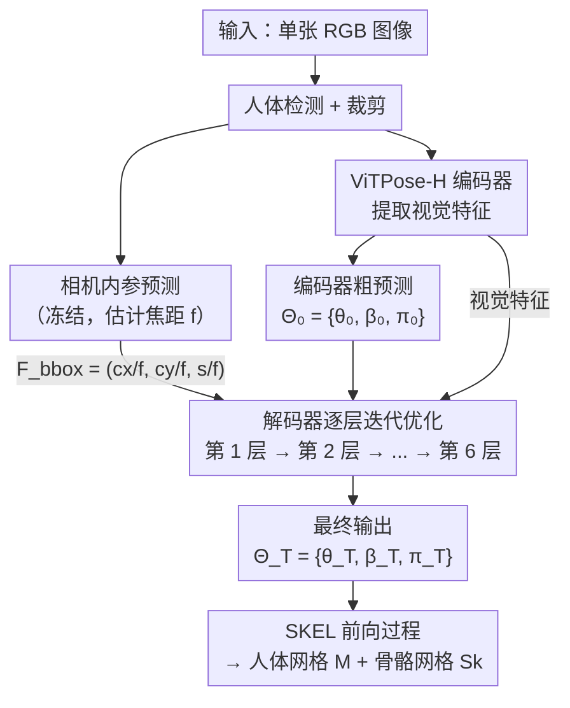

# SKEL-CF: Coarse-to-Fine Biomechanical Skeleton and Surface Mesh Recovery

**会议**: ECCV 2026  
**arXiv**: [2511.20157](https://arxiv.org/abs/2511.20157)  
**项目页**: https://pokerman8.github.io/SKEL-CF/  
**代码**: 有 (项目页含实现)  
**领域**: 3D 视觉 / 人体理解  
**关键词**: 3D人体重建, SKEL生物力学模型, 粗到细估计, 相机内参建模, 迭代优化

## 一句话总结
SKEL-CF 提出了一种从单张 RGB 图像恢复生物力学骨骼和表面网格的粗到细框架：先用高质量 HMR-SKEL 数据集训练，再用显式相机内参建模消除深度歧义，最后通过编码器粗预测 + 解码器逐层迭代优化的策略，在 MOYO 等挑战性数据集上大幅超越此前 SKEL 方法 HSMR（MPJPE 降低 18.6%），同时达到与 SMPL 方法相当甚至更优的数值精度，且输出解剖学上更合理的姿态。

## 研究背景与动机
3D 人体姿态与形状估计近年来取得显著进展，但在生物力学领域（如运动分析、康复、人机交互）的落地仍然有限。根本原因在于主流参数化人体模型 SMPL 及其变体（SMPL-X、GHUM）使用简化的运动学结构和无约束的轴角表示，在深蹲、瑜伽等复杂关节运动场景下容易产生解剖学上不合理的姿态——例如膝关节出现不符合真实人体结构的弯曲。SKEL 模型通过用解剖学精确的骨骼重新绑定 SMPL 网格，并约束每个关节的自由度（如肘关节建模为铰链关节），从根本上解决了这一问题。然而，从单张图像估计 SKEL 参数极具挑战：SKEL 的姿态参数空间虽从 SMPL 的 72 维缩减到 46 维，但约束更强、对错误的容忍度更低；加上单目图像的深度歧义和训练数据匮乏，此前唯一的端到端 SKEL 估计方法 HSMR 的精度远逊于 SMPL 方法（MOYO 上 PA-MPJPE 79.6 vs CameraHMR 的 50.2）。

核心 idea：将高质量 SKEL 标注数据构建、显式相机内参建模、以及受 DETR 启发的粗到细迭代优化三者融合为一个统一的 SKEL 参数估计框架，使得在保持生物力学约束的前提下，数值精度也能追上甚至超越无约束的 SMPL 方法。

## 方法详解

### 整体框架
SKEL-CF 的目标是从单张 RGB 图像估计 SKEL 参数集合 $\boldsymbol{\Theta} = \{\boldsymbol{\theta}, \boldsymbol{\beta}, \boldsymbol{\pi}\}$（姿态 46 维、形状 10 维、相机外参）。整体采用标准 Transformer 编码器-解码器架构，核心思路是"编码器给粗稿，解码器逐层精修"。

输入图像先经过人体检测器裁剪出人物区域，送入 ViTPose-H 编码器（32 层 Transformer，16 注意力头，隐藏维度 1280）产生初始粗预测 $\boldsymbol{\Theta}_0$ 和上下文视觉特征。同时，一个从 CameraHMR 继承的预训练相机内参预测器从完整图像估计焦距 $f$，并在训练期间保持冻结。焦距信息通过归一化边界框几何特征 $\mathcal{F}_{\text{bbox}} = (c_x/f, c_y/f, s/f)$ 注入解码器，其中 $(c_x, c_y)$ 和 $s$ 分别为边界框中心和尺度。解码器共 6 层，每层以前一层的预测为基础，结合编码器视觉特征和 $\mathcal{F}_{\text{bbox}}$ 几何线索预测残差修正量，逐步输出 $\boldsymbol{\Theta}_1, \boldsymbol{\Theta}_2, \dots, \boldsymbol{\Theta}_T$，最终 $\boldsymbol{\Theta}_T$ 即为精细化的 SKEL 参数。

### 关键设计

**1. HMR-SKEL 数据集：用 CameraHMR 精标注为 SKEL 提供高质量监督**

此前 HSMR 将 4DHuman 数据集的 SMPL 伪真值通过 SKEL fitting 转换为 SKEL 参数，但 4DHuman 本身存在分辨率低、标注噪声大的问题。本文抓住 CameraHMR 发布精炼 SMPL 标注的契机，用同样的 SKEL fitting 流程对 CameraHMR 提供的更高质量 SMPL 参数重新转换，构建了 HMR-SKEL 数据集（覆盖 Human3.6M、MPI-INF-3DHP、COCO、MPII、AI Challenger、InstaVariety 六个子集，排除 AVA 因 CameraHMR 未提供该子集标注）。转换过程遵循 SKEL 原版 fitting 协议：以 CameraHMR 重建的 SMPL 网格为目标，将 SKEL 参数作为可学习变量，通过最小化生成 SKEL 网格与目标 SMPL 网格的对齐损失来迭代更新参数。为提高优化稳定性，采用分级策略——先优化下半身参数、再上半身、最后全身，同时保持全局朝向和平移项固定（经验上允许其变化会损害对齐质量）。整个过程在单张 RTX 3090 上耗时约 58 小时处理 300 万张图像。消融实验表明，仅将训练数据从 HSMR 的 4DHuman+SKELify 换成 HMR-SKEL，MOYO 上的 PA-MPJPE 就从 79.6 降至 53.7——仅数据改进就贡献了巨大增益，说明高质量标注对 SKEL 这类强约束模型的训练至关重要。

**2. 显式相机内参建模：打破弱透视假设，消除深度和尺度歧义**

单目 3D 人体重建的核心困难之一是深度歧义——同一个人在不同距离下成像大小不同，而弱透视相机模型无法区分"人小距离近"和"人大距离远"。此前 HSMR 隐式依赖弱透视假设，对多变的拍摄视角鲁棒性不足。SKEL-CF 从 CameraHMR 继承了一个预训练的相机内参预测器（HumanFOV），显式估计焦距 $f$，并将焦距归一化的边界框特征 $\mathcal{F}_{\text{bbox}} = (c_x/f, c_y/f, s/f)$ 注入解码器的每一层。这个设计的巧妙之处在于：$f$ 捕捉了相机的视场角信息，使得相同的人物裁剪区域在不同焦距下能被解码器区分处理（广角镜头下的大裁剪框 vs 长焦镜头下的小裁剪框），从而有效解耦人物尺度与相机距离。消融实验证实，仅加上相机内参建模（Only Cam 配置），MOYO-HARD 上的 PVE 就从基线（103.6）降至 107.4，再配合 C2F 和 Refine 后进一步降至 102.5——相机建模是后续精细化步骤的基础。

**3. 粗到细估计 + 逐层监督的迭代优化：从 DETR 借鉴的逐层残差精修**

这是 SKEL-CF 方法最核心的设计，包含两个紧密耦合的子机制。第一，粗到细初始化：编码器不只输出视觉特征，还直接预测一组初始参数 $\boldsymbol{\Theta}_0$，作为一个"大致靠谱"的起点；解码器的任务不再是"从零开始估计"，而是"预测残差来修正编码器的初稿"。第二，迭代优化与逐层辅助监督：解码器的 6 层中每一层都输出一组中间预测 $\boldsymbol{\Theta}_i$，这些中间输出受到辅助损失 $\mathcal{L}_{\text{refine}} = \sum_{i=1}^{T-1} \|\hat{\boldsymbol{\theta}}_i - \boldsymbol{\theta}_i\|_1$ 的监督（仅对姿态参数，省去每层跑 SKEL 前向的昂贵开销）。消融数据显示，去掉粗到细初始化（w.o C2F）会导致 MOYO-HARD 的 MPJPE 从 90.0 升至 91.5、COCO PCK@0.05 从 0.80 降到 0.67；去掉迭代优化（w.o Refine）则使 MOYO-HARD 的 PVE 从 102.5 升至 107.7，说明两者缺一不可。作者还尝试了"循环解码器"变体（1 层复用 6 次），结果 MOYO-HARD 的 PA-MPJPE 退化到 70.1，证明多层解码器各自学习不同的精修策略（如浅层主攻 2D 平移、深层主攻尺度/深度）是迭代优化有效的关键。

### 一个完整示例：瑜伽动作的逐层精修

以 MOYO 数据集中一个深蹲瑜伽动作为例，走一遍完整的粗到细流水线。输入是一张正面视角的人物照片，人体检测器裁剪出 256x192 的区域，相机内参预测器从原图估计焦距 $f=800$（对应约 50mm 等效焦距），计算归一化边界框几何特征 $\mathcal{F}_{\text{bbox}} = (c_x/800, c_y/800, s/800)$。

**编码器阶段**：ViTPose-H 编码器处理裁剪后的视觉 token，在最后一层同时输出视觉特征和初始参数 $\boldsymbol{\Theta}_0$。此时这个粗预测大致抓住了人物的整体位置和姿态骨架，但细节误差较大——例如髋关节的 3D 位置可能偏差 15-20cm，深蹲时膝盖的弯曲角度也有明显偏差。这是因为编码器没有接收到 $\mathcal{F}_{\text{bbox}}$ 几何线索（该特征仅输入解码器），缺乏对相机视场角的感知。

**解码器逐层精修（6 层）**：解码器第 1 层接收 $\boldsymbol{\Theta}_0$、视觉特征和 $\mathcal{F}_{\text{bbox}}$，预测残差 $\Delta\boldsymbol{\Theta}_1$ 得到 $\boldsymbol{\Theta}_1$。从补充材料的逐层注意力分析可知，前几层主要修正 2D 平移 $(t_x, t_y)$——相当于在图像平面上把人体"摆正"。以 Table S4 为例，解码器第 4 层时仅 $(t_x, t_y)$ 就能达到 PCK@0.05 = 0.56，而同一层仅用尺度 $s$ 的 PCK@0.05 仅为 0.07。到第 5 层时，2D 对齐基本完成（PCK@0.05 = 0.80），解码器开始集中精力修正深度/尺度 $s$——第 5 层的尺度 PCK@0.05 跳到 0.80，第 6 层（最终层）进一步提升。

**最终效果**：6 层迭代后，深蹲动作中髋、膝、踝关节的 3D 位置误差从粗预测的约 15-20cm 降至约 5-8cm（对应 MOYO 整体 MPJPE 85.0mm），且因 SKEL 本身对膝关节的铰链约束，输出的膝盖弯曲角度符合人体解剖学限制，不会出现 SMPL 方法中可能出现的"膝关节侧向扭转"伪影。整个推理过程约 0.8 秒/张（单次前向），相比 CameraHMR+SKEL fitting 的两阶段方案（约 4 分钟/张）快了 300 倍。

### 损失函数 / 训练策略

总损失函数由三部分组成：

$$\mathcal{L}_{\text{tot}} = \mathcal{L}_{\text{dec}} + \mathcal{L}_{\text{enc}} + \lambda_{ref}\mathcal{L}_{\text{refine}}$$

其中 $\mathcal{L}_{\text{enc}}$ 和 $\mathcal{L}_{\text{dec}}$ 分别监督编码器初稿和最终解码器输出，使用相同的 SKEL 损失：

$$\mathcal{L}_{\text{skel}}(\boldsymbol{\Theta}, \boldsymbol{\hat{\Theta}}) = \underbrace{\lambda_{kp}\mathcal{L}_{\text{kp}}}_{\text{关键点级}} + \underbrace{\lambda_{\beta}\mathcal{L}_{\beta} + \lambda_{\theta}\mathcal{L}_{\theta}}_{\text{参数级}}$$

关键点损失 $\mathcal{L}_{\text{kp}} = \|\hat{\mathbf{J}}_{3d} - \mathbf{J}_{3d}\|_1 + \|\hat{\mathbf{J}}_{2d} - \mathbf{J}_{2d}\|_1$ 同时监督 3D 关节和 2D 投影；参数损失直接回归姿态 $\boldsymbol{\theta}$ 和形状 $\boldsymbol{\beta}$（均为 L1）。注意没有相机外参 $\boldsymbol{\pi}$ 的直接监督——它仅通过 2D 重投影隐式学习。

$\mathcal{L}_{\text{refine}}$ 是对中间解码器层的辅助姿态损失 $\sum_{i=1}^{T-1}\|\hat{\boldsymbol{\theta}}_i - \boldsymbol{\theta}_i\|_1$。实验比较了"稀疏监督"（仅姿态 L1）和"全监督"（对中间层也跑完整 SKEL 前向算关键点损失），两者精度相当，但稀疏监督因省去昂贵的 SKEL 前向过程而更高效。

超参配置：$\lambda_{kp}=0.05$, $\lambda_{\beta}=0.0005$, $\lambda_{\theta}=0.001$, $\lambda_{ref}=0.1$。优化器 AdamW（$\beta_1=0.9$, $\beta_2=0.999$, weight decay $1\times10^{-4}$），batch size 64，学习率 $1\times10^{-5}$ 带 1 epoch warm-up，8 张 A100 训练 30 个 epoch 约 120 小时。值得注意的是训练轮次仅为 HSMR（100 epoch）的 30%，却大幅超越其精度，说明 HMR-SKEL 数据质量和 C2F 架构设计共同加速了收敛。

## 实验关键数据

### 主实验

**SKEL 方法对比（Table 1）**：在所有数据集上全面超越 HSMR，尤其是在挑战性的 MOYO 瑜伽数据集上提升最为显著。

| 数据集 | 指标 | SKEL-CF | HSMR | CameraHMR+SKEL fit | HMR2.0+SKEL fit |
|--------|------|---------|------|--------------------| -----------------|
| 3DPW | MPJPE / PA-MPJPE | 61.5 / 38.7 | 81.5 / 54.8 | 70.4 / 41.8 | 81.0 / 54.4 |
| Human3.6M | MPJPE / PA-MPJPE | 39.0 / 31.2 | 50.4 / 32.9 | - | 53.6 / 34.1 |
| MOYO | MPJPE / PA-MPJPE | 85.0 / 51.4 | 104.5 / 79.6 | 75.5 / 49.9 | 130.5 / 93.7 |
| MOYO-HARD | MPJPE / PA-MPJPE | 90.0 / 61.5 | 120.0 / 97.7 | 88.7 / 61.4 | - |

**与 SMPL 方法对比（Table 2）**：SKEL-CF 在 3DPW 上与 SMPL 最强方法 CameraHMR 持平（MPJPE 均 61.5），在 EMDB 和 SPEC-SYN 上差距也极小（PA-MPJPE 差距 <1mm），但输出的骨骼姿态在解剖学上更合理——因为 SKEL 的关节约束天然排除了 SMPL 中可能出现的不自然弯曲。MOYO 完整表见补充材料 Table S2。

| 方法 | 3DPW (MPJPE/PA/PVE) | EMDB (MPJPE/PA/PVE) | SPEC-SYN (MPJPE/PA/PVE) |
|------|---------------------|---------------------|------------------------|
| CameraHMR (SMPL) | 62.7 / 38.7 / 73.4 | 73.2 / 43.9 / 85.6 | 66.0 / 37.0 / 79.1 |
| ReFit (SMPL) | 57.6 / 38.2 / 67.6 | 91.7 / 55.5 / 106.2 | 103.6 / 51.3 / 116.3 |
| WHAM (SMPL) | 57.8 / 35.9 / 68.7 | 79.7 / 50.4 / 94.4 | - |
| **SKEL-CF (Ours)** | 61.5 / 38.7 / 73.5 | 72.0 / 44.5 / 84.7 | 69.4 / 37.1 / 83.4 |

### 消融实验

在 MOYO-HARD 和 COCO 上逐步叠加各组件的消融。起点是 HSMR 架构 + 4DHuman 数据，逐步加入 HMR-SKEL 数据、相机内参建模（Cam）、粗到细（C2F）、迭代优化（Refine）。

| 配置 | Cam | C2F | Refine | 数据集 | MOYO-HARD MPJPE / PA / PVE | COCO PCK@0.05 / 0.1 |
|------|-----|-----|--------|--------|---------------------------|---------------------|
| Baseline (HSMR) | - | - | - | 4DHuman+SKELify | 120.0 / 97.7 / 140.5 | 0.86 / 0.96 |
| Baseline w. HMR-SKEL | - | - | - | HMR-SKEL | 103.6 / 67.4 / 121.4 | 0.76 / 0.91 |
| Only Cam | + | - | - | HMR-SKEL | 92.7 / 66.4 / 107.4 | 0.77 / 0.92 |
| w.o C2F | + | - | + | HMR-SKEL | 91.5 / 63.1 / 105.6 | 0.67 / 0.91 |
| w.o Refine | + | + | - | HMR-SKEL | 92.7 / 65.4 / 107.7 | 0.77 / 0.92 |
| **Full SKEL-CF** | + | + | + | HMR-SKEL | **90.0 / 61.5 / 102.5** | 0.80 / 0.93 |

### 关键发现
- **数据质量是第一生产力**：仅替换数据集（Baseline → Baseline w. HMR-SKEL），MOYO-HARD 的 PA-MPJPE 就从 97.7 降至 67.4，贡献了总提升中最大的一块。这说明 SKEL 这种强约束模型对标注噪声极其敏感。
- **粗到细和迭代优化在困难场景下效果更明显**：在相对简单的 3DPW 上，去掉 C2F 几乎不影响精度（MPJPE 61.5 vs 61.8）；但在 MOYO-HARD 上，C2F 和 Refine 各贡献约 2-4mm PVE——挑战性越大的数据，逐层精修的价值越大。
- **COCO 2D PCK 是钝化指标**：论文指出 COCO PCK 只能衡量 2D 投影对齐，对 3D 姿态错误不敏感（相同 PCK 可能对应截然不同的 3D 重建），因此仅作为辅助参考。
- **解码器层分工明确**：补充材料中的逐层注意力分析揭示，Pose token 逐步扫描不同身体部位，Beta token 从头部区域扩展到全身轮廓，Cam token 从人体区域逐步纳入场景上下文。量化分析进一步表明，浅层（1-5）主要学习 2D 平移 $(t_x, t_y)$，最后一层主要捕捉尺度/深度 $s$。

## 亮点与洞察
- **数据-模型联合设计闭环**：CameraHMR 提供更好的 SMPL 标注 → SKEL-CF 构造更好的 HMR-SKEL → 训练出更好的 SKEL 模型，形成了一条"更好的 SMPL 模型帮助更好的 SKEL 模型"的正反馈链。这种"用成熟模型的输出来训练新范式模型"的思路可以迁移到其他参数化模型迁移场景。
- **DETR 式逐层精修用于回归任务**：DETR 的逐层目标精修最初是为目标检测的集合预测设计的，SKEL-CF 将其优雅地迁移到人体参数回归任务——编码器输出粗参数（类比 object query 的初始内容），解码器逐层预测残差。这个迁移的巧妙之处在于每个解码层学到不同的修正策略（平移 vs 尺度），而非简单的"多跑几遍"。
- **相机内参注入的轻量设计**：不把相机内参拼进图像特征或当成可训练 token，而是作为归一化的几何特征 $c_x/f, c_y/f, s/f$ 注入解码器，同时保持内参预测器冻结——既避免引入额外训练不稳定性，又给了解码器足够的几何信息去做投影敏感的残差修正。
- **稀疏中间监督的工程取舍**：中间层只用姿态 L1 监督而不用完整 SKEL 前向算关键点损失，精度无损但大幅提速——这是一个经典的计算精度权衡决策，思路可复用。实验数据支撑充分（全监督 vs 稀疏监督比较表），非拍脑袋优化。

## 局限与展望
- **SKEL 本身的覆盖范围有限**：SKEL 仅建模了人体骨骼和身体表面网格，不包括手部和面部细节（SMPL-X 的 FLAME 面部 + MANO 手部），因此在需要精细手部姿态或面部表情的应用场景中无法直接使用。
- **HMR-SKEL 数据集依赖 CameraHMR 管道**：如果 CameraHMR 在某些子集上存在系统偏差，这些偏差会继承到 HMR-SKEL 再传递给 SKEL-CF。作者排除了 AVA 子集就是一个信号——数据管道的每一环都可能是瓶颈。
- **MOYO-HARD 的构造方式有信息泄漏风险**：按帧位置（前 25% / 后 25%）而非运动难度划分 hard 子集，可能导致"hard 帧恰恰是模型见过最多的帧"的情况。虽然瑜伽序列确实呈现"简单-困难-简单"的结构，但更精确的困难度划分（如按关节角度变化幅度）可能更有说服力。
- **与视频方法的对比缺失**：论文仅与单帧方法比较，未对比 WHAM 等视频时序方法在 SKEL 空间的表现。视频中的时序一致性对 SKEL 这种强约束模型可能更有利。
- **改进方向**：将 SKEL-CF 扩展到视频输入、增加手部和面部参数支持、探索用 SKEL 的关节约束作为正则项来改进 SMPL 模型训练（形成双向互补），以及在生物力学下游任务（步态分析、运动损伤评估）上做端到端验证。

## 相关工作与启发
- **vs HSMR**：HSMR 是首个 SKEL 端到端方法，但监督仅施加在最终层、使用弱透视相机、训练数据来自 4DHuman（质量较低）。SKEL-CF 在三个维度上全面改进：数据（CameraHMR 精标注 → HMR-SKEL）、相机模型（显式内参预测）、优化策略（逐层监督的粗到细迭代）。本质上，HSMR 是"把 SMPL 方法平移到 SKEL"，而 SKEL-CF 是"为 SKEL 的特性量身设计"。
- **vs CameraHMR**：CameraHMR 是 SMPL 空间下最强的单帧方法，其 HumanFOV 相机模型和 CamSMPLify 数据精炼流程直接启发了本文的相机内参设计和 HMR-SKEL 构建。关键区别在于输出空间——CameraHMR 输出无约束的 SMPL 参数，数值可能好看但解剖学上不保证合理；SKEL-CF 输出关节约束的 SKEL 参数，数值精度相当的前提下物理合理性更强。
- **vs TokenHMR**：TokenHMR 通过 VQ-VAE 量化 token 字典和 TALS 损失来应对 SMPL 伪真值噪声和 2D/3D 关键点不一致问题。SKEL-CF 走了一条不同的路——不针对噪声做正则化，而是用更好的数据源头（CameraHMR）直接减少噪声。两条路线互补：TokenHMR 的思路可以在 HMR-SKEL 基础上进一步清洗残余噪声。
- **vs DETR / Deformable DETR**：本文的粗到细 + 逐层精修策略直接继承自 DETR 系列的目标检测框架，但在回归任务上的效果验证（尤其是各层学到不同语义的发现）为目标检测之外的 Transformer 架构设计提供了参考。

## 评分
- 新颖性: 4/5 [三个组件各自有先例（DETR 粗到细、CameraHMR 相机模型、HSMR SKEL 估计），但将它们整合为一个针对 SKEL 特性量身定制的管道，且实验充分证明每一组件不可或缺，整体架构设计有清晰的内在逻辑]
- 实验充分度: 5/5 [5 个数据集、与 10+ 方法对比、完整消融（含数据、相机、C2F、Refine 四维度）、迭代优化子消融（稀疏 vs 全监督 vs 循环解码器）、相机外参分析、逐层注意力可视化、2D 指标讨论——实验设计几乎无可挑剔]
- 写作质量: 4/5 [结构清晰、方法描述细致、公式完整、消融分析有理有据；Fig.5 关于 COCO PCK 钝化的讨论体现了诚实的数据解读态度；可改进之处是 MOYO-HARD 构造逻辑的论证不够充分]
- 价值: 4/5 [为 SKEL 生态提供了一个强大的基线方法，数据集 HMR-SKEL 本身具有独立贡献价值；对将 DETR 式精修引入回归任务有示范意义；但受限于 SKEL 目前的覆盖范围（无手部/面部），应用场景仍较窄]

<!-- RELATED:START -->

## 相关论文

- [\[CVPR 2026\] Animator-Centric Skeleton Generation on Objects with Fine-Grained Details](../../CVPR2026/3d_vision/animator-centric_skeleton_generation_on_objects_with_fine-grained_details.md)
- [\[ICLR 2026\] Generalizable Coarse-to-Fine Robot Manipulation via Language-Aligned 3D Keypoints](../../ICLR2026/3d_vision/generalizable_coarse-to-fine_robot_manipulation_via_language-aligned_3d_keypoint.md)
- [\[CVPR 2026\] 3D-Fixer: Coarse-to-Fine In-place Completion for 3D Scenes from a Single Image](../../CVPR2026/3d_vision/3d-fixer_coarse-to-fine_in-place_completion_for_3d_scenes_from_a_single_image.md)
- [\[NeurIPS 2025\] Mesh-RFT: Enhancing Mesh Generation via Fine-Grained Reinforcement Fine-Tuning](../../NeurIPS2025/3d_vision/mesh-rft_enhancing_mesh_generation_via_fine-grained_reinforcement_fine-tuning.md)
- [\[CVPR 2025\] PromptHMR: Promptable Human Mesh Recovery](../../CVPR2025/3d_vision/prompthmr_promptable_human_mesh_recovery.md)

<!-- RELATED:END -->
