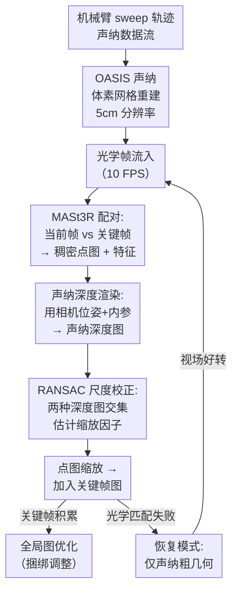

# Sonar-MASt3R: Real-Time Opti-Acoustic Fusion in Turbid, Unstructured Environments

**会议**: ECCV 2026  
**arXiv**: [2603.13585](https://arxiv.org/abs/2603.13585)  
**项目主页**: https://sonar-mast3r.github.io/  
**代码**: 有（项目主页开源）  
**领域**: 3D视觉 / 水下感知  
**关键词**: 水下三维重建, 声光融合, MASt3R, 实时重建, 浑浊环境

## 一句话总结
Sonar-MASt3R 将 MASt3R 的稠密光学匹配与声纳重建的尺度信息实时融合，在浑浊水体中实现带公尺度的高质量三维重建，经实验验证在 0.5—12 NTU 的浊度范围内均保持鲁棒。

## 研究背景与动机

水下干预操作（如科学勘探、基础设施巡检、打捞维护）高度依赖光学相机提供的实时视觉反馈。然而，水下作业往往涉及扰动沉积物、刮除生物附着物、钻孔或挖掘等行为，这些操作会迅速提高水体浊度，使光学相机因散射和衰减而严重退化，甚至导致作业中断。现有的水下感知方案要么完全依赖光学信息（在低能见度下不可靠），要么仅使用声纳数据（如 OASIS 系统），后者虽然对浊度不敏感，但空间分辨率有限，难以恢复厘米级物体的精细几何和纹理细节。早期声光融合方法大多基于几何公式化对应（如极线几何），只能得到稀疏的 3D 点且受限于已知标定目标；轮廓法虽提升了稠密度但仅能重建离散物体，不足以支持复杂场景中的操控。

这一困境的核心矛盾在于：光学数据可以提供高分辨率纹理和稠密几何，但受浊度影响严重；声纳提供了鲁棒的几何骨架，但往往过于稀疏或粗糙。更关键的是，现有声光融合方法或速度极慢（如 AoNeuS 的神经表面重建需要数小时优化），或无法恢复稠密几何。以 MASt3R-SLAM 为代表的全光学方案虽然能在空气中生成稠密重建，但其单目性质缺乏绝对尺度，且在浑浊条件下挑选关键帧时若无可匹配的光学特征会直接失效。本文的切入点是：既然 MASt3R 可以在空气中实时提取稠密的跨视角对应，而声纳数据本就提供了绝对空间尺度，就可以把二者的优势通过一个轻量的尺度校正步骤合并起来——不需要复杂的神经网络融合，不需要逐帧优化，只要用声纳重建渲染的深度图对 MASt3R 的点图做 RANSAC 缩放即可。**核心 idea：以 OASIS 声纳体素网格为"尺子"，将其渲染为与光学相机配准的深度图，通过 RANSAC 鲁棒估计 MASt3R 无尺度点图的相对缩放因子，在关键帧 SLAM 管线中实现带公尺度、鲁棒浊度的稠密实时三维重建。**

## 方法详解

### 整体框架

Sonar-MASt3R 的整个 pipeline 分为两个阶段。第一阶段是"初始化声纳图"：在低安全性风险下让机械臂以较快的 sweep 轨迹扫描工作空间，用 OASIS 方法从多波束成像声纳数据构建一个绝对尺度的体素网格（5cm 分辨率）。第二阶段是"实时声光融合"：在此网格就绪后，对每个新到的光学帧，先用 MASt3R 与上一个关键帧配对生成稠密点图（pointmap）、特征和置信度，然后将机械臂关节角度换算的相机位姿与相机内参一同输入声纳体素网格，沿每根像素射线采样得到声纳深度图像，用 RANSAC 在两种深度图的交集区域上估计一个全局缩放因子，将 MASt3R 的无尺度点图拉回公尺度。缩放后的点图以关键帧形式加入全局图优化，当关键帧数量积累到一定程度后触发捆绑调整（全局优化）以减小累积漂移。当水体浊度过高导致光学匹配失效时，系统自动降级进入"恢复模式"（Recovery Mode），仅依赖声纳重建提供粗几何骨架，并在视场条件好转后重新接入光学数据。

### 关键设计

**1. 声纳深度渲染实现绝对尺度校正：点图的尺子**  

这是本文最核心的设计。MASt3R 输出的点图 `$X_i^i \in \mathbb{R}^{H\times W\times 3}$` 以相机光心为原点，形状正确但尺度是任意的（不同图像对之间有差异）。为了把它约束到公尺度，作者先用相机的位姿 `$T_{Wf}$`（由机械臂正运动学提供）和内参 `$K_i$`，沿每根像素射线在声纳体素网格 `$V$` 中采样，得到对应视角的声纳深度图 `$D_A$`（公式 4）：`$D_A = \mathcal{F}_D(K_i, T_{Wf}, V)$`。再把 MASt3R 点图的深度 `$D_O = \|X_i^i\|$`（公式 3）与 `$D_A$` 配对，用 RANSAC 在共同可见区域上估计使二者尽量一致的全局缩放因子 `$s$`（RANSAC 天然对离群点鲁棒，可以容忍声纳图与光学图之间因分辨率差异导致的局部不一致）。这一设计的巧妙之处在于完全没有引入新的学习参数，完全复用已有的 MASt3R 稠密匹配能力和声纳的绝对几何——两个独立的感知通道在某种意义上共享了同一视角的几何知识。

**2. 关键帧管理与自适应的声光切换：从稠密到鲁棒**  

重建的稳定性依赖关键帧策略。每来一帧，用 MASt3R 与上一个关键帧做配对时，不仅计算点图，还输出点图置信度 `$C$` 和特征置信度 `$Q$`。高置信度的匹配点被用于尺度校正和帧间配准。当当前帧与上一个关键帧的视图重叠过少或光学特征置信度不足时（如浊度突然升高），当前帧不会被加入关键帧地图，系统切换至恢复模式。在恢复模式下，即使无新的光学关键帧加入，声纳重建本身也能提供工作空间的粗几何上下文（虽然分辨率有限），操作者仍可借助声纳的投影数据显示在实时可视化中定位物体。这种"有光学时用光学做稠密、无光学时用声纳保底"的双模态策略，是这篇方法能在 0.5–12 NTU 全范围工作的关键。

**3. 鱼眼图像校正与分辨率适配：打通 MASt3R 的水下适配**  

MASt3R 是在空气中的针孔相机数据集上训练得到的，其训练数据几乎没有严重径向畸变。但水下应用广泛使用鱼眼相机（为了获得更宽的视场角，同时避免平窗壳体中折射导致的有效视场收缩）。直接用原图送入 MASt3R 会导致点图严重扭曲。解决方法是预处理两步：先将 1600×1200 原图缩放到 MASt3R 输入上限 512×384（降低分辨率同时保持合适的宽高比），再对缩放后的鱼眼图像做去畸变校正（rectify），使其近似针孔投影模型。同样重要的是，这里使用的外参来自机械臂关节角度传感器 + 正运动学模型，而非视觉 SLAM 估计——这避免了单目视觉中的尺度模糊，也为声纳深度渲染提供了稳定的位姿锚点。

**4. 恢复模式与色彩校正：工程鲁棒性的最后防线**  

本文在工程执行层面还嵌入了几处重要处理。色彩校正模块针对水下特有的蓝绿色偏和光照衰减做白平衡处理，保证 MASt3R 在清洁度较高时能提取鲁棒的图像特征。恢复模式则针对极高浊度（>8 NTU）下光学匹配完全失效的场景：此时关键帧地图停止更新，但操作者仍能看到声纳体素网格的实时投影（类似 OASIS 的方法），视觉降级平滑、不产生空洞或者跳变。这种设计思想在真实水下作业中尤为关键——任何时候都不应该让操作者的屏幕突然黑掉。

### 损失函数 / 训练策略

本文方法无需重新训练任何模型。OASIS 声纳重建和 MASt3R 稠密匹配均为已有方法直接使用，Sonar-MASt3R 的融合策略仅涉及几何变换和鲁棒估计（RANSAC），不包含可训练参数。GPU 上的声纳重建管线经过改造（CPU → GPU）实现了 100+ FPS 的体素处理速度。

## 实验关键数据

### 主实验

在一个 2.1m 直径、1.5m 深的实验水槽中布置了包含多种材质和几何形状的物体（货物网袋、推芯取样管、砖块、链钩、牛奶箱、煤渣砖、杯子、管道、岩石等共 10 种物体），在 8 个浊度等级（<0.5、0.83、2.61、3.92、5.41、7.84、11.31、12.39 NTU）下采集光学+声纳数据。与 MASt3R-SLAM 和 Metashape（商用 SfM 软件）做定性对比。

| 数据集 | 浊度 (NTU) | Sonar-MASt3R | MASt3R-SLAM | Metashape |
|--------|-----------|--------------|-------------|-----------|
| A | <0.5 | 稠密重建完整，公尺度 | 重建完整，无尺度 | 重建完整，无尺度 |
| C | 2.61 | 重建仍完整 | 部分丢失特征 | 点云稀疏 |
| E | 5.41 | 重建基本完整 | 大面积失败 | 严重退化 |
| F | 7.84 | 物体可辨认，部分细节丢失 | 完全失败 | 完全失败 |

### 消融实验

| 配置 | 物体尺寸误差范围 | 说明 |
|------|-----------------|------|
| Sonar-MASt3R（含所有模块） | 11%–38%（均值约 20%） | 整体公尺度重建、物体可辨认 |
| 仅 MASt3R-SLAM（无声纳校正） | 无公尺度 | 浑浊下易失败，且点云尺度不定 |
| 仅声纳 OASIS（无光学融合） | — | 可分辨大物体，小物体无法重建 |
| 恢复模式 | — | 极高浊度下仍可提供粗几何上下文 |

### 关键发现

- 声纳深度渲染提供的尺度校正是稳定的：10 种检测物体的尺寸标准差在 0.007–0.055m 之间，说明跨浊度等级的尺寸一致性良好。但物体尺寸整体偏小约 10%–38%，作者认为可能是 5cm 的声纳体素分辨率偏粗导致深度渲染偏近。
- MASt3R 在 <5 NTU 时仍可提取有效的跨帧匹配，但在 >8 NTU 时完全失效——这正是恢复模式的触发点。
- 鱼眼去畸变预处理对重建质量至关重要：未去畸变的鱼眼图像直接输入 MASt3R 会输出严重变形的点图。
- 在 <0.5 NTU 的清洁条件下，Sonar-MASt3R 的重建细节（砖块孔洞、链钩环、杯子把手）甚至可与光学 SfM 方法相当，同时自带公尺度。

## 亮点与洞察

- **"尺子"的设计极简但有效**：用声纳体素格渲染深度图->RANSAC 缩放点图，不引入任何可训练参数，将两个独立感知通道的几何优势以零学习代价合并。这种轻量融合思路可迁移到任何单目深度估计方法（如 MiDaS、Depth Anything）需要绝对尺度校正的场景。
- **自适应声光切换**：不是硬性的模态切换，而是随着光学置信度下降平滑地过渡到声纳粗几何——在任何浊度下操作者的可视化界面都不会因为重建失败而完全失能，这是一个面向真实部署的工程直觉。
- **鱼眼校正+分辨率预备**：看似是简单的预处理，但由于 MASt3R 的训练数据分布与水下鱼眼图像差异巨大，这个校正步骤是决定方法能否工作的前提，值得复用者在类似域适应场景中注意。
- **论文提供了带标定浊度的声光融合数据集**：这是目前少有的在受控浊度条件下采集的多模态水下数据集，可作为未来水下感知研究的标准化评测基准。

## 局限与展望

- 物体尺寸系统性地偏小 10–38%，作者将其归因于 5 cm 声纳体素分辨率过粗导致渲染深度偏近。更高分辨率（如 1 cm）的 GPU 声纳重建已实现 100+ FPS，但会带来更多内存消耗和体素采样噪声之间的权衡。
- 目前严重依赖外部位姿信息（机械臂关节角+正运动学），这对固定基座机械臂是可行的，但将其扩展到自由游动的 ROV/AUV（需额外使用 SLAM 或惯性导航）仍有挑战。
- 动态环境支持尚未实现：场景中如果有移动物体（如机械手操作时正在移动的目标），当前的关键帧图优化无法处理。
- 实验规模有限（2.1m 水槽、10 种物体），在真实开放水域/打捞现场的泛化能力有待验证。
- 声光数据在时间上要求同步，目前的频率为 10 FPS 同步采集，未来可探索异步融合或事件驱动的模式。

## 相关工作与启发

- **vs MASt3R-SLAM**: MASt3R-SLAM 是全光学方案，缺乏尺度且在浑浊场景下关键帧选取会失败。Sonar-MASt3R 引入声纳体素网格提供绝对尺度和鲁棒几何，是直接的"光学+声纳"感官互补。
- **vs OASIS**: OASIS 仅使用声纳进行三维重建，空间分辨率不足以恢复小物体细节。Sonar-MASt3R 在声纳骨架基础上加入 MASt3R 光学稠密信息补全了精细几何。
- **vs AoNeuS**: AoNeuS 使用神经表面重建获得高分辨率声光融合结果，但优化时间以小时计。Sonar-MASt3R 的目标是实时性，以一定的几何精度换来了可交互的帧率。
- **vs 通用单目尺度恢复思路**: 类似方法（如用 LiDAR 深度或 RGB-D 传感器校正单目深度）在室内场景已广泛使用，本文将其创新性地移植到了水下声光融合场景，并针对浑浊条件和鱼眼畸变做了适配。

## 评分

- 新颖性: ⭐⭐⭐⭐ 将 MASt3R+声纳体素网格的零学习融合思路用于水下实时重建，设计简洁有效，声光自适应切换是实操亮点。
- 实验充分度: ⭐⭐⭐⭐ 8 个浊度等级、10 种物体的系统性评测，含定性+定量结果，但缺少定量指标（如 PSNR、F-score、Chamfer 距离）的数值对比。
- 写作质量: ⭐⭐⭐⭐ 方法描述清晰，关键设计点突出，但部分实验描述依赖图注理解。
- 价值: ⭐⭐⭐⭐ 解决了水下干预作业中一个真实的感知瓶颈，数据集和方法均开源，对海洋机器人社区有实用参考意义。

<!-- RELATED:START -->

## 相关论文

- [\[CVPR 2025\] MASt3R-SLAM: Real-Time Dense SLAM with 3D Reconstruction Priors](../../CVPR2025/3d_vision/mast3r-slam_real-time_dense_slam_with_3d_reconstruction_priors.md)
- [\[CVPR 2026\] Changes in Real Time: Online Scene Change Detection with Multi-View Fusion](../../CVPR2026/3d_vision/changes_in_real_time_online_scene_change_detection_with_multi-view_fusion.md)
- [\[ECCV 2026\] GaussLite: Online Task-Conditioned 3D Gaussian Splatting for Real-Time Robotic Mapping](gausslite_task_conditioned_3dgs_mapping.md)
- [\[ECCV 2026\] RAGA: Real Time Ray Traced Gaussian Shadow Casting for 3DGS Avatar-Scene Interaction](raga_real_time_ray_traced_gaussian_shadow_casting_for_3dgs_avatar-scene_interact.md)
- [\[ECCV 2026\] OP3DSG: Open-Vocabulary Part-Aware 3D Scene Graph Generation for Real-World Environments](op3dsg_open-vocabulary_part-aware_3d_scene_graph_generation_for_real-world_envir.md)

<!-- RELATED:END -->
