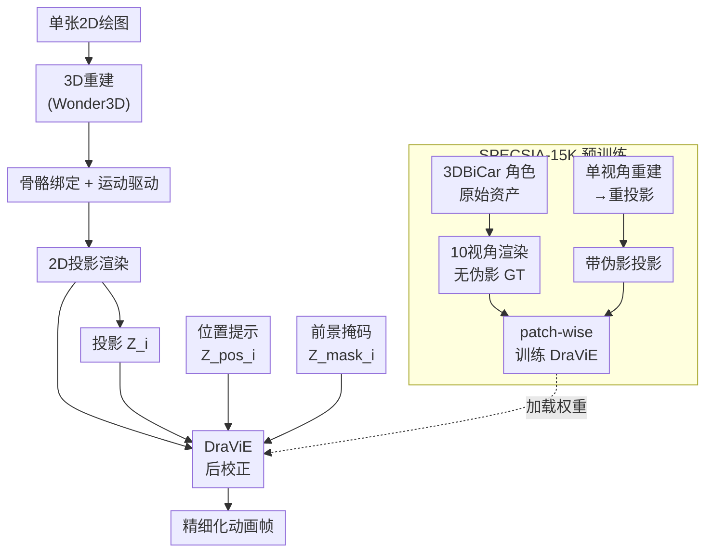

# SPECSIA: Stylization Dataset for Novel-View Enhancement in Drawing-based 3D Animation

**会议**: ECCV2026  
**arXiv**: [2607.00525](https://arxiv.org/abs/2607.00525)  
**代码**: 无（将发布）  
**领域**: 3D视觉  
**关键词**: 绘图驱动动画, 新视角增强, 投影伪影校正, 成对风格化数据集, 数据级预训练  

## 一句话总结

本文提出 SPECSIA-15K 成对风格化数据集（14,980 对带伪影投影与干净目标）和轻量即插即用后校正模块 DraViE，通过数据级预训练先验替代样本级逐帧优化，有效消除绘图驱动 3D 动画中新视角下的投影伪影并保持原画风格。

## 研究背景与动机

从单张 2D 绘图生成 3D 动画在角色动画、内容创作和虚拟化身等领域具有重要价值。当前主流管线采用"单图→3D 重建→骨骼绑定→施加运动→渲染回 2D"的流程，其中样本级 2D 精细化模块（如 DrawingSpinUp DSU、Occlusion-robust Stylization Framework OSF）被广泛用于将渲染结果与输入绘图对齐。这类方法在输入视角上能较好地保持角色外观，但它们本质上是在单个角色、单个输入视角的约束下做像素级或特征级对齐——当角色旋转到未见过的新视角时，3D重建缺陷和投影畸变会放大为轮廓缺失、纹理斑点和结构不连续等明显伪影，而基于单样本的对齐目标无法可靠地校正这些投影产生的误差。

这种失败的核心矛盾在于：新视角伪影的校正是一个"见过才能修正"的问题——只有让模型在大量不同角色、不同视角下反复观察到"什么样的投影会出什么样的错、正确的样子又是什么"，它才能学到可泛化的校正模式。然而，手绘角色动画领域缺少这种按视角对齐的"带伪影投影—干净目标"成对数据，现有方法只能依赖每个角色各自的样本级优化，这天然倾向于过拟合到有限的观察视角。本文的切入点是：既然瓶颈在于缺乏可扩展的监督信号，那就主动构造一个大规模成对数据集来提供这种监督。**核心 idea：构建 SPECSIA-15K 数据集，为每个 3DBiCar 角色渲染 10 个视角的无伪影 GT，再通过单视角 3D 重建和重投影生成对应的带伪影投影，形成 14,980 对"劣→优"训练样本；基于此数据集训练轻量后校正模块 DraViE，让模型从数据分布层面学习可泛化的投影误差校正先验，最后通过可选的轻量自适应微调匹配输入角色的具体画风。**

## 方法详解

### 整体框架

DraViE 的设计哲学是模块化后校正：不改变上游的 3D 重建、骨架绑定和运动驱动管线，而是在渲染出 2D 投影后作为一个即插即用的精细化模块介入。给定单张输入绘图和一个目标运动序列，管线依次经过 3D 重建（如 Wonder3D）和自动骨骼绑定，施加运动后在每个时间步渲染出 2D 投影 Z_i。DraViE 以 Z_i、前景掩码 Z_mask_i 和位置提示图 Z_pos_i 为输入，输出校正后的帧 Y_i。整个流程的核心在于：DraViE 不是用单样本优化的方式逐角色学习校正，而是在 SPECSIA-15K 数据集上做数据级预训练，从大量角色和视角中学习通用的投影误差模式，再在推理时视需要做一轮轻量自适应以对齐输入画风。

### 关键设计

**1. SPECSIA-15K 数据集：构造跨视角的成对投影校正监督**

现有管线在新视角产生的伪影（轮廓扭曲、纹理缺失、斑点噪声）本质上是 3D 重建不完美带来的系统性误差，各角色之间共享许多相同的畸变模式。然而此前没有按视角对齐的大规模"带伪影投影—干净参考"成对数据，使得学习可泛化校正先验无从下手。SPECSIA-15K 的构造思路是：从 3DBiCar 角色资产库中选取 1,498 个角色，先用原始资产为每个角色在 yaw 方向均匀采样 10 个视角渲染无伪影的 RGBA 图像作为 GT Y*_v（使用 Blender Cycles 渲染引擎，额外用 Freestyle 叠加轮廓线，线粗和灰度随机采样以增加多样性）；再模拟真实管线——选取正面视角 Y*_0 作为单视图输入，走一遍 Wonder3D 重建→Mixamo 自动骨骼绑定→重投影，得到同样 10 个视角下的带伪影投影 Z_v。每个样本形成 (Z_v, Z_mask_v, Z_pos_v) 三元组输入与 Y*_v 的配对，共 14,980 对。其中前景掩码 Z_mask 通过渲染纯 silhouette 获得，并做了 mask IoU 对齐以减小结构错位；位置提示 Z_pos 将规范化后的网格顶点坐标 (x̃, ỹ, z̃) 编码为 RGB 颜色再渲染，为模型提供"这个 patch 来自角色表面哪个区域"的空间线索，这是后续 patch-wise 训练能有效工作的关键配套设计。

**2. 数据级预训练先验：用多样性取代过拟合**

传统样本级精化在每个角色上独立优化，模型会过拟合到输入视角下的特定外观，一旦遭遇大角度视角变化往往失效。DraViE 在 SPECSIA-15K 上做数据级预训练，学习覆盖不同角色、不同视角的通用校正先验。由于手绘风格主要由局部线索（线条粗细、纹理颗粒度）决定，且全图训练容易让模型过拟合到特定姿态（如 T-pose），预训练采用 patch-wise 策略：在掩码引导下从 (Z, Z_mask, Z_pos) 和 Y* 中裁剪 32×32 的 patch，迫使模型学会"同样的局部纹理在不同视角下应该如何表现"而非记忆全局姿态。模型预测 patch 后，用 L1 损失、VGG19 感知损失（层 {0,3,5}）和 LSGAN 对抗损失的加权组合在掩码区域内进行监督。每次训练从随机角色和随机视角采样一个 patch，batch size 1000，预训练 3 个 epoch。推理时由于网络是全卷积的（基于 ResNet 的编码器-解码器结构，含 7 个残差块），可直接处理全分辨率输入而不受 patch 大小限制。实验表明，这种数据级训练使新视角 FID 相对基线从约 270 降至 203，说明模型学到了真正可泛化的伪影消除能力。

**3. 轻量级自适应：一步微调对齐输入画风**

数据级预训练虽然带来了跨角色的泛化性能，但测试时输入的绘图可能具有独特的线条粗细或色调（如加粗轮廓、手绘色彩倾向）。为在保持预训练校正先验的同时对齐特定画风，DraViE 提供可选的轻量自适应步骤：以预训练权重为初始化，在输入角色的参考绘图上仅做 1 epoch 的 patch-wise 微调，生成器学习率降至预训练的 1/10（4×10⁻⁵），判别器学习率保持 4×10⁻⁴，其余超参数与预训练一致。微调不改变网络架构或损失函数，也不增加额外参数。其关键设计边界在于：只用一个参考图（每角色仅有正面视角的原始绘图）采样大量 patch 做 1 epoch 更新——既让模型学到该角色的色彩和纹理偏好，又不会因为过度微调而遗忘在 SPECSIA-15K 上学到的通用校正先验。消融实验显示，去掉自适应后新视角 FID 从 206 恶化到 221，CLIP 从 0.859 降至 0.838，且视觉上出现颜色偏差和纹理过度平滑，说明自适应虽轻量但作用关键。

### 损失函数 / 训练策略

预训练和自适应使用相同的损失函数组合：$\mathcal{L} = \lambda_{recon}\mathcal{L}_{recon} + \lambda_{perc}\mathcal{L}_{perc} + \lambda_{adv}\mathcal{L}_{adv}$，其中 $\lambda_{recon}=4.0$、$\lambda_{perc}=6.0$、$\lambda_{adv}=0.5$。$\mathcal{L}_{recon}$ 为 L1 损失，$\mathcal{L}_{perc}$ 为 VGG19 特征层 {0,3,5} 上的均方距离，$\mathcal{L}_{adv}$ 为 LSGAN（MSELoss）。所有损失仅在掩码区域内计算。自适应阶段生成器学习率为 $4\times10^{-5}$，判别器保持 $4\times10^{-4}$，Adam 优化器，$(\beta_1,\beta_2)=(0.9,0.999)$，权重衰减 $10^{-5}$。

## 实验关键数据

### 主实验

在 3DBiCar 测试集（100 个角色 × 20 段运动 = 2,400 个动画样本）上的定量对比，以下为各方法在新视角和正视角上的关键指标：

| 视角 | 方法 | CLIP↑ | SSIM↑ | LPIPS↓ | FID↓ |
|------|------|-------|-------|--------|------|
| 正视角 | DSU | 0.902 | 0.840 | 0.212 | 205.19 |
| | OSF | 0.905 | 0.841 | 0.211 | 202.24 |
| | **DraViE** | **0.905** | **0.846** | **0.208** | **201.31** |
| 新视角 | DSU | 0.847 | 0.833 | 0.250 | 280.83 |
| | OSF | 0.850 | 0.835 | 0.249 | 270.21 |
| | **DraViE** | **0.859** | **0.840** | **0.245** | **206.13** |

DraViE 在新视角上取得全面领先：FID 从 270+ 大幅降至 206（降幅约 24%），CLIP 语义一致性提升约 1 个百分点。正视角上与基线持平或略好，表明校正模块不会在已观察视角上引入退化。在 Amateur Drawings 手绘测试集上同样观察到一致提升趋势，说明结果不限于训练域资产。

### 消融实验

| 配置 | 新视角CLIP↑ | 新视角FID↓ | 说明 |
|------|------------|-----------|------|
| Full model | 0.859 | 206.13 | 完整模型（预训练 + 自适应 + 位置提示） |
| w/o 轻量自适应 | 0.838 | 221.48 | 画风对齐下降，颜色/纹理出现偏差 |
| w/o 位置提示 | 0.844 | 318.39 | 新视角 FID 飙升 54%，失去空间感知 |
| w/o 位置提示 + w/o 自适应 | 0.834 | 358.87 | 退化最严重 |

### 关键发现

- **位置提示是核心组件**：去掉后新视角 FID 从 206 飙升至 318，增幅达 54%。没有空间线索，模型只能对伪影区域做保守平滑，无法恢复几何结构（如嘴巴、腿部轮廓）。
- **轻量自适应性价比极高**：仅 1 epoch、LR 降 10× 的微调在新视角上带来 CLIP +2.1 点、FID -15 点的提升，视觉上线条粗细和色调明显更贴近输入绘图。
- **跨管线泛化能力强**：同一份 SPECSIA 预训练权重在不做后端特定重训练的情况下，对 Wonder3D、InstantMesh、CRM 三种不同 3D 重建后端的投影都能稳定改善，说明学到的是投影级通用伪影模式而非后端特定噪声。
- **盲测偏好压倒性**：30 人盲测在伪影消除、风格保持和整体质量三项上的偏好分别为 73.3%/60.0%/86.7% 偏向 DraViE。
- **视角扇区分析**：即使在 90°–180° 的大角度背向视角上，DraViE 的 CLIP/LPIPS 仍最优或持平最佳，说明校正效果不随视角增大而退化。

## 亮点与洞察

- **以数据驱动手段解决测试时优化问题**：本文将"新视角伪影校正"从每个角色的样本级优化转为数据级学习——一次大规模预训练后，先验可复用于任意角色和运动，是"数据换泛化"的典型范例。
- **位置提示与 patch-wise 训练的巧妙耦合**：patch-wise 训练天然丢失全局空间上下文，位置提示恰好补上了"这个 patch 来自角色表面的哪个区域"这一缺失信息，两者配合使模型既能关注局部风格细节又不至于迷失空间位置。
- **轻量自适应的边界感设计**：仅 1 epoch、LR 降 10× 的微调，在"通用先验保留"和"个性画风对齐"之间找到了一个实用的平衡点，避免全量微调带来的灾难性遗忘。
- **辅助信号的分步构造方法可迁移**：从 3D 资产中逐层次导出 mask→位置编码→最终校正数据，这套 pipeline 设计对其他 3D 感知的 2D 增强任务有参考价值。
- **数据集构造的工程完整性**：含轮廓线随机化（粗度 1-4 像素、灰度 0-255）、mask IoU 对齐、10 视角均匀采样，这些细节保证了训练数据的质量和多样性。

## 局限与展望

- **受限于上游 3D 质量**：作为 2D 后校正模块，DraViE 无法修复严重的上游错误——当重建网格将两腿融合为一块时无法可靠分离，甚至会"幻觉"出不存在的大腿间隙。这要求未来在 2D 校正与 3D 重建/绑定之间建立反馈闭环。
- **逐帧独立处理缺少时序建模**：虽然共用 3D proxy 和位置提示提供了隐式的空间一致性，但快速旋转、大范围遮挡或高频率细节缺失时仍可能出现闪烁，显式的时间注意力或光流约束应是后续改进方向。
- **数据集偏差未完全消除**：SPECSIA-15K 基于 3DBiCar 资产和 Wonder3D 管线构建，可能编码了特定来源资产和重建后端的系统性偏差。跨管线实验支持了一定程度的泛化，但偏差并未根除，更丰富的资产来源和后端类型将有助于进一步提升泛化性。
- **对合理投影改进空间有限**：当上游投影本身质量已较高时，DraViE 的改进幅度相对温和，这是后校正方法的本质约束。

## 相关工作与启发

- **vs DrawingSpinUp (DSU)**：DSU 在单个角色的输入视角上做逐样本特征级对齐，核心局限是过拟合到观察视角；DraViE 将其替换为数据级预训练，从大量角色/视角中学习通用校正先验，显著改善了新视角性能。
- **vs Occlusion-robust Stylization Framework (OSF)**：OSF 针对遮挡场景做了鲁棒性改进（如 mask 感知的精细化），但仍采用单角色逐样本优化范式；DraViE 通过 SPECSIA 数据集的多样化监督提供了更强的视角泛化。
- **vs 一般图像风格化**：传统风格化（AdaIN、CycleGAN）关注纹理/颜色迁移而非伪影校正；DraViE 将风格化重新定义为"在保持风格的前提下消除投影噪声"，问题设定不同，解决路径也更接近图像恢复而非风格迁移。

## 评分

- 新颖性: ⭐⭐⭐⭐ [数据集构造思路有效填补了训练数据空白，将问题从样本级优化转为数据级学习是本质性的范式切换；但模型结构本身继承自 DSU，创新主要落在数据和训练范式层面]
- 实验充分度: ⭐⭐⭐⭐⭐ [在 3DBiCar 和手绘数据集上做了详尽的定量/定性对比，涵盖跨管线泛化、视角扇区分析、分辨率可扩展性、消融盲测，附录提供了完整的扩展分析]
- 写作质量: ⭐⭐⭐⭐ [动机阐述清晰、实验组织扎实；方法部分可进一步精简与基线共通的实现细节，突出数据集构造和训练范式的差异化贡献]
- 价值: ⭐⭐⭐⭐⭐ [提供了绘图驱动 3D 动画领域急需的高质量成对数据集和即插即用的后校正模块，对学术研究和工业应用都具有直接的实践价值]

<!-- RELATED:START -->

## 相关论文

- [\[ECCV 2026\] Capacity-Controlled Multi-View Stylization of 3D Gaussian Splatting](capacity-controlled_multi-view_stylization_of_3d_gaussian_splatting.md)
- [\[ICCV 2025\] MemoryTalker: Personalized Speech-Driven 3D Facial Animation via Audio-Guided Stylization](../../ICCV2025/3d_vision/memorytalker_personalized_speech-driven_3d_facial_animation_via_audio-guided_sty.md)
- [\[CVPR 2026\] Charge: A Comprehensive Novel View Synthesis Benchmark and Dataset to Bind Them All](../../CVPR2026/3d_vision/charge_a_comprehensive_novel_view_synthesis_benchmark_and_dataset_to_bind_them_a.md)
- [\[ICLR 2026\] BigMaQ: A Big Macaque Motion and Animation Dataset Bridging Image and 3D Pose Representations](../../ICLR2026/3d_vision/bigmaq_a_big_macaque_motion_and_animation_dataset_bridging_image_and_3d_pose_rep.md)
- [\[ICLR 2026\] Stylos: Multi-View 3D Stylization with Single-Forward Gaussian Splatting](../../ICLR2026/3d_vision/stylos_multi-view_3d_stylization_with_single-forward_gaussian_splatting.md)

<!-- RELATED:END -->
