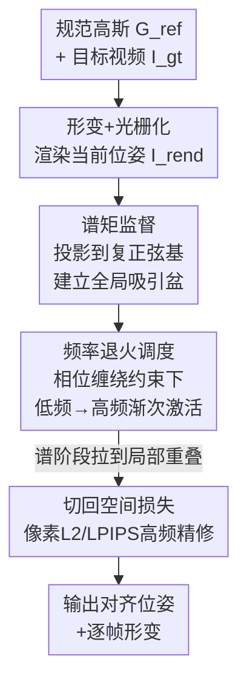

# SpectralSplats: Robust Differentiable Tracking via Spectral Moment Supervision

**会议**: ECCV 2026  
**arXiv**: [2603.24036](https://arxiv.org/abs/2603.24036)  
**代码**: 未提及（补充材料附带 1D/2D demo 代码）  
**领域**: 3D视觉  
**关键词**: 3D高斯溅射, 可微跟踪, 频域监督, 频率退火, 吸引盆

## 一句话总结
把 3DGS 可微跟踪的监督目标从空间域（逐像素光度误差）换成频域（谱矩），配上一套从相位缠绕原理严格推导出来的频率退火调度，让高斯资产即便初始化时和目标完全不重叠也能获得非零的方向梯度、平滑地"流"到正确位姿——从而无需人工对齐或类别先验就能做鲁棒跟踪。

## 研究背景与动机
3D 高斯溅射（3DGS）以实时、照片级的新视角合成迅速改写了 3D 重建的版图，一个很自然的下游应用是把重建好的静态高斯资产"演起来"——通过可微渲染器把它拟合到一段目标视频上，实现驱动数字化身、无标记动捕、可编辑动态场景等任务，这类"分析-合成"式的基于模型跟踪本质上是在优化运动参数 $\Theta$ 让渲染图和目标观测的光度误差最小。可一旦离开受控的实验室设定、拿到"野外"数据，这条看似顺理成章的路就变得出了名地脆弱。

问题的根子在高斯基元的紧支撑局部性上。标准光度目标隐式地依赖空间重叠：一个高斯要想收到指向目标结构的梯度，它渲染出来的足迹必须已经和目标结构的位置有交集。当初始位姿离目标够远（粗糙初始化、带噪的位姿先验、快速运动导致的帧间大位移），渲染出的高斯和它该去的那些像素根本不沾边，指向真实目标的梯度分量就严格归零；更糟的是，全场景的总梯度并不为零——错位的高斯不可避免地压在了背景杂波上，优化器收到的是这些虚假重叠喂来的"污染梯度"，非但不把物体拉向目标，反而把它锚死在背景里。作者在 1D 上把这个"消失梯度"病理剖得很清楚：在大位移下，标准空间 $L_2$ 的地形图根本没有一个通向正确解的全局盆地，跟踪灾难性失败。业界的老办法要么靠人工对齐/受控采集保证第一帧就足够重叠，要么像近期工作那样把 $L_2$ 换成 LPIPS 这类深度特征距离——后者的层级感受野确实把吸引盆略微加宽，但骨子里仍然依赖局部重叠，一旦资产和目标不相交梯度照样消失；再要么靠 SMPL、关节模板这类类别专属先验，用现成位姿估计器先给个强初始对齐，把光度跟踪降格成"最后一公里"的微调——代价是牺牲了通用性，没法跟踪任意野外物体。于是留下一个空档：一个纯优化、既全局（能扛大而不相交的位移）又类别无关的跟踪目标。

本文的切入点是：既然像素和渲染的高斯都是局部的，那就换一组全局的基函数。正弦基横跨整个空间域，把渲染图投影到一组复傅里叶特征上得到当前位姿的"谱签名"，物体的空间平移在频域里对应一个相位平移——哪怕物体和目标空间上完全不相交，这个相位差也能提供强的、非零的方向梯度。**核心 idea：把跟踪的监督目标从空间域搬到频域，用一组全局复正弦特征（谱矩）来对齐渲染图与目标，从而在全图域上构造出一个吸引盆；再用一套从相位缠绕条件 $|\omega^T d|<\pi$ 严格推出的频率退火调度，让优化器从"低频全局凸"平滑过渡到"高频精确对齐"，既拿到频域的非消失梯度、又最终恢复空间精度。**

## 方法详解

### 整体框架
SpectralSplats 是一个模型无关的跟踪框架：给定一个静态规范高斯模型 $\mathcal{G}_{\text{ref}}$ 和一段目标视频，求解一组运动参数 $\Theta$ 驱动形变函数 $\mathcal{D}$，让形变后渲染的图像对齐目标。它不改动任何底层形变模型，只是把训练目标的第一阶段从空间光度损失替换成谱矩损失。整条优化按"两相"走：先用一个逐步退火的谱目标建立全局吸引盆，把处于零重叠状态的高斯从"搁浅"里救回来、解决严重的初始错位；一旦谱阶段把物体拉到局部有重叠，就按 Parseval 定理无缝切回标准空间损失（像素 L2 或 LPIPS）做高频精修。

方法可拆成三块贡献：先诊断出"消失梯度/局部性陷阱"这个失败模式的数学根源；再用谱矩把逐像素比较换成全局投影，靠傅里叶位移定理把空间平移变成相位平移拿到非零梯度；最后用相位缠绕分析推出频率退火调度，动态控制活跃频带的宽度，避免高频带来的假极小。整个流程如下：

### 关键设计

**1. 谱矩损失：用全局正弦投影把"消失梯度"从根上抹掉**

痛点很直接：高斯是紧支撑的局部基元，逐像素光度损失要它先和目标物体有空间重叠才给方向梯度，零重叠时梯度严格为零、优化器彻底搁浅。作者先把这个陷阱在数学上坐实——把源-目标对的平方误差梯度拆成"自项"和"目标监督交叉项"两部分：平行于像面的平移会保持渲染物体的总足迹质量不变，使自项对运动参数严格不变、导数恰为零（深度平移虽有非零导数，但在无重叠时只会驱使物体缩小、远离相机，同样不给指向目标的方向信号）；而唯一携带跟踪信号的目标监督交叉项，当渲染高斯与真实目标位置不相交时 $\mathbf{I}_{\text{gt}}(\mathbf{p})$ 与渲染物体空间边界 $\nabla_\Theta\mathbf{I}_{\text{rend}}$ 处处相乘为零，整项消失。这个陷阱还被 3DGS 架构本身强化——为了实时，光栅器把屏幕切成 $16\times16$ 的 tile 并按 99% 置信区间剔除基元，直接把 tile 邻域外目标的梯度清零。

解法是把逐像素比较换成图像矩的对齐：一个矩等价于用一个辅助静态场 $F(\mathbf{p})$ 乘图像再积分，只要选一个在整个空间域上连续变化、不重复取值的场（正弦波或多项式），这个投影就成了一套全局坐标系，打破了局部性陷阱。具体地，作者选复正弦作为场——因为它在平移下有几何意义明确的相位移动——定义某个 2D 空间频率 $\omega_{k_x,k_y}$ 上的谱矩为

$$\mathcal{M}(k_x,k_y;\mathbf{I})=\sum_{\mathbf{p}}\mathbf{I}(\mathbf{p})\cdot\exp(-j\,\omega_{k_x,k_y}^{T}\mathbf{p})$$

矩匹配损失 $\mathcal{L}_{\text{moment}}=\tfrac12(M_{\text{rend}}-M_{\text{gt}})^2$ 的梯度由两个可靠非零的分量构成：只要全局场不在空间域上重复取值，不相交的渲染物体与目标的标量投影就必然不同，保证了误差幅值非零；而方向分量 $\nabla_\Theta M_{\text{rend}}$ 经链式法则和分部积分可写成 $\int\mathbf{I}_{\text{rend}}(\mathbf{p};\Theta)\nabla_{\mathbf{p}}F(\mathbf{p})\,d\mathbf{p}$，只要场的空间导数在物体当前位置非零，优化器就能"感觉到"该处场的斜率。一句话：标量差给出拉力的大小、场梯度给出拉力的方向，即使源和目标完全不相交也能无对应关系地配准。而且这个式子天然支持 2D FFT 高效计算，避免了在稠密频率网格上朴素求值的高昂开销。

**2. 频率退火调度：从相位缠绕条件严格推出"低频到高频"的安全扩张速率**

只用谱矩还不够，这里藏着一个根本性的悖论。由 Parseval 定理，在完整正交频率基上同时优化，谱损失严格等价于空间 $L_2$ 损失——也就是说如果把全部频率一次性打开，等于把那个想躲开的消失梯度和局部极小地形原封不动搬了回来；高频分量会引入严重的相位缠绕，把全局盆撕成碎片、把优化器困在假极小里。所以不能静态地用全基，必须在优化过程中动态控制活跃频带：低频给全局吸引但缺精度（谱损失的空间梯度按频率幅值缩放，$\nabla\mathcal{L}\propto\omega\sin(\omega d)$，当空间误差趋零时低频梯度也随之衰减），高频给精度但过早激活就相位缠绕，于是必须系统地从粗到细过渡。

关键在于作者不是启发式地拍脑袋定退火速率，而是从第一性原理推出来。对某个频率 $\omega$，谱损失只有在诱导的相位移动不缠绕、即 $|\omega^T\mathbf{d}_t|<\pi$ 时才凸——补充材料里用傅里叶位移定理把损失化简成 $E(\mathbf{d};\omega)=|\mathcal{M}_{\text{gt}}|^2(1-\cos(\omega^T\mathbf{d}))$，其驻点满足 $\sin(\omega^T\mathbf{d})=0$，只有 $|\omega^T\mathbf{d}|<\pi$ 内 $\mathbf{d}=0$ 才是唯一吸引子，超过 $\pi$ 就掉进下一个周期的假盆地。这条相位缠绕条件给出了动态稳定约束：最大活跃频率幅值必须与空间误差幅值成反比，$\|\omega_{\max}(t)\|\propto 1/\|\mathbf{d}_t\|$。在满足约束的强凸区里损失近似为二次碗、梯度正比于位移，梯度下降天然按剩余距离缩放步长，空间误差指数衰减 $\|\mathbf{d}_t\|\le\|\mathbf{d}_0\|\gamma^t$；要维持约束，活跃频率幅值就得指数扩张 $\gamma^{-t}$。而标准谱网格的频率按对数组织 $\|\omega_k\|\propto 2^k$，指数增长的频率幅值恰好对应活跃频率索引 $k(t)$ 随步数**严格线性**扩张。这一推导反过来给 Nerfies、BARF 里经验成功、此前只靠 NTK 或信号带宽模糊来启发式论证的线性退火调度，提供了严格的第一性原理解释——线性索引就是安全频率扩张的理论上界。实现上用一个平滑余弦权重让每个更高频段渐次淡入目标：

$$w_k(t)=\frac{1-\cos(\pi\cdot\text{clamp}(\alpha(t)-k,0,1))}{2}$$

其中 $\alpha(t)$ 在迭代中从 0 线性升到 $K$ 来控制活跃带宽。

**3. 保守频率扩张 + 模型无关的两相接入：让理论落到真实野外跟踪上**

上面的推导建立在理想线性收敛之上，但真实跟踪里背景杂波、遮挡、复杂形变常常打乱理想的指数误差衰减。作者因此加了一套双重保守调度：其一，沿用 BARF 的经验做法强制一个严格低频的 warm-up 阶段，前若干次迭代里把 $\alpha(t)$ 冻结，让优化器有时间先用最宽的全局盆解掉严重初始错位再引入高频复杂度（但 warm-up 不能太长，否则高频细节恢复不回来）；其二，一旦开始扩张，就直接对频率本身做线性缩放，而不是对其对数索引线性缩放——因为线性增长远低于指数增长，这个务实的放松能在整个优化过程中稳稳待在相位缠绕阈值 $|\omega^T\mathbf{d}_t|<\pi$ 之下。这种延迟的、次指数的扩张显著增强了鲁棒性。此外框架只在前景高斯上工作，前景掩码用标准 3D 分割工具每场景取一次即可，渲染时再把背景重组回来。

之所以说它模型无关，是因为谱损失只作用在渲染输出上、对底层形变模型一无所求。作者在两种主流非刚性参数化上验证了这点：一种用 TimeNet 这类神经 MLP 连续预测每个稀疏控制点的时变形变，另一种直接优化控制点的位移与旋转（direct morph field）。谱监督无需改动这些形变模型本身，就能把它们从标准光度损失会崩掉的极端初始位移里引导到高精度终位姿。而与光度损失的衔接也很自然——谱阶段一旦把物体拉到局部重叠，凭 Parseval 等价性切回像素损失（合成 SC4D 上也可换成 LPIPS）做高频精修，整体损失还叠加了 GSGD 沿用的 As-Rigid-As-Possible（ARAP）正则以鼓励控制点局部刚性运动。

### 损失函数 / 训练策略
两相优化。谱阶段的图像损失在活跃频带 $\mathcal{K}(t)$ 上按权重 $w_k(t)$ 对 RGB 和不透明度分别做谱矩的 L1 差（掩码项带权重 $\lambda_{\text{mask}}$）；空间阶段用像素 L2 + 掩码 L2 + 不透明度 BCE（SC4D 上可换成 LPIPS）。总损失 $\mathcal{L}=\lambda_{\text{image}}\mathcal{L}_{\text{image}}+\lambda_{\text{arap}}\mathcal{E}_{\text{arap}}$，$\lambda_{\text{image}}$ 固定 5000，ARAP 从第 1000 步引入。所有实验用 800 个控制点、训练 10K 步，谱→空间的切换步（add\_pixel\_loss）与频段数 $K$、warm-up 比例按数据集调（如 GART：切换步 7000、$K{=}8$、warm-up 0.25）。单 L40 GPU 上单序列约 8–15 分钟，相对像素损失几乎零额外开销（SC4D 上 437s vs 443s，各实验内 0–6%）。

## 实验关键数据

### 主实验
在两个数据集上评估：SC4D（用 Consistent4D 资产生成的干净可控 4D 动画，初始外观与监督良好对齐）和 GART Dog（真实单目视频重建的静息位姿模型，存在光照不一致、未知相机视角、位姿/外观显著偏差）。通过把初始 3DGS 模型沿随机方向平移递增偏移量来模拟错位。核心对比是把谱方案（+Ours）叠加到不同形变参数化与空间损失上，对比纯空间监督（Pixel）。

GART（shift = 0.6）主结果，均值对比（越大越好 / LPIPS 越小越好）：

| 数据集 | 指标 | 本文(Ours) | Pixel | DT | PoG |
|--------|------|------|------|------|------|
| GART Dog | PSNR↑ | **22.06** | 20.15 | 20.92 | 17.09 |
| GART Dog | SSIM↑ | **0.907** | 0.892 | 0.900 | 0.863 |
| GART Dog | LPIPS↓ | **0.217** | 0.259 | 0.226 | 0.277 |

可以看到本文不仅稳压逐像素基线，也全面超过两个全局损失基线（欧氏距离变换 DT、高斯金字塔 PoG）——后两者在优化中会把多个物体粘连合并（teaser 场景里 DT 把草莓吸进香蕉），而本文始终保持物体分离。

SC4D（shift = 0.5）跨参数化对比（训练视角，MLP w/o LPIPS 配置）：

| 配置 | PSNR↑ | SSIM↑ | LPIPS↓ |
|------|------|------|------|
| MLP + Pixel | 17.67 | 0.911 | 0.181 |
| MLP + Ours | **26.70** | **0.951** | **0.052** |

错位越大，像素监督与本文的差距越宽；且训练视角和新视角上都成立，说明泛化也更好。即使多视角监督，像素损失在空间错位下照样崩，本文仍鲁棒。

### 消融实验

| 配置 | 关键指标 | 说明 |
|------|---------|------|
| K = 4 / 6 / **8** / 10 / 12 | PSNR 21.79 / 22.02 / **22.06** / 21.28 / 21.35 | GART 上频段数敏感性：广域稳定，K=8 最佳 |
| 对齐初始化 shift = 0.0 (MLP w/o LPIPS) | PSNR 28.34 vs Pixel 23.72 | 无错位时本文不退化、多数情况反而更好 |
| 空间相位损失分量 (GART Shiba) | MSE→+Masked→+BCE→All: 20.65→20.21→20.55→**22.06** | 各分量都对精修有贡献，全配置最佳 |

### 关键发现
- 频率退火调度是全局收敛的命门：静态高频基（Fig.2 Col2）虽让梯度不再全局消失，却因相位缠绕把优化器困在假极小；只有低频起步→线性扩张才能既救回零重叠的高斯又不引入假极小。
- 错位越严重、本文相对像素基线的增益越大，趋势在 PSNR/SSIM/LPIPS 和多视角设定下一致——正是"扩大吸引盆"这一目标的直接体现。
- LPIPS 在 GART 上反而更差：因其对颜色/亮度感知差异敏感，会把重建 3DGS 与视频间的全局色差误读成结构变化，梯度去补光照差而非强制几何一致，导致更模糊——这也解释了为什么真实数据上第二阶段更适合用像素 L2。
- 方法对退火调度在很宽范围内稳定，且相对像素损失几乎零额外开销，可作为即插即用的损失替换。

## 亮点与洞察
- 把"消失梯度"这个被广泛回避的工程难题，重新表述成一个可严格分析的优化地形问题：拆出自项/交叉项证明平面内平移时空间梯度恰为零，把"为什么会失败"讲得干净透彻，比"经验上不 work"高一个层次。
- 频域-空间对偶用得很妙：Parseval 定理既是全基优化等价于 $L_2$ 的"警告"（不能静态用全基），又是谱阶段结束后无缝切回空间损失的"许可证"，一个定理正反两用。
- 从相位缠绕 $|\omega^T d|<\pi$ 推出"对数网格上线性索引扩张是安全频率扩张的理论上界"，顺手给 BARF/Nerfies 沿用多年的启发式线性退火补了第一性原理的地基——把别人的经验做法证成了定理，是很扎实的贡献。
- 谱损失只作用在渲染输出、对形变模型零假设，因此能当 drop-in 替换叠到 MLP、直接位移场、像素 L2、LPIPS 等各种组合上——这种正交性让它有很好的迁移潜力，任何依赖光度目标的可微跟踪管线都能接。

## 局限与展望
- 作者承认：当前形变假设有一个预初始化的规范资产，范围限于"基于模型的跟踪"，不覆盖规范几何与运动需从未标定视频联合优化的完整动态场景重建——这是最自然的拓展方向。
- 只用了正弦（傅里叶）矩，作者也提到探索其他矩类型以捕捉更复杂动态是值得做的方向；不同全局核（几何矩、正交多项式矩）的取舍未充分展开。
- 只在前景高斯上工作，依赖每场景一次的 3D 分割掩码；篮球实验里数据集掩码本身带瑕疵，掩码质量差时的表现边界没有系统量化。
- 实验规模偏小（SC4D 少量角色 + GART 7 条狗 + 1 段篮球），且错位是人工平移合成的，与真实跟踪失败的分布是否一致存疑；旋转+平移的联合大错位只在 2D demo 演示，3D 上未做定量。

## 相关工作与启发
- **vs LPIPS 深度特征跟踪（如 GSGD/Bekor 等）**：他们用深度特征的层级感受野加宽吸引盆，但仍依赖局部空间重叠，零重叠时梯度照样消失；本文把监督搬到频域拿到真正全局的非消失梯度，在完全不相交时也能收敛，且实测 LPIPS 在真实色差场景反而更差。
- **vs 类别先验方法（SMPL/HUGS/GART 关节模板）**：他们用现成位姿估计器先给强初始对齐、把问题降成"最后一公里"精修，鲁棒但牺牲通用性、只能跟已知类别；本文纯优化、类别无关，能跟任意野外物体，且与这些运动模型互补（可为其提供全局监督信号）。
- **vs BARF / Nerfies 的频率退火**：他们在 NeRF 里对位置编码做谱退火来加宽相机配准的吸引盆，靠 NTK 或信号带宽模糊启发式论证；本文把退火直接施加在渲染输出的谱矩上（而非位置编码），并用相位缠绕分析给出线性退火的第一性原理证明与理论上界，同时避开高频相位缠绕陷阱。
- **vs 表示质量导向的频率方法（FreGS/PGDGS/SAPE/Laplacian 子带）**：它们用频率分解主要服务 level-of-detail 控制与静态重建保真；本文用频率是为了塑造几何优化地形、解跟踪的消失梯度，目标完全不同。

## 评分
- 新颖性: ⭐⭐⭐⭐⭐ 把跟踪监督从空间搬到频域解消失梯度，并从相位缠绕严格推出退火调度，视角新且理论扎实
- 实验充分度: ⭐⭐⭐⭐ 跨两数据集/两参数化/两空间损失 + 多视角 + 消融齐备，但规模偏小、错位靠人工合成
- 写作质量: ⭐⭐⭐⭐⭐ 失败模式剖析、频域对偶、退火推导层层递进，图文对照清晰
- 价值: ⭐⭐⭐⭐ 即插即用、几乎零开销，任何基于光度目标的可微跟踪管线都能受益

<!-- RELATED:START -->

## 相关论文

- [\[CVPR 2025\] Spectral Informed Mamba for Robust Point Cloud Processing](../../CVPR2025/3d_vision/spectral_informed_mamba_for_robust_point_cloud_processing.md)
- [\[CVPR 2026\] From Feature Learning to Spectral Basis Learning: A Unifying and Flexible Framework for Efficient and Robust Shape Matching](../../CVPR2026/3d_vision/from_feature_learning_to_spectral_basis_learning_a_unifying_and_flexible_framewo.md)
- [\[ICLR 2026\] PointRePar: SpatioTemporal Point Relation Parsing for Robust Category-Unified 3D Tracking](../../ICLR2026/3d_vision/pointrepar_spatiotemporal_point_relation_parsing_for_robust_category-unified_3d_.md)
- [\[ECCV 2026\] Monocular Avatar Reconstruction via Cascaded Diffusion Priors and UV-Space Differentiable Shading](monocular_avatar_reconstruction_via_cascaded_diffusion_priors_and_uv-space_diffe.md)
- [\[ECCV 2026\] Learning Video Dynamics with Predictive Differentiable Rendering](learning_video_dynamics_with_predictive_differentiable_rendering.md)

<!-- RELATED:END -->
