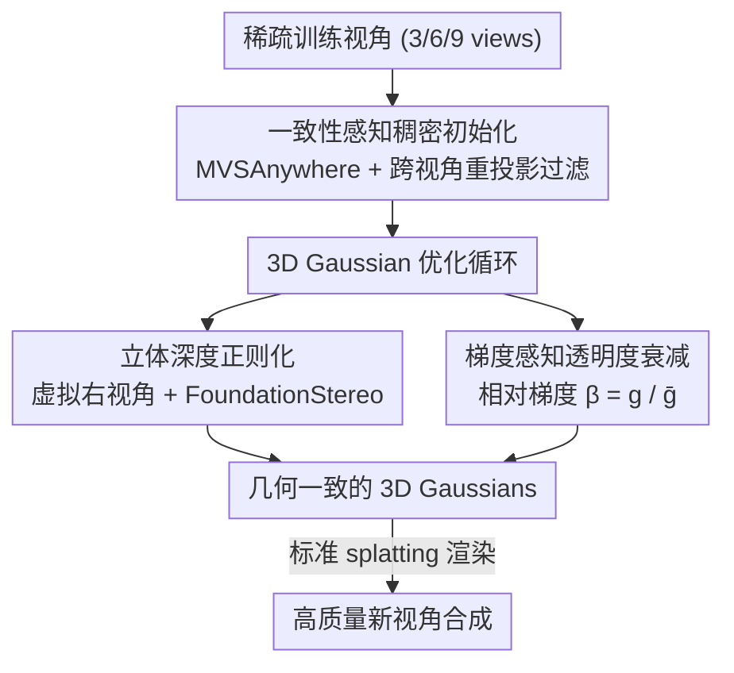

# StereoGS: Sparse-View 3D Gaussian Splatting via Stereo Priors

**会议**: ECCV 2026  
**arXiv**: [2606.30545](https://arxiv.org/abs/2606.30545)  
**代码**: [https://stringerywh00.github.io/StereoGS_project_page/](https://stringerywh00.github.io/StereoGS_project_page/) (项目页)  
**领域**: 3D视觉  
**关键词**: 稀疏视角新视角合成、3D高斯溅射、立体先验、深度正则化、几何一致性

## 一句话总结

StereoGS 通过构建虚拟立体相机对、引入立体深度正则化和梯度感知透明度衰减，解决了稀疏视角 3DGS 中单目深度先验固有的尺度模糊与跨视角不一致问题，在 LLFF、DTU、Mip-NeRF360 和 Blender 四个数据集上达到新视角合成的最优水平。

## 研究背景与动机

3D 高斯溅射（3DGS）凭借其实时渲染能力，在新视角合成领域取得了显著成功。然而，当输入视角稀疏时，相邻帧之间的重叠区域极少，几何约束严重不足，3DGS 会出现剧烈过拟合——场景结构无法可靠重建，浮空噪点和几何形变随处可见。为此，已有若干工作尝试引入单目深度先验（如 DNGaussian、FSGS）对 Gaussian 优化施加几何约束，在一定程度上缓解了问题。但单目深度从根本上存在两个不可克服的缺陷：其一是尺度模糊——单目估计只能给出相对深度，缺少绝对度量尺度，将其用于正则化会与光度一致性产生冲突，误导优化；其二是跨视角不一致——各帧深度图独立推理，同一空间点在不同视角下往往被赋予不同深度值，反投影到 3D 空间后的空间错位会造成 Gaussian 优化不稳定和严重伪影。

一些近期工作（Binocular3DGS、NexusGS、MVPGS）尝试引入跨视角一致性。Binocular3DGS 用渲染深度图 warp 视图再计算光度损失，但这种间接的像素级约束对 3D Gaussian 基元缺乏直接梯度引导，在无纹理区域尤其失效。NexusGS 仅在初始化阶段利用极线几何，优化中没有持续的双目一致性约束，几何仍会逐步退化。更本质的矛盾在于：现有方法要么在初始化上投入资源（MVS 点云），要么在优化期间添加约束，但鲜有方法同时做到"初始化鲁棒 + 优化全程几何对齐 + 自适应剪枝噪声点"三者兼顾。

本文提出 StereoGS，核心思路是把立体视觉先验直接嵌入 3DGS 的优化回路：在每个训练视角旁边虚构一个右视角相机，渲染对应右视角图像，再将真实左视角与渲染右视角组成立体对输入基础立体模型，得到绝对尺度的立体深度作为监督信号。同时，设计一种基于梯度相对幅值的透明度衰减策略，自适应地保留对渲染贡献大的 Gaussian、剪除冗余浮点噪声。**核心 idea：在 3DGS 优化全程引入在线立体深度正则化，以虚拟立体对 + 基础立体模型提供绝对尺度、双目一致的几何监督，辅以梯度感知透明度衰减和零样本 MVS 稠密初始化，从训练时间策略角度彻底消除稀疏视角下的几何模糊，且不增加推理开销。**

## 方法详解

### 整体框架

StereoGS 在标准 3DGS 基础上叠加三个正交组件：一是用多视角深度估计器构建稠密、几何一致的初始点云（替代稀疏 SfM）；二是在优化中以立体深度正则化项对 Gaussian 几何施加绝对尺度约束；三是用梯度感知透明度衰减取代周期性 opacity reset，自适应地剪除冗余 Gaussian。推理时三个模块全部退出，与原版 3DGS 完全等价，无额外开销。

### 关键设计

**1. 立体深度正则化：以绝对尺度双目先验替换单目约束**

单目深度估计只能提供相对深度，缺少统一的度量尺度，而不同视角的单目图各自独立推理，同一场景点在不同帧中深度值往往对不上。StereoGS 的解法是在优化过程中为每个训练视角（左相机）动态合成一个虚拟右相机：对当前状态的 3D Gaussians 渲染出右视角图像 $\hat{I}_r$，将真实左视角图 $I_l$ 与渲染右视角图组成立体对，输入基础立体模型 FoundationStereo 得到左视角视差 $\hat{D}_l$。左视角真实图被故意用来替代渲染图，是因为估计视差要作为绝对深度参考，使用干净的真实图能规避渲染噪声，保证先验可靠性。

为过滤掉被遮挡、无纹理或异常区域的不可靠视差，方法引入了三层有效性掩码：左右一致性遮挡掩码 $M_{\text{occ}}$（左右视差反向映射后差值超过阈值 $\tau=2.0$ 的像素）、背景掩码 $M_{\text{bg}}$（暗背景或合成图 alpha 通道为零的像素），以及视差异常掩码 $M_{\text{anomaly}}$（非正值、Inf 或 NaN）。三者取并集，剩余区域构成最终有效掩码 $M_{\text{valid}} = 1 - (M_{\text{bg}} \lor M_{\text{occ}} \lor M_{\text{anomaly}})$。在有效区域内，将视差转换为深度 $Z_{\text{stereo}} = fd/\hat{D}_l$（$f$ 为焦距，$d$ 为基线），以逆深度空间的 L1 损失对渲染深度 $\hat{Z}$ 施加监督：

$$\mathcal{L}_{\text{depth}} = \left\| M_{\text{valid}} \odot \left(\frac{1}{\hat{Z}} - \frac{1}{Z_{\text{stereo}}}\right) \right\|_1$$

逆深度空间有两个好处：数值稳定性更好，且对近景前景区域的几何精度约束更强。这一正则化项直接向 Gaussian 基元反传梯度，提供绝对尺度与双目一致的几何监督，根本上克服了单目先验的尺度模糊。

**2. 梯度感知透明度衰减：自适应剪枝冗余 Gaussian**

标准 3DGS 使用周期性 opacity reset 来清理噪声 Gaussian，这在密集视角下尚可，但在稀疏视角下会把稳定的表面 Gaussian 和浮空噪声一刀切地全部压制，破坏已形成的几何结构。Binocular3DGS 改用固定衰减率，对所有 Gaussian 一视同仁，同样无法区分"对渲染有贡献的结构"和"无用的浮点"。

StereoGS 的洞察是：一个 Gaussian 的透明度梯度幅值 $g = |\nabla_\alpha \mathcal{L}|$ 天然反映了它对减少渲染误差的重要性——梯度大的 Gaussian 正在被优化用力拉动，说明它对当前渲染有较高贡献，应当保留；梯度极小的 Gaussian 几乎不被需要，更可能是无用浮点。由于绝对梯度值极小（量级约 $10^{-6}$），直接用绝对值会退化为常数衰减。受 GRPO 中"相对优势"概念启发，方法计算每个 Gaussian 的相对梯度 $\beta = g / \bar{g}$（$\bar{g}$ 为当前迭代全体 Gaussian 的平均梯度），再通过指数软阈值函数推导动态衰减因子：

$$\gamma = 1 - (1 - \gamma_{\text{base}}) \exp(-s \cdot \beta)$$

最终透明度更新为 $\hat{\alpha} = \gamma \alpha$。当 $\beta < 1$（低于平均贡献）时，$\gamma$ 趋近 $\gamma_{\text{base}}$，施加较强惩罚；当 $\beta$ 较大时，$\gamma$ 趋近 1，基本不衰减。超参数设为 $\gamma_{\text{base}} = 0.99$，$s = 0.5$。消融实验表明，步进（Step）和线性（Linear）函数因为对 $\beta > 1$ 的 Gaussian 保留率过高，反而逊于常数策略；指数函数能在 $\beta = 1$ 附近平滑过渡，是最优选择，在 LLFF 3 视角下达到 21.91 PSNR，远优于常数策略的 21.45。

**3. 一致性感知稠密初始化：以零样本 MVS 点云替代稀疏 SfM**

稀疏视角下，SfM 生成的点云极其稀疏且含噪，在 LLFF 和 DTU 上仅初始化时分别只能达到 18.96 和 17.66 PSNR。方法采用零样本多视角深度估计器 MVSAnywhere 为每个训练视角估计深度图——每次以该视角为目标帧、其余视角为源帧输入模型，得到多视角一致的深度图集合。随后按照经典 MVS 几何过滤策略，通过跨视角重投影误差剔除离群点，将过滤后的深度图反投影并融合为稠密点云。相比 PDCNet+ 和 MVSFormer，MVSAnywhere 的零样本泛化能力更强，生成的点云更密、结构更完整，在 3 视角 LLFF 上仅初始化即可达到 19.75 PSNR，而同等条件下 MVSFormer 只有 21.08，PDCNet+ 只有 20.10（最终含全部组件）。需要注意，这只是初始化质量的改善，在无后续优化约束时，高质量初始化也会在 Gaussian 优化中逐渐退化，因此稠密初始化需与立体深度正则化协同才能充分发挥效果。

### 损失函数 / 训练策略

总损失 $\mathcal{L} = \mathcal{L}_{\text{color}} + \mathcal{L}_{\text{depth}}$，其中颜色损失继承自标准 3DGS：

$$\mathcal{L}_{\text{color}} = (1-\lambda)\mathcal{L}_1 + \lambda \mathcal{L}_{\text{D-SSIM}}$$

立体深度正则化在一定迭代后才开启（LLFF/DTU/Mip-NeRF360 在第 20,000 步启用，Blender 在第 4,000 步），总训练步数分别为 30,000 和 7,000。每 100 步致密化一次，从第 1,000 步开始。所有实验在单张 RTX 4090 上完成，训练时间约 43 分钟（LLFF 3 视角），显存峰值 3.6 GB。作为对比，FSGS 需要 26.5 分钟但仅 3 视角，MVPGS 仅 6.4 分钟但最终 Gaussian 数量高达 152 万个；StereoGS 虽然训练更慢，但 Gaussian 数量仅 12.6 万，推理效率高。

## 实验关键数据

### 主实验

| 数据集 | 视角数 | 指标 | StereoGS | StereoGS* | 次优方法 |
|--------|--------|------|----------|-----------|----------|
| LLFF | 3-view | PSNR↑ | 21.91 | **22.05** | 21.44 (Binocular3DGS) |
| LLFF | 3-view | SSIM↑ | 0.773 | **0.783** | 0.751 |
| LLFF | 3-view | LPIPS↓ | 0.157 | **0.147** | 0.168 |
| LLFF | 6-view | PSNR↑ | 24.92 | **25.40** | 24.87 (Binocular3DGS) |
| DTU | 3-view | PSNR↑ | 21.46 | **22.00** | 20.71 (Binocular3DGS) |
| DTU | 3-view | SSIM↑ | 0.879 | **0.890** | 0.877 (MVPGS) |
| Mip-NeRF360 | 12-view | PSNR↑ | 20.25 | **20.51** | 20.09 (D2GS) |
| Blender | 8-view | PSNR↑ | 24.83 | **25.04** | 24.71 (Binocular3DGS) |

（Ours* 表示额外叠加 dropout rate=0.3 的 DropGaussian 策略，与 DropGaussian 思路互补但来自不同视角）

### 消融实验

| 初始化(CAD) | 立体正则(SDR) | 梯度衰减(GAOD) | LLFF PSNR | DTU PSNR |
|:-----------:|:------------:|:--------------:|-----------|----------|
| - | - | - | 16.02 | 10.99 |
| ✓ | - | - | 19.75 | 14.10 |
| - | ✓ | - | 17.32 | 12.46 |
| - | - | ✓ | 18.18 | 15.05 |
| ✓ | ✓ | - | 19.79 | 15.57 |
| ✓ | - | ✓ | 21.18 | 19.76 |
| ✓ | ✓ | ✓ | **21.91** | **21.46** |

### 关键发现

- 稠密初始化贡献最大的基础提升：仅加 CAD，LLFF 从 16.02 涨到 19.75（+3.73），DTU 从 10.99 涨到 14.10（+3.11），说明 SfM 稀疏点云是稀疏视角下的主要瓶颈之一。
- 梯度感知衰减（GAOD）与稠密初始化的组合效果最强：LLFF 达到 21.18，DTU 达到 19.76，远超仅有初始化和正则化（19.79 / 15.57），说明 GAOD 能将高质量初始化的优势"锁住"，防止优化期间几何退化。
- 有效性掩码（$M_{\text{valid}}$）必不可少：去掉后 LLFF 从 21.91 降至 21.30，DTU 从 21.46 降至 20.82，原因是无遮挡/无纹理区域的噪声视差会直接误导优化。
- 不同立体模型均有效但 FoundationStereo 最优：LiteAnyStereo/S2M2/FoundationStereo 在 LLFF 3 视角下依次为 21.28 / 21.53 / 21.91，说明立体正则化框架具有通用性，并非绑定某一特定模型。

## 亮点与洞察

- **虚拟立体对的"在线先验"设计**：不预计算立体深度，而是每次迭代根据当前渲染状态动态合成右视角图像，使立体监督信号与 Gaussian 状态同步演化，同时保留使用真实左视角图以维持深度先验的可靠性——这个"一半真实一半渲染"的混合对构造方式巧妙地平衡了先验质量与优化闭环。
- **相对梯度归一化的通用性**：将绝对梯度归一化为相对梯度 $\beta = g/\bar{g}$ 借鉴自 GRPO 的"组内相对优势"概念，这一思路可推广到任何需要动态评估 Gaussian/粒子重要性的场景，具有较强的迁移价值。
- **三组件正交性**：消融表明三个模块（CAD/SDR/GAOD）的贡献相对独立，可根据计算资源选择性组合，例如不需要极致质量时可仅用 CAD+GAOD 节省训练开销。

## 局限与展望

- 在极度无纹理区域（如大片草地、墙壁），立体模型本身的匹配精度下降，导致立体深度先验失效，渲染质量有所退化（论文 failure case 明确指出）。
- 反射物体对 MVSAnywhere 的多视角深度估计构成挑战，视角相关的反射在重投影过滤时被误判为几何不一致并剔除。
- 在线立体深度正则化带来约 43 分钟训练时间（vs 标准 3DGS 的 4 分钟），对需要快速迭代的场景有一定负担；未来可探索用蒸馏方式将立体先验离线预计算。
- 方法依赖 FoundationStereo 的基线参数调节（$d=4.0$ 为最优），不同场景尺度可能需要重新调参。

## 相关工作与启发

- **vs DNGaussian / FSGS**：两者均用单目深度正则化，无法解决尺度模糊和跨视角不一致。StereoGS 用立体先验替换单目先验，从根本上提供绝对尺度约束，属于先验类型的升级而非技巧改进。
- **vs Binocular3DGS**：同样引入双目信息，但 Binocular3DGS 用 RGB warp 计算光度损失，缺乏直接几何梯度；StereoGS 直接在深度空间监督，对无纹理区域更鲁棒。此外，Binocular3DGS 使用固定衰减率，而 StereoGS 用相对梯度自适应，保留了更多有效的表面 Gaussian。
- **vs MVPGS / NexusGS**：两者均在初始化阶段引入跨视角一致性（MVS 点云或极线几何），但优化中缺乏持续几何约束导致初始质量逐步退化。StereoGS 的立体正则化在全程优化中持续施加约束，弥补了这一"有好开局、但守不住"的缺陷。

## 评分

- 新颖性: ⭐⭐⭐⭐ 以在线虚拟立体对 + 基础立体模型替换单目先验的方向清晰，相对梯度衰减的设计有亮点
- 实验充分度: ⭐⭐⭐⭐⭐ 四个数据集、多视角设定、细致消融（掩码/立体模型/衰减函数/超参），覆盖全面
- 写作质量: ⭐⭐⭐⭐ 结构清晰，动机链完整，failure case 诚实呈现
- 价值: ⭐⭐⭐⭐ 在稀疏视角 3DGS 这一实用场景上达到 SOTA，且推理零开销，落地友好

<!-- RELATED:START -->

## 相关论文

- [\[CVPR 2025\] S2Gaussian: Sparse-View Super-Resolution 3D Gaussian Splatting](../../CVPR2025/3d_vision/s2gaussian_sparse-view_super-resolution_3d_gaussian_splatting.md)
- [\[AAAI 2026\] SparseSurf: Sparse-View 3D Gaussian Splatting for Surface Reconstruction](../../AAAI2026/3d_vision/sparsesurf_sparse-view_3d_gaussian_splatting_for_surface_reconstruction.md)
- [\[CVPR 2025\] DropGaussian: Structural Regularization for Sparse-view Gaussian Splatting](../../CVPR2025/3d_vision/dropgaussian_structural_regularization_for_sparse-view_gaussian_splatting.md)
- [\[ECCV 2026\] Capacity-Controlled Multi-View Stylization of 3D Gaussian Splatting](capacity-controlled_multi-view_stylization_of_3d_gaussian_splatting.md)
- [\[ECCV 2024\] CoR-GS: Sparse-View 3D Gaussian Splatting via Co-Regularization](../../ECCV2024/3d_vision/cor-gs_sparse-view_3d_gaussian_splatting_via_co-regularization.md)

<!-- RELATED:END -->
