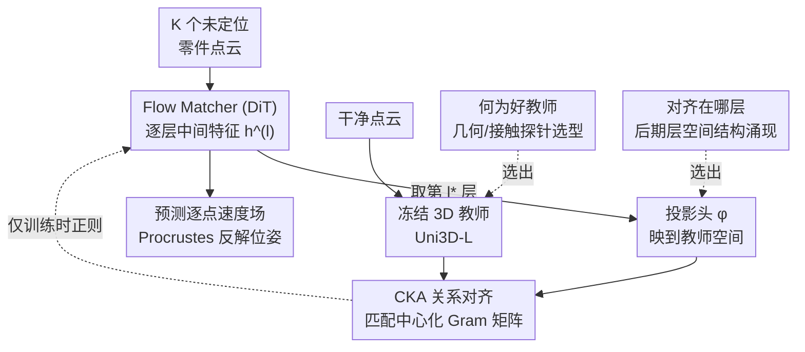

# TORA: Topological Representation Alignment for 3D Shape Assembly

**会议**: ECCV 2026  
**arXiv**: [2604.04050](https://arxiv.org/abs/2604.04050)  
**代码**: [https://nahyuklee.github.io/tora](https://nahyuklee.github.io/tora) （项目页）  
**领域**: 3D视觉  
**关键词**: 3D 形状装配, 表征对齐, 知识蒸馏, Flow Matching, 关系拓扑

## 一句话总结
TORA 在训练一个基于 flow-matching 的 3D 装配模型时，额外让它对齐一个冻结的预训练 3D 编码器的「点与点之间谁像谁」的关系结构（用 CKA 损失匹配 Gram 矩阵），从而把几何交互先验蒸馏进网络，收敛提速最高 6.9 倍、跨域鲁棒性显著提升，且推理时零额外开销。

## 研究背景与动机
把一堆位姿未知的零件点云拼回一个完整物体，是考古文物复原、计算机图形、机器人插销入孔等场景的基础几何推理任务。它跨越了一个很宽的谱系：语义装配（把椅子腿、靠背这类功能部件摆到合理位置）、几何装配（靠断面互补性把碎片拼回去）、以及跨物体装配（两个不同物体的部件要在跨物体约束下配对）。这些子任务主导线索各异，但共享一个瓶颈——**如何在对称歧义和域偏移下稳健地发现「配对关系」，即哪些区域应该接触、应该一起运动**。近来 flow-matching 类方法在这条路上进展显著，其中 Rectified Point Flow（RPF）成为当前 SOTA：它学习一个逐点速度场，把带噪点云沿直线插值搬运到装配位置，再用闭式 Procrustes/SVD 反解出每个零件的刚体变换。

问题在于 RPF 只用「终点重建损失」监督整个流——模型必须从最终装配几何这个全局信号里**隐式**地猜出配对关系。可决定性线索恰恰落在稀疏的接触区域，在对称情形下还常常模棱两可，而损失函数根本没告诉模型「哪些跨零件交互应该驱动运动」。缺乏这种中间显式引导，模型在分布偏移下就容易变脆。与此同时，RPF 自己的编码器只在一个二值 overlap 预测任务上预训练过，几何信号相当狭窄；而学术界其实已经有一批在大规模形状数据上预训练、学到了丰富空间特征的 3D 点云编码器可以借力。

顺着这个缺口，作者把训练改造成一个「师生蒸馏」框架——灵感来自 2D 生成里的 REPA，但要重新适配到 3D 点流装配。他们先发现：最朴素的做法（逐 token 的余弦匹配，让每个点 token 去贴近教师的特征内容）就已经是很强的对齐策略，能把教师学到的几何描述子注入进来。但这种独立的逐 token 匹配把每个 token 当成互不相关的个体，**并不显式约束点与点之间的关系拓扑**——而装配的成败恰恰系于零件间的交互结构。**核心 idea：与其逐个 token 地对齐特征向量，不如显式对齐教师表征里「谁和谁相似」的成对关系结构（拓扑）——用 CKA 损失匹配学生与教师的中心化 Gram 矩阵，把关系拓扑蒸馏进 flow 主干，同时只在后期 transformer 层、选一个几何/接触感知强的教师。**

## 方法详解

### 整体框架
TORA 建立在 RPF 架构之上，在它的 flow matcher 旁边挂一条「拓扑表征对齐分支」，这条分支只在训练时存在、推理时整条丢掉，因此测试阶段零开销。

具体地，输入是 $K$ 个位姿未知的零件点云 $\{\mathbf{P}_k\}$。一个冻结的 overlap-aware 编码器先抽出逐点条件特征 $\mathbf{c}$；一个 DiT 风格的 transformer $V_\theta$ 吃进带噪点位置 $\mathbf{X}(t)$ 和条件 $\mathbf{c}$，逐层产生中间表征 $\mathbf{h}^{(l)}$，最终预测逐点速度场，用条件 flow matching 损失 $\mathcal{L}_{\text{CFM}}$ 监督。对齐分支从中选一层 $l^*$ 的中间特征，经一个轻量投影头映射到教师特征空间，去和一个**冻结的 3D 教师编码器**（从干净、无噪的点云抽出的目标表征）对齐。总损失是 $\mathcal{L}_{\text{total}}=\mathcal{L}_{\text{CFM}}+\lambda\,\mathcal{L}_{\text{align}}$。作者把对齐目标沿「关系结构被显式传递的程度」这一条轴排开，比较了三种：逐 token 余弦距离、对比式 NT-Xent、以及作为 TORA 默认目标的 CKA 关系对齐。围绕这条分支，还有两个关键工程选择——**用对教师**、**对齐在对的层**——它们决定了对齐到底有没有用。

### 关键设计

**1. CKA 关系拓扑对齐：不对齐特征本身，对齐「谁和谁相似」**

RPF 只有终点损失，模型得隐式猜配对关系；朴素的逐 token 余弦匹配虽然能把教师的几何描述子灌进来，但它把每个点 token 当独立个体对齐，**没有约束点与点之间的关系结构**——而装配恰恰吃这个结构。TORA 的主目标改成对齐**成对相似度结构**：先从学生特征 $\hat{\mathbf{h}}$ 和教师特征 $\mathbf{y}$ 里各算一个 $n\times n$ 的 Gram 矩阵（记录采样 token 两两之间的内积），中心化后用归一化的 Frobenius 内积（即 CKA）来度量两个结构有多像，损失取其负值：

$$\mathcal{L}_{\text{CKA}}(\hat{\mathbf{h}},\mathbf{y})=1-\frac{\langle\tilde{\mathbf{G}}_S,\tilde{\mathbf{G}}_T\rangle_F}{\|\tilde{\mathbf{G}}_S\|_F\,\|\tilde{\mathbf{G}}_T\|_F}$$

它和逐 token 匹配的本质区别是：CKA **显式保留了所有 token 对之间「谁像谁」的关系**，而且对特征空间的各向同性缩放、正交变换天然不变——也就是说它不逼学生去精确复刻教师的特征向量，只要求关系拓扑一致。这正好对应装配任务的需求：重要的不是某个点的绝对特征，而是它和潜在配对点之间的相对关系。实验也印证：在跨物体（TwoByTwo）和语义装配（PartNet）这类交互结构强、且有域偏移的场景，CKA 的增益最明显；把 CKA 和逐 token 目标叠加反而掉点（见消融），说明关系信号本身已经足够，逐 token 目标会引入互相打架的梯度稀释对齐。

**2. Gram 矩阵随机子采样：让 O(N²) 的关系对齐变得可算**

要对齐成对结构，天然要算 $N\times N$ 的 Gram 矩阵，而一个多零件物体的总点数 $N$ 很大，穷举 Gram 会带来难以承受的开销。TORA 的做法是每个 batch 随机、均匀地抽 $n$ 个 token 下标（$n\ll N$），只在这 $n$ 个点上构造 $n\times n$ 的 Gram 矩阵做 CKA。这背后的直觉是：即使只采中等数量的随机 token，也足以给出整体 Gram 结构的一个足够忠实的估计。消融证实 $n\in\{256,512,1024,2048\}$ 收敛曲线几乎重合，对采样数很鲁棒；作者取 $n=1{,}024$ 作为保守默认值。正因为主要开销来自教师特征查表和投影头前传、而非 Gram 计算本身，配合离线缓存教师特征，CKA 每步只多约 3 ms（+2.8%）、峰值显存只多 0.18 GB（+5.5%），几乎白嫖。

**3. 教师选型：看几何/接触探针，别看分类精度**

对齐效果高度依赖选哪个教师，但先验上并不清楚哪种教师属性对装配有用。作者系统探针了六个预训练 3D 编码器，在冻结特征上测四个轻量指标——物体分类精度（全局语义的代理）、配对面分割 F1（接触感知/交互几何的代理）、局部对远处相似度 LDS（几何敏感性）、以及部件轮廓分数（部件级几何先验），再把每个探针分数和「拿它当教师对齐后的下游装配 Part Accuracy」做相关。结论很反直觉：**语义分类精度对装配迁移几乎零预测力**（Pearson $r\approx-0.04$），真正强相关的是配对面分割 F1（$r=+0.94$，控制参数量后仍稳）和部件轮廓，LDS 中等相关。也就是说，好教师的判据是「它编码了多少交互几何（潜在接触区、跨零件的共享几何上下文）」而非「它能不能分类物体」。据此 TORA 默认选 Uni3D 作教师——它在几何/接触探针上稳居前列、下游装配精度也最高；场景级编码器（Sonata、Concerto）反而因为预训练在场景粒度、和装配依赖的物体级几何有域差，基本不带来提升。

**4. 后期层对齐：空间结构在深层才涌现**

除了选对教师，还得对齐在对的层。作者分析了未对齐的 RPF flow 主干里空间结构如何随层变化，用了边界对比度、LDS、部件轮廓、位姿判别度四个指标，发现四者**都随层数加深单调上升**：越深的层，部件边界的特征跳变越锐利、局部几何越连贯、部件级聚类越可分，尤其位姿判别度（对刚体运动的敏感性，是 6-DoF 反解所必需的）主要在后期层随全局上下文整合而涌现。既然模型是在后期层才真正形成决定配对的全局结构和交互，就该在那里注入教师先验。消融验证：对齐层越深 Part Accuracy 越好，$l^*=5$ 最佳，明显优于早层对齐和不对齐基线——这解释了为什么同样一份教师信号，放对层才管用。

### 损失函数 / 训练策略
总损失 $\mathcal{L}_{\text{total}}=\mathcal{L}_{\text{CFM}}+\lambda\,\mathcal{L}_{\text{align}}$，默认 $\mathcal{L}_{\text{align}}=\mathcal{L}_{\text{CKA}}$、对齐权重 $\lambda=0.5$、CKA 子采样 $n=1{,}024$。教师用 Uni3D-L（303M），对齐在第 $l^*=5$ 层；投影头是 3 层 MLP（SiLU 激活），输入/隐层维度 = 学生中间维 1536、输出维 = 教师维，训练后丢弃。对比的 NT-Xent 变体温度 $\tau=0.07$。训练在 8 张 GH200 上、总 batch 256、跑 2000 epoch，AdamW、学习率 $5\times10^{-4}$（1000 epoch 后每 200 epoch 减半）。教师特征可离线预计算缓存，进一步把训练开销压到近零。

## 实验关键数据

### 主实验
在 Breaking Bad（几何装配）、PartNet-Assembly（语义装配）、TwoByTwo（跨物体装配）三种互补场景上，统一评测协议下与 RPF 等对比。Part Accuracy（PA，Chamfer 距离低于阈值 0.01 的零件占比）为主指标，RE/TE 为旋转/平移误差。

| 数据集 | 指标 | RPF (基线) | Ours-Cos-dist | Ours-CKA |
|--------|------|-----------|---------------|----------|
| Breaking Bad [2,20 件] | PA(%)↑ | 93.2 | 95.7 | **95.7** |
| Breaking Bad [2,20 件] | RE(°)↓ | 16.0 | 9.0 | **8.6** |
| Breaking Bad [21,33 件] | PA(%)↑ | 62.1 | **72.4** | 71.7 |
| PartNet-Assembly | PA(%)↑ | 59.8 | 67.8 | **69.1** |
| TwoByTwo | PA(%)↑ | 65.4 | 68.9 | **71.5** |
| TwoByTwo | TE(cm)↓ | 11.9 | 9.5 | **7.6** |

多件（21–33 件）场景最能拉开差距：基于对应关系的 Jigsaw/CMNet/PMTR 随组合复杂度爆炸急剧退化，GARF 在少件时尚可、多件骤降；RPF 尚能维持，而 TORA 进一步放大其可扩展性。跨物体和语义装配上 CKA 增益最大，印证「显式保留关系结构在有结构化交互 + 域偏移时最值钱」。

零样本迁移（Breaking Bad 训练，直接测三个未见数据集，无微调）：

| 数据集 | 指标 | GARF | RPF | Ours-CKA |
|--------|------|------|-----|----------|
| BBad-Artifact | PA(%)↑ | 91.4 | 88.3 | **94.4** |
| FRACTURA | PA(%)↑ | 44.2 | 68.1 | **76.0** |
| Fantastic Breaks | RE(°)↓ | 8.2 | 6.3 | **3.5** |

### 消融实验

| 配置 | TwoByTwo PA↑ | 说明 |
|------|-------------|------|
| $\mathcal{L}_{\text{CKA}}$ (默认) | **71.5** | 关系拓扑对齐单独最优 |
| $\mathcal{L}_{\text{CKA}}+\mathcal{L}_{\text{cos-dist}}$ | 70.0 | 叠加逐 token 目标反而掉点 |
| $\mathcal{L}_{\text{CKA}}+\mathcal{L}_{\text{NT-Xent}}$ | 68.5 | 同上，梯度冲突 |
| 三者全叠 | 67.7 | 最差 |
| 对齐层 $l^*$：早层 → $l^*=5$ | 越深越好 | 后期层空间结构涌现，深层对齐最佳 |
| 教师：Uni3D vs Find3D/OpenShape/PatchAlign3D | Uni3D 最优 | 几何/接触探针强的教师下游最好 |

### 关键发现
- **CKA 的收益来自「关系形式」而非「更会用强教师」**：在强教师（Uni3D-G/L）和弱教师（Find3D/PatchAlign3D）上，CKA 都稳超 Cos-dist（+0.7 ~ +2.6 PA），并不随教师变弱而消失——说明关系拓扑本身有效。
- **收敛显著提速**：Breaking Bad 上 TORA 达到基线峰值精度快约 **6.9×**，PartNet 快 3.3×（Cos-dist 2.2×、NT-Xent 1.8×），且最终精度也更高。
- **NT-Xent 只在跨物体设定翻车**：五个物体内基准上 NT-Xent 在基线附近波动，唯独 TwoByTwo 掉 5.0 PA——因为它的负样本包含来自另一物体的 token，而教师（在孤立物体上训练）本就把它们分开了，强行再拉开会压制跨物体配对线索。

## 亮点与洞察
- **「对齐关系拓扑而非特征向量」是核心 aha**：用 CKA 匹配 Gram 矩阵，只要「谁像谁」的结构一致、不管特征空间怎么缩放旋转——这个对不变性的宽容度恰好匹配了「装配吃相对关系、不吃绝对特征」的任务本质，是可迁移到其他「结构比外观更重要」的蒸馏场景的思路。
- **把「什么是好教师」变成可测的探针问题**：作者没有拍脑袋选教师，而是用配对面分割 F1、部件轮廓等几何探针和下游精度做相关分析，得出「几何/接触 ≻ 语义分类」的清晰判据（还补了 Fisher CI 和偏相关做统计背书），这套选型方法论本身就很有参考价值。
- **零推理开销 + 训练近零开销**：对齐分支只在训练时挂，投影头训完即弃；教师特征离线缓存后 CKA 每步只多约 3 ms。用一份「白嫖」的训练时正则换来 6.9× 收敛加速和更强泛化，性价比极高。

## 局限与展望
- 作者承认：零件高度对称/重复时（如 PartNet 上一堆几乎一样、配对面极小的横杆），部件间信号欠定，预测可能出现全局视觉不连贯；对齐目标不直接约束表面接触，偶尔会有边界缝隙这类「几何幻觉」，视觉上刺眼但不一定被误差指标充分反映。
- 教师的几何表达力给整个框架设了天花板，对教师选择的敏感性仍是开放问题。
- 展望：把逐点注意力扩展到更大装配/更密点云、给对齐加入视觉与功能语义、降低推理复杂度以支持实时机器人配准。

## 相关工作与启发
- **vs RPF（Rectified Point Flow）**：RPF 只用终点重建损失、隐式猜配对关系，编码器仅在二值 overlap 上预训练；TORA 在其上加一条训练时对齐分支，把外部预训练 3D 教师的关系几何先验蒸馏进来，推理管线不变、零开销，收敛更快、跨域更稳。
- **vs REPA / REPA-E（2D 生成的表征对齐）**：REPA 系把扩散 transformer 特征对齐到冻结视觉编码器以加速 2D 图像生成，多用逐 token 匹配；TORA 把这套范式搬到 3D 点流装配，指出目标信号由几何兼容性和稀疏配对关系主导，因而需要**关系拓扑（CKA）**目标和几何/接触型教师，而非直接照搬逐 token 对齐。
- **vs 基于对应关系的装配（Jigsaw / PMTR / CMNet）**：它们显式建对应再 SVD 反解位姿，多件场景下跨碎片建立可靠对应组合爆炸；TORA 走生成式路线绕开显式对应，用关系蒸馏在多件、跨物体场景保持可扩展性。

## 评分
- 新颖性: ⭐⭐⭐⭐☆ 把「关系拓扑蒸馏（CKA）」引入 3D 点流装配，并系统回答「好教师/好对齐层」是新角度，但对齐范式本身沿袭 REPA。
- 实验充分度: ⭐⭐⭐⭐⭐ 六个基准 + 零样本迁移 + 收敛/开销/教师选型/层深多维消融，还补了多 seed 显著性与统计验证。
- 写作质量: ⭐⭐⭐⭐☆ 逻辑清晰、图表扎实，探针分析尤其到位；符号偏密但可读。
- 价值: ⭐⭐⭐⭐☆ 零推理开销即插即用，对文物复原/机器人装配等实用场景有直接落地价值。

<!-- RELATED:START -->

## 相关论文

- [\[AAAI 2026\] Point-SRA: Self-Representation Alignment for 3D Representation Learning](../../AAAI2026/3d_vision/point-sra_self-representation_alignment_for_3d_representation_learning.md)
- [\[ECCV 2026\] G2P: Gaussian-to-Point Attribute Alignment for Boundary-Aware 3D Segmentation](g2p_gaussian-to-point_attribute_alignment_for_boundary-aware_3d_segmentation.md)
- [\[CVPR 2026\] PatchAlign3D: Local Feature Alignment for Dense 3D Shape Understanding](../../CVPR2026/3d_vision/patchalign3d_local_feature_alignment_for_dense_3d_shape_understanding.md)
- [\[CVPR 2026\] FILTR: Extracting Topological Features from Pretrained 3D Models](../../CVPR2026/3d_vision/filtr_extracting_topological_features_from_pretrained_3d_models.md)
- [\[CVPR 2026\] Rethinking 2D-3D Registration: A Novel Network for High-Value Zone Selection and Representation Consistency Alignment](../../CVPR2026/3d_vision/rethinking_2d-3d_registration_a_novel_network_for_high-value_zone_selection_and_.md)

<!-- RELATED:END -->
