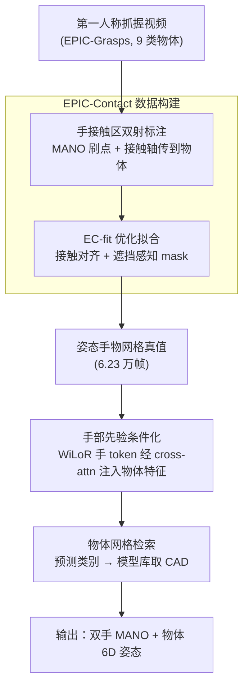

# Towards in-the-wild Egocentric 3D Hand-Object Pose Estimation

**会议**: ECCV 2026  
**arXiv**: [2606.30598](https://arxiv.org/abs/2606.30598)  
**代码**: [https://sid2697.github.io/epic-contact](https://sid2697.github.io/epic-contact)  
**领域**: 3D视觉  
**关键词**: 手物交互, 第一人称视角, 3D 姿态估计, 接触标注, cross-attention

## 一句话总结
本文用「手上接触区 → 双射传到物体 → 优化拟合」的低成本标注流程造出首个野外第一人称手物接触数据集 EPIC-Contact，并提出把预训练手部先验通过 cross-attention 注入物体特征的端到端网络 HOPformer，一次前向同时回归双手与物体姿态，在 ARCTIC 上把成功率从 76.2% 提到 82.4%，在野外数据上成功率近乎翻倍、接触偏差降 75%。

## 研究背景与动机
从单张第一人称 RGB 图像里同时估计双手和被操作物体的 3D 姿态，是 AR/VR、机器人、辅助技术这些以人为中心应用的基础能力。但真实厨房、桌面这类场景里，物体千奇百怪、手势各不相同，还伴随严重的手物互遮挡和模糊的接触区域，学习类方法一旦离开实验室就水土不服。当前主流手物联合估计方法如 ArcticNet-SF、JointTransformer 大多在受控的 in-lab 环境（ARCTIC、HOI4D、DexYCB 等）训练评测，它们的一个共同短板是不建模手与物体姿态之间的相互作用——手明明能给物体姿态提供强约束，却被白白浪费。

这背后真正的瓶颈是监督信号的匮乏。要在野外交互上训练或评测，必须有图像配对的手和物体 3D 真值，而这类真值迄今几乎只能靠昂贵的动作捕捉（MoCap）系统获得：需要精心标定、专用设备，背景往往干净单调，根本无法反映真实第一人称场景的杂乱。唯一一个野外数据集 MOW 也只是粗略验证了物体姿态、完全忽略了手物之间细粒度的接触。于是「想在野外做，却拿不到野外真值」成了死结。

一边，单手重建方向（HaMeR、WiLoR）靠大规模数据和大模型已经能在各种复杂场景里稳健地估计手部姿态；另一边，手物联合估计却停滞不前。本文的两个切入点正好对上这两个缺口：既然拿不到 MoCap 真值，就设计一套人工高效标注「双射接触」再优化拟合出网格的流程来低成本造真值；既然单手先验已经很强，就把它当作条件去引导物体姿态估计。**核心 idea：用「在手网格上刷接触区、双射传递到物体、再优化拟合出姿态网格」的流程把野外第一人称交互变成可训练的 3D 监督（EPIC-Contact），并让一个端到端 transformer（HOPformer）通过 cross-attention 把预训练手部先验注入物体特征，一次前向联合回归双手与物体姿态。**

## 方法详解

### 整体框架
本文有两个彼此配合的产物。其一是 **EPIC-Contact 数据集**：从 EPIC-Kitchens/EPIC-Grasps 里挑出 2.3K 段「稳定抓握」的第一人称视频（9 类物体、6.23 万帧），经过三步——标注者在细分后的 MANO 手网格上「刷」出接触顶点、把接触区双射传递到物体表面、再用 EC-fit 优化流程拟合出成对的手物姿态网格——最终得到带双射接触对应关系和 3D 网格真值的野外数据。因为每段视频是稳定抓握，只需标注中心帧再广播到全片。其二是 **HOPformer 网络**：输入一张 RGB 图，用 DINOv2（ViT-G）抽物体 token、用预训练 WiLoR 抽手部姿态 token，把物体特征当 query、手部特征当 memory 送进 12 层 transformer decoder 反复精炼，聚合后经多个 MLP 头一次性回归左右手 MANO 参数、物体 6D 旋转+平移+关节角，以及物体类别（据此从模型库检索对应网格）。两者可独立使用：EPIC-Contact 造出的姿态网格既能训练 HOPformer，也能训练别的方法。

### 关键设计

**1. 双射接触标注：把「配对 3D 真值」的采集从 MoCap 降到几次点击**

野外交互拿不到 MoCap 真值，是整条链路的死结。本文不去逼近物体姿态，而是转而标注手和物体之间的**双射接触对应**——因为接触点是手物姿态优化时唯一必需的约束。第一步只在手上标：把标准 778 顶点的 MANO 网格均匀细分到 $N_V=3106$ 个顶点，让标注者对着视频「刷」出与物体接触的顶点（视频比单图提供了更丰富的多视角上下文，连遮挡区域也能靠抓握运动推断出来）。手网格拓扑固定、是规范表示，比在形状各异的物体上标注省事得多。第二步把接触区传到物体：跟随 ContactEdit，用一个 2 自由度的「接触轴」参数化每块接触区，标注者只需两次点击（起点 + 方向）就能把这块区域连同对应关系一起搬到物体表面。为兼顾速度与精度，把手分成拇指、四指、手掌三块，每段视频至多三条轴、六次点击即可拿到完整双射对应。作者用 Fleiss' Kappa 验证一致性，手上 $\kappa_h=0.61$、物体上 $\kappa_o=0.62$，与 DECO 的 0.65 相当，证明这套人工流程质量可靠而成本极低（平均每段视频 3–4 分钟）。

**2. EC-fit 优化拟合：从接触点反解出成对的姿态网格**

有了双射接触对应，还得把它变成真正的姿态网格才能当训练真值。EC-fit 是一个多损失联合的优化流程。姿态初始化上，手用 WiLoR 对中心帧的预测作为起点 $\Theta_0$；物体则不用单一初始化，而是叠加随机姿态和类别感知先验做多重初始化，避免陷入局部最优。核心的接触对齐把双射顶点对 $\mathbb{C}=\{(h_i,o_i)\}$ 之间的距离压到最小：

$$\mathcal{L}_{con}=\frac{1}{|\mathbb{C}|}\sum_{i=1}^{|\mathbb{C}|}\left\|h_i-o_i\right\|_2$$

接着用中心帧图像做精炼——这里的关键是**遮挡感知 mask 损失**：野外场景里物体常被手或其他物体挡住（比如盘子上盖着食物），直接对齐渲染 mask 和图像 mask 会被残缺 mask 误导，于是先识别出遮挡区 $M_{occ}$，只在未遮挡区域算 IoU，即 $\mathcal{L}_m^o=1-IoU([\hat{M}_o\setminus M_{occ}],[M_o\setminus M_{occ}])$。再加上防手物穿模的穿透损失（基于手网格的符号距离场惩罚落在手内的物体点）、以及约束手姿态别偏离 WiLoR 初值太远的正则项。作者在 ARCTIC 上用 MoCap 真值验证 EC-fit：拟合出的网格 Pose L2 误差仅 1.9 mm、MRRPE 8.0 mm，穿透深度 0.79 cm 与 MoCap 数据的 0.80 cm 相当，说明这套优化产物的质量足以当真值用。

**3. 手先验条件化的 cross-attention 解码：让手去「指导」物体姿态**

之前方法把手和物体特征简单拼接（Concat+MLP），根本没建模两者交互，遮挡下就崩。HOPformer 的做法是让物体特征被手部姿态**渐进调制**而非简单融合。它把 DINOv2 抽的物体 token 线性投影成 query 序列 $X_o$、把 WiLoR 抽的**姿态专用**手 token 投影成 memory 序列 $X_h$，送进 12 层完整 decoder（而非单层 cross-attention）迭代精炼。每层里物体表示先自注意力互通、再 cross-attention 关注手部上下文、最后过前馈网络：

$$\text{CA}(X_o^{(\ell-1)},X_h)=\delta\!\left(\frac{(X_o^{(\ell-1)}W_Q^\ell)(X_h W_K^\ell)^\top}{\sqrt{d_k}}\right)(X_h W_V^\ell)$$

12 层之后的输出经残差连接、再过一个可学习的聚合模块 $\mathcal{A}$ 把 256 个 token 压到 39 个并层归一化，得到交互特征 $z_i$。之所以要用「姿态专用」的 WiLoR 特征而非通用 DINOv2 当手先验，是因为消融显示用 DINOv2 当手特征会让 MPJPE 从 16.1 掉到 20.6、连带物体成功率从 82.4 掉到 70.0——手先验的质量直接决定物体估计的上限。这一设计正是全文性能提升的来源：把 cross-attention 换成朴素拼接，成功率会从 82.4 暴跌到 29.4，证明增益来自「条件化」而非骨干网络本身。

**4. 解耦的多头输出与物体网格检索：姿态回归与物体识别分家**

聚合后的 39 个 token 被路由到一组独立的小 MLP 头，仿照 DETR 的思路让不同 token 各司其职：前 16 个 token 回归右手 $\theta_r$（含全局朝向）、第 17 个出根、第 18 个出形状 $\beta_r$，接下来 18 个 token 负责左手，最后 3 个 token 回归物体的关节化姿态 $\omega$。姿态头只回归旋转+平移，不硬编码具体物体几何；要渲染出网格时，另有一个分类头利用物体特征 $z_o$ 里丰富的语义预测类别 $c$，据此从预定义模型库 $\mathcal{M}$ 检索对应 CAD 网格，再把回归出的姿态施加上去。这种「回归姿态 / 识别类别」解耦的设计既复用了同一套特征、又让推理能全自动跑通（在 EPIC-Contact 上分类准确率 52.9%）。作者在附录里论证：当前 SAM 3D 这类 CAD-free 方法在野外重遮挡、透明物体上仍会把瓶子认成罐子、玻璃杯认成碗，所以「用固定 CAD 库检索」是现阶段在野外做姿态估计更务实的选择，等未来 CAD 能可靠估计时可无缝替换为预测网格。

### 损失函数 / 训练策略
训练用一组帧级损失。手部损失 $\mathcal{L}_h=\lambda^h_{2D}\mathcal{L}^h_{2D}+\lambda^h_{3D}\mathcal{L}^h_{3D}+\lambda^h_\theta\mathcal{L}^h_\theta+\lambda^h_\beta\mathcal{L}^h_\beta+\lambda^h_T\mathcal{L}^h_T$ 覆盖 3D 关节、2D 投影、MANO 姿态与形状、弱透视相机参数；物体损失 $\mathcal{L}_o$ 类似，外加分类损失 $\mathcal{L}^o_c$ 和物体姿态损失 $\mathcal{L}^o_\omega$（旋转部分用测地损失，其余用 MSE）。手与物体接触的帧再加一个基于 CDev 的交互损失 $\mathcal{L}_{int}$。总损失 $\mathcal{L}=\mathcal{L}_r+\mathcal{L}_l+\mathcal{L}_o+\mathcal{L}_{int}$。优化用 AdamW，仿 ARCTIC 分两阶段：先在 8 个外中心视角上预训练 25 epoch（linear warmup + cosine decay），再在第一人称视角上微调 30 epoch；EPIC-Contact 上训 125 epoch。骨干为 DINOv2 ViT-G（物体）+ WiLoR（手），decoder 深度 12，batch 256/128 分布在 4 张 GH200 上。

## 实验关键数据

### 主实验
ARCTIC 是带 MoCap 真值的 in-lab 数据集（用于消融），EPIC-Contact 是本文的野外基准。对比对象是 ArcticNet-SF 和当前 SOTA 的 JointTransformer（后者用同款 DINOv2 骨干，是最公平的直接对比）。

| 数据集 | 指标 | HOPformer | JointTransformer (SOTA) | 提升 |
|--------|------|-----------|-------------------------|------|
| ARCTIC (Ego) | SR@0.05 ↑ | **82.4** | 76.2 | +6.2 pts |
| ARCTIC (Ego) | CDev (mm) ↓ | **31.9** | 35.0 | -3.1 |
| ARCTIC (Ego) | MDev (mm) ↓ | **7.3** | 10.4 | -3.1 |
| ARCTIC (Ego) | MPJPE (mm) ↓ | **16.1** | 20.0 | -3.9 |
| EPIC-Contact | SR@0.05 ↑ | **29.8** | 17.6 | +12.2 pts (≈翻倍) |
| EPIC-Contact | CDev (mm) ↓ | **20.7** | 30.1 | -31%（对 ArcticNet 的 94.2 降 75%+） |
| EPIC-Contact | MDev (mm) ↓ | **11.4** | 20.0 | -43% |

野外基准比 in-lab 难得多：JointTransformer 的 SR@0.05 从 ARCTIC 的 76.2% 直接跌到 EPIC-Contact 的 17.6%，因为 EPIC-Contact 出现的是已知类别的**新实例**，常常透明、遮挡、杂乱。HOPformer 在野外把成功率近乎翻倍、CDev 相比最弱基线 ArcticNet-SF 的 94.2 mm 降到 20.7 mm（降幅约 78%）。

### 消融实验
消融均在 ARCTIC 第一人称 split 上做（SR@0.05 满分对照 82.4）。

| 配置 | SR@0.05 ↓ | CDev ↑ | 说明 |
|------|-----------|--------|------|
| Full HOPformer | 82.4 | 31.9 | 完整模型 |
| Concat + MLP（换掉 cross-attn） | 29.4 | 74.4 | 崩塌，证明增益来自条件化非骨干 |
| DINOv2 当手特征（替 WiLoR） | 70.0 | 44.2 | 手先验质量决定物体上限 |
| No self-attention | 55.8 | 61.3 | token 互通对物体估计关键 |
| No 聚合模块 $\mathcal{A}$ | 74.0 | 40.4 | 可学习池化有用 |
| decoder 深度 L=1 | 21.9 | 101.6 | 迭代精炼是刚需 |
| w/o Object Losses | 66.8 | 33.8 | 物体监督贡献最大 |
| w/o Interaction Loss | 79.2 | 40.7 | 主要伤物理一致性（CDev） |

### 关键发现
- **cross-attention 条件化是命门**：换成朴素拼接 SR 从 82.4 掉到 29.4、CDev 从 31.9 涨到 74.4，用的是同样的强骨干，说明性能来自「让手指导物体」这个机制本身。
- **手先验要用姿态专用特征**：拿通用 DINOv2 token 当手先验，MPJPE 从 16.1 恶化到 20.6 并连累物体（SR 82.4→70.0），印证「先验得对口」。
- **物体类别越多反而越好**：在 3/6/9/11 类上训练，MDev 等指标随类别数增加持续变好，展示了强泛化性而非被难度拖垮。
- **ARCTIC 预训练关键**：从零在 EPIC-Contact 上训 vs ARCTIC 初始化微调，后者把 SR@0.05 从 24.2 提到 69.7、MRRPE 从 99.5 降到 65.8。
- **EC-fit 真值够用**：用 EC-fit 拟合的姿态网格 vs MoCap 真值训 HOPformer，验证指标几乎不变（SR 71.9 vs 71.8），证明这套低成本标注足以替代 MoCap 训练。

## 亮点与洞察
- **把「难拿的姿态真值」换成「好标的接触对应」**：核心洞察是手物姿态优化其实只需要接触点约束，于是绕开 MoCap，用「刷点 + 两次点击传轴」的双射标注 + 优化拟合，把野外 3D 监督的采集成本压到每段 3–4 分钟，这个「换标注对象」的思路可迁移到任何配对姿态真值难获取的交互任务。
- **接触轴参数化省点击**：用 2-DoF 轴表示接触区，把「逐顶点映射」这种极繁琐的操作压缩到每块区域两次点击、全手最多六次点击，是标注效率的关键 trick。
- **遮挡感知 mask 损失**：野外物体常被遮，只对齐未遮挡区域（排除 $M_{occ}$）而非硬对齐残缺 mask，这个小改动对杂乱场景下的拟合质量很关键。
- **用非各向同性 VLM 尺度估计**：让 Gemini 2.5 按类别定制 prompt 输出多个「尺度维度」（如平底锅的直径和手柄长分开问），做非均匀缩放让模板网格贴合实例，MAE 仅 0.94 cm，是把固定模板适配到千变万化真实实例的巧办法。

## 局限与展望
- 作者承认标注流程虽稳健但仍耗时（每中心帧 3–4 分钟），设想用训练好的方法给接触一个更好的初始化让标注者从最优估计起步。
- 单帧真值广播到整段视频可能引入噪声（WiLoR 手侧判错或相机跳变），但因指标是相对/根对齐的所以不受影响；作者发布逐帧置信度供用户筛选。
- HOPformer 目前只覆盖少数类别（EPIC-Contact 9 类），扩到更多类别、以及在野外处理关节化物体都留作未来工作。
- 依赖固定 CAD 模型库检索是当前的务实妥协——遇到库外新物体无能为力；作者论证等 CAD-free 重建成熟后可无缝替换为预测网格，但认为这在多样真实场景下仍需大量努力。

## 相关工作与启发
- **vs JointTransformer**：两者都用 DINOv2 骨干做 encoder-decoder 回归手物姿态，区别在于 JointTransformer 不显式建模手对物体的引导，而 HOPformer 用 cross-attention 把手先验注入物体特征。本文优势是野外成功率近乎翻倍、CDev 大幅下降；它也仍是 ARCTIC 排行榜上被超越的原 SOTA。
- **vs ArcticNet-SF**：ArcticNet-SF 用 ResNet-50 骨干，HOPformer 换成更强的 DINOv2+WiLoR 并加条件化，各项指标全面领先。
- **vs MOW**：MOW 是唯一的野外配对手物网格数据集，但物体姿态只粗略验证、忽略细粒度接触；EPIC-Contact 提供了双射接触对应和质检过的姿态网格，更适合训练评测。
- **vs DECO / PICO**：DECO 用「顶点刷漆」在人体上标接触、PICO 把接触区迁到物体；本文受此启发但针对手物、且做出**双射**对应（可反解姿态），并适配第一人称遮挡场景。
- **vs CAD-free 方法（HOLD-Net / G-HOP / SAM 3D）**：它们不估计物体相对规范 CAD 的姿态、在野外重遮挡透明物体上生成的形状偏离真实；HOPformer 靠已知 CAD 库检索反而能给出准确姿态，是现阶段更务实的路线。

## 评分
- 新颖性: ⭐⭐⭐⭐⭐ 「换标注对象（接触对应替姿态真值）」+「手先验条件化物体特征」两个点都切中野外手物估计的真痛点，且互相咬合。
- 实验充分度: ⭐⭐⭐⭐⭐ in-lab + 野外双基准、7 组架构/损失消融、类别缩放、跨数据集迁移、EC-fit 真值质量与鲁棒性验证俱全。
- 写作质量: ⭐⭐⭐⭐ 动机与方法交代清晰，标注流程和网络两部分主线分明；符号偏多，附录信息量很大。
- 价值: ⭐⭐⭐⭐⭐ 首个野外第一人称手物接触数据集 + 开源代码/权重，为该方向提供了可训练评测的地基。

<!-- RELATED:START -->

## 相关论文

- [\[CVPR 2025\] EgoPressure: A Dataset for Hand Pressure and Pose Estimation in Egocentric Vision](../../CVPR2025/3d_vision/egopressure_a_dataset_for_hand_pressure_and_pose_estimation_in_egocentric_vision.md)
- [\[ECCV 2026\] Audio-Visual Camera Pose Estimation with Passive Scene Sounds and In-the-Wild Video](audio-visual_camera_pose_estimation_with_passive_scene_sounds_and_in-the-wild_vi.md)
- [\[CVPR 2026\] Egocentric Visibility-Aware Human Pose Estimation](../../CVPR2026/3d_vision/egocentric_visibility-aware_human_pose_estimation.md)
- [\[CVPR 2025\] HOT3D: Hand and Object Tracking in 3D from Egocentric Multi-View Videos](../../CVPR2025/3d_vision/hot3d_hand_and_object_tracking_in_3d_from_egocentric_multi-view_videos.md)
- [\[CVPR 2026\] WildPose: A Unified Framework for Robust Pose Estimation in the Wild](../../CVPR2026/3d_vision/wildpose_a_unified_framework_for_robust_pose_estimation_in_the_wild.md)

<!-- RELATED:END -->
