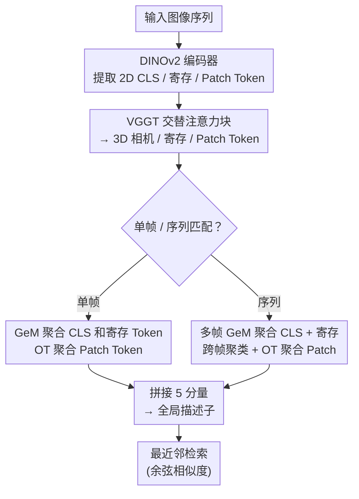

# UniPR-3D: Towards Universal Visual Place Recognition with Visual Geometry Grounded Transformer

**会议**: ECCV2026  
**arXiv**: [2512.21078](https://arxiv.org/abs/2512.21078)  
**代码**: [https://github.com/dtc111111/UniPR-3D](https://github.com/dtc111111/UniPR-3D) (将开源)  
**领域**: 3D 视觉  
**关键词**: 视觉位置识别, 多视图检索, 3D Token, VGGT, 序列匹配

## 一句话总结

UniPR-3D 首次将 VGGT 的 3D 几何感知 token 引入视觉位置识别，针对 2D 和 3D token 的不同特性设计定制聚合策略，同时支持单帧和变长序列匹配，在多个基准上超越现有单视图和多视图方法。

## 研究背景与动机

视觉位置识别（Visual Place Recognition, VPR）是机器人和计算机视觉中的基础问题，目标是判断当前观测是否到过之前的位置，广泛应用于 SLAM、自动驾驶和增强现实。传统 VPR 被形式化为单图像检索任务——用一张查询图像从数据库中找出最相似的 Top-K 候选。特征提取网络从 ResNet 发展到 Vision Transformer（ViT），DINOv2 等基础模型微调后已成为主流；特征聚合也从 NetVLAD、GeM 发展到基于最优传输的 SALAD。这些方法在光照、天气变化下表现越来越好，但都有一个根本局限——只利用单张图像的信息。

单视图本质上只能捕获 2D 纹理模式，丢失了场景的 3D 几何结构。多视图本可以带来更丰富的空间覆盖和视角信息，但多视图特征聚合一直是个棘手问题：不同视角下的同一场景外观差异巨大，简单地拼接或平均会引入噪声而非信息。已有的序列级检索方法（如 SeqSLAM、CaseVPR）大多在帧级相似度上做后处理，或者沿时间维度做纯时序聚合，对帧率变化、速度差异非常敏感，缺乏真正的几何感知。

最近出现的 VGGT（Visual Geometry Grounded Transformer）提供了一个关键使能条件——它是一个大规模 ViT 骨干网络，能从纯 RGB 图像通过空间交替注意力编码出 3D 感知的多视图表示，输出包含 3D token（相机 token、寄存 token、patch token）和中间 2D token。这为将几何信息引入 VPR 打开了可能性。本文的核心 idea 是**将 VGGT 的 3D token 和中间 2D token 同时用于场所描述，针对不同类型的 token 设计定制聚合策略，联合利用纹理细节和几何结构，构建支持单帧和变长序列匹配的通用 VPR 框架。**

## 方法详解

### 整体框架

UniPR-3D 的流程分为三个模块：多视图 3D 特征提取、分类型特征聚合、序列级匹配。输入为图像序列，可输出单帧描述子或整序列描述子。

具体来说，每个输入图像先经过 DINOv2 编码器获得 2D CLS token、2D 寄存 token 和 2D patch token。然后只保留 patch token 送入 VGGT 的交替注意力块（帧内注意力 + 全局注意力交替，共 24 层），VGGT 在这些块中额外引入相机 token（编码内外参）和 3D 寄存 token，最终输出 3D 相机 token、3D 寄存 token 和 3D patch token。为保持描述子对视角变化的鲁棒性，丢弃 3D 相机 token，只使用 3D 寄存和 3D patch token。整个过程只需 RGB 图像，不需要输入任何相机内外参。

### 关键设计

**1. 分类型 Token 定制聚合：针对 token 特性设计不同策略**

2D 和 3D token 具有截然不同的特性，不能用统一的聚合方式。2D CLS token 携带全局语义信息，2D/3D 寄存 token 数量少（每帧各 4 个）且相对稳定，而 2D/3D patch token 数量大且携带细粒度的空间对应关系。UniPR-3D 对两种类型区别对待。对于 CLS token 和寄存 token（数量少、语义强），使用 GeM（广义均值池化）加轻量 MLP 投影器来生成紧凑描述子——这种方式简单高效，能捕捉主导语义线索。对于 patch token（数量多、需要保持空间结构），采用基于最优传输（Optimal Transport）的 SALAD 方案：用可学习 MLP 将 patch token 映射为得分矩阵，通过 Sinkhorn 算法迭代行/列归一化得到软分配矩阵，再将分配权重乘以原始特征得到 patch 描述子。得分矩阵还引入一个可学习的 dustbin 条目，让非信息性区域（如天空、路面）的特征被分配到 dustbin 而不影响有效特征。最终描述子由 5 个分量拼接而成：2D CLS 描述子、2D 寄存描述子、2D patch 描述子、3D 寄存描述子、3D patch 描述子。

**2. 变长序列多帧融合：用 GeM 投影器解耦序列长度限制**

已有序列匹配方法通常要求训练和推理时序列长度一致，限制了泛化能力。UniPR-3D 设计了一个基于 GeM 的多帧投影器来处理这一问题。对于 CLS token 和寄存 token，将各帧对应 token 收集起来后，跨帧做 GeM 池化 + MLP 投影，输出与单帧相同维度的描述子——由于 GeM 池化天然对输入数量不敏感，模型能处理任意长度的序列。对于 patch token，先将属于不同帧的 patch token 跨帧聚类，再用 Sinkhorn 算法计算统一分配矩阵，最终聚合出多帧 patch 描述子。VGGT 的架构中第一帧定义世界坐标系，这保证了跨帧的几何一致性，使多帧聚合有物理意义。

**3. 梯度分阶段训练策略：先训头部再联合微调骨干**

训练分两阶段。第一阶段冻结 VGGT 骨干和 DINOv2，只训练描述子头部（各聚合模块）。第二阶段联合微调 VGGT 的交替注意力块和 DINOv2。整体使用多相似度损失（Multi-Similarity Loss）+ AdamW 优化器，学习率先线性预热 0.5 个 epoch 再余弦衰减，峰值 1e-6。对于 VGGT 骨干采用 LoRA 微调以保持预训练知识、控制参数量。单帧训练在 GSV-Cities 数据集上进行，序列训练在 MSLS（Mapillary Street-Level Sequences）数据集上进行。

## 实验关键数据

### 主实验

**单帧匹配 (R@1)：**

| 数据集 | SALAD | MegaLoc | UniPR-3D | UniPR-3D\* | 提升 vs SOTA |
|--------|-------|---------|----------|------------|-------------|
| MSLS Chall. | 75.0 | 73.4 | **75.5** | **75.9** | +0.9 |
| MSLS val | 92.2 | 91.0 | **92.9** | **93.2** | +1.0 |
| Pitts250k | 95.2 | 96.4 | **96.5** | **96.6** | +0.2 |
| Nordland | 76.0 | 76.7 | **78.4** | **78.9** | +2.2 |
| SPED | 92.1 | 92.0 | **92.6** | **92.8** | +0.6 |
| SF-XL v1 | 90.9 | 95.3 | **93.8** | **96.3** | +1.0 |
| Tokyo 24/7 | 95.1 | 96.5 | **97.6** | **97.9** | +1.4 |

\*表示与 MegaLoc 相同的训练配置。

**序列匹配 (R@1, pos=2m)：**

| 数据集 | CaseVPR | UniPR-3D | 提升 |
|--------|---------|----------|------|
| MSLS Val | 91.2 | **93.7** | +2.5 |
| Nordland | 84.1 | **86.8** | +2.7 |
| Oxford1 (2m) | 90.5 | **95.4** | +4.9 |
| Oxford2 (2m) | 72.8 | **80.6** | +7.8 |

在 Oxford 数据集 2m 严格阈值下，UniPR-3D 以超过 10% 的优势超越此前 SOTA，展示了 3D token 在细粒度定位中的巨大价值。

### 消融实验

| 配置 | MSLS val (R@1) | Oxford1 (R@1) | 说明 |
|------|---------------|---------------|------|
| 仅 3D patch | 84.9 | 86.8 | 基线：只有几何信息 |
| +2D CLS + 2D 寄存 + 2D patch | 90.4 | 91.5 | 加入纹理信息显著提升 |
| +2D patch + 3D patch | 91.9 | 92.1 | 纹理+几何协同 |
| +3D 寄存（完整模型） | 93.7 | 95.5 | 加入 3D 寄存 token 进一步提升 |
| 完整模型 + 显式 3D 位姿注入 | 92.2 | 94.3 | 显式位姿反而略降 |
| 完整模型 + patch OT → GeM | 93.9 | 96.1 | patch 用 OT 优于 GeM |

### 关键发现

- 2D 和 3D token 互补性显著：2D token 关注纹理丰富区域（海报、售货亭、自行车），3D token 关注几何结构（墙壁、建筑），两者结合效果最佳
- 显式注入 3D 位姿信息不仅无帮助，反而轻微下降——说明 VGGT 提取的 3D token 已隐式编码了充分的空间关系
- 序列长度泛化能力强：训练时用 5 帧，测试时在 3-15 帧范围内性能持续提升，证明 GeM 投影器的变长处理有效
- 推理延迟约 140ms（单帧），高于已有方法，是引入 3D 信息的代价

## 亮点与洞察

- **几何感知进入 VPR**：首次将 VGGT 的 3D token 引入 VPR 领域，验证了从 2D 描述子向 3D 描述子转变的可行性，为 VPR 开辟了新方向
- **「分类型聚合」的设计智慧**：不对所有 token 一视同仁，而是根据属性（语义 token 用 GeM、空间 token 用 OT）分别设计策略，这比统一聚合更合理，可迁移到其他多模态检索任务
- **变长序列匹配无需重训**：用 GeM 投影器天然解耦序列长度，避免了现有方法需固定序列长度的强归纳偏置，实用性更强

## 局限与展望

- 推理延迟较高（140ms vs CaseVPR 的 75ms），3D token 提取的开销在实时场景中可能成为瓶颈，未来可探索推理加速
- 训练依赖 GSV-Cities 和 MSLS 两个数据集，对特殊场景（室内、水下、无人机视角）的泛化能力尚未验证
- 5 分量拼接的描述子维度高达 17152，在大规模数据库检索时存储和比对成本较高，未来可探索更紧凑的 3D 描述子形式

## 相关工作与启发

- **vs SALAD**: SALAD 只用 2D DINOv2 token 做最优传输聚合；本文额外引入 3D token，并以分类型策略处理 2D/3D 异质特征，在大多数数据集上超越了 SALAD
- **vs CaseVPR**: CaseVPR 是此前序列匹配 SOTA，采用层次化序列到帧检索；本文用几何感知的多视图 token 直接构建序列描述子，在严格阈值下优势更大（+4.9%~7.8%）
- **vs CricaVPR / SeqVLAD**: 这些方法在时间维度上做时序聚合，对帧率/速度变化敏感；本文的 3D token 天然具有几何稳定性，对这类变化更鲁棒

## 评分

- 新颖性: ⭐⭐⭐⭐⭐ 首次将 VGGT 3D token 用于 VPR，分类型聚合+变长序列匹配设计合理
- 实验充分度: ⭐⭐⭐⭐⭐ 覆盖 10 个单帧基准 + 4 个序列基准，消融深入，含序列长度泛化分析
- 写作质量: ⭐⭐⭐⭐ 方法描述清晰，但 3D 特征提取的细节可更易读
- 价值: ⭐⭐⭐⭐⭐ 证明了 3D 描述子优于纯 2D 描述子，对 VPR 社区有启发意义

<!-- RELATED:START -->

## 相关论文

- [\[ICLR 2026\] Quantized Visual Geometry Grounded Transformer](../../ICLR2026/3d_vision/quantized_visual_geometry_grounded_transformer.md)
- [\[ICLR 2026\] FastVGGT: Fast Visual Geometry Transformer](../../ICLR2026/3d_vision/fastvggt_fast_visual_geometry_transformer.md)
- [\[CVPR 2025\] VGGT: Visual Geometry Grounded Transformer](../../CVPR2025/3d_vision/vggt_visual_geometry_grounded_transformer.md)
- [\[CVPR 2026\] OmniVGGT: Omni-Modality Driven Visual Geometry Grounded Transformer](../../CVPR2026/3d_vision/omnivggt_omni-modality_driven_visual_geometry_grounded_transformer.md)
- [\[ICLR 2026\] Streaming Visual Geometry Transformer](../../ICLR2026/3d_vision/streaming_visual_geometry_transformer.md)

<!-- RELATED:END -->
