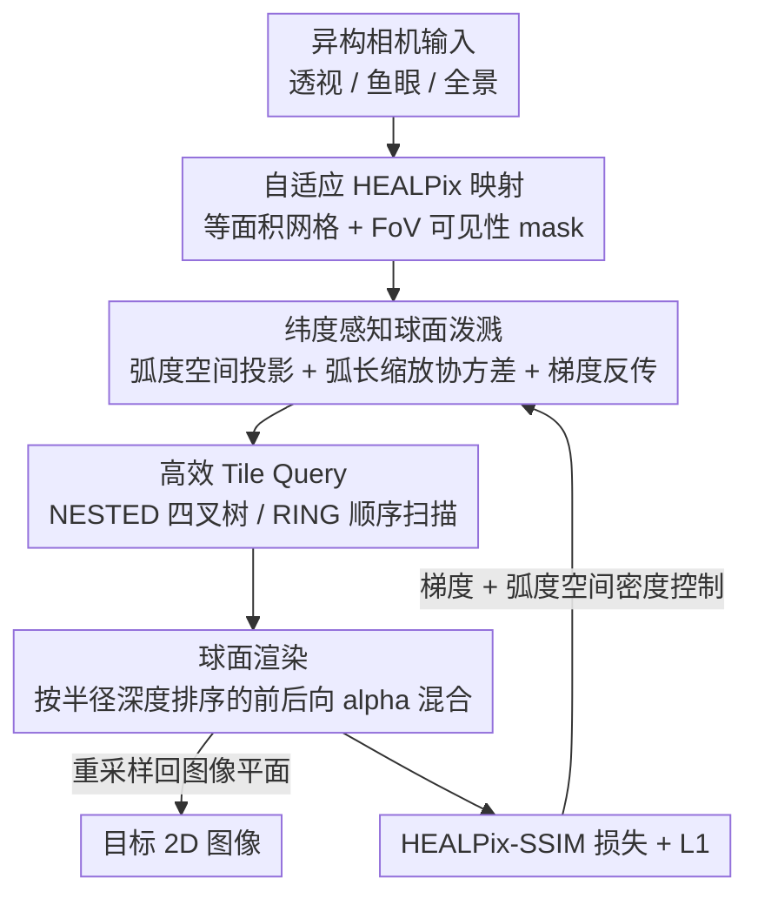

# UniTriSplat: A Unified 3D Gaussian Splatting Framework with Uniform Spherical Rasterization for Universal Cameras

**会议**: ECCV 2026  
**arXiv**: [2606.29794](https://arxiv.org/abs/2606.29794)  
**代码**: 项目页 [https://yipengzhu0809.github.io/UniTriSplat/](https://yipengzhu0809.github.io/UniTriSplat/)  
**领域**: 3D视觉  
**关键词**: 3D高斯泼溅, 全景重建, HEALPix球面离散化, 鱼眼相机, 跨相机泛化

## 一句话总结
把 3D Gaussian Splatting 的光栅化从「针对某一类相机的平面投影」搬到「单位球面上的 HEALPix 等面积网格」，用一套 camera-agnostic 的球面光栅器统一支持透视 / 鱼眼 / 全景相机，既消除了等距柱状投影的极区过采样、又拿到了稳定的跨相机泛化。

## 研究背景与动机
3D Gaussian Splatting（3DGS）靠显式高斯基元 + 可微的分块光栅化，把辐射场重建做到了实时且高保真。但真正落地的场景——城市级数字孪生、沉浸式 VR、机器人与自动驾驶——越来越依赖大视场乃至全向感知，需要的是鱼眼、360° 这类相机，而不是标准针孔。麻烦在于，原版 3DGS 的光栅器和针孔投影是**焊死**在一起的：它假设高斯投到平面上是一个矩形足迹，用固定的分块网格做 O(1) 的 tile culling。要换相机，业界的做法是给每一类相机单独推一套投影函数和对应的雅可比（Fisheye-GS 做鱼眼、OmniGS / ODGS 做全景、OP43DGS 做最优投影近似），结果是实现碎片化、每套只服务一类相机，而且同一个学出来的高斯场换个相机去渲就几何不一致，跨相机泛化很差。

另一条路是把各种相机先映射到一个统一中间表示，最常见的是等距柱状全景图（equirectangular）。但这条路有两个硬伤：一是它天然要求 360° 全覆盖，遇到部分视场的输入就没法用；二是等距柱状投影的像素密度极不均匀——论文实测极区与赤道的像素面积能差 7.6 倍，这种非均匀采样直接导致梯度传播失衡、极区被过度优化而收敛质量打折。说到底，无论是「每类相机一套光栅器」还是「统一到等距柱状图」，都没把「采样均匀」这件事从根上解决。

作者的观察很朴素：所有中心投影相机本质上都能统一到一个共享的球面几何上，那就干脆把光栅化直接搬到球面上做，而且要用一个**等面积**的球面离散化方案来保证采样均匀。**本文的核心 idea 是：用天文学里的 HEALPix（层次化等面积等纬度像素化）把单位球剖成等面积像素网格，在球面弧长坐标系里重新推导高斯泼溅的前向渲染与梯度反传，得到一个与相机无关、从窄视场到 360° 全景都均匀优化的统一光栅器。**

## 方法详解

### 整体框架
UniTriSplat 的目标是：无论输入是透视、鱼眼还是全景，都用**同一套**球面光栅化流程去重建和渲染，只在「相机↔球面」的映射和可见区域上做区分。整条 pipeline 分四步：先把异构相机的图像按其视场（FoV）映射到 HEALPix 球面网格上（部分视场用可见性 mask 圈出有效区域），并按输入的角分辨率自适应选一个 HEALPix 分辨率；然后在球面弧度空间里做光栅化——高斯中心投到经纬度、算球面协方差、按半径深度排序做 alpha 混合，直接渲出一张 HEALPix 球面图；接着把这张球面图按目标相机的映射重采样回 2D 图像平面用于监督/评测；最后用 HEALPix 感知的 SSIM 损失加 L1 损失去优化。训练侧有两处要专门适配：结构相似度损失必须尊重 HEALPix 的非平面拓扑，密度控制的阈值必须从「像素数」改到「弧度空间」。

### 关键设计

**1. HEALPix 等面积球面网格：用等面积像素从根上消掉采样偏置**

痛点直白：等距柱状投影的像素在极区被严重拉伸，同样一块图像面积对应的立体角在极区和赤道差好几倍，梯度自然被拉偏。UniTriSplat 改用 HEALPix——它把单位球先切成 12 个基础四边形，每个再按分辨率参数 $N_{\text{side}}$（2 的幂）递归四分，得到 $N_{\text{pix}}=12N_{\text{side}}^2$ 个**严格等面积**的像素，每个像素占据的立体角恒为 $\Omega_{\text{pix}}=4\pi/N_{\text{pix}}$。等面积这一条直接保证了反传时每个像素的梯度贡献是均衡的，不会出现极区被过度加权。为了让球面网格的分辨率对得上输入图像的角分辨率，作者按下式自适应地选 $N_{\text{side}}$（再取最近的 2 的幂）：

$$N_{\text{side}}^{*}=\sqrt{\frac{4\pi WH}{12\,\Omega_{\text{in}}}}$$

其中 $\Omega_{\text{in}}$ 是相机视场覆盖的立体角——等距柱状为 $4\pi$、鱼眼为 $2\pi(1-\cos\theta)$、透视为 $4\arcsin(\sin\theta_x\sin\theta_y)$（$\theta$ 是各自的半视场角）。索引上用 NESTED（层次四叉树）而非 RING，因为 NESTED 的 $(x,y,f)$ 局部坐标天然对应 GPU 的分块并行：每个基础四边形切成 $B\times B$ 线程的 tile，共 $12\lceil N_{\text{side}}/B\rceil^2$ 个 tile，空间局部性好、访存友好。这是全篇的地基——后面所有模块都跑在这张等面积网格上。

**2. 纬度感知的球面泼溅与梯度推导：把 3DGS 的前向/反传搬进弧度空间**

原版 3DGS 在平面像素上做协方差投影和 EWA 泼溅，直接搬到球面会出问题：HEALPix 屏幕度量的是**弧长**而不是角位移，而同样的角增量在不同纬度对应的弧长不一样（越靠极区弧长被压得越短）。作者的前向流程是：先把相机坐标系下的高斯中心 $\mathbf{t}=(t_x,t_y,t_z)$ 投到经纬度 $\omega=\text{atan2}(t_x,t_z)$、$\phi=\text{atan2}(t_y,\sqrt{t_x^2+t_z^2})$，同时记下径向深度 $r=\|\mathbf{t}\|$ 供排序用；3D 协方差经 $\Pi$ 的雅可比投到弧度空间协方差 $\Sigma_{\text{rad}}$；关键一步是做**纬度相关的弧长缩放**，把角度协方差换算成弧长协方差：

$$\boldsymbol{\Sigma}_{\text{arc}}=\mathbf{S}_\phi\,\boldsymbol{\Sigma}_{\text{rad}}\,\mathbf{S}_\phi^\top,\qquad \mathbf{S}_\phi=\text{diag}(\cos\phi,1)$$

那个 $\cos\phi$ 就是「经度方向的弧长随纬度收缩」这件事的数学落点。因为 $\mathbf{S}_\phi$ 依赖 $\phi$，反传时除了标准的协方差梯度路径，还多出一条几何相关的额外路径——position 梯度里除了走雅可比 $\mathbf{J}$ 的常规项，还多一项穿过 $\mathbf{S}_\phi$ 再到 $\phi$、到 $\mathbf{t}$ 的链式项，这一项是球面投影独有的。作者把这些梯度都显式推了出来并写进自定义 CUDA 光栅器（深度监督用逆径向深度 $r^{-1}$，其梯度为 $-\mathbf{t}/r^3$）。这是让「在球面上训高斯」真正跑得起来的核心，也是论文标题里 "uniform spherical rasterization" 的实质。

**3. 双策略 Tile Query：在非矩形的 HEALPix 网格上高效裁剪高斯**

原版 3DGS 能 O(1) 地把矩形高斯足迹和规则 tile 网格求交，但 HEALPix 像素不是矩形点阵，这套 O(1) 失效了。作者顺着 HEALPix 的两种索引各设计一套查询：**NESTED 四叉树遍历**利用 NESTED 索引天然是四叉树，从 12 个基础四边形出发做深度优先搜索，把中心完全落在高斯球面圆盘（中心 $(\omega,\phi)$、半径 $r_s$）之外的子树剪掉，每个高斯 $O(K+\log N_{\text{side}}^q)$，精度高但要 $O(P\cdot\log N_{\text{side}}^q)$ 的栈内存、GPU 上访存不规则；**RING 顺序扫描**利用 RING 索引按等纬度环排列，先算圆盘与哪些环相交，再在每个环里解析地解出经度范围：

$$\cos\Delta\omega=\frac{\cos r_s-z_c\cdot z_{\text{ring}}}{\sqrt{1-z_c^2}\cdot\sqrt{1-z_{\text{ring}}^2}}$$

其中 $z_c=\sin\phi_c$。RING 做到 $O(K)$ 时间、$O(1)$ 内存，比 NESTED 快约 1.7×，代价是略损质量。两者是一对速度-质量权衡：NESTED 求精度、RING 求效率。消融显示在更密的网格上做 RING 顺序扫描既保质量又高效，被选为默认。

**4. HEALPix-SSIM 损失：让结构相似度尊重球面拓扑**

原版 3DGS 的损失是 L1 光度项 + SSIM 结构项，但标准 SSIM 假设规则 2D 网格，直接套到 HEALPix 上不成立。作者提出 HEALPix-SSIM（HSSIM），一个跑在 HEALPix 网格上、全程可微的 CUDA 结构相似度。做法上，在每个基础四边形内部，NESTED 的 $(x,y,f)$ 参数化近似成一个局部 2D 网格，就能用可分离卷积去算局部均值 $\mu$、方差 $\sigma^2$ 和渲染图与真值间的协方差 $\sigma_{12}$，进而得到 SSIM 指数。两个球面特有的坑要专门处理：一是四边形边界处存在拓扑奇点，某些角点只有 7 个邻居而非 8 个，检测到就重新归一化卷积核权重；二是同样的像素偏移在不同纬度对应不同角距，于是用**分区高斯核**——赤道区像素近似方形用各向同性核，极区像素经度方向被压缩就用各向异性核。CUDA 实现靠共享内存跨面 padding、缓存中间导数用转置卷积高效反传。最终训练损失为：

$$\mathcal{L}=(1-\lambda)\,\mathcal{L}_1^{\text{H}}+\lambda\,\mathcal{L}_{\text{H-SSIM}}$$

$\mathcal{L}_1^{\text{H}}$ 是 HEALPix 网格上逐像素的 L1。消融里去掉 HSSIM 会让 PSNR 从 32.57 掉到 26.42，是贡献最大的模块之一。

### 损失函数 / 训练策略
除了上面的 HSSIM + L1 组合损失，训练侧还有一处必须改：**弧度空间密度控制**。3DGS 的自适应密度控制会 clone/split 高梯度高斯、prune 掉低不透明度或过大的高斯，但它的尺寸阈值是按**像素**定的；球面投影把高斯映到角坐标 $(\omega,\phi)$ 上，所有基于尺寸的判据都必须改到弧度空间。作者从球面协方差 $\Sigma_{\text{arc}}$ 导出一个角半径 $r_s$ 作为高斯的球面足迹，维护一个 per-Gaussian buffer 记录训练中观测到的最大 $r_s$（可见时 $r_{s,\max}\leftarrow\max(r_{s,\max},r_s)$），以此替代像素屏幕尺寸；过大高斯的 prune 阈值也按 HEALPix 分辨率 $N_{\text{side}}$ 从像素换算成弧度。消融里去掉密度控制 PSNR 掉到 24.83。作者还探索过跨视图一致性剪枝（multi-view consistent pruning）能进一步减基元、省时间，但会掉质量，最终不纳入默认配置。所有模型在单张 RTX 4090D 上训 30,000 步；因为球面域的梯度分布和平面不同，UniTriSplat 单独调了致密化阈值、学习率和衰减策略，baseline 保持各自默认。

## 实验关键数据

### 主实验：多视场（Multi-FoV）评测
在透视（Mip-NeRF 360）、鱼眼（ScanNet++、FIORD）、全景（Ricoh360、OmniBlender、360Roam）多类相机上对比各自的投影专用 baseline。为公平比较，把 baseline 结果也投到 HEALPix 网格上用 HSSIM 评。

| 数据集(相机) | 指标 | UniTriSplat | 最强 baseline | 说明 |
|--------|------|------|----------|------|
| FIORD (超广角鱼眼) | PSNR↑ | **24.27** | 21.64 (OP43DGS) | 约 +3 dB，畸变越重优势越大 |
| ScanNet++ (鱼眼) | PSNR↑ | **29.75** | 29.13 (Fisheye-GS) | 全指标一致提升 |
| 360Roam (全景) | PSNR↑ | **21.82** | 21.48 (OmniGS) | 全景 SOTA，且训练最快 (102 min) |
| Mip-NeRF 360 (透视) | HSSIM↑ | **0.806** | 0.741 (OP43DGS) | PSNR 略逊但结构一致性最好 |

关键结论：UniTriSplat 在**所有**数据集上都拿到最高 HSSIM，说明球面几何上的优化确实更均衡；在畸变最重的 FIORD 上领先最多（+3 dB），印证「球面网格天然适配球面成像几何」；透视输入上因为球面→平面重采样会略损锐度，PSNR 打不过针孔专用的 OP43DGS，但结构一致性（HSSIM）反超。OP43DGS 虽号称支持多相机，但其切平面近似在强畸变下不够鲁棒。

### 跨相机验证（Cross-camera Validation）
只用全景数据训一次高斯场，再用不同光栅器渲透视/鱼眼视图，检验学到的高斯是否与相机解耦。

| 场景 | 配置 | PSNR↑ | 对比 |
|------|------|------|------|
| Ricoh360 | 透视 from Ours | **29.01** | 远超 OmniGS 的 22.77 |
| OmniBlender | 鱼眼 from Ours | **31.94** | 超 ODGS 的 22.98 |
| 360Roam | 鱼眼 from Ours | **23.99** | 超 OmniGS 的 22.40 |

相机专用光栅器只有在「用它自己的投影模型优化出的高斯」上表现最好，一旦跨相机就大幅退化；UniTriSplat 的高斯场跨透视/鱼眼投影保持一致合成质量，说明 HEALPix 优化削弱了「高斯表示 ↔ 相机模型」的耦合。

### 消融实验（OmniBlender）

| 配置 | PSNR↑ | SSIM↑ | Time(min) | 说明 |
|------|---------|------|------|------|
| Full (R×4) | 32.57 | 0.905 | 28.2 | 默认配置 |
| D×4 (NESTED 四叉树) | 33.64 | 0.916 | 49.1 | 质量最高但慢近一倍 |
| w/o HSSIM | 26.42 | 0.721 | 21.7 | 掉 6.15 dB，贡献最大 |
| w/o 密度控制 | 24.83 | 0.732 | 33.0 | 掉 7.74 dB |
| w/ Final Pruning | 28.27 | 0.847 | 20.2 | 省时间但掉质量，不纳入默认 |

### 关键发现
- **HSSIM 与弧度空间密度控制是两大支柱**：分别去掉掉 6.15 / 7.74 dB PSNR，缺一不可。
- **Tile Query 是纯粹的速度-质量权衡**：NESTED 四叉树 (D×4) 质量最高（33.64 dB）但慢；RING 顺序扫描 (R×4) 在更密网格上以约 1.7× 加速拿到 32.57 dB，性价比最优，故选为默认。低密度深搜会产生严重锯齿。
- **分辨率相关的效率红利**：高分辨率全景下 Ours(L) 比匹配的等距柱状网格少采约 31.9% 像素，抵消了 HEALPix 索引的 CUDA 开销；但这是分辨率相关的，低分辨率/窄视场时固定的索引与重采样开销占比更大，效率优势不再。

## 亮点与洞察
- **把天文学的 HEALPix 首次搬进 3DGS 光栅化**：等面积 + 层次四叉树这两条性质一箭双雕——等面积消掉极区过采样保证梯度均衡，层次索引又天然对应 GPU 分块并行。作者是第一个把 HEALPix 直接集成进 3DGS 光栅管线的 CUDA 实现。
- **"改映射不改光栅器" 的解耦哲学最优雅**：同一套球面光栅化，换相机时只改「图像↔球面」映射和有效视场 mask，底层完全不动。这直接换来了跨相机泛化——可迁移到任何需要「一次重建、多相机渲染」的场景（如全景采集后渲多种视角）。
- **公平评测的设计意识**：作者清楚 HSSIM 既当损失又当指标有「优化即评测」的嫌疑，专门用 w/o HSSIM 变体证明「即便不优化 HSSIM，标准 SSIM 也超 baseline」，并把所有 baseline 输出走同一套 camera→sphere 映射再算 HSSIM，把「球面结构质量」和「原投影的非均匀采样」隔离开。
- **纬度感知的弧长缩放 $\mathbf{S}_\phi=\text{diag}(\cos\phi,1)$**：一个极简的对角缩放就把「角度→弧长」的纬度依赖建进了协方差与梯度，是把平面 3DGS 数学干净地搬上球面的关键 trick。

## 局限与展望
- **球面→平面重采样引入锯齿/模糊**：作者承认在低分辨率把 HEALPix 重采样回平面图像时会有锯齿，透视/窄视场输入尤其明显（角分辨率高、插值损失更大），输出比原版 3DGS 略软。这是「统一」换来的固有代价。
- **通用性带来 CUDA 开销**：HEALPix 索引、球面 tile 查询、最后的球面→图像采样都是平面专用管线没有的额外算子；只在高分辨率全景下靠去极区冗余摊薄，低分辨率/窄视场时开销更显眼。未来打算简化 HEALPix 索引与搜索、改进重采样滤波、写专用低层 GPU kernel。
- **HEALPix 只支持离散细分层级**：分辨率不能连续匹配输入，只能选相邻的高/低两档（Ours(H)/Ours(L)），带来质量-效率的取舍分歧。
- **EWA 近似与缝合伪影未解**：仍沿用 EWA 泼溅近似会有轻微投影误差；对多镜头拼接产生的缝隙/曝光差异不做专门处理（认为属硬件与预处理范畴，超出本文范围）。
- 自己发现：透视输入上 PSNR 打不过针孔专用方法，说明「统一」并非在每个单相机指标上都占优，更像是用局部锐度换全局一致性与泛化。

## 相关工作与启发
- **vs Fisheye-GS / ODGS / OmniGS（相机专用光栅器）**：它们各给一类相机推专用投影 + 雅可比，实现碎片化、跨相机就退化；本文一套球面光栅器通吃，代价是重采样略损锐度，优势是跨相机泛化和任意视场。
- **vs OP43DGS（最优投影 + 切平面近似）**：OP43DGS 号称支持多相机，但受限于 sub-180° 或要求对称视场，且切平面近似在强畸变下不鲁棒；UniTriSplat 真正 camera-agnostic、支持任意配置，在超广角 FIORD 上领先约 3 dB。
- **vs 等距柱状/立方体/Yin-Yang 等统一中间表示**：等距柱状有 7.6× 极区过采样、且要 360° 全覆盖；Yin-Yang 等只是准均匀。HEALPix 保证严格等面积 + 层次多分辨率，且本文是第一个把它做进 3DGS 光栅化的。
- **vs 3DGUT（Unscented Transform 替代 EWA）**：3DGUT 用无迹变换换掉 EWA 做更准的非线性投影，仍在平面/等距柱状域内光栅化；本文直接在球面上光栅化，从表示层面解决非均匀采样。

## 评分
- 新颖性: ⭐⭐⭐⭐⭐ 首个把 HEALPix 等面积球面离散化集成进 3DGS 光栅管线，从表示层解决了相机耦合与极区过采样两个老问题
- 实验充分度: ⭐⭐⭐⭐⭐ 覆盖透视/鱼眼/全景三类相机 6+ 数据集，含多视场、跨相机、消融、跨分辨率四组实验，评测协议考虑了公平性
- 写作质量: ⭐⭐⭐⭐ 方法推导（前向/反传/tile query）扎实清晰，图文对照到位；正文对球面→平面重采样的锯齿代价交代坦诚
- 价值: ⭐⭐⭐⭐⭐ 为 VR / 机器人 / 自动驾驶等大视场场景提供了「一次重建、多相机渲染」的统一底座，跨相机泛化的实用价值高

<!-- RELATED:START -->

## 相关论文

- [\[CVPR 2026\] Seele: A Unified Acceleration Framework for Real-Time Gaussian Splatting on Mobile Devices](../../CVPR2026/3d_vision/seele_a_unified_acceleration_framework_for_real-time_gaussian_splatting_on_mobil.md)
- [\[ICLR 2026\] MEGS2: Memory-Efficient Gaussian Splatting via Spherical Gaussians and Unified Pruning](../../ICLR2026/3d_vision/megs2_memory-efficient_gaussian_splatting_via_spherical_gaussians_and_unified_pr.md)
- [\[CVPR 2026\] Urban-GS: A Unified 3D Gaussian Splatting Framework for Compact and High-Fidelity Aerial-to-Street Reconstruction](../../CVPR2026/3d_vision/urban-gs_a_unified_3d_gaussian_splatting_framework_for_compact_and_high-fidelity.md)
- [\[ICLR 2026\] Universal Beta Splatting](../../ICLR2026/3d_vision/universal_beta_splatting.md)
- [\[ICCV 2025\] StochasticSplats: Stochastic Rasterization for Sorting-Free 3D Gaussian Splatting](../../ICCV2025/3d_vision/stochasticsplats_stochastic_rasterization_for_sorting-free_3d_gaussian_splatting.md)

<!-- RELATED:END -->
