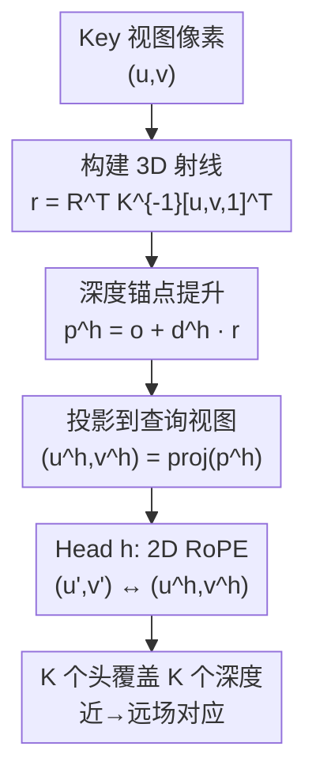

# URoPE: Universal Relative Position Embedding across Geometric Spaces

**会议**: ECCV2026  
**arXiv**: [2604.18747](https://arxiv.org/abs/2604.18747)  
**代码**: [https://urope-pe.github.io/](https://urope-pe.github.io/)  
**领域**: 3D视觉  
**关键词**: 位置编码, 跨视图注意力, RoPE, 射影几何, 多视角3D  

## 一句话总结
URoPE 将 key 图像块沿相机射线在固定深度锚点处提升为 3D 点、再投影到查询视图图像平面，让标准 2D RoPE 能直接编码跨视图/跨几何空间的相对位置关系，是一种参数无关、内参感知、坐标系统无关且兼容 FlashAttention 的通用位置编码。

## 研究背景与动机

Transformer 已成为多视角感知与生成任务的主流架构，从新视角合成、立体匹配到 2D/3D 目标检测，都需要编码来自不同视角、不同坐标系乃至不同几何模态（2D 图像与 3D 点云）之间的空间关系。相对位置编码（特别是 RoPE）因其泛化能力和长度外推性成为主流选择，但标准 RoPE 只能在单一平坦坐标空间内运作——根据序列索引或图像网格位置赋予位置。跨视图场景下，两个相机中在 3D 空间相近的像素在各自的 2D 网格中可能相距甚远，这种根本性的错位使得标准 2D RoPE 无法编码跨视图对应。

近年工作开始将相机几何引入注意力模块，但各有局限。Plücker 射线嵌入是绝对编码、缺乏相对偏置特性；GTA 和 P-RoPE 将跨视图几何与图像内位置解耦到不同维度块中，两者没有交互且跨视图几何仅在相机级别而非 patch 级别考虑；RayRoPE 用每层可学习模块预测深度，但无监督预测无法保证得到实际场景深度。跨视图相对位置编码的根本困难在于深度歧义——一个源视图像素到底对应查询视图极线上的哪一点并不确定。

URoPE 的观察是：跨视图相对位置的本质问题是「key 标记的 3D 内容出现在查询标记图像的哪里」。**核心 idea：对每个 key 图像块，沿其相机射线在多个固定深度锚点处采样 3D 点并投影到查询视图图像平面，然后用标准 2D RoPE 编码查询位置与投影位置之间的相对关系，不同注意力头各司一个深度假设。**

## 方法详解

### 整体框架

URoPE 的处理流程从 key 视图的每个像素出发。首先利用相机内外参构建该像素的 3D 射线，在多个固定深度锚点处采样 3D 点，再将这些 3D 点投影到查询视图的图像平面，获得一组深度条件化的投影像素坐标。最后在查询图像平面内，对查询位置与每个深度锚点对应的投影位置应用标准 2D RoPE，产生几何感知的相对位置偏置。不同注意力头分配到不同的固定深度锚点，多头注意力共同覆盖近场到远场的全部可能对应关系。

### 关键设计

**1. 深度锚点提升与投影：把跨视图对应拉到同一图像平面** key 视图每个像素在 3D 空间对应一条经过相机中心的射线。URoPE 使用一组固定深度锚点 D={d^1,...,d^K}——不依赖逐层学习的深度预测（浅层特征缺乏几何线索，可学习模块预测不稳定）。对每个像素，沿射线在深度 d^h 处采样 3D 点 p^h=o+d^h·r(u,v)，再利用查询视图的内外参将 3D 点投影到查询图像平面，得到投影坐标 (u^h_{i→j}, v^h_{i→j})。投影点恰好落在源像素诱导的极线上，提供从源视图到查询视图的显式、内参感知的映射。当源视图与查询视图相同时投影退化为恒等映射，URoPE 自然降级为标准 2D RoPE。

**2. 深度锚点多头注意力：每个头编码一个深度假设** 跨视图投影天然存在深度歧义——一个源像素对应查询视图中一整条极线。URoPE 让不同注意力头（或头组）负责不同的固定深度锚点，各头在查询图像平面内独立对查询位置和投影后 key 位置应用 2D RoPE（水平垂直各一半通道）。逐头分配不会引发多头坍塌：实验显示各头注意力分布均衡，且在中间层中深度锚点的重要性与实际场景深度高度相关，网络能根据局部信息自适应地利用不同深度的锚点。固定锚点优于可学习深度预测（PSNR 25.57→26.01），因为浅层特征不足以支撑准确深度估计。

**3. 2D-3D 跨维度交互的自然扩展** 对于 3D 目标检测等需要图像特征与 3D 查询交互的任务，URoPE 跳过图像平面投影步骤，直接通过 3D 空间中查询位置与提升后 3D 点之间的相对位置计算 RoPE。同一组公式统一处理 2D-2D（跨视图注意力）、2D-3D（3D 检测与跟踪）和时序场景，展现了 URoPE 概念的简洁与普适性。

**4. 多视图序列的高效并行实现** 当查询来自同一序列的 N 个视图时，将视图维度从序列长度移到 batch 维度，key/value 沿 batch 维度复制 N 次。这样每个 batch 样本对应单个查询视图，注意力计算方式与标准 RoPE 完全一致，计算复杂度保持 O(B·H·L^2·C) 不变。URoPE 不引入额外渐近计算开销，且完全兼容 FlashAttention 等 RoPE 优化内核。

### 一个完整示例

以新视角合成为例：给定目标视图（查询）中的图像块 (u',v') 和两个参考视图的像素。对参考视图像素 (u,v)，URoPE 沿其射线在 4 个固定深度锚点（如 [2m, 8m, 14m, 20m]）处采样 3D 点。假设该像素实际对应场景中 10m 处的物体，那么深度 8m 的锚点投影到查询视图后最接近该物体的真实位置——对应此锚点的注意力头给出较高权重，其他头权重较低。4 个头通过多头注意力合并，共同覆盖极线上所有可能的对应深度。

## 实验关键数据

### 主实验

**新视角合成（Objaverse / RealEstate10k）**：URoPE 在 PSNR、SSIM、LPIPS 上全面超越所有基线。在 Objaverse（合成数据，相机焦距随机变化）和 RealEstate10k（真实场景）上均取得最优结果。

| 数据集 | 指标 | Plücker | 6D RoPE | P-RoPE | RayRoPE | URoPE |
|--------|------|---------|---------|--------|---------|-------|
| Objaverse | PSNR↑ | 22.28 | 24.42 | 24.88 | 24.96 | **25.09** |
| Objaverse | SSIM↑ | 0.856 | 0.891 | 0.896 | 0.897 | **0.900** |
| RealEstate10k | PSNR↑ | 23.95 | 25.73 | 25.28 | 24.94 | **26.02** |
| RealEstate10k | SSIM↑ | 0.764 | 0.819 | 0.806 | 0.799 | **0.827** |

**3D 目标检测与跟踪（nuScenes）**：在 PETR（单帧）和 StreamPETR（多帧）框架中一致提升检测与跟踪性能。

| 方法 | NDS↑ | mAP↑ | AMOTA↑ |
|------|------|------|--------|
| PETR | 34.9 | 30.9 | 0.222 |
| + URoPE | **37.3** | **32.2** | **0.255** |
| StreamPETR | 47.6 | 37.5 | 0.335 |
| + URoPE | **50.6** | **41.1** | **0.380** |

### 消融实验

| 配置 | PSNR | 说明 |
|------|------|------|
| Plücker(Abs)+2D RoPE | 24.96 | 绝对编码+标准相对 |
| Plücker+URoPE | 25.89 | 混合绝对+相对 |
| 仅 URoPE | **25.85** | 不需要绝对编码辅助 |
| 深度锚点=1 | 25.37 | 单锚点严重退化 |
| 深度锚点=4 | **26.01** | 4 锚点即达最优 |
| 逐通道分割（4 锚点） | 25.47 | 远弱于逐头分割 |
| 可学习深度预测模块 | 25.57 | 不如固定锚点 |

### 关键发现
- 深度锚点约 4 个效果最优，更多锚点（8、16）不带来额外收益
- 逐头深度分配远优于逐通道分割——逐头方式可容纳更多不同频率成分，同时处理短距与长距关系
- 固定锚点优于可学习深度预测：浅层特征缺乏几何线索，可学习模块难以准确估计深度
- URoPE 对深度范围选择不敏感（只需覆盖近区），对相机噪声有良好的鲁棒性
- 在 50 倍计算规模下 URoPE 仍保持有效增益（PSNR +0.58），展现良好可扩展性

## 亮点与洞察
- **最优雅的设计**：固定深度锚点 + 多头注意力的组合优雅解决了跨视图投影的深度歧义问题，无需任何可学习参数且理论上覆盖极线上所有可能的对应
- **统一的框架**：同一组公式自然覆盖 2D-2D（跨视图）、2D-3D（检测）和时序场景，同视图退化回标准 RoPE 保向后兼容
- **纯 RoPE 路线**：不改变 Q/K/V 乘法格式、不引入额外矩阵乘，天然兼容 FlashAttention——这是相比 GTA（矩阵乘）、P-RoPE（RoPE + MatMul）的核心工程优势
- **Table 1 非常有价值**：从机制、几何信息、Per-patch 粒度、SE(3) 不变性、参数无关五个维度系统对比了所有跨视图位置编码方法

## 局限与展望
- 依赖已知的相机内外参，无法直接用于无标定场景（如 VGGT、DepthAnything 等 3D 重建框架）
- 受限于计算资源，未在大规模模型上验证（但已做 50x 缩放实验初步佐证可扩展性）
- 未来方向包括结合估计的相机参数扩展到无标定设置，以及集成到更大的生成/感知基础模型

## 相关工作与启发
- **vs P-RoPE**：都用投影矩阵，但 P-RoPE 将跨视图几何与图像内 RoPE 解耦到不同 head 维度块且没有局部交互；URoPE 用显式投影将两者统一在单一图像平面处理
- **vs RayRoPE**：RayRoPE 用每层可学习模块预测深度但无监督预测无法保证准确性；URoPE 的固定深度锚点无需学习、更稳定且效果更优
- **vs Plücker 射线嵌入**：Plücker 是绝对编码（拼接 6D 射线向量），缺乏相对偏置；URoPE 通过旋转矩阵编码相对位置

## 评分
- 新颖性: ⭐⭐⭐⭐ 将显式射影几何与 RoPE 结合解决跨视图位置编码问题，思路简洁且工程友好
- 实验充分度: ⭐⭐⭐⭐⭐ 三大任务 + 充分消融 + 缩放实验 + 噪声鲁棒性分析 + 多头坍塌验证
- 写作质量: ⭐⭐⭐⭐⭐ 问题动机明确、方法推导清晰，Table 1 是非常有信息量的系统性对比
- 价值: ⭐⭐⭐⭐⭐ 参数无关即插即用兼容高效内核，有望成为跨视图 Transformer 的标准位置编码方案

<!-- RELATED:START -->

## 相关论文

- [\[ICLR 2026\] Universal Beta Splatting](../../ICLR2026/3d_vision/universal_beta_splatting.md)
- [\[CVPR 2026\] UniCorrn: Unified Correspondence Transformer Across 2D and 3D](../../CVPR2026/3d_vision/unicorrn_unified_correspondence_transformer_across_2d_and_3d.md)
- [\[CVPR 2026\] Spatial Matters: Position-Guided 3D Referring Expression Segmentation](../../CVPR2026/3d_vision/spatial_matters_position-guided_3d_referring_expression_segmentation.md)
- [\[ICLR 2026\] RoRE: Rotary Ray Embedding for Generalised Multi-Modal Scene Understanding](../../ICLR2026/3d_vision/rore_rotary_ray_embedding_for_generalised_multi-modal_scene_understanding.md)
- [\[AAAI 2026\] Geometry Meets Light: Leveraging Geometric Priors for Universal Photometric Stereo under Limited Multi-Illumination Cues](../../AAAI2026/3d_vision/geometry_meets_light_leveraging_geometric_priors_for_universal_photometric_stere.md)

<!-- RELATED:END -->
