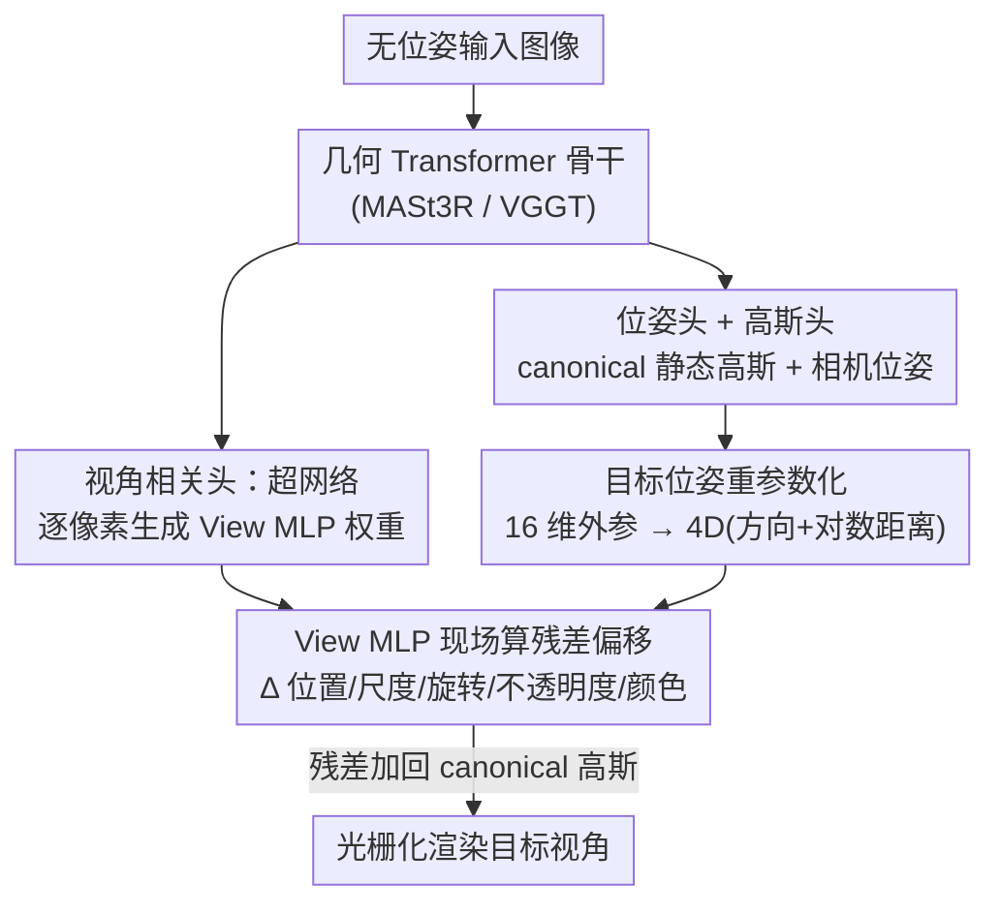

# ViewSplat: View-Adaptive 3D Gaussian Splatting for Feed-Forward Synthesis

**会议**: ECCV 2026  
**arXiv**: [2603.25265](https://arxiv.org/abs/2603.25265)  
**代码**: [https://cvlab-uos.github.io/ViewSplat](https://cvlab-uos.github.io/ViewSplat) （项目主页）  
**领域**: 3D视觉  
**关键词**: 3D高斯泼溅, 前馈重建, 新视角合成, 视角自适应, 超网络

## 一句话总结
ViewSplat 给无位姿前馈 3DGS 补上一个「视角自适应」环节——先预测一套基础高斯 + 一套场景条件化的 View MLP，渲染时让这些 MLP 吃目标视角坐标、为每个高斯的全部属性（位置/尺度/旋转/不透明度/颜色）现场算出残差偏移，从而在保持实时渲染（最大骨干仍有 90 FPS）的同时把镜面高光、锐利反射这类静态表示丢失的高频视角相关效果重建出来，刷新了 pose-free NVS 的保真度 SOTA。

## 研究背景与动机
前馈式 3D 高斯泼溅（feed-forward 3DGS）近两年把「从几张图直接重建 3D 场景」的速度推到了极致：pixelSplat、MVSplat、GS-LRM 这类模型不再对每个场景做上千次迭代优化，而是让网络一次前向就吐出全套高斯基元，实现即时的新视角合成。为了摆脱对 SfM 预计算相机位姿的依赖，最新的一批工作（Splatt3R、NoPoSplat、SelfSplat、SPFSplat/SPFSplatV2）进一步借助 DUSt3R、MASt3R、VGGT 这些 3D 基础模型，把相机参数和几何一起端到端估出来，做到了真正的无位姿（pose-free）、可处理野外未标定图像的重建。但即便如此，前馈方法和逐场景优化方法之间始终横着一道明显的保真度鸿沟。

作者把这道鸿沟归因到一个结构性瓶颈：**静态基元回归**。现有前馈网络用一次单步回归就要把每个高斯的全部属性（3D 位置、尺度、旋转四元数、不透明度、球谐系数 SH）一次性定死，而这套属性必须同时满足所有可能的观察视角。问题在于，对一次前向传播来说，回归出「对每个视角都最优」的表示本就是个病态问题——尤其面对复杂几何或非朗伯（non-Lambertian）表面时。优化类方法可以靠上千次迭代慢慢磨出锐利的镜面高光和随视角变化的 SH 系数，但前馈模型在推理时根本没有机会去修正它的初始预测。更尴尬的是，作者实验发现：单纯把基线的 SH 阶数从 4 提到 8，PSNR 几乎不动甚至略降，说明标准 SH 表示在 pose-free 设定下已经触到了表达力天花板，光靠堆 SH 阶数救不了视角相关效果。

作者的切入角度是把网络的目标彻底换掉：与其逼网络去猜一套「放之四海皆准」的静态 3D 高斯，不如让它专注去生成「针对某个具体目标视角」的更新量——因为「只要底层 3D 基元能为该视角量身微调，从这个视角渲染出高保真 2D 图像其实相对容易」，而学后者远比学前者可行。**核心 idea：把范式从静态基元回归转向视角自适应泼溅（view-adaptive splatting）——网络先出一套基础高斯 + 场景条件化的 View MLP，渲染阶段这些 MLP 以目标视角坐标为输入、为每个高斯的所有属性现场预测视角相关的残差偏移，让每个基元都能就地纠正初始估计误差、补出静态表示丢掉的高频视角相关细节。**

## 方法详解

### 整体框架
ViewSplat 建立在 SPFSplat / SPFSplatV2 这套无位姿前馈框架之上。给定 $N$ 张无位姿图像 $\{I^v\}_{v=1}^{N}$，一个共享的几何 Transformer 骨干（MASt3R 或 VGGT）先做多视角特征聚合，然后并行挂三类头：**位姿头**估出每张图相对于参考视角（第一张输入图 $I_1$ 定义的 canonical 坐标系）的相机外参 $P^{v\to 1}$；两个 DPT 高斯头（中心头 + 参数头）在 canonical 空间里逐像素回归出一套静态基础高斯 $\{\mathcal{G}^{v\to 1}\}$。到这里为止都是基线的能力。

ViewSplat 真正新增的是第四个头——**视角相关头（view-dependent head）**。它不直接输出偏移，而是采用超网络（hypernetwork）结构：吃几何 Transformer 的特征 token，逐像素生成一个小型二级网络（称为 **View MLP**）的权重。渲染某个目标视角时，先把该目标位姿 $P^{t\to 1}$ 重参数化成一个紧凑的 4D 表示（3D 单位视线方向 + 1D 对数距离），逐像素喂进对应的 View MLP，算出每个高斯全部属性的残差偏移 $\Delta\mathcal{G}$；把偏移逐元素加回 canonical 高斯得到精修后的 $\hat{\mathcal{G}}$，再交给光栅化器从 $P^{t\to 1}$ 渲染出该视角图像。整个流程如下：

### 关键设计

**1. 视角自适应泼溅：把「回归静态基元」换成「现场精修基元」**

这是全文的立意。前面说过，前馈网络用单步回归定死一套要满足所有视角的高斯，面对镜面/非朗伯表面时必然力不从心，而优化类方法能靠迭代慢慢修属性——ViewSplat 想在前馈框架里把「修」这个动作补回来。具体做法是不再指望那套 canonical 高斯直接可用，而是把它当作一个「初始估计」，在渲染每个目标视角时为其叠加一层视角相关的残差修正。这样每个高斯基元都能针对当前观察视角做几何与光度上的微调：漫反射区域基本不动，镜面/高频边界区域则被重点纠偏。这个转变之所以关键，是因为它把网络要学的东西从「一个病态的、全视角通吃的静态解」换成了「一个可行得多的、视角条件下的增量」——后者天然更好学，也让前馈模型第一次有能力表达随视角漂移的反射和高光。作者的误差图分析证实了这种「空间选择性」：ViewSplat 主要在镜面反射和高频几何边界处降误差，漫反射区域保持稳定。

**2. 场景条件化 View MLP：用超网络把「怎么修」交给场景自己决定**

如果直接让一个固定参数的网络从「上下文特征 + 目标位姿」回归偏移，会有两个问题：一是固定参数的 MLP 用同一套响应函数应付所有像素、所有材质，表达力受限；二是（见设计 4）目标位姿会和沉重的 DPT 解码器耦合，每换一个视角就得重跑整个 dense 网络，渲染直接崩。ViewSplat 用超网络绕开这两点：视角相关头吃几何 Transformer 的特征 token（携带了丰富的几何与材质上下文），为**每个像素**生成一个专属 View MLP 的权重。也就是说，网络先根据场景内容决定「这个像素该用什么样的响应函数」——镜面表面可以拿到更复杂的映射去捕捉漂移的反射，漫反射区域则只需简单函数。这种「上下文驱动的权重生成」与「位姿驱动的偏移计算」两步分离，让模型不被一个预定义的静态参数空间束缚，从而能刻画细密的高频外观变化。实测这个 View MLP 只需单隐层、隐维 16（甚至降到 8 都几乎不掉点），开销极小。

**3. 目标位姿重参数化：把 16 维外参压成 4D「方向 + 对数距离」再喂 MLP**

直接把 $4\times 4$ 的 world-to-camera 外参矩阵塞进 View MLP 很糟糕——旋转矩阵的正交性等复杂数学约束对 MLP 极难优化。作者把目标位姿改造成一个紧凑且几何有意义的表示：对每个 canonical 高斯中心 $\mu_j^{v\to 1}$，先由外参恢复目标相机在世界系下的中心 $C^{t\to 1}=-(R^{t\to 1})^{\top}t^{t\to 1}$，再算从高斯中心指向相机的位移向量 $\mathbf{d}_j^v=C^{t\to 1}-\mu_j^{v\to 1}$，最后拆成一个 3D 单位视线方向和一个 1D **对数**距离：

$$\mathbf{u}_j^v=\frac{\mathbf{d}_j^v}{\|\mathbf{d}_j^v\|_2},\qquad l_j^v=\log(\|\mathbf{d}_j^v\|_2+\epsilon)$$

这样输入维度从 16 降到 4，既保留了关键的视角相关线索，又好学得多。对数距离不是随手取的：透视投影下相机移动对近处物体的视觉影响远大于远处，$\log(\cdot)$ 压缩了距离的动态范围、放大了近场敏感度，让 View MLP 把精修算力优先投给「视角一动画面变化最剧烈」的那些高斯。消融显示对数距离比线性距离在 RE10K/ACID 上都稳定更优（虽然幅度不大）。

**4. 视角相关高斯精修：残差整体叠加，位置与可见性必须同步**

有了 4D 位姿表示和逐像素 View MLP，就能为每个像素处的高斯预测全套属性偏移 $\{(\Delta\mu,\Delta\alpha,\Delta r,\Delta s,\Delta c)\}$，然后逐元素残差相加（如 $\hat{\mu}=\mu+\Delta\mu$）得到精修高斯，再从目标位姿光栅化。值得强调的是「残差 + 全属性 + 整体优化」这三点合在一起才有效：消融（表 6）里，只改一部分属性大多能小幅涨点，但**当只加位置偏移 $\Delta\mu$ 却不同步更新不透明度 $\Delta\alpha$ 时，PSNR 从 25.5 灾难性崩到 15.7**，出现严重伪影、模糊和结构坍塌。原因是空间位移必须和可见性更新同步，否则被挪动的高斯遮挡关系错乱。这条经验直接支撑了「全属性联合精修」的设计——完整模型（8 项全开）在所有指标上最好。另外一个易忽略的细节：几何重投影损失只监督 canonical 中心 $\mu$、不监督 $\mu+\Delta\mu$，把 $\mu$ 当作稳定的 3D 几何锚点、让 $\Delta\mu$ 自由地建模视角相关外观，消融证明这样比约束精修后的中心更好。

### 损失函数 / 训练策略
沿用 SPFSplat 的无位姿端到端训练，总损失为渲染损失加几何重投影损失：$\mathcal{L}_{total}=\mathcal{L}_{render}+\lambda_{reproj}\mathcal{L}_{reproj}$，其中 $\lambda_{reproj}=0.001$。渲染损失是 MSE 光度损失 + LPIPS 感知损失（$\lambda_{LPIPS}=0.05$）的组合；重投影损失把 canonical 高斯中心用估计的相对位姿和内参投回各上下文视角、惩罚与 2D 像素坐标的偏差，用来在没有真值位姿时稳住 canonical 空间的几何、防止退化坍塌。训练采用**冻结骨干**策略：几何 Transformer、两个高斯头、位姿头都用对应 SPFSplat 变体的预训练权重初始化并冻结，只训练新增的视角相关头；且该头做**零初始化**，使网络初期先原样保留基线的静态重建、再逐步学入视角自适应精修。Adam，学习率 $1\times10^{-4}$，batch size 12，每个 batch 一个场景，输入视角间帧距随训练递增做课程学习。分辨率 $256\times256$（V2-L 变体按其骨干默认 $224\times224$）。

## 实验关键数据

### 主实验
在 RE10K 与 ACID 上评测新视角合成，评测时用**估计的**目标位姿（而非真值位姿）渲染，从而联合考察重建质量与位姿-高斯对齐。ViewSplat 作为即插即用模块接到三种 SPFSplat 骨干上，均一致涨点，V2-L 变体刷新全指标 SOTA：

| 数据集 | 骨干 | PSNR↑ | SSIM↑ | LPIPS↓ |
|--------|------|-------|-------|--------|
| RE10K | SPFSplat | 25.484 | 0.847 | 0.153 |
| RE10K | + ViewSplat | **26.317** | **0.857** | **0.144** |
| RE10K | SPFSplatV2-L | 25.668 | 0.855 | 0.137 |
| RE10K | + ViewSplat | **26.798** | **0.870** | **0.124** |
| ACID | SPFSplatV2-L | 26.674 | 0.806 | 0.162 |
| ACID | + ViewSplat | **27.509** | **0.820** | **0.149** |

作为对照，pose-required 的 MVSplat 在 RE10K 仅 24.012 PSNR，ViewSplat（无位姿）反超约 2.8 dB。效率上（RTX 4090），ViewSplat 模块前向只增加 11–13 ms；但因残差要为每个新视角重算，渲染帧率从基线 386 FPS 降到 154 FPS（base 骨干），最大 V2-L 骨干仍保持 90 FPS，远高于 30 FPS 实时门槛。

跨数据集零样本泛化（仅在 RE10K 训练，测 ACID/DTU/DL3DV）同样对三种骨干全线提升，V2-L + ViewSplat 在 DL3DV 上 PSNR 20.563 vs 基线 19.743，说明视角自适应精修学到的是可迁移表示。

### 消融实验

| 配置 | PSNR↑ | 说明 |
|------|-------|------|
| (1) Baseline SPFSplat | 25.484 | 静态基线 |
| (4) w/o Δα（有 Δμ 无不透明度） | **15.684** | 位置与可见性解耦 → 结构坍塌 |
| (8) Full ViewSplat（全属性） | 26.317 | 完整模型最优 |
| View MLP (Ours) | 26.317 / 154 FPS | 超网络方案 |
| Direct Regression | 26.396 / 72 FPS | 直接回归仅 +0.08 dB 但帧率腰斩 |
| SH degree 8 baseline | 25.418 | 堆 SH 阶数无效，反证需视角精修 |

### 关键发现
- **贡献最大且最脆的耦合是 μ 与 α**：只加位置偏移不加不透明度更新会让 PSNR 崩掉近 10 dB（25.5→15.7），说明空间位移必须与可见性同步，全属性联合精修不可拆。
- **超网络 vs 直接回归是效率之争而非精度之争**：直接回归把目标位姿耦合进 DPT 解码器，每个视角要重跑 dense 网络，渲染开销相对基线暴涨 +436%（154→72 FPS），而精度只多 0.08 dB；超网络方案权重只算一次、渲染只跑轻量 View MLP，保住了实时性。
- **标准 SH 已到表达天花板**：基线 SH 阶数从 4 升到 8 几乎不涨甚至略降，而 SH=4 的 ViewSplat 反超全部基线变体，直接证明问题不在 SH 频带而在缺少视角相关精修机制。
- **精修是「真 3D 精修」而非 2D 过拟合**：位姿 AUC 与基线完全一致（位姿头冻结），且用 DepthAnything3 测的深度一致性 δ<1.25 从 0.947 升到 0.952，说明增益来自几何层面的改善而非靠 2D 伪影补偿错误位姿。

## 亮点与洞察
- **「学静态解 → 学视角增量」的目标切换**很巧：它把一个病态的全视角回归问题，转化成一个可行得多的视角条件残差预测问题，是前馈保真度长期上不去的一把钥匙——这种「不直接预测目标、而预测针对查询的修正量」的思路可迁移到任何「一次前向要满足多种查询」的场景。
- **超网络把「怎么修」局部化到每个像素**，用上下文特征生成逐像素 View MLP 权重、再用位姿驱动偏移，两步解耦既提升了表达力又避开了 dense 网络逐视角重跑的效率灾难，是「表达力 vs 实时性」这对矛盾的漂亮折中。
- **对数距离重参数化**是个小而实的 trick：把外参压成 4D 并用 log 距离对齐透视投影的近场敏感性，几乎零成本换来稳定涨点，值得在任何「位姿作为 MLP 输入」的模块里借鉴。
- **即插即用**：在 MASt3R 系、VGGT 系乃至独立架构 YoNoSplat 上都一致涨点，说明这是一个通用范式而非某骨干专属改法。

## 局限与展望
- **无法幻想未观测区域**：继承自基线的重建式本质，缺乏生成先验，稀疏视角下未见区域只能给出模糊或空洞，作者点出引入生成建模是补全完整场景的方向。
- **视角条件化牺牲了渲染吞吐**：因属性随每个目标视角现场精修，无法缓存单一静态 3D 表示，渲染帧率相对静态基线明显下降（386→154 FPS）；虽仍实时，但对超高帧率场景是硬约束。
- **多视角一致性变成「一族视角条件近似」而非单一刚性几何**：作者承认这在理论上是个开放问题——同一场景在不同视角下是不同的精修版本，其一致性保证尚需进一步研究。
- 一个自然的改进方向是把 View MLP 权重按空间/材质做更粗的分组共享，进一步压低逐视角重算成本，或探索可缓存的中间表示以缓解帧率下降。

## 相关工作与启发
- **vs SPFSplat / SPFSplatV2（基线）**: 它们做无位姿前馈、但输出一套静态高斯；本文在其上叠加视角自适应精修头，区别在于把「静态基元」变成「可现场纠偏的基元」，优势是保真度全线提升且即插即用，代价是渲染帧率下降。
- **vs NoPoSplat / SelfSplat / PF3plat**: 同属 pose-free 前馈路线，但都停留在单步静态回归；本文指出并打破了「静态基元回归」这一共性瓶颈。
- **vs Scaffold-GS**: 同样谈「view-adaptive rendering」，但 Scaffold-GS 靠 anchor 结构在逐场景优化里稳住属性；本文是在前馈框架里用超网络做视角调制，无需逐场景训练。
- **vs GaussianShader / Spec-Gaussian / Ref-NeRF 等视角相关渲染**: 这些方法保真度高但绑定逐场景优化、计算昂贵且不泛化；本文在前馈框架里用视角条件属性调制达到类似的高频/非朗伯表达，但可即时泛化到未见场景。

## 评分
- 新颖性: ⭐⭐⭐⭐☆ 「学视角增量而非静态解」的范式切换 + 超网络逐像素 View MLP 组合清晰有力，但组件多为已有技术的巧妙拼装。
- 实验充分度: ⭐⭐⭐⭐⭐ 三骨干一致涨点、跨四数据集泛化、位姿/深度一致性验证、丰富消融（含 μ/α 耦合的灾难性案例），证据链完整。
- 写作质量: ⭐⭐⭐⭐⭐ 动机与瓶颈论证清楚，附录把位姿重参数化和损失推导交代得很透。
- 价值: ⭐⭐⭐⭐☆ 为前馈 3DGS 补上视角相关精修、缩小与优化类方法的保真度差距，即插即用易被后续工作采纳；帧率下降与未观测区域是待解短板。

<!-- RELATED:START -->

## 相关论文

- [\[CVPR 2026\] Learning Compact 3D Representations from Feed-Forward Novel View Synthesis](../../CVPR2026/3d_vision/learning_compact_3d_representations_from_feed-forward_novel_view_synthesis.md)
- [\[ECCV 2026\] VolSplat: Rethinking Feed-Forward 3D Gaussian Splatting with Voxel-Aligned Prediction](volsplat_rethinking_feed-forward_3d_gaussian_splatting_with_voxel-aligned_predic.md)
- [\[CVPR 2026\] AnchorSplat: Feed-Forward 3D Gaussian Splatting with 3D Geometric Priors](../../CVPR2026/3d_vision/anchorsplat_feed-forward_3d_gaussian_splatting_with_3d_geometric_priors.md)
- [\[CVPR 2026\] Cross-View Splatter: Feed-Forward View Synthesis with Georeferenced Images](../../CVPR2026/3d_vision/cross-view_splatter_feed-forward_view_synthesis_with_georeferenced_images.md)
- [\[CVPR 2026\] TokenSplat: Token-aligned 3D Gaussian Splatting for Feed-forward Pose-free Reconstruction](../../CVPR2026/3d_vision/tokensplat_token-aligned_3d_gaussian_splatting_for_feed-forward_pose-free_recons.md)

<!-- RELATED:END -->
