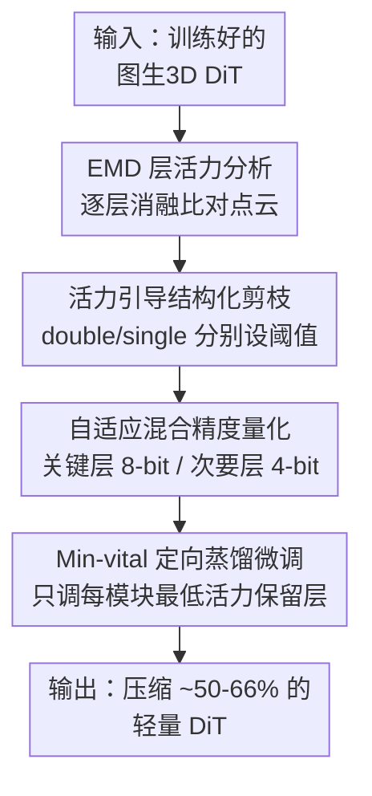

# Vitality-Aware Compression for Efficient Image-to-Shape Diffusion Transformers

**会议**: ECCV 2026  
**arXiv**: [2607.00382](https://arxiv.org/abs/2607.00382)  
**代码**: 无  
**领域**: 3D视觉  
**关键词**: 图生3D、Diffusion Transformer、结构化剪枝、自适应量化、层重要性

## 一句话总结
针对图生 3D 形状的 Diffusion Transformer（DiT），本文用一个基于 Earth Mover's Distance 的「层活力（vitality）」指标度量每层对几何合成的贡献，据此做结构化剪枝 + 分层混合精度量化 + 只微调最低活力层的定向蒸馏，在 Step1X-3D / Hunyuan3D 等 SOTA 模型上把 backbone 压缩最多 66% 而几乎不掉几何保真度。

## 研究背景与动机
从单张图生成几何一致的 3D 网格这几年进步飞快，主干已经从早期的 GAN 先验、大重建模型（LRM）演进到 3D 原生的 Diffusion Transformer 与 flow-matching 框架，能从一张图恢复出跨视角一致的网格。但代价是模型越堆越大——这些 pipeline 里的 DiT 主干光参数就常常超过 2.5 GB，在实时、端侧、显存受限的场景里几乎跑不动。图像和视频扩散模型的压缩已经被研究得很透，可那些方法吃的是空间/时间冗余，直接搬到 3D 上会翻车：论文里展示了把为图像生成设计的 TinyFusion、Diff-Pruning 之类方法套到形状生成 DiT 上，会出现结构坍塌、拓扑扭曲、细节丢失这种严重的几何退化。

问题的根子在 2D 与 3D 生成的本质差异。图像压缩只要保住视觉观感就行，但 3D 模型必须在所有视角下维持全局一致的几何，去噪过程里一点点扰动都可能沿着采样路径放大成结构性伪影。与此同时，现有的 3D 效率工作（如 Turbo3D、FlashVDM）几乎都盯着推理加速，而不是从根本上压缩 backbone 的参数量与位宽，对显存瓶颈帮助有限。也就是说，「保住几何保真度」这个约束下的 3D DiT 物理压缩，是一块此前没人系统做过的空白。

作者的切入点来自一个观察：文生图、文生视频领域已经发现 DiT 里只有一小部分层真正决定输出质量，但那些工作衡量的是感知编辑或图像域质量，而非「永久性结构压缩下的几何保真」。于是本文干脆直接用逐层消融来度量每层对 3D 合成质量的贡献——把某层去掉后生成的点云，和完整模型点云用 EMD 算距离，距离越大说明这层越关键。**本文的核心 idea 是：用一个 EMD 层活力指标把 3D DiT 的层按对几何的贡献分成「关键 / 冗余」，据此对 double-block 与 single-block 分别设阈值做结构化剪枝、按活力分配 8/4-bit 混合精度量化，再只对每个模块里活力最低的保留层做定向蒸馏微调，从而把主干物理压缩到近半而几乎不损几何质量。**

## 方法详解

### 整体框架
输入是一个已经训练好的图生 3D DiT（如 Step1X-3D、Hunyuan3D 2.0/2mini），输出是一个参数量和位宽都大幅缩小、但几何合成质量与原模型基本持平的轻量模型。这类 DiT 主干把层分成两类模块：double block 里噪声流和条件 token 两条模态流各自保留、只通过共享注意力交互；single block 则在模态融合后对统一的隐表示做处理——两者对几何的敏感度模式不同，压缩时必须分开对待。

整个流程是一条三阶段串行 pipeline：先做逐层活力分析（Sec. 3.1），对每一层跑一次「消融—比对点云」拿到活力分数，识别出可以安全砍掉的冗余层；再用活力分数同时指导结构化剪枝和分层自适应量化（Sec. 3.2），砍掉低活力层、给关键层留 8-bit、给次要层压到 4-bit；最后对压缩后的模型做定向蒸馏微调（Sec. 3.3），只更新每个模块里活力最低的那个保留层，让学生尽量复现教师（原模型）的行为，把压缩带来的性能缺口补回来。

### 关键设计

**1. EMD 层活力指标：用最优传输而非最近邻来判断哪层对几何是命门**

现有 T2I 工作衡量层重要性用的是 DINO 感知距离，可它是给图像域设计的，无法直接告诉你去掉某层后 3D 几何塌没塌。本文的做法是：给定同一张条件图 $y$，分别用完整模型 $\theta_{\text{full}}$ 和去掉第 $l$ 层的模型 $\theta_{-l}$ 各生成一组点云，用两组点云之间的距离作为这层的活力分数。关键在于用哪种距离——作者选了 Earth Mover's Distance 而不是常见的 Chamfer Distance：

$$\text{vitality}(l)=\mathbb{E}_{y\sim\mathcal{D}}\left[\min_{\Gamma\in\mathcal{P}_{n}}\frac{1}{n}\sum_{i=1}^{n}\sum_{j=1}^{n}\Gamma_{ij}\bigl\|q_{\theta_{\text{full}}}^{(i)}(y)-q_{\theta_{-l}}^{(j)}(y)\bigr\|_{2}\right]$$

其中 $\mathcal{P}_n$ 是所有 $n{\times}n$ 置换矩阵的集合，也就是要求两组点之间是一一对应。选 EMD 的理由很实在：Chamfer 靠最近邻对应，只反映局部表面精度，对采样密度极其敏感；而 EMD 算的是两组点集之间的最优传输代价，得到一对一对应，能捕捉整体形状分布，因此能检测出「某层负责几何一致性、去掉后整个形状发生平移/不对称/大尺度错位」这种全局结构畸变，而且对稀疏或不均匀采样区域偏差更小。附录里的鲁棒性实验也印证了这点——把采样点数从 10k 换到 5k，EMD 的偏差不超过 5%，而 Chamfer 在深层可以飘到 40%–50%。

**2. block-type 分离阈值的结构化剪枝：double 与 single 块不能一把尺子量**

拿到活力分数后就能剪枝：分数高于阈值 $\tau$ 的层判为关键保留，其余砍掉。但作者发现对 double-block 和 single-block 用同一个阈值会掉点——附录里展示了在 Hunyuan3D 2.0 上强行用 $\tau_d=\tau_s=0.18$ 会让几何严重扭曲。原因是两类模块承担的角色不同：double block 更管全局连贯性、single block 更管局部细节，敏感度模式天然不一样。于是本文对两类分别设 $\tau_d$、$\tau_s$。阈值怎么定？从活力最低的层开始逐个往上删，同时盯着输出与原模型的距离，一旦出现「质量陡降」的拐点就把阈值卡在那里。附录 Fig. A 显示这个 EMD 准则确实给出了一段平滑的「安全压缩区间」——把剪层数从 2 提到 6，模型体积近似线性缩小而质量几乎不变；一旦砍超过 6 层性能就骤降，说明该指标能干净地区分「安全压缩」与「过度剪枝」两个区域。

**3. 活力驱动的自适应混合精度量化：把比特预算花在几何命门上**

剪枝之后再靠量化进一步压体积。这里同样复用活力分数：把层分成两组，高活力层量化到 8-bit、低活力层压到更激进的 4-bit，同样对 double/single 块用各自的阈值以避免掉点。之所以要「自适应」而非一刀切，是消融里很清楚的现象——全 8-bit 量化质量几乎和原模型持平，但全 4-bit 会明显掉质量（尤其 Hunyuan3D 系列出现坍塌）；自适应混合精度则能在体积比全 8-bit 更小的前提下，把掉点压到最低。因为本文聚焦逐层分析，量化只作用于权重（weight-only），不考虑激活值。一个有意思的副产物：从压缩率反推，这类 FLUX 风格 DiT 里 FFN 只占总参数约 40%–45%，而非标准 Transformer 里常见的 ~66%，因为它的注意力组件更重——这解释了为什么纯剪 FFN 的方法（Diff-Pruning）在这里压不动。

**4. Min-vital 定向蒸馏微调：只调最不重要的保留层，反而更稳**

剪枝加量化后模型和原模型仍有行为差距，需要微调找回来。作者设计的是一个让学生模仿教师 ODE 路径的蒸馏损失：沿着完整模型的 flow 采样轨迹，在每个时间步 $t$ 让压缩后的学生 $v^c$ 去匹配教师 $v^f$ 在相同 latent 和条件下的预测，且条件与无条件两路都算：

$$\mathcal{L}_{\text{Distill}}(\theta_c)=\tfrac{1}{2}\bigl\|v^c(z^f_t,t,y)-v^f(z^f_t,t,y)\bigr\|_2^2+\tfrac{1}{2}\bigl\|v^c(z^f_t,t,\varnothing)-v^f(z^f_t,t,\varnothing)\bigr\|_2^2$$

其中 $z^f_t$ 是从完整模型采出的 $t$ 时刻 latent，$\varnothing$ 表示空条件；每个时间步优化一步后，用教师预测做 flow 采样跳到 $t-1$。真正反直觉的点在「调哪些层」：微调全部保留的关键层不仅算力浪费，有时还会让学生越调越偏离教师、反而掉点。所以本文提出选择性微调——只挑每个 DiT 模块里活力分数最低的那个保留层（记作 Min-vital）来更新，避免过度扰动那些真正扛几何的关键层。附录消融证实了这个选择：全量微调训练会失稳，只调 Max-vital 层又补不回细节，唯有只调 Min-vital 层既稳定又能恢复到接近原模型的质量。

### 损失函数 / 训练策略
训练目标就是上面的蒸馏损失 $\mathcal{L}_{\text{Distill}}$，属于「学生复现教师 ODE 路径」而非标准 flow matching。数据用 Objaverse 渲染图的 10K 子集。Step1X-3D 用学习率 $10^{-8}$ 训 30K 步（2×A100，约 22h），Hunyuan3D 2.0/2mini 用 $10^{-4}$ 训 20K 步。阈值按模型手调，例如 Step1X-3D 取 $\tau_d=0.17$、$\tau_s=0.165$，量化分界为 double 0.25 / single 0.185；Hunyuan3D 2mini 因每个 double 层都关键而不剪 double、几乎全设 8-bit。

## 实验关键数据

### 主实验
在三个 SOTA 图生 3D 模型上做压缩，用 Uni3D-I / OpenShape-I 两个图像–3D 联合嵌入相似度衡量对齐质量，同时报模型体积、TFLOPs、延迟、峰值显存（Objaverse 采样的 200 对图–形状；只统计 backbone 参数）。

| 模型 | Uni3D-I ↑ | OpenShape-I ↑ | Size(GB) ↓ | Latency(s) ↓ | VRAM(GB) ↓ |
|------|-----------|---------------|------------|--------------|------------|
| Step1X-3D | 0.3586 | 0.1480 | 2.452 | 6.23 | 2.718 |
| Step1X-3D + Ours | 0.3580 | 0.1489 | **0.843** (−65.63%) | 2.78 | 1.206 |
| Hunyuan3D 2.0 | 0.3582 | 0.1487 | 2.704 | 5.85 | 2.463 |
| Hy3D 2.0 + Ours | 0.3601 | 0.1491 | **0.909** (−66.37%) | 3.90 | 1.761 |
| Hy3D 2mini | 0.3614 | 0.1490 | 1.042 | 1.28 | 1.224 |
| Hy3D 2mini + Ours | 0.3608 | 0.1484 | **0.578** (−44.50%) | 1.14 | 1.135 |

三个模型体积分别砍掉 65.63% / 66.37% / 44.50%，Uni3D-I / OpenShape-I 几乎不变（个别甚至微升），TFLOPs、延迟、显存全线下降。压缩后的模型质量也超过 Craftsman3D、TRELLIS 等近期 DiT 基线以及 Splatter Image、TripoSR、LGM 等前馈/扩散基线。用户研究里，压缩版在几何保真与整体质量两项上都做到与原模型几乎不可区分。

对比现有扩散压缩方法（同一 3D 主干、公平比较）：

| 方法 | Step1X-3D Rate | Hy3D 2.0 Rate | Hy3D 2mini Rate |
|------|----------------|---------------|-----------------|
| TinyFusion | 49.31% | 49.82% | 49.52% |
| Diff-Pruning (60%) | 28.71% | 28.92% | 28.89% |
| **Ours** | **65.63%** | **66.37%** | **44.50%** |

TinyFusion 约 50% 压缩但质量恢复不了；Diff-Pruning 只剪 FFN，压缩率天花板低（因 FFN 只占 40–45% 参数）。本文压缩率更高且保质量。

### 消融实验
逐组件加上去（Step1X-3D 为例）：

| 配置 | Uni3D-I | OpenShape-I | Size(GB) | 说明 |
|------|---------|-------------|----------|------|
| Original | 0.3586 | 0.1480 | 2.452 | 全参原模型 |
| + Pruning (random) | 0.0829 | 0.0375 | 1.123 | 随机剪枝，质量崩 |
| + Vitality-Aware | 0.3584 | 0.1472 | 1.123 | 只剪非关键层，几乎不掉 |
| + Quantization (4b) | 0.3489 | 0.1466 | 0.803 | 全 4-bit，Hunyuan 掉点明显 |
| + Adaptive Quant. | 0.3579 | 0.1478 | 0.843 | 混合精度，体积更小掉点更少 |
| + Fine-tuning (Ours) | 0.3580 | 0.1489 | 0.843 | 定向微调补回，近乎原模型 |

微调策略消融（Hunyuan3D 2.0）：全量微调 Uni3D-I 崩到 0.1766、V-IoU 仅 28.69；只调 Max-vital 层 0.3541 / V-IoU 61.50；Ours（Min-vital）0.3601 / V-IoU 72.04，最稳最好。

### 关键发现
- 贡献最大的是「活力感知剪枝」：随机剪枝直接把 Uni3D-I 从 0.3586 打到 0.0829，而按活力剪枝几乎不掉——证明大量层确实是冗余的，关键只在少数层。
- double / single 块必须分开设阈值，共用阈值会让几何严重扭曲，这是 3D 与 2D 压缩最不一样的地方。
- 微调「只调最低活力层」反而比「调全部关键层」更稳更好：动关键层容易让学生偏离教师；Step1X-3D 因关键/非关键层区分极清晰，剪枝后微调几乎没起作用（说明剪枝本身已足够干净）。
- 量化主要省显存，延迟收益有限（低比特推理速度高度依赖硬件/kernel 实现）。
- 方法与推理加速正交：叠加 guidance/step 蒸馏可在结构压缩 2.5× 省显存的基础上再拿到最多 13.5× 的推理加速而不额外占显存。

## 亮点与洞察
- 把「层重要性」这件事从图像域搬到 3D 域时换了度量工具（DINO → EMD）：EMD 的一一对应特性天然贴合「全局几何一致性」这个 3D 独有约束，比 Chamfer 更能抓大尺度错位，这个「指标要匹配任务的失败模式」的思路可迁移到任何 3D 质量评估。
- 「Min-vital 微调」是最反直觉也最巧的一招：常识会去微调最重要的层，本文却证明微调最不重要的保留层才稳——因为关键层一动就破坏原模型行为，蒸馏的目标恰恰是别动它们。
- 整套方法是纯 plug-and-play 的后处理，不改架构、不重训，对三个不同 pipeline（含结构/纹理解耦的 Step1X/Hunyuan 与联合建模的 TRELLIS）都适用，工程落地价值高。
- 「block-type 分离阈值」提醒了一个易忽视的点：DiT 里不同类型的块承担的语义角色不同（全局连贯 vs 局部细节），压缩策略应当分类型定制而非全局统一。

## 局限与展望
- 量化只做到 4-bit，更极端的 1–2 bit 未探索（需要专门硬件级实现支持）。
- 压缩模型继承原架构的几何/拓扑局限——蒸馏目标是「保持」原模型行为，所以原模型在扁平/风格化插画上重建不准的毛病，压缩版照样有。
- 活力阈值目前每个架构手动调，泛化性受限；作者计划用跨架构的相对活力统计来自动化，以保住 plug-and-play 特性。
- 对 TRELLIS 只压了管几何的 Sparse Structure Flow，管纹理的 SLAT Flow 因几何指标（EMD/CD）几乎不变、只有 LPIPS 敏感而留作未来工作——说明纯几何指标不足以指导纹理相关层的压缩，需要联合几何+外观的准则。
- 量化的延迟收益偏弱，需要更优化的 GPU 感知 kernel 才能把体积优势转成速度优势。

## 相关工作与启发
- **vs 图像扩散压缩（TinyFusion / Diff-Pruning）**：它们吃空间冗余、以保视觉观感为目标，本文指出「保观感 ≠ 保几何」，直接套到 3D 会结构坍塌；本文以 EMD 几何度量为准则，压缩率更高且保几何。
- **vs 3D 效率方法（Turbo3D / FlashVDM）**：它们只加速推理、不压 backbone，对显存瓶颈帮助有限；本文是首个系统性物理压缩 3D DiT 参数量+位宽的工作，且与这类加速方法正交可叠加。
- **vs T2I/T2V 层活力分析（Stable Flow / TV-LiVE）**：它们用感知距离衡量层对图像域质量的贡献、用于免训练编辑；本文换成 EMD 度量对 3D 几何的贡献、并把它用于永久性结构压缩（剪枝+量化+蒸馏）这一全新场景。

## 评分
- 新颖性: ⭐⭐⭐⭐ 首个系统性物理压缩图生 3D DiT 的工作，EMD 活力指标与 Min-vital 微调都有巧思，但组件本身（剪枝/量化/蒸馏）是成熟技术的组合。
- 实验充分度: ⭐⭐⭐⭐⭐ 三个 SOTA 模型 + 用户研究 + 与图像压缩方法对比 + 大量附录消融（指标鲁棒性、阈值分析、微调策略、TRELLIS 泛化），非常扎实。
- 写作质量: ⭐⭐⭐⭐ 动机清晰、图表丰富、消融链路完整；个别公式与表述略有笔误但不影响理解。
- 价值: ⭐⭐⭐⭐ plug-and-play、免重训、跨模型通用，直接缓解 3D 生成的显存瓶颈，落地价值高。

<!-- RELATED:START -->

## 相关论文

- [\[CVPR 2026\] FlashVGGT: Efficient and Scalable Visual Geometry Transformers with Compressed Descriptor Attention](../../CVPR2026/3d_vision/flashvggt_efficient_and_scalable_visual_geometry_transformers_with_compressed_descr.md)
- [\[CVPR 2026\] Sculpt4D: Generating 4D Shapes via Sparse-Attention Diffusion Transformers](../../CVPR2026/3d_vision/sculpt4d_generating_4d_shapes_via_sparse-attention_diffusion_transformers.md)
- [\[CVPR 2025\] 4DGC: Rate-Aware 4D Gaussian Compression for Efficient Streamable Free-Viewpoint Video](../../CVPR2025/3d_vision/4dgc_rate-aware_4d_gaussian_compression_for_efficient_streamable_free-viewpoint_.md)
- [\[CVPR 2026\] Block-Sparse Global Attention for Efficient Multi-View Geometry Transformers](../../CVPR2026/3d_vision/block-sparse_global_attention_for_efficient_multi-view_geometry_transformers.md)
- [\[AAAI 2026\] GaussianImage++: Boosted Image Representation and Compression with 2D Gaussian Splatting](../../AAAI2026/3d_vision/gaussianimage_boosted_image_representation_and_compression_with_2d_gaussian_spla.md)

<!-- RELATED:END -->
