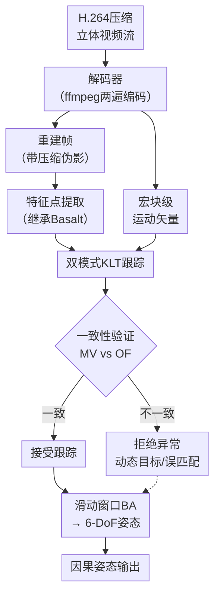

# VOCA: Visual Odometry with Codec Awareness

**会议**: ECCV 2026  
**arXiv**: [2607.00189](https://arxiv.org/abs/2607.00189)  
**代码**: 无（项目页面 [https://tum-vision.github.io/voca](https://tum-vision.github.io/voca)）  
**领域**: 3D视觉  
**关键词**: 视觉里程计, 视频压缩, KLT跟踪, 运动矢量先验, 码流感知

## 一句话总结
VOCA利用H.264视频编码过程中内置的运动矢量作为KLT光流跟踪的初始化先验，在Basalt框架上实现了对百倍压缩视频的高精度因果视觉里程计，在EuRoC、TUM-VI和MSD三个数据集上全面超越了现有方法。

## 研究背景与动机

相机姿态估计是空间智能系统的核心基础组件，从混合现实头显到自主无人机、从机器人助手到自动驾驶，每一类设备都依赖视觉里程计（Visual Odometry）或SLAM来实时感知自身的运动轨迹。然而，VO/SLAM社区自二十年前起就默认输入是原始未压缩图像——EuRoC、TUM-VI等标准基准数据集无一例外地遵循这一惯例。真实世界的摄像头系统则完全不同：一条640×480分辨率、30fps的立体灰度视频流每分钟产生超过1 GB的数据，存储和带宽的硬约束使得实际系统几乎无一例外地采用视频压缩（H.264、AV1、VP9等）。有损压缩引入的量化伪影——模糊、锯齿状边缘、对比度降低——直接破坏了传统跟踪算法赖以为生的光度一致性假设（photometric constancy），特征匹配和光流估计的精度随之大幅下降。

这一"压缩-分析"（compress-then-analyze）范式下的精度损失长期被VO社区忽视。此前唯一的针对性工作是MoV-SLAM，它从H.264宏块（macroblocks）中提取EXPRESS特征用于描述子匹配，但该方法高度依赖特定编码器的宏块结构且不支持鱼眼相机，实用范围极为有限。更本质的矛盾在于：视频编码器在追求率失真最优时，内部产生的运动矢量（motion vectors）本质上是对光流的粗粒度近似，但编码器可以自由选择任意视觉相似的区域作为预测参考，并不关心该偏移是否反映物理场景运动。如何从编码噪声中提取出真正可用于跟踪的运动线索，是设计码流感知VO系统的核心挑战。

VOCA的作者们注意到一个此前被忽略的机会：H.264的宏块级运动矢量虽然噪声大、仅平移、且不一定对应真实场景运动，但它们覆盖了远超图像金字塔恢复范围的位移量——恰好补足了纯KLT跟踪在大位移场景下的短板。更重要的是，这些运动矢量作为解码器的标准输出产物，获取成本为零。**核心idea：将H.264解码器中免费获得的宏块级运动矢量作为KLT跟踪的平移初始化先验，配合双模式（纯KLT vs 运动矢量先导KLT）并行跟踪与一致性验证来抑制动态目标和误匹配导致的异常跟踪，再通过I帧桥接策略维持帧间先验的连续性，在经典VO系统Basalt的框架上实现了对百倍压缩视频的高精度、高鲁棒性因果姿态估计。**

## 方法详解

### 整体框架

VOCA建立在经典VO系统Basalt之上，其核心改动集中在特征跟踪前端，后端滑动窗口束调整（sliding window bundle adjustment）保持不变。输入为H.264压缩的立体视频流，输出为因果的6-DoF相机姿态（仅使用过去帧信息）。系统流程如下：解码器同时输出重建帧（含压缩伪影）和每个宏块级的运动矢量；从当前帧提取特征点后，对每个特征点运行两条并行的KLT跟踪流水线——一条使用运动矢量作为平移初始化（MV模式），另一条使用传统的前一帧像素位置初始化（OF模式）；两条流水线成功后进行一致性验证，结果一致的跟踪被接受，不一致的视为潜在异常跟踪被拒绝；最终通过的对应关系进入滑动窗口BA求解姿态。

### 关键设计

**1. 运动矢量作为KLT初始化先验：用编码器的率失真最优解为跟踪提供大位移起点**

标准KLT跟踪使用前一帧特征点的像素坐标作为当前帧搜索的初始化位置，这在相机运动平缓时足够有效，但一旦真实位移超出图像金字塔的搜索半径，优化就会落入局部极小——这个问题在快速旋转或加速运动的压缩视频中尤为突出。H.264编码器在计算运动矢量时，对每个16×16宏块独立搜索率失真最优的参考块，产生一个指向参考帧的位移向量$\mathbf{d}_k$。由于$\mathbf{d}_k$指向过去方向，而光流$\mathbf{v}$指向未来方向，取反后的$-\mathbf{d}_k$就构成了对光流$\mathbf{v}$的粗粒度近似。Basalt的KLT模块优化SE(2)变换$\mathbf{T}_{\text{2D}} = (\mathbf{R}_{\text{2D}}, \mathbf{t}_{\text{2D}})$来最小化归一化光度误差——VOCA将平移分量初始化为$-\mathbf{d}_k$，旋转分量保持单位阵，让KLT优化器从这一远更接近真实解的起点继续精化。实验显示，大部分运动矢量距离最终收敛的光流解仅1-2像素，而传统的同像素先验（previous-pixel prior）在大位移场景下可能偏离数十像素，直接导致跟踪失败。

**2. 双模式并行跟踪与一致性验证：用两条独立流水线的分歧检测动态目标和误匹配**

运动矢量先验并非万灵药。编码器可能在纹理匮乏区域（如白墙或天空）将任意视觉相似的宏块匹配为参考，产生虽然像素匹配但方向完全错误的运动矢量；也可能正确跟踪了场景中的动态目标（如挥手的手臂），但这些特征的大位移在全局BA中反而会造成轨迹漂移。VOCA的关键设计在于同时独立运行两条跟踪流水线：MV模式（运动矢量初始化）和OF模式（传统同像素初始化）。如果一个特征只在一条流水线中被成功跟踪，直接接受——这说明另一条遇到了搜索失败但这条成功了。如果两条都成功，则检查两个结果的平移向量差异是否在预设阈值内：差异小说明两条独立搜索路径收敛到了相同的位置，跟踪高度可靠；差异大说明至少一条流水线出现了异常，两者都拒绝。这一设计本质上是用两个独立假设（编码器率失真最优 + KLT光度最优）的交叉验证来筛选异常，不需要任何监督数据或预训练模型。

**3. I帧桥接：在无运动矢量的关键帧间依靠恒速假设维持先验连续性**

H.264码流中的I帧（intra frame，帧内编码帧）完全采用帧内预测，不包含任何运动矢量。这是系统性的挑战——因为I帧通常出现在场景内容剧烈变化的时刻（编码器判定帧间差异太大、帧间预测效率低），而这恰恰是建立特征对应最困难的时机。VOCA的解决方案简洁而实用：对I帧直接复用上一个P帧的解码运动矢量$\mathbf{d}_k$，假设在相邻帧间运动近似恒定。尽管恒速假设非常简陋（尤其在场景切换时），但实验表明它在大多数情况下仍能将KLT优化器置于收敛域内。原因在于编码器在I帧之后通常会立即插入P帧以恢复帧间预测，典型的I帧间隔在数十帧量级（如本文使用的keyint=1000结合场景切换检测），恒速假设在这个短暂窗口内提供的先验通常优于完全无先验的盲搜索。

### 损失函数 / 训练策略

VOCA完全不涉及任何可学习组件，无需训练。全部流程基于两个经典优化：KLT跟踪阶段最小化归一化光度误差的SE(2)非线性最小二乘，和滑动窗口束调整阶段的最小化重投影误差。与Basalt的区别仅在于前端改动的三个超参数：放宽前向-后向一致性阈值（补偿压缩噪声导致的高误匹配率）、增大KLT patch尺寸（捕获更多图像结构来提高鲁棒性）、以及在跟踪前插入运动矢量初始化和双模式并行逻辑。

## 实验关键数据

### 主实验

| 数据集 | 指标 | VOCA | Basalt（基线） | OKVIS2 | ORB-SLAM3 | 提升（vs Basalt） |
|--------|------|------|----------------|--------|-----------|-------------------|
| EuRoC | ATE (cm) ↓ | 17.35 | 19.24 | 22.18 | 28.59 | ~10% |
| EuRoC | RTE (cm) ↓ | 1.669 | 1.947 | 3.084 | ∞ | ~15% |
| TUM-VI | ATE (cm) ↓ | 9.64 | 20.34 | 20.52 | 8.72 | ~53% |
| TUM-VI | RTE (cm) ↓ | 0.815 | 2.820 | 2.120 | ∞ | ~71% |
| MSD | ATE (cm) ↓ | 4.46 | 5.51 | 38.17 | R | ~19% |
| MSD | RTE (cm) ↓ | 0.755 | 1.478 | 5.223 | R | ~49% |

（注：ATE为SE3对齐后的绝对轨迹误差——反映全局一致性；RTE为Δ=6帧的相对轨迹误差——反映局部平滑度，对混合现实体验尤为关键。∞表示序列发散；R表示频繁重置。Basalt的MSD基线已包含VOCA对Basalt的通用改进——放宽一致性阈值和增大patch，确保MV先验的增量贡献被隔离评估。DROID-SLAM作为学习型SLAM基准在附录中单独对比。）

### 消融实验

| 配置 | EuRoC ATE | EuRoC RTE | TUM-VI ATE | TUM-VI RTE | 说明 |
|------|-----------|-----------|------------|------------|------|
| Basalt原版 | 19.50 | 1.964 | 18.00 | 2.518 | 完全无运动矢量先验 |
| (A) OF⇒MV回退 | 17.20 | 1.871 | 10.40 | 1.380 | 纯KLT优先，失败回退到MV |
| (B) MV⇒OF回退 | 18.40 | 2.044 | 10.70 | 1.121 | MV优先，失败回退到纯KLT |
| (C) MV\|\|OF并行 | 18.70 | 1.710 | 9.10 | 0.919 | 并行跟踪+一致性验证 |
| (C) + I帧桥接（完整） | 18.00 | 1.714 | 9.20 | 0.829 | 完整VOCA |

### 关键发现
- **双模式并行策略(C)显著优于串行策略(A)(B)**：在TUM-VI上，(C)的ATE（9.10）远优于先OF后MV（10.40）和先MV后OF（10.70）。原因在于串行策略无法检测动态目标和误匹配导致的异常——只有并行独立运行两条流水线再交叉验证，才能区分"真正的大位移"和"错误的运动矢量"
- **I帧桥接在TUM-VI上效果最明显**：添加I帧桥接后TUM-VI的RTE从0.919降至0.829，因为手持相机的运动模式更随机，I帧出现后恒速假设带来的先验价值更大
- **高压缩率下的稳定性是最大亮点**：在~100倍压缩（500kbps）下VOCA的RTE基本不变，而Basalt的RTE在TUM-VI上从约1.0退化到约2.8——说明运动矢量先验对压缩伪影有天然抗性，因为编码器在低码率下反而会分配更多比特给运动矢量以确保帧间预测质量
- **与DROID-SLAM的对比揭示VO设计空间**：在常规透视相机（EuRoC）上DROID-SLAM的ATE更优（9.92 vs 17.00），但在鱼眼相机（TUM-VI）上VOCA大幅领先（9.20 vs 45.58），说明学习型SLAM对非理想相机模型的鲁棒性不如基于先验和经典优化的混合方案

## 亮点与洞察
- **零成本的先验信号**：运动矢量是编解码器标准流程的嵌入式产物，不增加任何传输或计算开销——VOCA相当于从解码器中免费获取了大位移初始化的信号，这在嵌入式系统（无人机、AR眼镜）上尤为重要
- **"先验+优化"的范式胜利**：VOCA最重要的insight不是提出了新算法，而是展示了"编码器副产品作为经典跟踪初始化先验"这条路径的巨大价值——不替代KLT、不添加学习模块，仅仅改变初始化策略就显著提升了压缩视频上的跟踪鲁棒性
- **双模式一致性验证的通用性**：这一设计本质上是一种无监督的交叉验证方法，可推广到任何具备"粗粒度近似"和"精粒度优化器"的系统中——如深度估计中的多尺度先验融合、光流估计中的不同初始化方案验证
- **压缩即互联网规模的感知信号源**：VOCA使得百倍压缩视频上的VO达到实用水平，意味着互联网上现存的海量压缩视频可以作为下游视觉和机器人任务的感知训练源——这可能大幅改变自监督VO的训练数据范式

## 局限与展望
- VOCA目前仅支持H.264（附录提供了AV1的初步扩展作为概念验证），在不同编码器（HEVC、VP9、VVC）上的表现尚未系统验证——不同编码器的运动矢量质量和密度差异可能影响泛化
- 在MSD的Odyssey+低质量摄像头子集上改进幅度有限，说明当原始图像信噪比本身就低时（VGA灰度摄像头），压缩噪声和传感器噪声叠加，运动矢量的先验价值被大幅削弱
- 与端到端VO方法（VGGT、MapAnything、AnyCam）在压缩视频设置下的系统对比是明显的空白——这些方法虽然计算量大且非因果，但在极端压缩下可能展现出不同的退化曲线
- 运动矢量质量依赖编码器配置（搜索范围merange、子像素精度subme、参考帧数ref），在消费级默认编码配置（如手机实时编码）与本文精心配置的两遍编码之间可能存在性能差距

## 相关工作与启发
- **vs MoV-SLAM**: 唯一同样利用H.264编码信息的VO方法。MoV-SLAM提取宏块结构作为特征（EXPRESS），VOCA则复用运动矢量作为跟踪先验。MoV-SLAM无法支持鱼眼相机且在MSD上性能极差（几乎所有序列发散），VOCA的KLT框架在传感器和运动模式上更具通用性
- **vs Basalt**: VOCA的直接基线和承载框架。VOCA仅在前端引入三个改动（MV先验、双模式验证、I帧桥接），未改变后端BA结构，就在三个数据集上实现了RTE 15%-71%的相对降幅——凸显了前端初始化策略对VO系统整体性能的决定性影响
- **vs DROID-SLAM**: 学习型SLAM的代表。在常规透视加压缩场景下DROID-SLAM凭借全局优化优势领先，但鱼眼加压缩场景下VOCA以无GPU的经典方法大幅反超。这提醒社区：在非理想传感器设置下，经典的几何先验加优化方法比纯粹的端到端方法更实用

## 评分
- 新颖性: ⭐⭐⭐⭐ [将视频编码器中长期被忽视的运动矢量作为KLT初始化先验——洞察简洁但此前无人系统性地实现。双模式一致性验证和I帧桥接两个配套设计体现了工程上的完备思考]
- 实验充分度: ⭐⭐⭐⭐⭐ [三个数据集（无人机/手持/VR头盔全面覆盖）、五种对比方法（含DROID-SLAM）、多压缩率扫描、四类MSD设备分拆评估、AV1原型扩展——实验设计完整，还提供了可复现的ffmpeg编码命令和metrics推导]
- 写作质量: ⭐⭐⭐⭐ [动机清晰、方法自洽、实验编排逻辑性强（从主结果到消融到压缩率扫描到DROID对比）。不足在于对Basalt已有组件的描述偏少，非VO专家可能需要查阅Basalt原文才能完全理解后端BA细节]
- 价值: ⭐⭐⭐⭐⭐ [视频压缩是所有真实世界VO系统不可回避的环节，但社区长期忽略。VOCA给出了简单（三处改动）、高效（零额外开销）、可复现（基于开源Basalt）的解决方案，且RTE提升在AR/VR/无人机等对局部平滑度敏感的应用中有直接价值]

<!-- RELATED:START -->

## 相关论文

- [\[CVPR 2026\] OpenVO: Open-World Visual Odometry with Temporal Dynamics Awareness](../../CVPR2026/3d_vision/openvo_open-world_visual_odometry_with_temporal_dynamics_awareness.md)
- [\[ECCV 2026\] FiCA: Feed-forward Instant Gaussian Codec Avatars from a Single Portrait Image](fica_feed-forward_instant_gaussian_codec_avatars_from_a_single_portrait_image.md)
- [\[ECCV 2026\] Audio-Visual Camera Pose Estimation with Passive Scene Sounds and In-the-Wild Video](audio-visual_camera_pose_estimation_with_passive_scene_sounds_and_in-the-wild_vi.md)
- [\[ICCV 2025\] Ross3D: Reconstructive Visual Instruction Tuning with 3D-Awareness](../../ICCV2025/3d_vision/ross3d_reconstructive_visual_instruction_tuning_with_3d-awareness.md)
- [\[ECCV 2026\] UniPR-3D: Towards Universal Visual Place Recognition with Visual Geometry Grounded Transformer](unipr-3d_towards_universal_visual_place_recognition_with_visual_geometry_grounde.md)

<!-- RELATED:END -->
