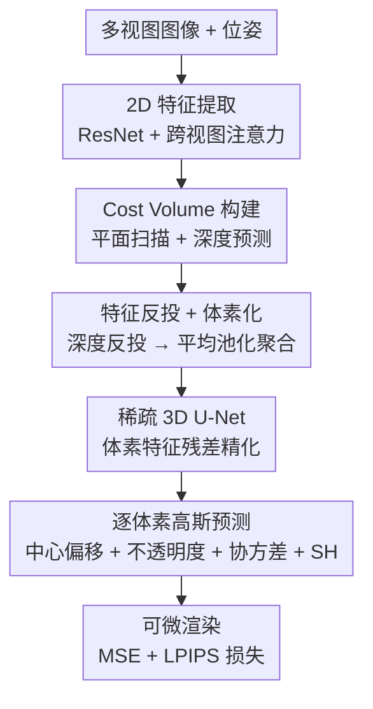

# VolSplat: Rethinking Feed-Forward 3D Gaussian Splatting with Voxel-Aligned Prediction

**会议**: ECCV 2026  
**arXiv**: [2509.19297](https://arxiv.org/abs/2509.19297)  
**代码**: 将开源  
**领域**: 3D 视觉  
**关键词**: 3D 高斯泼溅，前馈重建，体素对齐，稀疏视角新视角合成，体素特征网格  

## 一句话总结
VolSplat 将前馈 3D Gaussian Splatting 的基元预测范式从逐像素对齐改为逐体素对齐：先将多视图 2D 特征通过深度图反投到 3D 空间形成体素特征网格，经稀疏 3D U-Net 残差精化后逐体素预测高斯参数，从而从根本上解耦 3D 表征与输入图像分辨率的刚性绑定，实现自适应高斯密度分配。

## 研究背景与动机

前馈 3D 高斯泼溅（Feed-Forward 3DGS）是近年来新视角合成领域的主流范式之一。与逐场景优化的传统 NeRF 或 3DGS 不同，前馈方法通过一个单次前向传播网络，直接从稀疏多视图中预测 3D 高斯参数，能够在推理时快速重建新场景。其中，以 pixelSplat、MVSplat、DepthSplat 为代表的逐像素对齐方法占据了主导地位：它们的核心思路是从每张视图的 2D 特征图中提取逐像素特征，将其反投到 3D 空间，每个像素对应一个 3D 高斯。这种范式简洁直观，利用成熟的 2D 特征提取器和跨视图匹配机制取得了令人瞩目的效果。

然而，逐像素对齐存在两个根深蒂固的局限。第一，高斯的位置由深度图反投决定，而 2D 图像网格的离散采样使得不同视图在 3D 空间的对应关系依赖于二维特征匹配——这本质上是在解决「从 2D 找 3D 对应」的问题，容易因相机标定误差或深度不准导致多视图对齐不一致，产生大量漂浮物（floaters）。第二，每个输入像素都固定产生一个高斯，高斯基元总数被刚性锁定为 H × W × N（分辨率 × 视图数），无法根据场景复杂度自适应调整：平滑墙面分布了同样多的高斯（冗余），而精细几何结构处却不一定够用。这两个问题本质上都源于「3D 表征被 2D 像素网格绑架」的结构性矛盾。

本文的核心突破在于：与其在 2D 空间中费力地做跨视图匹配再映射到 3D，不如直接进入 3D 空间解决问题。**核心 idea：将前馈 3DGS 的基元对齐范式从像素级改为体素级——先通过深度图反投将多视图 2D 特征聚合到统一的 3D 体素网格中，用稀疏 3D U-Net 在体素空间内做三维上下文精化，再逐体素直接回归高斯参数，使高斯分布由场景的 3D 结构本身而非输入图像分辨率决定。**

## 方法详解

### 整体框架

VolSplat 的流程可概括为四个阶段：2D 特征提取与深度预测 → 3D 体素特征构建 → 稀疏 3D 特征精化 → 逐体素高斯预测与渲染。与逐像素方法在 2D 特征图上直接预测每像素高斯再反投不同，VolSplat 先将特征聚合到 3D 体素网格中，在体素空间内完成三维上下文的推理，再逐体素预测高斯，从而彻底解耦高斯分布与 2D 像素网格。

### 关键设计

**1. 体素对齐的 3D 特征构建：脱离像素网格、统一 3D 空间融合**

逐像素方法在每个视图的 2D 特征图上独立预测高斯，跨视图的 3D 一致性完全依赖 2D 特征匹配——不同视图的同名点在 2D 空间中受投影畸变和离散化误差影响，匹配精度有限。VolSplat 的做法是：先用每个视图预测的深度图将 2D 特征反投到世界坐标系下的 3D 点云，然后将这些散点体素化（按体素大小 vs 取整得到索引），对落入同一体素的所有点特征做平均池化，得到一个稀疏的 3D 体素特征网格 V。这个操作同时完成了三件事——将多视图信息融合到统一的 3D 容器中、自然地解决了跨视图对齐歧义（因为所有视图的特征在同一个 3D 空间里碰撞而非在多个 2D 平面间匹配）、以及将数据从密集的 2D 网格转换为稀疏的 3D 表征（只有被点云占据的体素才存储特征）。体素大小 vs 是关键超参数：过小则丢失空间上下文且计算开销大，过大则几何量化粗糙；最佳折衷点 vs=0.1（对应 PSNR 29.40，604K 高斯/场景）。

**2. 稀疏 3D U-Net 残差精化：在体素空间中施加三维几何先验**

直接从反投得到的初始体素特征预测高斯是不够的，因为初始特征仅由单点聚合而成，缺乏三维邻域上下文。VolSplat 引入了一个稀疏卷积 3D U-Net（基于 MinkowskiEngine），以残差形式对体素特征做精化：网络预测残差场 R，精化特征 V' = V + R。残差设计的优势在于——网络只需学习修正项（微调几何细节和一致性线索），而不必从零重建整个特征内容，训练更稳定且保留了初始体素特征的粗粒度信息。U-Net 的编码器-解码器结构通过跳跃连接实现了多尺度融合，使体素特征能够同时感知局部细节（如边缘、纹理）和全局几何上下文（如平面延拓方向）。消融实验表明，去掉精化模块后 PSNR 从 29.40 降至 27.47（-1.93dB），且换成普通 3D CNN 或去掉残差设计也各有 1.39dB 和 1.48dB 的显著下降，验证了每个设计选择的必要性。

**3. 逐体素自适应高斯预测：让场景复杂度决定高斯密度**

逐像素方法的一个核心问题是高斯密度被输入分辨率锁定。VolSplat 的创新之处在于：每个占据体素独立预测一个高斯（而非每个像素一个），预测的高斯数只取决于场景中实际产生 3D 点的体素数量。具体地，对每个占据体素，网络输出一个 38 维参数向量，包含中心偏移 μ̄、不透明度 ᾱ、协方差 Σ 和球谐颜色系数 c。其中中心偏移经过 sigmoid 约束再映射到体素局部范围：μ = r · (σ(μ̄) − 0.5) + Center，r 为 3 倍体素尺寸，使高斯中心可在体素附近对称移动。这种设计的直接后果是：在平坦墙面等简单区域，体素少、高斯少；在复杂几何结构（如水龙头边缘）处，体素更密集、高斯自然更多。图 7 的可视化对比清晰展示了这种自适应分配——DepthSplat 的高斯分布是均匀的矩形阵列，而 VolSplat 的高斯自然地聚焦在物体边缘。由于体素数量通常远小于 H × W × N，VolSplat 在实际中反而节省了高斯基元（604K vs 百万级），同时推理显存仅 4.65GB，与轻量基线 MVSplat 持平。

### 损失函数 / 训练策略

训练损失为 MSE + LPIPS 的组合：

$$
\mathcal{L} = \sum_{m=1}^{M} \left( \mathcal{L}_{\mathrm{MSE}}(I_{\mathrm{render}}^{(m)}, I_{\mathrm{gt}}^{(m)}) + 0.05 \cdot \mathcal{L}_{\mathrm{LPIPS}}(I_{\mathrm{render}}^{(m)}, I_{\mathrm{gt}}^{(m)}) \right)
$$

遵循 DepthSplat 的训练协议：每样本 6 个输入视图 + 8 个目标视图，AdamW 优化器，余弦学习率衰减，Depth Anything V2 骨干使用较低学习率 2×10⁻⁶，其余层 2×10⁻⁴。在 RealEstate10K 上训练 150K 迭代后，在 ScanNet 上微调，ACID 零样本评测。

## 实验关键数据

### 主实验

**RealEstate10K (室内外房产) — 不同输入视图数**

| 输入视图 | 指标 | VolSplat | DepthSplat (SOTA Pixel-Aligned) | 提升 |
|---------|------|----------|-------------------------------|------|
| 6 视图 | PSNR ↑ | **31.30** | 30.52 | +0.78 |
| 6 视图 | SSIM ↑ | **0.941** | 0.931 | +0.010 |
| 6 视图 | LPIPS ↓ | **0.075** | 0.079 | -0.004 |
| 12 视图 | PSNR ↑ | **29.40** | 28.54 | +0.86 |
| 24 视图 | PSNR ↑ | **27.21** | 26.26 | +0.95 |

**ScanNet (室内场景) — 6 视图**

| 方法 | PSNR ↑ | SSIM ↑ | LPIPS ↓ |
|------|--------|--------|---------|
| FreeSplat | 27.45 | 0.829 | 0.222 |
| WorldMirror | 25.83 | 0.819 | 0.136 |
| **VolSplat** | **28.41** | **0.906** | **0.127** |

**ACID (户外自然场景) — 零样本跨数据集泛化**

| 方法 | PSNR ↑ | SSIM ↑ | LPIPS ↓ |
|------|--------|--------|---------|
| MVSplat | 28.15 | 0.841 | 0.147 |
| DepthSplat | 28.37 | 0.847 | 0.141 |
| **VolSplat** | **32.65** | **0.932** | **0.092** |

### 消融实验

| 配置 | PSNR | SSIM | LPIPS | 说明 |
|------|------|------|-------|------|
| Full model | **29.40** | **0.928** | **0.085** | 完整 VolSplat |
| w/o decoder | 27.47 | 0.901 | 0.102 | 去掉 3D U-Net 精化，性能大幅下降 |
| w/ 3D CNN (非 U-Net) | 28.01 | 0.919 | 0.098 | U-Net 比普通 3D CNN 高出 1.39dB |
| w/o residual | 27.92 | 0.908 | 0.101 | 残差设计有 1.48dB 贡献 |

### 关键发现

- **体素对齐的最大优势在于零样本泛化**：在 ACID 上 VolSplat 以 32.65 PSNR 大幅领先所有基线（第二名 DepthSplat 仅 28.37），说明体素空间的特征融合天然具有更好的域迁移能力，不像像素对齐方法对训练数据的深度分布敏感。
- **高斯自适应分配效果显著**：可视化和密度统计均证实，VolSplat 的高斯分布随场景几何复杂度变化——简单区域稀疏、复杂边缘密集，而像素方法始终是均匀矩形阵列。
- **效率令人惊讶**：尽管引入了 3D 特征处理，VolSplat 的推理时间（0.575s）和显存（4.65GB）与 MVSplat（0.369s / 4.70GB）相当，优于 DepthSplat（0.513s / 8.00GB），说明稀疏数据结构有效控制了计算开销。
- **输入视图越多，体素对齐优势越明显**：从 6 视图到 24 视图，VolSplat 相对最佳基线的 PSNR 增益从 +0.78 扩大到 +0.95dB，表明三维特征网格在高密度输入下能更充分地利用多视图冗余。

## 亮点与洞察

- **「从 2D 到 3D」的范式迁移是核心洞察**：前馈 3DGS 领域的共识一直是「在 2D 特征图上做跨视图匹配再反投」，本文用实验证明直接在 3D 体素空间中做特征聚合和推理可以避免大量对齐错误，这个思路简洁但颠覆了该领域的默认假设。
- **残差精化的设计巧妙**：不直接预测精化特征，而是预测残差，配合 U-Net 的多尺度融合，在保持训练稳定性的同时大幅提升重建质量——这是体素空间特有的优势，在 2D 像素网格中很难设计出类似的三维上下文推理机制。
- **稀疏体素的高效实现**：利用 MinkowskiEngine 实现稀疏 3D 卷积，使得模型在实际推理显存和速度上与纯 2D 方法相当，证明「引入 3D 处理不必然增加开销」，为后续将更复杂的 3D 几何网络引入前馈重建打开了通路。
- **零样本泛化的巨大跃升**：ACID 上 32.65 vs 28.37 的 PSNR 差距是一个很强烈的信号——说明体素特征比像素特征具有更强的域不变性，这对真实应用中的跨域部署是决定性优势。

## 局限与展望

- **静态场景假设**：当前模型假设场景在采集过程中完全静止。Cost Volume 和 3D U-Net 依赖多视图几何一致性，动态物体（如行人、晃动的树叶）会产生鬼影或模糊。将 VolSplat 扩展到动态或可变场景是一个自然的后续方向。
- **依赖深度估计质量**：虽然体素对齐本身缓解了深度不准带来的 floaters，但初始体素特征的构建仍然依赖预测深度图。如果深度估计在极端条件下（如无纹理区域、镜面反射）完全失败，体素网格本身也会出现空洞。
- **大场景拓展**：当前实验主要在室内或以物体为中心的室内外场景（256×256 分辨率），扩展到室外大范围场景（如街景、航拍）时，体素网格的尺寸会快速膨胀，需要在稀疏化策略上进一步优化。

## 相关工作与启发

- **vs pixelSplat / MVSplat / DepthSplat**: 这些方法都是逐像素对齐——在 2D 特征图上每像素预测高斯再反投。VolSplat 反其道而行之，先把特征聚合到 3D 体素网格再预测高斯。区别在于 VolSplat 的 3D 推理在「体素空间内」完成，而非在「2D 像素间」做匹配。
- **vs AnySplat / WorldMirror**: 这些方法在像素对齐基础上加入了后处理（高斯间图网络建模、跨视图高斯融合），但它们仍然以逐像素高斯为前提。VolSplat 从根本上改变了基元生成范式，因此不需要这些后处理步骤，框架更简洁统一。
- **vs EVolSplat**: EVolSplat 在自动驾驶场景中使用了体素特征，但局限于城市街景且需要显式点云作为中间表示。VolSplat 去除了对点云先验的依赖，将体素对齐推广到通用重建场景。

## 评分

- 新颖性: ⭐⭐⭐⭐⭐ 将前馈 3DGS 的核心范式从像素对齐转向体素对齐，思路简洁但颠覆性强，是该领域久被忽视的一个设计空间选择。
- 实验充分度: ⭐⭐⭐⭐⭐ 覆盖 3 个主流基准（RealEstate10K / ScanNet / ACID）、多种输入视图配置（6/12/24）、跨域零样本、消融组件 + 体素尺寸 + 效率对比，非常全面。
- 写作质量: ⭐⭐⭐⭐⭐ 动机明确、分析深入（定量分析了像素对齐的两大局限）、方法叙述清楚、图例对应良好。
- 价值: ⭐⭐⭐⭐⭐ 前馈 3DGS 是当前热点领域，VolSplat 提供了一个简单而有效的替代范式，且零样本泛化优势突出，具有很高的实用和研究迁移价值。

<!-- RELATED:START -->

## 相关论文

- [\[ECCV 2026\] ViewSplat: View-Adaptive 3D Gaussian Splatting for Feed-Forward Synthesis](viewsplat_view-adaptive_3d_gaussian_splatting_for_feed-forward_synthesis.md)
- [\[CVPR 2026\] SR3R: Rethinking Super-Resolution 3D Reconstruction With Feed-Forward Gaussian Splatting](../../CVPR2026/3d_vision/sr3r_rethinking_super-resolution_3d_reconstruction_with_feed-forward_gaussian_sp.md)
- [\[CVPR 2026\] TokenSplat: Token-aligned 3D Gaussian Splatting for Feed-forward Pose-free Reconstruction](../../CVPR2026/3d_vision/tokensplat_token-aligned_3d_gaussian_splatting_for_feed-forward_pose-free_recons.md)
- [\[CVPR 2026\] SparseSplat: Towards Applicable Feed-Forward 3D Gaussian Splatting with Pixel-Unaligned Prediction](../../CVPR2026/3d_vision/sparsesplat_towards_applicable_feed-forward_3d_gaussian_splatting_with_pixel-una.md)
- [\[CVPR 2026\] AnchorSplat: Feed-Forward 3D Gaussian Splatting with 3D Geometric Priors](../../CVPR2026/3d_vision/anchorsplat_feed-forward_3d_gaussian_splatting_with_3d_geometric_priors.md)

<!-- RELATED:END -->
