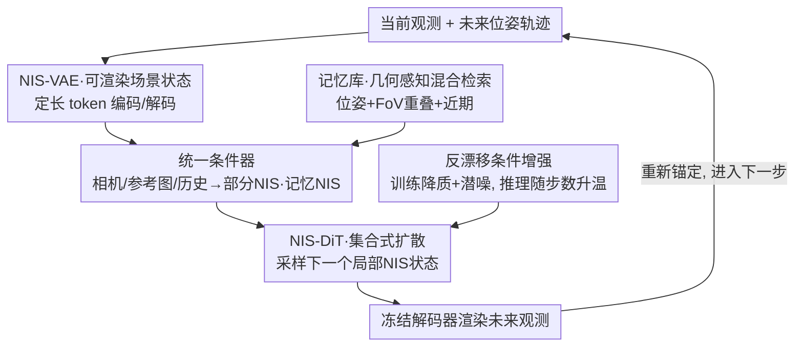

# Walking in the Implicit: Interactive World Exploration via Neural Scene Representation

**会议**: ECCV 2026  
**arXiv**: [2606.30045](https://arxiv.org/abs/2606.30045)  
**代码**: 待确认  
**领域**: 3D视觉  
**关键词**: 世界模型, 相机可控探索, 神经隐式场景, 潜空间扩散, 长程一致性

## 一句话总结
NeuWorld 把交互式世界探索的"rollout 状态"从会不断增长的视频帧潜变量，换成一组定长、可渲染、局部锚定的神经隐式场景（NIS）token，让扩散模型只在这个紧凑状态空间里做转移、再用冻结解码器按查询相机位姿渲染观测，从而在完全从零训练、不借助任何预训练视频大模型的前提下，取得优异的长程位姿一致性、回访一致性与推理效率。

## 研究背景与动机
一个好用的相机可控世界模型，应该让 agent 在场景里自由移动、沿指定相机轨迹合成未来观测，并且当它绕一圈回到原地时看到的东西还是一致的。最近一批交互式系统的做法，是在强大的预训练视频扩散骨干上，用动作或相机轨迹去 steer 它——比如 GameFactory、Navigation World Models、把扩散模型当实时游戏引擎的工作。这些系统能生成视觉上很合理的视频，但它们直接 rollout 出来的是未来帧的观测，等于把"场景状态的转移"和"高频外观的合成"塞进了同一个过程里。这种纠缠让长时程一致性越来越难维持：模型每一步都要同时记住"世界长什么样"和"这一帧该画哪些像素"，误差在自回归里不断累积、漂移。

一条自然的解法是引入显式 3D 结构。NeRF、3D Gaussian Splatting 这类手工场景表示带来了很强的几何归纳偏置，于是有一批基于重建的交互系统反复重建 3D/4D 表示来支持回访。这条路很强，但对"局部相机可控探索"来说，做完整的度量级重建其实比需要的重得多——你只是想在附近走几步，不必把整个场景恢复成带尺度的点云。这里真正缺的是一种介于"帧潜变量"和"显式重建"之间的中间抽象：它得保留足够的几何来支撑一致的视图合成，又要足够轻、适合放进生成式的潜空间转移里。

作者注意到，LVSM、RayZer 这类前馈式新视图合成（NVS）模型恰好提供了这样一个候选：它们把若干带位姿的稀疏视图编码成一组**定长的潜 token**，再用解码器从这组 token 渲染任意目标视图。本文把这组可渲染的 token 集合称作神经隐式场景（Neural Implicit Scene, NIS）。关键的观念转变在于：以往 NIS 只被当作 NVS 的一个"条件"，而本文把它直接当成**交互的状态变量**。**核心 idea 是"Walking in the Implicit"——每一步交互不再 rollout 未来帧的潜变量，而是 rollout 一个局部锚定的 NIS 状态，再由相机位姿去查询它，从而把每一步显式拆成"NIS 空间里的生成式状态转移"和"给定位姿的确定性渲染"两件解耦的事。**

## 方法详解

### 整体框架
NeuWorld 研究的是静态场景下的相机可控交互探索：agent 观察当前带位姿的视图，指定一小段未来相机轨迹，然后合成沿途的未来观测，要求它在长 rollout 和回访时都保持一致。系统把交互状态表示成一个紧凑、定长、局部锚定的 NIS——它覆盖即将走过的这一小段轨迹，随着 agent 前进而被重新锚定（re-anchor）。每一步 rollout 都被拆成两件事：在 NIS 空间里做**随机的状态转移**（采样出下一个局部 NIS），以及从采出来的这个 NIS 做**确定性的位姿渲染**。

具体地，系统有两个部件、分两阶段训练。先训一个 transformer 结构的 VAE（NIS-VAE），学会把稀疏的带位姿上下文视图编码成 NIS token、再解码出查询到的目标视图；训完把它冻住。然后训一个基于集合的扩散 transformer（NIS-DiT），在相机与历史条件下采样下一个局部 NIS 状态。为了让"条件"和"被 rollout 的变量"处在同一模态，NeuWorld 复用同一个 NIS 编码器当**统一条件器**：只给相机的线索、给相机加参考图的线索、检索回来的历史，全都被映射成"部分 NIS"（partial NIS）或"记忆 NIS"token，而不是各自过一套独立的图像/相机/重建编码器。采出的 NIS 最后交给冻结解码器，按对应未来位姿渲染出观测。推理时还配了一个几何感知的检索模块，从历史里挑出真正相关的证据来抑制长程漂移。

### 关键设计

**1. Walking in the Implicit：把 rollout 变量从帧潜变量换成定长可渲染的 NIS 状态**

痛点很直接：直接 rollout 未来帧，会把状态转移和高频外观合成绑死在一起，而且历史缓冲区随时间不断变长，长程一致性越来越难维持。本文的做法是让被 rollout 的东西变成一个**定长**（实验里 $L{=}1024$ 个 token、通道宽 $D{=}64$）、可被相机查询渲染的局部场景状态 NIS。形式上每一步先采样下一个局部状态 $\hat{\mathbf{z}}^{(k)}=\mathcal{G}_\theta(O_k,\mathcal{T}_{\mathrm{fut}}^{(k)},\mathcal{H}_k)$（$\mathcal{G}_\theta$ 是 NIS-DiT 的扩散采样过程），再用冻结解码器从同一个采出的状态渲染多张查询视图 $\hat{I}^{(k)}_j=\mathcal{D}_\phi(\hat{\mathbf{z}}^{(k)},\mathbf{T}^{(k)}_j)$。这样做的妙处在于：状态容量是固定的，不会随时间膨胀；而"从同一个状态渲染多张视图"这件事本身就把一致性暴露了出来——如果这个状态几何自洽，那么它渲出的各个视角自然就互相一致，一致性不再靠模型逐帧"记住"，而是被表示本身兜住了。

**2. NIS-VAE：把稀疏带位姿视图压成可渲染的定长潜场景**

要让 NIS 能当状态用，前提是它既能渲染、又对 transformer 友好。NIS-VAE 沿用 LVSM 式的编码器-解码器：把每个相机位姿转成逐像素的 Plücker 射线嵌入、和 RGB 拼在一起，切成 token 后连同 $L$ 个可学习 query token 一起过 transformer 编码器；输出的 query token 参数化一个对角高斯后验，再重参数化采样得到潜变量 $\mathbf{z}=\mu+\sigma\epsilon,\ \mathbf{z}\in\mathbb{R}^{L\times D}$。这里 $\mathbf{z}$ 是**定长**的 token 集合，和"要渲染多少帧"无关——这正是它能当紧凑状态变量的关键。解码时让目标射线 token 去 attend 这组 NIS token，直接解出 RGB patch。训练用重建、感知、对抗、KL 四项损失

$$\mathcal{L}_{VAE}=\mathcal{L}_{MSE}+\lambda_1\mathcal{L}_{Percep}+\lambda_2\mathcal{L}_{GAN}+\lambda_3\mathcal{L}_{KL}$$

其中作者刻意从确定性潜变量起步、逐步加大随机性来稳住训练。消融（见下）表明这组 NIS token 里编码的不只是外观，而是可解码出几何的——冻住编码器、只训一个深度头做 Depth-Anything-3 蒸馏，就能反投影出有意义的点云布局，这为它作为"几何脚手架条件"埋下伏笔。

**3. 统一条件器：把相机、参考图、历史全映射进同一个 NIS 模态**

以往方法给不同条件配不同编码器——图像走一个 encoder、相机走一个 6DoF encoder、历史走重建模块，条件和被采样的变量根本不在一个空间里，几何脚手架很难对齐。本文的做法是让冻结的 NIS 编码器同时充当条件器：只要相机时，把未来轨迹上的稀疏位姿喂进去、RGB 全置零，得到"纯位姿部分 NIS" $\tilde{\mathbf{z}}_{\mathrm{pose}}=\mathcal{E}(\{(\mathbf{0},\mathbf{T}^{(i)})\})$；相机加参考图时，只在某个索引保留一张参考图、其余置零，得到 $\tilde{\mathbf{z}}_{\mathrm{ref}}$；检索回来的历史帧也照样编码成记忆 NIS $\mathbf{z}_{\mathrm{mem}}=\mathcal{E}(\mathcal{H}_k)$。因为部分 NIS 和去噪目标的 token 形状相同，注入方式极其干净：部分 NIS 直接**通道维拼接**进带噪潜变量 $\mathbf{z}_t^{in}=\mathrm{Concat}(\mathbf{z}_t,\tilde{\mathbf{z}}_{\mathrm{partial}})$，记忆 NIS 则**token 维拼接**追加进去让去噪器 attend。为什么有效：附录用"遮挡重建"给出了直接证据——即便抹掉大部分外观、只留一张参考图，部分 NIS 解码出来仍保留一个相机一致的粗略几何布局（主结构、粗深度序、跨视图对齐都在），不会坍缩成几何上不合理的东西。所以它是个"不坍缩、保几何"的条件，给去噪器一个稳的脚手架，而不会用错误细节把它带偏。

**4. 反漂移条件增强：把训练用的干净历史，故意降质成推理时那种脏历史**

长程交互最要命的 train-test gap 是"历史质量不匹配"：训练时历史来自 ground truth，推理时历史却是模型自己生成的、带模糊、走样和局部漂移。本文在第 3 阶段训练里故意把历史图做随机降质（高斯模糊 / 先下采样再上采样 / 用 VAE 重建替换 / 少量保持干净），编码成条件后再注入潜空间噪声 $\tilde{\mathbf{z}}_{\mathrm{cond}}=\mathbf{z}_{\mathrm{cond}}+\gamma\boldsymbol{\eta}$，增强强度 $\gamma$ 从一个缩放过的 Beta 分布采样。关键一步是把 $\gamma$ 通过 AdaLN 式调制喂给 DiT，让它"知道当前条件有多脏"、从而对不同噪声水平自适应。推理时用同一个噪声水平接口，并让 $\gamma$ 随交互步数 $k$ 线性升温：$\gamma_k=\gamma_{min}+\min(k/K_{\text{ramp}},1)(\gamma_{max}-\gamma_{min})$——因为生成历史越到后面越脏，就该给模型越强的"别太信历史"的提示。消融显示这一招对短程几乎没影响、却把长程平移一致性从灾难性的 0.680 拉回 0.153，是长程稳健性的命门。

**5. 混合几何感知记忆检索：回访时按"位姿 + 视野重叠"找回真正看过的那块**

回访一致性靠的是"回到老地方时能调出当时看过的证据"，但纯粹取最近几帧毫无用处——时间上的邻居对一个"绕回来的区域"几乎不提供信息。本文维护一个存过往生成帧及其位姿的记忆库，检索时把两类证据合起来：近期帧保证局部时间连续、全局检索帧保证几何召回。全局打分综合位姿距离、与即将走的轨迹段的视野（FoV）重叠、以及一个弱的近期先验；而且不是只拿终点位姿去查，而是**对未来轨迹段上稀疏采样的一组位姿**打分再聚合（FoV 项 $S_i^{\mathrm{fov}}(\mathbf{T}_q)=|\mathcal{P}_{q\to i}|/|\mathcal{P}_q|$ 用蒙特卡洛在查询视锥里撒点、看多少点也落进候选帧视锥来估重叠）。选出的全局帧再过一个位姿空间的多样性约束、和近期帧合并成历史集，编码成 $\mathbf{z}_{\mathrm{mem}}$。消融很说明问题：只用最近帧在回访路径上彻底崩（$R_{\text{dist}}$ 0.940），单独用位姿或单独用 FoV 都能救回大部分，两者混合最好——说明位姿和视野线索对"闭环召回"是互补的。

### 损失函数 / 训练策略
NIS-DiT 用 flow-matching 训练：把干净目标视图过冻结编码器得到 $\mathbf{z}_0$，采 $t$ 和噪声 $\boldsymbol{\epsilon}$ 构造 $\mathbf{z}_t=t\mathbf{z}_0+(1-t)\boldsymbol{\epsilon}$，让模型预测速度 $\mathbf{v}^\star=\mathbf{z}_0-\boldsymbol{\epsilon}$，损失即 $\mathcal{L}_{DiT}=\mathbb{E}\|\hat{\mathbf{v}}-\mathbf{v}^\star\|_2^2$，并以 10% 概率丢弃全部条件以支持无分类器引导（CFG）。骨干是带长跳连的 U 型 transformer，用 AdaLN 时间步调制、RMSNorm、Q/K 归一化；因为 NIS token 不绑定栅格、时序或显式 3D 网格，去噪器里干脆**去掉空间和时间位置编码**，让自注意力直接在 token 集合上操作。训练走 weak-to-strong 课程稳住从零训练：第 1 阶段只用纯位姿部分 NIS 学 NIS 先验（防止早期直接从强外观条件抄近路）；第 2 阶段加入参考图对齐当前观测（但 70% 概率回退到纯位姿以保住先验）；第 3 阶段再加记忆 NIS 做历史感知生成（并保留联合丢弃参考图+历史、以及只丢历史两条随机回退路径，保住冷启动能力）。主模型 NIS-VAE 与 NIS-DiT 全部**从零**在公开的 Re10K 与 DL3DV-10K 带位姿多视图数据上训练，256×256 分辨率，16 张 A100 约一周，不用任何预训练视频骨干或辅助 3D 重建模块。

## 实验关键数据

### 主实验
评测分两个协议：前向轨迹生成（自回归沿 GT 相机轨迹合成新视图，短/长程分别在 Re10K 第 50/200 帧、DL3DV 第 20/80 帧评）与循环回访（走到终点再原路返回，评回程质量与回访自一致性 + 平均单趟运行时 ART）。指标含 PSNR/SSIM/LPIPS/FID 与从生成帧估计出的位姿误差 $R_{\text{dist}}$（旋转，度）、$T_{\text{dist}}$（归一化平移）。对比对象是 VMem、SEVA、Gen3C、ViewCrafter、Matrix-Game 2.0，其中大多数继承了大规模预训练图像/视频先验或辅助重建模块，而 NeuWorld 从零训练——因此比较对本文是偏保守的。

Re10K 前向轨迹生成（节选）：

| 设置 | 指标 | NeuWorld | 次优基线 | 说明 |
|--------|------|------|----------|------|
| 短程(50 帧) | LPIPS↓ | **0.431** | 0.547 (VMem) | 全指标最优 |
| 短程(50 帧) | PSNR↑ | **15.11** | 12.57 (VMem) | 全指标最优 |
| 短程(50 帧) | $R_{\text{dist}}$↓ | **0.026** | 0.102 (VMem) | 位姿漂移大幅领先 |
| 长程(200 帧) | $R_{\text{dist}}$↓ | **0.083** | 0.172 (VMem) | 长程位姿最优 |
| 长程(200 帧) | $T_{\text{dist}}$↓ | **0.141** | 0.295 (SEVA) | 长程平移最优 |

Re10K 循环回访（节选）：

| 指标 | NeuWorld | 对比 | 说明 |
|------|------|----------|------|
| 回访自一致 LPIPS↓ | **0.208** | 0.242 (VMem) | 回访一致性最优 |
| 回访自一致 SSIM↑ | **0.692** | 0.674 (VMem) | 回访一致性最优 |
| 回程 $T_{\text{dist}}$↓ | **0.382** | 0.405 (SEVA) | 回程平移最优 |
| ART(分钟)↓ | **3.24** | 47.62 (VMem/Gen3C) | 约 14× 快 |

在 DL3DV 上，NeuWorld 短程六项指标里五项进前二，长程取得最佳平移一致性 $T_{\text{dist}}{=}0.274$，且循环回访拿下最佳回程位姿误差、总体第二快（1.14 分钟/趟）。唯一比它快的是 Matrix-Game 2.0，但那用的是蒸馏过的少步扩散模型。

### 消融实验

| 配置 | 关键指标 | 说明 |
|------|---------|------|
| Full（NIS latent, Stage-1 prior） | FVD 86.20 / 训练 17.2h | 完整模型 |
| 换成 latent video frames | FVD 88.03 / 训练 78.0h | 对齐条件下 NIS 质量更好且训练快 ~4.5× |
| 统一条件 → 换成 cross-attention 异构条件 | 短程 $R_{\text{dist}}$ 0.030→0.095 | 部分 NIS 提供更强几何脚手架 |
| Full → w/o 反漂移增强 | 长程 $T_{\text{dist}}$ 0.153→0.680 | 短程几乎无影响，长程崩溃 |
| 混合检索 → recent-only | 回程 $R_{\text{dist}}$ 0.145→0.940 | 时间邻居对回访无用 |
| NIS 容量：token $L$ 512→3072 | PSNR 25.9→28.4 | 增 token 稳步提质 |
| NIS 容量：通道 $D$ 32→256 | PSNR 26.25→26.82 | 增通道收益边际 |

### 关键发现
- **反漂移增强是长程命门**：去掉它短程几乎不动、长程平移误差从 0.153 飙到 0.680；这印证了"历史质量不匹配"才是长程交互真正的 train-test gap，而不是模型容量。
- **统一 NIS 条件的价值主要体现在位姿一致性**：换成把 DINOv2 参考图 token + 轻量相机 token 走 cross-attention 注入后，位姿一致性明显退化，说明把相机与参考线索映进 NIS 模态才能给出足够强的几何脚手架。
- **NIS 容量优先加 token 而非加通道**：加 token 稳步提质、加通道很快饱和，故取 $L{=}1024,D{=}64$ 作为计算-质量折中，兼顾交互效率与从零扩散训练的稳定。
- **回访靠几何检索，纯时间邻居无效**：recent-only 在回程上直接崩，位姿或 FoV 任一几何信号都能救回大部分，二者互补最好。
- **NIS 里有可解码几何**：冻编码器只训深度头做蒸馏就能反投影出连贯点云，且只留一张参考图的部分 NIS 仍保留几何脚手架——这是"部分 NIS 作条件不坍缩"的直接证据。

## 亮点与洞察
- **把"状态变量"和"观测"解耦**是全文最漂亮的一刀：以往世界模型 rollout 的是观测（帧），本文 rollout 的是一个可渲染的场景状态，观测退化成"从状态查一下"。一致性因此从"模型逐帧记住"变成"表示本身兜住"，长程漂移天然被压制。
- **定长状态**换掉不断增长的帧缓冲区，直接带来推理效率优势（回访快约 14×），这是"表示选得对"顺带白赚的红利，而非额外工程堆出来的。
- **一个编码器当统一条件器**是很可复用的思路：只要把"条件"和"被生成的变量"放进同一个可渲染潜模态，注入就退化成拼接、脚手架天然对齐；"抹掉外观只留位姿仍不坍缩"这个性质是它成立的地基，值得迁移到其他"多源条件注入"的生成任务。
- **让模型知道条件有多脏**（把增强强度 $\gamma$ 当条件喂进 AdaLN、推理时随步数升温）是应对自回归 train-test gap 的一个干净范式，可迁移到任何"训练用干净历史、推理用生成历史"的自回归生成。

## 局限与展望
- 作者明确把评测范围**限定在静态场景 + 相机控制**，刻意把"表示能不能支撑局部重锚、记忆条件 rollout、回访一致"这个表示问题从物体动态里隔离出来；因此动态场景、物体运动尚未验证。
- 当前 NIS 状态是**局部且有界**的：锚在当前参考帧、随移动重锚，只覆盖一段轨迹，而**不维护一张持久的全局地图**。走得足够远、真正意义上的全局回环闭合能力如何，正文没有直接验证。
- 位姿误差 $R_{\text{dist}}/T_{\text{dist}}$ 是用**外部位姿估计器**从生成帧上估出来的，作者自己也提醒应视为"位姿一致性代理"而非直接的相机控制误差，故与图像指标并列汇报、不单独下结论。
- 主对比里各基线的训练 regime 差异很大（多数继承大规模预训练/在近似分布上微调，NeuWorld 从零训练），跨方法直接比数值需带这层 caveat；作者因此同时报了精度和运行时来给出 trade-off 语境。
- 可改进方向（作者点名）：把这套局部状态形式扩到动态环境、更丰富的动作空间、以及更大规模的场景状态组合。

## 相关工作与启发
- **vs 视频潜变量世界模型（GameFactory / Navigation World Models / 扩散当游戏引擎）**：他们直接 rollout 未来帧潜变量、把状态转移与外观合成纠缠在一起，本文 rollout 的是定长可渲染的 NIS 状态、二者解耦；本文优势是长程一致与效率，代价是目前只做静态场景。
- **vs 基于重建的交互系统（Gen3C / ReconX / CAT3D）**：他们反复重建显式 3D/4D 来支持回访，本文用介于帧潜变量与显式重建之间的紧凑可渲染状态；对"局部相机可控探索"而言更轻，且回访快约一个量级。
- **vs 潜场景 NVS（LVSM / RayZer / SRT）**：本文直接建立在"把稀疏带位姿视图编码成定长可渲染 token"这一表示洞见上，但改变了它的**角色**——从"NVS 的一次性条件"变成"在相机运动下被转移、被历史条件化、被回访再查询的局部 rollout 状态"。
- **vs 带记忆的世界模型（WorldMem / Context as Memory）**：同样做检索式历史条件，本文把检索到的历史统一编码成记忆 NIS token 融进同一潜模态，而非另起一套记忆机制。

## 评分
- 新颖性: ⭐⭐⭐⭐⭐ "rollout 状态 = 可渲染场景状态"是对世界模型 rollout 变量的一次干净重定义，观念转变有分量。
- 实验充分度: ⭐⭐⭐⭐☆ 双数据集、双协议、五组针对性消融都到位；仅静态场景、外部位姿估计代理略保守。
- 写作质量: ⭐⭐⭐⭐⭐ formulation → 部件 → 条件 → 长程稳健层层递进，附录把课程、检索、增强的动机都讲透。
- 价值: ⭐⭐⭐⭐⭐ 从零训练即取得强长程一致与约 14× 效率优势，"定长可渲染状态"为帧潜变量 rollout 提供了有说服力的替代路线。

<!-- RELATED:START -->

## 相关论文

- [\[ICLR 2026\] Neural Compression of 3D Meshes using Sparse Implicit Representation](../../ICLR2026/3d_vision/neural_compression_of_3d_meshes_using_sparse_implicit_representation.md)
- [\[ECCV 2026\] DeWorldSG: Depth-Aware 3D Semantic Scene Graph Generation via World-Model Priors](deworldsg_depth-aware_3d_semantic_scene_graph_generation_via_world-model_priors.md)
- [\[ICCV 2025\] SL2A-INR: Single-Layer Learnable Activation for Implicit Neural Representation](../../ICCV2025/3d_vision/sl2a-inr_single-layer_learnable_activation_for_implicit_neural_representation.md)
- [\[AAAI 2026\] Split-Layer: Enhancing Implicit Neural Representation by Maximizing the Dimensionality of Feature Space](../../AAAI2026/3d_vision/split-layer_enhancing_implicit_neural_representation_by_maximizing_the_dimension.md)
- [\[CVPR 2026\] NTK-Guided Implicit Neural Teaching](../../CVPR2026/3d_vision/ntk-guided_implicit_neural_teaching.md)

<!-- RELATED:END -->
